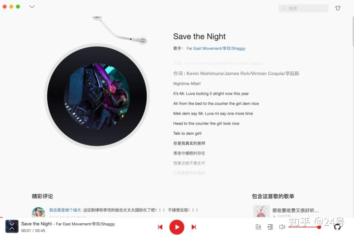
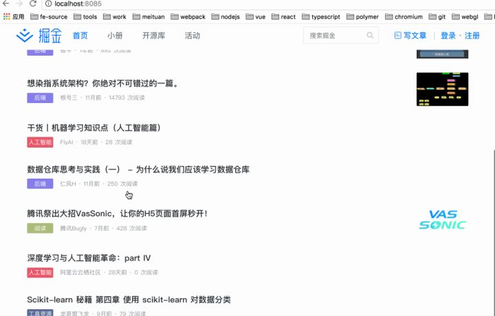
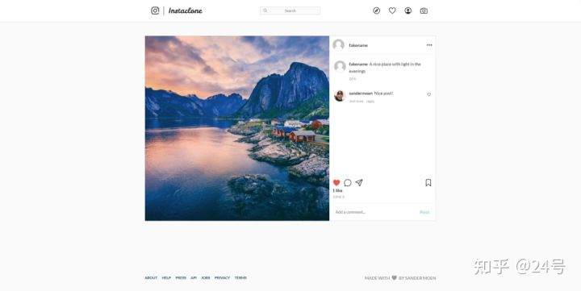
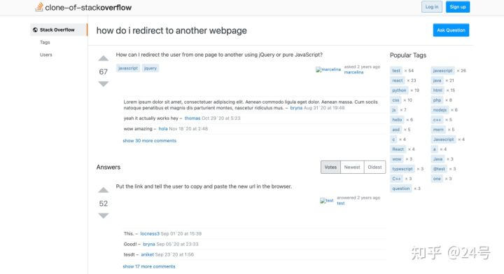
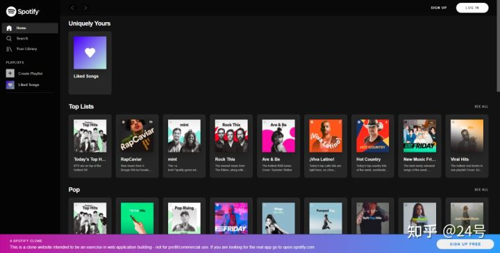

**概览：**
  

1. 高仿QQ音乐（Vue）
2. 高仿网易云音乐（Vue）
3. 高仿网易云音乐（React）
4. 高仿B站（React）
5. 高仿掘金（Vue）
6. 高仿饿了么（Vue）
7. 高仿微信（Vue ）
8. 高仿 Instagram（React）
9. 高仿 Stackoverflow（React）
10. 高仿 Spotify（React）

## **1\. 高仿 QQ音乐（Vue）**
一个使用 Vue3+TS 开发的音乐播放器，界面模仿 QQ 音乐 Mac 客户端，支持黑夜模式。
  

  
**Github：**[https://github.com/SmallRuralDog/vue3-music](https://link.zhihu.com/?target=https%3A//github.com/SmallRuralDog/vue3-music)
  

## **2\. 高仿网易云音乐（Vue）**
一个基于 Vue2 和 Vue-CLI3 的高仿网易云 Mac 客户端播放器。使用了 Vue 全家桶、Sass、better-scroll、ElementUI 等技术实现。
  
该项目实现了mv 页、cd 页、搜索建议、搜索详情、播放、发现页、播放列表、播放记录、全部歌单、歌单详情、最新音乐、主题换肤功能、登录等功能。
  

  
**Github：**[https://github.com/sl1673495/vue-netease-music](https://link.zhihu.com/?target=https%3A//github.com/sl1673495/vue-netease-music)
  

## **3\. 高仿网易云音乐（React）**
一个基于 React、TypeScript 的高仿网易云 Mac 客户端播放器。使用 React Hook 做状态管理，没有使用额外的数据管理库。除此之外，还使用到了CSS Modules、Webpack、Graphql 等技术。
  
该项目实现了登录/登出、发现页、每日歌曲推荐页、全部歌单页、最新音乐页、歌单详情页、音乐播放详情页、播放记录、搜索、创建和收藏的歌单列表等功能。
  

  
**Github：**[https://github.com/uniquemo/react-netease-music](https://link.zhihu.com/?target=https%3A//github.com/uniquemo/react-netease-music)
  

## **4\. 高仿B站（React）**
高仿B站 Web 移动端，基于 SSR 服务端渲染模板，使用 React 16.8，Typescript 开发，后端服务使用 Express 实现。
  
该项目实现了首页、分类页、排行榜、搜索、视频详情页、 UP主页、个人中心、直播、直播列表、分类、直播间等功能。
  

  
**Github：**[https://github.com/dxx/react-bilibili](https://link.zhihu.com/?target=https%3A//github.com/dxx/react-bilibili)
  

## **5\. 高仿掘金（Vue）**
高仿掘金，整合 vue + nuxt + axios + vuex + vue-router，是一个基于 Nuxt 的服务器端渲染 Demo。
  
该项目实现了服务器端渲染、静态页面部署、掘金首页、掘金推荐列表、掘金小册、滚动分页加载、不同端的布局适配等功能。
  

  
**Github：**[https://github.com/xuqiang521/nuxt-ssr-demo](https://link.zhihu.com/?target=https%3A//github.com/xuqiang521/nuxt-ssr-demo)
  

## **6\. 高仿饿了么（Vue）**
一个使用 vue2 + vuex + vue-router + webpack + ES6/7 + fetch + sass + flex + svg 构建的具有 45 个页面的仿饿了么的大型单页面应用，包括注册、登录、商品展示、购物车、下单等功能。
  

  
**Github：**[https://github.com/bailicangdu/vue2-elm](https://link.zhihu.com/?target=https%3A//github.com/bailicangdu/vue2-elm)
  

## **7\. 高仿微信（Vue ）**
一个基于 Vue.js 2.0 的高仿微信 App 的单页应用，使用 Vue.js2.0 框架，搭配样式库 WeUI，模仿微信 app 的样式和交互。
  

  
**Github：**[https://github.com/zhaohaodang/vue-WeChat](https://link.zhihu.com/?target=https%3A//github.com/zhaohaodang/vue-WeChat)
  

## **8\. 高仿 Instagram（React）**
一个仿 Instagram 项目，前端使用 React、状态管理使用 Redux、路由使用 React Router、表格管理使用 Formik、动画使用 React Spring、Websocket管理使用 [http://Socket.io](https://link.zhihu.com/?target=http%3A//Socket.io)、后端使用 Express、数据库使用 MongoDB。
  

  
**Github：**[https://github.com/Sandermoen/instaclone](https://link.zhihu.com/?target=https%3A//github.com/Sandermoen/instaclone)
  

## **9\. 高仿 Stackoverflow（React）**
这个项目是 Stackoverflow 的一个简化版的全栈克隆。使用 ReactJs、NextJs、Storybook、PostCSS、NodeJs、Express、MongoDB、Mongoose 等技术实现。
  

  
**Github：**[https://github.com/salihozdemir/stackoverflow-clone](https://link.zhihu.com/?target=https%3A//github.com/salihozdemir/stackoverflow-clone)
  

## **10\. 高仿 Spotify（React）**
一个 Spotify Web 播放器的前端克隆项目。使用 React (create-react-app CLI)、react-router-dom、axios 等技术实现。
  

  
**Giuhub：**[https://github.com/JL978/spotify-clone-client](https://link.zhihu.com/?target=https%3A//github.com/JL978/spotify-clone-client)

> 当前文档由 [markdown文档下载插件](https://github.com/kscript/markdown-download) 下载, 原文链接: [10 个 GitHub 上的前端高仿项目](https://zhuanlan.zhihu.com/p/556394024)  