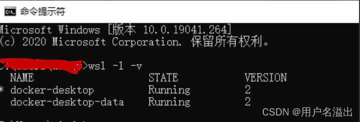
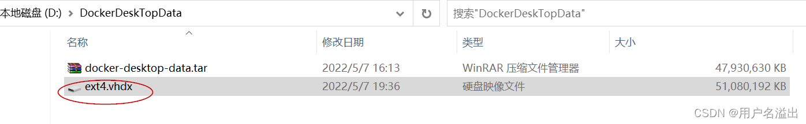

<link />

使用[docker](https://so.csdn.net/so/search?q=docker&spm=1001.2101.3001.7020)的时候，发现自己C盘飙红了，自己没有往C盘里面放什么东西，怎么会耗尽了磁盘，查找发现，是这个文件夹下暂用较多：

C:\\Users\\Administrator\\AppData\\Local\\Docker

里面是docker相关的东西，看官网说明，原来，启用WSL后，docker运行数据都在WSL发行版中，文件位置都只能由WSL管理！

安装docker后，docker会自动创建2个发行版

* docker-desktop
* docker-desktop-data



WSL发行版默认都是安装在C盘，在%LOCALAPPDATA%/Docker/wsl目录  
docker的运行数据、镜像文件都存在%LOCALAPPDATA%/Docker/wsl/data/ext4.vhdx中，这对C盘空间紧张的人非常不友好。。。

网上查了一下WSL是可以进行迁移的

下面是方法：

1\. 关闭docker

2\. 关闭所有发行版：`wsl --shutdown`

3\. 将docker-desktop-data导出到D:\\DockerDeskTopData\\docker-desktop-data.tar

（网上有说，原有的docker images不会一起导出，但是实际使用发现也是导出了，不知道是不是理解错误）这个时间较长，且比较占用[内存](https://so.csdn.net/so/search?q=%E5%86%85%E5%AD%98&spm=1001.2101.3001.7020)（请耐心等待）

```javascript
wsl --export docker-desktop-data D:\DockerDeskTopData\docker-desktop-data.tar
```

4\. 注销docker-desktop-data：`wsl --unregister docker-desktop-data`


5\. 重新导入docker-desktop-data到要存放的文件夹：D:\\DockerDeskTopData\\

（注意，导入到自己磁盘空间较大的盘符）

```javascript
wsl --import docker-desktop-data D:\DockerDeskTopData\ D:\DockerDeskTopData\docker-desktop-data.tar --version 2
```

这个时间较长，且比较占用内存（请耐心等待）

6\. 完成迁移后，原来的ext4.vhdx就迁移到新目录了，然后发现自己C盘顺眼多了。



7\. 重启docker发现里面的image和容器都还在

> 当前文档由 [markdown文档下载插件](https://github.com/kscript/markdown-download) 下载, 原文链接: [Docker占用C盘大问题](https://blog.csdn.net/bocai1215/article/details/124638014)  