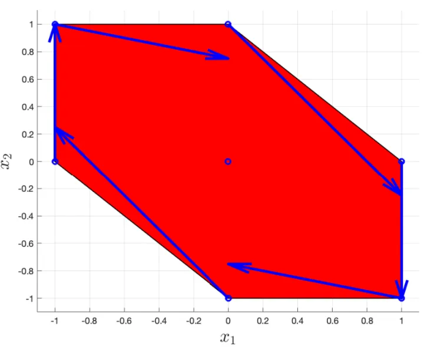

> 本系列主要基于荷兰代尔夫特理工大学机械、海事、材料学院（3mE）代尔夫特系统控制中心（Delft Center for Systems and Control），Sergio Grammatico 教授开设的模型预测控制（Model Predictive Control or MPC）硕士课程，由[@人民叫失](https://www.zhihu.com/people/liu-xian-zhong-22-7) [@SailorBrandon](https://www.zhihu.com/people/han-shao-hang-68) [@Rambled](https://www.zhihu.com/people/rambled) [@Smoggy](https://www.zhihu.com/people/smoggy-28) 和 [@苏飞飞](https://www.zhihu.com/people/eee-28-90) 共同整理完成。才疏学浅，如有纰漏，望各位同行斧正。
本章首先简要的介绍一下本文的主要内容以及一些基本概念，随后提出稳定性理论。
  

## 目录

* [\[MPC\] Lec 1 简介和稳定性理论](https://zhuanlan.zhihu.com/p/506342644/edit#mpc-lec-1-%E7%AE%80%E4%BB%8B%E5%92%8C%E7%A8%B3%E5%AE%9A%E6%80%A7%E7%90%86%E8%AE%BA)
  
  
  
  

## 1.1 简介
本节给出了 MPC 的模糊定义和离散动力系统的基本概念。
  

### 1.1.1 什么是模型预测控制（MPC）？
  
模型预测控制主要包括两个部分，第一个部分是预测模型（prediction model），第二个部分是最优化算法（optimization algorithm）。预测模型的主要作用是预测未来可能发生的情况，而最优化算法可以根据其预测来计算出最优控制输入。
  
  
MPC 在应用上比较重要的一个思想就是滚动时域策略（Receding horizon policy）。举个例子，对于一个离散 MPC 要解决的控制任务，我们需要让测量到的输出（measured output）尽可能的贴近参考输出（reference output）。MPC 通过预测模型给出了未来的预测输出（predicted output）和可以达到该预测输出的预测（最佳）控制输入（predicted control input）。而滚动时域即限制预测输出的时域范围，从当前时间到正无穷远的时间改为从当前时间到未来某一刻时间（k+N），N 即为 Horizon。通过滚动时域这一技巧，最优化问题可以更快的解决。我们将得到的最佳控制输入的第一项作为实际控制输入输入系统之后，系统将会更新。通过不断地重复这一过程，我们可以不断地使得输出更加贴近参考输出，这就是滚动时域的基本思想。
  
  
  
然后让我们简单的谈一谈一些 MPC 的实际应用，例如 GPS 导航应用实时规划最优路径和国际象棋等游戏 AI。GPS 导航应用在获得你当前的位置后会不断地重新规划最优路径，而我们一般也会执行其给出的建议（最优控制输入）。国际象棋 AI（比如说 deterministic，即没有随机性）也不断地根据你当前的落子来得到最优解。
  
工业上的应用则更为广泛，比如最早应用 MPC 的过程控制 \[1\]，\[2\] 当时已经可以满足实时性需求；航空航天 \[3\]， \[4\] 上通过 MPC 对能源使用进行优化，实时性已经可以达到秒级；自动驾驶方面也有很多高实时性（0.1s）的应用 \[5\] - \[8\]；其他还包括自来水供水 \[9\]，建筑基于天气情况的安排 \[10\]，\[11\]，电网 \[12\]，\[13\] 等。
  
总的来说，MPC 的最主要优点在于其能应对很多不同的约束，并且能保证一定程度的最优性，而且目前已经比较成熟，有充分的应用实例。然而其需要比较精准的控制系统模型，而且需要进行实时运算，在小算力平台上可能导致一些问题。
  

### 1.1.2 基础概念：离散动力系统（Discrete-time dynamical systems）
形如前文中 <mjx-container class="MathJax CtxtMenu_Attached_0" jax="SVG" display="true" tabindex="0" ctxtmenu_counter="0" data-tex="x(k+1)=f(x(k),u(k))" style="position: relative; display: inline;"><svg xmlns="http://www.w3.org/2000/svg" width="23.624ex" height="2.262ex" role="img" focusable="false" viewBox="0 -750 10441.7 1000" xmlns:xlink="http://www.w3.org/1999/xlink" aria-hidden="true" style="vertical-align: -0.566ex;"><defs><path id="MJX-1-TEX-I-1D465" d="M52 289Q59 331 106 386T222 442Q257 442 286 424T329 379Q371 442 430 442Q467 442 494 420T522 361Q522 332 508 314T481 292T458 288Q439 288 427 299T415 328Q415 374 465 391Q454 404 425 404Q412 404 406 402Q368 386 350 336Q290 115 290 78Q290 50 306 38T341 26Q378 26 414 59T463 140Q466 150 469 151T485 153H489Q504 153 504 145Q504 144 502 134Q486 77 440 33T333 -11Q263 -11 227 52Q186 -10 133 -10H127Q78 -10 57 16T35 71Q35 103 54 123T99 143Q142 143 142 101Q142 81 130 66T107 46T94 41L91 40Q91 39 97 36T113 29T132 26Q168 26 194 71Q203 87 217 139T245 247T261 313Q266 340 266 352Q266 380 251 392T217 404Q177 404 142 372T93 290Q91 281 88 280T72 278H58Q52 284 52 289Z"></path><path id="MJX-1-TEX-N-28" d="M94 250Q94 319 104 381T127 488T164 576T202 643T244 695T277 729T302 750H315H319Q333 750 333 741Q333 738 316 720T275 667T226 581T184 443T167 250T184 58T225 -81T274 -167T316 -220T333 -241Q333 -250 318 -250H315H302L274 -226Q180 -141 137 -14T94 250Z"></path><path id="MJX-1-TEX-I-1D458" d="M121 647Q121 657 125 670T137 683Q138 683 209 688T282 694Q294 694 294 686Q294 679 244 477Q194 279 194 272Q213 282 223 291Q247 309 292 354T362 415Q402 442 438 442Q468 442 485 423T503 369Q503 344 496 327T477 302T456 291T438 288Q418 288 406 299T394 328Q394 353 410 369T442 390L458 393Q446 405 434 405H430Q398 402 367 380T294 316T228 255Q230 254 243 252T267 246T293 238T320 224T342 206T359 180T365 147Q365 130 360 106T354 66Q354 26 381 26Q429 26 459 145Q461 153 479 153H483Q499 153 499 144Q499 139 496 130Q455 -11 378 -11Q333 -11 305 15T277 90Q277 108 280 121T283 145Q283 167 269 183T234 206T200 217T182 220H180Q168 178 159 139T145 81T136 44T129 20T122 7T111 -2Q98 -11 83 -11Q66 -11 57 -1T48 16Q48 26 85 176T158 471L195 616Q196 629 188 632T149 637H144Q134 637 131 637T124 640T121 647Z"></path><path id="MJX-1-TEX-N-2B" d="M56 237T56 250T70 270H369V420L370 570Q380 583 389 583Q402 583 409 568V270H707Q722 262 722 250T707 230H409V-68Q401 -82 391 -82H389H387Q375 -82 369 -68V230H70Q56 237 56 250Z"></path><path id="MJX-1-TEX-N-31" d="M213 578L200 573Q186 568 160 563T102 556H83V602H102Q149 604 189 617T245 641T273 663Q275 666 285 666Q294 666 302 660V361L303 61Q310 54 315 52T339 48T401 46H427V0H416Q395 3 257 3Q121 3 100 0H88V46H114Q136 46 152 46T177 47T193 50T201 52T207 57T213 61V578Z"></path><path id="MJX-1-TEX-N-29" d="M60 749L64 750Q69 750 74 750H86L114 726Q208 641 251 514T294 250Q294 182 284 119T261 12T224 -76T186 -143T145 -194T113 -227T90 -246Q87 -249 86 -250H74Q66 -250 63 -250T58 -247T55 -238Q56 -237 66 -225Q221 -64 221 250T66 725Q56 737 55 738Q55 746 60 749Z"></path><path id="MJX-1-TEX-N-3D" d="M56 347Q56 360 70 367H707Q722 359 722 347Q722 336 708 328L390 327H72Q56 332 56 347ZM56 153Q56 168 72 173H708Q722 163 722 153Q722 140 707 133H70Q56 140 56 153Z"></path><path id="MJX-1-TEX-I-1D453" d="M118 -162Q120 -162 124 -164T135 -167T147 -168Q160 -168 171 -155T187 -126Q197 -99 221 27T267 267T289 382V385H242Q195 385 192 387Q188 390 188 397L195 425Q197 430 203 430T250 431Q298 431 298 432Q298 434 307 482T319 540Q356 705 465 705Q502 703 526 683T550 630Q550 594 529 578T487 561Q443 561 443 603Q443 622 454 636T478 657L487 662Q471 668 457 668Q445 668 434 658T419 630Q412 601 403 552T387 469T380 433Q380 431 435 431Q480 431 487 430T498 424Q499 420 496 407T491 391Q489 386 482 386T428 385H372L349 263Q301 15 282 -47Q255 -132 212 -173Q175 -205 139 -205Q107 -205 81 -186T55 -132Q55 -95 76 -78T118 -61Q162 -61 162 -103Q162 -122 151 -136T127 -157L118 -162Z"></path><path id="MJX-1-TEX-N-2C" d="M78 35T78 60T94 103T137 121Q165 121 187 96T210 8Q210 -27 201 -60T180 -117T154 -158T130 -185T117 -194Q113 -194 104 -185T95 -172Q95 -168 106 -156T131 -126T157 -76T173 -3V9L172 8Q170 7 167 6T161 3T152 1T140 0Q113 0 96 17Z"></path><path id="MJX-1-TEX-I-1D462" d="M21 287Q21 295 30 318T55 370T99 420T158 442Q204 442 227 417T250 358Q250 340 216 246T182 105Q182 62 196 45T238 27T291 44T328 78L339 95Q341 99 377 247Q407 367 413 387T427 416Q444 431 463 431Q480 431 488 421T496 402L420 84Q419 79 419 68Q419 43 426 35T447 26Q469 29 482 57T512 145Q514 153 532 153Q551 153 551 144Q550 139 549 130T540 98T523 55T498 17T462 -8Q454 -10 438 -10Q372 -10 347 46Q345 45 336 36T318 21T296 6T267 -6T233 -11Q189 -11 155 7Q103 38 103 113Q103 170 138 262T173 379Q173 380 173 381Q173 390 173 393T169 400T158 404H154Q131 404 112 385T82 344T65 302T57 280Q55 278 41 278H27Q21 284 21 287Z"></path></defs><g stroke="currentColor" fill="currentColor" stroke-width="0" transform="scale(1,-1)"><g data-mml-node="math"><g data-mml-node="mi"><use data-c="1D465" xlink:href="#MJX-1-TEX-I-1D465"></use></g><g data-mml-node="mo" transform="translate(572,0)"><use data-c="28" xlink:href="#MJX-1-TEX-N-28"></use></g><g data-mml-node="mi" transform="translate(961,0)"><use data-c="1D458" xlink:href="#MJX-1-TEX-I-1D458"></use></g><g data-mml-node="mo" transform="translate(1704.2,0)"><use data-c="2B" xlink:href="#MJX-1-TEX-N-2B"></use></g><g data-mml-node="mn" transform="translate(2704.4,0)"><use data-c="31" xlink:href="#MJX-1-TEX-N-31"></use></g><g data-mml-node="mo" transform="translate(3204.4,0)"><use data-c="29" xlink:href="#MJX-1-TEX-N-29"></use></g><g data-mml-node="mo" transform="translate(3871.2,0)"><use data-c="3D" xlink:href="#MJX-1-TEX-N-3D"></use></g><g data-mml-node="mi" transform="translate(4927,0)"><use data-c="1D453" xlink:href="#MJX-1-TEX-I-1D453"></use></g><g data-mml-node="mo" transform="translate(5477,0)"><use data-c="28" xlink:href="#MJX-1-TEX-N-28"></use></g><g data-mml-node="mi" transform="translate(5866,0)"><use data-c="1D465" xlink:href="#MJX-1-TEX-I-1D465"></use></g><g data-mml-node="mo" transform="translate(6438,0)"><use data-c="28" xlink:href="#MJX-1-TEX-N-28"></use></g><g data-mml-node="mi" transform="translate(6827,0)"><use data-c="1D458" xlink:href="#MJX-1-TEX-I-1D458"></use></g><g data-mml-node="mo" transform="translate(7348,0)"><use data-c="29" xlink:href="#MJX-1-TEX-N-29"></use></g><g data-mml-node="mo" transform="translate(7737,0)"><use data-c="2C" xlink:href="#MJX-1-TEX-N-2C"></use></g><g data-mml-node="mi" transform="translate(8181.7,0)"><use data-c="1D462" xlink:href="#MJX-1-TEX-I-1D462"></use></g><g data-mml-node="mo" transform="translate(8753.7,0)"><use data-c="28" xlink:href="#MJX-1-TEX-N-28"></use></g><g data-mml-node="mi" transform="translate(9142.7,0)"><use data-c="1D458" xlink:href="#MJX-1-TEX-I-1D458"></use></g><g data-mml-node="mo" transform="translate(9663.7,0)"><use data-c="29" xlink:href="#MJX-1-TEX-N-29"></use></g><g data-mml-node="mo" transform="translate(10052.7,0)"><use data-c="29" xlink:href="#MJX-1-TEX-N-29"></use></g></g></g></svg><mjx-assistive-mml unselectable="on" display="block"><math xmlns="http://www.w3.org/1998/Math/MathML" display="block"><mi>x</mi><mo stretchy="false">(</mo><mi>k</mi><mo>+</mo><mn>1</mn><mo stretchy="false">)</mo><mo>=</mo><mi>f</mi><mo stretchy="false">(</mo><mi>x</mi><mo stretchy="false">(</mo><mi>k</mi><mo stretchy="false">)</mo><mo>,</mo><mi>u</mi><mo stretchy="false">(</mo><mi>k</mi><mo stretchy="false">)</mo><mo stretchy="false">)</mo></math></mjx-assistive-mml></mjx-container> 的表达即代表离散动力系统的状态空间形式（state space form），
  
<mjx-container class="MathJax CtxtMenu_Attached_0" jax="SVG" display="true" tabindex="0" ctxtmenu_counter="1" data-tex="\begin{equation}\begin{aligned}x(k+1) &amp;= f(x(k),u(k))\\y(k) &amp;= h(x(k),u(k))\\x(0) &amp;= x\_{0}\\\end{aligned}\end{equation}" style="position: relative; display: inline;"><svg xmlns="http://www.w3.org/2000/svg" width="23.683ex" height="8.145ex" role="img" focusable="false" viewBox="0 -2050 10467.7 3600" xmlns:xlink="http://www.w3.org/1999/xlink" aria-hidden="true" style="vertical-align: -3.507ex;"><defs><path id="MJX-2-TEX-I-1D465" d="M52 289Q59 331 106 386T222 442Q257 442 286 424T329 379Q371 442 430 442Q467 442 494 420T522 361Q522 332 508 314T481 292T458 288Q439 288 427 299T415 328Q415 374 465 391Q454 404 425 404Q412 404 406 402Q368 386 350 336Q290 115 290 78Q290 50 306 38T341 26Q378 26 414 59T463 140Q466 150 469 151T485 153H489Q504 153 504 145Q504 144 502 134Q486 77 440 33T333 -11Q263 -11 227 52Q186 -10 133 -10H127Q78 -10 57 16T35 71Q35 103 54 123T99 143Q142 143 142 101Q142 81 130 66T107 46T94 41L91 40Q91 39 97 36T113 29T132 26Q168 26 194 71Q203 87 217 139T245 247T261 313Q266 340 266 352Q266 380 251 392T217 404Q177 404 142 372T93 290Q91 281 88 280T72 278H58Q52 284 52 289Z"></path><path id="MJX-2-TEX-N-28" d="M94 250Q94 319 104 381T127 488T164 576T202 643T244 695T277 729T302 750H315H319Q333 750 333 741Q333 738 316 720T275 667T226 581T184 443T167 250T184 58T225 -81T274 -167T316 -220T333 -241Q333 -250 318 -250H315H302L274 -226Q180 -141 137 -14T94 250Z"></path><path id="MJX-2-TEX-I-1D458" d="M121 647Q121 657 125 670T137 683Q138 683 209 688T282 694Q294 694 294 686Q294 679 244 477Q194 279 194 272Q213 282 223 291Q247 309 292 354T362 415Q402 442 438 442Q468 442 485 423T503 369Q503 344 496 327T477 302T456 291T438 288Q418 288 406 299T394 328Q394 353 410 369T442 390L458 393Q446 405 434 405H430Q398 402 367 380T294 316T228 255Q230 254 243 252T267 246T293 238T320 224T342 206T359 180T365 147Q365 130 360 106T354 66Q354 26 381 26Q429 26 459 145Q461 153 479 153H483Q499 153 499 144Q499 139 496 130Q455 -11 378 -11Q333 -11 305 15T277 90Q277 108 280 121T283 145Q283 167 269 183T234 206T200 217T182 220H180Q168 178 159 139T145 81T136 44T129 20T122 7T111 -2Q98 -11 83 -11Q66 -11 57 -1T48 16Q48 26 85 176T158 471L195 616Q196 629 188 632T149 637H144Q134 637 131 637T124 640T121 647Z"></path><path id="MJX-2-TEX-N-2B" d="M56 237T56 250T70 270H369V420L370 570Q380 583 389 583Q402 583 409 568V270H707Q722 262 722 250T707 230H409V-68Q401 -82 391 -82H389H387Q375 -82 369 -68V230H70Q56 237 56 250Z"></path><path id="MJX-2-TEX-N-31" d="M213 578L200 573Q186 568 160 563T102 556H83V602H102Q149 604 189 617T245 641T273 663Q275 666 285 666Q294 666 302 660V361L303 61Q310 54 315 52T339 48T401 46H427V0H416Q395 3 257 3Q121 3 100 0H88V46H114Q136 46 152 46T177 47T193 50T201 52T207 57T213 61V578Z"></path><path id="MJX-2-TEX-N-29" d="M60 749L64 750Q69 750 74 750H86L114 726Q208 641 251 514T294 250Q294 182 284 119T261 12T224 -76T186 -143T145 -194T113 -227T90 -246Q87 -249 86 -250H74Q66 -250 63 -250T58 -247T55 -238Q56 -237 66 -225Q221 -64 221 250T66 725Q56 737 55 738Q55 746 60 749Z"></path><path id="MJX-2-TEX-N-3D" d="M56 347Q56 360 70 367H707Q722 359 722 347Q722 336 708 328L390 327H72Q56 332 56 347ZM56 153Q56 168 72 173H708Q722 163 722 153Q722 140 707 133H70Q56 140 56 153Z"></path><path id="MJX-2-TEX-I-1D453" d="M118 -162Q120 -162 124 -164T135 -167T147 -168Q160 -168 171 -155T187 -126Q197 -99 221 27T267 267T289 382V385H242Q195 385 192 387Q188 390 188 397L195 425Q197 430 203 430T250 431Q298 431 298 432Q298 434 307 482T319 540Q356 705 465 705Q502 703 526 683T550 630Q550 594 529 578T487 561Q443 561 443 603Q443 622 454 636T478 657L487 662Q471 668 457 668Q445 668 434 658T419 630Q412 601 403 552T387 469T380 433Q380 431 435 431Q480 431 487 430T498 424Q499 420 496 407T491 391Q489 386 482 386T428 385H372L349 263Q301 15 282 -47Q255 -132 212 -173Q175 -205 139 -205Q107 -205 81 -186T55 -132Q55 -95 76 -78T118 -61Q162 -61 162 -103Q162 -122 151 -136T127 -157L118 -162Z"></path><path id="MJX-2-TEX-N-2C" d="M78 35T78 60T94 103T137 121Q165 121 187 96T210 8Q210 -27 201 -60T180 -117T154 -158T130 -185T117 -194Q113 -194 104 -185T95 -172Q95 -168 106 -156T131 -126T157 -76T173 -3V9L172 8Q170 7 167 6T161 3T152 1T140 0Q113 0 96 17Z"></path><path id="MJX-2-TEX-I-1D462" d="M21 287Q21 295 30 318T55 370T99 420T158 442Q204 442 227 417T250 358Q250 340 216 246T182 105Q182 62 196 45T238 27T291 44T328 78L339 95Q341 99 377 247Q407 367 413 387T427 416Q444 431 463 431Q480 431 488 421T496 402L420 84Q419 79 419 68Q419 43 426 35T447 26Q469 29 482 57T512 145Q514 153 532 153Q551 153 551 144Q550 139 549 130T540 98T523 55T498 17T462 -8Q454 -10 438 -10Q372 -10 347 46Q345 45 336 36T318 21T296 6T267 -6T233 -11Q189 -11 155 7Q103 38 103 113Q103 170 138 262T173 379Q173 380 173 381Q173 390 173 393T169 400T158 404H154Q131 404 112 385T82 344T65 302T57 280Q55 278 41 278H27Q21 284 21 287Z"></path><path id="MJX-2-TEX-I-1D466" d="M21 287Q21 301 36 335T84 406T158 442Q199 442 224 419T250 355Q248 336 247 334Q247 331 231 288T198 191T182 105Q182 62 196 45T238 27Q261 27 281 38T312 61T339 94Q339 95 344 114T358 173T377 247Q415 397 419 404Q432 431 462 431Q475 431 483 424T494 412T496 403Q496 390 447 193T391 -23Q363 -106 294 -155T156 -205Q111 -205 77 -183T43 -117Q43 -95 50 -80T69 -58T89 -48T106 -45Q150 -45 150 -87Q150 -107 138 -122T115 -142T102 -147L99 -148Q101 -153 118 -160T152 -167H160Q177 -167 186 -165Q219 -156 247 -127T290 -65T313 -9T321 21L315 17Q309 13 296 6T270 -6Q250 -11 231 -11Q185 -11 150 11T104 82Q103 89 103 113Q103 170 138 262T173 379Q173 380 173 381Q173 390 173 393T169 400T158 404H154Q131 404 112 385T82 344T65 302T57 280Q55 278 41 278H27Q21 284 21 287Z"></path><path id="MJX-2-TEX-I-210E" d="M137 683Q138 683 209 688T282 694Q294 694 294 685Q294 674 258 534Q220 386 220 383Q220 381 227 388Q288 442 357 442Q411 442 444 415T478 336Q478 285 440 178T402 50Q403 36 407 31T422 26Q450 26 474 56T513 138Q516 149 519 151T535 153Q555 153 555 145Q555 144 551 130Q535 71 500 33Q466 -10 419 -10H414Q367 -10 346 17T325 74Q325 90 361 192T398 345Q398 404 354 404H349Q266 404 205 306L198 293L164 158Q132 28 127 16Q114 -11 83 -11Q69 -11 59 -2T48 16Q48 30 121 320L195 616Q195 629 188 632T149 637H128Q122 643 122 645T124 664Q129 683 137 683Z"></path><path id="MJX-2-TEX-N-30" d="M96 585Q152 666 249 666Q297 666 345 640T423 548Q460 465 460 320Q460 165 417 83Q397 41 362 16T301 -15T250 -22Q224 -22 198 -16T137 16T82 83Q39 165 39 320Q39 494 96 585ZM321 597Q291 629 250 629Q208 629 178 597Q153 571 145 525T137 333Q137 175 145 125T181 46Q209 16 250 16Q290 16 318 46Q347 76 354 130T362 333Q362 478 354 524T321 597Z"></path><path id="MJX-2-TEX-N-5F" d="M0 -62V-25H499V-62H0Z"></path></defs><g stroke="currentColor" fill="currentColor" stroke-width="0" transform="scale(1,-1)"><g data-mml-node="math"><g data-mml-node="mtable"><g data-mml-node="mtr" transform="translate(0,1300)"><g data-mml-node="mtd"><g data-mml-node="mi"><use data-c="1D465" xlink:href="#MJX-2-TEX-I-1D465"></use></g><g data-mml-node="mo" transform="translate(572,0)"><use data-c="28" xlink:href="#MJX-2-TEX-N-28"></use></g><g data-mml-node="mi" transform="translate(961,0)"><use data-c="1D458" xlink:href="#MJX-2-TEX-I-1D458"></use></g><g data-mml-node="mo" transform="translate(1704.2,0)"><use data-c="2B" xlink:href="#MJX-2-TEX-N-2B"></use></g><g data-mml-node="mn" transform="translate(2704.4,0)"><use data-c="31" xlink:href="#MJX-2-TEX-N-31"></use></g><g data-mml-node="mo" transform="translate(3204.4,0)"><use data-c="29" xlink:href="#MJX-2-TEX-N-29"></use></g></g><g data-mml-node="mtd" transform="translate(3593.4,0)"><g data-mml-node="mi"></g><g data-mml-node="mo" transform="translate(277.8,0)"><use data-c="3D" xlink:href="#MJX-2-TEX-N-3D"></use></g><g data-mml-node="mi" transform="translate(1333.6,0)"><use data-c="1D453" xlink:href="#MJX-2-TEX-I-1D453"></use></g><g data-mml-node="mo" transform="translate(1883.6,0)"><use data-c="28" xlink:href="#MJX-2-TEX-N-28"></use></g><g data-mml-node="mi" transform="translate(2272.6,0)"><use data-c="1D465" xlink:href="#MJX-2-TEX-I-1D465"></use></g><g data-mml-node="mo" transform="translate(2844.6,0)"><use data-c="28" xlink:href="#MJX-2-TEX-N-28"></use></g><g data-mml-node="mi" transform="translate(3233.6,0)"><use data-c="1D458" xlink:href="#MJX-2-TEX-I-1D458"></use></g><g data-mml-node="mo" transform="translate(3754.6,0)"><use data-c="29" xlink:href="#MJX-2-TEX-N-29"></use></g><g data-mml-node="mo" transform="translate(4143.6,0)"><use data-c="2C" xlink:href="#MJX-2-TEX-N-2C"></use></g><g data-mml-node="mi" transform="translate(4588.2,0)"><use data-c="1D462" xlink:href="#MJX-2-TEX-I-1D462"></use></g><g data-mml-node="mo" transform="translate(5160.2,0)"><use data-c="28" xlink:href="#MJX-2-TEX-N-28"></use></g><g data-mml-node="mi" transform="translate(5549.2,0)"><use data-c="1D458" xlink:href="#MJX-2-TEX-I-1D458"></use></g><g data-mml-node="mo" transform="translate(6070.2,0)"><use data-c="29" xlink:href="#MJX-2-TEX-N-29"></use></g><g data-mml-node="mo" transform="translate(6459.2,0)"><use data-c="29" xlink:href="#MJX-2-TEX-N-29"></use></g></g></g><g data-mml-node="mtr" transform="translate(0,0)"><g data-mml-node="mtd" transform="translate(1804.4,0)"><g data-mml-node="mi"><use data-c="1D466" xlink:href="#MJX-2-TEX-I-1D466"></use></g><g data-mml-node="mo" transform="translate(490,0)"><use data-c="28" xlink:href="#MJX-2-TEX-N-28"></use></g><g data-mml-node="mi" transform="translate(879,0)"><use data-c="1D458" xlink:href="#MJX-2-TEX-I-1D458"></use></g><g data-mml-node="mo" transform="translate(1400,0)"><use data-c="29" xlink:href="#MJX-2-TEX-N-29"></use></g></g><g data-mml-node="mtd" transform="translate(3593.4,0)"><g data-mml-node="mi"></g><g data-mml-node="mo" transform="translate(277.8,0)"><use data-c="3D" xlink:href="#MJX-2-TEX-N-3D"></use></g><g data-mml-node="mi" transform="translate(1333.6,0)"><use data-c="210E" xlink:href="#MJX-2-TEX-I-210E"></use></g><g data-mml-node="mo" transform="translate(1909.6,0)"><use data-c="28" xlink:href="#MJX-2-TEX-N-28"></use></g><g data-mml-node="mi" transform="translate(2298.6,0)"><use data-c="1D465" xlink:href="#MJX-2-TEX-I-1D465"></use></g><g data-mml-node="mo" transform="translate(2870.6,0)"><use data-c="28" xlink:href="#MJX-2-TEX-N-28"></use></g><g data-mml-node="mi" transform="translate(3259.6,0)"><use data-c="1D458" xlink:href="#MJX-2-TEX-I-1D458"></use></g><g data-mml-node="mo" transform="translate(3780.6,0)"><use data-c="29" xlink:href="#MJX-2-TEX-N-29"></use></g><g data-mml-node="mo" transform="translate(4169.6,0)"><use data-c="2C" xlink:href="#MJX-2-TEX-N-2C"></use></g><g data-mml-node="mi" transform="translate(4614.2,0)"><use data-c="1D462" xlink:href="#MJX-2-TEX-I-1D462"></use></g><g data-mml-node="mo" transform="translate(5186.2,0)"><use data-c="28" xlink:href="#MJX-2-TEX-N-28"></use></g><g data-mml-node="mi" transform="translate(5575.2,0)"><use data-c="1D458" xlink:href="#MJX-2-TEX-I-1D458"></use></g><g data-mml-node="mo" transform="translate(6096.2,0)"><use data-c="29" xlink:href="#MJX-2-TEX-N-29"></use></g><g data-mml-node="mo" transform="translate(6485.2,0)"><use data-c="29" xlink:href="#MJX-2-TEX-N-29"></use></g></g></g><g data-mml-node="mtr" transform="translate(0,-1300)"><g data-mml-node="mtd" transform="translate(1743.4,0)"><g data-mml-node="mi"><use data-c="1D465" xlink:href="#MJX-2-TEX-I-1D465"></use></g><g data-mml-node="mo" transform="translate(572,0)"><use data-c="28" xlink:href="#MJX-2-TEX-N-28"></use></g><g data-mml-node="mn" transform="translate(961,0)"><use data-c="30" xlink:href="#MJX-2-TEX-N-30"></use></g><g data-mml-node="mo" transform="translate(1461,0)"><use data-c="29" xlink:href="#MJX-2-TEX-N-29"></use></g></g><g data-mml-node="mtd" transform="translate(3593.4,0)"><g data-mml-node="mi"></g><g data-mml-node="mo" transform="translate(277.8,0)"><use data-c="3D" xlink:href="#MJX-2-TEX-N-3D"></use></g><g data-mml-node="mi" transform="translate(1333.6,0)"><use data-c="1D465" xlink:href="#MJX-2-TEX-I-1D465"></use></g><g data-mml-node="mi" transform="translate(1905.6,0)"><use data-c="5F" xlink:href="#MJX-2-TEX-N-5F"></use></g><g data-mml-node="TeXAtom" data-mjx-texclass="ORD" transform="translate(2405.6,0)"><g data-mml-node="mn"><use data-c="30" xlink:href="#MJX-2-TEX-N-30"></use></g></g></g></g></g></g></g></svg><mjx-assistive-mml unselectable="on" display="block"><math xmlns="http://www.w3.org/1998/Math/MathML" display="block"><mtable displaystyle="true" columnalign="right left" columnspacing="0em" rowspacing="3pt"><mtr><mtd><mi>x</mi><mo stretchy="false">(</mo><mi>k</mi><mo>+</mo><mn>1</mn><mo stretchy="false">)</mo></mtd><mtd><mi></mi><mo>=</mo><mi>f</mi><mo stretchy="false">(</mo><mi>x</mi><mo stretchy="false">(</mo><mi>k</mi><mo stretchy="false">)</mo><mo>,</mo><mi>u</mi><mo stretchy="false">(</mo><mi>k</mi><mo stretchy="false">)</mo><mo stretchy="false">)</mo></mtd></mtr><mtr><mtd><mi>y</mi><mo stretchy="false">(</mo><mi>k</mi><mo stretchy="false">)</mo></mtd><mtd><mi></mi><mo>=</mo><mi>h</mi><mo stretchy="false">(</mo><mi>x</mi><mo stretchy="false">(</mo><mi>k</mi><mo stretchy="false">)</mo><mo>,</mo><mi>u</mi><mo stretchy="false">(</mo><mi>k</mi><mo stretchy="false">)</mo><mo stretchy="false">)</mo></mtd></mtr><mtr><mtd><mi>x</mi><mo stretchy="false">(</mo><mn>0</mn><mo stretchy="false">)</mo></mtd><mtd><mi></mi><mo>=</mo><mi>x</mi><mi mathvariant="normal">_</mi><mrow data-mjx-texclass="ORD"><mn>0</mn></mrow></mtd></mtr></mtable></math></mjx-assistive-mml></mjx-container>
  
一个更简洁的表达将 <mjx-container class="MathJax CtxtMenu_Attached_0" jax="SVG" display="true" tabindex="0" ctxtmenu_counter="2" data-tex="x(k+1)" style="position: relative; display: inline;"><svg xmlns="http://www.w3.org/2000/svg" width="8.13ex" height="2.262ex" role="img" focusable="false" viewBox="0 -750 3593.4 1000" xmlns:xlink="http://www.w3.org/1999/xlink" aria-hidden="true" style="vertical-align: -0.566ex;"><defs><path id="MJX-3-TEX-I-1D465" d="M52 289Q59 331 106 386T222 442Q257 442 286 424T329 379Q371 442 430 442Q467 442 494 420T522 361Q522 332 508 314T481 292T458 288Q439 288 427 299T415 328Q415 374 465 391Q454 404 425 404Q412 404 406 402Q368 386 350 336Q290 115 290 78Q290 50 306 38T341 26Q378 26 414 59T463 140Q466 150 469 151T485 153H489Q504 153 504 145Q504 144 502 134Q486 77 440 33T333 -11Q263 -11 227 52Q186 -10 133 -10H127Q78 -10 57 16T35 71Q35 103 54 123T99 143Q142 143 142 101Q142 81 130 66T107 46T94 41L91 40Q91 39 97 36T113 29T132 26Q168 26 194 71Q203 87 217 139T245 247T261 313Q266 340 266 352Q266 380 251 392T217 404Q177 404 142 372T93 290Q91 281 88 280T72 278H58Q52 284 52 289Z"></path><path id="MJX-3-TEX-N-28" d="M94 250Q94 319 104 381T127 488T164 576T202 643T244 695T277 729T302 750H315H319Q333 750 333 741Q333 738 316 720T275 667T226 581T184 443T167 250T184 58T225 -81T274 -167T316 -220T333 -241Q333 -250 318 -250H315H302L274 -226Q180 -141 137 -14T94 250Z"></path><path id="MJX-3-TEX-I-1D458" d="M121 647Q121 657 125 670T137 683Q138 683 209 688T282 694Q294 694 294 686Q294 679 244 477Q194 279 194 272Q213 282 223 291Q247 309 292 354T362 415Q402 442 438 442Q468 442 485 423T503 369Q503 344 496 327T477 302T456 291T438 288Q418 288 406 299T394 328Q394 353 410 369T442 390L458 393Q446 405 434 405H430Q398 402 367 380T294 316T228 255Q230 254 243 252T267 246T293 238T320 224T342 206T359 180T365 147Q365 130 360 106T354 66Q354 26 381 26Q429 26 459 145Q461 153 479 153H483Q499 153 499 144Q499 139 496 130Q455 -11 378 -11Q333 -11 305 15T277 90Q277 108 280 121T283 145Q283 167 269 183T234 206T200 217T182 220H180Q168 178 159 139T145 81T136 44T129 20T122 7T111 -2Q98 -11 83 -11Q66 -11 57 -1T48 16Q48 26 85 176T158 471L195 616Q196 629 188 632T149 637H144Q134 637 131 637T124 640T121 647Z"></path><path id="MJX-3-TEX-N-2B" d="M56 237T56 250T70 270H369V420L370 570Q380 583 389 583Q402 583 409 568V270H707Q722 262 722 250T707 230H409V-68Q401 -82 391 -82H389H387Q375 -82 369 -68V230H70Q56 237 56 250Z"></path><path id="MJX-3-TEX-N-31" d="M213 578L200 573Q186 568 160 563T102 556H83V602H102Q149 604 189 617T245 641T273 663Q275 666 285 666Q294 666 302 660V361L303 61Q310 54 315 52T339 48T401 46H427V0H416Q395 3 257 3Q121 3 100 0H88V46H114Q136 46 152 46T177 47T193 50T201 52T207 57T213 61V578Z"></path><path id="MJX-3-TEX-N-29" d="M60 749L64 750Q69 750 74 750H86L114 726Q208 641 251 514T294 250Q294 182 284 119T261 12T224 -76T186 -143T145 -194T113 -227T90 -246Q87 -249 86 -250H74Q66 -250 63 -250T58 -247T55 -238Q56 -237 66 -225Q221 -64 221 250T66 725Q56 737 55 738Q55 746 60 749Z"></path></defs><g stroke="currentColor" fill="currentColor" stroke-width="0" transform="scale(1,-1)"><g data-mml-node="math"><g data-mml-node="mi"><use data-c="1D465" xlink:href="#MJX-3-TEX-I-1D465"></use></g><g data-mml-node="mo" transform="translate(572,0)"><use data-c="28" xlink:href="#MJX-3-TEX-N-28"></use></g><g data-mml-node="mi" transform="translate(961,0)"><use data-c="1D458" xlink:href="#MJX-3-TEX-I-1D458"></use></g><g data-mml-node="mo" transform="translate(1704.2,0)"><use data-c="2B" xlink:href="#MJX-3-TEX-N-2B"></use></g><g data-mml-node="mn" transform="translate(2704.4,0)"><use data-c="31" xlink:href="#MJX-3-TEX-N-31"></use></g><g data-mml-node="mo" transform="translate(3204.4,0)"><use data-c="29" xlink:href="#MJX-3-TEX-N-29"></use></g></g></g></svg><mjx-assistive-mml unselectable="on" display="block"><math xmlns="http://www.w3.org/1998/Math/MathML" display="block"><mi>x</mi><mo stretchy="false">(</mo><mi>k</mi><mo>+</mo><mn>1</mn><mo stretchy="false">)</mo></math></mjx-assistive-mml></mjx-container> 写作 <mjx-container class="MathJax CtxtMenu_Attached_0" jax="SVG" display="true" tabindex="0" ctxtmenu_counter="3" data-tex="x^+" style="position: relative; display: inline;"><svg xmlns="http://www.w3.org/2000/svg" width="2.727ex" height="1.892ex" role="img" focusable="false" viewBox="0 -825.2 1205.1 836.2" xmlns:xlink="http://www.w3.org/1999/xlink" aria-hidden="true" style="vertical-align: -0.025ex;"><defs><path id="MJX-4-TEX-I-1D465" d="M52 289Q59 331 106 386T222 442Q257 442 286 424T329 379Q371 442 430 442Q467 442 494 420T522 361Q522 332 508 314T481 292T458 288Q439 288 427 299T415 328Q415 374 465 391Q454 404 425 404Q412 404 406 402Q368 386 350 336Q290 115 290 78Q290 50 306 38T341 26Q378 26 414 59T463 140Q466 150 469 151T485 153H489Q504 153 504 145Q504 144 502 134Q486 77 440 33T333 -11Q263 -11 227 52Q186 -10 133 -10H127Q78 -10 57 16T35 71Q35 103 54 123T99 143Q142 143 142 101Q142 81 130 66T107 46T94 41L91 40Q91 39 97 36T113 29T132 26Q168 26 194 71Q203 87 217 139T245 247T261 313Q266 340 266 352Q266 380 251 392T217 404Q177 404 142 372T93 290Q91 281 88 280T72 278H58Q52 284 52 289Z"></path><path id="MJX-4-TEX-N-2B" d="M56 237T56 250T70 270H369V420L370 570Q380 583 389 583Q402 583 409 568V270H707Q722 262 722 250T707 230H409V-68Q401 -82 391 -82H389H387Q375 -82 369 -68V230H70Q56 237 56 250Z"></path></defs><g stroke="currentColor" fill="currentColor" stroke-width="0" transform="scale(1,-1)"><g data-mml-node="math"><g data-mml-node="msup"><g data-mml-node="mi"><use data-c="1D465" xlink:href="#MJX-4-TEX-I-1D465"></use></g><g data-mml-node="mo" transform="translate(605,413) scale(0.707)"><use data-c="2B" xlink:href="#MJX-4-TEX-N-2B"></use></g></g></g></g></svg><mjx-assistive-mml unselectable="on" display="block"><math xmlns="http://www.w3.org/1998/Math/MathML" display="block"><msup><mi>x</mi><mo>+</mo></msup></math></mjx-assistive-mml></mjx-container>，
  
<mjx-container class="MathJax CtxtMenu_Attached_0" jax="SVG" display="true" tabindex="0" ctxtmenu_counter="4" data-tex="\begin{equation}\begin{aligned}x^+ &amp;= f(x,u)\\y &amp;= h(x,u)\\x(0) &amp;= x\_{0}\\\end{aligned}\end{equation}" style="position: relative; display: inline;"><svg xmlns="http://www.w3.org/2000/svg" width="13.86ex" height="8.315ex" role="img" focusable="false" viewBox="0 -2087.6 6126.2 3675.2" xmlns:xlink="http://www.w3.org/1999/xlink" aria-hidden="true" style="vertical-align: -3.592ex;"><defs><path id="MJX-5-TEX-I-1D465" d="M52 289Q59 331 106 386T222 442Q257 442 286 424T329 379Q371 442 430 442Q467 442 494 420T522 361Q522 332 508 314T481 292T458 288Q439 288 427 299T415 328Q415 374 465 391Q454 404 425 404Q412 404 406 402Q368 386 350 336Q290 115 290 78Q290 50 306 38T341 26Q378 26 414 59T463 140Q466 150 469 151T485 153H489Q504 153 504 145Q504 144 502 134Q486 77 440 33T333 -11Q263 -11 227 52Q186 -10 133 -10H127Q78 -10 57 16T35 71Q35 103 54 123T99 143Q142 143 142 101Q142 81 130 66T107 46T94 41L91 40Q91 39 97 36T113 29T132 26Q168 26 194 71Q203 87 217 139T245 247T261 313Q266 340 266 352Q266 380 251 392T217 404Q177 404 142 372T93 290Q91 281 88 280T72 278H58Q52 284 52 289Z"></path><path id="MJX-5-TEX-N-2B" d="M56 237T56 250T70 270H369V420L370 570Q380 583 389 583Q402 583 409 568V270H707Q722 262 722 250T707 230H409V-68Q401 -82 391 -82H389H387Q375 -82 369 -68V230H70Q56 237 56 250Z"></path><path id="MJX-5-TEX-N-3D" d="M56 347Q56 360 70 367H707Q722 359 722 347Q722 336 708 328L390 327H72Q56 332 56 347ZM56 153Q56 168 72 173H708Q722 163 722 153Q722 140 707 133H70Q56 140 56 153Z"></path><path id="MJX-5-TEX-I-1D453" d="M118 -162Q120 -162 124 -164T135 -167T147 -168Q160 -168 171 -155T187 -126Q197 -99 221 27T267 267T289 382V385H242Q195 385 192 387Q188 390 188 397L195 425Q197 430 203 430T250 431Q298 431 298 432Q298 434 307 482T319 540Q356 705 465 705Q502 703 526 683T550 630Q550 594 529 578T487 561Q443 561 443 603Q443 622 454 636T478 657L487 662Q471 668 457 668Q445 668 434 658T419 630Q412 601 403 552T387 469T380 433Q380 431 435 431Q480 431 487 430T498 424Q499 420 496 407T491 391Q489 386 482 386T428 385H372L349 263Q301 15 282 -47Q255 -132 212 -173Q175 -205 139 -205Q107 -205 81 -186T55 -132Q55 -95 76 -78T118 -61Q162 -61 162 -103Q162 -122 151 -136T127 -157L118 -162Z"></path><path id="MJX-5-TEX-N-28" d="M94 250Q94 319 104 381T127 488T164 576T202 643T244 695T277 729T302 750H315H319Q333 750 333 741Q333 738 316 720T275 667T226 581T184 443T167 250T184 58T225 -81T274 -167T316 -220T333 -241Q333 -250 318 -250H315H302L274 -226Q180 -141 137 -14T94 250Z"></path><path id="MJX-5-TEX-N-2C" d="M78 35T78 60T94 103T137 121Q165 121 187 96T210 8Q210 -27 201 -60T180 -117T154 -158T130 -185T117 -194Q113 -194 104 -185T95 -172Q95 -168 106 -156T131 -126T157 -76T173 -3V9L172 8Q170 7 167 6T161 3T152 1T140 0Q113 0 96 17Z"></path><path id="MJX-5-TEX-I-1D462" d="M21 287Q21 295 30 318T55 370T99 420T158 442Q204 442 227 417T250 358Q250 340 216 246T182 105Q182 62 196 45T238 27T291 44T328 78L339 95Q341 99 377 247Q407 367 413 387T427 416Q444 431 463 431Q480 431 488 421T496 402L420 84Q419 79 419 68Q419 43 426 35T447 26Q469 29 482 57T512 145Q514 153 532 153Q551 153 551 144Q550 139 549 130T540 98T523 55T498 17T462 -8Q454 -10 438 -10Q372 -10 347 46Q345 45 336 36T318 21T296 6T267 -6T233 -11Q189 -11 155 7Q103 38 103 113Q103 170 138 262T173 379Q173 380 173 381Q173 390 173 393T169 400T158 404H154Q131 404 112 385T82 344T65 302T57 280Q55 278 41 278H27Q21 284 21 287Z"></path><path id="MJX-5-TEX-N-29" d="M60 749L64 750Q69 750 74 750H86L114 726Q208 641 251 514T294 250Q294 182 284 119T261 12T224 -76T186 -143T145 -194T113 -227T90 -246Q87 -249 86 -250H74Q66 -250 63 -250T58 -247T55 -238Q56 -237 66 -225Q221 -64 221 250T66 725Q56 737 55 738Q55 746 60 749Z"></path><path id="MJX-5-TEX-I-1D466" d="M21 287Q21 301 36 335T84 406T158 442Q199 442 224 419T250 355Q248 336 247 334Q247 331 231 288T198 191T182 105Q182 62 196 45T238 27Q261 27 281 38T312 61T339 94Q339 95 344 114T358 173T377 247Q415 397 419 404Q432 431 462 431Q475 431 483 424T494 412T496 403Q496 390 447 193T391 -23Q363 -106 294 -155T156 -205Q111 -205 77 -183T43 -117Q43 -95 50 -80T69 -58T89 -48T106 -45Q150 -45 150 -87Q150 -107 138 -122T115 -142T102 -147L99 -148Q101 -153 118 -160T152 -167H160Q177 -167 186 -165Q219 -156 247 -127T290 -65T313 -9T321 21L315 17Q309 13 296 6T270 -6Q250 -11 231 -11Q185 -11 150 11T104 82Q103 89 103 113Q103 170 138 262T173 379Q173 380 173 381Q173 390 173 393T169 400T158 404H154Q131 404 112 385T82 344T65 302T57 280Q55 278 41 278H27Q21 284 21 287Z"></path><path id="MJX-5-TEX-I-210E" d="M137 683Q138 683 209 688T282 694Q294 694 294 685Q294 674 258 534Q220 386 220 383Q220 381 227 388Q288 442 357 442Q411 442 444 415T478 336Q478 285 440 178T402 50Q403 36 407 31T422 26Q450 26 474 56T513 138Q516 149 519 151T535 153Q555 153 555 145Q555 144 551 130Q535 71 500 33Q466 -10 419 -10H414Q367 -10 346 17T325 74Q325 90 361 192T398 345Q398 404 354 404H349Q266 404 205 306L198 293L164 158Q132 28 127 16Q114 -11 83 -11Q69 -11 59 -2T48 16Q48 30 121 320L195 616Q195 629 188 632T149 637H128Q122 643 122 645T124 664Q129 683 137 683Z"></path><path id="MJX-5-TEX-N-30" d="M96 585Q152 666 249 666Q297 666 345 640T423 548Q460 465 460 320Q460 165 417 83Q397 41 362 16T301 -15T250 -22Q224 -22 198 -16T137 16T82 83Q39 165 39 320Q39 494 96 585ZM321 597Q291 629 250 629Q208 629 178 597Q153 571 145 525T137 333Q137 175 145 125T181 46Q209 16 250 16Q290 16 318 46Q347 76 354 130T362 333Q362 478 354 524T321 597Z"></path><path id="MJX-5-TEX-N-5F" d="M0 -62V-25H499V-62H0Z"></path></defs><g stroke="currentColor" fill="currentColor" stroke-width="0" transform="scale(1,-1)"><g data-mml-node="math"><g data-mml-node="mtable"><g data-mml-node="mtr" transform="translate(0,1262.4)"><g data-mml-node="mtd" transform="translate(644.9,0)"><g data-mml-node="msup"><g data-mml-node="mi"><use data-c="1D465" xlink:href="#MJX-5-TEX-I-1D465"></use></g><g data-mml-node="mo" transform="translate(605,413) scale(0.707)"><use data-c="2B" xlink:href="#MJX-5-TEX-N-2B"></use></g></g></g><g data-mml-node="mtd" transform="translate(1850,0)"><g data-mml-node="mi"></g><g data-mml-node="mo" transform="translate(277.8,0)"><use data-c="3D" xlink:href="#MJX-5-TEX-N-3D"></use></g><g data-mml-node="mi" transform="translate(1333.6,0)"><use data-c="1D453" xlink:href="#MJX-5-TEX-I-1D453"></use></g><g data-mml-node="mo" transform="translate(1883.6,0)"><use data-c="28" xlink:href="#MJX-5-TEX-N-28"></use></g><g data-mml-node="mi" transform="translate(2272.6,0)"><use data-c="1D465" xlink:href="#MJX-5-TEX-I-1D465"></use></g><g data-mml-node="mo" transform="translate(2844.6,0)"><use data-c="2C" xlink:href="#MJX-5-TEX-N-2C"></use></g><g data-mml-node="mi" transform="translate(3289.2,0)"><use data-c="1D462" xlink:href="#MJX-5-TEX-I-1D462"></use></g><g data-mml-node="mo" transform="translate(3861.2,0)"><use data-c="29" xlink:href="#MJX-5-TEX-N-29"></use></g></g></g><g data-mml-node="mtr" transform="translate(0,-37.6)"><g data-mml-node="mtd" transform="translate(1360,0)"><g data-mml-node="mi"><use data-c="1D466" xlink:href="#MJX-5-TEX-I-1D466"></use></g></g><g data-mml-node="mtd" transform="translate(1850,0)"><g data-mml-node="mi"></g><g data-mml-node="mo" transform="translate(277.8,0)"><use data-c="3D" xlink:href="#MJX-5-TEX-N-3D"></use></g><g data-mml-node="mi" transform="translate(1333.6,0)"><use data-c="210E" xlink:href="#MJX-5-TEX-I-210E"></use></g><g data-mml-node="mo" transform="translate(1909.6,0)"><use data-c="28" xlink:href="#MJX-5-TEX-N-28"></use></g><g data-mml-node="mi" transform="translate(2298.6,0)"><use data-c="1D465" xlink:href="#MJX-5-TEX-I-1D465"></use></g><g data-mml-node="mo" transform="translate(2870.6,0)"><use data-c="2C" xlink:href="#MJX-5-TEX-N-2C"></use></g><g data-mml-node="mi" transform="translate(3315.2,0)"><use data-c="1D462" xlink:href="#MJX-5-TEX-I-1D462"></use></g><g data-mml-node="mo" transform="translate(3887.2,0)"><use data-c="29" xlink:href="#MJX-5-TEX-N-29"></use></g></g></g><g data-mml-node="mtr" transform="translate(0,-1337.6)"><g data-mml-node="mtd"><g data-mml-node="mi"><use data-c="1D465" xlink:href="#MJX-5-TEX-I-1D465"></use></g><g data-mml-node="mo" transform="translate(572,0)"><use data-c="28" xlink:href="#MJX-5-TEX-N-28"></use></g><g data-mml-node="mn" transform="translate(961,0)"><use data-c="30" xlink:href="#MJX-5-TEX-N-30"></use></g><g data-mml-node="mo" transform="translate(1461,0)"><use data-c="29" xlink:href="#MJX-5-TEX-N-29"></use></g></g><g data-mml-node="mtd" transform="translate(1850,0)"><g data-mml-node="mi"></g><g data-mml-node="mo" transform="translate(277.8,0)"><use data-c="3D" xlink:href="#MJX-5-TEX-N-3D"></use></g><g data-mml-node="mi" transform="translate(1333.6,0)"><use data-c="1D465" xlink:href="#MJX-5-TEX-I-1D465"></use></g><g data-mml-node="mi" transform="translate(1905.6,0)"><use data-c="5F" xlink:href="#MJX-5-TEX-N-5F"></use></g><g data-mml-node="TeXAtom" data-mjx-texclass="ORD" transform="translate(2405.6,0)"><g data-mml-node="mn"><use data-c="30" xlink:href="#MJX-5-TEX-N-30"></use></g></g></g></g></g></g></g></svg><mjx-assistive-mml unselectable="on" display="block"><math xmlns="http://www.w3.org/1998/Math/MathML" display="block"><mtable displaystyle="true" columnalign="right left" columnspacing="0em" rowspacing="3pt"><mtr><mtd><msup><mi>x</mi><mo>+</mo></msup></mtd><mtd><mi></mi><mo>=</mo><mi>f</mi><mo stretchy="false">(</mo><mi>x</mi><mo>,</mo><mi>u</mi><mo stretchy="false">)</mo></mtd></mtr><mtr><mtd><mi>y</mi></mtd><mtd><mi></mi><mo>=</mo><mi>h</mi><mo stretchy="false">(</mo><mi>x</mi><mo>,</mo><mi>u</mi><mo stretchy="false">)</mo></mtd></mtr><mtr><mtd><mi>x</mi><mo stretchy="false">(</mo><mn>0</mn><mo stretchy="false">)</mo></mtd><mtd><mi></mi><mo>=</mo><mi>x</mi><mi mathvariant="normal">_</mi><mrow data-mjx-texclass="ORD"><mn>0</mn></mrow></mtd></mtr></mtable></math></mjx-assistive-mml></mjx-container>
  
状态解为 <mjx-container class="MathJax CtxtMenu_Attached_0" jax="SVG" display="true" tabindex="0" ctxtmenu_counter="5" data-tex="x(k) = \phi(k; x\_0, \bm{u}\_k)" style="position: relative; display: inline;"><svg xmlns="http://www.w3.org/2000/svg" width="24.984ex" height="2.262ex" role="img" focusable="false" viewBox="0 -750 11042.9 1000" xmlns:xlink="http://www.w3.org/1999/xlink" aria-hidden="true" style="vertical-align: -0.566ex;"><defs><path id="MJX-6-TEX-I-1D465" d="M52 289Q59 331 106 386T222 442Q257 442 286 424T329 379Q371 442 430 442Q467 442 494 420T522 361Q522 332 508 314T481 292T458 288Q439 288 427 299T415 328Q415 374 465 391Q454 404 425 404Q412 404 406 402Q368 386 350 336Q290 115 290 78Q290 50 306 38T341 26Q378 26 414 59T463 140Q466 150 469 151T485 153H489Q504 153 504 145Q504 144 502 134Q486 77 440 33T333 -11Q263 -11 227 52Q186 -10 133 -10H127Q78 -10 57 16T35 71Q35 103 54 123T99 143Q142 143 142 101Q142 81 130 66T107 46T94 41L91 40Q91 39 97 36T113 29T132 26Q168 26 194 71Q203 87 217 139T245 247T261 313Q266 340 266 352Q266 380 251 392T217 404Q177 404 142 372T93 290Q91 281 88 280T72 278H58Q52 284 52 289Z"></path><path id="MJX-6-TEX-N-28" d="M94 250Q94 319 104 381T127 488T164 576T202 643T244 695T277 729T302 750H315H319Q333 750 333 741Q333 738 316 720T275 667T226 581T184 443T167 250T184 58T225 -81T274 -167T316 -220T333 -241Q333 -250 318 -250H315H302L274 -226Q180 -141 137 -14T94 250Z"></path><path id="MJX-6-TEX-I-1D458" d="M121 647Q121 657 125 670T137 683Q138 683 209 688T282 694Q294 694 294 686Q294 679 244 477Q194 279 194 272Q213 282 223 291Q247 309 292 354T362 415Q402 442 438 442Q468 442 485 423T503 369Q503 344 496 327T477 302T456 291T438 288Q418 288 406 299T394 328Q394 353 410 369T442 390L458 393Q446 405 434 405H430Q398 402 367 380T294 316T228 255Q230 254 243 252T267 246T293 238T320 224T342 206T359 180T365 147Q365 130 360 106T354 66Q354 26 381 26Q429 26 459 145Q461 153 479 153H483Q499 153 499 144Q499 139 496 130Q455 -11 378 -11Q333 -11 305 15T277 90Q277 108 280 121T283 145Q283 167 269 183T234 206T200 217T182 220H180Q168 178 159 139T145 81T136 44T129 20T122 7T111 -2Q98 -11 83 -11Q66 -11 57 -1T48 16Q48 26 85 176T158 471L195 616Q196 629 188 632T149 637H144Q134 637 131 637T124 640T121 647Z"></path><path id="MJX-6-TEX-N-29" d="M60 749L64 750Q69 750 74 750H86L114 726Q208 641 251 514T294 250Q294 182 284 119T261 12T224 -76T186 -143T145 -194T113 -227T90 -246Q87 -249 86 -250H74Q66 -250 63 -250T58 -247T55 -238Q56 -237 66 -225Q221 -64 221 250T66 725Q56 737 55 738Q55 746 60 749Z"></path><path id="MJX-6-TEX-N-3D" d="M56 347Q56 360 70 367H707Q722 359 722 347Q722 336 708 328L390 327H72Q56 332 56 347ZM56 153Q56 168 72 173H708Q722 163 722 153Q722 140 707 133H70Q56 140 56 153Z"></path><path id="MJX-6-TEX-I-1D719" d="M409 688Q413 694 421 694H429H442Q448 688 448 686Q448 679 418 563Q411 535 404 504T392 458L388 442Q388 441 397 441T429 435T477 418Q521 397 550 357T579 260T548 151T471 65T374 11T279 -10H275L251 -105Q245 -128 238 -160Q230 -192 227 -198T215 -205H209Q189 -205 189 -198Q189 -193 211 -103L234 -11Q234 -10 226 -10Q221 -10 206 -8T161 6T107 36T62 89T43 171Q43 231 76 284T157 370T254 422T342 441Q347 441 348 445L378 567Q409 686 409 688ZM122 150Q122 116 134 91T167 53T203 35T237 27H244L337 404Q333 404 326 403T297 395T255 379T211 350T170 304Q152 276 137 237Q122 191 122 150ZM500 282Q500 320 484 347T444 385T405 400T381 404H378L332 217L284 29Q284 27 285 27Q293 27 317 33T357 47Q400 66 431 100T475 170T494 234T500 282Z"></path><path id="MJX-6-TEX-N-3B" d="M78 370Q78 394 95 412T138 430Q162 430 180 414T199 371Q199 346 182 328T139 310T96 327T78 370ZM78 60Q78 85 94 103T137 121Q202 121 202 8Q202 -44 183 -94T144 -169T118 -194Q115 -194 106 -186T95 -174Q94 -171 107 -155T137 -107T160 -38Q161 -32 162 -22T165 -4T165 4Q165 5 161 4T142 0Q110 0 94 18T78 60Z"></path><path id="MJX-6-TEX-N-5F" d="M0 -62V-25H499V-62H0Z"></path><path id="MJX-6-TEX-N-30" d="M96 585Q152 666 249 666Q297 666 345 640T423 548Q460 465 460 320Q460 165 417 83Q397 41 362 16T301 -15T250 -22Q224 -22 198 -16T137 16T82 83Q39 165 39 320Q39 494 96 585ZM321 597Q291 629 250 629Q208 629 178 597Q153 571 145 525T137 333Q137 175 145 125T181 46Q209 16 250 16Q290 16 318 46Q347 76 354 130T362 333Q362 478 354 524T321 597Z"></path><path id="MJX-6-TEX-N-2C" d="M78 35T78 60T94 103T137 121Q165 121 187 96T210 8Q210 -27 201 -60T180 -117T154 -158T130 -185T117 -194Q113 -194 104 -185T95 -172Q95 -168 106 -156T131 -126T157 -76T173 -3V9L172 8Q170 7 167 6T161 3T152 1T140 0Q113 0 96 17Z"></path><path id="MJX-6-TEX-N-5C" d="M56 731Q56 740 62 745T75 750Q85 750 92 740Q96 733 270 255T444 -231Q444 -239 438 -244T424 -250Q414 -250 407 -240Q404 -236 230 242T56 731Z"></path><path id="MJX-6-TEX-N-62" d="M307 -11Q234 -11 168 55L158 37Q156 34 153 28T147 17T143 10L138 1L118 0H98V298Q98 599 97 603Q94 622 83 628T38 637H20V660Q20 683 22 683L32 684Q42 685 61 686T98 688Q115 689 135 690T165 693T176 694H179V543Q179 391 180 391L183 394Q186 397 192 401T207 411T228 421T254 431T286 439T323 442Q401 442 461 379T522 216Q522 115 458 52T307 -11ZM182 98Q182 97 187 90T196 79T206 67T218 55T233 44T250 35T271 29T295 26Q330 26 363 46T412 113Q424 148 424 212Q424 287 412 323Q385 405 300 405Q270 405 239 390T188 347L182 339V98Z"></path><path id="MJX-6-TEX-N-6D" d="M41 46H55Q94 46 102 60V68Q102 77 102 91T102 122T103 161T103 203Q103 234 103 269T102 328V351Q99 370 88 376T43 385H25V408Q25 431 27 431L37 432Q47 433 65 434T102 436Q119 437 138 438T167 441T178 442H181V402Q181 364 182 364T187 369T199 384T218 402T247 421T285 437Q305 442 336 442Q351 442 364 440T387 434T406 426T421 417T432 406T441 395T448 384T452 374T455 366L457 361L460 365Q463 369 466 373T475 384T488 397T503 410T523 422T546 432T572 439T603 442Q729 442 740 329Q741 322 741 190V104Q741 66 743 59T754 49Q775 46 803 46H819V0H811L788 1Q764 2 737 2T699 3Q596 3 587 0H579V46H595Q656 46 656 62Q657 64 657 200Q656 335 655 343Q649 371 635 385T611 402T585 404Q540 404 506 370Q479 343 472 315T464 232V168V108Q464 78 465 68T468 55T477 49Q498 46 526 46H542V0H534L510 1Q487 2 460 2T422 3Q319 3 310 0H302V46H318Q379 46 379 62Q380 64 380 200Q379 335 378 343Q372 371 358 385T334 402T308 404Q263 404 229 370Q202 343 195 315T187 232V168V108Q187 78 188 68T191 55T200 49Q221 46 249 46H265V0H257L234 1Q210 2 183 2T145 3Q42 3 33 0H25V46H41Z"></path><path id="MJX-6-TEX-I-1D462" d="M21 287Q21 295 30 318T55 370T99 420T158 442Q204 442 227 417T250 358Q250 340 216 246T182 105Q182 62 196 45T238 27T291 44T328 78L339 95Q341 99 377 247Q407 367 413 387T427 416Q444 431 463 431Q480 431 488 421T496 402L420 84Q419 79 419 68Q419 43 426 35T447 26Q469 29 482 57T512 145Q514 153 532 153Q551 153 551 144Q550 139 549 130T540 98T523 55T498 17T462 -8Q454 -10 438 -10Q372 -10 347 46Q345 45 336 36T318 21T296 6T267 -6T233 -11Q189 -11 155 7Q103 38 103 113Q103 170 138 262T173 379Q173 380 173 381Q173 390 173 393T169 400T158 404H154Q131 404 112 385T82 344T65 302T57 280Q55 278 41 278H27Q21 284 21 287Z"></path></defs><g stroke="currentColor" fill="currentColor" stroke-width="0" transform="scale(1,-1)"><g data-mml-node="math"><g data-mml-node="mi"><use data-c="1D465" xlink:href="#MJX-6-TEX-I-1D465"></use></g><g data-mml-node="mo" transform="translate(572,0)"><use data-c="28" xlink:href="#MJX-6-TEX-N-28"></use></g><g data-mml-node="mi" transform="translate(961,0)"><use data-c="1D458" xlink:href="#MJX-6-TEX-I-1D458"></use></g><g data-mml-node="mo" transform="translate(1482,0)"><use data-c="29" xlink:href="#MJX-6-TEX-N-29"></use></g><g data-mml-node="mo" transform="translate(2148.8,0)"><use data-c="3D" xlink:href="#MJX-6-TEX-N-3D"></use></g><g data-mml-node="mi" transform="translate(3204.6,0)"><use data-c="1D719" xlink:href="#MJX-6-TEX-I-1D719"></use></g><g data-mml-node="mo" transform="translate(3800.6,0)"><use data-c="28" xlink:href="#MJX-6-TEX-N-28"></use></g><g data-mml-node="mi" transform="translate(4189.6,0)"><use data-c="1D458" xlink:href="#MJX-6-TEX-I-1D458"></use></g><g data-mml-node="mo" transform="translate(4710.6,0)"><use data-c="3B" xlink:href="#MJX-6-TEX-N-3B"></use></g><g data-mml-node="mi" transform="translate(5155.2,0)"><use data-c="1D465" xlink:href="#MJX-6-TEX-I-1D465"></use></g><g data-mml-node="mi" transform="translate(5727.2,0)"><use data-c="5F" xlink:href="#MJX-6-TEX-N-5F"></use></g><g data-mml-node="mn" transform="translate(6227.2,0)"><use data-c="30" xlink:href="#MJX-6-TEX-N-30"></use></g><g data-mml-node="mo" transform="translate(6727.2,0)"><use data-c="2C" xlink:href="#MJX-6-TEX-N-2C"></use></g><g data-mml-node="mtext" fill="red" stroke="red" transform="translate(7171.9,0)"><use data-c="5C" xlink:href="#MJX-6-TEX-N-5C"></use><use data-c="62" xlink:href="#MJX-6-TEX-N-62" transform="translate(500,0)"></use><use data-c="6D" xlink:href="#MJX-6-TEX-N-6D" transform="translate(1056,0)"></use></g><g data-mml-node="TeXAtom" data-mjx-texclass="ORD" transform="translate(9060.9,0)"><g data-mml-node="mi"><use data-c="1D462" xlink:href="#MJX-6-TEX-I-1D462"></use></g></g><g data-mml-node="mi" transform="translate(9632.9,0)"><use data-c="5F" xlink:href="#MJX-6-TEX-N-5F"></use></g><g data-mml-node="mi" transform="translate(10132.9,0)"><use data-c="1D458" xlink:href="#MJX-6-TEX-I-1D458"></use></g><g data-mml-node="mo" transform="translate(10653.9,0)"><use data-c="29" xlink:href="#MJX-6-TEX-N-29"></use></g></g></g></svg><mjx-assistive-mml unselectable="on" display="block"><math xmlns="http://www.w3.org/1998/Math/MathML" display="block"><mi>x</mi><mo stretchy="false">(</mo><mi>k</mi><mo stretchy="false">)</mo><mo>=</mo><mi>ϕ</mi><mo stretchy="false">(</mo><mi>k</mi><mo>;</mo><mi>x</mi><mi mathvariant="normal">_</mi><mn>0</mn><mo>,</mo><mtext mathcolor="red">\bm</mtext><mrow data-mjx-texclass="ORD"><mi>u</mi></mrow><mi mathvariant="normal">_</mi><mi>k</mi><mo stretchy="false">)</mo></math></mjx-assistive-mml></mjx-container>，即在时间 <mjx-container class="MathJax CtxtMenu_Attached_0" jax="SVG" display="true" tabindex="0" ctxtmenu_counter="6" data-tex="k" style="position: relative; display: inline;"><svg xmlns="http://www.w3.org/2000/svg" width="1.179ex" height="1.595ex" role="img" focusable="false" viewBox="0 -694 521 705" xmlns:xlink="http://www.w3.org/1999/xlink" aria-hidden="true" style="vertical-align: -0.025ex;"><defs><path id="MJX-7-TEX-I-1D458" d="M121 647Q121 657 125 670T137 683Q138 683 209 688T282 694Q294 694 294 686Q294 679 244 477Q194 279 194 272Q213 282 223 291Q247 309 292 354T362 415Q402 442 438 442Q468 442 485 423T503 369Q503 344 496 327T477 302T456 291T438 288Q418 288 406 299T394 328Q394 353 410 369T442 390L458 393Q446 405 434 405H430Q398 402 367 380T294 316T228 255Q230 254 243 252T267 246T293 238T320 224T342 206T359 180T365 147Q365 130 360 106T354 66Q354 26 381 26Q429 26 459 145Q461 153 479 153H483Q499 153 499 144Q499 139 496 130Q455 -11 378 -11Q333 -11 305 15T277 90Q277 108 280 121T283 145Q283 167 269 183T234 206T200 217T182 220H180Q168 178 159 139T145 81T136 44T129 20T122 7T111 -2Q98 -11 83 -11Q66 -11 57 -1T48 16Q48 26 85 176T158 471L195 616Q196 629 188 632T149 637H144Q134 637 131 637T124 640T121 647Z"></path></defs><g stroke="currentColor" fill="currentColor" stroke-width="0" transform="scale(1,-1)"><g data-mml-node="math"><g data-mml-node="mi"><use data-c="1D458" xlink:href="#MJX-7-TEX-I-1D458"></use></g></g></g></svg><mjx-assistive-mml unselectable="on" display="block"><math xmlns="http://www.w3.org/1998/Math/MathML" display="block"><mi>k</mi></math></mjx-assistive-mml></mjx-container> ，初状态为 <mjx-container class="MathJax CtxtMenu_Attached_0" jax="SVG" display="true" tabindex="0" ctxtmenu_counter="7" data-tex="x\_0" style="position: relative; display: inline;"><svg xmlns="http://www.w3.org/2000/svg" width="3.557ex" height="1.647ex" role="img" focusable="false" viewBox="0 -666 1572 728" xmlns:xlink="http://www.w3.org/1999/xlink" aria-hidden="true" style="vertical-align: -0.14ex;"><defs><path id="MJX-8-TEX-I-1D465" d="M52 289Q59 331 106 386T222 442Q257 442 286 424T329 379Q371 442 430 442Q467 442 494 420T522 361Q522 332 508 314T481 292T458 288Q439 288 427 299T415 328Q415 374 465 391Q454 404 425 404Q412 404 406 402Q368 386 350 336Q290 115 290 78Q290 50 306 38T341 26Q378 26 414 59T463 140Q466 150 469 151T485 153H489Q504 153 504 145Q504 144 502 134Q486 77 440 33T333 -11Q263 -11 227 52Q186 -10 133 -10H127Q78 -10 57 16T35 71Q35 103 54 123T99 143Q142 143 142 101Q142 81 130 66T107 46T94 41L91 40Q91 39 97 36T113 29T132 26Q168 26 194 71Q203 87 217 139T245 247T261 313Q266 340 266 352Q266 380 251 392T217 404Q177 404 142 372T93 290Q91 281 88 280T72 278H58Q52 284 52 289Z"></path><path id="MJX-8-TEX-N-5F" d="M0 -62V-25H499V-62H0Z"></path><path id="MJX-8-TEX-N-30" d="M96 585Q152 666 249 666Q297 666 345 640T423 548Q460 465 460 320Q460 165 417 83Q397 41 362 16T301 -15T250 -22Q224 -22 198 -16T137 16T82 83Q39 165 39 320Q39 494 96 585ZM321 597Q291 629 250 629Q208 629 178 597Q153 571 145 525T137 333Q137 175 145 125T181 46Q209 16 250 16Q290 16 318 46Q347 76 354 130T362 333Q362 478 354 524T321 597Z"></path></defs><g stroke="currentColor" fill="currentColor" stroke-width="0" transform="scale(1,-1)"><g data-mml-node="math"><g data-mml-node="mi"><use data-c="1D465" xlink:href="#MJX-8-TEX-I-1D465"></use></g><g data-mml-node="mi" transform="translate(572,0)"><use data-c="5F" xlink:href="#MJX-8-TEX-N-5F"></use></g><g data-mml-node="mn" transform="translate(1072,0)"><use data-c="30" xlink:href="#MJX-8-TEX-N-30"></use></g></g></g></svg><mjx-assistive-mml unselectable="on" display="block"><math xmlns="http://www.w3.org/1998/Math/MathML" display="block"><mi>x</mi><mi mathvariant="normal">_</mi><mn>0</mn></math></mjx-assistive-mml></mjx-container> ，控制输入序列（control input sequence）为 <mjx-container class="MathJax CtxtMenu_Attached_0" jax="SVG" display="true" tabindex="0" ctxtmenu_counter="8" data-tex="\bm{u}\_k" style="position: relative; display: inline;"><svg xmlns="http://www.w3.org/2000/svg" width="7.878ex" height="2.262ex" role="img" focusable="false" viewBox="0 -750 3482 1000" xmlns:xlink="http://www.w3.org/1999/xlink" aria-hidden="true" style="vertical-align: -0.566ex;"><defs><path id="MJX-9-TEX-N-5C" d="M56 731Q56 740 62 745T75 750Q85 750 92 740Q96 733 270 255T444 -231Q444 -239 438 -244T424 -250Q414 -250 407 -240Q404 -236 230 242T56 731Z"></path><path id="MJX-9-TEX-N-62" d="M307 -11Q234 -11 168 55L158 37Q156 34 153 28T147 17T143 10L138 1L118 0H98V298Q98 599 97 603Q94 622 83 628T38 637H20V660Q20 683 22 683L32 684Q42 685 61 686T98 688Q115 689 135 690T165 693T176 694H179V543Q179 391 180 391L183 394Q186 397 192 401T207 411T228 421T254 431T286 439T323 442Q401 442 461 379T522 216Q522 115 458 52T307 -11ZM182 98Q182 97 187 90T196 79T206 67T218 55T233 44T250 35T271 29T295 26Q330 26 363 46T412 113Q424 148 424 212Q424 287 412 323Q385 405 300 405Q270 405 239 390T188 347L182 339V98Z"></path><path id="MJX-9-TEX-N-6D" d="M41 46H55Q94 46 102 60V68Q102 77 102 91T102 122T103 161T103 203Q103 234 103 269T102 328V351Q99 370 88 376T43 385H25V408Q25 431 27 431L37 432Q47 433 65 434T102 436Q119 437 138 438T167 441T178 442H181V402Q181 364 182 364T187 369T199 384T218 402T247 421T285 437Q305 442 336 442Q351 442 364 440T387 434T406 426T421 417T432 406T441 395T448 384T452 374T455 366L457 361L460 365Q463 369 466 373T475 384T488 397T503 410T523 422T546 432T572 439T603 442Q729 442 740 329Q741 322 741 190V104Q741 66 743 59T754 49Q775 46 803 46H819V0H811L788 1Q764 2 737 2T699 3Q596 3 587 0H579V46H595Q656 46 656 62Q657 64 657 200Q656 335 655 343Q649 371 635 385T611 402T585 404Q540 404 506 370Q479 343 472 315T464 232V168V108Q464 78 465 68T468 55T477 49Q498 46 526 46H542V0H534L510 1Q487 2 460 2T422 3Q319 3 310 0H302V46H318Q379 46 379 62Q380 64 380 200Q379 335 378 343Q372 371 358 385T334 402T308 404Q263 404 229 370Q202 343 195 315T187 232V168V108Q187 78 188 68T191 55T200 49Q221 46 249 46H265V0H257L234 1Q210 2 183 2T145 3Q42 3 33 0H25V46H41Z"></path><path id="MJX-9-TEX-I-1D462" d="M21 287Q21 295 30 318T55 370T99 420T158 442Q204 442 227 417T250 358Q250 340 216 246T182 105Q182 62 196 45T238 27T291 44T328 78L339 95Q341 99 377 247Q407 367 413 387T427 416Q444 431 463 431Q480 431 488 421T496 402L420 84Q419 79 419 68Q419 43 426 35T447 26Q469 29 482 57T512 145Q514 153 532 153Q551 153 551 144Q550 139 549 130T540 98T523 55T498 17T462 -8Q454 -10 438 -10Q372 -10 347 46Q345 45 336 36T318 21T296 6T267 -6T233 -11Q189 -11 155 7Q103 38 103 113Q103 170 138 262T173 379Q173 380 173 381Q173 390 173 393T169 400T158 404H154Q131 404 112 385T82 344T65 302T57 280Q55 278 41 278H27Q21 284 21 287Z"></path><path id="MJX-9-TEX-N-5F" d="M0 -62V-25H499V-62H0Z"></path><path id="MJX-9-TEX-I-1D458" d="M121 647Q121 657 125 670T137 683Q138 683 209 688T282 694Q294 694 294 686Q294 679 244 477Q194 279 194 272Q213 282 223 291Q247 309 292 354T362 415Q402 442 438 442Q468 442 485 423T503 369Q503 344 496 327T477 302T456 291T438 288Q418 288 406 299T394 328Q394 353 410 369T442 390L458 393Q446 405 434 405H430Q398 402 367 380T294 316T228 255Q230 254 243 252T267 246T293 238T320 224T342 206T359 180T365 147Q365 130 360 106T354 66Q354 26 381 26Q429 26 459 145Q461 153 479 153H483Q499 153 499 144Q499 139 496 130Q455 -11 378 -11Q333 -11 305 15T277 90Q277 108 280 121T283 145Q283 167 269 183T234 206T200 217T182 220H180Q168 178 159 139T145 81T136 44T129 20T122 7T111 -2Q98 -11 83 -11Q66 -11 57 -1T48 16Q48 26 85 176T158 471L195 616Q196 629 188 632T149 637H144Q134 637 131 637T124 640T121 647Z"></path></defs><g stroke="currentColor" fill="currentColor" stroke-width="0" transform="scale(1,-1)"><g data-mml-node="math"><g data-mml-node="mtext" fill="red" stroke="red"><use data-c="5C" xlink:href="#MJX-9-TEX-N-5C"></use><use data-c="62" xlink:href="#MJX-9-TEX-N-62" transform="translate(500,0)"></use><use data-c="6D" xlink:href="#MJX-9-TEX-N-6D" transform="translate(1056,0)"></use></g><g data-mml-node="TeXAtom" data-mjx-texclass="ORD" transform="translate(1889,0)"><g data-mml-node="mi"><use data-c="1D462" xlink:href="#MJX-9-TEX-I-1D462"></use></g></g><g data-mml-node="mi" transform="translate(2461,0)"><use data-c="5F" xlink:href="#MJX-9-TEX-N-5F"></use></g><g data-mml-node="mi" transform="translate(2961,0)"><use data-c="1D458" xlink:href="#MJX-9-TEX-I-1D458"></use></g></g></g></svg><mjx-assistive-mml unselectable="on" display="block"><math xmlns="http://www.w3.org/1998/Math/MathML" display="block"><mtext mathcolor="red">\bm</mtext><mrow data-mjx-texclass="ORD"><mi>u</mi></mrow><mi mathvariant="normal">_</mi><mi>k</mi></math></mjx-assistive-mml></mjx-container> 的状态。其中 <mjx-container class="MathJax CtxtMenu_Attached_0" jax="SVG" display="true" tabindex="0" ctxtmenu_counter="9" data-tex="\bm{u}\_k" style="position: relative; display: inline;"><svg xmlns="http://www.w3.org/2000/svg" width="7.878ex" height="2.262ex" role="img" focusable="false" viewBox="0 -750 3482 1000" xmlns:xlink="http://www.w3.org/1999/xlink" aria-hidden="true" style="vertical-align: -0.566ex;"><defs><path id="MJX-10-TEX-N-5C" d="M56 731Q56 740 62 745T75 750Q85 750 92 740Q96 733 270 255T444 -231Q444 -239 438 -244T424 -250Q414 -250 407 -240Q404 -236 230 242T56 731Z"></path><path id="MJX-10-TEX-N-62" d="M307 -11Q234 -11 168 55L158 37Q156 34 153 28T147 17T143 10L138 1L118 0H98V298Q98 599 97 603Q94 622 83 628T38 637H20V660Q20 683 22 683L32 684Q42 685 61 686T98 688Q115 689 135 690T165 693T176 694H179V543Q179 391 180 391L183 394Q186 397 192 401T207 411T228 421T254 431T286 439T323 442Q401 442 461 379T522 216Q522 115 458 52T307 -11ZM182 98Q182 97 187 90T196 79T206 67T218 55T233 44T250 35T271 29T295 26Q330 26 363 46T412 113Q424 148 424 212Q424 287 412 323Q385 405 300 405Q270 405 239 390T188 347L182 339V98Z"></path><path id="MJX-10-TEX-N-6D" d="M41 46H55Q94 46 102 60V68Q102 77 102 91T102 122T103 161T103 203Q103 234 103 269T102 328V351Q99 370 88 376T43 385H25V408Q25 431 27 431L37 432Q47 433 65 434T102 436Q119 437 138 438T167 441T178 442H181V402Q181 364 182 364T187 369T199 384T218 402T247 421T285 437Q305 442 336 442Q351 442 364 440T387 434T406 426T421 417T432 406T441 395T448 384T452 374T455 366L457 361L460 365Q463 369 466 373T475 384T488 397T503 410T523 422T546 432T572 439T603 442Q729 442 740 329Q741 322 741 190V104Q741 66 743 59T754 49Q775 46 803 46H819V0H811L788 1Q764 2 737 2T699 3Q596 3 587 0H579V46H595Q656 46 656 62Q657 64 657 200Q656 335 655 343Q649 371 635 385T611 402T585 404Q540 404 506 370Q479 343 472 315T464 232V168V108Q464 78 465 68T468 55T477 49Q498 46 526 46H542V0H534L510 1Q487 2 460 2T422 3Q319 3 310 0H302V46H318Q379 46 379 62Q380 64 380 200Q379 335 378 343Q372 371 358 385T334 402T308 404Q263 404 229 370Q202 343 195 315T187 232V168V108Q187 78 188 68T191 55T200 49Q221 46 249 46H265V0H257L234 1Q210 2 183 2T145 3Q42 3 33 0H25V46H41Z"></path><path id="MJX-10-TEX-I-1D462" d="M21 287Q21 295 30 318T55 370T99 420T158 442Q204 442 227 417T250 358Q250 340 216 246T182 105Q182 62 196 45T238 27T291 44T328 78L339 95Q341 99 377 247Q407 367 413 387T427 416Q444 431 463 431Q480 431 488 421T496 402L420 84Q419 79 419 68Q419 43 426 35T447 26Q469 29 482 57T512 145Q514 153 532 153Q551 153 551 144Q550 139 549 130T540 98T523 55T498 17T462 -8Q454 -10 438 -10Q372 -10 347 46Q345 45 336 36T318 21T296 6T267 -6T233 -11Q189 -11 155 7Q103 38 103 113Q103 170 138 262T173 379Q173 380 173 381Q173 390 173 393T169 400T158 404H154Q131 404 112 385T82 344T65 302T57 280Q55 278 41 278H27Q21 284 21 287Z"></path><path id="MJX-10-TEX-N-5F" d="M0 -62V-25H499V-62H0Z"></path><path id="MJX-10-TEX-I-1D458" d="M121 647Q121 657 125 670T137 683Q138 683 209 688T282 694Q294 694 294 686Q294 679 244 477Q194 279 194 272Q213 282 223 291Q247 309 292 354T362 415Q402 442 438 442Q468 442 485 423T503 369Q503 344 496 327T477 302T456 291T438 288Q418 288 406 299T394 328Q394 353 410 369T442 390L458 393Q446 405 434 405H430Q398 402 367 380T294 316T228 255Q230 254 243 252T267 246T293 238T320 224T342 206T359 180T365 147Q365 130 360 106T354 66Q354 26 381 26Q429 26 459 145Q461 153 479 153H483Q499 153 499 144Q499 139 496 130Q455 -11 378 -11Q333 -11 305 15T277 90Q277 108 280 121T283 145Q283 167 269 183T234 206T200 217T182 220H180Q168 178 159 139T145 81T136 44T129 20T122 7T111 -2Q98 -11 83 -11Q66 -11 57 -1T48 16Q48 26 85 176T158 471L195 616Q196 629 188 632T149 637H144Q134 637 131 637T124 640T121 647Z"></path></defs><g stroke="currentColor" fill="currentColor" stroke-width="0" transform="scale(1,-1)"><g data-mml-node="math"><g data-mml-node="mtext" fill="red" stroke="red"><use data-c="5C" xlink:href="#MJX-10-TEX-N-5C"></use><use data-c="62" xlink:href="#MJX-10-TEX-N-62" transform="translate(500,0)"></use><use data-c="6D" xlink:href="#MJX-10-TEX-N-6D" transform="translate(1056,0)"></use></g><g data-mml-node="TeXAtom" data-mjx-texclass="ORD" transform="translate(1889,0)"><g data-mml-node="mi"><use data-c="1D462" xlink:href="#MJX-10-TEX-I-1D462"></use></g></g><g data-mml-node="mi" transform="translate(2461,0)"><use data-c="5F" xlink:href="#MJX-10-TEX-N-5F"></use></g><g data-mml-node="mi" transform="translate(2961,0)"><use data-c="1D458" xlink:href="#MJX-10-TEX-I-1D458"></use></g></g></g></svg><mjx-assistive-mml unselectable="on" display="block"><math xmlns="http://www.w3.org/1998/Math/MathML" display="block"><mtext mathcolor="red">\bm</mtext><mrow data-mjx-texclass="ORD"><mi>u</mi></mrow><mi mathvariant="normal">_</mi><mi>k</mi></math></mjx-assistive-mml></mjx-container> 为，
  
<mjx-container class="MathJax CtxtMenu_Attached_0" jax="SVG" display="true" tabindex="0" ctxtmenu_counter="10" data-tex="\bm{u}\_k:= (u(0), u(1), \dots, u(k-1))" style="position: relative; display: inline;"><svg xmlns="http://www.w3.org/2000/svg" width="35.832ex" height="2.262ex" role="img" focusable="false" viewBox="0 -750 15837.7 1000" xmlns:xlink="http://www.w3.org/1999/xlink" aria-hidden="true" style="vertical-align: -0.566ex;"><defs><path id="MJX-11-TEX-N-5C" d="M56 731Q56 740 62 745T75 750Q85 750 92 740Q96 733 270 255T444 -231Q444 -239 438 -244T424 -250Q414 -250 407 -240Q404 -236 230 242T56 731Z"></path><path id="MJX-11-TEX-N-62" d="M307 -11Q234 -11 168 55L158 37Q156 34 153 28T147 17T143 10L138 1L118 0H98V298Q98 599 97 603Q94 622 83 628T38 637H20V660Q20 683 22 683L32 684Q42 685 61 686T98 688Q115 689 135 690T165 693T176 694H179V543Q179 391 180 391L183 394Q186 397 192 401T207 411T228 421T254 431T286 439T323 442Q401 442 461 379T522 216Q522 115 458 52T307 -11ZM182 98Q182 97 187 90T196 79T206 67T218 55T233 44T250 35T271 29T295 26Q330 26 363 46T412 113Q424 148 424 212Q424 287 412 323Q385 405 300 405Q270 405 239 390T188 347L182 339V98Z"></path><path id="MJX-11-TEX-N-6D" d="M41 46H55Q94 46 102 60V68Q102 77 102 91T102 122T103 161T103 203Q103 234 103 269T102 328V351Q99 370 88 376T43 385H25V408Q25 431 27 431L37 432Q47 433 65 434T102 436Q119 437 138 438T167 441T178 442H181V402Q181 364 182 364T187 369T199 384T218 402T247 421T285 437Q305 442 336 442Q351 442 364 440T387 434T406 426T421 417T432 406T441 395T448 384T452 374T455 366L457 361L460 365Q463 369 466 373T475 384T488 397T503 410T523 422T546 432T572 439T603 442Q729 442 740 329Q741 322 741 190V104Q741 66 743 59T754 49Q775 46 803 46H819V0H811L788 1Q764 2 737 2T699 3Q596 3 587 0H579V46H595Q656 46 656 62Q657 64 657 200Q656 335 655 343Q649 371 635 385T611 402T585 404Q540 404 506 370Q479 343 472 315T464 232V168V108Q464 78 465 68T468 55T477 49Q498 46 526 46H542V0H534L510 1Q487 2 460 2T422 3Q319 3 310 0H302V46H318Q379 46 379 62Q380 64 380 200Q379 335 378 343Q372 371 358 385T334 402T308 404Q263 404 229 370Q202 343 195 315T187 232V168V108Q187 78 188 68T191 55T200 49Q221 46 249 46H265V0H257L234 1Q210 2 183 2T145 3Q42 3 33 0H25V46H41Z"></path><path id="MJX-11-TEX-I-1D462" d="M21 287Q21 295 30 318T55 370T99 420T158 442Q204 442 227 417T250 358Q250 340 216 246T182 105Q182 62 196 45T238 27T291 44T328 78L339 95Q341 99 377 247Q407 367 413 387T427 416Q444 431 463 431Q480 431 488 421T496 402L420 84Q419 79 419 68Q419 43 426 35T447 26Q469 29 482 57T512 145Q514 153 532 153Q551 153 551 144Q550 139 549 130T540 98T523 55T498 17T462 -8Q454 -10 438 -10Q372 -10 347 46Q345 45 336 36T318 21T296 6T267 -6T233 -11Q189 -11 155 7Q103 38 103 113Q103 170 138 262T173 379Q173 380 173 381Q173 390 173 393T169 400T158 404H154Q131 404 112 385T82 344T65 302T57 280Q55 278 41 278H27Q21 284 21 287Z"></path><path id="MJX-11-TEX-N-5F" d="M0 -62V-25H499V-62H0Z"></path><path id="MJX-11-TEX-I-1D458" d="M121 647Q121 657 125 670T137 683Q138 683 209 688T282 694Q294 694 294 686Q294 679 244 477Q194 279 194 272Q213 282 223 291Q247 309 292 354T362 415Q402 442 438 442Q468 442 485 423T503 369Q503 344 496 327T477 302T456 291T438 288Q418 288 406 299T394 328Q394 353 410 369T442 390L458 393Q446 405 434 405H430Q398 402 367 380T294 316T228 255Q230 254 243 252T267 246T293 238T320 224T342 206T359 180T365 147Q365 130 360 106T354 66Q354 26 381 26Q429 26 459 145Q461 153 479 153H483Q499 153 499 144Q499 139 496 130Q455 -11 378 -11Q333 -11 305 15T277 90Q277 108 280 121T283 145Q283 167 269 183T234 206T200 217T182 220H180Q168 178 159 139T145 81T136 44T129 20T122 7T111 -2Q98 -11 83 -11Q66 -11 57 -1T48 16Q48 26 85 176T158 471L195 616Q196 629 188 632T149 637H144Q134 637 131 637T124 640T121 647Z"></path><path id="MJX-11-TEX-N-3A" d="M78 370Q78 394 95 412T138 430Q162 430 180 414T199 371Q199 346 182 328T139 310T96 327T78 370ZM78 60Q78 84 95 102T138 120Q162 120 180 104T199 61Q199 36 182 18T139 0T96 17T78 60Z"></path><path id="MJX-11-TEX-N-3D" d="M56 347Q56 360 70 367H707Q722 359 722 347Q722 336 708 328L390 327H72Q56 332 56 347ZM56 153Q56 168 72 173H708Q722 163 722 153Q722 140 707 133H70Q56 140 56 153Z"></path><path id="MJX-11-TEX-N-28" d="M94 250Q94 319 104 381T127 488T164 576T202 643T244 695T277 729T302 750H315H319Q333 750 333 741Q333 738 316 720T275 667T226 581T184 443T167 250T184 58T225 -81T274 -167T316 -220T333 -241Q333 -250 318 -250H315H302L274 -226Q180 -141 137 -14T94 250Z"></path><path id="MJX-11-TEX-N-30" d="M96 585Q152 666 249 666Q297 666 345 640T423 548Q460 465 460 320Q460 165 417 83Q397 41 362 16T301 -15T250 -22Q224 -22 198 -16T137 16T82 83Q39 165 39 320Q39 494 96 585ZM321 597Q291 629 250 629Q208 629 178 597Q153 571 145 525T137 333Q137 175 145 125T181 46Q209 16 250 16Q290 16 318 46Q347 76 354 130T362 333Q362 478 354 524T321 597Z"></path><path id="MJX-11-TEX-N-29" d="M60 749L64 750Q69 750 74 750H86L114 726Q208 641 251 514T294 250Q294 182 284 119T261 12T224 -76T186 -143T145 -194T113 -227T90 -246Q87 -249 86 -250H74Q66 -250 63 -250T58 -247T55 -238Q56 -237 66 -225Q221 -64 221 250T66 725Q56 737 55 738Q55 746 60 749Z"></path><path id="MJX-11-TEX-N-2C" d="M78 35T78 60T94 103T137 121Q165 121 187 96T210 8Q210 -27 201 -60T180 -117T154 -158T130 -185T117 -194Q113 -194 104 -185T95 -172Q95 -168 106 -156T131 -126T157 -76T173 -3V9L172 8Q170 7 167 6T161 3T152 1T140 0Q113 0 96 17Z"></path><path id="MJX-11-TEX-N-31" d="M213 578L200 573Q186 568 160 563T102 556H83V602H102Q149 604 189 617T245 641T273 663Q275 666 285 666Q294 666 302 660V361L303 61Q310 54 315 52T339 48T401 46H427V0H416Q395 3 257 3Q121 3 100 0H88V46H114Q136 46 152 46T177 47T193 50T201 52T207 57T213 61V578Z"></path><path id="MJX-11-TEX-N-2026" d="M78 60Q78 84 95 102T138 120Q162 120 180 104T199 61Q199 36 182 18T139 0T96 17T78 60ZM525 60Q525 84 542 102T585 120Q609 120 627 104T646 61Q646 36 629 18T586 0T543 17T525 60ZM972 60Q972 84 989 102T1032 120Q1056 120 1074 104T1093 61Q1093 36 1076 18T1033 0T990 17T972 60Z"></path><path id="MJX-11-TEX-N-2212" d="M84 237T84 250T98 270H679Q694 262 694 250T679 230H98Q84 237 84 250Z"></path></defs><g stroke="currentColor" fill="currentColor" stroke-width="0" transform="scale(1,-1)"><g data-mml-node="math"><g data-mml-node="mtext" fill="red" stroke="red"><use data-c="5C" xlink:href="#MJX-11-TEX-N-5C"></use><use data-c="62" xlink:href="#MJX-11-TEX-N-62" transform="translate(500,0)"></use><use data-c="6D" xlink:href="#MJX-11-TEX-N-6D" transform="translate(1056,0)"></use></g><g data-mml-node="TeXAtom" data-mjx-texclass="ORD" transform="translate(1889,0)"><g data-mml-node="mi"><use data-c="1D462" xlink:href="#MJX-11-TEX-I-1D462"></use></g></g><g data-mml-node="mi" transform="translate(2461,0)"><use data-c="5F" xlink:href="#MJX-11-TEX-N-5F"></use></g><g data-mml-node="mi" transform="translate(2961,0)"><use data-c="1D458" xlink:href="#MJX-11-TEX-I-1D458"></use></g><g data-mml-node="mo" transform="translate(3759.8,0)"><g data-mml-node="text"><use data-c="3A" xlink:href="#MJX-11-TEX-N-3A"></use></g><g data-mml-node="text" transform="translate(278,0)"><use data-c="3D" xlink:href="#MJX-11-TEX-N-3D"></use></g></g><g data-mml-node="mo" transform="translate(5093.6,0)"><use data-c="28" xlink:href="#MJX-11-TEX-N-28"></use></g><g data-mml-node="mi" transform="translate(5482.6,0)"><use data-c="1D462" xlink:href="#MJX-11-TEX-I-1D462"></use></g><g data-mml-node="mo" transform="translate(6054.6,0)"><use data-c="28" xlink:href="#MJX-11-TEX-N-28"></use></g><g data-mml-node="mn" transform="translate(6443.6,0)"><use data-c="30" xlink:href="#MJX-11-TEX-N-30"></use></g><g data-mml-node="mo" transform="translate(6943.6,0)"><use data-c="29" xlink:href="#MJX-11-TEX-N-29"></use></g><g data-mml-node="mo" transform="translate(7332.6,0)"><use data-c="2C" xlink:href="#MJX-11-TEX-N-2C"></use></g><g data-mml-node="mi" transform="translate(7777.2,0)"><use data-c="1D462" xlink:href="#MJX-11-TEX-I-1D462"></use></g><g data-mml-node="mo" transform="translate(8349.2,0)"><use data-c="28" xlink:href="#MJX-11-TEX-N-28"></use></g><g data-mml-node="mn" transform="translate(8738.2,0)"><use data-c="31" xlink:href="#MJX-11-TEX-N-31"></use></g><g data-mml-node="mo" transform="translate(9238.2,0)"><use data-c="29" xlink:href="#MJX-11-TEX-N-29"></use></g><g data-mml-node="mo" transform="translate(9627.2,0)"><use data-c="2C" xlink:href="#MJX-11-TEX-N-2C"></use></g><g data-mml-node="mo" transform="translate(10071.9,0)"><use data-c="2026" xlink:href="#MJX-11-TEX-N-2026"></use></g><g data-mml-node="mo" transform="translate(11410.6,0)"><use data-c="2C" xlink:href="#MJX-11-TEX-N-2C"></use></g><g data-mml-node="mi" transform="translate(11855.2,0)"><use data-c="1D462" xlink:href="#MJX-11-TEX-I-1D462"></use></g><g data-mml-node="mo" transform="translate(12427.2,0)"><use data-c="28" xlink:href="#MJX-11-TEX-N-28"></use></g><g data-mml-node="mi" transform="translate(12816.2,0)"><use data-c="1D458" xlink:href="#MJX-11-TEX-I-1D458"></use></g><g data-mml-node="mo" transform="translate(13559.4,0)"><use data-c="2212" xlink:href="#MJX-11-TEX-N-2212"></use></g><g data-mml-node="mn" transform="translate(14559.7,0)"><use data-c="31" xlink:href="#MJX-11-TEX-N-31"></use></g><g data-mml-node="mo" transform="translate(15059.7,0)"><use data-c="29" xlink:href="#MJX-11-TEX-N-29"></use></g><g data-mml-node="mo" transform="translate(15448.7,0)"><use data-c="29" xlink:href="#MJX-11-TEX-N-29"></use></g></g></g></svg><mjx-assistive-mml unselectable="on" display="block"><math xmlns="http://www.w3.org/1998/Math/MathML" display="block"><mtext mathcolor="red">\bm</mtext><mrow data-mjx-texclass="ORD"><mi>u</mi></mrow><mi mathvariant="normal">_</mi><mi>k</mi><mo>:=</mo><mo stretchy="false">(</mo><mi>u</mi><mo stretchy="false">(</mo><mn>0</mn><mo stretchy="false">)</mo><mo>,</mo><mi>u</mi><mo stretchy="false">(</mo><mn>1</mn><mo stretchy="false">)</mo><mo>,</mo><mo>…</mo><mo>,</mo><mi>u</mi><mo stretchy="false">(</mo><mi>k</mi><mo>−</mo><mn>1</mn><mo stretchy="false">)</mo><mo stretchy="false">)</mo></math></mjx-assistive-mml></mjx-container>
  
对于离散线性动力系统（discrete-time linear dynamical systems），状态空间形式可以表达为如下，
  
<mjx-container class="MathJax CtxtMenu_Attached_0" jax="SVG" display="true" tabindex="0" ctxtmenu_counter="11" data-tex="\begin{equation}\begin{aligned}x^+ &amp;= Ax + Bu\\y &amp;= Cx + Du\\ \end{aligned} \end{equation}" style="position: relative; display: inline;"><svg xmlns="http://www.w3.org/2000/svg" width="14.69ex" height="5.374ex" role="img" focusable="false" viewBox="0 -1437.6 6493.1 2375.2" xmlns:xlink="http://www.w3.org/1999/xlink" aria-hidden="true" style="vertical-align: -2.121ex;"><defs><path id="MJX-12-TEX-I-1D465" d="M52 289Q59 331 106 386T222 442Q257 442 286 424T329 379Q371 442 430 442Q467 442 494 420T522 361Q522 332 508 314T481 292T458 288Q439 288 427 299T415 328Q415 374 465 391Q454 404 425 404Q412 404 406 402Q368 386 350 336Q290 115 290 78Q290 50 306 38T341 26Q378 26 414 59T463 140Q466 150 469 151T485 153H489Q504 153 504 145Q504 144 502 134Q486 77 440 33T333 -11Q263 -11 227 52Q186 -10 133 -10H127Q78 -10 57 16T35 71Q35 103 54 123T99 143Q142 143 142 101Q142 81 130 66T107 46T94 41L91 40Q91 39 97 36T113 29T132 26Q168 26 194 71Q203 87 217 139T245 247T261 313Q266 340 266 352Q266 380 251 392T217 404Q177 404 142 372T93 290Q91 281 88 280T72 278H58Q52 284 52 289Z"></path><path id="MJX-12-TEX-N-2B" d="M56 237T56 250T70 270H369V420L370 570Q380 583 389 583Q402 583 409 568V270H707Q722 262 722 250T707 230H409V-68Q401 -82 391 -82H389H387Q375 -82 369 -68V230H70Q56 237 56 250Z"></path><path id="MJX-12-TEX-N-3D" d="M56 347Q56 360 70 367H707Q722 359 722 347Q722 336 708 328L390 327H72Q56 332 56 347ZM56 153Q56 168 72 173H708Q722 163 722 153Q722 140 707 133H70Q56 140 56 153Z"></path><path id="MJX-12-TEX-I-1D434" d="M208 74Q208 50 254 46Q272 46 272 35Q272 34 270 22Q267 8 264 4T251 0Q249 0 239 0T205 1T141 2Q70 2 50 0H42Q35 7 35 11Q37 38 48 46H62Q132 49 164 96Q170 102 345 401T523 704Q530 716 547 716H555H572Q578 707 578 706L606 383Q634 60 636 57Q641 46 701 46Q726 46 726 36Q726 34 723 22Q720 7 718 4T704 0Q701 0 690 0T651 1T578 2Q484 2 455 0H443Q437 6 437 9T439 27Q443 40 445 43L449 46H469Q523 49 533 63L521 213H283L249 155Q208 86 208 74ZM516 260Q516 271 504 416T490 562L463 519Q447 492 400 412L310 260L413 259Q516 259 516 260Z"></path><path id="MJX-12-TEX-I-1D435" d="M231 637Q204 637 199 638T194 649Q194 676 205 682Q206 683 335 683Q594 683 608 681Q671 671 713 636T756 544Q756 480 698 429T565 360L555 357Q619 348 660 311T702 219Q702 146 630 78T453 1Q446 0 242 0Q42 0 39 2Q35 5 35 10Q35 17 37 24Q42 43 47 45Q51 46 62 46H68Q95 46 128 49Q142 52 147 61Q150 65 219 339T288 628Q288 635 231 637ZM649 544Q649 574 634 600T585 634Q578 636 493 637Q473 637 451 637T416 636H403Q388 635 384 626Q382 622 352 506Q352 503 351 500L320 374H401Q482 374 494 376Q554 386 601 434T649 544ZM595 229Q595 273 572 302T512 336Q506 337 429 337Q311 337 310 336Q310 334 293 263T258 122L240 52Q240 48 252 48T333 46Q422 46 429 47Q491 54 543 105T595 229Z"></path><path id="MJX-12-TEX-I-1D462" d="M21 287Q21 295 30 318T55 370T99 420T158 442Q204 442 227 417T250 358Q250 340 216 246T182 105Q182 62 196 45T238 27T291 44T328 78L339 95Q341 99 377 247Q407 367 413 387T427 416Q444 431 463 431Q480 431 488 421T496 402L420 84Q419 79 419 68Q419 43 426 35T447 26Q469 29 482 57T512 145Q514 153 532 153Q551 153 551 144Q550 139 549 130T540 98T523 55T498 17T462 -8Q454 -10 438 -10Q372 -10 347 46Q345 45 336 36T318 21T296 6T267 -6T233 -11Q189 -11 155 7Q103 38 103 113Q103 170 138 262T173 379Q173 380 173 381Q173 390 173 393T169 400T158 404H154Q131 404 112 385T82 344T65 302T57 280Q55 278 41 278H27Q21 284 21 287Z"></path><path id="MJX-12-TEX-I-1D466" d="M21 287Q21 301 36 335T84 406T158 442Q199 442 224 419T250 355Q248 336 247 334Q247 331 231 288T198 191T182 105Q182 62 196 45T238 27Q261 27 281 38T312 61T339 94Q339 95 344 114T358 173T377 247Q415 397 419 404Q432 431 462 431Q475 431 483 424T494 412T496 403Q496 390 447 193T391 -23Q363 -106 294 -155T156 -205Q111 -205 77 -183T43 -117Q43 -95 50 -80T69 -58T89 -48T106 -45Q150 -45 150 -87Q150 -107 138 -122T115 -142T102 -147L99 -148Q101 -153 118 -160T152 -167H160Q177 -167 186 -165Q219 -156 247 -127T290 -65T313 -9T321 21L315 17Q309 13 296 6T270 -6Q250 -11 231 -11Q185 -11 150 11T104 82Q103 89 103 113Q103 170 138 262T173 379Q173 380 173 381Q173 390 173 393T169 400T158 404H154Q131 404 112 385T82 344T65 302T57 280Q55 278 41 278H27Q21 284 21 287Z"></path><path id="MJX-12-TEX-I-1D436" d="M50 252Q50 367 117 473T286 641T490 704Q580 704 633 653Q642 643 648 636T656 626L657 623Q660 623 684 649Q691 655 699 663T715 679T725 690L740 705H746Q760 705 760 698Q760 694 728 561Q692 422 692 421Q690 416 687 415T669 413H653Q647 419 647 422Q647 423 648 429T650 449T651 481Q651 552 619 605T510 659Q484 659 454 652T382 628T299 572T226 479Q194 422 175 346T156 222Q156 108 232 58Q280 24 350 24Q441 24 512 92T606 240Q610 253 612 255T628 257Q648 257 648 248Q648 243 647 239Q618 132 523 55T319 -22Q206 -22 128 53T50 252Z"></path><path id="MJX-12-TEX-I-1D437" d="M287 628Q287 635 230 637Q207 637 200 638T193 647Q193 655 197 667T204 682Q206 683 403 683Q570 682 590 682T630 676Q702 659 752 597T803 431Q803 275 696 151T444 3L430 1L236 0H125H72Q48 0 41 2T33 11Q33 13 36 25Q40 41 44 43T67 46Q94 46 127 49Q141 52 146 61Q149 65 218 339T287 628ZM703 469Q703 507 692 537T666 584T629 613T590 629T555 636Q553 636 541 636T512 636T479 637H436Q392 637 386 627Q384 623 313 339T242 52Q242 48 253 48T330 47Q335 47 349 47T373 46Q499 46 581 128Q617 164 640 212T683 339T703 469Z"></path></defs><g stroke="currentColor" fill="currentColor" stroke-width="0" transform="scale(1,-1)"><g data-mml-node="math"><g data-mml-node="mtable"><g data-mml-node="mtr" transform="translate(0,612.4)"><g data-mml-node="mtd"><g data-mml-node="msup"><g data-mml-node="mi"><use data-c="1D465" xlink:href="#MJX-12-TEX-I-1D465"></use></g><g data-mml-node="mo" transform="translate(605,413) scale(0.707)"><use data-c="2B" xlink:href="#MJX-12-TEX-N-2B"></use></g></g></g><g data-mml-node="mtd" transform="translate(1205.1,0)"><g data-mml-node="mi"></g><g data-mml-node="mo" transform="translate(277.8,0)"><use data-c="3D" xlink:href="#MJX-12-TEX-N-3D"></use></g><g data-mml-node="mi" transform="translate(1333.6,0)"><use data-c="1D434" xlink:href="#MJX-12-TEX-I-1D434"></use></g><g data-mml-node="mi" transform="translate(2083.6,0)"><use data-c="1D465" xlink:href="#MJX-12-TEX-I-1D465"></use></g><g data-mml-node="mo" transform="translate(2877.8,0)"><use data-c="2B" xlink:href="#MJX-12-TEX-N-2B"></use></g><g data-mml-node="mi" transform="translate(3878,0)"><use data-c="1D435" xlink:href="#MJX-12-TEX-I-1D435"></use></g><g data-mml-node="mi" transform="translate(4637,0)"><use data-c="1D462" xlink:href="#MJX-12-TEX-I-1D462"></use></g></g></g><g data-mml-node="mtr" transform="translate(0,-687.6)"><g data-mml-node="mtd" transform="translate(715.1,0)"><g data-mml-node="mi"><use data-c="1D466" xlink:href="#MJX-12-TEX-I-1D466"></use></g></g><g data-mml-node="mtd" transform="translate(1205.1,0)"><g data-mml-node="mi"></g><g data-mml-node="mo" transform="translate(277.8,0)"><use data-c="3D" xlink:href="#MJX-12-TEX-N-3D"></use></g><g data-mml-node="mi" transform="translate(1333.6,0)"><use data-c="1D436" xlink:href="#MJX-12-TEX-I-1D436"></use></g><g data-mml-node="mi" transform="translate(2093.6,0)"><use data-c="1D465" xlink:href="#MJX-12-TEX-I-1D465"></use></g><g data-mml-node="mo" transform="translate(2887.8,0)"><use data-c="2B" xlink:href="#MJX-12-TEX-N-2B"></use></g><g data-mml-node="mi" transform="translate(3888,0)"><use data-c="1D437" xlink:href="#MJX-12-TEX-I-1D437"></use></g><g data-mml-node="mi" transform="translate(4716,0)"><use data-c="1D462" xlink:href="#MJX-12-TEX-I-1D462"></use></g></g></g></g></g></g></svg><mjx-assistive-mml unselectable="on" display="block"><math xmlns="http://www.w3.org/1998/Math/MathML" display="block"><mtable displaystyle="true" columnalign="right left" columnspacing="0em" rowspacing="3pt"><mtr><mtd><msup><mi>x</mi><mo>+</mo></msup></mtd><mtd><mi></mi><mo>=</mo><mi>A</mi><mi>x</mi><mo>+</mo><mi>B</mi><mi>u</mi></mtd></mtr><mtr><mtd><mi>y</mi></mtd><mtd><mi></mi><mo>=</mo><mi>C</mi><mi>x</mi><mo>+</mo><mi>D</mi><mi>u</mi></mtd></mtr></mtable></math></mjx-assistive-mml></mjx-container>
  
状态解为，
  
<mjx-container class="MathJax CtxtMenu_Attached_0" jax="SVG" display="true" tabindex="0" ctxtmenu_counter="12" data-tex="\begin{equation} \begin{aligned} x(k) &amp;= A^kx\_0 + \sum^{k-1}\_{j=0}A^{k-j-1}Bu(j)\\ &amp;= A^kx\_0 + C\_k\bm{u}\_k\\ &amp;= \phi(k; x\_0, \bm{u}\_k)\\ \end{aligned} \end{equation}" style="position: relative; display: inline;"><svg xmlns="http://www.w3.org/2000/svg" width="38.516ex" height="11.187ex" role="img" focusable="false" viewBox="0 -2722.2 17024.2 4944.5" xmlns:xlink="http://www.w3.org/1999/xlink" aria-hidden="true" style="vertical-align: -5.028ex;"><defs><path id="MJX-13-TEX-I-1D465" d="M52 289Q59 331 106 386T222 442Q257 442 286 424T329 379Q371 442 430 442Q467 442 494 420T522 361Q522 332 508 314T481 292T458 288Q439 288 427 299T415 328Q415 374 465 391Q454 404 425 404Q412 404 406 402Q368 386 350 336Q290 115 290 78Q290 50 306 38T341 26Q378 26 414 59T463 140Q466 150 469 151T485 153H489Q504 153 504 145Q504 144 502 134Q486 77 440 33T333 -11Q263 -11 227 52Q186 -10 133 -10H127Q78 -10 57 16T35 71Q35 103 54 123T99 143Q142 143 142 101Q142 81 130 66T107 46T94 41L91 40Q91 39 97 36T113 29T132 26Q168 26 194 71Q203 87 217 139T245 247T261 313Q266 340 266 352Q266 380 251 392T217 404Q177 404 142 372T93 290Q91 281 88 280T72 278H58Q52 284 52 289Z"></path><path id="MJX-13-TEX-N-28" d="M94 250Q94 319 104 381T127 488T164 576T202 643T244 695T277 729T302 750H315H319Q333 750 333 741Q333 738 316 720T275 667T226 581T184 443T167 250T184 58T225 -81T274 -167T316 -220T333 -241Q333 -250 318 -250H315H302L274 -226Q180 -141 137 -14T94 250Z"></path><path id="MJX-13-TEX-I-1D458" d="M121 647Q121 657 125 670T137 683Q138 683 209 688T282 694Q294 694 294 686Q294 679 244 477Q194 279 194 272Q213 282 223 291Q247 309 292 354T362 415Q402 442 438 442Q468 442 485 423T503 369Q503 344 496 327T477 302T456 291T438 288Q418 288 406 299T394 328Q394 353 410 369T442 390L458 393Q446 405 434 405H430Q398 402 367 380T294 316T228 255Q230 254 243 252T267 246T293 238T320 224T342 206T359 180T365 147Q365 130 360 106T354 66Q354 26 381 26Q429 26 459 145Q461 153 479 153H483Q499 153 499 144Q499 139 496 130Q455 -11 378 -11Q333 -11 305 15T277 90Q277 108 280 121T283 145Q283 167 269 183T234 206T200 217T182 220H180Q168 178 159 139T145 81T136 44T129 20T122 7T111 -2Q98 -11 83 -11Q66 -11 57 -1T48 16Q48 26 85 176T158 471L195 616Q196 629 188 632T149 637H144Q134 637 131 637T124 640T121 647Z"></path><path id="MJX-13-TEX-N-29" d="M60 749L64 750Q69 750 74 750H86L114 726Q208 641 251 514T294 250Q294 182 284 119T261 12T224 -76T186 -143T145 -194T113 -227T90 -246Q87 -249 86 -250H74Q66 -250 63 -250T58 -247T55 -238Q56 -237 66 -225Q221 -64 221 250T66 725Q56 737 55 738Q55 746 60 749Z"></path><path id="MJX-13-TEX-N-3D" d="M56 347Q56 360 70 367H707Q722 359 722 347Q722 336 708 328L390 327H72Q56 332 56 347ZM56 153Q56 168 72 173H708Q722 163 722 153Q722 140 707 133H70Q56 140 56 153Z"></path><path id="MJX-13-TEX-I-1D434" d="M208 74Q208 50 254 46Q272 46 272 35Q272 34 270 22Q267 8 264 4T251 0Q249 0 239 0T205 1T141 2Q70 2 50 0H42Q35 7 35 11Q37 38 48 46H62Q132 49 164 96Q170 102 345 401T523 704Q530 716 547 716H555H572Q578 707 578 706L606 383Q634 60 636 57Q641 46 701 46Q726 46 726 36Q726 34 723 22Q720 7 718 4T704 0Q701 0 690 0T651 1T578 2Q484 2 455 0H443Q437 6 437 9T439 27Q443 40 445 43L449 46H469Q523 49 533 63L521 213H283L249 155Q208 86 208 74ZM516 260Q516 271 504 416T490 562L463 519Q447 492 400 412L310 260L413 259Q516 259 516 260Z"></path><path id="MJX-13-TEX-N-5F" d="M0 -62V-25H499V-62H0Z"></path><path id="MJX-13-TEX-N-30" d="M96 585Q152 666 249 666Q297 666 345 640T423 548Q460 465 460 320Q460 165 417 83Q397 41 362 16T301 -15T250 -22Q224 -22 198 -16T137 16T82 83Q39 165 39 320Q39 494 96 585ZM321 597Q291 629 250 629Q208 629 178 597Q153 571 145 525T137 333Q137 175 145 125T181 46Q209 16 250 16Q290 16 318 46Q347 76 354 130T362 333Q362 478 354 524T321 597Z"></path><path id="MJX-13-TEX-N-2B" d="M56 237T56 250T70 270H369V420L370 570Q380 583 389 583Q402 583 409 568V270H707Q722 262 722 250T707 230H409V-68Q401 -82 391 -82H389H387Q375 -82 369 -68V230H70Q56 237 56 250Z"></path><path id="MJX-13-TEX-LO-2211" d="M60 948Q63 950 665 950H1267L1325 815Q1384 677 1388 669H1348L1341 683Q1320 724 1285 761Q1235 809 1174 838T1033 881T882 898T699 902H574H543H251L259 891Q722 258 724 252Q725 250 724 246Q721 243 460 -56L196 -356Q196 -357 407 -357Q459 -357 548 -357T676 -358Q812 -358 896 -353T1063 -332T1204 -283T1307 -196Q1328 -170 1348 -124H1388Q1388 -125 1381 -145T1356 -210T1325 -294L1267 -449L666 -450Q64 -450 61 -448Q55 -446 55 -439Q55 -437 57 -433L590 177Q590 178 557 222T452 366T322 544L56 909L55 924Q55 945 60 948Z"></path><path id="MJX-13-TEX-N-2212" d="M84 237T84 250T98 270H679Q694 262 694 250T679 230H98Q84 237 84 250Z"></path><path id="MJX-13-TEX-N-31" d="M213 578L200 573Q186 568 160 563T102 556H83V602H102Q149 604 189 617T245 641T273 663Q275 666 285 666Q294 666 302 660V361L303 61Q310 54 315 52T339 48T401 46H427V0H416Q395 3 257 3Q121 3 100 0H88V46H114Q136 46 152 46T177 47T193 50T201 52T207 57T213 61V578Z"></path><path id="MJX-13-TEX-I-1D457" d="M297 596Q297 627 318 644T361 661Q378 661 389 651T403 623Q403 595 384 576T340 557Q322 557 310 567T297 596ZM288 376Q288 405 262 405Q240 405 220 393T185 362T161 325T144 293L137 279Q135 278 121 278H107Q101 284 101 286T105 299Q126 348 164 391T252 441Q253 441 260 441T272 442Q296 441 316 432Q341 418 354 401T367 348V332L318 133Q267 -67 264 -75Q246 -125 194 -164T75 -204Q25 -204 7 -183T-12 -137Q-12 -110 7 -91T53 -71Q70 -71 82 -81T95 -112Q95 -148 63 -167Q69 -168 77 -168Q111 -168 139 -140T182 -74L193 -32Q204 11 219 72T251 197T278 308T289 365Q289 372 288 376Z"></path><path id="MJX-13-TEX-I-1D435" d="M231 637Q204 637 199 638T194 649Q194 676 205 682Q206 683 335 683Q594 683 608 681Q671 671 713 636T756 544Q756 480 698 429T565 360L555 357Q619 348 660 311T702 219Q702 146 630 78T453 1Q446 0 242 0Q42 0 39 2Q35 5 35 10Q35 17 37 24Q42 43 47 45Q51 46 62 46H68Q95 46 128 49Q142 52 147 61Q150 65 219 339T288 628Q288 635 231 637ZM649 544Q649 574 634 600T585 634Q578 636 493 637Q473 637 451 637T416 636H403Q388 635 384 626Q382 622 352 506Q352 503 351 500L320 374H401Q482 374 494 376Q554 386 601 434T649 544ZM595 229Q595 273 572 302T512 336Q506 337 429 337Q311 337 310 336Q310 334 293 263T258 122L240 52Q240 48 252 48T333 46Q422 46 429 47Q491 54 543 105T595 229Z"></path><path id="MJX-13-TEX-I-1D462" d="M21 287Q21 295 30 318T55 370T99 420T158 442Q204 442 227 417T250 358Q250 340 216 246T182 105Q182 62 196 45T238 27T291 44T328 78L339 95Q341 99 377 247Q407 367 413 387T427 416Q444 431 463 431Q480 431 488 421T496 402L420 84Q419 79 419 68Q419 43 426 35T447 26Q469 29 482 57T512 145Q514 153 532 153Q551 153 551 144Q550 139 549 130T540 98T523 55T498 17T462 -8Q454 -10 438 -10Q372 -10 347 46Q345 45 336 36T318 21T296 6T267 -6T233 -11Q189 -11 155 7Q103 38 103 113Q103 170 138 262T173 379Q173 380 173 381Q173 390 173 393T169 400T158 404H154Q131 404 112 385T82 344T65 302T57 280Q55 278 41 278H27Q21 284 21 287Z"></path><path id="MJX-13-TEX-I-1D436" d="M50 252Q50 367 117 473T286 641T490 704Q580 704 633 653Q642 643 648 636T656 626L657 623Q660 623 684 649Q691 655 699 663T715 679T725 690L740 705H746Q760 705 760 698Q760 694 728 561Q692 422 692 421Q690 416 687 415T669 413H653Q647 419 647 422Q647 423 648 429T650 449T651 481Q651 552 619 605T510 659Q484 659 454 652T382 628T299 572T226 479Q194 422 175 346T156 222Q156 108 232 58Q280 24 350 24Q441 24 512 92T606 240Q610 253 612 255T628 257Q648 257 648 248Q648 243 647 239Q618 132 523 55T319 -22Q206 -22 128 53T50 252Z"></path><path id="MJX-13-TEX-N-5C" d="M56 731Q56 740 62 745T75 750Q85 750 92 740Q96 733 270 255T444 -231Q444 -239 438 -244T424 -250Q414 -250 407 -240Q404 -236 230 242T56 731Z"></path><path id="MJX-13-TEX-N-62" d="M307 -11Q234 -11 168 55L158 37Q156 34 153 28T147 17T143 10L138 1L118 0H98V298Q98 599 97 603Q94 622 83 628T38 637H20V660Q20 683 22 683L32 684Q42 685 61 686T98 688Q115 689 135 690T165 693T176 694H179V543Q179 391 180 391L183 394Q186 397 192 401T207 411T228 421T254 431T286 439T323 442Q401 442 461 379T522 216Q522 115 458 52T307 -11ZM182 98Q182 97 187 90T196 79T206 67T218 55T233 44T250 35T271 29T295 26Q330 26 363 46T412 113Q424 148 424 212Q424 287 412 323Q385 405 300 405Q270 405 239 390T188 347L182 339V98Z"></path><path id="MJX-13-TEX-N-6D" d="M41 46H55Q94 46 102 60V68Q102 77 102 91T102 122T103 161T103 203Q103 234 103 269T102 328V351Q99 370 88 376T43 385H25V408Q25 431 27 431L37 432Q47 433 65 434T102 436Q119 437 138 438T167 441T178 442H181V402Q181 364 182 364T187 369T199 384T218 402T247 421T285 437Q305 442 336 442Q351 442 364 440T387 434T406 426T421 417T432 406T441 395T448 384T452 374T455 366L457 361L460 365Q463 369 466 373T475 384T488 397T503 410T523 422T546 432T572 439T603 442Q729 442 740 329Q741 322 741 190V104Q741 66 743 59T754 49Q775 46 803 46H819V0H811L788 1Q764 2 737 2T699 3Q596 3 587 0H579V46H595Q656 46 656 62Q657 64 657 200Q656 335 655 343Q649 371 635 385T611 402T585 404Q540 404 506 370Q479 343 472 315T464 232V168V108Q464 78 465 68T468 55T477 49Q498 46 526 46H542V0H534L510 1Q487 2 460 2T422 3Q319 3 310 0H302V46H318Q379 46 379 62Q380 64 380 200Q379 335 378 343Q372 371 358 385T334 402T308 404Q263 404 229 370Q202 343 195 315T187 232V168V108Q187 78 188 68T191 55T200 49Q221 46 249 46H265V0H257L234 1Q210 2 183 2T145 3Q42 3 33 0H25V46H41Z"></path><path id="MJX-13-TEX-I-1D719" d="M409 688Q413 694 421 694H429H442Q448 688 448 686Q448 679 418 563Q411 535 404 504T392 458L388 442Q388 441 397 441T429 435T477 418Q521 397 550 357T579 260T548 151T471 65T374 11T279 -10H275L251 -105Q245 -128 238 -160Q230 -192 227 -198T215 -205H209Q189 -205 189 -198Q189 -193 211 -103L234 -11Q234 -10 226 -10Q221 -10 206 -8T161 6T107 36T62 89T43 171Q43 231 76 284T157 370T254 422T342 441Q347 441 348 445L378 567Q409 686 409 688ZM122 150Q122 116 134 91T167 53T203 35T237 27H244L337 404Q333 404 326 403T297 395T255 379T211 350T170 304Q152 276 137 237Q122 191 122 150ZM500 282Q500 320 484 347T444 385T405 400T381 404H378L332 217L284 29Q284 27 285 27Q293 27 317 33T357 47Q400 66 431 100T475 170T494 234T500 282Z"></path><path id="MJX-13-TEX-N-3B" d="M78 370Q78 394 95 412T138 430Q162 430 180 414T199 371Q199 346 182 328T139 310T96 327T78 370ZM78 60Q78 85 94 103T137 121Q202 121 202 8Q202 -44 183 -94T144 -169T118 -194Q115 -194 106 -186T95 -174Q94 -171 107 -155T137 -107T160 -38Q161 -32 162 -22T165 -4T165 4Q165 5 161 4T142 0Q110 0 94 18T78 60Z"></path><path id="MJX-13-TEX-N-2C" d="M78 35T78 60T94 103T137 121Q165 121 187 96T210 8Q210 -27 201 -60T180 -117T154 -158T130 -185T117 -194Q113 -194 104 -185T95 -172Q95 -168 106 -156T131 -126T157 -76T173 -3V9L172 8Q170 7 167 6T161 3T152 1T140 0Q113 0 96 17Z"></path></defs><g stroke="currentColor" fill="currentColor" stroke-width="0" transform="scale(1,-1)"><g data-mml-node="math"><g data-mml-node="mtable"><g data-mml-node="mtr" transform="translate(0,981.5)"><g data-mml-node="mtd"><g data-mml-node="mi"><use data-c="1D465" xlink:href="#MJX-13-TEX-I-1D465"></use></g><g data-mml-node="mo" transform="translate(572,0)"><use data-c="28" xlink:href="#MJX-13-TEX-N-28"></use></g><g data-mml-node="mi" transform="translate(961,0)"><use data-c="1D458" xlink:href="#MJX-13-TEX-I-1D458"></use></g><g data-mml-node="mo" transform="translate(1482,0)"><use data-c="29" xlink:href="#MJX-13-TEX-N-29"></use></g></g><g data-mml-node="mtd" transform="translate(1871,0)"><g data-mml-node="mi"></g><g data-mml-node="mo" transform="translate(277.8,0)"><use data-c="3D" xlink:href="#MJX-13-TEX-N-3D"></use></g><g data-mml-node="msup" transform="translate(1333.6,0)"><g data-mml-node="mi"><use data-c="1D434" xlink:href="#MJX-13-TEX-I-1D434"></use></g><g data-mml-node="mi" transform="translate(783,413) scale(0.707)"><use data-c="1D458" xlink:href="#MJX-13-TEX-I-1D458"></use></g></g><g data-mml-node="mi" transform="translate(2535,0)"><use data-c="1D465" xlink:href="#MJX-13-TEX-I-1D465"></use></g><g data-mml-node="mi" transform="translate(3107,0)"><use data-c="5F" xlink:href="#MJX-13-TEX-N-5F"></use></g><g data-mml-node="mn" transform="translate(3607,0)"><use data-c="30" xlink:href="#MJX-13-TEX-N-30"></use></g><g data-mml-node="mo" transform="translate(4329.2,0)"><use data-c="2B" xlink:href="#MJX-13-TEX-N-2B"></use></g><g data-mml-node="mover" transform="translate(5329.4,0)"><g data-mml-node="mo"><use data-c="2211" xlink:href="#MJX-13-TEX-LO-2211"></use></g><g data-mml-node="TeXAtom" transform="translate(86,1150) scale(0.707)" data-mjx-texclass="ORD"><g data-mml-node="mi"><use data-c="1D458" xlink:href="#MJX-13-TEX-I-1D458"></use></g><g data-mml-node="mo" transform="translate(521,0)"><use data-c="2212" xlink:href="#MJX-13-TEX-N-2212"></use></g><g data-mml-node="mn" transform="translate(1299,0)"><use data-c="31" xlink:href="#MJX-13-TEX-N-31"></use></g></g></g><g data-mml-node="mi" transform="translate(6940.1,0)"><use data-c="5F" xlink:href="#MJX-13-TEX-N-5F"></use></g><g data-mml-node="TeXAtom" data-mjx-texclass="ORD" transform="translate(7440.1,0)"><g data-mml-node="mi"><use data-c="1D457" xlink:href="#MJX-13-TEX-I-1D457"></use></g><g data-mml-node="mo" transform="translate(689.8,0)"><use data-c="3D" xlink:href="#MJX-13-TEX-N-3D"></use></g><g data-mml-node="mn" transform="translate(1745.6,0)"><use data-c="30" xlink:href="#MJX-13-TEX-N-30"></use></g></g><g data-mml-node="msup" transform="translate(9685.6,0)"><g data-mml-node="mi"><use data-c="1D434" xlink:href="#MJX-13-TEX-I-1D434"></use></g><g data-mml-node="TeXAtom" transform="translate(783,413) scale(0.707)" data-mjx-texclass="ORD"><g data-mml-node="mi"><use data-c="1D458" xlink:href="#MJX-13-TEX-I-1D458"></use></g><g data-mml-node="mo" transform="translate(521,0)"><use data-c="2212" xlink:href="#MJX-13-TEX-N-2212"></use></g><g data-mml-node="mi" transform="translate(1299,0)"><use data-c="1D457" xlink:href="#MJX-13-TEX-I-1D457"></use></g><g data-mml-node="mo" transform="translate(1711,0)"><use data-c="2212" xlink:href="#MJX-13-TEX-N-2212"></use></g><g data-mml-node="mn" transform="translate(2489,0)"><use data-c="31" xlink:href="#MJX-13-TEX-N-31"></use></g></g></g><g data-mml-node="mi" transform="translate(12632.2,0)"><use data-c="1D435" xlink:href="#MJX-13-TEX-I-1D435"></use></g><g data-mml-node="mi" transform="translate(13391.2,0)"><use data-c="1D462" xlink:href="#MJX-13-TEX-I-1D462"></use></g><g data-mml-node="mo" transform="translate(13963.2,0)"><use data-c="28" xlink:href="#MJX-13-TEX-N-28"></use></g><g data-mml-node="mi" transform="translate(14352.2,0)"><use data-c="1D457" xlink:href="#MJX-13-TEX-I-1D457"></use></g><g data-mml-node="mo" transform="translate(14764.2,0)"><use data-c="29" xlink:href="#MJX-13-TEX-N-29"></use></g></g></g><g data-mml-node="mtr" transform="translate(0,-672.2)"><g data-mml-node="mtd" transform="translate(1871,0)"></g><g data-mml-node="mtd" transform="translate(1871,0)"><g data-mml-node="mi"></g><g data-mml-node="mo" transform="translate(277.8,0)"><use data-c="3D" xlink:href="#MJX-13-TEX-N-3D"></use></g><g data-mml-node="msup" transform="translate(1333.6,0)"><g data-mml-node="mi"><use data-c="1D434" xlink:href="#MJX-13-TEX-I-1D434"></use></g><g data-mml-node="mi" transform="translate(783,413) scale(0.707)"><use data-c="1D458" xlink:href="#MJX-13-TEX-I-1D458"></use></g></g><g data-mml-node="mi" transform="translate(2535,0)"><use data-c="1D465" xlink:href="#MJX-13-TEX-I-1D465"></use></g><g data-mml-node="mi" transform="translate(3107,0)"><use data-c="5F" xlink:href="#MJX-13-TEX-N-5F"></use></g><g data-mml-node="mn" transform="translate(3607,0)"><use data-c="30" xlink:href="#MJX-13-TEX-N-30"></use></g><g data-mml-node="mo" transform="translate(4329.2,0)"><use data-c="2B" xlink:href="#MJX-13-TEX-N-2B"></use></g><g data-mml-node="mi" transform="translate(5329.4,0)"><use data-c="1D436" xlink:href="#MJX-13-TEX-I-1D436"></use></g><g data-mml-node="mi" transform="translate(6089.4,0)"><use data-c="5F" xlink:href="#MJX-13-TEX-N-5F"></use></g><g data-mml-node="mi" transform="translate(6589.4,0)"><use data-c="1D458" xlink:href="#MJX-13-TEX-I-1D458"></use></g><g data-mml-node="mtext" fill="red" stroke="red" transform="translate(7110.4,0)"><use data-c="5C" xlink:href="#MJX-13-TEX-N-5C"></use><use data-c="62" xlink:href="#MJX-13-TEX-N-62" transform="translate(500,0)"></use><use data-c="6D" xlink:href="#MJX-13-TEX-N-6D" transform="translate(1056,0)"></use></g><g data-mml-node="TeXAtom" data-mjx-texclass="ORD" transform="translate(8999.4,0)"><g data-mml-node="mi"><use data-c="1D462" xlink:href="#MJX-13-TEX-I-1D462"></use></g></g><g data-mml-node="mi" transform="translate(9571.4,0)"><use data-c="5F" xlink:href="#MJX-13-TEX-N-5F"></use></g><g data-mml-node="mi" transform="translate(10071.4,0)"><use data-c="1D458" xlink:href="#MJX-13-TEX-I-1D458"></use></g></g></g><g data-mml-node="mtr" transform="translate(0,-1972.2)"><g data-mml-node="mtd" transform="translate(1871,0)"></g><g data-mml-node="mtd" transform="translate(1871,0)"><g data-mml-node="mi"></g><g data-mml-node="mo" transform="translate(277.8,0)"><use data-c="3D" xlink:href="#MJX-13-TEX-N-3D"></use></g><g data-mml-node="mi" transform="translate(1333.6,0)"><use data-c="1D719" xlink:href="#MJX-13-TEX-I-1D719"></use></g><g data-mml-node="mo" transform="translate(1929.6,0)"><use data-c="28" xlink:href="#MJX-13-TEX-N-28"></use></g><g data-mml-node="mi" transform="translate(2318.6,0)"><use data-c="1D458" xlink:href="#MJX-13-TEX-I-1D458"></use></g><g data-mml-node="mo" transform="translate(2839.6,0)"><use data-c="3B" xlink:href="#MJX-13-TEX-N-3B"></use></g><g data-mml-node="mi" transform="translate(3284.2,0)"><use data-c="1D465" xlink:href="#MJX-13-TEX-I-1D465"></use></g><g data-mml-node="mi" transform="translate(3856.2,0)"><use data-c="5F" xlink:href="#MJX-13-TEX-N-5F"></use></g><g data-mml-node="mn" transform="translate(4356.2,0)"><use data-c="30" xlink:href="#MJX-13-TEX-N-30"></use></g><g data-mml-node="mo" transform="translate(4856.2,0)"><use data-c="2C" xlink:href="#MJX-13-TEX-N-2C"></use></g><g data-mml-node="mtext" fill="red" stroke="red" transform="translate(5300.9,0)"><use data-c="5C" xlink:href="#MJX-13-TEX-N-5C"></use><use data-c="62" xlink:href="#MJX-13-TEX-N-62" transform="translate(500,0)"></use><use data-c="6D" xlink:href="#MJX-13-TEX-N-6D" transform="translate(1056,0)"></use></g><g data-mml-node="TeXAtom" data-mjx-texclass="ORD" transform="translate(7189.9,0)"><g data-mml-node="mi"><use data-c="1D462" xlink:href="#MJX-13-TEX-I-1D462"></use></g></g><g data-mml-node="mi" transform="translate(7761.9,0)"><use data-c="5F" xlink:href="#MJX-13-TEX-N-5F"></use></g><g data-mml-node="mi" transform="translate(8261.9,0)"><use data-c="1D458" xlink:href="#MJX-13-TEX-I-1D458"></use></g><g data-mml-node="mo" transform="translate(8782.9,0)"><use data-c="29" xlink:href="#MJX-13-TEX-N-29"></use></g></g></g></g></g></g></svg><mjx-assistive-mml unselectable="on" display="block"><math xmlns="http://www.w3.org/1998/Math/MathML" display="block"><mtable displaystyle="true" columnalign="right left" columnspacing="0em" rowspacing="3pt"><mtr><mtd><mi>x</mi><mo stretchy="false">(</mo><mi>k</mi><mo stretchy="false">)</mo></mtd><mtd><mi></mi><mo>=</mo><msup><mi>A</mi><mi>k</mi></msup><mi>x</mi><mi mathvariant="normal">_</mi><mn>0</mn><mo>+</mo><mover><mo data-mjx-texclass="OP">∑</mo><mrow data-mjx-texclass="ORD"><mi>k</mi><mo>−</mo><mn>1</mn></mrow></mover><mi mathvariant="normal">_</mi><mrow data-mjx-texclass="ORD"><mi>j</mi><mo>=</mo><mn>0</mn></mrow><msup><mi>A</mi><mrow data-mjx-texclass="ORD"><mi>k</mi><mo>−</mo><mi>j</mi><mo>−</mo><mn>1</mn></mrow></msup><mi>B</mi><mi>u</mi><mo stretchy="false">(</mo><mi>j</mi><mo stretchy="false">)</mo></mtd></mtr><mtr><mtd></mtd><mtd><mi></mi><mo>=</mo><msup><mi>A</mi><mi>k</mi></msup><mi>x</mi><mi mathvariant="normal">_</mi><mn>0</mn><mo>+</mo><mi>C</mi><mi mathvariant="normal">_</mi><mi>k</mi><mtext mathcolor="red">\bm</mtext><mrow data-mjx-texclass="ORD"><mi>u</mi></mrow><mi mathvariant="normal">_</mi><mi>k</mi></mtd></mtr><mtr><mtd></mtd><mtd><mi></mi><mo>=</mo><mi>ϕ</mi><mo stretchy="false">(</mo><mi>k</mi><mo>;</mo><mi>x</mi><mi mathvariant="normal">_</mi><mn>0</mn><mo>,</mo><mtext mathcolor="red">\bm</mtext><mrow data-mjx-texclass="ORD"><mi>u</mi></mrow><mi mathvariant="normal">_</mi><mi>k</mi><mo stretchy="false">)</mo></mtd></mtr></mtable></math></mjx-assistive-mml></mjx-container>
  
其中 <mjx-container class="MathJax CtxtMenu_Attached_0" jax="SVG" display="true" tabindex="0" ctxtmenu_counter="13" data-tex="C\_k" style="position: relative; display: inline;"><svg xmlns="http://www.w3.org/2000/svg" width="4.029ex" height="1.735ex" role="img" focusable="false" viewBox="0 -705 1781 767" xmlns:xlink="http://www.w3.org/1999/xlink" aria-hidden="true" style="vertical-align: -0.14ex;"><defs><path id="MJX-14-TEX-I-1D436" d="M50 252Q50 367 117 473T286 641T490 704Q580 704 633 653Q642 643 648 636T656 626L657 623Q660 623 684 649Q691 655 699 663T715 679T725 690L740 705H746Q760 705 760 698Q760 694 728 561Q692 422 692 421Q690 416 687 415T669 413H653Q647 419 647 422Q647 423 648 429T650 449T651 481Q651 552 619 605T510 659Q484 659 454 652T382 628T299 572T226 479Q194 422 175 346T156 222Q156 108 232 58Q280 24 350 24Q441 24 512 92T606 240Q610 253 612 255T628 257Q648 257 648 248Q648 243 647 239Q618 132 523 55T319 -22Q206 -22 128 53T50 252Z"></path><path id="MJX-14-TEX-N-5F" d="M0 -62V-25H499V-62H0Z"></path><path id="MJX-14-TEX-I-1D458" d="M121 647Q121 657 125 670T137 683Q138 683 209 688T282 694Q294 694 294 686Q294 679 244 477Q194 279 194 272Q213 282 223 291Q247 309 292 354T362 415Q402 442 438 442Q468 442 485 423T503 369Q503 344 496 327T477 302T456 291T438 288Q418 288 406 299T394 328Q394 353 410 369T442 390L458 393Q446 405 434 405H430Q398 402 367 380T294 316T228 255Q230 254 243 252T267 246T293 238T320 224T342 206T359 180T365 147Q365 130 360 106T354 66Q354 26 381 26Q429 26 459 145Q461 153 479 153H483Q499 153 499 144Q499 139 496 130Q455 -11 378 -11Q333 -11 305 15T277 90Q277 108 280 121T283 145Q283 167 269 183T234 206T200 217T182 220H180Q168 178 159 139T145 81T136 44T129 20T122 7T111 -2Q98 -11 83 -11Q66 -11 57 -1T48 16Q48 26 85 176T158 471L195 616Q196 629 188 632T149 637H144Q134 637 131 637T124 640T121 647Z"></path></defs><g stroke="currentColor" fill="currentColor" stroke-width="0" transform="scale(1,-1)"><g data-mml-node="math"><g data-mml-node="mi"><use data-c="1D436" xlink:href="#MJX-14-TEX-I-1D436"></use></g><g data-mml-node="mi" transform="translate(760,0)"><use data-c="5F" xlink:href="#MJX-14-TEX-N-5F"></use></g><g data-mml-node="mi" transform="translate(1260,0)"><use data-c="1D458" xlink:href="#MJX-14-TEX-I-1D458"></use></g></g></g></svg><mjx-assistive-mml unselectable="on" display="block"><math xmlns="http://www.w3.org/1998/Math/MathML" display="block"><mi>C</mi><mi mathvariant="normal">_</mi><mi>k</mi></math></mjx-assistive-mml></mjx-container> 为 k 步内控制性矩阵（controllability matrix），<mjx-container class="MathJax CtxtMenu_Attached_0" jax="SVG" display="true" tabindex="0" ctxtmenu_counter="14" data-tex="\bm{u}\_k" style="position: relative; display: inline;"><svg xmlns="http://www.w3.org/2000/svg" width="7.878ex" height="2.262ex" role="img" focusable="false" viewBox="0 -750 3482 1000" xmlns:xlink="http://www.w3.org/1999/xlink" aria-hidden="true" style="vertical-align: -0.566ex;"><defs><path id="MJX-15-TEX-N-5C" d="M56 731Q56 740 62 745T75 750Q85 750 92 740Q96 733 270 255T444 -231Q444 -239 438 -244T424 -250Q414 -250 407 -240Q404 -236 230 242T56 731Z"></path><path id="MJX-15-TEX-N-62" d="M307 -11Q234 -11 168 55L158 37Q156 34 153 28T147 17T143 10L138 1L118 0H98V298Q98 599 97 603Q94 622 83 628T38 637H20V660Q20 683 22 683L32 684Q42 685 61 686T98 688Q115 689 135 690T165 693T176 694H179V543Q179 391 180 391L183 394Q186 397 192 401T207 411T228 421T254 431T286 439T323 442Q401 442 461 379T522 216Q522 115 458 52T307 -11ZM182 98Q182 97 187 90T196 79T206 67T218 55T233 44T250 35T271 29T295 26Q330 26 363 46T412 113Q424 148 424 212Q424 287 412 323Q385 405 300 405Q270 405 239 390T188 347L182 339V98Z"></path><path id="MJX-15-TEX-N-6D" d="M41 46H55Q94 46 102 60V68Q102 77 102 91T102 122T103 161T103 203Q103 234 103 269T102 328V351Q99 370 88 376T43 385H25V408Q25 431 27 431L37 432Q47 433 65 434T102 436Q119 437 138 438T167 441T178 442H181V402Q181 364 182 364T187 369T199 384T218 402T247 421T285 437Q305 442 336 442Q351 442 364 440T387 434T406 426T421 417T432 406T441 395T448 384T452 374T455 366L457 361L460 365Q463 369 466 373T475 384T488 397T503 410T523 422T546 432T572 439T603 442Q729 442 740 329Q741 322 741 190V104Q741 66 743 59T754 49Q775 46 803 46H819V0H811L788 1Q764 2 737 2T699 3Q596 3 587 0H579V46H595Q656 46 656 62Q657 64 657 200Q656 335 655 343Q649 371 635 385T611 402T585 404Q540 404 506 370Q479 343 472 315T464 232V168V108Q464 78 465 68T468 55T477 49Q498 46 526 46H542V0H534L510 1Q487 2 460 2T422 3Q319 3 310 0H302V46H318Q379 46 379 62Q380 64 380 200Q379 335 378 343Q372 371 358 385T334 402T308 404Q263 404 229 370Q202 343 195 315T187 232V168V108Q187 78 188 68T191 55T200 49Q221 46 249 46H265V0H257L234 1Q210 2 183 2T145 3Q42 3 33 0H25V46H41Z"></path><path id="MJX-15-TEX-I-1D462" d="M21 287Q21 295 30 318T55 370T99 420T158 442Q204 442 227 417T250 358Q250 340 216 246T182 105Q182 62 196 45T238 27T291 44T328 78L339 95Q341 99 377 247Q407 367 413 387T427 416Q444 431 463 431Q480 431 488 421T496 402L420 84Q419 79 419 68Q419 43 426 35T447 26Q469 29 482 57T512 145Q514 153 532 153Q551 153 551 144Q550 139 549 130T540 98T523 55T498 17T462 -8Q454 -10 438 -10Q372 -10 347 46Q345 45 336 36T318 21T296 6T267 -6T233 -11Q189 -11 155 7Q103 38 103 113Q103 170 138 262T173 379Q173 380 173 381Q173 390 173 393T169 400T158 404H154Q131 404 112 385T82 344T65 302T57 280Q55 278 41 278H27Q21 284 21 287Z"></path><path id="MJX-15-TEX-N-5F" d="M0 -62V-25H499V-62H0Z"></path><path id="MJX-15-TEX-I-1D458" d="M121 647Q121 657 125 670T137 683Q138 683 209 688T282 694Q294 694 294 686Q294 679 244 477Q194 279 194 272Q213 282 223 291Q247 309 292 354T362 415Q402 442 438 442Q468 442 485 423T503 369Q503 344 496 327T477 302T456 291T438 288Q418 288 406 299T394 328Q394 353 410 369T442 390L458 393Q446 405 434 405H430Q398 402 367 380T294 316T228 255Q230 254 243 252T267 246T293 238T320 224T342 206T359 180T365 147Q365 130 360 106T354 66Q354 26 381 26Q429 26 459 145Q461 153 479 153H483Q499 153 499 144Q499 139 496 130Q455 -11 378 -11Q333 -11 305 15T277 90Q277 108 280 121T283 145Q283 167 269 183T234 206T200 217T182 220H180Q168 178 159 139T145 81T136 44T129 20T122 7T111 -2Q98 -11 83 -11Q66 -11 57 -1T48 16Q48 26 85 176T158 471L195 616Q196 629 188 632T149 637H144Q134 637 131 637T124 640T121 647Z"></path></defs><g stroke="currentColor" fill="currentColor" stroke-width="0" transform="scale(1,-1)"><g data-mml-node="math"><g data-mml-node="mtext" fill="red" stroke="red"><use data-c="5C" xlink:href="#MJX-15-TEX-N-5C"></use><use data-c="62" xlink:href="#MJX-15-TEX-N-62" transform="translate(500,0)"></use><use data-c="6D" xlink:href="#MJX-15-TEX-N-6D" transform="translate(1056,0)"></use></g><g data-mml-node="TeXAtom" data-mjx-texclass="ORD" transform="translate(1889,0)"><g data-mml-node="mi"><use data-c="1D462" xlink:href="#MJX-15-TEX-I-1D462"></use></g></g><g data-mml-node="mi" transform="translate(2461,0)"><use data-c="5F" xlink:href="#MJX-15-TEX-N-5F"></use></g><g data-mml-node="mi" transform="translate(2961,0)"><use data-c="1D458" xlink:href="#MJX-15-TEX-I-1D458"></use></g></g></g></svg><mjx-assistive-mml unselectable="on" display="block"><math xmlns="http://www.w3.org/1998/Math/MathML" display="block"><mtext mathcolor="red">\bm</mtext><mrow data-mjx-texclass="ORD"><mi>u</mi></mrow><mi mathvariant="normal">_</mi><mi>k</mi></math></mjx-assistive-mml></mjx-container>即为上文中的输入控制序列
  
<mjx-container class="MathJax CtxtMenu_Attached_0" jax="SVG" display="true" tabindex="0" ctxtmenu_counter="15" data-tex="\begin{equation} \begin{aligned} C\_k &amp;= [B \quad AB \quad \dots \quad A^{k-1}B]\\ \bm{u}\_k &amp;= \begin{bmatrix} u(k-1) \\ u(k-2) \\ \vdots \\ u(0) \end{bmatrix}\\ \end{aligned} \end{equation}" style="position: relative; display: inline;"><svg xmlns="http://www.w3.org/2000/svg" width="33.957ex" height="16.298ex" role="img" focusable="false" viewBox="0 -3851.9 15009 7203.7" xmlns:xlink="http://www.w3.org/1999/xlink" aria-hidden="true" style="vertical-align: -7.583ex;"><defs><path id="MJX-16-TEX-I-1D436" d="M50 252Q50 367 117 473T286 641T490 704Q580 704 633 653Q642 643 648 636T656 626L657 623Q660 623 684 649Q691 655 699 663T715 679T725 690L740 705H746Q760 705 760 698Q760 694 728 561Q692 422 692 421Q690 416 687 415T669 413H653Q647 419 647 422Q647 423 648 429T650 449T651 481Q651 552 619 605T510 659Q484 659 454 652T382 628T299 572T226 479Q194 422 175 346T156 222Q156 108 232 58Q280 24 350 24Q441 24 512 92T606 240Q610 253 612 255T628 257Q648 257 648 248Q648 243 647 239Q618 132 523 55T319 -22Q206 -22 128 53T50 252Z"></path><path id="MJX-16-TEX-N-5F" d="M0 -62V-25H499V-62H0Z"></path><path id="MJX-16-TEX-I-1D458" d="M121 647Q121 657 125 670T137 683Q138 683 209 688T282 694Q294 694 294 686Q294 679 244 477Q194 279 194 272Q213 282 223 291Q247 309 292 354T362 415Q402 442 438 442Q468 442 485 423T503 369Q503 344 496 327T477 302T456 291T438 288Q418 288 406 299T394 328Q394 353 410 369T442 390L458 393Q446 405 434 405H430Q398 402 367 380T294 316T228 255Q230 254 243 252T267 246T293 238T320 224T342 206T359 180T365 147Q365 130 360 106T354 66Q354 26 381 26Q429 26 459 145Q461 153 479 153H483Q499 153 499 144Q499 139 496 130Q455 -11 378 -11Q333 -11 305 15T277 90Q277 108 280 121T283 145Q283 167 269 183T234 206T200 217T182 220H180Q168 178 159 139T145 81T136 44T129 20T122 7T111 -2Q98 -11 83 -11Q66 -11 57 -1T48 16Q48 26 85 176T158 471L195 616Q196 629 188 632T149 637H144Q134 637 131 637T124 640T121 647Z"></path><path id="MJX-16-TEX-N-3D" d="M56 347Q56 360 70 367H707Q722 359 722 347Q722 336 708 328L390 327H72Q56 332 56 347ZM56 153Q56 168 72 173H708Q722 163 722 153Q722 140 707 133H70Q56 140 56 153Z"></path><path id="MJX-16-TEX-N-5B" d="M118 -250V750H255V710H158V-210H255V-250H118Z"></path><path id="MJX-16-TEX-I-1D435" d="M231 637Q204 637 199 638T194 649Q194 676 205 682Q206 683 335 683Q594 683 608 681Q671 671 713 636T756 544Q756 480 698 429T565 360L555 357Q619 348 660 311T702 219Q702 146 630 78T453 1Q446 0 242 0Q42 0 39 2Q35 5 35 10Q35 17 37 24Q42 43 47 45Q51 46 62 46H68Q95 46 128 49Q142 52 147 61Q150 65 219 339T288 628Q288 635 231 637ZM649 544Q649 574 634 600T585 634Q578 636 493 637Q473 637 451 637T416 636H403Q388 635 384 626Q382 622 352 506Q352 503 351 500L320 374H401Q482 374 494 376Q554 386 601 434T649 544ZM595 229Q595 273 572 302T512 336Q506 337 429 337Q311 337 310 336Q310 334 293 263T258 122L240 52Q240 48 252 48T333 46Q422 46 429 47Q491 54 543 105T595 229Z"></path><path id="MJX-16-TEX-I-1D434" d="M208 74Q208 50 254 46Q272 46 272 35Q272 34 270 22Q267 8 264 4T251 0Q249 0 239 0T205 1T141 2Q70 2 50 0H42Q35 7 35 11Q37 38 48 46H62Q132 49 164 96Q170 102 345 401T523 704Q530 716 547 716H555H572Q578 707 578 706L606 383Q634 60 636 57Q641 46 701 46Q726 46 726 36Q726 34 723 22Q720 7 718 4T704 0Q701 0 690 0T651 1T578 2Q484 2 455 0H443Q437 6 437 9T439 27Q443 40 445 43L449 46H469Q523 49 533 63L521 213H283L249 155Q208 86 208 74ZM516 260Q516 271 504 416T490 562L463 519Q447 492 400 412L310 260L413 259Q516 259 516 260Z"></path><path id="MJX-16-TEX-N-2026" d="M78 60Q78 84 95 102T138 120Q162 120 180 104T199 61Q199 36 182 18T139 0T96 17T78 60ZM525 60Q525 84 542 102T585 120Q609 120 627 104T646 61Q646 36 629 18T586 0T543 17T525 60ZM972 60Q972 84 989 102T1032 120Q1056 120 1074 104T1093 61Q1093 36 1076 18T1033 0T990 17T972 60Z"></path><path id="MJX-16-TEX-N-2212" d="M84 237T84 250T98 270H679Q694 262 694 250T679 230H98Q84 237 84 250Z"></path><path id="MJX-16-TEX-N-31" d="M213 578L200 573Q186 568 160 563T102 556H83V602H102Q149 604 189 617T245 641T273 663Q275 666 285 666Q294 666 302 660V361L303 61Q310 54 315 52T339 48T401 46H427V0H416Q395 3 257 3Q121 3 100 0H88V46H114Q136 46 152 46T177 47T193 50T201 52T207 57T213 61V578Z"></path><path id="MJX-16-TEX-N-5D" d="M22 710V750H159V-250H22V-210H119V710H22Z"></path><path id="MJX-16-TEX-N-5C" d="M56 731Q56 740 62 745T75 750Q85 750 92 740Q96 733 270 255T444 -231Q444 -239 438 -244T424 -250Q414 -250 407 -240Q404 -236 230 242T56 731Z"></path><path id="MJX-16-TEX-N-62" d="M307 -11Q234 -11 168 55L158 37Q156 34 153 28T147 17T143 10L138 1L118 0H98V298Q98 599 97 603Q94 622 83 628T38 637H20V660Q20 683 22 683L32 684Q42 685 61 686T98 688Q115 689 135 690T165 693T176 694H179V543Q179 391 180 391L183 394Q186 397 192 401T207 411T228 421T254 431T286 439T323 442Q401 442 461 379T522 216Q522 115 458 52T307 -11ZM182 98Q182 97 187 90T196 79T206 67T218 55T233 44T250 35T271 29T295 26Q330 26 363 46T412 113Q424 148 424 212Q424 287 412 323Q385 405 300 405Q270 405 239 390T188 347L182 339V98Z"></path><path id="MJX-16-TEX-N-6D" d="M41 46H55Q94 46 102 60V68Q102 77 102 91T102 122T103 161T103 203Q103 234 103 269T102 328V351Q99 370 88 376T43 385H25V408Q25 431 27 431L37 432Q47 433 65 434T102 436Q119 437 138 438T167 441T178 442H181V402Q181 364 182 364T187 369T199 384T218 402T247 421T285 437Q305 442 336 442Q351 442 364 440T387 434T406 426T421 417T432 406T441 395T448 384T452 374T455 366L457 361L460 365Q463 369 466 373T475 384T488 397T503 410T523 422T546 432T572 439T603 442Q729 442 740 329Q741 322 741 190V104Q741 66 743 59T754 49Q775 46 803 46H819V0H811L788 1Q764 2 737 2T699 3Q596 3 587 0H579V46H595Q656 46 656 62Q657 64 657 200Q656 335 655 343Q649 371 635 385T611 402T585 404Q540 404 506 370Q479 343 472 315T464 232V168V108Q464 78 465 68T468 55T477 49Q498 46 526 46H542V0H534L510 1Q487 2 460 2T422 3Q319 3 310 0H302V46H318Q379 46 379 62Q380 64 380 200Q379 335 378 343Q372 371 358 385T334 402T308 404Q263 404 229 370Q202 343 195 315T187 232V168V108Q187 78 188 68T191 55T200 49Q221 46 249 46H265V0H257L234 1Q210 2 183 2T145 3Q42 3 33 0H25V46H41Z"></path><path id="MJX-16-TEX-I-1D462" d="M21 287Q21 295 30 318T55 370T99 420T158 442Q204 442 227 417T250 358Q250 340 216 246T182 105Q182 62 196 45T238 27T291 44T328 78L339 95Q341 99 377 247Q407 367 413 387T427 416Q444 431 463 431Q480 431 488 421T496 402L420 84Q419 79 419 68Q419 43 426 35T447 26Q469 29 482 57T512 145Q514 153 532 153Q551 153 551 144Q550 139 549 130T540 98T523 55T498 17T462 -8Q454 -10 438 -10Q372 -10 347 46Q345 45 336 36T318 21T296 6T267 -6T233 -11Q189 -11 155 7Q103 38 103 113Q103 170 138 262T173 379Q173 380 173 381Q173 390 173 393T169 400T158 404H154Q131 404 112 385T82 344T65 302T57 280Q55 278 41 278H27Q21 284 21 287Z"></path><path id="MJX-16-TEX-S4-23A1" d="M319 -645V1154H666V1070H403V-645H319Z"></path><path id="MJX-16-TEX-S4-23A3" d="M319 -644V1155H403V-560H666V-644H319Z"></path><path id="MJX-16-TEX-S4-23A2" d="M319 0V602H403V0H319Z"></path><path id="MJX-16-TEX-N-28" d="M94 250Q94 319 104 381T127 488T164 576T202 643T244 695T277 729T302 750H315H319Q333 750 333 741Q333 738 316 720T275 667T226 581T184 443T167 250T184 58T225 -81T274 -167T316 -220T333 -241Q333 -250 318 -250H315H302L274 -226Q180 -141 137 -14T94 250Z"></path><path id="MJX-16-TEX-N-29" d="M60 749L64 750Q69 750 74 750H86L114 726Q208 641 251 514T294 250Q294 182 284 119T261 12T224 -76T186 -143T145 -194T113 -227T90 -246Q87 -249 86 -250H74Q66 -250 63 -250T58 -247T55 -238Q56 -237 66 -225Q221 -64 221 250T66 725Q56 737 55 738Q55 746 60 749Z"></path><path id="MJX-16-TEX-N-32" d="M109 429Q82 429 66 447T50 491Q50 562 103 614T235 666Q326 666 387 610T449 465Q449 422 429 383T381 315T301 241Q265 210 201 149L142 93L218 92Q375 92 385 97Q392 99 409 186V189H449V186Q448 183 436 95T421 3V0H50V19V31Q50 38 56 46T86 81Q115 113 136 137Q145 147 170 174T204 211T233 244T261 278T284 308T305 340T320 369T333 401T340 431T343 464Q343 527 309 573T212 619Q179 619 154 602T119 569T109 550Q109 549 114 549Q132 549 151 535T170 489Q170 464 154 447T109 429Z"></path><path id="MJX-16-TEX-N-22EE" d="M78 30Q78 54 95 72T138 90Q162 90 180 74T199 31Q199 6 182 -12T139 -30T96 -13T78 30ZM78 440Q78 464 95 482T138 500Q162 500 180 484T199 441Q199 416 182 398T139 380T96 397T78 440ZM78 840Q78 864 95 882T138 900Q162 900 180 884T199 841Q199 816 182 798T139 780T96 797T78 840Z"></path><path id="MJX-16-TEX-N-30" d="M96 585Q152 666 249 666Q297 666 345 640T423 548Q460 465 460 320Q460 165 417 83Q397 41 362 16T301 -15T250 -22Q224 -22 198 -16T137 16T82 83Q39 165 39 320Q39 494 96 585ZM321 597Q291 629 250 629Q208 629 178 597Q153 571 145 525T137 333Q137 175 145 125T181 46Q209 16 250 16Q290 16 318 46Q347 76 354 130T362 333Q362 478 354 524T321 597Z"></path><path id="MJX-16-TEX-S4-23A4" d="M0 1070V1154H347V-645H263V1070H0Z"></path><path id="MJX-16-TEX-S4-23A6" d="M263 -560V1155H347V-644H0V-560H263Z"></path><path id="MJX-16-TEX-S4-23A5" d="M263 0V602H347V0H263Z"></path></defs><g stroke="currentColor" fill="currentColor" stroke-width="0" transform="scale(1,-1)"><g data-mml-node="math"><g data-mml-node="mtable"><g data-mml-node="mtr" transform="translate(0,2948.1)"><g data-mml-node="mtd" transform="translate(1701,0)"><g data-mml-node="mi"><use data-c="1D436" xlink:href="#MJX-16-TEX-I-1D436"></use></g><g data-mml-node="mi" transform="translate(760,0)"><use data-c="5F" xlink:href="#MJX-16-TEX-N-5F"></use></g><g data-mml-node="mi" transform="translate(1260,0)"><use data-c="1D458" xlink:href="#MJX-16-TEX-I-1D458"></use></g></g><g data-mml-node="mtd" transform="translate(3482,0)"><g data-mml-node="mi"></g><g data-mml-node="mo" transform="translate(277.8,0)"><use data-c="3D" xlink:href="#MJX-16-TEX-N-3D"></use></g><g data-mml-node="mo" transform="translate(1333.6,0)"><use data-c="5B" xlink:href="#MJX-16-TEX-N-5B"></use></g><g data-mml-node="mi" transform="translate(1611.6,0)"><use data-c="1D435" xlink:href="#MJX-16-TEX-I-1D435"></use></g><g data-mml-node="mstyle" transform="translate(2370.6,0)"><g data-mml-node="mspace"></g></g><g data-mml-node="mi" transform="translate(3370.6,0)"><use data-c="1D434" xlink:href="#MJX-16-TEX-I-1D434"></use></g><g data-mml-node="mi" transform="translate(4120.6,0)"><use data-c="1D435" xlink:href="#MJX-16-TEX-I-1D435"></use></g><g data-mml-node="mstyle" transform="translate(4879.6,0)"><g data-mml-node="mspace"></g></g><g data-mml-node="mo" transform="translate(6046.2,0)"><use data-c="2026" xlink:href="#MJX-16-TEX-N-2026"></use></g><g data-mml-node="mstyle" transform="translate(7218.2,0)"><g data-mml-node="mspace"></g></g><g data-mml-node="msup" transform="translate(8384.9,0)"><g data-mml-node="mi"><use data-c="1D434" xlink:href="#MJX-16-TEX-I-1D434"></use></g><g data-mml-node="TeXAtom" transform="translate(783,413) scale(0.707)" data-mjx-texclass="ORD"><g data-mml-node="mi"><use data-c="1D458" xlink:href="#MJX-16-TEX-I-1D458"></use></g><g data-mml-node="mo" transform="translate(521,0)"><use data-c="2212" xlink:href="#MJX-16-TEX-N-2212"></use></g><g data-mml-node="mn" transform="translate(1299,0)"><use data-c="31" xlink:href="#MJX-16-TEX-N-31"></use></g></g></g><g data-mml-node="mi" transform="translate(10490,0)"><use data-c="1D435" xlink:href="#MJX-16-TEX-I-1D435"></use></g><g data-mml-node="mo" transform="translate(11249,0)"><use data-c="5D" xlink:href="#MJX-16-TEX-N-5D"></use></g></g></g><g data-mml-node="mtr" transform="translate(0,-726.9)"><g data-mml-node="mtd"><g data-mml-node="mtext" fill="red" stroke="red"><use data-c="5C" xlink:href="#MJX-16-TEX-N-5C"></use><use data-c="62" xlink:href="#MJX-16-TEX-N-62" transform="translate(500,0)"></use><use data-c="6D" xlink:href="#MJX-16-TEX-N-6D" transform="translate(1056,0)"></use></g><g data-mml-node="TeXAtom" data-mjx-texclass="ORD" transform="translate(1889,0)"><g data-mml-node="mi"><use data-c="1D462" xlink:href="#MJX-16-TEX-I-1D462"></use></g></g><g data-mml-node="mi" transform="translate(2461,0)"><use data-c="5F" xlink:href="#MJX-16-TEX-N-5F"></use></g><g data-mml-node="mi" transform="translate(2961,0)"><use data-c="1D458" xlink:href="#MJX-16-TEX-I-1D458"></use></g></g><g data-mml-node="mtd" transform="translate(3482,0)"><g data-mml-node="mi"></g><g data-mml-node="mo" transform="translate(277.8,0)"><use data-c="3D" xlink:href="#MJX-16-TEX-N-3D"></use></g><g data-mml-node="mrow" transform="translate(1333.6,0)"><g data-mml-node="mo"><use data-c="23A1" xlink:href="#MJX-16-TEX-S4-23A1" transform="translate(0,1971)"></use><use data-c="23A3" xlink:href="#MJX-16-TEX-S4-23A3" transform="translate(0,-1981)"></use><svg width="667" height="2352" y="-926" x="0" viewBox="0 588 667 2352"><use data-c="23A2" xlink:href="#MJX-16-TEX-S4-23A2" transform="scale(1,5.86)"></use></svg></g><g data-mml-node="mtable" transform="translate(667,0)"><g data-mml-node="mtr" transform="translate(0,2375)"><g data-mml-node="mtd"><g data-mml-node="mi"><use data-c="1D462" xlink:href="#MJX-16-TEX-I-1D462"></use></g><g data-mml-node="mo" transform="translate(572,0)"><use data-c="28" xlink:href="#MJX-16-TEX-N-28"></use></g><g data-mml-node="mi" transform="translate(961,0)"><use data-c="1D458" xlink:href="#MJX-16-TEX-I-1D458"></use></g><g data-mml-node="mo" transform="translate(1704.2,0)"><use data-c="2212" xlink:href="#MJX-16-TEX-N-2212"></use></g><g data-mml-node="mn" transform="translate(2704.4,0)"><use data-c="31" xlink:href="#MJX-16-TEX-N-31"></use></g><g data-mml-node="mo" transform="translate(3204.4,0)"><use data-c="29" xlink:href="#MJX-16-TEX-N-29"></use></g></g></g><g data-mml-node="mtr" transform="translate(0,975)"><g data-mml-node="mtd"><g data-mml-node="mi"><use data-c="1D462" xlink:href="#MJX-16-TEX-I-1D462"></use></g><g data-mml-node="mo" transform="translate(572,0)"><use data-c="28" xlink:href="#MJX-16-TEX-N-28"></use></g><g data-mml-node="mi" transform="translate(961,0)"><use data-c="1D458" xlink:href="#MJX-16-TEX-I-1D458"></use></g><g data-mml-node="mo" transform="translate(1704.2,0)"><use data-c="2212" xlink:href="#MJX-16-TEX-N-2212"></use></g><g data-mml-node="mn" transform="translate(2704.4,0)"><use data-c="32" xlink:href="#MJX-16-TEX-N-32"></use></g><g data-mml-node="mo" transform="translate(3204.4,0)"><use data-c="29" xlink:href="#MJX-16-TEX-N-29"></use></g></g></g><g data-mml-node="mtr" transform="translate(0,-975)"><g data-mml-node="mtd" transform="translate(1657.7,0)"><g data-mml-node="TeXAtom" data-mjx-texclass="ORD"><g data-mml-node="mo"><use data-c="22EE" xlink:href="#MJX-16-TEX-N-22EE"></use></g></g></g></g><g data-mml-node="mtr" transform="translate(0,-2375)"><g data-mml-node="mtd" transform="translate(871.7,0)"><g data-mml-node="mi"><use data-c="1D462" xlink:href="#MJX-16-TEX-I-1D462"></use></g><g data-mml-node="mo" transform="translate(572,0)"><use data-c="28" xlink:href="#MJX-16-TEX-N-28"></use></g><g data-mml-node="mn" transform="translate(961,0)"><use data-c="30" xlink:href="#MJX-16-TEX-N-30"></use></g><g data-mml-node="mo" transform="translate(1461,0)"><use data-c="29" xlink:href="#MJX-16-TEX-N-29"></use></g></g></g></g><g data-mml-node="mo" transform="translate(4260.4,0)"><use data-c="23A4" xlink:href="#MJX-16-TEX-S4-23A4" transform="translate(0,1971)"></use><use data-c="23A6" xlink:href="#MJX-16-TEX-S4-23A6" transform="translate(0,-1981)"></use><svg width="667" height="2352" y="-926" x="0" viewBox="0 588 667 2352"><use data-c="23A5" xlink:href="#MJX-16-TEX-S4-23A5" transform="scale(1,5.86)"></use></svg></g></g></g></g></g></g></g></svg><mjx-assistive-mml unselectable="on" display="block"><math xmlns="http://www.w3.org/1998/Math/MathML" display="block"><mtable displaystyle="true" columnalign="right left" columnspacing="0em" rowspacing="3pt"><mtr><mtd><mi>C</mi><mi mathvariant="normal">_</mi><mi>k</mi></mtd><mtd><mi></mi><mo>=</mo><mo stretchy="false">[</mo><mi>B</mi><mstyle scriptlevel="0"><mspace width="1em"></mspace></mstyle><mi>A</mi><mi>B</mi><mstyle scriptlevel="0"><mspace width="1em"></mspace></mstyle><mo>…</mo><mstyle scriptlevel="0"><mspace width="1em"></mspace></mstyle><msup><mi>A</mi><mrow data-mjx-texclass="ORD"><mi>k</mi><mo>−</mo><mn>1</mn></mrow></msup><mi>B</mi><mo stretchy="false">]</mo></mtd></mtr><mtr><mtd><mtext mathcolor="red">\bm</mtext><mrow data-mjx-texclass="ORD"><mi>u</mi></mrow><mi mathvariant="normal">_</mi><mi>k</mi></mtd><mtd><mi></mi><mo>=</mo><mrow data-mjx-texclass="INNER"><mo data-mjx-texclass="OPEN">[</mo><mtable columnalign="center" columnspacing="1em" rowspacing="4pt"><mtr><mtd><mi>u</mi><mo stretchy="false">(</mo><mi>k</mi><mo>−</mo><mn>1</mn><mo stretchy="false">)</mo></mtd></mtr><mtr><mtd><mi>u</mi><mo stretchy="false">(</mo><mi>k</mi><mo>−</mo><mn>2</mn><mo stretchy="false">)</mo></mtd></mtr><mtr><mtd><mrow data-mjx-texclass="ORD"><mo>⋮</mo></mrow></mtd></mtr><mtr><mtd><mi>u</mi><mo stretchy="false">(</mo><mn>0</mn><mo stretchy="false">)</mo></mtd></mtr></mtable><mo data-mjx-texclass="CLOSE">]</mo></mrow></mtd></mtr></mtable></math></mjx-assistive-mml></mjx-container>
  
结合以上，MPC 可以如下表达，
  
<mjx-container class="MathJax CtxtMenu_Attached_0" jax="SVG" display="true" tabindex="0" ctxtmenu_counter="16" data-tex="\begin{equation} \begin{aligned} \min\_{\boldsymbol{u}\_{N}} \quad &amp; V\_{N}\left(x\_{0}, \boldsymbol{u}\_{N}\right)= \sum\_{k=0}^{N-1}\{\ell(x(k), u(k))\}+V\_{\mathrm{f}}(x(N)) \\ \textrm{subject to} \quad &amp; x(0)=x\_{0} \\ &amp; x(k+1)=f(x(k), u(k)), \forall k \\ &amp; (x(k), u(k)) \in \mathbb{Z}, \forall k \\ &amp; x(N) \in \mathbb{X}\_{\mathrm{f}}\\ \end{aligned} \end{equation}" style="position: relative; display: inline;"><svg xmlns="http://www.w3.org/2000/svg" width="97.295ex" height="14.932ex" role="img" focusable="false" viewBox="0 -3550 43004.5 6600" xmlns:xlink="http://www.w3.org/1999/xlink" aria-hidden="true" style="vertical-align: -6.9ex;"><defs><path id="MJX-17-TEX-N-6D" d="M41 46H55Q94 46 102 60V68Q102 77 102 91T102 122T103 161T103 203Q103 234 103 269T102 328V351Q99 370 88 376T43 385H25V408Q25 431 27 431L37 432Q47 433 65 434T102 436Q119 437 138 438T167 441T178 442H181V402Q181 364 182 364T187 369T199 384T218 402T247 421T285 437Q305 442 336 442Q351 442 364 440T387 434T406 426T421 417T432 406T441 395T448 384T452 374T455 366L457 361L460 365Q463 369 466 373T475 384T488 397T503 410T523 422T546 432T572 439T603 442Q729 442 740 329Q741 322 741 190V104Q741 66 743 59T754 49Q775 46 803 46H819V0H811L788 1Q764 2 737 2T699 3Q596 3 587 0H579V46H595Q656 46 656 62Q657 64 657 200Q656 335 655 343Q649 371 635 385T611 402T585 404Q540 404 506 370Q479 343 472 315T464 232V168V108Q464 78 465 68T468 55T477 49Q498 46 526 46H542V0H534L510 1Q487 2 460 2T422 3Q319 3 310 0H302V46H318Q379 46 379 62Q380 64 380 200Q379 335 378 343Q372 371 358 385T334 402T308 404Q263 404 229 370Q202 343 195 315T187 232V168V108Q187 78 188 68T191 55T200 49Q221 46 249 46H265V0H257L234 1Q210 2 183 2T145 3Q42 3 33 0H25V46H41Z"></path><path id="MJX-17-TEX-N-69" d="M69 609Q69 637 87 653T131 669Q154 667 171 652T188 609Q188 579 171 564T129 549Q104 549 87 564T69 609ZM247 0Q232 3 143 3Q132 3 106 3T56 1L34 0H26V46H42Q70 46 91 49Q100 53 102 60T104 102V205V293Q104 345 102 359T88 378Q74 385 41 385H30V408Q30 431 32 431L42 432Q52 433 70 434T106 436Q123 437 142 438T171 441T182 442H185V62Q190 52 197 50T232 46H255V0H247Z"></path><path id="MJX-17-TEX-N-6E" d="M41 46H55Q94 46 102 60V68Q102 77 102 91T102 122T103 161T103 203Q103 234 103 269T102 328V351Q99 370 88 376T43 385H25V408Q25 431 27 431L37 432Q47 433 65 434T102 436Q119 437 138 438T167 441T178 442H181V402Q181 364 182 364T187 369T199 384T218 402T247 421T285 437Q305 442 336 442Q450 438 463 329Q464 322 464 190V104Q464 66 466 59T477 49Q498 46 526 46H542V0H534L510 1Q487 2 460 2T422 3Q319 3 310 0H302V46H318Q379 46 379 62Q380 64 380 200Q379 335 378 343Q372 371 358 385T334 402T308 404Q263 404 229 370Q202 343 195 315T187 232V168V108Q187 78 188 68T191 55T200 49Q221 46 249 46H265V0H257L234 1Q210 2 183 2T145 3Q42 3 33 0H25V46H41Z"></path><path id="MJX-17-TEX-N-5F" d="M0 -62V-25H499V-62H0Z"></path><path id="MJX-17-TEX-N-5C" d="M56 731Q56 740 62 745T75 750Q85 750 92 740Q96 733 270 255T444 -231Q444 -239 438 -244T424 -250Q414 -250 407 -240Q404 -236 230 242T56 731Z"></path><path id="MJX-17-TEX-N-62" d="M307 -11Q234 -11 168 55L158 37Q156 34 153 28T147 17T143 10L138 1L118 0H98V298Q98 599 97 603Q94 622 83 628T38 637H20V660Q20 683 22 683L32 684Q42 685 61 686T98 688Q115 689 135 690T165 693T176 694H179V543Q179 391 180 391L183 394Q186 397 192 401T207 411T228 421T254 431T286 439T323 442Q401 442 461 379T522 216Q522 115 458 52T307 -11ZM182 98Q182 97 187 90T196 79T206 67T218 55T233 44T250 35T271 29T295 26Q330 26 363 46T412 113Q424 148 424 212Q424 287 412 323Q385 405 300 405Q270 405 239 390T188 347L182 339V98Z"></path><path id="MJX-17-TEX-N-6F" d="M28 214Q28 309 93 378T250 448Q340 448 405 380T471 215Q471 120 407 55T250 -10Q153 -10 91 57T28 214ZM250 30Q372 30 372 193V225V250Q372 272 371 288T364 326T348 362T317 390T268 410Q263 411 252 411Q222 411 195 399Q152 377 139 338T126 246V226Q126 130 145 91Q177 30 250 30Z"></path><path id="MJX-17-TEX-N-6C" d="M42 46H56Q95 46 103 60V68Q103 77 103 91T103 124T104 167T104 217T104 272T104 329Q104 366 104 407T104 482T104 542T103 586T103 603Q100 622 89 628T44 637H26V660Q26 683 28 683L38 684Q48 685 67 686T104 688Q121 689 141 690T171 693T182 694H185V379Q185 62 186 60Q190 52 198 49Q219 46 247 46H263V0H255L232 1Q209 2 183 2T145 3T107 3T57 1L34 0H26V46H42Z"></path><path id="MJX-17-TEX-N-64" d="M376 495Q376 511 376 535T377 568Q377 613 367 624T316 637H298V660Q298 683 300 683L310 684Q320 685 339 686T376 688Q393 689 413 690T443 693T454 694H457V390Q457 84 458 81Q461 61 472 55T517 46H535V0Q533 0 459 -5T380 -11H373V44L365 37Q307 -11 235 -11Q158 -11 96 50T34 215Q34 315 97 378T244 442Q319 442 376 393V495ZM373 342Q328 405 260 405Q211 405 173 369Q146 341 139 305T131 211Q131 155 138 120T173 59Q203 26 251 26Q322 26 373 103V342Z"></path><path id="MJX-17-TEX-N-73" d="M295 316Q295 356 268 385T190 414Q154 414 128 401Q98 382 98 349Q97 344 98 336T114 312T157 287Q175 282 201 278T245 269T277 256Q294 248 310 236T342 195T359 133Q359 71 321 31T198 -10H190Q138 -10 94 26L86 19L77 10Q71 4 65 -1L54 -11H46H42Q39 -11 33 -5V74V132Q33 153 35 157T45 162H54Q66 162 70 158T75 146T82 119T101 77Q136 26 198 26Q295 26 295 104Q295 133 277 151Q257 175 194 187T111 210Q75 227 54 256T33 318Q33 357 50 384T93 424T143 442T187 447H198Q238 447 268 432L283 424L292 431Q302 440 314 448H322H326Q329 448 335 442V310L329 304H301Q295 310 295 316Z"></path><path id="MJX-17-TEX-N-79" d="M69 -66Q91 -66 104 -80T118 -116Q118 -134 109 -145T91 -160Q84 -163 97 -166Q104 -168 111 -168Q131 -168 148 -159T175 -138T197 -106T213 -75T225 -43L242 0L170 183Q150 233 125 297Q101 358 96 368T80 381Q79 382 78 382Q66 385 34 385H19V431H26L46 430Q65 430 88 429T122 428Q129 428 142 428T171 429T200 430T224 430L233 431H241V385H232Q183 385 185 366L286 112Q286 113 332 227L376 341V350Q376 365 366 373T348 383T334 385H331V431H337H344Q351 431 361 431T382 430T405 429T422 429Q477 429 503 431H508V385H497Q441 380 422 345Q420 343 378 235T289 9T227 -131Q180 -204 113 -204Q69 -204 44 -177T19 -116Q19 -89 35 -78T69 -66Z"></path><path id="MJX-17-TEX-I-1D462" d="M21 287Q21 295 30 318T55 370T99 420T158 442Q204 442 227 417T250 358Q250 340 216 246T182 105Q182 62 196 45T238 27T291 44T328 78L339 95Q341 99 377 247Q407 367 413 387T427 416Q444 431 463 431Q480 431 488 421T496 402L420 84Q419 79 419 68Q419 43 426 35T447 26Q469 29 482 57T512 145Q514 153 532 153Q551 153 551 144Q550 139 549 130T540 98T523 55T498 17T462 -8Q454 -10 438 -10Q372 -10 347 46Q345 45 336 36T318 21T296 6T267 -6T233 -11Q189 -11 155 7Q103 38 103 113Q103 170 138 262T173 379Q173 380 173 381Q173 390 173 393T169 400T158 404H154Q131 404 112 385T82 344T65 302T57 280Q55 278 41 278H27Q21 284 21 287Z"></path><path id="MJX-17-TEX-I-1D441" d="M234 637Q231 637 226 637Q201 637 196 638T191 649Q191 676 202 682Q204 683 299 683Q376 683 387 683T401 677Q612 181 616 168L670 381Q723 592 723 606Q723 633 659 637Q635 637 635 648Q635 650 637 660Q641 676 643 679T653 683Q656 683 684 682T767 680Q817 680 843 681T873 682Q888 682 888 672Q888 650 880 642Q878 637 858 637Q787 633 769 597L620 7Q618 0 599 0Q585 0 582 2Q579 5 453 305L326 604L261 344Q196 88 196 79Q201 46 268 46H278Q284 41 284 38T282 19Q278 6 272 0H259Q228 2 151 2Q123 2 100 2T63 2T46 1Q31 1 31 10Q31 14 34 26T39 40Q41 46 62 46Q130 49 150 85Q154 91 221 362L289 634Q287 635 234 637Z"></path><path id="MJX-17-TEX-I-1D449" d="M52 648Q52 670 65 683H76Q118 680 181 680Q299 680 320 683H330Q336 677 336 674T334 656Q329 641 325 637H304Q282 635 274 635Q245 630 242 620Q242 618 271 369T301 118L374 235Q447 352 520 471T595 594Q599 601 599 609Q599 633 555 637Q537 637 537 648Q537 649 539 661Q542 675 545 679T558 683Q560 683 570 683T604 682T668 681Q737 681 755 683H762Q769 676 769 672Q769 655 760 640Q757 637 743 637Q730 636 719 635T698 630T682 623T670 615T660 608T652 599T645 592L452 282Q272 -9 266 -16Q263 -18 259 -21L241 -22H234Q216 -22 216 -15Q213 -9 177 305Q139 623 138 626Q133 637 76 637H59Q52 642 52 648Z"></path><path id="MJX-17-TEX-N-28" d="M94 250Q94 319 104 381T127 488T164 576T202 643T244 695T277 729T302 750H315H319Q333 750 333 741Q333 738 316 720T275 667T226 581T184 443T167 250T184 58T225 -81T274 -167T316 -220T333 -241Q333 -250 318 -250H315H302L274 -226Q180 -141 137 -14T94 250Z"></path><path id="MJX-17-TEX-I-1D465" d="M52 289Q59 331 106 386T222 442Q257 442 286 424T329 379Q371 442 430 442Q467 442 494 420T522 361Q522 332 508 314T481 292T458 288Q439 288 427 299T415 328Q415 374 465 391Q454 404 425 404Q412 404 406 402Q368 386 350 336Q290 115 290 78Q290 50 306 38T341 26Q378 26 414 59T463 140Q466 150 469 151T485 153H489Q504 153 504 145Q504 144 502 134Q486 77 440 33T333 -11Q263 -11 227 52Q186 -10 133 -10H127Q78 -10 57 16T35 71Q35 103 54 123T99 143Q142 143 142 101Q142 81 130 66T107 46T94 41L91 40Q91 39 97 36T113 29T132 26Q168 26 194 71Q203 87 217 139T245 247T261 313Q266 340 266 352Q266 380 251 392T217 404Q177 404 142 372T93 290Q91 281 88 280T72 278H58Q52 284 52 289Z"></path><path id="MJX-17-TEX-N-30" d="M96 585Q152 666 249 666Q297 666 345 640T423 548Q460 465 460 320Q460 165 417 83Q397 41 362 16T301 -15T250 -22Q224 -22 198 -16T137 16T82 83Q39 165 39 320Q39 494 96 585ZM321 597Q291 629 250 629Q208 629 178 597Q153 571 145 525T137 333Q137 175 145 125T181 46Q209 16 250 16Q290 16 318 46Q347 76 354 130T362 333Q362 478 354 524T321 597Z"></path><path id="MJX-17-TEX-N-2C" d="M78 35T78 60T94 103T137 121Q165 121 187 96T210 8Q210 -27 201 -60T180 -117T154 -158T130 -185T117 -194Q113 -194 104 -185T95 -172Q95 -168 106 -156T131 -126T157 -76T173 -3V9L172 8Q170 7 167 6T161 3T152 1T140 0Q113 0 96 17Z"></path><path id="MJX-17-TEX-N-29" d="M60 749L64 750Q69 750 74 750H86L114 726Q208 641 251 514T294 250Q294 182 284 119T261 12T224 -76T186 -143T145 -194T113 -227T90 -246Q87 -249 86 -250H74Q66 -250 63 -250T58 -247T55 -238Q56 -237 66 -225Q221 -64 221 250T66 725Q56 737 55 738Q55 746 60 749Z"></path><path id="MJX-17-TEX-N-3D" d="M56 347Q56 360 70 367H707Q722 359 722 347Q722 336 708 328L390 327H72Q56 332 56 347ZM56 153Q56 168 72 173H708Q722 163 722 153Q722 140 707 133H70Q56 140 56 153Z"></path><path id="MJX-17-TEX-LO-2211" d="M60 948Q63 950 665 950H1267L1325 815Q1384 677 1388 669H1348L1341 683Q1320 724 1285 761Q1235 809 1174 838T1033 881T882 898T699 902H574H543H251L259 891Q722 258 724 252Q725 250 724 246Q721 243 460 -56L196 -356Q196 -357 407 -357Q459 -357 548 -357T676 -358Q812 -358 896 -353T1063 -332T1204 -283T1307 -196Q1328 -170 1348 -124H1388Q1388 -125 1381 -145T1356 -210T1325 -294L1267 -449L666 -450Q64 -450 61 -448Q55 -446 55 -439Q55 -437 57 -433L590 177Q590 178 557 222T452 366T322 544L56 909L55 924Q55 945 60 948Z"></path><path id="MJX-17-TEX-I-1D458" d="M121 647Q121 657 125 670T137 683Q138 683 209 688T282 694Q294 694 294 686Q294 679 244 477Q194 279 194 272Q213 282 223 291Q247 309 292 354T362 415Q402 442 438 442Q468 442 485 423T503 369Q503 344 496 327T477 302T456 291T438 288Q418 288 406 299T394 328Q394 353 410 369T442 390L458 393Q446 405 434 405H430Q398 402 367 380T294 316T228 255Q230 254 243 252T267 246T293 238T320 224T342 206T359 180T365 147Q365 130 360 106T354 66Q354 26 381 26Q429 26 459 145Q461 153 479 153H483Q499 153 499 144Q499 139 496 130Q455 -11 378 -11Q333 -11 305 15T277 90Q277 108 280 121T283 145Q283 167 269 183T234 206T200 217T182 220H180Q168 178 159 139T145 81T136 44T129 20T122 7T111 -2Q98 -11 83 -11Q66 -11 57 -1T48 16Q48 26 85 176T158 471L195 616Q196 629 188 632T149 637H144Q134 637 131 637T124 640T121 647Z"></path><path id="MJX-17-TEX-N-2212" d="M84 237T84 250T98 270H679Q694 262 694 250T679 230H98Q84 237 84 250Z"></path><path id="MJX-17-TEX-N-31" d="M213 578L200 573Q186 568 160 563T102 556H83V602H102Q149 604 189 617T245 641T273 663Q275 666 285 666Q294 666 302 660V361L303 61Q310 54 315 52T339 48T401 46H427V0H416Q395 3 257 3Q121 3 100 0H88V46H114Q136 46 152 46T177 47T193 50T201 52T207 57T213 61V578Z"></path><path id="MJX-17-TEX-N-7B" d="M434 -231Q434 -244 428 -250H410Q281 -250 230 -184Q225 -177 222 -172T217 -161T213 -148T211 -133T210 -111T209 -84T209 -47T209 0Q209 21 209 53Q208 142 204 153Q203 154 203 155Q189 191 153 211T82 231Q71 231 68 234T65 250T68 266T82 269Q116 269 152 289T203 345Q208 356 208 377T209 529V579Q209 634 215 656T244 698Q270 724 324 740Q361 748 377 749Q379 749 390 749T408 750H428Q434 744 434 732Q434 719 431 716Q429 713 415 713Q362 710 332 689T296 647Q291 634 291 499V417Q291 370 288 353T271 314Q240 271 184 255L170 250L184 245Q202 239 220 230T262 196T290 137Q291 131 291 1Q291 -134 296 -147Q306 -174 339 -192T415 -213Q429 -213 431 -216Q434 -219 434 -231Z"></path><path id="MJX-17-TEX-I-2113" d="M345 104T349 104T361 95T369 80T352 59Q268 -20 206 -20Q170 -20 146 3T113 53T99 104L94 129Q94 130 79 116T48 86T28 70Q22 70 15 79T7 94Q7 98 12 103T58 147L91 179V185Q91 186 91 191T92 200Q92 282 128 400T223 612T336 705Q397 705 397 636V627Q397 453 194 233Q185 223 180 218T174 211T171 208T165 201L163 186Q159 142 159 123Q159 17 208 17Q228 17 253 30T293 56T335 94Q345 104 349 104ZM360 634Q360 655 354 661T336 668Q328 668 322 666T302 645T272 592Q252 547 229 467T192 330L179 273Q179 272 186 280T204 300T221 322Q327 453 355 590Q360 612 360 634Z"></path><path id="MJX-17-TEX-N-7D" d="M65 731Q65 745 68 747T88 750Q171 750 216 725T279 670Q288 649 289 635T291 501Q292 362 293 357Q306 312 345 291T417 269Q428 269 431 266T434 250T431 234T417 231Q380 231 345 210T298 157Q293 143 292 121T291 -28V-79Q291 -134 285 -156T256 -198Q202 -250 89 -250Q71 -250 68 -247T65 -230Q65 -224 65 -223T66 -218T69 -214T77 -213Q91 -213 108 -210T146 -200T183 -177T207 -139Q208 -134 209 3L210 139Q223 196 280 230Q315 247 330 250Q305 257 280 270Q225 304 212 352L210 362L209 498Q208 635 207 640Q195 680 154 696T77 713Q68 713 67 716T65 731Z"></path><path id="MJX-17-TEX-N-2B" d="M56 237T56 250T70 270H369V420L370 570Q380 583 389 583Q402 583 409 568V270H707Q722 262 722 250T707 230H409V-68Q401 -82 391 -82H389H387Q375 -82 369 -68V230H70Q56 237 56 250Z"></path><path id="MJX-17-TEX-N-66" d="M273 0Q255 3 146 3Q43 3 34 0H26V46H42Q70 46 91 49Q99 52 103 60Q104 62 104 224V385H33V431H104V497L105 564L107 574Q126 639 171 668T266 704Q267 704 275 704T289 705Q330 702 351 679T372 627Q372 604 358 590T321 576T284 590T270 627Q270 647 288 667H284Q280 668 273 668Q245 668 223 647T189 592Q183 572 182 497V431H293V385H185V225Q185 63 186 61T189 57T194 54T199 51T206 49T213 48T222 47T231 47T241 46T251 46H282V0H273Z"></path><path id="MJX-17-TEX-N-75" d="M383 58Q327 -10 256 -10H249Q124 -10 105 89Q104 96 103 226Q102 335 102 348T96 369Q86 385 36 385H25V408Q25 431 27 431L38 432Q48 433 67 434T105 436Q122 437 142 438T172 441T184 442H187V261Q188 77 190 64Q193 49 204 40Q224 26 264 26Q290 26 311 35T343 58T363 90T375 120T379 144Q379 145 379 161T380 201T380 248V315Q380 361 370 372T320 385H302V431Q304 431 378 436T457 442H464V264Q464 84 465 81Q468 61 479 55T524 46H542V0Q540 0 467 -5T390 -11H383V58Z"></path><path id="MJX-17-TEX-N-6A" d="M98 609Q98 637 116 653T160 669Q183 667 200 652T217 609Q217 579 200 564T158 549Q133 549 116 564T98 609ZM28 -163Q58 -168 64 -168Q124 -168 135 -77Q137 -65 137 141T136 353Q132 371 120 377T72 385H52V408Q52 431 54 431L58 432Q62 432 70 432T87 433T108 434T133 436Q151 437 171 438T202 441T214 442H218V184Q217 -36 217 -59T211 -98Q195 -145 153 -175T58 -205Q9 -205 -23 -179T-55 -117Q-55 -94 -40 -79T-2 -64T36 -79T52 -118Q52 -143 28 -163Z"></path><path id="MJX-17-TEX-N-65" d="M28 218Q28 273 48 318T98 391T163 433T229 448Q282 448 320 430T378 380T406 316T415 245Q415 238 408 231H126V216Q126 68 226 36Q246 30 270 30Q312 30 342 62Q359 79 369 104L379 128Q382 131 395 131H398Q415 131 415 121Q415 117 412 108Q393 53 349 21T250 -11Q155 -11 92 58T28 218ZM333 275Q322 403 238 411H236Q228 411 220 410T195 402T166 381T143 340T127 274V267H333V275Z"></path><path id="MJX-17-TEX-N-63" d="M370 305T349 305T313 320T297 358Q297 381 312 396Q317 401 317 402T307 404Q281 408 258 408Q209 408 178 376Q131 329 131 219Q131 137 162 90Q203 29 272 29Q313 29 338 55T374 117Q376 125 379 127T395 129H409Q415 123 415 120Q415 116 411 104T395 71T366 33T318 2T249 -11Q163 -11 99 53T34 214Q34 318 99 383T250 448T370 421T404 357Q404 334 387 320Z"></path><path id="MJX-17-TEX-N-74" d="M27 422Q80 426 109 478T141 600V615H181V431H316V385H181V241Q182 116 182 100T189 68Q203 29 238 29Q282 29 292 100Q293 108 293 146V181H333V146V134Q333 57 291 17Q264 -10 221 -10Q187 -10 162 2T124 33T105 68T98 100Q97 107 97 248V385H18V422H27Z"></path><path id="MJX-17-TEX-N-20" d=""></path><path id="MJX-17-TEX-I-1D453" d="M118 -162Q120 -162 124 -164T135 -167T147 -168Q160 -168 171 -155T187 -126Q197 -99 221 27T267 267T289 382V385H242Q195 385 192 387Q188 390 188 397L195 425Q197 430 203 430T250 431Q298 431 298 432Q298 434 307 482T319 540Q356 705 465 705Q502 703 526 683T550 630Q550 594 529 578T487 561Q443 561 443 603Q443 622 454 636T478 657L487 662Q471 668 457 668Q445 668 434 658T419 630Q412 601 403 552T387 469T380 433Q380 431 435 431Q480 431 487 430T498 424Q499 420 496 407T491 391Q489 386 482 386T428 385H372L349 263Q301 15 282 -47Q255 -132 212 -173Q175 -205 139 -205Q107 -205 81 -186T55 -132Q55 -95 76 -78T118 -61Q162 -61 162 -103Q162 -122 151 -136T127 -157L118 -162Z"></path><path id="MJX-17-TEX-N-2200" d="M0 673Q0 684 7 689T20 694Q32 694 38 680T82 567L126 451H430L473 566Q483 593 494 622T512 668T519 685Q524 694 538 694Q556 692 556 674Q556 670 426 329T293 -15Q288 -22 278 -22T263 -15Q260 -11 131 328T0 673ZM414 410Q414 411 278 411T142 410L278 55L414 410Z"></path><path id="MJX-17-TEX-N-2208" d="M84 250Q84 372 166 450T360 539Q361 539 377 539T419 540T469 540H568Q583 532 583 520Q583 511 570 501L466 500Q355 499 329 494Q280 482 242 458T183 409T147 354T129 306T124 272V270H568Q583 262 583 250T568 230H124V228Q124 207 134 177T167 112T231 48T328 7Q355 1 466 0H570Q583 -10 583 -20Q583 -32 568 -40H471Q464 -40 446 -40T417 -41Q262 -41 172 45Q84 127 84 250Z"></path><path id="MJX-17-TEX-D-2124" d="M39 -1Q29 9 29 12Q29 23 60 77T219 337L410 648H364Q261 648 210 628Q168 612 142 588T109 545T97 509T88 490Q85 489 80 489Q72 489 61 503L70 588Q72 607 75 628T79 662T81 675Q84 677 88 681Q90 683 341 683H592Q604 673 604 666Q604 662 412 348L221 37Q221 35 301 35Q406 35 446 48Q504 68 543 111T597 212Q602 239 617 239Q624 239 629 234T635 223Q635 215 621 113T604 8L597 1Q595 -1 317 -1H39ZM148 637L166 648H112V632Q111 629 110 622T108 612Q108 608 110 608T116 612T129 623T148 637ZM552 646Q552 648 504 648Q452 648 450 643Q448 639 266 343T77 37Q77 35 128 35H179L366 339L552 646ZM572 35Q581 89 581 97L561 77Q542 59 526 48L508 37L539 35H572Z"></path><path id="MJX-17-TEX-D-1D54F" d="M22 666Q22 677 31 680T80 683H184H335Q346 675 346 667Q346 660 341 655Q335 648 315 648Q280 644 273 637Q273 630 300 583T356 492T386 448Q430 504 450 535T474 577T478 601Q478 620 469 634T444 648Q428 648 428 666Q428 678 436 680T488 683H559H630Q673 683 681 681T690 666Q690 648 673 648Q652 648 619 637Q571 615 517 550Q490 517 450 464T410 408Q415 399 501 273T617 106Q648 61 661 48T688 35Q705 35 705 16Q705 5 695 -1H539Q384 -1 379 3Q373 10 373 17Q373 27 380 31T408 35Q459 40 459 49Q459 59 418 129T335 259Q334 260 332 260Q328 260 273 197Q210 127 208 117Q199 104 199 82Q199 57 213 46T239 35Q247 35 252 29T257 15Q257 10 256 7T253 3T248 0L246 -1H28Q16 7 16 15T21 29T35 35Q61 35 117 88Q289 279 304 297Q307 303 255 377Q117 586 79 626Q60 648 39 648Q32 648 27 653T22 666ZM237 639V648H173Q113 647 113 646Q113 642 137 612Q186 546 302 373T453 139Q497 63 497 43Q497 39 495 35H559Q622 35 622 37Q622 38 583 94T486 233T373 399T277 552T237 639ZM553 637L566 648H504L508 637Q510 630 515 615V603L528 615Q529 616 539 625T553 637ZM170 46Q169 49 167 58T164 70V83L137 59L113 35H175Q175 38 170 46Z"></path></defs><g stroke="currentColor" fill="currentColor" stroke-width="0" transform="scale(1,-1)"><g data-mml-node="math"><g data-mml-node="mtable"><g data-mml-node="mtr" transform="translate(0,2600)"><g data-mml-node="mtd"><g data-mml-node="mo"><use data-c="6D" xlink:href="#MJX-17-TEX-N-6D"></use><use data-c="69" xlink:href="#MJX-17-TEX-N-69" transform="translate(833,0)"></use><use data-c="6E" xlink:href="#MJX-17-TEX-N-6E" transform="translate(1111,0)"></use></g><g data-mml-node="mi" transform="translate(1833.7,0)"><use data-c="5F" xlink:href="#MJX-17-TEX-N-5F"></use></g><g data-mml-node="TeXAtom" data-mjx-texclass="ORD" transform="translate(2333.7,0)"><g data-mml-node="mtext" fill="red" stroke="red"><use data-c="5C" xlink:href="#MJX-17-TEX-N-5C"></use><use data-c="62" xlink:href="#MJX-17-TEX-N-62" transform="translate(500,0)"></use><use data-c="6F" xlink:href="#MJX-17-TEX-N-6F" transform="translate(1056,0)"></use><use data-c="6C" xlink:href="#MJX-17-TEX-N-6C" transform="translate(1556,0)"></use><use data-c="64" xlink:href="#MJX-17-TEX-N-64" transform="translate(1834,0)"></use><use data-c="73" xlink:href="#MJX-17-TEX-N-73" transform="translate(2390,0)"></use><use data-c="79" xlink:href="#MJX-17-TEX-N-79" transform="translate(2784,0)"></use><use data-c="6D" xlink:href="#MJX-17-TEX-N-6D" transform="translate(3312,0)"></use><use data-c="62" xlink:href="#MJX-17-TEX-N-62" transform="translate(4145,0)"></use><use data-c="6F" xlink:href="#MJX-17-TEX-N-6F" transform="translate(4701,0)"></use><use data-c="6C" xlink:href="#MJX-17-TEX-N-6C" transform="translate(5201,0)"></use></g><g data-mml-node="TeXAtom" data-mjx-texclass="ORD" transform="translate(5479,0)"><g data-mml-node="mi"><use data-c="1D462" xlink:href="#MJX-17-TEX-I-1D462"></use></g></g><g data-mml-node="mi" transform="translate(6051,0)"><use data-c="5F" xlink:href="#MJX-17-TEX-N-5F"></use></g><g data-mml-node="TeXAtom" data-mjx-texclass="ORD" transform="translate(6551,0)"><g data-mml-node="mi"><use data-c="1D441" xlink:href="#MJX-17-TEX-I-1D441"></use></g></g></g><g data-mml-node="mstyle" transform="translate(9772.7,0)"><g data-mml-node="mspace"></g></g></g><g data-mml-node="mtd" transform="translate(10772.7,0)"><g data-mml-node="mi"><use data-c="1D449" xlink:href="#MJX-17-TEX-I-1D449"></use></g><g data-mml-node="mi" transform="translate(769,0)"><use data-c="5F" xlink:href="#MJX-17-TEX-N-5F"></use></g><g data-mml-node="TeXAtom" data-mjx-texclass="ORD" transform="translate(1269,0)"><g data-mml-node="mi"><use data-c="1D441" xlink:href="#MJX-17-TEX-I-1D441"></use></g></g><g data-mml-node="mrow" transform="translate(2323.7,0)"><g data-mml-node="mo"><use data-c="28" xlink:href="#MJX-17-TEX-N-28"></use></g><g data-mml-node="mi" transform="translate(389,0)"><use data-c="1D465" xlink:href="#MJX-17-TEX-I-1D465"></use></g><g data-mml-node="mi" transform="translate(961,0)"><use data-c="5F" xlink:href="#MJX-17-TEX-N-5F"></use></g><g data-mml-node="TeXAtom" data-mjx-texclass="ORD" transform="translate(1461,0)"><g data-mml-node="mn"><use data-c="30" xlink:href="#MJX-17-TEX-N-30"></use></g></g><g data-mml-node="mo" transform="translate(1961,0)"><use data-c="2C" xlink:href="#MJX-17-TEX-N-2C"></use></g><g data-mml-node="mtext" fill="red" stroke="red" transform="translate(2405.7,0)"><use data-c="5C" xlink:href="#MJX-17-TEX-N-5C"></use><use data-c="62" xlink:href="#MJX-17-TEX-N-62" transform="translate(500,0)"></use><use data-c="6F" xlink:href="#MJX-17-TEX-N-6F" transform="translate(1056,0)"></use><use data-c="6C" xlink:href="#MJX-17-TEX-N-6C" transform="translate(1556,0)"></use><use data-c="64" xlink:href="#MJX-17-TEX-N-64" transform="translate(1834,0)"></use><use data-c="73" xlink:href="#MJX-17-TEX-N-73" transform="translate(2390,0)"></use><use data-c="79" xlink:href="#MJX-17-TEX-N-79" transform="translate(2784,0)"></use><use data-c="6D" xlink:href="#MJX-17-TEX-N-6D" transform="translate(3312,0)"></use><use data-c="62" xlink:href="#MJX-17-TEX-N-62" transform="translate(4145,0)"></use><use data-c="6F" xlink:href="#MJX-17-TEX-N-6F" transform="translate(4701,0)"></use><use data-c="6C" xlink:href="#MJX-17-TEX-N-6C" transform="translate(5201,0)"></use></g><g data-mml-node="TeXAtom" data-mjx-texclass="ORD" transform="translate(7884.7,0)"><g data-mml-node="mi"><use data-c="1D462" xlink:href="#MJX-17-TEX-I-1D462"></use></g></g><g data-mml-node="mi" transform="translate(8456.7,0)"><use data-c="5F" xlink:href="#MJX-17-TEX-N-5F"></use></g><g data-mml-node="TeXAtom" data-mjx-texclass="ORD" transform="translate(8956.7,0)"><g data-mml-node="mi"><use data-c="1D441" xlink:href="#MJX-17-TEX-I-1D441"></use></g></g><g data-mml-node="mo" transform="translate(9844.7,0)"><use data-c="29" xlink:href="#MJX-17-TEX-N-29"></use></g></g><g data-mml-node="mo" transform="translate(12835.1,0)"><use data-c="3D" xlink:href="#MJX-17-TEX-N-3D"></use></g><g data-mml-node="mo" transform="translate(13890.9,0)"><use data-c="2211" xlink:href="#MJX-17-TEX-LO-2211"></use></g><g data-mml-node="mi" transform="translate(15501.6,0)"><use data-c="5F" xlink:href="#MJX-17-TEX-N-5F"></use></g><g data-mml-node="msup" transform="translate(16001.6,0)"><g data-mml-node="TeXAtom" data-mjx-texclass="ORD"><g data-mml-node="mi"><use data-c="1D458" xlink:href="#MJX-17-TEX-I-1D458"></use></g><g data-mml-node="mo" transform="translate(798.8,0)"><use data-c="3D" xlink:href="#MJX-17-TEX-N-3D"></use></g><g data-mml-node="mn" transform="translate(1854.6,0)"><use data-c="30" xlink:href="#MJX-17-TEX-N-30"></use></g></g><g data-mml-node="TeXAtom" transform="translate(2387.6,421.1) scale(0.707)" data-mjx-texclass="ORD"><g data-mml-node="mi"><use data-c="1D441" xlink:href="#MJX-17-TEX-I-1D441"></use></g><g data-mml-node="mo" transform="translate(888,0)"><use data-c="2212" xlink:href="#MJX-17-TEX-N-2212"></use></g><g data-mml-node="mn" transform="translate(1666,0)"><use data-c="31" xlink:href="#MJX-17-TEX-N-31"></use></g></g></g><g data-mml-node="mo" transform="translate(19970.7,0)"><use data-c="7B" xlink:href="#MJX-17-TEX-N-7B"></use></g><g data-mml-node="mi" transform="translate(20470.7,0)"><use data-c="2113" xlink:href="#MJX-17-TEX-I-2113"></use></g><g data-mml-node="mo" transform="translate(20887.7,0)"><use data-c="28" xlink:href="#MJX-17-TEX-N-28"></use></g><g data-mml-node="mi" transform="translate(21276.7,0)"><use data-c="1D465" xlink:href="#MJX-17-TEX-I-1D465"></use></g><g data-mml-node="mo" transform="translate(21848.7,0)"><use data-c="28" xlink:href="#MJX-17-TEX-N-28"></use></g><g data-mml-node="mi" transform="translate(22237.7,0)"><use data-c="1D458" xlink:href="#MJX-17-TEX-I-1D458"></use></g><g data-mml-node="mo" transform="translate(22758.7,0)"><use data-c="29" xlink:href="#MJX-17-TEX-N-29"></use></g><g data-mml-node="mo" transform="translate(23147.7,0)"><use data-c="2C" xlink:href="#MJX-17-TEX-N-2C"></use></g><g data-mml-node="mi" transform="translate(23592.4,0)"><use data-c="1D462" xlink:href="#MJX-17-TEX-I-1D462"></use></g><g data-mml-node="mo" transform="translate(24164.4,0)"><use data-c="28" xlink:href="#MJX-17-TEX-N-28"></use></g><g data-mml-node="mi" transform="translate(24553.4,0)"><use data-c="1D458" xlink:href="#MJX-17-TEX-I-1D458"></use></g><g data-mml-node="mo" transform="translate(25074.4,0)"><use data-c="29" xlink:href="#MJX-17-TEX-N-29"></use></g><g data-mml-node="mo" transform="translate(25463.4,0)"><use data-c="29" xlink:href="#MJX-17-TEX-N-29"></use></g><g data-mml-node="mo" transform="translate(25852.4,0)"><use data-c="7D" xlink:href="#MJX-17-TEX-N-7D"></use></g><g data-mml-node="mo" transform="translate(26574.6,0)"><use data-c="2B" xlink:href="#MJX-17-TEX-N-2B"></use></g><g data-mml-node="mi" transform="translate(27574.8,0)"><use data-c="1D449" xlink:href="#MJX-17-TEX-I-1D449"></use></g><g data-mml-node="mi" transform="translate(28343.8,0)"><use data-c="5F" xlink:href="#MJX-17-TEX-N-5F"></use></g><g data-mml-node="TeXAtom" data-mjx-texclass="ORD" transform="translate(28843.8,0)"><g data-mml-node="TeXAtom" data-mjx-texclass="ORD"><g data-mml-node="mi"><use data-c="66" xlink:href="#MJX-17-TEX-N-66"></use></g></g></g><g data-mml-node="mo" transform="translate(29215.8,0)"><use data-c="28" xlink:href="#MJX-17-TEX-N-28"></use></g><g data-mml-node="mi" transform="translate(29604.8,0)"><use data-c="1D465" xlink:href="#MJX-17-TEX-I-1D465"></use></g><g data-mml-node="mo" transform="translate(30176.8,0)"><use data-c="28" xlink:href="#MJX-17-TEX-N-28"></use></g><g data-mml-node="mi" transform="translate(30565.8,0)"><use data-c="1D441" xlink:href="#MJX-17-TEX-I-1D441"></use></g><g data-mml-node="mo" transform="translate(31453.8,0)"><use data-c="29" xlink:href="#MJX-17-TEX-N-29"></use></g><g data-mml-node="mo" transform="translate(31842.8,0)"><use data-c="29" xlink:href="#MJX-17-TEX-N-29"></use></g></g></g><g data-mml-node="mtr" transform="translate(0,1100)"><g data-mml-node="mtd" transform="translate(5544.7,0)"><g data-mml-node="mtext"><use data-c="73" xlink:href="#MJX-17-TEX-N-73"></use><use data-c="75" xlink:href="#MJX-17-TEX-N-75" transform="translate(394,0)"></use><use data-c="62" xlink:href="#MJX-17-TEX-N-62" transform="translate(950,0)"></use><use data-c="6A" xlink:href="#MJX-17-TEX-N-6A" transform="translate(1506,0)"></use><use data-c="65" xlink:href="#MJX-17-TEX-N-65" transform="translate(1812,0)"></use><use data-c="63" xlink:href="#MJX-17-TEX-N-63" transform="translate(2256,0)"></use><use data-c="74" xlink:href="#MJX-17-TEX-N-74" transform="translate(2700,0)"></use><use data-c="20" xlink:href="#MJX-17-TEX-N-20" transform="translate(3089,0)"></use><use data-c="74" xlink:href="#MJX-17-TEX-N-74" transform="translate(3339,0)"></use><use data-c="6F" xlink:href="#MJX-17-TEX-N-6F" transform="translate(3728,0)"></use></g><g data-mml-node="mstyle" transform="translate(4228,0)"><g data-mml-node="mspace"></g></g></g><g data-mml-node="mtd" transform="translate(10772.7,0)"><g data-mml-node="mi"><use data-c="1D465" xlink:href="#MJX-17-TEX-I-1D465"></use></g><g data-mml-node="mo" transform="translate(572,0)"><use data-c="28" xlink:href="#MJX-17-TEX-N-28"></use></g><g data-mml-node="mn" transform="translate(961,0)"><use data-c="30" xlink:href="#MJX-17-TEX-N-30"></use></g><g data-mml-node="mo" transform="translate(1461,0)"><use data-c="29" xlink:href="#MJX-17-TEX-N-29"></use></g><g data-mml-node="mo" transform="translate(2127.8,0)"><use data-c="3D" xlink:href="#MJX-17-TEX-N-3D"></use></g><g data-mml-node="mi" transform="translate(3183.6,0)"><use data-c="1D465" xlink:href="#MJX-17-TEX-I-1D465"></use></g><g data-mml-node="mi" transform="translate(3755.6,0)"><use data-c="5F" xlink:href="#MJX-17-TEX-N-5F"></use></g><g data-mml-node="TeXAtom" data-mjx-texclass="ORD" transform="translate(4255.6,0)"><g data-mml-node="mn"><use data-c="30" xlink:href="#MJX-17-TEX-N-30"></use></g></g></g></g><g data-mml-node="mtr" transform="translate(0,-200)"><g data-mml-node="mtd" transform="translate(10772.7,0)"></g><g data-mml-node="mtd" transform="translate(10772.7,0)"><g data-mml-node="mi"><use data-c="1D465" xlink:href="#MJX-17-TEX-I-1D465"></use></g><g data-mml-node="mo" transform="translate(572,0)"><use data-c="28" xlink:href="#MJX-17-TEX-N-28"></use></g><g data-mml-node="mi" transform="translate(961,0)"><use data-c="1D458" xlink:href="#MJX-17-TEX-I-1D458"></use></g><g data-mml-node="mo" transform="translate(1704.2,0)"><use data-c="2B" xlink:href="#MJX-17-TEX-N-2B"></use></g><g data-mml-node="mn" transform="translate(2704.4,0)"><use data-c="31" xlink:href="#MJX-17-TEX-N-31"></use></g><g data-mml-node="mo" transform="translate(3204.4,0)"><use data-c="29" xlink:href="#MJX-17-TEX-N-29"></use></g><g data-mml-node="mo" transform="translate(3871.2,0)"><use data-c="3D" xlink:href="#MJX-17-TEX-N-3D"></use></g><g data-mml-node="mi" transform="translate(4927,0)"><use data-c="1D453" xlink:href="#MJX-17-TEX-I-1D453"></use></g><g data-mml-node="mo" transform="translate(5477,0)"><use data-c="28" xlink:href="#MJX-17-TEX-N-28"></use></g><g data-mml-node="mi" transform="translate(5866,0)"><use data-c="1D465" xlink:href="#MJX-17-TEX-I-1D465"></use></g><g data-mml-node="mo" transform="translate(6438,0)"><use data-c="28" xlink:href="#MJX-17-TEX-N-28"></use></g><g data-mml-node="mi" transform="translate(6827,0)"><use data-c="1D458" xlink:href="#MJX-17-TEX-I-1D458"></use></g><g data-mml-node="mo" transform="translate(7348,0)"><use data-c="29" xlink:href="#MJX-17-TEX-N-29"></use></g><g data-mml-node="mo" transform="translate(7737,0)"><use data-c="2C" xlink:href="#MJX-17-TEX-N-2C"></use></g><g data-mml-node="mi" transform="translate(8181.7,0)"><use data-c="1D462" xlink:href="#MJX-17-TEX-I-1D462"></use></g><g data-mml-node="mo" transform="translate(8753.7,0)"><use data-c="28" xlink:href="#MJX-17-TEX-N-28"></use></g><g data-mml-node="mi" transform="translate(9142.7,0)"><use data-c="1D458" xlink:href="#MJX-17-TEX-I-1D458"></use></g><g data-mml-node="mo" transform="translate(9663.7,0)"><use data-c="29" xlink:href="#MJX-17-TEX-N-29"></use></g><g data-mml-node="mo" transform="translate(10052.7,0)"><use data-c="29" xlink:href="#MJX-17-TEX-N-29"></use></g><g data-mml-node="mo" transform="translate(10441.7,0)"><use data-c="2C" xlink:href="#MJX-17-TEX-N-2C"></use></g><g data-mml-node="mi" transform="translate(10886.3,0)"><use data-c="2200" xlink:href="#MJX-17-TEX-N-2200"></use></g><g data-mml-node="mi" transform="translate(11442.3,0)"><use data-c="1D458" xlink:href="#MJX-17-TEX-I-1D458"></use></g></g></g><g data-mml-node="mtr" transform="translate(0,-1500)"><g data-mml-node="mtd" transform="translate(10772.7,0)"></g><g data-mml-node="mtd" transform="translate(10772.7,0)"><g data-mml-node="mi"></g><g data-mml-node="mo"><use data-c="28" xlink:href="#MJX-17-TEX-N-28"></use></g><g data-mml-node="mi" transform="translate(389,0)"><use data-c="1D465" xlink:href="#MJX-17-TEX-I-1D465"></use></g><g data-mml-node="mo" transform="translate(961,0)"><use data-c="28" xlink:href="#MJX-17-TEX-N-28"></use></g><g data-mml-node="mi" transform="translate(1350,0)"><use data-c="1D458" xlink:href="#MJX-17-TEX-I-1D458"></use></g><g data-mml-node="mo" transform="translate(1871,0)"><use data-c="29" xlink:href="#MJX-17-TEX-N-29"></use></g><g data-mml-node="mo" transform="translate(2260,0)"><use data-c="2C" xlink:href="#MJX-17-TEX-N-2C"></use></g><g data-mml-node="mi" transform="translate(2704.7,0)"><use data-c="1D462" xlink:href="#MJX-17-TEX-I-1D462"></use></g><g data-mml-node="mo" transform="translate(3276.7,0)"><use data-c="28" xlink:href="#MJX-17-TEX-N-28"></use></g><g data-mml-node="mi" transform="translate(3665.7,0)"><use data-c="1D458" xlink:href="#MJX-17-TEX-I-1D458"></use></g><g data-mml-node="mo" transform="translate(4186.7,0)"><use data-c="29" xlink:href="#MJX-17-TEX-N-29"></use></g><g data-mml-node="mo" transform="translate(4575.7,0)"><use data-c="29" xlink:href="#MJX-17-TEX-N-29"></use></g><g data-mml-node="mo" transform="translate(5242.4,0)"><use data-c="2208" xlink:href="#MJX-17-TEX-N-2208"></use></g><g data-mml-node="TeXAtom" data-mjx-texclass="ORD" transform="translate(6187.2,0)"><g data-mml-node="mi"><use data-c="2124" xlink:href="#MJX-17-TEX-D-2124"></use></g></g><g data-mml-node="mo" transform="translate(6854.2,0)"><use data-c="2C" xlink:href="#MJX-17-TEX-N-2C"></use></g><g data-mml-node="mi" transform="translate(7298.9,0)"><use data-c="2200" xlink:href="#MJX-17-TEX-N-2200"></use></g><g data-mml-node="mi" transform="translate(7854.9,0)"><use data-c="1D458" xlink:href="#MJX-17-TEX-I-1D458"></use></g></g></g><g data-mml-node="mtr" transform="translate(0,-2800)"><g data-mml-node="mtd" transform="translate(10772.7,0)"></g><g data-mml-node="mtd" transform="translate(10772.7,0)"><g data-mml-node="mi"><use data-c="1D465" xlink:href="#MJX-17-TEX-I-1D465"></use></g><g data-mml-node="mo" transform="translate(572,0)"><use data-c="28" xlink:href="#MJX-17-TEX-N-28"></use></g><g data-mml-node="mi" transform="translate(961,0)"><use data-c="1D441" xlink:href="#MJX-17-TEX-I-1D441"></use></g><g data-mml-node="mo" transform="translate(1849,0)"><use data-c="29" xlink:href="#MJX-17-TEX-N-29"></use></g><g data-mml-node="mo" transform="translate(2515.8,0)"><use data-c="2208" xlink:href="#MJX-17-TEX-N-2208"></use></g><g data-mml-node="TeXAtom" data-mjx-texclass="ORD" transform="translate(3460.6,0)"><g data-mml-node="mi"><use data-c="1D54F" xlink:href="#MJX-17-TEX-D-1D54F"></use></g></g><g data-mml-node="mi" transform="translate(4182.6,0)"><use data-c="5F" xlink:href="#MJX-17-TEX-N-5F"></use></g><g data-mml-node="TeXAtom" data-mjx-texclass="ORD" transform="translate(4682.6,0)"><g data-mml-node="TeXAtom" data-mjx-texclass="ORD"><g data-mml-node="mi"><use data-c="66" xlink:href="#MJX-17-TEX-N-66"></use></g></g></g></g></g></g></g></g></svg><mjx-assistive-mml unselectable="on" display="block"><math xmlns="http://www.w3.org/1998/Math/MathML" display="block"><mtable displaystyle="true" columnalign="right left" columnspacing="0em" rowspacing="3pt"><mtr><mtd><mo data-mjx-texclass="OP" movablelimits="true">min</mo><mi mathvariant="normal">_</mi><mrow data-mjx-texclass="ORD"><mtext mathcolor="red">\boldsymbol</mtext><mrow data-mjx-texclass="ORD"><mi>u</mi></mrow><mi mathvariant="normal">_</mi><mrow data-mjx-texclass="ORD"><mi>N</mi></mrow></mrow><mstyle scriptlevel="0"><mspace width="1em"></mspace></mstyle></mtd><mtd><mi>V</mi><mi mathvariant="normal">_</mi><mrow data-mjx-texclass="ORD"><mi>N</mi></mrow><mrow data-mjx-texclass="INNER"><mo data-mjx-texclass="OPEN">(</mo><mi>x</mi><mi mathvariant="normal">_</mi><mrow data-mjx-texclass="ORD"><mn>0</mn></mrow><mo>,</mo><mtext mathcolor="red">\boldsymbol</mtext><mrow data-mjx-texclass="ORD"><mi>u</mi></mrow><mi mathvariant="normal">_</mi><mrow data-mjx-texclass="ORD"><mi>N</mi></mrow><mo data-mjx-texclass="CLOSE">)</mo></mrow><mo>=</mo><mo data-mjx-texclass="OP">∑</mo><mi mathvariant="normal">_</mi><msup><mrow data-mjx-texclass="ORD"><mi>k</mi><mo>=</mo><mn>0</mn></mrow><mrow data-mjx-texclass="ORD"><mi>N</mi><mo>−</mo><mn>1</mn></mrow></msup><mo fence="false" stretchy="false">{</mo><mi>ℓ</mi><mo stretchy="false">(</mo><mi>x</mi><mo stretchy="false">(</mo><mi>k</mi><mo stretchy="false">)</mo><mo>,</mo><mi>u</mi><mo stretchy="false">(</mo><mi>k</mi><mo stretchy="false">)</mo><mo stretchy="false">)</mo><mo fence="false" stretchy="false">}</mo><mo>+</mo><mi>V</mi><mi mathvariant="normal">_</mi><mrow data-mjx-texclass="ORD"><mrow data-mjx-texclass="ORD"><mi mathvariant="normal">f</mi></mrow></mrow><mo stretchy="false">(</mo><mi>x</mi><mo stretchy="false">(</mo><mi>N</mi><mo stretchy="false">)</mo><mo stretchy="false">)</mo></mtd></mtr><mtr><mtd><mtext>subject to</mtext><mstyle scriptlevel="0"><mspace width="1em"></mspace></mstyle></mtd><mtd><mi>x</mi><mo stretchy="false">(</mo><mn>0</mn><mo stretchy="false">)</mo><mo>=</mo><mi>x</mi><mi mathvariant="normal">_</mi><mrow data-mjx-texclass="ORD"><mn>0</mn></mrow></mtd></mtr><mtr><mtd></mtd><mtd><mi>x</mi><mo stretchy="false">(</mo><mi>k</mi><mo>+</mo><mn>1</mn><mo stretchy="false">)</mo><mo>=</mo><mi>f</mi><mo stretchy="false">(</mo><mi>x</mi><mo stretchy="false">(</mo><mi>k</mi><mo stretchy="false">)</mo><mo>,</mo><mi>u</mi><mo stretchy="false">(</mo><mi>k</mi><mo stretchy="false">)</mo><mo stretchy="false">)</mo><mo>,</mo><mi mathvariant="normal">∀</mi><mi>k</mi></mtd></mtr><mtr><mtd></mtd><mtd><mi></mi><mo stretchy="false">(</mo><mi>x</mi><mo stretchy="false">(</mo><mi>k</mi><mo stretchy="false">)</mo><mo>,</mo><mi>u</mi><mo stretchy="false">(</mo><mi>k</mi><mo stretchy="false">)</mo><mo stretchy="false">)</mo><mo>∈</mo><mrow data-mjx-texclass="ORD"><mi mathvariant="double-struck">Z</mi></mrow><mo>,</mo><mi mathvariant="normal">∀</mi><mi>k</mi></mtd></mtr><mtr><mtd></mtd><mtd><mi>x</mi><mo stretchy="false">(</mo><mi>N</mi><mo stretchy="false">)</mo><mo>∈</mo><mrow data-mjx-texclass="ORD"><mi mathvariant="double-struck">X</mi></mrow><mi mathvariant="normal">_</mi><mrow data-mjx-texclass="ORD"><mrow data-mjx-texclass="ORD"><mi mathvariant="normal">f</mi></mrow></mrow></mtd></mtr></mtable></math></mjx-assistive-mml></mjx-container>
  
其中 <mjx-container class="MathJax CtxtMenu_Attached_0" jax="SVG" display="true" tabindex="0" ctxtmenu_counter="17" data-tex="x(0)" style="position: relative; display: inline;"><svg xmlns="http://www.w3.org/2000/svg" width="4.186ex" height="2.262ex" role="img" focusable="false" viewBox="0 -750 1850 1000" xmlns:xlink="http://www.w3.org/1999/xlink" aria-hidden="true" style="vertical-align: -0.566ex;"><defs><path id="MJX-18-TEX-I-1D465" d="M52 289Q59 331 106 386T222 442Q257 442 286 424T329 379Q371 442 430 442Q467 442 494 420T522 361Q522 332 508 314T481 292T458 288Q439 288 427 299T415 328Q415 374 465 391Q454 404 425 404Q412 404 406 402Q368 386 350 336Q290 115 290 78Q290 50 306 38T341 26Q378 26 414 59T463 140Q466 150 469 151T485 153H489Q504 153 504 145Q504 144 502 134Q486 77 440 33T333 -11Q263 -11 227 52Q186 -10 133 -10H127Q78 -10 57 16T35 71Q35 103 54 123T99 143Q142 143 142 101Q142 81 130 66T107 46T94 41L91 40Q91 39 97 36T113 29T132 26Q168 26 194 71Q203 87 217 139T245 247T261 313Q266 340 266 352Q266 380 251 392T217 404Q177 404 142 372T93 290Q91 281 88 280T72 278H58Q52 284 52 289Z"></path><path id="MJX-18-TEX-N-28" d="M94 250Q94 319 104 381T127 488T164 576T202 643T244 695T277 729T302 750H315H319Q333 750 333 741Q333 738 316 720T275 667T226 581T184 443T167 250T184 58T225 -81T274 -167T316 -220T333 -241Q333 -250 318 -250H315H302L274 -226Q180 -141 137 -14T94 250Z"></path><path id="MJX-18-TEX-N-30" d="M96 585Q152 666 249 666Q297 666 345 640T423 548Q460 465 460 320Q460 165 417 83Q397 41 362 16T301 -15T250 -22Q224 -22 198 -16T137 16T82 83Q39 165 39 320Q39 494 96 585ZM321 597Q291 629 250 629Q208 629 178 597Q153 571 145 525T137 333Q137 175 145 125T181 46Q209 16 250 16Q290 16 318 46Q347 76 354 130T362 333Q362 478 354 524T321 597Z"></path><path id="MJX-18-TEX-N-29" d="M60 749L64 750Q69 750 74 750H86L114 726Q208 641 251 514T294 250Q294 182 284 119T261 12T224 -76T186 -143T145 -194T113 -227T90 -246Q87 -249 86 -250H74Q66 -250 63 -250T58 -247T55 -238Q56 -237 66 -225Q221 -64 221 250T66 725Q56 737 55 738Q55 746 60 749Z"></path></defs><g stroke="currentColor" fill="currentColor" stroke-width="0" transform="scale(1,-1)"><g data-mml-node="math"><g data-mml-node="mi"><use data-c="1D465" xlink:href="#MJX-18-TEX-I-1D465"></use></g><g data-mml-node="mo" transform="translate(572,0)"><use data-c="28" xlink:href="#MJX-18-TEX-N-28"></use></g><g data-mml-node="mn" transform="translate(961,0)"><use data-c="30" xlink:href="#MJX-18-TEX-N-30"></use></g><g data-mml-node="mo" transform="translate(1461,0)"><use data-c="29" xlink:href="#MJX-18-TEX-N-29"></use></g></g></g></svg><mjx-assistive-mml unselectable="on" display="block"><math xmlns="http://www.w3.org/1998/Math/MathML" display="block"><mi>x</mi><mo stretchy="false">(</mo><mn>0</mn><mo stretchy="false">)</mo></math></mjx-assistive-mml></mjx-container> 为当前（测量）状态，<mjx-container class="MathJax CtxtMenu_Attached_0" jax="SVG" display="true" tabindex="0" ctxtmenu_counter="18" data-tex="x(k+1)=f(x(k), u(k))" style="position: relative; display: inline;"><svg xmlns="http://www.w3.org/2000/svg" width="23.624ex" height="2.262ex" role="img" focusable="false" viewBox="0 -750 10441.7 1000" xmlns:xlink="http://www.w3.org/1999/xlink" aria-hidden="true" style="vertical-align: -0.566ex;"><defs><path id="MJX-19-TEX-I-1D465" d="M52 289Q59 331 106 386T222 442Q257 442 286 424T329 379Q371 442 430 442Q467 442 494 420T522 361Q522 332 508 314T481 292T458 288Q439 288 427 299T415 328Q415 374 465 391Q454 404 425 404Q412 404 406 402Q368 386 350 336Q290 115 290 78Q290 50 306 38T341 26Q378 26 414 59T463 140Q466 150 469 151T485 153H489Q504 153 504 145Q504 144 502 134Q486 77 440 33T333 -11Q263 -11 227 52Q186 -10 133 -10H127Q78 -10 57 16T35 71Q35 103 54 123T99 143Q142 143 142 101Q142 81 130 66T107 46T94 41L91 40Q91 39 97 36T113 29T132 26Q168 26 194 71Q203 87 217 139T245 247T261 313Q266 340 266 352Q266 380 251 392T217 404Q177 404 142 372T93 290Q91 281 88 280T72 278H58Q52 284 52 289Z"></path><path id="MJX-19-TEX-N-28" d="M94 250Q94 319 104 381T127 488T164 576T202 643T244 695T277 729T302 750H315H319Q333 750 333 741Q333 738 316 720T275 667T226 581T184 443T167 250T184 58T225 -81T274 -167T316 -220T333 -241Q333 -250 318 -250H315H302L274 -226Q180 -141 137 -14T94 250Z"></path><path id="MJX-19-TEX-I-1D458" d="M121 647Q121 657 125 670T137 683Q138 683 209 688T282 694Q294 694 294 686Q294 679 244 477Q194 279 194 272Q213 282 223 291Q247 309 292 354T362 415Q402 442 438 442Q468 442 485 423T503 369Q503 344 496 327T477 302T456 291T438 288Q418 288 406 299T394 328Q394 353 410 369T442 390L458 393Q446 405 434 405H430Q398 402 367 380T294 316T228 255Q230 254 243 252T267 246T293 238T320 224T342 206T359 180T365 147Q365 130 360 106T354 66Q354 26 381 26Q429 26 459 145Q461 153 479 153H483Q499 153 499 144Q499 139 496 130Q455 -11 378 -11Q333 -11 305 15T277 90Q277 108 280 121T283 145Q283 167 269 183T234 206T200 217T182 220H180Q168 178 159 139T145 81T136 44T129 20T122 7T111 -2Q98 -11 83 -11Q66 -11 57 -1T48 16Q48 26 85 176T158 471L195 616Q196 629 188 632T149 637H144Q134 637 131 637T124 640T121 647Z"></path><path id="MJX-19-TEX-N-2B" d="M56 237T56 250T70 270H369V420L370 570Q380 583 389 583Q402 583 409 568V270H707Q722 262 722 250T707 230H409V-68Q401 -82 391 -82H389H387Q375 -82 369 -68V230H70Q56 237 56 250Z"></path><path id="MJX-19-TEX-N-31" d="M213 578L200 573Q186 568 160 563T102 556H83V602H102Q149 604 189 617T245 641T273 663Q275 666 285 666Q294 666 302 660V361L303 61Q310 54 315 52T339 48T401 46H427V0H416Q395 3 257 3Q121 3 100 0H88V46H114Q136 46 152 46T177 47T193 50T201 52T207 57T213 61V578Z"></path><path id="MJX-19-TEX-N-29" d="M60 749L64 750Q69 750 74 750H86L114 726Q208 641 251 514T294 250Q294 182 284 119T261 12T224 -76T186 -143T145 -194T113 -227T90 -246Q87 -249 86 -250H74Q66 -250 63 -250T58 -247T55 -238Q56 -237 66 -225Q221 -64 221 250T66 725Q56 737 55 738Q55 746 60 749Z"></path><path id="MJX-19-TEX-N-3D" d="M56 347Q56 360 70 367H707Q722 359 722 347Q722 336 708 328L390 327H72Q56 332 56 347ZM56 153Q56 168 72 173H708Q722 163 722 153Q722 140 707 133H70Q56 140 56 153Z"></path><path id="MJX-19-TEX-I-1D453" d="M118 -162Q120 -162 124 -164T135 -167T147 -168Q160 -168 171 -155T187 -126Q197 -99 221 27T267 267T289 382V385H242Q195 385 192 387Q188 390 188 397L195 425Q197 430 203 430T250 431Q298 431 298 432Q298 434 307 482T319 540Q356 705 465 705Q502 703 526 683T550 630Q550 594 529 578T487 561Q443 561 443 603Q443 622 454 636T478 657L487 662Q471 668 457 668Q445 668 434 658T419 630Q412 601 403 552T387 469T380 433Q380 431 435 431Q480 431 487 430T498 424Q499 420 496 407T491 391Q489 386 482 386T428 385H372L349 263Q301 15 282 -47Q255 -132 212 -173Q175 -205 139 -205Q107 -205 81 -186T55 -132Q55 -95 76 -78T118 -61Q162 -61 162 -103Q162 -122 151 -136T127 -157L118 -162Z"></path><path id="MJX-19-TEX-N-2C" d="M78 35T78 60T94 103T137 121Q165 121 187 96T210 8Q210 -27 201 -60T180 -117T154 -158T130 -185T117 -194Q113 -194 104 -185T95 -172Q95 -168 106 -156T131 -126T157 -76T173 -3V9L172 8Q170 7 167 6T161 3T152 1T140 0Q113 0 96 17Z"></path><path id="MJX-19-TEX-I-1D462" d="M21 287Q21 295 30 318T55 370T99 420T158 442Q204 442 227 417T250 358Q250 340 216 246T182 105Q182 62 196 45T238 27T291 44T328 78L339 95Q341 99 377 247Q407 367 413 387T427 416Q444 431 463 431Q480 431 488 421T496 402L420 84Q419 79 419 68Q419 43 426 35T447 26Q469 29 482 57T512 145Q514 153 532 153Q551 153 551 144Q550 139 549 130T540 98T523 55T498 17T462 -8Q454 -10 438 -10Q372 -10 347 46Q345 45 336 36T318 21T296 6T267 -6T233 -11Q189 -11 155 7Q103 38 103 113Q103 170 138 262T173 379Q173 380 173 381Q173 390 173 393T169 400T158 404H154Q131 404 112 385T82 344T65 302T57 280Q55 278 41 278H27Q21 284 21 287Z"></path></defs><g stroke="currentColor" fill="currentColor" stroke-width="0" transform="scale(1,-1)"><g data-mml-node="math"><g data-mml-node="mi"><use data-c="1D465" xlink:href="#MJX-19-TEX-I-1D465"></use></g><g data-mml-node="mo" transform="translate(572,0)"><use data-c="28" xlink:href="#MJX-19-TEX-N-28"></use></g><g data-mml-node="mi" transform="translate(961,0)"><use data-c="1D458" xlink:href="#MJX-19-TEX-I-1D458"></use></g><g data-mml-node="mo" transform="translate(1704.2,0)"><use data-c="2B" xlink:href="#MJX-19-TEX-N-2B"></use></g><g data-mml-node="mn" transform="translate(2704.4,0)"><use data-c="31" xlink:href="#MJX-19-TEX-N-31"></use></g><g data-mml-node="mo" transform="translate(3204.4,0)"><use data-c="29" xlink:href="#MJX-19-TEX-N-29"></use></g><g data-mml-node="mo" transform="translate(3871.2,0)"><use data-c="3D" xlink:href="#MJX-19-TEX-N-3D"></use></g><g data-mml-node="mi" transform="translate(4927,0)"><use data-c="1D453" xlink:href="#MJX-19-TEX-I-1D453"></use></g><g data-mml-node="mo" transform="translate(5477,0)"><use data-c="28" xlink:href="#MJX-19-TEX-N-28"></use></g><g data-mml-node="mi" transform="translate(5866,0)"><use data-c="1D465" xlink:href="#MJX-19-TEX-I-1D465"></use></g><g data-mml-node="mo" transform="translate(6438,0)"><use data-c="28" xlink:href="#MJX-19-TEX-N-28"></use></g><g data-mml-node="mi" transform="translate(6827,0)"><use data-c="1D458" xlink:href="#MJX-19-TEX-I-1D458"></use></g><g data-mml-node="mo" transform="translate(7348,0)"><use data-c="29" xlink:href="#MJX-19-TEX-N-29"></use></g><g data-mml-node="mo" transform="translate(7737,0)"><use data-c="2C" xlink:href="#MJX-19-TEX-N-2C"></use></g><g data-mml-node="mi" transform="translate(8181.7,0)"><use data-c="1D462" xlink:href="#MJX-19-TEX-I-1D462"></use></g><g data-mml-node="mo" transform="translate(8753.7,0)"><use data-c="28" xlink:href="#MJX-19-TEX-N-28"></use></g><g data-mml-node="mi" transform="translate(9142.7,0)"><use data-c="1D458" xlink:href="#MJX-19-TEX-I-1D458"></use></g><g data-mml-node="mo" transform="translate(9663.7,0)"><use data-c="29" xlink:href="#MJX-19-TEX-N-29"></use></g><g data-mml-node="mo" transform="translate(10052.7,0)"><use data-c="29" xlink:href="#MJX-19-TEX-N-29"></use></g></g></g></svg><mjx-assistive-mml unselectable="on" display="block"><math xmlns="http://www.w3.org/1998/Math/MathML" display="block"><mi>x</mi><mo stretchy="false">(</mo><mi>k</mi><mo>+</mo><mn>1</mn><mo stretchy="false">)</mo><mo>=</mo><mi>f</mi><mo stretchy="false">(</mo><mi>x</mi><mo stretchy="false">(</mo><mi>k</mi><mo stretchy="false">)</mo><mo>,</mo><mi>u</mi><mo stretchy="false">(</mo><mi>k</mi><mo stretchy="false">)</mo><mo stretchy="false">)</mo></math></mjx-assistive-mml></mjx-container> 为系统动力学，<mjx-container class="MathJax CtxtMenu_Attached_0" jax="SVG" display="true" tabindex="0" ctxtmenu_counter="19" data-tex="(x(k), u(k))\in \mathbb{Z}" style="position: relative; display: inline;"><svg xmlns="http://www.w3.org/2000/svg" width="15.507ex" height="2.262ex" role="img" focusable="false" viewBox="0 -750 6854.2 1000" xmlns:xlink="http://www.w3.org/1999/xlink" aria-hidden="true" style="vertical-align: -0.566ex;"><defs><path id="MJX-20-TEX-N-28" d="M94 250Q94 319 104 381T127 488T164 576T202 643T244 695T277 729T302 750H315H319Q333 750 333 741Q333 738 316 720T275 667T226 581T184 443T167 250T184 58T225 -81T274 -167T316 -220T333 -241Q333 -250 318 -250H315H302L274 -226Q180 -141 137 -14T94 250Z"></path><path id="MJX-20-TEX-I-1D465" d="M52 289Q59 331 106 386T222 442Q257 442 286 424T329 379Q371 442 430 442Q467 442 494 420T522 361Q522 332 508 314T481 292T458 288Q439 288 427 299T415 328Q415 374 465 391Q454 404 425 404Q412 404 406 402Q368 386 350 336Q290 115 290 78Q290 50 306 38T341 26Q378 26 414 59T463 140Q466 150 469 151T485 153H489Q504 153 504 145Q504 144 502 134Q486 77 440 33T333 -11Q263 -11 227 52Q186 -10 133 -10H127Q78 -10 57 16T35 71Q35 103 54 123T99 143Q142 143 142 101Q142 81 130 66T107 46T94 41L91 40Q91 39 97 36T113 29T132 26Q168 26 194 71Q203 87 217 139T245 247T261 313Q266 340 266 352Q266 380 251 392T217 404Q177 404 142 372T93 290Q91 281 88 280T72 278H58Q52 284 52 289Z"></path><path id="MJX-20-TEX-I-1D458" d="M121 647Q121 657 125 670T137 683Q138 683 209 688T282 694Q294 694 294 686Q294 679 244 477Q194 279 194 272Q213 282 223 291Q247 309 292 354T362 415Q402 442 438 442Q468 442 485 423T503 369Q503 344 496 327T477 302T456 291T438 288Q418 288 406 299T394 328Q394 353 410 369T442 390L458 393Q446 405 434 405H430Q398 402 367 380T294 316T228 255Q230 254 243 252T267 246T293 238T320 224T342 206T359 180T365 147Q365 130 360 106T354 66Q354 26 381 26Q429 26 459 145Q461 153 479 153H483Q499 153 499 144Q499 139 496 130Q455 -11 378 -11Q333 -11 305 15T277 90Q277 108 280 121T283 145Q283 167 269 183T234 206T200 217T182 220H180Q168 178 159 139T145 81T136 44T129 20T122 7T111 -2Q98 -11 83 -11Q66 -11 57 -1T48 16Q48 26 85 176T158 471L195 616Q196 629 188 632T149 637H144Q134 637 131 637T124 640T121 647Z"></path><path id="MJX-20-TEX-N-29" d="M60 749L64 750Q69 750 74 750H86L114 726Q208 641 251 514T294 250Q294 182 284 119T261 12T224 -76T186 -143T145 -194T113 -227T90 -246Q87 -249 86 -250H74Q66 -250 63 -250T58 -247T55 -238Q56 -237 66 -225Q221 -64 221 250T66 725Q56 737 55 738Q55 746 60 749Z"></path><path id="MJX-20-TEX-N-2C" d="M78 35T78 60T94 103T137 121Q165 121 187 96T210 8Q210 -27 201 -60T180 -117T154 -158T130 -185T117 -194Q113 -194 104 -185T95 -172Q95 -168 106 -156T131 -126T157 -76T173 -3V9L172 8Q170 7 167 6T161 3T152 1T140 0Q113 0 96 17Z"></path><path id="MJX-20-TEX-I-1D462" d="M21 287Q21 295 30 318T55 370T99 420T158 442Q204 442 227 417T250 358Q250 340 216 246T182 105Q182 62 196 45T238 27T291 44T328 78L339 95Q341 99 377 247Q407 367 413 387T427 416Q444 431 463 431Q480 431 488 421T496 402L420 84Q419 79 419 68Q419 43 426 35T447 26Q469 29 482 57T512 145Q514 153 532 153Q551 153 551 144Q550 139 549 130T540 98T523 55T498 17T462 -8Q454 -10 438 -10Q372 -10 347 46Q345 45 336 36T318 21T296 6T267 -6T233 -11Q189 -11 155 7Q103 38 103 113Q103 170 138 262T173 379Q173 380 173 381Q173 390 173 393T169 400T158 404H154Q131 404 112 385T82 344T65 302T57 280Q55 278 41 278H27Q21 284 21 287Z"></path><path id="MJX-20-TEX-N-2208" d="M84 250Q84 372 166 450T360 539Q361 539 377 539T419 540T469 540H568Q583 532 583 520Q583 511 570 501L466 500Q355 499 329 494Q280 482 242 458T183 409T147 354T129 306T124 272V270H568Q583 262 583 250T568 230H124V228Q124 207 134 177T167 112T231 48T328 7Q355 1 466 0H570Q583 -10 583 -20Q583 -32 568 -40H471Q464 -40 446 -40T417 -41Q262 -41 172 45Q84 127 84 250Z"></path><path id="MJX-20-TEX-D-2124" d="M39 -1Q29 9 29 12Q29 23 60 77T219 337L410 648H364Q261 648 210 628Q168 612 142 588T109 545T97 509T88 490Q85 489 80 489Q72 489 61 503L70 588Q72 607 75 628T79 662T81 675Q84 677 88 681Q90 683 341 683H592Q604 673 604 666Q604 662 412 348L221 37Q221 35 301 35Q406 35 446 48Q504 68 543 111T597 212Q602 239 617 239Q624 239 629 234T635 223Q635 215 621 113T604 8L597 1Q595 -1 317 -1H39ZM148 637L166 648H112V632Q111 629 110 622T108 612Q108 608 110 608T116 612T129 623T148 637ZM552 646Q552 648 504 648Q452 648 450 643Q448 639 266 343T77 37Q77 35 128 35H179L366 339L552 646ZM572 35Q581 89 581 97L561 77Q542 59 526 48L508 37L539 35H572Z"></path></defs><g stroke="currentColor" fill="currentColor" stroke-width="0" transform="scale(1,-1)"><g data-mml-node="math"><g data-mml-node="mo"><use data-c="28" xlink:href="#MJX-20-TEX-N-28"></use></g><g data-mml-node="mi" transform="translate(389,0)"><use data-c="1D465" xlink:href="#MJX-20-TEX-I-1D465"></use></g><g data-mml-node="mo" transform="translate(961,0)"><use data-c="28" xlink:href="#MJX-20-TEX-N-28"></use></g><g data-mml-node="mi" transform="translate(1350,0)"><use data-c="1D458" xlink:href="#MJX-20-TEX-I-1D458"></use></g><g data-mml-node="mo" transform="translate(1871,0)"><use data-c="29" xlink:href="#MJX-20-TEX-N-29"></use></g><g data-mml-node="mo" transform="translate(2260,0)"><use data-c="2C" xlink:href="#MJX-20-TEX-N-2C"></use></g><g data-mml-node="mi" transform="translate(2704.7,0)"><use data-c="1D462" xlink:href="#MJX-20-TEX-I-1D462"></use></g><g data-mml-node="mo" transform="translate(3276.7,0)"><use data-c="28" xlink:href="#MJX-20-TEX-N-28"></use></g><g data-mml-node="mi" transform="translate(3665.7,0)"><use data-c="1D458" xlink:href="#MJX-20-TEX-I-1D458"></use></g><g data-mml-node="mo" transform="translate(4186.7,0)"><use data-c="29" xlink:href="#MJX-20-TEX-N-29"></use></g><g data-mml-node="mo" transform="translate(4575.7,0)"><use data-c="29" xlink:href="#MJX-20-TEX-N-29"></use></g><g data-mml-node="mo" transform="translate(5242.4,0)"><use data-c="2208" xlink:href="#MJX-20-TEX-N-2208"></use></g><g data-mml-node="TeXAtom" data-mjx-texclass="ORD" transform="translate(6187.2,0)"><g data-mml-node="mi"><use data-c="2124" xlink:href="#MJX-20-TEX-D-2124"></use></g></g></g></g></svg><mjx-assistive-mml unselectable="on" display="block"><math xmlns="http://www.w3.org/1998/Math/MathML" display="block"><mo stretchy="false">(</mo><mi>x</mi><mo stretchy="false">(</mo><mi>k</mi><mo stretchy="false">)</mo><mo>,</mo><mi>u</mi><mo stretchy="false">(</mo><mi>k</mi><mo stretchy="false">)</mo><mo stretchy="false">)</mo><mo>∈</mo><mrow data-mjx-texclass="ORD"><mi mathvariant="double-struck">Z</mi></mrow></math></mjx-assistive-mml></mjx-container> 为系统约束，形如 <mjx-container class="MathJax CtxtMenu_Attached_0" jax="SVG" display="true" tabindex="0" ctxtmenu_counter="20" data-tex="Fx(k) + Eu(k) \leq e, \forall k \geq 0" style="position: relative; display: inline;"><svg xmlns="http://www.w3.org/2000/svg" width="26.317ex" height="2.262ex" role="img" focusable="false" viewBox="0 -750 11632.2 1000" xmlns:xlink="http://www.w3.org/1999/xlink" aria-hidden="true" style="vertical-align: -0.566ex;"><defs><path id="MJX-21-TEX-I-1D439" d="M48 1Q31 1 31 11Q31 13 34 25Q38 41 42 43T65 46Q92 46 125 49Q139 52 144 61Q146 66 215 342T285 622Q285 629 281 629Q273 632 228 634H197Q191 640 191 642T193 659Q197 676 203 680H742Q749 676 749 669Q749 664 736 557T722 447Q720 440 702 440H690Q683 445 683 453Q683 454 686 477T689 530Q689 560 682 579T663 610T626 626T575 633T503 634H480Q398 633 393 631Q388 629 386 623Q385 622 352 492L320 363H375Q378 363 398 363T426 364T448 367T472 374T489 386Q502 398 511 419T524 457T529 475Q532 480 548 480H560Q567 475 567 470Q567 467 536 339T502 207Q500 200 482 200H470Q463 206 463 212Q463 215 468 234T473 274Q473 303 453 310T364 317H309L277 190Q245 66 245 60Q245 46 334 46H359Q365 40 365 39T363 19Q359 6 353 0H336Q295 2 185 2Q120 2 86 2T48 1Z"></path><path id="MJX-21-TEX-I-1D465" d="M52 289Q59 331 106 386T222 442Q257 442 286 424T329 379Q371 442 430 442Q467 442 494 420T522 361Q522 332 508 314T481 292T458 288Q439 288 427 299T415 328Q415 374 465 391Q454 404 425 404Q412 404 406 402Q368 386 350 336Q290 115 290 78Q290 50 306 38T341 26Q378 26 414 59T463 140Q466 150 469 151T485 153H489Q504 153 504 145Q504 144 502 134Q486 77 440 33T333 -11Q263 -11 227 52Q186 -10 133 -10H127Q78 -10 57 16T35 71Q35 103 54 123T99 143Q142 143 142 101Q142 81 130 66T107 46T94 41L91 40Q91 39 97 36T113 29T132 26Q168 26 194 71Q203 87 217 139T245 247T261 313Q266 340 266 352Q266 380 251 392T217 404Q177 404 142 372T93 290Q91 281 88 280T72 278H58Q52 284 52 289Z"></path><path id="MJX-21-TEX-N-28" d="M94 250Q94 319 104 381T127 488T164 576T202 643T244 695T277 729T302 750H315H319Q333 750 333 741Q333 738 316 720T275 667T226 581T184 443T167 250T184 58T225 -81T274 -167T316 -220T333 -241Q333 -250 318 -250H315H302L274 -226Q180 -141 137 -14T94 250Z"></path><path id="MJX-21-TEX-I-1D458" d="M121 647Q121 657 125 670T137 683Q138 683 209 688T282 694Q294 694 294 686Q294 679 244 477Q194 279 194 272Q213 282 223 291Q247 309 292 354T362 415Q402 442 438 442Q468 442 485 423T503 369Q503 344 496 327T477 302T456 291T438 288Q418 288 406 299T394 328Q394 353 410 369T442 390L458 393Q446 405 434 405H430Q398 402 367 380T294 316T228 255Q230 254 243 252T267 246T293 238T320 224T342 206T359 180T365 147Q365 130 360 106T354 66Q354 26 381 26Q429 26 459 145Q461 153 479 153H483Q499 153 499 144Q499 139 496 130Q455 -11 378 -11Q333 -11 305 15T277 90Q277 108 280 121T283 145Q283 167 269 183T234 206T200 217T182 220H180Q168 178 159 139T145 81T136 44T129 20T122 7T111 -2Q98 -11 83 -11Q66 -11 57 -1T48 16Q48 26 85 176T158 471L195 616Q196 629 188 632T149 637H144Q134 637 131 637T124 640T121 647Z"></path><path id="MJX-21-TEX-N-29" d="M60 749L64 750Q69 750 74 750H86L114 726Q208 641 251 514T294 250Q294 182 284 119T261 12T224 -76T186 -143T145 -194T113 -227T90 -246Q87 -249 86 -250H74Q66 -250 63 -250T58 -247T55 -238Q56 -237 66 -225Q221 -64 221 250T66 725Q56 737 55 738Q55 746 60 749Z"></path><path id="MJX-21-TEX-N-2B" d="M56 237T56 250T70 270H369V420L370 570Q380 583 389 583Q402 583 409 568V270H707Q722 262 722 250T707 230H409V-68Q401 -82 391 -82H389H387Q375 -82 369 -68V230H70Q56 237 56 250Z"></path><path id="MJX-21-TEX-I-1D438" d="M492 213Q472 213 472 226Q472 230 477 250T482 285Q482 316 461 323T364 330H312Q311 328 277 192T243 52Q243 48 254 48T334 46Q428 46 458 48T518 61Q567 77 599 117T670 248Q680 270 683 272Q690 274 698 274Q718 274 718 261Q613 7 608 2Q605 0 322 0H133Q31 0 31 11Q31 13 34 25Q38 41 42 43T65 46Q92 46 125 49Q139 52 144 61Q146 66 215 342T285 622Q285 629 281 629Q273 632 228 634H197Q191 640 191 642T193 659Q197 676 203 680H757Q764 676 764 669Q764 664 751 557T737 447Q735 440 717 440H705Q698 445 698 453L701 476Q704 500 704 528Q704 558 697 578T678 609T643 625T596 632T532 634H485Q397 633 392 631Q388 629 386 622Q385 619 355 499T324 377Q347 376 372 376H398Q464 376 489 391T534 472Q538 488 540 490T557 493Q562 493 565 493T570 492T572 491T574 487T577 483L544 351Q511 218 508 216Q505 213 492 213Z"></path><path id="MJX-21-TEX-I-1D462" d="M21 287Q21 295 30 318T55 370T99 420T158 442Q204 442 227 417T250 358Q250 340 216 246T182 105Q182 62 196 45T238 27T291 44T328 78L339 95Q341 99 377 247Q407 367 413 387T427 416Q444 431 463 431Q480 431 488 421T496 402L420 84Q419 79 419 68Q419 43 426 35T447 26Q469 29 482 57T512 145Q514 153 532 153Q551 153 551 144Q550 139 549 130T540 98T523 55T498 17T462 -8Q454 -10 438 -10Q372 -10 347 46Q345 45 336 36T318 21T296 6T267 -6T233 -11Q189 -11 155 7Q103 38 103 113Q103 170 138 262T173 379Q173 380 173 381Q173 390 173 393T169 400T158 404H154Q131 404 112 385T82 344T65 302T57 280Q55 278 41 278H27Q21 284 21 287Z"></path><path id="MJX-21-TEX-N-2264" d="M674 636Q682 636 688 630T694 615T687 601Q686 600 417 472L151 346L399 228Q687 92 691 87Q694 81 694 76Q694 58 676 56H670L382 192Q92 329 90 331Q83 336 83 348Q84 359 96 365Q104 369 382 500T665 634Q669 636 674 636ZM84 -118Q84 -108 99 -98H678Q694 -104 694 -118Q694 -130 679 -138H98Q84 -131 84 -118Z"></path><path id="MJX-21-TEX-I-1D452" d="M39 168Q39 225 58 272T107 350T174 402T244 433T307 442H310Q355 442 388 420T421 355Q421 265 310 237Q261 224 176 223Q139 223 138 221Q138 219 132 186T125 128Q125 81 146 54T209 26T302 45T394 111Q403 121 406 121Q410 121 419 112T429 98T420 82T390 55T344 24T281 -1T205 -11Q126 -11 83 42T39 168ZM373 353Q367 405 305 405Q272 405 244 391T199 357T170 316T154 280T149 261Q149 260 169 260Q282 260 327 284T373 353Z"></path><path id="MJX-21-TEX-N-2C" d="M78 35T78 60T94 103T137 121Q165 121 187 96T210 8Q210 -27 201 -60T180 -117T154 -158T130 -185T117 -194Q113 -194 104 -185T95 -172Q95 -168 106 -156T131 -126T157 -76T173 -3V9L172 8Q170 7 167 6T161 3T152 1T140 0Q113 0 96 17Z"></path><path id="MJX-21-TEX-N-2200" d="M0 673Q0 684 7 689T20 694Q32 694 38 680T82 567L126 451H430L473 566Q483 593 494 622T512 668T519 685Q524 694 538 694Q556 692 556 674Q556 670 426 329T293 -15Q288 -22 278 -22T263 -15Q260 -11 131 328T0 673ZM414 410Q414 411 278 411T142 410L278 55L414 410Z"></path><path id="MJX-21-TEX-N-2265" d="M83 616Q83 624 89 630T99 636Q107 636 253 568T543 431T687 361Q694 356 694 346T687 331Q685 329 395 192L107 56H101Q83 58 83 76Q83 77 83 79Q82 86 98 95Q117 105 248 167Q326 204 378 228L626 346L360 472Q291 505 200 548Q112 589 98 597T83 616ZM84 -118Q84 -108 99 -98H678Q694 -104 694 -118Q694 -130 679 -138H98Q84 -131 84 -118Z"></path><path id="MJX-21-TEX-N-30" d="M96 585Q152 666 249 666Q297 666 345 640T423 548Q460 465 460 320Q460 165 417 83Q397 41 362 16T301 -15T250 -22Q224 -22 198 -16T137 16T82 83Q39 165 39 320Q39 494 96 585ZM321 597Q291 629 250 629Q208 629 178 597Q153 571 145 525T137 333Q137 175 145 125T181 46Q209 16 250 16Q290 16 318 46Q347 76 354 130T362 333Q362 478 354 524T321 597Z"></path></defs><g stroke="currentColor" fill="currentColor" stroke-width="0" transform="scale(1,-1)"><g data-mml-node="math"><g data-mml-node="mi"><use data-c="1D439" xlink:href="#MJX-21-TEX-I-1D439"></use></g><g data-mml-node="mi" transform="translate(749,0)"><use data-c="1D465" xlink:href="#MJX-21-TEX-I-1D465"></use></g><g data-mml-node="mo" transform="translate(1321,0)"><use data-c="28" xlink:href="#MJX-21-TEX-N-28"></use></g><g data-mml-node="mi" transform="translate(1710,0)"><use data-c="1D458" xlink:href="#MJX-21-TEX-I-1D458"></use></g><g data-mml-node="mo" transform="translate(2231,0)"><use data-c="29" xlink:href="#MJX-21-TEX-N-29"></use></g><g data-mml-node="mo" transform="translate(2842.2,0)"><use data-c="2B" xlink:href="#MJX-21-TEX-N-2B"></use></g><g data-mml-node="mi" transform="translate(3842.4,0)"><use data-c="1D438" xlink:href="#MJX-21-TEX-I-1D438"></use></g><g data-mml-node="mi" transform="translate(4606.4,0)"><use data-c="1D462" xlink:href="#MJX-21-TEX-I-1D462"></use></g><g data-mml-node="mo" transform="translate(5178.4,0)"><use data-c="28" xlink:href="#MJX-21-TEX-N-28"></use></g><g data-mml-node="mi" transform="translate(5567.4,0)"><use data-c="1D458" xlink:href="#MJX-21-TEX-I-1D458"></use></g><g data-mml-node="mo" transform="translate(6088.4,0)"><use data-c="29" xlink:href="#MJX-21-TEX-N-29"></use></g><g data-mml-node="mo" transform="translate(6755.2,0)"><use data-c="2264" xlink:href="#MJX-21-TEX-N-2264"></use></g><g data-mml-node="mi" transform="translate(7811,0)"><use data-c="1D452" xlink:href="#MJX-21-TEX-I-1D452"></use></g><g data-mml-node="mo" transform="translate(8277,0)"><use data-c="2C" xlink:href="#MJX-21-TEX-N-2C"></use></g><g data-mml-node="mi" transform="translate(8721.7,0)"><use data-c="2200" xlink:href="#MJX-21-TEX-N-2200"></use></g><g data-mml-node="mi" transform="translate(9277.7,0)"><use data-c="1D458" xlink:href="#MJX-21-TEX-I-1D458"></use></g><g data-mml-node="mo" transform="translate(10076.4,0)"><use data-c="2265" xlink:href="#MJX-21-TEX-N-2265"></use></g><g data-mml-node="mn" transform="translate(11132.2,0)"><use data-c="30" xlink:href="#MJX-21-TEX-N-30"></use></g></g></g></svg><mjx-assistive-mml unselectable="on" display="block"><math xmlns="http://www.w3.org/1998/Math/MathML" display="block"><mi>F</mi><mi>x</mi><mo stretchy="false">(</mo><mi>k</mi><mo stretchy="false">)</mo><mo>+</mo><mi>E</mi><mi>u</mi><mo stretchy="false">(</mo><mi>k</mi><mo stretchy="false">)</mo><mo>≤</mo><mi>e</mi><mo>,</mo><mi mathvariant="normal">∀</mi><mi>k</mi><mo>≥</mo><mn>0</mn></math></mjx-assistive-mml></mjx-container>。另外，<mjx-container class="MathJax CtxtMenu_Attached_0" jax="SVG" display="true" tabindex="0" ctxtmenu_counter="21" data-tex="V\_f" style="position: relative; display: inline;"><svg xmlns="http://www.w3.org/2000/svg" width="4.115ex" height="2.059ex" role="img" focusable="false" viewBox="0 -705 1819 910" xmlns:xlink="http://www.w3.org/1999/xlink" aria-hidden="true" style="vertical-align: -0.464ex;"><defs><path id="MJX-22-TEX-I-1D449" d="M52 648Q52 670 65 683H76Q118 680 181 680Q299 680 320 683H330Q336 677 336 674T334 656Q329 641 325 637H304Q282 635 274 635Q245 630 242 620Q242 618 271 369T301 118L374 235Q447 352 520 471T595 594Q599 601 599 609Q599 633 555 637Q537 637 537 648Q537 649 539 661Q542 675 545 679T558 683Q560 683 570 683T604 682T668 681Q737 681 755 683H762Q769 676 769 672Q769 655 760 640Q757 637 743 637Q730 636 719 635T698 630T682 623T670 615T660 608T652 599T645 592L452 282Q272 -9 266 -16Q263 -18 259 -21L241 -22H234Q216 -22 216 -15Q213 -9 177 305Q139 623 138 626Q133 637 76 637H59Q52 642 52 648Z"></path><path id="MJX-22-TEX-N-5F" d="M0 -62V-25H499V-62H0Z"></path><path id="MJX-22-TEX-I-1D453" d="M118 -162Q120 -162 124 -164T135 -167T147 -168Q160 -168 171 -155T187 -126Q197 -99 221 27T267 267T289 382V385H242Q195 385 192 387Q188 390 188 397L195 425Q197 430 203 430T250 431Q298 431 298 432Q298 434 307 482T319 540Q356 705 465 705Q502 703 526 683T550 630Q550 594 529 578T487 561Q443 561 443 603Q443 622 454 636T478 657L487 662Q471 668 457 668Q445 668 434 658T419 630Q412 601 403 552T387 469T380 433Q380 431 435 431Q480 431 487 430T498 424Q499 420 496 407T491 391Q489 386 482 386T428 385H372L349 263Q301 15 282 -47Q255 -132 212 -173Q175 -205 139 -205Q107 -205 81 -186T55 -132Q55 -95 76 -78T118 -61Q162 -61 162 -103Q162 -122 151 -136T127 -157L118 -162Z"></path></defs><g stroke="currentColor" fill="currentColor" stroke-width="0" transform="scale(1,-1)"><g data-mml-node="math"><g data-mml-node="mi"><use data-c="1D449" xlink:href="#MJX-22-TEX-I-1D449"></use></g><g data-mml-node="mi" transform="translate(769,0)"><use data-c="5F" xlink:href="#MJX-22-TEX-N-5F"></use></g><g data-mml-node="mi" transform="translate(1269,0)"><use data-c="1D453" xlink:href="#MJX-22-TEX-I-1D453"></use></g></g></g></svg><mjx-assistive-mml unselectable="on" display="block"><math xmlns="http://www.w3.org/1998/Math/MathML" display="block"><mi>V</mi><mi mathvariant="normal">_</mi><mi>f</mi></math></mjx-assistive-mml></mjx-container>为终端代价（terminal cost），<mjx-container class="MathJax CtxtMenu_Attached_0" jax="SVG" display="true" tabindex="0" ctxtmenu_counter="22" data-tex="x(N) \in  \mathbb{X}\_{\mathrm{f}}" style="position: relative; display: inline;"><svg xmlns="http://www.w3.org/2000/svg" width="11.436ex" height="2.262ex" role="img" focusable="false" viewBox="0 -750 5054.6 1000" xmlns:xlink="http://www.w3.org/1999/xlink" aria-hidden="true" style="vertical-align: -0.566ex;"><defs><path id="MJX-23-TEX-I-1D465" d="M52 289Q59 331 106 386T222 442Q257 442 286 424T329 379Q371 442 430 442Q467 442 494 420T522 361Q522 332 508 314T481 292T458 288Q439 288 427 299T415 328Q415 374 465 391Q454 404 425 404Q412 404 406 402Q368 386 350 336Q290 115 290 78Q290 50 306 38T341 26Q378 26 414 59T463 140Q466 150 469 151T485 153H489Q504 153 504 145Q504 144 502 134Q486 77 440 33T333 -11Q263 -11 227 52Q186 -10 133 -10H127Q78 -10 57 16T35 71Q35 103 54 123T99 143Q142 143 142 101Q142 81 130 66T107 46T94 41L91 40Q91 39 97 36T113 29T132 26Q168 26 194 71Q203 87 217 139T245 247T261 313Q266 340 266 352Q266 380 251 392T217 404Q177 404 142 372T93 290Q91 281 88 280T72 278H58Q52 284 52 289Z"></path><path id="MJX-23-TEX-N-28" d="M94 250Q94 319 104 381T127 488T164 576T202 643T244 695T277 729T302 750H315H319Q333 750 333 741Q333 738 316 720T275 667T226 581T184 443T167 250T184 58T225 -81T274 -167T316 -220T333 -241Q333 -250 318 -250H315H302L274 -226Q180 -141 137 -14T94 250Z"></path><path id="MJX-23-TEX-I-1D441" d="M234 637Q231 637 226 637Q201 637 196 638T191 649Q191 676 202 682Q204 683 299 683Q376 683 387 683T401 677Q612 181 616 168L670 381Q723 592 723 606Q723 633 659 637Q635 637 635 648Q635 650 637 660Q641 676 643 679T653 683Q656 683 684 682T767 680Q817 680 843 681T873 682Q888 682 888 672Q888 650 880 642Q878 637 858 637Q787 633 769 597L620 7Q618 0 599 0Q585 0 582 2Q579 5 453 305L326 604L261 344Q196 88 196 79Q201 46 268 46H278Q284 41 284 38T282 19Q278 6 272 0H259Q228 2 151 2Q123 2 100 2T63 2T46 1Q31 1 31 10Q31 14 34 26T39 40Q41 46 62 46Q130 49 150 85Q154 91 221 362L289 634Q287 635 234 637Z"></path><path id="MJX-23-TEX-N-29" d="M60 749L64 750Q69 750 74 750H86L114 726Q208 641 251 514T294 250Q294 182 284 119T261 12T224 -76T186 -143T145 -194T113 -227T90 -246Q87 -249 86 -250H74Q66 -250 63 -250T58 -247T55 -238Q56 -237 66 -225Q221 -64 221 250T66 725Q56 737 55 738Q55 746 60 749Z"></path><path id="MJX-23-TEX-N-2208" d="M84 250Q84 372 166 450T360 539Q361 539 377 539T419 540T469 540H568Q583 532 583 520Q583 511 570 501L466 500Q355 499 329 494Q280 482 242 458T183 409T147 354T129 306T124 272V270H568Q583 262 583 250T568 230H124V228Q124 207 134 177T167 112T231 48T328 7Q355 1 466 0H570Q583 -10 583 -20Q583 -32 568 -40H471Q464 -40 446 -40T417 -41Q262 -41 172 45Q84 127 84 250Z"></path><path id="MJX-23-TEX-D-1D54F" d="M22 666Q22 677 31 680T80 683H184H335Q346 675 346 667Q346 660 341 655Q335 648 315 648Q280 644 273 637Q273 630 300 583T356 492T386 448Q430 504 450 535T474 577T478 601Q478 620 469 634T444 648Q428 648 428 666Q428 678 436 680T488 683H559H630Q673 683 681 681T690 666Q690 648 673 648Q652 648 619 637Q571 615 517 550Q490 517 450 464T410 408Q415 399 501 273T617 106Q648 61 661 48T688 35Q705 35 705 16Q705 5 695 -1H539Q384 -1 379 3Q373 10 373 17Q373 27 380 31T408 35Q459 40 459 49Q459 59 418 129T335 259Q334 260 332 260Q328 260 273 197Q210 127 208 117Q199 104 199 82Q199 57 213 46T239 35Q247 35 252 29T257 15Q257 10 256 7T253 3T248 0L246 -1H28Q16 7 16 15T21 29T35 35Q61 35 117 88Q289 279 304 297Q307 303 255 377Q117 586 79 626Q60 648 39 648Q32 648 27 653T22 666ZM237 639V648H173Q113 647 113 646Q113 642 137 612Q186 546 302 373T453 139Q497 63 497 43Q497 39 495 35H559Q622 35 622 37Q622 38 583 94T486 233T373 399T277 552T237 639ZM553 637L566 648H504L508 637Q510 630 515 615V603L528 615Q529 616 539 625T553 637ZM170 46Q169 49 167 58T164 70V83L137 59L113 35H175Q175 38 170 46Z"></path><path id="MJX-23-TEX-N-5F" d="M0 -62V-25H499V-62H0Z"></path><path id="MJX-23-TEX-N-66" d="M273 0Q255 3 146 3Q43 3 34 0H26V46H42Q70 46 91 49Q99 52 103 60Q104 62 104 224V385H33V431H104V497L105 564L107 574Q126 639 171 668T266 704Q267 704 275 704T289 705Q330 702 351 679T372 627Q372 604 358 590T321 576T284 590T270 627Q270 647 288 667H284Q280 668 273 668Q245 668 223 647T189 592Q183 572 182 497V431H293V385H185V225Q185 63 186 61T189 57T194 54T199 51T206 49T213 48T222 47T231 47T241 46T251 46H282V0H273Z"></path></defs><g stroke="currentColor" fill="currentColor" stroke-width="0" transform="scale(1,-1)"><g data-mml-node="math"><g data-mml-node="mi"><use data-c="1D465" xlink:href="#MJX-23-TEX-I-1D465"></use></g><g data-mml-node="mo" transform="translate(572,0)"><use data-c="28" xlink:href="#MJX-23-TEX-N-28"></use></g><g data-mml-node="mi" transform="translate(961,0)"><use data-c="1D441" xlink:href="#MJX-23-TEX-I-1D441"></use></g><g data-mml-node="mo" transform="translate(1849,0)"><use data-c="29" xlink:href="#MJX-23-TEX-N-29"></use></g><g data-mml-node="mo" transform="translate(2515.8,0)"><use data-c="2208" xlink:href="#MJX-23-TEX-N-2208"></use></g><g data-mml-node="TeXAtom" data-mjx-texclass="ORD" transform="translate(3460.6,0)"><g data-mml-node="mi"><use data-c="1D54F" xlink:href="#MJX-23-TEX-D-1D54F"></use></g></g><g data-mml-node="mi" transform="translate(4182.6,0)"><use data-c="5F" xlink:href="#MJX-23-TEX-N-5F"></use></g><g data-mml-node="TeXAtom" data-mjx-texclass="ORD" transform="translate(4682.6,0)"><g data-mml-node="TeXAtom" data-mjx-texclass="ORD"><g data-mml-node="mi"><use data-c="66" xlink:href="#MJX-23-TEX-N-66"></use></g></g></g></g></g></svg><mjx-assistive-mml unselectable="on" display="block"><math xmlns="http://www.w3.org/1998/Math/MathML" display="block"><mi>x</mi><mo stretchy="false">(</mo><mi>N</mi><mo stretchy="false">)</mo><mo>∈</mo><mrow data-mjx-texclass="ORD"><mi mathvariant="double-struck">X</mi></mrow><mi mathvariant="normal">_</mi><mrow data-mjx-texclass="ORD"><mrow data-mjx-texclass="ORD"><mi mathvariant="normal">f</mi></mrow></mrow></math></mjx-assistive-mml></mjx-container>为终端约束，这二者对于之后进行渐进稳定性分析非常重要。
  

### 1.1.3 简介小结
最后总结一下，MPC 的应用非常广泛，其最主要的三个组成部分为：预测模型、最优化算法以及滚动时域策略。MPC 即为有约束最优控制的实现。
  

## 1.2 稳定性理论（Stability Theory）
本节提出了由李雅普诺夫函数（Lyapunov function）和不变集（invariant set）作为主要内容的稳定性理论。参考书推荐 Rawlings 等的 \[14\] 和 Khalil 的 \[15\]。
  

### 1.2.1 离散非线性系统（Discrete-time nonlinear systems）
离散非线性系统可被表达为，
  
<mjx-container class="MathJax CtxtMenu_Attached_0" jax="SVG" display="true" tabindex="0" ctxtmenu_counter="23" data-tex="\begin{equation} \begin{aligned} x^+ &amp;= f(x)\\ \end{aligned} \end{equation}" style="position: relative; display: inline;"><svg xmlns="http://www.w3.org/2000/svg" width="10.042ex" height="2.433ex" role="img" focusable="false" viewBox="0 -787.6 4438.7 1075.2" xmlns:xlink="http://www.w3.org/1999/xlink" aria-hidden="true" style="vertical-align: -0.651ex;"><defs><path id="MJX-24-TEX-I-1D465" d="M52 289Q59 331 106 386T222 442Q257 442 286 424T329 379Q371 442 430 442Q467 442 494 420T522 361Q522 332 508 314T481 292T458 288Q439 288 427 299T415 328Q415 374 465 391Q454 404 425 404Q412 404 406 402Q368 386 350 336Q290 115 290 78Q290 50 306 38T341 26Q378 26 414 59T463 140Q466 150 469 151T485 153H489Q504 153 504 145Q504 144 502 134Q486 77 440 33T333 -11Q263 -11 227 52Q186 -10 133 -10H127Q78 -10 57 16T35 71Q35 103 54 123T99 143Q142 143 142 101Q142 81 130 66T107 46T94 41L91 40Q91 39 97 36T113 29T132 26Q168 26 194 71Q203 87 217 139T245 247T261 313Q266 340 266 352Q266 380 251 392T217 404Q177 404 142 372T93 290Q91 281 88 280T72 278H58Q52 284 52 289Z"></path><path id="MJX-24-TEX-N-2B" d="M56 237T56 250T70 270H369V420L370 570Q380 583 389 583Q402 583 409 568V270H707Q722 262 722 250T707 230H409V-68Q401 -82 391 -82H389H387Q375 -82 369 -68V230H70Q56 237 56 250Z"></path><path id="MJX-24-TEX-N-3D" d="M56 347Q56 360 70 367H707Q722 359 722 347Q722 336 708 328L390 327H72Q56 332 56 347ZM56 153Q56 168 72 173H708Q722 163 722 153Q722 140 707 133H70Q56 140 56 153Z"></path><path id="MJX-24-TEX-I-1D453" d="M118 -162Q120 -162 124 -164T135 -167T147 -168Q160 -168 171 -155T187 -126Q197 -99 221 27T267 267T289 382V385H242Q195 385 192 387Q188 390 188 397L195 425Q197 430 203 430T250 431Q298 431 298 432Q298 434 307 482T319 540Q356 705 465 705Q502 703 526 683T550 630Q550 594 529 578T487 561Q443 561 443 603Q443 622 454 636T478 657L487 662Q471 668 457 668Q445 668 434 658T419 630Q412 601 403 552T387 469T380 433Q380 431 435 431Q480 431 487 430T498 424Q499 420 496 407T491 391Q489 386 482 386T428 385H372L349 263Q301 15 282 -47Q255 -132 212 -173Q175 -205 139 -205Q107 -205 81 -186T55 -132Q55 -95 76 -78T118 -61Q162 -61 162 -103Q162 -122 151 -136T127 -157L118 -162Z"></path><path id="MJX-24-TEX-N-28" d="M94 250Q94 319 104 381T127 488T164 576T202 643T244 695T277 729T302 750H315H319Q333 750 333 741Q333 738 316 720T275 667T226 581T184 443T167 250T184 58T225 -81T274 -167T316 -220T333 -241Q333 -250 318 -250H315H302L274 -226Q180 -141 137 -14T94 250Z"></path><path id="MJX-24-TEX-N-29" d="M60 749L64 750Q69 750 74 750H86L114 726Q208 641 251 514T294 250Q294 182 284 119T261 12T224 -76T186 -143T145 -194T113 -227T90 -246Q87 -249 86 -250H74Q66 -250 63 -250T58 -247T55 -238Q56 -237 66 -225Q221 -64 221 250T66 725Q56 737 55 738Q55 746 60 749Z"></path></defs><g stroke="currentColor" fill="currentColor" stroke-width="0" transform="scale(1,-1)"><g data-mml-node="math"><g data-mml-node="mtable"><g data-mml-node="mtr" transform="translate(0,-37.6)"><g data-mml-node="mtd"><g data-mml-node="msup"><g data-mml-node="mi"><use data-c="1D465" xlink:href="#MJX-24-TEX-I-1D465"></use></g><g data-mml-node="mo" transform="translate(605,413) scale(0.707)"><use data-c="2B" xlink:href="#MJX-24-TEX-N-2B"></use></g></g></g><g data-mml-node="mtd" transform="translate(1205.1,0)"><g data-mml-node="mi"></g><g data-mml-node="mo" transform="translate(277.8,0)"><use data-c="3D" xlink:href="#MJX-24-TEX-N-3D"></use></g><g data-mml-node="mi" transform="translate(1333.6,0)"><use data-c="1D453" xlink:href="#MJX-24-TEX-I-1D453"></use></g><g data-mml-node="mo" transform="translate(1883.6,0)"><use data-c="28" xlink:href="#MJX-24-TEX-N-28"></use></g><g data-mml-node="mi" transform="translate(2272.6,0)"><use data-c="1D465" xlink:href="#MJX-24-TEX-I-1D465"></use></g><g data-mml-node="mo" transform="translate(2844.6,0)"><use data-c="29" xlink:href="#MJX-24-TEX-N-29"></use></g></g></g></g></g></g></svg><mjx-assistive-mml unselectable="on" display="block"><math xmlns="http://www.w3.org/1998/Math/MathML" display="block"><mtable displaystyle="true" columnalign="right left" columnspacing="0em" rowspacing="3pt"><mtr><mtd><msup><mi>x</mi><mo>+</mo></msup></mtd><mtd><mi></mi><mo>=</mo><mi>f</mi><mo stretchy="false">(</mo><mi>x</mi><mo stretchy="false">)</mo></mtd></mtr></mtable></math></mjx-assistive-mml></mjx-container>
  
我们假设 <mjx-container class="MathJax CtxtMenu_Attached_0" jax="SVG" display="true" tabindex="0" ctxtmenu_counter="24" data-tex="f" style="position: relative; display: inline;"><svg xmlns="http://www.w3.org/2000/svg" width="1.244ex" height="2.059ex" role="img" focusable="false" viewBox="0 -705 550 910" xmlns:xlink="http://www.w3.org/1999/xlink" aria-hidden="true" style="vertical-align: -0.464ex;"><defs><path id="MJX-25-TEX-I-1D453" d="M118 -162Q120 -162 124 -164T135 -167T147 -168Q160 -168 171 -155T187 -126Q197 -99 221 27T267 267T289 382V385H242Q195 385 192 387Q188 390 188 397L195 425Q197 430 203 430T250 431Q298 431 298 432Q298 434 307 482T319 540Q356 705 465 705Q502 703 526 683T550 630Q550 594 529 578T487 561Q443 561 443 603Q443 622 454 636T478 657L487 662Q471 668 457 668Q445 668 434 658T419 630Q412 601 403 552T387 469T380 433Q380 431 435 431Q480 431 487 430T498 424Q499 420 496 407T491 391Q489 386 482 386T428 385H372L349 263Q301 15 282 -47Q255 -132 212 -173Q175 -205 139 -205Q107 -205 81 -186T55 -132Q55 -95 76 -78T118 -61Q162 -61 162 -103Q162 -122 151 -136T127 -157L118 -162Z"></path></defs><g stroke="currentColor" fill="currentColor" stroke-width="0" transform="scale(1,-1)"><g data-mml-node="math"><g data-mml-node="mi"><use data-c="1D453" xlink:href="#MJX-25-TEX-I-1D453"></use></g></g></g></svg><mjx-assistive-mml unselectable="on" display="block"><math xmlns="http://www.w3.org/1998/Math/MathML" display="block"><mi>f</mi></math></mjx-assistive-mml></mjx-container> 是局部有界（locally bounded）函数，其平衡点（equilibrium point）为 <mjx-container class="MathJax CtxtMenu_Attached_0" jax="SVG" display="true" tabindex="0" ctxtmenu_counter="25" data-tex="x^\*=f(x^\*)" style="position: relative; display: inline;"><svg xmlns="http://www.w3.org/2000/svg" width="12.185ex" height="2.7ex" role="img" focusable="false" viewBox="0 -943.3 5385.8 1193.3" xmlns:xlink="http://www.w3.org/1999/xlink" aria-hidden="true" style="vertical-align: -0.566ex;"><defs><path id="MJX-26-TEX-I-1D465" d="M52 289Q59 331 106 386T222 442Q257 442 286 424T329 379Q371 442 430 442Q467 442 494 420T522 361Q522 332 508 314T481 292T458 288Q439 288 427 299T415 328Q415 374 465 391Q454 404 425 404Q412 404 406 402Q368 386 350 336Q290 115 290 78Q290 50 306 38T341 26Q378 26 414 59T463 140Q466 150 469 151T485 153H489Q504 153 504 145Q504 144 502 134Q486 77 440 33T333 -11Q263 -11 227 52Q186 -10 133 -10H127Q78 -10 57 16T35 71Q35 103 54 123T99 143Q142 143 142 101Q142 81 130 66T107 46T94 41L91 40Q91 39 97 36T113 29T132 26Q168 26 194 71Q203 87 217 139T245 247T261 313Q266 340 266 352Q266 380 251 392T217 404Q177 404 142 372T93 290Q91 281 88 280T72 278H58Q52 284 52 289Z"></path><path id="MJX-26-TEX-N-5C" d="M56 731Q56 740 62 745T75 750Q85 750 92 740Q96 733 270 255T444 -231Q444 -239 438 -244T424 -250Q414 -250 407 -240Q404 -236 230 242T56 731Z"></path><path id="MJX-26-TEX-N-2A" d="M215 721Q216 732 225 741T248 750Q263 750 273 742T284 721L270 571L327 613Q383 654 388 657T399 660Q412 660 423 650T435 624T424 600T376 575Q363 569 355 566L289 534L355 504L424 470Q435 462 435 447Q435 431 424 420T399 409Q393 409 388 412T327 456L270 498L277 423L284 348Q280 320 250 320T215 348L229 498L172 456Q116 415 111 412T100 409Q87 409 76 420T64 447Q64 461 75 470L144 504L210 534L144 566Q136 570 122 576Q83 593 74 600T64 624Q64 639 75 649T100 660Q106 660 111 657T172 613L229 571Q229 578 222 643T215 721Z"></path><path id="MJX-26-TEX-N-3D" d="M56 347Q56 360 70 367H707Q722 359 722 347Q722 336 708 328L390 327H72Q56 332 56 347ZM56 153Q56 168 72 173H708Q722 163 722 153Q722 140 707 133H70Q56 140 56 153Z"></path><path id="MJX-26-TEX-I-1D453" d="M118 -162Q120 -162 124 -164T135 -167T147 -168Q160 -168 171 -155T187 -126Q197 -99 221 27T267 267T289 382V385H242Q195 385 192 387Q188 390 188 397L195 425Q197 430 203 430T250 431Q298 431 298 432Q298 434 307 482T319 540Q356 705 465 705Q502 703 526 683T550 630Q550 594 529 578T487 561Q443 561 443 603Q443 622 454 636T478 657L487 662Q471 668 457 668Q445 668 434 658T419 630Q412 601 403 552T387 469T380 433Q380 431 435 431Q480 431 487 430T498 424Q499 420 496 407T491 391Q489 386 482 386T428 385H372L349 263Q301 15 282 -47Q255 -132 212 -173Q175 -205 139 -205Q107 -205 81 -186T55 -132Q55 -95 76 -78T118 -61Q162 -61 162 -103Q162 -122 151 -136T127 -157L118 -162Z"></path><path id="MJX-26-TEX-N-28" d="M94 250Q94 319 104 381T127 488T164 576T202 643T244 695T277 729T302 750H315H319Q333 750 333 741Q333 738 316 720T275 667T226 581T184 443T167 250T184 58T225 -81T274 -167T316 -220T333 -241Q333 -250 318 -250H315H302L274 -226Q180 -141 137 -14T94 250Z"></path><path id="MJX-26-TEX-N-29" d="M60 749L64 750Q69 750 74 750H86L114 726Q208 641 251 514T294 250Q294 182 284 119T261 12T224 -76T186 -143T145 -194T113 -227T90 -246Q87 -249 86 -250H74Q66 -250 63 -250T58 -247T55 -238Q56 -237 66 -225Q221 -64 221 250T66 725Q56 737 55 738Q55 746 60 749Z"></path></defs><g stroke="currentColor" fill="currentColor" stroke-width="0" transform="scale(1,-1)"><g data-mml-node="math"><g data-mml-node="msup"><g data-mml-node="mi"><use data-c="1D465" xlink:href="#MJX-26-TEX-I-1D465"></use></g><g data-mml-node="mtext" transform="translate(605,413) scale(0.707)" fill="red" stroke="red"><use data-c="5C" xlink:href="#MJX-26-TEX-N-5C"></use><use data-c="2A" xlink:href="#MJX-26-TEX-N-2A" transform="translate(500,0)"></use></g></g><g data-mml-node="mo" transform="translate(1639.9,0)"><use data-c="3D" xlink:href="#MJX-26-TEX-N-3D"></use></g><g data-mml-node="mi" transform="translate(2695.7,0)"><use data-c="1D453" xlink:href="#MJX-26-TEX-I-1D453"></use></g><g data-mml-node="mo" transform="translate(3245.7,0)"><use data-c="28" xlink:href="#MJX-26-TEX-N-28"></use></g><g data-mml-node="msup" transform="translate(3634.7,0)"><g data-mml-node="mi"><use data-c="1D465" xlink:href="#MJX-26-TEX-I-1D465"></use></g><g data-mml-node="mtext" transform="translate(605,413) scale(0.707)" fill="red" stroke="red"><use data-c="5C" xlink:href="#MJX-26-TEX-N-5C"></use><use data-c="2A" xlink:href="#MJX-26-TEX-N-2A" transform="translate(500,0)"></use></g></g><g data-mml-node="mo" transform="translate(4996.8,0)"><use data-c="29" xlink:href="#MJX-26-TEX-N-29"></use></g></g></g></svg><mjx-assistive-mml unselectable="on" display="block"><math xmlns="http://www.w3.org/1998/Math/MathML" display="block"><msup><mi>x</mi><mtext mathcolor="red">\*</mtext></msup><mo>=</mo><mi>f</mi><mo stretchy="false">(</mo><msup><mi>x</mi><mtext mathcolor="red">\*</mtext></msup><mo stretchy="false">)</mo></math></mjx-assistive-mml></mjx-container>，正不变集（positive invariant set） <mjx-container class="MathJax CtxtMenu_Attached_0" jax="SVG" display="true" tabindex="0" ctxtmenu_counter="26" data-tex="\mathcal{A}" style="position: relative; display: inline;"><svg xmlns="http://www.w3.org/2000/svg" width="1.853ex" height="1.76ex" role="img" focusable="false" viewBox="0 -728 819 778" xmlns:xlink="http://www.w3.org/1999/xlink" aria-hidden="true" style="vertical-align: -0.113ex;"><defs><path id="MJX-27-TEX-C-41" d="M576 668Q576 688 606 708T660 728Q676 728 675 712V571Q675 409 688 252Q696 122 720 57Q722 53 723 50T728 46T732 43T737 41T743 39L754 45Q788 61 803 61Q819 61 819 47Q818 43 814 35Q799 15 755 -7T675 -30Q659 -30 648 -25T630 -8T621 11T614 34Q603 77 599 106T594 146T591 160V163H460L329 164L316 145Q241 35 196 -7T119 -50T59 -24T30 43Q30 75 46 100T74 125Q81 125 83 120T88 104T96 84Q118 57 151 57Q189 57 277 182Q432 400 542 625L559 659H567Q574 659 575 660T576 668ZM584 249Q579 333 577 386T575 473T574 520V581L563 560Q497 426 412 290L372 228L370 224H371L383 228L393 232H586L584 249Z"></path></defs><g stroke="currentColor" fill="currentColor" stroke-width="0" transform="scale(1,-1)"><g data-mml-node="math"><g data-mml-node="TeXAtom" data-mjx-texclass="ORD"><g data-mml-node="mi"><use data-c="41" xlink:href="#MJX-27-TEX-C-41"></use></g></g></g></g></svg><mjx-assistive-mml unselectable="on" display="block"><math xmlns="http://www.w3.org/1998/Math/MathML" display="block"><mrow data-mjx-texclass="ORD"><mi data-mjx-variant="-tex-calligraphic" mathvariant="script">A</mi></mrow></math></mjx-assistive-mml></mjx-container> 可被定义为，
  

> <mjx-container class="MathJax CtxtMenu_Attached_0" jax="SVG" display="true" tabindex="0" ctxtmenu_counter="27" data-tex="\mathcal{A} \subset \mathbb{R^n} \quad \textrm{subject to} \quad f(x) \in \mathcal{A}, \forall x \in \mathcal{A}" style="position: relative; display: inline;"><svg xmlns="http://www.w3.org/2000/svg" width="38.777ex" height="2.7ex" role="img" focusable="false" viewBox="0 -943.3 17139.2 1193.3" xmlns:xlink="http://www.w3.org/1999/xlink" aria-hidden="true" style="vertical-align: -0.566ex;"><defs><path id="MJX-28-TEX-C-41" d="M576 668Q576 688 606 708T660 728Q676 728 675 712V571Q675 409 688 252Q696 122 720 57Q722 53 723 50T728 46T732 43T737 41T743 39L754 45Q788 61 803 61Q819 61 819 47Q818 43 814 35Q799 15 755 -7T675 -30Q659 -30 648 -25T630 -8T621 11T614 34Q603 77 599 106T594 146T591 160V163H460L329 164L316 145Q241 35 196 -7T119 -50T59 -24T30 43Q30 75 46 100T74 125Q81 125 83 120T88 104T96 84Q118 57 151 57Q189 57 277 182Q432 400 542 625L559 659H567Q574 659 575 660T576 668ZM584 249Q579 333 577 386T575 473T574 520V581L563 560Q497 426 412 290L372 228L370 224H371L383 228L393 232H586L584 249Z"></path><path id="MJX-28-TEX-N-2282" d="M84 250Q84 372 166 450T360 539Q361 539 370 539T395 539T430 540T475 540T524 540H679Q694 532 694 520Q694 511 681 501L522 500H470H441Q366 500 338 496T266 472Q244 461 224 446T179 404T139 337T124 250V245Q124 157 185 89Q244 25 328 7Q348 2 366 2T522 0H681Q694 -10 694 -20Q694 -32 679 -40H526Q510 -40 480 -40T434 -41Q350 -41 289 -25T172 45Q84 127 84 250Z"></path><path id="MJX-28-TEX-D-211D" d="M17 665Q17 672 28 683H221Q415 681 439 677Q461 673 481 667T516 654T544 639T566 623T584 607T597 592T607 578T614 565T618 554L621 548Q626 530 626 497Q626 447 613 419Q578 348 473 326L455 321Q462 310 473 292T517 226T578 141T637 72T686 35Q705 30 705 16Q705 7 693 -1H510Q503 6 404 159L306 310H268V183Q270 67 271 59Q274 42 291 38Q295 37 319 35Q344 35 353 28Q362 17 353 3L346 -1H28Q16 5 16 16Q16 35 55 35Q96 38 101 52Q106 60 106 341T101 632Q95 645 55 648Q17 648 17 665ZM241 35Q238 42 237 45T235 78T233 163T233 337V621L237 635L244 648H133Q136 641 137 638T139 603T141 517T141 341Q141 131 140 89T134 37Q133 36 133 35H241ZM457 496Q457 540 449 570T425 615T400 634T377 643Q374 643 339 648Q300 648 281 635Q271 628 270 610T268 481V346H284Q327 346 375 352Q421 364 439 392T457 496ZM492 537T492 496T488 427T478 389T469 371T464 361Q464 360 465 360Q469 360 497 370Q593 400 593 495Q593 592 477 630L457 637L461 626Q474 611 488 561Q492 537 492 496ZM464 243Q411 317 410 317Q404 317 401 315Q384 315 370 312H346L526 35H619L606 50Q553 109 464 243Z"></path><path id="MJX-28-TEX-N-73" d="M295 316Q295 356 268 385T190 414Q154 414 128 401Q98 382 98 349Q97 344 98 336T114 312T157 287Q175 282 201 278T245 269T277 256Q294 248 310 236T342 195T359 133Q359 71 321 31T198 -10H190Q138 -10 94 26L86 19L77 10Q71 4 65 -1L54 -11H46H42Q39 -11 33 -5V74V132Q33 153 35 157T45 162H54Q66 162 70 158T75 146T82 119T101 77Q136 26 198 26Q295 26 295 104Q295 133 277 151Q257 175 194 187T111 210Q75 227 54 256T33 318Q33 357 50 384T93 424T143 442T187 447H198Q238 447 268 432L283 424L292 431Q302 440 314 448H322H326Q329 448 335 442V310L329 304H301Q295 310 295 316Z"></path><path id="MJX-28-TEX-N-75" d="M383 58Q327 -10 256 -10H249Q124 -10 105 89Q104 96 103 226Q102 335 102 348T96 369Q86 385 36 385H25V408Q25 431 27 431L38 432Q48 433 67 434T105 436Q122 437 142 438T172 441T184 442H187V261Q188 77 190 64Q193 49 204 40Q224 26 264 26Q290 26 311 35T343 58T363 90T375 120T379 144Q379 145 379 161T380 201T380 248V315Q380 361 370 372T320 385H302V431Q304 431 378 436T457 442H464V264Q464 84 465 81Q468 61 479 55T524 46H542V0Q540 0 467 -5T390 -11H383V58Z"></path><path id="MJX-28-TEX-N-62" d="M307 -11Q234 -11 168 55L158 37Q156 34 153 28T147 17T143 10L138 1L118 0H98V298Q98 599 97 603Q94 622 83 628T38 637H20V660Q20 683 22 683L32 684Q42 685 61 686T98 688Q115 689 135 690T165 693T176 694H179V543Q179 391 180 391L183 394Q186 397 192 401T207 411T228 421T254 431T286 439T323 442Q401 442 461 379T522 216Q522 115 458 52T307 -11ZM182 98Q182 97 187 90T196 79T206 67T218 55T233 44T250 35T271 29T295 26Q330 26 363 46T412 113Q424 148 424 212Q424 287 412 323Q385 405 300 405Q270 405 239 390T188 347L182 339V98Z"></path><path id="MJX-28-TEX-N-6A" d="M98 609Q98 637 116 653T160 669Q183 667 200 652T217 609Q217 579 200 564T158 549Q133 549 116 564T98 609ZM28 -163Q58 -168 64 -168Q124 -168 135 -77Q137 -65 137 141T136 353Q132 371 120 377T72 385H52V408Q52 431 54 431L58 432Q62 432 70 432T87 433T108 434T133 436Q151 437 171 438T202 441T214 442H218V184Q217 -36 217 -59T211 -98Q195 -145 153 -175T58 -205Q9 -205 -23 -179T-55 -117Q-55 -94 -40 -79T-2 -64T36 -79T52 -118Q52 -143 28 -163Z"></path><path id="MJX-28-TEX-N-65" d="M28 218Q28 273 48 318T98 391T163 433T229 448Q282 448 320 430T378 380T406 316T415 245Q415 238 408 231H126V216Q126 68 226 36Q246 30 270 30Q312 30 342 62Q359 79 369 104L379 128Q382 131 395 131H398Q415 131 415 121Q415 117 412 108Q393 53 349 21T250 -11Q155 -11 92 58T28 218ZM333 275Q322 403 238 411H236Q228 411 220 410T195 402T166 381T143 340T127 274V267H333V275Z"></path><path id="MJX-28-TEX-N-63" d="M370 305T349 305T313 320T297 358Q297 381 312 396Q317 401 317 402T307 404Q281 408 258 408Q209 408 178 376Q131 329 131 219Q131 137 162 90Q203 29 272 29Q313 29 338 55T374 117Q376 125 379 127T395 129H409Q415 123 415 120Q415 116 411 104T395 71T366 33T318 2T249 -11Q163 -11 99 53T34 214Q34 318 99 383T250 448T370 421T404 357Q404 334 387 320Z"></path><path id="MJX-28-TEX-N-74" d="M27 422Q80 426 109 478T141 600V615H181V431H316V385H181V241Q182 116 182 100T189 68Q203 29 238 29Q282 29 292 100Q293 108 293 146V181H333V146V134Q333 57 291 17Q264 -10 221 -10Q187 -10 162 2T124 33T105 68T98 100Q97 107 97 248V385H18V422H27Z"></path><path id="MJX-28-TEX-N-20" d=""></path><path id="MJX-28-TEX-N-6F" d="M28 214Q28 309 93 378T250 448Q340 448 405 380T471 215Q471 120 407 55T250 -10Q153 -10 91 57T28 214ZM250 30Q372 30 372 193V225V250Q372 272 371 288T364 326T348 362T317 390T268 410Q263 411 252 411Q222 411 195 399Q152 377 139 338T126 246V226Q126 130 145 91Q177 30 250 30Z"></path><path id="MJX-28-TEX-I-1D453" d="M118 -162Q120 -162 124 -164T135 -167T147 -168Q160 -168 171 -155T187 -126Q197 -99 221 27T267 267T289 382V385H242Q195 385 192 387Q188 390 188 397L195 425Q197 430 203 430T250 431Q298 431 298 432Q298 434 307 482T319 540Q356 705 465 705Q502 703 526 683T550 630Q550 594 529 578T487 561Q443 561 443 603Q443 622 454 636T478 657L487 662Q471 668 457 668Q445 668 434 658T419 630Q412 601 403 552T387 469T380 433Q380 431 435 431Q480 431 487 430T498 424Q499 420 496 407T491 391Q489 386 482 386T428 385H372L349 263Q301 15 282 -47Q255 -132 212 -173Q175 -205 139 -205Q107 -205 81 -186T55 -132Q55 -95 76 -78T118 -61Q162 -61 162 -103Q162 -122 151 -136T127 -157L118 -162Z"></path><path id="MJX-28-TEX-N-28" d="M94 250Q94 319 104 381T127 488T164 576T202 643T244 695T277 729T302 750H315H319Q333 750 333 741Q333 738 316 720T275 667T226 581T184 443T167 250T184 58T225 -81T274 -167T316 -220T333 -241Q333 -250 318 -250H315H302L274 -226Q180 -141 137 -14T94 250Z"></path><path id="MJX-28-TEX-I-1D465" d="M52 289Q59 331 106 386T222 442Q257 442 286 424T329 379Q371 442 430 442Q467 442 494 420T522 361Q522 332 508 314T481 292T458 288Q439 288 427 299T415 328Q415 374 465 391Q454 404 425 404Q412 404 406 402Q368 386 350 336Q290 115 290 78Q290 50 306 38T341 26Q378 26 414 59T463 140Q466 150 469 151T485 153H489Q504 153 504 145Q504 144 502 134Q486 77 440 33T333 -11Q263 -11 227 52Q186 -10 133 -10H127Q78 -10 57 16T35 71Q35 103 54 123T99 143Q142 143 142 101Q142 81 130 66T107 46T94 41L91 40Q91 39 97 36T113 29T132 26Q168 26 194 71Q203 87 217 139T245 247T261 313Q266 340 266 352Q266 380 251 392T217 404Q177 404 142 372T93 290Q91 281 88 280T72 278H58Q52 284 52 289Z"></path><path id="MJX-28-TEX-N-29" d="M60 749L64 750Q69 750 74 750H86L114 726Q208 641 251 514T294 250Q294 182 284 119T261 12T224 -76T186 -143T145 -194T113 -227T90 -246Q87 -249 86 -250H74Q66 -250 63 -250T58 -247T55 -238Q56 -237 66 -225Q221 -64 221 250T66 725Q56 737 55 738Q55 746 60 749Z"></path><path id="MJX-28-TEX-N-2208" d="M84 250Q84 372 166 450T360 539Q361 539 377 539T419 540T469 540H568Q583 532 583 520Q583 511 570 501L466 500Q355 499 329 494Q280 482 242 458T183 409T147 354T129 306T124 272V270H568Q583 262 583 250T568 230H124V228Q124 207 134 177T167 112T231 48T328 7Q355 1 466 0H570Q583 -10 583 -20Q583 -32 568 -40H471Q464 -40 446 -40T417 -41Q262 -41 172 45Q84 127 84 250Z"></path><path id="MJX-28-TEX-N-2C" d="M78 35T78 60T94 103T137 121Q165 121 187 96T210 8Q210 -27 201 -60T180 -117T154 -158T130 -185T117 -194Q113 -194 104 -185T95 -172Q95 -168 106 -156T131 -126T157 -76T173 -3V9L172 8Q170 7 167 6T161 3T152 1T140 0Q113 0 96 17Z"></path><path id="MJX-28-TEX-N-2200" d="M0 673Q0 684 7 689T20 694Q32 694 38 680T82 567L126 451H430L473 566Q483 593 494 622T512 668T519 685Q524 694 538 694Q556 692 556 674Q556 670 426 329T293 -15Q288 -22 278 -22T263 -15Q260 -11 131 328T0 673ZM414 410Q414 411 278 411T142 410L278 55L414 410Z"></path></defs><g stroke="currentColor" fill="currentColor" stroke-width="0" transform="scale(1,-1)"><g data-mml-node="math"><g data-mml-node="TeXAtom" data-mjx-texclass="ORD"><g data-mml-node="mi"><use data-c="41" xlink:href="#MJX-28-TEX-C-41"></use></g></g><g data-mml-node="mo" transform="translate(1096.8,0)"><use data-c="2282" xlink:href="#MJX-28-TEX-N-2282"></use></g><g data-mml-node="TeXAtom" data-mjx-texclass="ORD" transform="translate(2152.6,0)"><g data-mml-node="msup"><g data-mml-node="mi"><use data-c="211D" xlink:href="#MJX-28-TEX-D-211D"></use></g><g data-mml-node="mi" transform="translate(755,413) scale(0.707)"><text data-variant="double-struck" transform="scale(1,-1)" font-size="884px">𝕟</text></g></g></g><g data-mml-node="mstyle" transform="translate(3355.4,0)"><g data-mml-node="mspace"></g></g><g data-mml-node="mtext" transform="translate(4355.4,0)"><use data-c="73" xlink:href="#MJX-28-TEX-N-73"></use><use data-c="75" xlink:href="#MJX-28-TEX-N-75" transform="translate(394,0)"></use><use data-c="62" xlink:href="#MJX-28-TEX-N-62" transform="translate(950,0)"></use><use data-c="6A" xlink:href="#MJX-28-TEX-N-6A" transform="translate(1506,0)"></use><use data-c="65" xlink:href="#MJX-28-TEX-N-65" transform="translate(1812,0)"></use><use data-c="63" xlink:href="#MJX-28-TEX-N-63" transform="translate(2256,0)"></use><use data-c="74" xlink:href="#MJX-28-TEX-N-74" transform="translate(2700,0)"></use><use data-c="20" xlink:href="#MJX-28-TEX-N-20" transform="translate(3089,0)"></use><use data-c="74" xlink:href="#MJX-28-TEX-N-74" transform="translate(3339,0)"></use><use data-c="6F" xlink:href="#MJX-28-TEX-N-6F" transform="translate(3728,0)"></use></g><g data-mml-node="mstyle" transform="translate(8583.4,0)"><g data-mml-node="mspace"></g></g><g data-mml-node="mi" transform="translate(9583.4,0)"><use data-c="1D453" xlink:href="#MJX-28-TEX-I-1D453"></use></g><g data-mml-node="mo" transform="translate(10133.4,0)"><use data-c="28" xlink:href="#MJX-28-TEX-N-28"></use></g><g data-mml-node="mi" transform="translate(10522.4,0)"><use data-c="1D465" xlink:href="#MJX-28-TEX-I-1D465"></use></g><g data-mml-node="mo" transform="translate(11094.4,0)"><use data-c="29" xlink:href="#MJX-28-TEX-N-29"></use></g><g data-mml-node="mo" transform="translate(11761.2,0)"><use data-c="2208" xlink:href="#MJX-28-TEX-N-2208"></use></g><g data-mml-node="TeXAtom" data-mjx-texclass="ORD" transform="translate(12706,0)"><g data-mml-node="mi"><use data-c="41" xlink:href="#MJX-28-TEX-C-41"></use></g></g><g data-mml-node="mo" transform="translate(13525,0)"><use data-c="2C" xlink:href="#MJX-28-TEX-N-2C"></use></g><g data-mml-node="mi" transform="translate(13969.7,0)"><use data-c="2200" xlink:href="#MJX-28-TEX-N-2200"></use></g><g data-mml-node="mi" transform="translate(14525.7,0)"><use data-c="1D465" xlink:href="#MJX-28-TEX-I-1D465"></use></g><g data-mml-node="mo" transform="translate(15375.4,0)"><use data-c="2208" xlink:href="#MJX-28-TEX-N-2208"></use></g><g data-mml-node="TeXAtom" data-mjx-texclass="ORD" transform="translate(16320.2,0)"><g data-mml-node="mi"><use data-c="41" xlink:href="#MJX-28-TEX-C-41"></use></g></g></g></g></svg><mjx-assistive-mml unselectable="on" display="block"><math xmlns="http://www.w3.org/1998/Math/MathML" display="block"><mrow data-mjx-texclass="ORD"><mi data-mjx-variant="-tex-calligraphic" mathvariant="script">A</mi></mrow><mo>⊂</mo><mrow data-mjx-texclass="ORD"><msup><mi mathvariant="double-struck">R</mi><mi mathvariant="double-struck">n</mi></msup></mrow><mstyle scriptlevel="0"><mspace width="1em"></mspace></mstyle><mtext>subject to</mtext><mstyle scriptlevel="0"><mspace width="1em"></mspace></mstyle><mi>f</mi><mo stretchy="false">(</mo><mi>x</mi><mo stretchy="false">)</mo><mo>∈</mo><mrow data-mjx-texclass="ORD"><mi data-mjx-variant="-tex-calligraphic" mathvariant="script">A</mi></mrow><mo>,</mo><mi mathvariant="normal">∀</mi><mi>x</mi><mo>∈</mo><mrow data-mjx-texclass="ORD"><mi data-mjx-variant="-tex-calligraphic" mathvariant="script">A</mi></mrow></math></mjx-assistive-mml></mjx-container>
举个例子若 <mjx-container class="MathJax CtxtMenu_Attached_0" jax="SVG" display="true" tabindex="0" ctxtmenu_counter="28" data-tex="x^+ = f(x)" style="position: relative; display: inline;"><svg xmlns="http://www.w3.org/2000/svg" width="10.042ex" height="2.433ex" role="img" focusable="false" viewBox="0 -825.2 4438.7 1075.2" xmlns:xlink="http://www.w3.org/1999/xlink" aria-hidden="true" style="vertical-align: -0.566ex;"><defs><path id="MJX-29-TEX-I-1D465" d="M52 289Q59 331 106 386T222 442Q257 442 286 424T329 379Q371 442 430 442Q467 442 494 420T522 361Q522 332 508 314T481 292T458 288Q439 288 427 299T415 328Q415 374 465 391Q454 404 425 404Q412 404 406 402Q368 386 350 336Q290 115 290 78Q290 50 306 38T341 26Q378 26 414 59T463 140Q466 150 469 151T485 153H489Q504 153 504 145Q504 144 502 134Q486 77 440 33T333 -11Q263 -11 227 52Q186 -10 133 -10H127Q78 -10 57 16T35 71Q35 103 54 123T99 143Q142 143 142 101Q142 81 130 66T107 46T94 41L91 40Q91 39 97 36T113 29T132 26Q168 26 194 71Q203 87 217 139T245 247T261 313Q266 340 266 352Q266 380 251 392T217 404Q177 404 142 372T93 290Q91 281 88 280T72 278H58Q52 284 52 289Z"></path><path id="MJX-29-TEX-N-2B" d="M56 237T56 250T70 270H369V420L370 570Q380 583 389 583Q402 583 409 568V270H707Q722 262 722 250T707 230H409V-68Q401 -82 391 -82H389H387Q375 -82 369 -68V230H70Q56 237 56 250Z"></path><path id="MJX-29-TEX-N-3D" d="M56 347Q56 360 70 367H707Q722 359 722 347Q722 336 708 328L390 327H72Q56 332 56 347ZM56 153Q56 168 72 173H708Q722 163 722 153Q722 140 707 133H70Q56 140 56 153Z"></path><path id="MJX-29-TEX-I-1D453" d="M118 -162Q120 -162 124 -164T135 -167T147 -168Q160 -168 171 -155T187 -126Q197 -99 221 27T267 267T289 382V385H242Q195 385 192 387Q188 390 188 397L195 425Q197 430 203 430T250 431Q298 431 298 432Q298 434 307 482T319 540Q356 705 465 705Q502 703 526 683T550 630Q550 594 529 578T487 561Q443 561 443 603Q443 622 454 636T478 657L487 662Q471 668 457 668Q445 668 434 658T419 630Q412 601 403 552T387 469T380 433Q380 431 435 431Q480 431 487 430T498 424Q499 420 496 407T491 391Q489 386 482 386T428 385H372L349 263Q301 15 282 -47Q255 -132 212 -173Q175 -205 139 -205Q107 -205 81 -186T55 -132Q55 -95 76 -78T118 -61Q162 -61 162 -103Q162 -122 151 -136T127 -157L118 -162Z"></path><path id="MJX-29-TEX-N-28" d="M94 250Q94 319 104 381T127 488T164 576T202 643T244 695T277 729T302 750H315H319Q333 750 333 741Q333 738 316 720T275 667T226 581T184 443T167 250T184 58T225 -81T274 -167T316 -220T333 -241Q333 -250 318 -250H315H302L274 -226Q180 -141 137 -14T94 250Z"></path><path id="MJX-29-TEX-N-29" d="M60 749L64 750Q69 750 74 750H86L114 726Q208 641 251 514T294 250Q294 182 284 119T261 12T224 -76T186 -143T145 -194T113 -227T90 -246Q87 -249 86 -250H74Q66 -250 63 -250T58 -247T55 -238Q56 -237 66 -225Q221 -64 221 250T66 725Q56 737 55 738Q55 746 60 749Z"></path></defs><g stroke="currentColor" fill="currentColor" stroke-width="0" transform="scale(1,-1)"><g data-mml-node="math"><g data-mml-node="msup"><g data-mml-node="mi"><use data-c="1D465" xlink:href="#MJX-29-TEX-I-1D465"></use></g><g data-mml-node="mo" transform="translate(605,413) scale(0.707)"><use data-c="2B" xlink:href="#MJX-29-TEX-N-2B"></use></g></g><g data-mml-node="mo" transform="translate(1482.9,0)"><use data-c="3D" xlink:href="#MJX-29-TEX-N-3D"></use></g><g data-mml-node="mi" transform="translate(2538.7,0)"><use data-c="1D453" xlink:href="#MJX-29-TEX-I-1D453"></use></g><g data-mml-node="mo" transform="translate(3088.7,0)"><use data-c="28" xlink:href="#MJX-29-TEX-N-28"></use></g><g data-mml-node="mi" transform="translate(3477.7,0)"><use data-c="1D465" xlink:href="#MJX-29-TEX-I-1D465"></use></g><g data-mml-node="mo" transform="translate(4049.7,0)"><use data-c="29" xlink:href="#MJX-29-TEX-N-29"></use></g></g></g></svg><mjx-assistive-mml unselectable="on" display="block"><math xmlns="http://www.w3.org/1998/Math/MathML" display="block"><msup><mi>x</mi><mo>+</mo></msup><mo>=</mo><mi>f</mi><mo stretchy="false">(</mo><mi>x</mi><mo stretchy="false">)</mo></math></mjx-assistive-mml></mjx-container> 如下，
  
<mjx-container class="MathJax CtxtMenu_Attached_0" jax="SVG" display="true" tabindex="0" ctxtmenu_counter="29" data-tex="\begin{equation} \begin{aligned} x^+ &amp;= \begin{bmatrix} 1 &amp; 1\\ -1 &amp; -\frac{1}{4} \end{bmatrix}x\\ \end{aligned} \end{equation}" style="position: relative; display: inline;"><svg xmlns="http://www.w3.org/2000/svg" width="18.136ex" height="5.905ex" role="img" focusable="false" viewBox="0 -1555 8016.2 2609.9" xmlns:xlink="http://www.w3.org/1999/xlink" aria-hidden="true" style="vertical-align: -2.387ex;"><defs><path id="MJX-30-TEX-I-1D465" d="M52 289Q59 331 106 386T222 442Q257 442 286 424T329 379Q371 442 430 442Q467 442 494 420T522 361Q522 332 508 314T481 292T458 288Q439 288 427 299T415 328Q415 374 465 391Q454 404 425 404Q412 404 406 402Q368 386 350 336Q290 115 290 78Q290 50 306 38T341 26Q378 26 414 59T463 140Q466 150 469 151T485 153H489Q504 153 504 145Q504 144 502 134Q486 77 440 33T333 -11Q263 -11 227 52Q186 -10 133 -10H127Q78 -10 57 16T35 71Q35 103 54 123T99 143Q142 143 142 101Q142 81 130 66T107 46T94 41L91 40Q91 39 97 36T113 29T132 26Q168 26 194 71Q203 87 217 139T245 247T261 313Q266 340 266 352Q266 380 251 392T217 404Q177 404 142 372T93 290Q91 281 88 280T72 278H58Q52 284 52 289Z"></path><path id="MJX-30-TEX-N-2B" d="M56 237T56 250T70 270H369V420L370 570Q380 583 389 583Q402 583 409 568V270H707Q722 262 722 250T707 230H409V-68Q401 -82 391 -82H389H387Q375 -82 369 -68V230H70Q56 237 56 250Z"></path><path id="MJX-30-TEX-N-3D" d="M56 347Q56 360 70 367H707Q722 359 722 347Q722 336 708 328L390 327H72Q56 332 56 347ZM56 153Q56 168 72 173H708Q722 163 722 153Q722 140 707 133H70Q56 140 56 153Z"></path><path id="MJX-30-TEX-S3-5B" d="M247 -949V1450H516V1388H309V-887H516V-949H247Z"></path><path id="MJX-30-TEX-N-31" d="M213 578L200 573Q186 568 160 563T102 556H83V602H102Q149 604 189 617T245 641T273 663Q275 666 285 666Q294 666 302 660V361L303 61Q310 54 315 52T339 48T401 46H427V0H416Q395 3 257 3Q121 3 100 0H88V46H114Q136 46 152 46T177 47T193 50T201 52T207 57T213 61V578Z"></path><path id="MJX-30-TEX-N-2212" d="M84 237T84 250T98 270H679Q694 262 694 250T679 230H98Q84 237 84 250Z"></path><path id="MJX-30-TEX-N-34" d="M462 0Q444 3 333 3Q217 3 199 0H190V46H221Q241 46 248 46T265 48T279 53T286 61Q287 63 287 115V165H28V211L179 442Q332 674 334 675Q336 677 355 677H373L379 671V211H471V165H379V114Q379 73 379 66T385 54Q393 47 442 46H471V0H462ZM293 211V545L74 212L183 211H293Z"></path><path id="MJX-30-TEX-S3-5D" d="M11 1388V1450H280V-949H11V-887H218V1388H11Z"></path></defs><g stroke="currentColor" fill="currentColor" stroke-width="0" transform="scale(1,-1)"><g data-mml-node="math"><g data-mml-node="mtable"><g data-mml-node="mtr"><g data-mml-node="mtd"><g data-mml-node="msup"><g data-mml-node="mi"><use data-c="1D465" xlink:href="#MJX-30-TEX-I-1D465"></use></g><g data-mml-node="mo" transform="translate(605,413) scale(0.707)"><use data-c="2B" xlink:href="#MJX-30-TEX-N-2B"></use></g></g></g><g data-mml-node="mtd" transform="translate(1205.1,0)"><g data-mml-node="mi"></g><g data-mml-node="mo" transform="translate(277.8,0)"><use data-c="3D" xlink:href="#MJX-30-TEX-N-3D"></use></g><g data-mml-node="mrow" transform="translate(1333.6,0)"><g data-mml-node="mo" transform="translate(0 -0.5)"><use data-c="5B" xlink:href="#MJX-30-TEX-S3-5B"></use></g><g data-mml-node="mtable" transform="translate(528,0)"><g data-mml-node="mtr" transform="translate(0,805)"><g data-mml-node="mtd" transform="translate(389,0)"><g data-mml-node="mn"><use data-c="31" xlink:href="#MJX-30-TEX-N-31"></use></g></g><g data-mml-node="mtd" transform="translate(2813.8,0)"><g data-mml-node="mn"><use data-c="31" xlink:href="#MJX-30-TEX-N-31"></use></g></g></g><g data-mml-node="mtr" transform="translate(0,-710)"><g data-mml-node="mtd"><g data-mml-node="mo"><use data-c="2212" xlink:href="#MJX-30-TEX-N-2212"></use></g><g data-mml-node="mn" transform="translate(778,0)"><use data-c="31" xlink:href="#MJX-30-TEX-N-31"></use></g></g><g data-mml-node="mtd" transform="translate(2278,0)"><g data-mml-node="mo"><use data-c="2212" xlink:href="#MJX-30-TEX-N-2212"></use></g><g data-mml-node="mfrac" transform="translate(778,0)"><g data-mml-node="mn" transform="translate(220,394) scale(0.707)"><use data-c="31" xlink:href="#MJX-30-TEX-N-31"></use></g><g data-mml-node="mn" transform="translate(220,-345) scale(0.707)"><use data-c="34" xlink:href="#MJX-30-TEX-N-34"></use></g><rect width="553.6" height="60" x="120" y="220"></rect></g></g></g></g><g data-mml-node="mo" transform="translate(4377.6,0) translate(0 -0.5)"><use data-c="5D" xlink:href="#MJX-30-TEX-S3-5D"></use></g></g><g data-mml-node="mi" transform="translate(6239.1,0)"><use data-c="1D465" xlink:href="#MJX-30-TEX-I-1D465"></use></g></g></g></g></g></g></svg><mjx-assistive-mml unselectable="on" display="block"><math xmlns="http://www.w3.org/1998/Math/MathML" display="block"><mtable displaystyle="true" columnalign="right left" columnspacing="0em" rowspacing="3pt"><mtr><mtd><msup><mi>x</mi><mo>+</mo></msup></mtd><mtd><mi></mi><mo>=</mo><mrow data-mjx-texclass="INNER"><mo data-mjx-texclass="OPEN">[</mo><mtable columnalign="center" columnspacing="1em" rowspacing="4pt"><mtr><mtd><mn>1</mn></mtd><mtd><mn>1</mn></mtd></mtr><mtr><mtd><mo>−</mo><mn>1</mn></mtd><mtd><mo>−</mo><mfrac><mn>1</mn><mn>4</mn></mfrac></mtd></mtr></mtable><mo data-mjx-texclass="CLOSE">]</mo></mrow><mi>x</mi></mtd></mtr></mtable></math></mjx-assistive-mml></mjx-container>
  
其一个可能的正不变集可以是一个被如下顶点定义的多面体（Polyhedron），
  
<mjx-container class="MathJax CtxtMenu_Attached_0" jax="SVG" display="true" tabindex="0" ctxtmenu_counter="30" data-tex="\begin{equation} \begin{aligned} \begin{bmatrix} \pm 1 \\ \mp 1 \end{bmatrix}, \begin{bmatrix} \pm 1 \\ 0 \end{bmatrix}, \begin{bmatrix} 0 \\ \pm 1 \end{bmatrix}\\ \end{aligned} \end{equation}" style="position: relative; display: inline;"><svg xmlns="http://www.w3.org/2000/svg" width="17.854ex" height="5.43ex" role="img" focusable="false" viewBox="0 -1450 7891.3 2400" xmlns:xlink="http://www.w3.org/1999/xlink" aria-hidden="true" style="vertical-align: -2.149ex;"><defs><path id="MJX-31-TEX-S3-5B" d="M247 -949V1450H516V1388H309V-887H516V-949H247Z"></path><path id="MJX-31-TEX-N-B1" d="M56 320T56 333T70 353H369V502Q369 651 371 655Q376 666 388 666Q402 666 405 654T409 596V500V353H707Q722 345 722 333Q722 320 707 313H409V40H707Q722 32 722 20T707 0H70Q56 7 56 20T70 40H369V313H70Q56 320 56 333Z"></path><path id="MJX-31-TEX-N-31" d="M213 578L200 573Q186 568 160 563T102 556H83V602H102Q149 604 189 617T245 641T273 663Q275 666 285 666Q294 666 302 660V361L303 61Q310 54 315 52T339 48T401 46H427V0H416Q395 3 257 3Q121 3 100 0H88V46H114Q136 46 152 46T177 47T193 50T201 52T207 57T213 61V578Z"></path><path id="MJX-31-TEX-N-2213" d="M56 467T56 480T70 500H707Q722 492 722 480T707 460H409V187H707Q722 179 722 167Q722 154 707 147H409V0V-93Q409 -144 406 -155T389 -166Q376 -166 372 -155T368 -105Q368 -96 368 -62T369 -2V147H70Q56 154 56 167T70 187H369V460H70Q56 467 56 480Z"></path><path id="MJX-31-TEX-S3-5D" d="M11 1388V1450H280V-949H11V-887H218V1388H11Z"></path><path id="MJX-31-TEX-N-2C" d="M78 35T78 60T94 103T137 121Q165 121 187 96T210 8Q210 -27 201 -60T180 -117T154 -158T130 -185T117 -194Q113 -194 104 -185T95 -172Q95 -168 106 -156T131 -126T157 -76T173 -3V9L172 8Q170 7 167 6T161 3T152 1T140 0Q113 0 96 17Z"></path><path id="MJX-31-TEX-N-30" d="M96 585Q152 666 249 666Q297 666 345 640T423 548Q460 465 460 320Q460 165 417 83Q397 41 362 16T301 -15T250 -22Q224 -22 198 -16T137 16T82 83Q39 165 39 320Q39 494 96 585ZM321 597Q291 629 250 629Q208 629 178 597Q153 571 145 525T137 333Q137 175 145 125T181 46Q209 16 250 16Q290 16 318 46Q347 76 354 130T362 333Q362 478 354 524T321 597Z"></path></defs><g stroke="currentColor" fill="currentColor" stroke-width="0" transform="scale(1,-1)"><g data-mml-node="math"><g data-mml-node="mtable"><g data-mml-node="mtr"><g data-mml-node="mtd"><g data-mml-node="mrow"><g data-mml-node="mo" transform="translate(0 -0.5)"><use data-c="5B" xlink:href="#MJX-31-TEX-S3-5B"></use></g><g data-mml-node="mtable" transform="translate(528,0)"><g data-mml-node="mtr" transform="translate(0,700)"><g data-mml-node="mtd"><g data-mml-node="mo"><use data-c="B1" xlink:href="#MJX-31-TEX-N-B1"></use></g><g data-mml-node="mn" transform="translate(778,0)"><use data-c="31" xlink:href="#MJX-31-TEX-N-31"></use></g></g></g><g data-mml-node="mtr" transform="translate(0,-700)"><g data-mml-node="mtd"><g data-mml-node="mo"><use data-c="2213" xlink:href="#MJX-31-TEX-N-2213"></use></g><g data-mml-node="mn" transform="translate(778,0)"><use data-c="31" xlink:href="#MJX-31-TEX-N-31"></use></g></g></g></g><g data-mml-node="mo" transform="translate(1806,0) translate(0 -0.5)"><use data-c="5D" xlink:href="#MJX-31-TEX-S3-5D"></use></g></g><g data-mml-node="mo" transform="translate(2334,0)"><use data-c="2C" xlink:href="#MJX-31-TEX-N-2C"></use></g><g data-mml-node="mrow" transform="translate(2778.7,0)"><g data-mml-node="mo" transform="translate(0 -0.5)"><use data-c="5B" xlink:href="#MJX-31-TEX-S3-5B"></use></g><g data-mml-node="mtable" transform="translate(528,0)"><g data-mml-node="mtr" transform="translate(0,700)"><g data-mml-node="mtd"><g data-mml-node="mo"><use data-c="B1" xlink:href="#MJX-31-TEX-N-B1"></use></g><g data-mml-node="mn" transform="translate(778,0)"><use data-c="31" xlink:href="#MJX-31-TEX-N-31"></use></g></g></g><g data-mml-node="mtr" transform="translate(0,-700)"><g data-mml-node="mtd" transform="translate(389,0)"><g data-mml-node="mn"><use data-c="30" xlink:href="#MJX-31-TEX-N-30"></use></g></g></g></g><g data-mml-node="mo" transform="translate(1806,0) translate(0 -0.5)"><use data-c="5D" xlink:href="#MJX-31-TEX-S3-5D"></use></g></g><g data-mml-node="mo" transform="translate(5112.7,0)"><use data-c="2C" xlink:href="#MJX-31-TEX-N-2C"></use></g><g data-mml-node="mrow" transform="translate(5557.3,0)"><g data-mml-node="mo" transform="translate(0 -0.5)"><use data-c="5B" xlink:href="#MJX-31-TEX-S3-5B"></use></g><g data-mml-node="mtable" transform="translate(528,0)"><g data-mml-node="mtr" transform="translate(0,700)"><g data-mml-node="mtd" transform="translate(389,0)"><g data-mml-node="mn"><use data-c="30" xlink:href="#MJX-31-TEX-N-30"></use></g></g></g><g data-mml-node="mtr" transform="translate(0,-700)"><g data-mml-node="mtd"><g data-mml-node="mo"><use data-c="B1" xlink:href="#MJX-31-TEX-N-B1"></use></g><g data-mml-node="mn" transform="translate(778,0)"><use data-c="31" xlink:href="#MJX-31-TEX-N-31"></use></g></g></g></g><g data-mml-node="mo" transform="translate(1806,0) translate(0 -0.5)"><use data-c="5D" xlink:href="#MJX-31-TEX-S3-5D"></use></g></g></g></g></g></g></g></svg><mjx-assistive-mml unselectable="on" display="block"><math xmlns="http://www.w3.org/1998/Math/MathML" display="block"><mtable displaystyle="true" columnalign="right" columnspacing="" rowspacing="3pt"><mtr><mtd><mrow data-mjx-texclass="INNER"><mo data-mjx-texclass="OPEN">[</mo><mtable columnalign="center" columnspacing="1em" rowspacing="4pt"><mtr><mtd><mo>±</mo><mn>1</mn></mtd></mtr><mtr><mtd><mo>∓</mo><mn>1</mn></mtd></mtr></mtable><mo data-mjx-texclass="CLOSE">]</mo></mrow><mo>,</mo><mrow data-mjx-texclass="INNER"><mo data-mjx-texclass="OPEN">[</mo><mtable columnalign="center" columnspacing="1em" rowspacing="4pt"><mtr><mtd><mo>±</mo><mn>1</mn></mtd></mtr><mtr><mtd><mn>0</mn></mtd></mtr></mtable><mo data-mjx-texclass="CLOSE">]</mo></mrow><mo>,</mo><mrow data-mjx-texclass="INNER"><mo data-mjx-texclass="OPEN">[</mo><mtable columnalign="center" columnspacing="1em" rowspacing="4pt"><mtr><mtd><mn>0</mn></mtd></mtr><mtr><mtd><mo>±</mo><mn>1</mn></mtd></mtr></mtable><mo data-mjx-texclass="CLOSE">]</mo></mrow></mtd></mtr></mtable></math></mjx-assistive-mml></mjx-container>
  
如下图所示，该集合中所有点均满足 <mjx-container class="MathJax CtxtMenu_Attached_0" jax="SVG" display="true" tabindex="0" ctxtmenu_counter="31" data-tex="x^+" style="position: relative; display: inline;"><svg xmlns="http://www.w3.org/2000/svg" width="2.727ex" height="1.892ex" role="img" focusable="false" viewBox="0 -825.2 1205.1 836.2" xmlns:xlink="http://www.w3.org/1999/xlink" aria-hidden="true" style="vertical-align: -0.025ex;"><defs><path id="MJX-32-TEX-I-1D465" d="M52 289Q59 331 106 386T222 442Q257 442 286 424T329 379Q371 442 430 442Q467 442 494 420T522 361Q522 332 508 314T481 292T458 288Q439 288 427 299T415 328Q415 374 465 391Q454 404 425 404Q412 404 406 402Q368 386 350 336Q290 115 290 78Q290 50 306 38T341 26Q378 26 414 59T463 140Q466 150 469 151T485 153H489Q504 153 504 145Q504 144 502 134Q486 77 440 33T333 -11Q263 -11 227 52Q186 -10 133 -10H127Q78 -10 57 16T35 71Q35 103 54 123T99 143Q142 143 142 101Q142 81 130 66T107 46T94 41L91 40Q91 39 97 36T113 29T132 26Q168 26 194 71Q203 87 217 139T245 247T261 313Q266 340 266 352Q266 380 251 392T217 404Q177 404 142 372T93 290Q91 281 88 280T72 278H58Q52 284 52 289Z"></path><path id="MJX-32-TEX-N-2B" d="M56 237T56 250T70 270H369V420L370 570Q380 583 389 583Q402 583 409 568V270H707Q722 262 722 250T707 230H409V-68Q401 -82 391 -82H389H387Q375 -82 369 -68V230H70Q56 237 56 250Z"></path></defs><g stroke="currentColor" fill="currentColor" stroke-width="0" transform="scale(1,-1)"><g data-mml-node="math"><g data-mml-node="msup"><g data-mml-node="mi"><use data-c="1D465" xlink:href="#MJX-32-TEX-I-1D465"></use></g><g data-mml-node="mo" transform="translate(605,413) scale(0.707)"><use data-c="2B" xlink:href="#MJX-32-TEX-N-2B"></use></g></g></g></g></svg><mjx-assistive-mml unselectable="on" display="block"><math xmlns="http://www.w3.org/1998/Math/MathML" display="block"><msup><mi>x</mi><mo>+</mo></msup></math></mjx-assistive-mml></mjx-container> 也属于该集合，即该集合为此函数的正不变集。想证明这个多边形是正不变集，我们可以计算所有顶点所对应的 <mjx-container class="MathJax CtxtMenu_Attached_0" jax="SVG" display="true" tabindex="0" ctxtmenu_counter="32" data-tex="x^+" style="position: relative; display: inline;"><svg xmlns="http://www.w3.org/2000/svg" width="2.727ex" height="1.892ex" role="img" focusable="false" viewBox="0 -825.2 1205.1 836.2" xmlns:xlink="http://www.w3.org/1999/xlink" aria-hidden="true" style="vertical-align: -0.025ex;"><defs><path id="MJX-33-TEX-I-1D465" d="M52 289Q59 331 106 386T222 442Q257 442 286 424T329 379Q371 442 430 442Q467 442 494 420T522 361Q522 332 508 314T481 292T458 288Q439 288 427 299T415 328Q415 374 465 391Q454 404 425 404Q412 404 406 402Q368 386 350 336Q290 115 290 78Q290 50 306 38T341 26Q378 26 414 59T463 140Q466 150 469 151T485 153H489Q504 153 504 145Q504 144 502 134Q486 77 440 33T333 -11Q263 -11 227 52Q186 -10 133 -10H127Q78 -10 57 16T35 71Q35 103 54 123T99 143Q142 143 142 101Q142 81 130 66T107 46T94 41L91 40Q91 39 97 36T113 29T132 26Q168 26 194 71Q203 87 217 139T245 247T261 313Q266 340 266 352Q266 380 251 392T217 404Q177 404 142 372T93 290Q91 281 88 280T72 278H58Q52 284 52 289Z"></path><path id="MJX-33-TEX-N-2B" d="M56 237T56 250T70 270H369V420L370 570Q380 583 389 583Q402 583 409 568V270H707Q722 262 722 250T707 230H409V-68Q401 -82 391 -82H389H387Q375 -82 369 -68V230H70Q56 237 56 250Z"></path></defs><g stroke="currentColor" fill="currentColor" stroke-width="0" transform="scale(1,-1)"><g data-mml-node="math"><g data-mml-node="msup"><g data-mml-node="mi"><use data-c="1D465" xlink:href="#MJX-33-TEX-I-1D465"></use></g><g data-mml-node="mo" transform="translate(605,413) scale(0.707)"><use data-c="2B" xlink:href="#MJX-33-TEX-N-2B"></use></g></g></g></g></svg><mjx-assistive-mml unselectable="on" display="block"><math xmlns="http://www.w3.org/1998/Math/MathML" display="block"><msup><mi>x</mi><mo>+</mo></msup></math></mjx-assistive-mml></mjx-container>（蓝线表达了顶点对应的 <mjx-container class="MathJax CtxtMenu_Attached_0" jax="SVG" display="true" tabindex="0" ctxtmenu_counter="33" data-tex="x^+" style="position: relative; display: inline;"><svg xmlns="http://www.w3.org/2000/svg" width="2.727ex" height="1.892ex" role="img" focusable="false" viewBox="0 -825.2 1205.1 836.2" xmlns:xlink="http://www.w3.org/1999/xlink" aria-hidden="true" style="vertical-align: -0.025ex;"><defs><path id="MJX-34-TEX-I-1D465" d="M52 289Q59 331 106 386T222 442Q257 442 286 424T329 379Q371 442 430 442Q467 442 494 420T522 361Q522 332 508 314T481 292T458 288Q439 288 427 299T415 328Q415 374 465 391Q454 404 425 404Q412 404 406 402Q368 386 350 336Q290 115 290 78Q290 50 306 38T341 26Q378 26 414 59T463 140Q466 150 469 151T485 153H489Q504 153 504 145Q504 144 502 134Q486 77 440 33T333 -11Q263 -11 227 52Q186 -10 133 -10H127Q78 -10 57 16T35 71Q35 103 54 123T99 143Q142 143 142 101Q142 81 130 66T107 46T94 41L91 40Q91 39 97 36T113 29T132 26Q168 26 194 71Q203 87 217 139T245 247T261 313Q266 340 266 352Q266 380 251 392T217 404Q177 404 142 372T93 290Q91 281 88 280T72 278H58Q52 284 52 289Z"></path><path id="MJX-34-TEX-N-2B" d="M56 237T56 250T70 270H369V420L370 570Q380 583 389 583Q402 583 409 568V270H707Q722 262 722 250T707 230H409V-68Q401 -82 391 -82H389H387Q375 -82 369 -68V230H70Q56 237 56 250Z"></path></defs><g stroke="currentColor" fill="currentColor" stroke-width="0" transform="scale(1,-1)"><g data-mml-node="math"><g data-mml-node="msup"><g data-mml-node="mi"><use data-c="1D465" xlink:href="#MJX-34-TEX-I-1D465"></use></g><g data-mml-node="mo" transform="translate(605,413) scale(0.707)"><use data-c="2B" xlink:href="#MJX-34-TEX-N-2B"></use></g></g></g></g></svg><mjx-assistive-mml unselectable="on" display="block"><math xmlns="http://www.w3.org/1998/Math/MathML" display="block"><msup><mi>x</mi><mo>+</mo></msup></math></mjx-assistive-mml></mjx-container> 的变化趋势），然后它们都在原来的集合里边。我们注意到这是一个凸多边形，也就是说里边所有的点都是顶点的凸组合（convex combination），那么就可以推出这些点所对应的 <mjx-container class="MathJax CtxtMenu_Attached_0" jax="SVG" display="true" tabindex="0" ctxtmenu_counter="34" data-tex="x^+" style="position: relative; display: inline;"><svg xmlns="http://www.w3.org/2000/svg" width="2.727ex" height="1.892ex" role="img" focusable="false" viewBox="0 -825.2 1205.1 836.2" xmlns:xlink="http://www.w3.org/1999/xlink" aria-hidden="true" style="vertical-align: -0.025ex;"><defs><path id="MJX-35-TEX-I-1D465" d="M52 289Q59 331 106 386T222 442Q257 442 286 424T329 379Q371 442 430 442Q467 442 494 420T522 361Q522 332 508 314T481 292T458 288Q439 288 427 299T415 328Q415 374 465 391Q454 404 425 404Q412 404 406 402Q368 386 350 336Q290 115 290 78Q290 50 306 38T341 26Q378 26 414 59T463 140Q466 150 469 151T485 153H489Q504 153 504 145Q504 144 502 134Q486 77 440 33T333 -11Q263 -11 227 52Q186 -10 133 -10H127Q78 -10 57 16T35 71Q35 103 54 123T99 143Q142 143 142 101Q142 81 130 66T107 46T94 41L91 40Q91 39 97 36T113 29T132 26Q168 26 194 71Q203 87 217 139T245 247T261 313Q266 340 266 352Q266 380 251 392T217 404Q177 404 142 372T93 290Q91 281 88 280T72 278H58Q52 284 52 289Z"></path><path id="MJX-35-TEX-N-2B" d="M56 237T56 250T70 270H369V420L370 570Q380 583 389 583Q402 583 409 568V270H707Q722 262 722 250T707 230H409V-68Q401 -82 391 -82H389H387Q375 -82 369 -68V230H70Q56 237 56 250Z"></path></defs><g stroke="currentColor" fill="currentColor" stroke-width="0" transform="scale(1,-1)"><g data-mml-node="math"><g data-mml-node="msup"><g data-mml-node="mi"><use data-c="1D465" xlink:href="#MJX-35-TEX-I-1D465"></use></g><g data-mml-node="mo" transform="translate(605,413) scale(0.707)"><use data-c="2B" xlink:href="#MJX-35-TEX-N-2B"></use></g></g></g></g></svg><mjx-assistive-mml unselectable="on" display="block"><math xmlns="http://www.w3.org/1998/Math/MathML" display="block"><msup><mi>x</mi><mo>+</mo></msup></math></mjx-assistive-mml></mjx-container> 也都在原来的集合里边（大家可以根据convex combination的定义自己写一下）。那么系统向后推一步之后得到的所有的 <mjx-container class="MathJax CtxtMenu_Attached_0" jax="SVG" display="true" tabindex="0" ctxtmenu_counter="35" data-tex="x^+" style="position: relative; display: inline;"><svg xmlns="http://www.w3.org/2000/svg" width="2.727ex" height="1.892ex" role="img" focusable="false" viewBox="0 -825.2 1205.1 836.2" xmlns:xlink="http://www.w3.org/1999/xlink" aria-hidden="true" style="vertical-align: -0.025ex;"><defs><path id="MJX-36-TEX-I-1D465" d="M52 289Q59 331 106 386T222 442Q257 442 286 424T329 379Q371 442 430 442Q467 442 494 420T522 361Q522 332 508 314T481 292T458 288Q439 288 427 299T415 328Q415 374 465 391Q454 404 425 404Q412 404 406 402Q368 386 350 336Q290 115 290 78Q290 50 306 38T341 26Q378 26 414 59T463 140Q466 150 469 151T485 153H489Q504 153 504 145Q504 144 502 134Q486 77 440 33T333 -11Q263 -11 227 52Q186 -10 133 -10H127Q78 -10 57 16T35 71Q35 103 54 123T99 143Q142 143 142 101Q142 81 130 66T107 46T94 41L91 40Q91 39 97 36T113 29T132 26Q168 26 194 71Q203 87 217 139T245 247T261 313Q266 340 266 352Q266 380 251 392T217 404Q177 404 142 372T93 290Q91 281 88 280T72 278H58Q52 284 52 289Z"></path><path id="MJX-36-TEX-N-2B" d="M56 237T56 250T70 270H369V420L370 570Q380 583 389 583Q402 583 409 568V270H707Q722 262 722 250T707 230H409V-68Q401 -82 391 -82H389H387Q375 -82 369 -68V230H70Q56 237 56 250Z"></path></defs><g stroke="currentColor" fill="currentColor" stroke-width="0" transform="scale(1,-1)"><g data-mml-node="math"><g data-mml-node="msup"><g data-mml-node="mi"><use data-c="1D465" xlink:href="#MJX-36-TEX-I-1D465"></use></g><g data-mml-node="mo" transform="translate(605,413) scale(0.707)"><use data-c="2B" xlink:href="#MJX-36-TEX-N-2B"></use></g></g></g></g></svg><mjx-assistive-mml unselectable="on" display="block"><math xmlns="http://www.w3.org/1998/Math/MathML" display="block"><msup><mi>x</mi><mo>+</mo></msup></math></mjx-assistive-mml></mjx-container> 是一个不变集。注意到新集合的顶点也属于原来集合，所以可以推出之后集合的点都是属于初始的不变集里边的。
  
  

MPC
  
  

### 1.2.2 <mjx-container class="MathJax CtxtMenu_Attached_0" jax="SVG" display="true" tabindex="0" ctxtmenu_counter="36" data-tex="\mathcal{K}" style="position: relative; display: inline;"><svg xmlns="http://www.w3.org/2000/svg" width="1.724ex" height="1.645ex" role="img" focusable="false" viewBox="0 -705 762 727" xmlns:xlink="http://www.w3.org/1999/xlink" aria-hidden="true" style="vertical-align: -0.05ex;"><defs><path id="MJX-37-TEX-C-4B" d="M194 618Q193 618 182 613T156 601T131 594Q113 594 113 605Q113 623 144 644Q154 650 205 676T267 703Q277 705 279 705Q295 705 295 691Q295 569 250 397Q225 306 197 217T151 81T128 25Q120 8 94 -7T47 -22Q32 -22 32 -10L64 76Q95 163 133 295T185 530Q198 611 194 618ZM331 429Q331 383 364 290T449 117T542 36Q574 36 607 51T652 103Q660 124 677 133T709 143Q727 143 727 128Q727 119 723 111Q704 56 639 17T497 -22H493Q463 -22 425 16Q401 40 382 71Q335 138 296 243T256 399Q256 434 288 473Q342 540 471 622T670 705Q691 704 703 696Q732 678 732 644Q732 613 714 600T677 586Q671 586 667 587T660 592T657 604V619Q657 647 629 647Q623 647 620 646Q576 635 495 583T365 482Q331 448 331 429Z"></path></defs><g stroke="currentColor" fill="currentColor" stroke-width="0" transform="scale(1,-1)"><g data-mml-node="math"><g data-mml-node="TeXAtom" data-mjx-texclass="ORD"><g data-mml-node="mi"><use data-c="4B" xlink:href="#MJX-37-TEX-C-4B"></use></g></g></g></g></svg><mjx-assistive-mml unselectable="on" display="block"><math xmlns="http://www.w3.org/1998/Math/MathML" display="block"><mrow data-mjx-texclass="ORD"><mi data-mjx-variant="-tex-calligraphic" mathvariant="script">K</mi></mrow></math></mjx-assistive-mml></mjx-container> 函数
另外，我们定义 <mjx-container class="MathJax CtxtMenu_Attached_0" jax="SVG" display="true" tabindex="0" ctxtmenu_counter="37" data-tex="\mathcal{K}" style="position: relative; display: inline;"><svg xmlns="http://www.w3.org/2000/svg" width="1.724ex" height="1.645ex" role="img" focusable="false" viewBox="0 -705 762 727" xmlns:xlink="http://www.w3.org/1999/xlink" aria-hidden="true" style="vertical-align: -0.05ex;"><defs><path id="MJX-38-TEX-C-4B" d="M194 618Q193 618 182 613T156 601T131 594Q113 594 113 605Q113 623 144 644Q154 650 205 676T267 703Q277 705 279 705Q295 705 295 691Q295 569 250 397Q225 306 197 217T151 81T128 25Q120 8 94 -7T47 -22Q32 -22 32 -10L64 76Q95 163 133 295T185 530Q198 611 194 618ZM331 429Q331 383 364 290T449 117T542 36Q574 36 607 51T652 103Q660 124 677 133T709 143Q727 143 727 128Q727 119 723 111Q704 56 639 17T497 -22H493Q463 -22 425 16Q401 40 382 71Q335 138 296 243T256 399Q256 434 288 473Q342 540 471 622T670 705Q691 704 703 696Q732 678 732 644Q732 613 714 600T677 586Q671 586 667 587T660 592T657 604V619Q657 647 629 647Q623 647 620 646Q576 635 495 583T365 482Q331 448 331 429Z"></path></defs><g stroke="currentColor" fill="currentColor" stroke-width="0" transform="scale(1,-1)"><g data-mml-node="math"><g data-mml-node="TeXAtom" data-mjx-texclass="ORD"><g data-mml-node="mi"><use data-c="4B" xlink:href="#MJX-38-TEX-C-4B"></use></g></g></g></g></svg><mjx-assistive-mml unselectable="on" display="block"><math xmlns="http://www.w3.org/1998/Math/MathML" display="block"><mrow data-mjx-texclass="ORD"><mi data-mjx-variant="-tex-calligraphic" mathvariant="script">K</mi></mrow></math></mjx-assistive-mml></mjx-container> 函数如下，
  

> 若有连续函数 <mjx-container class="MathJax CtxtMenu_Attached_0" jax="SVG" display="true" tabindex="0" ctxtmenu_counter="38" data-tex="\sigma:\mathbb{R}\_{\geq 0} \rightarrow \mathbb{R}\_{\geq 0}" style="position: relative; display: inline;"><svg xmlns="http://www.w3.org/2000/svg" width="19.266ex" height="1.857ex" role="img" focusable="false" viewBox="0 -683 8515.7 821" xmlns:xlink="http://www.w3.org/1999/xlink" aria-hidden="true" style="vertical-align: -0.312ex;"><defs><path id="MJX-39-TEX-I-1D70E" d="M184 -11Q116 -11 74 34T31 147Q31 247 104 333T274 430Q275 431 414 431H552Q553 430 555 429T559 427T562 425T565 422T567 420T569 416T570 412T571 407T572 401Q572 357 507 357Q500 357 490 357T476 358H416L421 348Q439 310 439 263Q439 153 359 71T184 -11ZM361 278Q361 358 276 358Q152 358 115 184Q114 180 114 178Q106 141 106 117Q106 67 131 47T188 26Q242 26 287 73Q316 103 334 153T356 233T361 278Z"></path><path id="MJX-39-TEX-N-3A" d="M78 370Q78 394 95 412T138 430Q162 430 180 414T199 371Q199 346 182 328T139 310T96 327T78 370ZM78 60Q78 84 95 102T138 120Q162 120 180 104T199 61Q199 36 182 18T139 0T96 17T78 60Z"></path><path id="MJX-39-TEX-D-211D" d="M17 665Q17 672 28 683H221Q415 681 439 677Q461 673 481 667T516 654T544 639T566 623T584 607T597 592T607 578T614 565T618 554L621 548Q626 530 626 497Q626 447 613 419Q578 348 473 326L455 321Q462 310 473 292T517 226T578 141T637 72T686 35Q705 30 705 16Q705 7 693 -1H510Q503 6 404 159L306 310H268V183Q270 67 271 59Q274 42 291 38Q295 37 319 35Q344 35 353 28Q362 17 353 3L346 -1H28Q16 5 16 16Q16 35 55 35Q96 38 101 52Q106 60 106 341T101 632Q95 645 55 648Q17 648 17 665ZM241 35Q238 42 237 45T235 78T233 163T233 337V621L237 635L244 648H133Q136 641 137 638T139 603T141 517T141 341Q141 131 140 89T134 37Q133 36 133 35H241ZM457 496Q457 540 449 570T425 615T400 634T377 643Q374 643 339 648Q300 648 281 635Q271 628 270 610T268 481V346H284Q327 346 375 352Q421 364 439 392T457 496ZM492 537T492 496T488 427T478 389T469 371T464 361Q464 360 465 360Q469 360 497 370Q593 400 593 495Q593 592 477 630L457 637L461 626Q474 611 488 561Q492 537 492 496ZM464 243Q411 317 410 317Q404 317 401 315Q384 315 370 312H346L526 35H619L606 50Q553 109 464 243Z"></path><path id="MJX-39-TEX-N-5F" d="M0 -62V-25H499V-62H0Z"></path><path id="MJX-39-TEX-N-2265" d="M83 616Q83 624 89 630T99 636Q107 636 253 568T543 431T687 361Q694 356 694 346T687 331Q685 329 395 192L107 56H101Q83 58 83 76Q83 77 83 79Q82 86 98 95Q117 105 248 167Q326 204 378 228L626 346L360 472Q291 505 200 548Q112 589 98 597T83 616ZM84 -118Q84 -108 99 -98H678Q694 -104 694 -118Q694 -130 679 -138H98Q84 -131 84 -118Z"></path><path id="MJX-39-TEX-N-30" d="M96 585Q152 666 249 666Q297 666 345 640T423 548Q460 465 460 320Q460 165 417 83Q397 41 362 16T301 -15T250 -22Q224 -22 198 -16T137 16T82 83Q39 165 39 320Q39 494 96 585ZM321 597Q291 629 250 629Q208 629 178 597Q153 571 145 525T137 333Q137 175 145 125T181 46Q209 16 250 16Q290 16 318 46Q347 76 354 130T362 333Q362 478 354 524T321 597Z"></path><path id="MJX-39-TEX-N-2192" d="M56 237T56 250T70 270H835Q719 357 692 493Q692 494 692 496T691 499Q691 511 708 511H711Q720 511 723 510T729 506T732 497T735 481T743 456Q765 389 816 336T935 261Q944 258 944 250Q944 244 939 241T915 231T877 212Q836 186 806 152T761 85T740 35T732 4Q730 -6 727 -8T711 -11Q691 -11 691 0Q691 7 696 25Q728 151 835 230H70Q56 237 56 250Z"></path></defs><g stroke="currentColor" fill="currentColor" stroke-width="0" transform="scale(1,-1)"><g data-mml-node="math"><g data-mml-node="mi"><use data-c="1D70E" xlink:href="#MJX-39-TEX-I-1D70E"></use></g><g data-mml-node="mo" transform="translate(848.8,0)"><use data-c="3A" xlink:href="#MJX-39-TEX-N-3A"></use></g><g data-mml-node="TeXAtom" data-mjx-texclass="ORD" transform="translate(1404.6,0)"><g data-mml-node="mi"><use data-c="211D" xlink:href="#MJX-39-TEX-D-211D"></use></g></g><g data-mml-node="mi" transform="translate(2126.6,0)"><use data-c="5F" xlink:href="#MJX-39-TEX-N-5F"></use></g><g data-mml-node="TeXAtom" data-mjx-texclass="ORD" transform="translate(2626.6,0)"><g data-mml-node="mo"><use data-c="2265" xlink:href="#MJX-39-TEX-N-2265"></use></g><g data-mml-node="mn" transform="translate(1055.8,0)"><use data-c="30" xlink:href="#MJX-39-TEX-N-30"></use></g></g><g data-mml-node="mo" transform="translate(4460.1,0)"><use data-c="2192" xlink:href="#MJX-39-TEX-N-2192"></use></g><g data-mml-node="TeXAtom" data-mjx-texclass="ORD" transform="translate(5737.9,0)"><g data-mml-node="mi"><use data-c="211D" xlink:href="#MJX-39-TEX-D-211D"></use></g></g><g data-mml-node="mi" transform="translate(6459.9,0)"><use data-c="5F" xlink:href="#MJX-39-TEX-N-5F"></use></g><g data-mml-node="TeXAtom" data-mjx-texclass="ORD" transform="translate(6959.9,0)"><g data-mml-node="mo"><use data-c="2265" xlink:href="#MJX-39-TEX-N-2265"></use></g><g data-mml-node="mn" transform="translate(1055.8,0)"><use data-c="30" xlink:href="#MJX-39-TEX-N-30"></use></g></g></g></g></svg><mjx-assistive-mml unselectable="on" display="block"><math xmlns="http://www.w3.org/1998/Math/MathML" display="block"><mi>σ</mi><mo>:</mo><mrow data-mjx-texclass="ORD"><mi mathvariant="double-struck">R</mi></mrow><mi mathvariant="normal">_</mi><mrow data-mjx-texclass="ORD"><mo>≥</mo><mn>0</mn></mrow><mo stretchy="false">→</mo><mrow data-mjx-texclass="ORD"><mi mathvariant="double-struck">R</mi></mrow><mi mathvariant="normal">_</mi><mrow data-mjx-texclass="ORD"><mo>≥</mo><mn>0</mn></mrow></math></mjx-assistive-mml></mjx-container>，  
> 当 <mjx-container class="MathJax CtxtMenu_Attached_0" jax="SVG" display="true" tabindex="0" ctxtmenu_counter="39" data-tex="\sigma(0) = 0" style="position: relative; display: inline;"><svg xmlns="http://www.w3.org/2000/svg" width="8.332ex" height="2.262ex" role="img" focusable="false" viewBox="0 -750 3682.6 1000" xmlns:xlink="http://www.w3.org/1999/xlink" aria-hidden="true" style="vertical-align: -0.566ex;"><defs><path id="MJX-40-TEX-I-1D70E" d="M184 -11Q116 -11 74 34T31 147Q31 247 104 333T274 430Q275 431 414 431H552Q553 430 555 429T559 427T562 425T565 422T567 420T569 416T570 412T571 407T572 401Q572 357 507 357Q500 357 490 357T476 358H416L421 348Q439 310 439 263Q439 153 359 71T184 -11ZM361 278Q361 358 276 358Q152 358 115 184Q114 180 114 178Q106 141 106 117Q106 67 131 47T188 26Q242 26 287 73Q316 103 334 153T356 233T361 278Z"></path><path id="MJX-40-TEX-N-28" d="M94 250Q94 319 104 381T127 488T164 576T202 643T244 695T277 729T302 750H315H319Q333 750 333 741Q333 738 316 720T275 667T226 581T184 443T167 250T184 58T225 -81T274 -167T316 -220T333 -241Q333 -250 318 -250H315H302L274 -226Q180 -141 137 -14T94 250Z"></path><path id="MJX-40-TEX-N-30" d="M96 585Q152 666 249 666Q297 666 345 640T423 548Q460 465 460 320Q460 165 417 83Q397 41 362 16T301 -15T250 -22Q224 -22 198 -16T137 16T82 83Q39 165 39 320Q39 494 96 585ZM321 597Q291 629 250 629Q208 629 178 597Q153 571 145 525T137 333Q137 175 145 125T181 46Q209 16 250 16Q290 16 318 46Q347 76 354 130T362 333Q362 478 354 524T321 597Z"></path><path id="MJX-40-TEX-N-29" d="M60 749L64 750Q69 750 74 750H86L114 726Q208 641 251 514T294 250Q294 182 284 119T261 12T224 -76T186 -143T145 -194T113 -227T90 -246Q87 -249 86 -250H74Q66 -250 63 -250T58 -247T55 -238Q56 -237 66 -225Q221 -64 221 250T66 725Q56 737 55 738Q55 746 60 749Z"></path><path id="MJX-40-TEX-N-3D" d="M56 347Q56 360 70 367H707Q722 359 722 347Q722 336 708 328L390 327H72Q56 332 56 347ZM56 153Q56 168 72 173H708Q722 163 722 153Q722 140 707 133H70Q56 140 56 153Z"></path></defs><g stroke="currentColor" fill="currentColor" stroke-width="0" transform="scale(1,-1)"><g data-mml-node="math"><g data-mml-node="mi"><use data-c="1D70E" xlink:href="#MJX-40-TEX-I-1D70E"></use></g><g data-mml-node="mo" transform="translate(571,0)"><use data-c="28" xlink:href="#MJX-40-TEX-N-28"></use></g><g data-mml-node="mn" transform="translate(960,0)"><use data-c="30" xlink:href="#MJX-40-TEX-N-30"></use></g><g data-mml-node="mo" transform="translate(1460,0)"><use data-c="29" xlink:href="#MJX-40-TEX-N-29"></use></g><g data-mml-node="mo" transform="translate(2126.8,0)"><use data-c="3D" xlink:href="#MJX-40-TEX-N-3D"></use></g><g data-mml-node="mn" transform="translate(3182.6,0)"><use data-c="30" xlink:href="#MJX-40-TEX-N-30"></use></g></g></g></svg><mjx-assistive-mml unselectable="on" display="block"><math xmlns="http://www.w3.org/1998/Math/MathML" display="block"><mi>σ</mi><mo stretchy="false">(</mo><mn>0</mn><mo stretchy="false">)</mo><mo>=</mo><mn>0</mn></math></mjx-assistive-mml></mjx-container> 且严格递增时，<mjx-container class="MathJax CtxtMenu_Attached_0" jax="SVG" display="true" tabindex="0" ctxtmenu_counter="40" data-tex="\sigma" style="position: relative; display: inline;"><svg xmlns="http://www.w3.org/2000/svg" width="1.292ex" height="1ex" role="img" focusable="false" viewBox="0 -431 571 442" xmlns:xlink="http://www.w3.org/1999/xlink" aria-hidden="true" style="vertical-align: -0.025ex;"><defs><path id="MJX-41-TEX-I-1D70E" d="M184 -11Q116 -11 74 34T31 147Q31 247 104 333T274 430Q275 431 414 431H552Q553 430 555 429T559 427T562 425T565 422T567 420T569 416T570 412T571 407T572 401Q572 357 507 357Q500 357 490 357T476 358H416L421 348Q439 310 439 263Q439 153 359 71T184 -11ZM361 278Q361 358 276 358Q152 358 115 184Q114 180 114 178Q106 141 106 117Q106 67 131 47T188 26Q242 26 287 73Q316 103 334 153T356 233T361 278Z"></path></defs><g stroke="currentColor" fill="currentColor" stroke-width="0" transform="scale(1,-1)"><g data-mml-node="math"><g data-mml-node="mi"><use data-c="1D70E" xlink:href="#MJX-41-TEX-I-1D70E"></use></g></g></g></svg><mjx-assistive-mml unselectable="on" display="block"><math xmlns="http://www.w3.org/1998/Math/MathML" display="block"><mi>σ</mi></math></mjx-assistive-mml></mjx-container> 为 <mjx-container class="MathJax CtxtMenu_Attached_0" jax="SVG" display="true" tabindex="0" ctxtmenu_counter="41" data-tex="\mathcal{K}" style="position: relative; display: inline;"><svg xmlns="http://www.w3.org/2000/svg" width="1.724ex" height="1.645ex" role="img" focusable="false" viewBox="0 -705 762 727" xmlns:xlink="http://www.w3.org/1999/xlink" aria-hidden="true" style="vertical-align: -0.05ex;"><defs><path id="MJX-42-TEX-C-4B" d="M194 618Q193 618 182 613T156 601T131 594Q113 594 113 605Q113 623 144 644Q154 650 205 676T267 703Q277 705 279 705Q295 705 295 691Q295 569 250 397Q225 306 197 217T151 81T128 25Q120 8 94 -7T47 -22Q32 -22 32 -10L64 76Q95 163 133 295T185 530Q198 611 194 618ZM331 429Q331 383 364 290T449 117T542 36Q574 36 607 51T652 103Q660 124 677 133T709 143Q727 143 727 128Q727 119 723 111Q704 56 639 17T497 -22H493Q463 -22 425 16Q401 40 382 71Q335 138 296 243T256 399Q256 434 288 473Q342 540 471 622T670 705Q691 704 703 696Q732 678 732 644Q732 613 714 600T677 586Q671 586 667 587T660 592T657 604V619Q657 647 629 647Q623 647 620 646Q576 635 495 583T365 482Q331 448 331 429Z"></path></defs><g stroke="currentColor" fill="currentColor" stroke-width="0" transform="scale(1,-1)"><g data-mml-node="math"><g data-mml-node="TeXAtom" data-mjx-texclass="ORD"><g data-mml-node="mi"><use data-c="4B" xlink:href="#MJX-42-TEX-C-4B"></use></g></g></g></g></svg><mjx-assistive-mml unselectable="on" display="block"><math xmlns="http://www.w3.org/1998/Math/MathML" display="block"><mrow data-mjx-texclass="ORD"><mi data-mjx-variant="-tex-calligraphic" mathvariant="script">K</mi></mrow></math></mjx-assistive-mml></mjx-container> 函数。
我们定义 <mjx-container class="MathJax CtxtMenu_Attached_0" jax="SVG" display="true" tabindex="0" ctxtmenu_counter="42" data-tex="\mathcal{K}\_{\infty}" style="position: relative; display: inline;"><svg xmlns="http://www.w3.org/2000/svg" width="5.118ex" height="1.735ex" role="img" focusable="false" viewBox="0 -705 2262 767" xmlns:xlink="http://www.w3.org/1999/xlink" aria-hidden="true" style="vertical-align: -0.14ex;"><defs><path id="MJX-43-TEX-C-4B" d="M194 618Q193 618 182 613T156 601T131 594Q113 594 113 605Q113 623 144 644Q154 650 205 676T267 703Q277 705 279 705Q295 705 295 691Q295 569 250 397Q225 306 197 217T151 81T128 25Q120 8 94 -7T47 -22Q32 -22 32 -10L64 76Q95 163 133 295T185 530Q198 611 194 618ZM331 429Q331 383 364 290T449 117T542 36Q574 36 607 51T652 103Q660 124 677 133T709 143Q727 143 727 128Q727 119 723 111Q704 56 639 17T497 -22H493Q463 -22 425 16Q401 40 382 71Q335 138 296 243T256 399Q256 434 288 473Q342 540 471 622T670 705Q691 704 703 696Q732 678 732 644Q732 613 714 600T677 586Q671 586 667 587T660 592T657 604V619Q657 647 629 647Q623 647 620 646Q576 635 495 583T365 482Q331 448 331 429Z"></path><path id="MJX-43-TEX-N-5F" d="M0 -62V-25H499V-62H0Z"></path><path id="MJX-43-TEX-N-221E" d="M55 217Q55 305 111 373T254 442Q342 442 419 381Q457 350 493 303L507 284L514 294Q618 442 747 442Q833 442 888 374T944 214Q944 128 889 59T743 -11Q657 -11 580 50Q542 81 506 128L492 147L485 137Q381 -11 252 -11Q166 -11 111 57T55 217ZM907 217Q907 285 869 341T761 397Q740 397 720 392T682 378T648 359T619 335T594 310T574 285T559 263T548 246L543 238L574 198Q605 158 622 138T664 94T714 61T765 51Q827 51 867 100T907 217ZM92 214Q92 145 131 89T239 33Q357 33 456 193L425 233Q364 312 334 337Q285 380 233 380Q171 380 132 331T92 214Z"></path></defs><g stroke="currentColor" fill="currentColor" stroke-width="0" transform="scale(1,-1)"><g data-mml-node="math"><g data-mml-node="TeXAtom" data-mjx-texclass="ORD"><g data-mml-node="mi"><use data-c="4B" xlink:href="#MJX-43-TEX-C-4B"></use></g></g><g data-mml-node="mi" transform="translate(762,0)"><use data-c="5F" xlink:href="#MJX-43-TEX-N-5F"></use></g><g data-mml-node="TeXAtom" data-mjx-texclass="ORD" transform="translate(1262,0)"><g data-mml-node="mi"><use data-c="221E" xlink:href="#MJX-43-TEX-N-221E"></use></g></g></g></g></svg><mjx-assistive-mml unselectable="on" display="block"><math xmlns="http://www.w3.org/1998/Math/MathML" display="block"><mrow data-mjx-texclass="ORD"><mi data-mjx-variant="-tex-calligraphic" mathvariant="script">K</mi></mrow><mi mathvariant="normal">_</mi><mrow data-mjx-texclass="ORD"><mi mathvariant="normal">∞</mi></mrow></math></mjx-assistive-mml></mjx-container> 函数如下，
  

> 若有连续函数 <mjx-container class="MathJax CtxtMenu_Attached_0" jax="SVG" display="true" tabindex="0" ctxtmenu_counter="43" data-tex="\sigma: \mathbb{R}\_{\geq 0} \rightarrow \mathbb{R}\_{\geq 0}" style="position: relative; display: inline;"><svg xmlns="http://www.w3.org/2000/svg" width="19.266ex" height="1.857ex" role="img" focusable="false" viewBox="0 -683 8515.7 821" xmlns:xlink="http://www.w3.org/1999/xlink" aria-hidden="true" style="vertical-align: -0.312ex;"><defs><path id="MJX-44-TEX-I-1D70E" d="M184 -11Q116 -11 74 34T31 147Q31 247 104 333T274 430Q275 431 414 431H552Q553 430 555 429T559 427T562 425T565 422T567 420T569 416T570 412T571 407T572 401Q572 357 507 357Q500 357 490 357T476 358H416L421 348Q439 310 439 263Q439 153 359 71T184 -11ZM361 278Q361 358 276 358Q152 358 115 184Q114 180 114 178Q106 141 106 117Q106 67 131 47T188 26Q242 26 287 73Q316 103 334 153T356 233T361 278Z"></path><path id="MJX-44-TEX-N-3A" d="M78 370Q78 394 95 412T138 430Q162 430 180 414T199 371Q199 346 182 328T139 310T96 327T78 370ZM78 60Q78 84 95 102T138 120Q162 120 180 104T199 61Q199 36 182 18T139 0T96 17T78 60Z"></path><path id="MJX-44-TEX-D-211D" d="M17 665Q17 672 28 683H221Q415 681 439 677Q461 673 481 667T516 654T544 639T566 623T584 607T597 592T607 578T614 565T618 554L621 548Q626 530 626 497Q626 447 613 419Q578 348 473 326L455 321Q462 310 473 292T517 226T578 141T637 72T686 35Q705 30 705 16Q705 7 693 -1H510Q503 6 404 159L306 310H268V183Q270 67 271 59Q274 42 291 38Q295 37 319 35Q344 35 353 28Q362 17 353 3L346 -1H28Q16 5 16 16Q16 35 55 35Q96 38 101 52Q106 60 106 341T101 632Q95 645 55 648Q17 648 17 665ZM241 35Q238 42 237 45T235 78T233 163T233 337V621L237 635L244 648H133Q136 641 137 638T139 603T141 517T141 341Q141 131 140 89T134 37Q133 36 133 35H241ZM457 496Q457 540 449 570T425 615T400 634T377 643Q374 643 339 648Q300 648 281 635Q271 628 270 610T268 481V346H284Q327 346 375 352Q421 364 439 392T457 496ZM492 537T492 496T488 427T478 389T469 371T464 361Q464 360 465 360Q469 360 497 370Q593 400 593 495Q593 592 477 630L457 637L461 626Q474 611 488 561Q492 537 492 496ZM464 243Q411 317 410 317Q404 317 401 315Q384 315 370 312H346L526 35H619L606 50Q553 109 464 243Z"></path><path id="MJX-44-TEX-N-5F" d="M0 -62V-25H499V-62H0Z"></path><path id="MJX-44-TEX-N-2265" d="M83 616Q83 624 89 630T99 636Q107 636 253 568T543 431T687 361Q694 356 694 346T687 331Q685 329 395 192L107 56H101Q83 58 83 76Q83 77 83 79Q82 86 98 95Q117 105 248 167Q326 204 378 228L626 346L360 472Q291 505 200 548Q112 589 98 597T83 616ZM84 -118Q84 -108 99 -98H678Q694 -104 694 -118Q694 -130 679 -138H98Q84 -131 84 -118Z"></path><path id="MJX-44-TEX-N-30" d="M96 585Q152 666 249 666Q297 666 345 640T423 548Q460 465 460 320Q460 165 417 83Q397 41 362 16T301 -15T250 -22Q224 -22 198 -16T137 16T82 83Q39 165 39 320Q39 494 96 585ZM321 597Q291 629 250 629Q208 629 178 597Q153 571 145 525T137 333Q137 175 145 125T181 46Q209 16 250 16Q290 16 318 46Q347 76 354 130T362 333Q362 478 354 524T321 597Z"></path><path id="MJX-44-TEX-N-2192" d="M56 237T56 250T70 270H835Q719 357 692 493Q692 494 692 496T691 499Q691 511 708 511H711Q720 511 723 510T729 506T732 497T735 481T743 456Q765 389 816 336T935 261Q944 258 944 250Q944 244 939 241T915 231T877 212Q836 186 806 152T761 85T740 35T732 4Q730 -6 727 -8T711 -11Q691 -11 691 0Q691 7 696 25Q728 151 835 230H70Q56 237 56 250Z"></path></defs><g stroke="currentColor" fill="currentColor" stroke-width="0" transform="scale(1,-1)"><g data-mml-node="math"><g data-mml-node="mi"><use data-c="1D70E" xlink:href="#MJX-44-TEX-I-1D70E"></use></g><g data-mml-node="mo" transform="translate(848.8,0)"><use data-c="3A" xlink:href="#MJX-44-TEX-N-3A"></use></g><g data-mml-node="TeXAtom" data-mjx-texclass="ORD" transform="translate(1404.6,0)"><g data-mml-node="mi"><use data-c="211D" xlink:href="#MJX-44-TEX-D-211D"></use></g></g><g data-mml-node="mi" transform="translate(2126.6,0)"><use data-c="5F" xlink:href="#MJX-44-TEX-N-5F"></use></g><g data-mml-node="TeXAtom" data-mjx-texclass="ORD" transform="translate(2626.6,0)"><g data-mml-node="mo"><use data-c="2265" xlink:href="#MJX-44-TEX-N-2265"></use></g><g data-mml-node="mn" transform="translate(1055.8,0)"><use data-c="30" xlink:href="#MJX-44-TEX-N-30"></use></g></g><g data-mml-node="mo" transform="translate(4460.1,0)"><use data-c="2192" xlink:href="#MJX-44-TEX-N-2192"></use></g><g data-mml-node="TeXAtom" data-mjx-texclass="ORD" transform="translate(5737.9,0)"><g data-mml-node="mi"><use data-c="211D" xlink:href="#MJX-44-TEX-D-211D"></use></g></g><g data-mml-node="mi" transform="translate(6459.9,0)"><use data-c="5F" xlink:href="#MJX-44-TEX-N-5F"></use></g><g data-mml-node="TeXAtom" data-mjx-texclass="ORD" transform="translate(6959.9,0)"><g data-mml-node="mo"><use data-c="2265" xlink:href="#MJX-44-TEX-N-2265"></use></g><g data-mml-node="mn" transform="translate(1055.8,0)"><use data-c="30" xlink:href="#MJX-44-TEX-N-30"></use></g></g></g></g></svg><mjx-assistive-mml unselectable="on" display="block"><math xmlns="http://www.w3.org/1998/Math/MathML" display="block"><mi>σ</mi><mo>:</mo><mrow data-mjx-texclass="ORD"><mi mathvariant="double-struck">R</mi></mrow><mi mathvariant="normal">_</mi><mrow data-mjx-texclass="ORD"><mo>≥</mo><mn>0</mn></mrow><mo stretchy="false">→</mo><mrow data-mjx-texclass="ORD"><mi mathvariant="double-struck">R</mi></mrow><mi mathvariant="normal">_</mi><mrow data-mjx-texclass="ORD"><mo>≥</mo><mn>0</mn></mrow></math></mjx-assistive-mml></mjx-container>，  
> 当 <mjx-container class="MathJax CtxtMenu_Attached_0" jax="SVG" display="true" tabindex="0" ctxtmenu_counter="44" data-tex="\sigma" style="position: relative; display: inline;"><svg xmlns="http://www.w3.org/2000/svg" width="1.292ex" height="1ex" role="img" focusable="false" viewBox="0 -431 571 442" xmlns:xlink="http://www.w3.org/1999/xlink" aria-hidden="true" style="vertical-align: -0.025ex;"><defs><path id="MJX-45-TEX-I-1D70E" d="M184 -11Q116 -11 74 34T31 147Q31 247 104 333T274 430Q275 431 414 431H552Q553 430 555 429T559 427T562 425T565 422T567 420T569 416T570 412T571 407T572 401Q572 357 507 357Q500 357 490 357T476 358H416L421 348Q439 310 439 263Q439 153 359 71T184 -11ZM361 278Q361 358 276 358Q152 358 115 184Q114 180 114 178Q106 141 106 117Q106 67 131 47T188 26Q242 26 287 73Q316 103 334 153T356 233T361 278Z"></path></defs><g stroke="currentColor" fill="currentColor" stroke-width="0" transform="scale(1,-1)"><g data-mml-node="math"><g data-mml-node="mi"><use data-c="1D70E" xlink:href="#MJX-45-TEX-I-1D70E"></use></g></g></g></svg><mjx-assistive-mml unselectable="on" display="block"><math xmlns="http://www.w3.org/1998/Math/MathML" display="block"><mi>σ</mi></math></mjx-assistive-mml></mjx-container> 为 <mjx-container class="MathJax CtxtMenu_Attached_0" jax="SVG" display="true" tabindex="0" ctxtmenu_counter="45" data-tex="\mathcal{K}" style="position: relative; display: inline;"><svg xmlns="http://www.w3.org/2000/svg" width="1.724ex" height="1.645ex" role="img" focusable="false" viewBox="0 -705 762 727" xmlns:xlink="http://www.w3.org/1999/xlink" aria-hidden="true" style="vertical-align: -0.05ex;"><defs><path id="MJX-46-TEX-C-4B" d="M194 618Q193 618 182 613T156 601T131 594Q113 594 113 605Q113 623 144 644Q154 650 205 676T267 703Q277 705 279 705Q295 705 295 691Q295 569 250 397Q225 306 197 217T151 81T128 25Q120 8 94 -7T47 -22Q32 -22 32 -10L64 76Q95 163 133 295T185 530Q198 611 194 618ZM331 429Q331 383 364 290T449 117T542 36Q574 36 607 51T652 103Q660 124 677 133T709 143Q727 143 727 128Q727 119 723 111Q704 56 639 17T497 -22H493Q463 -22 425 16Q401 40 382 71Q335 138 296 243T256 399Q256 434 288 473Q342 540 471 622T670 705Q691 704 703 696Q732 678 732 644Q732 613 714 600T677 586Q671 586 667 587T660 592T657 604V619Q657 647 629 647Q623 647 620 646Q576 635 495 583T365 482Q331 448 331 429Z"></path></defs><g stroke="currentColor" fill="currentColor" stroke-width="0" transform="scale(1,-1)"><g data-mml-node="math"><g data-mml-node="TeXAtom" data-mjx-texclass="ORD"><g data-mml-node="mi"><use data-c="4B" xlink:href="#MJX-46-TEX-C-4B"></use></g></g></g></g></svg><mjx-assistive-mml unselectable="on" display="block"><math xmlns="http://www.w3.org/1998/Math/MathML" display="block"><mrow data-mjx-texclass="ORD"><mi data-mjx-variant="-tex-calligraphic" mathvariant="script">K</mi></mrow></math></mjx-assistive-mml></mjx-container> 函数，且 <mjx-container class="MathJax CtxtMenu_Attached_0" jax="SVG" display="true" tabindex="0" ctxtmenu_counter="46" data-tex="\lim\_{s \rightarrow \infty} \sigma(s) = \infty" style="position: relative; display: inline;"><svg xmlns="http://www.w3.org/2000/svg" width="20.886ex" height="2.262ex" role="img" focusable="false" viewBox="0 -750 9231.8 1000" xmlns:xlink="http://www.w3.org/1999/xlink" aria-hidden="true" style="vertical-align: -0.566ex;"><defs><path id="MJX-47-TEX-N-6C" d="M42 46H56Q95 46 103 60V68Q103 77 103 91T103 124T104 167T104 217T104 272T104 329Q104 366 104 407T104 482T104 542T103 586T103 603Q100 622 89 628T44 637H26V660Q26 683 28 683L38 684Q48 685 67 686T104 688Q121 689 141 690T171 693T182 694H185V379Q185 62 186 60Q190 52 198 49Q219 46 247 46H263V0H255L232 1Q209 2 183 2T145 3T107 3T57 1L34 0H26V46H42Z"></path><path id="MJX-47-TEX-N-69" d="M69 609Q69 637 87 653T131 669Q154 667 171 652T188 609Q188 579 171 564T129 549Q104 549 87 564T69 609ZM247 0Q232 3 143 3Q132 3 106 3T56 1L34 0H26V46H42Q70 46 91 49Q100 53 102 60T104 102V205V293Q104 345 102 359T88 378Q74 385 41 385H30V408Q30 431 32 431L42 432Q52 433 70 434T106 436Q123 437 142 438T171 441T182 442H185V62Q190 52 197 50T232 46H255V0H247Z"></path><path id="MJX-47-TEX-N-6D" d="M41 46H55Q94 46 102 60V68Q102 77 102 91T102 122T103 161T103 203Q103 234 103 269T102 328V351Q99 370 88 376T43 385H25V408Q25 431 27 431L37 432Q47 433 65 434T102 436Q119 437 138 438T167 441T178 442H181V402Q181 364 182 364T187 369T199 384T218 402T247 421T285 437Q305 442 336 442Q351 442 364 440T387 434T406 426T421 417T432 406T441 395T448 384T452 374T455 366L457 361L460 365Q463 369 466 373T475 384T488 397T503 410T523 422T546 432T572 439T603 442Q729 442 740 329Q741 322 741 190V104Q741 66 743 59T754 49Q775 46 803 46H819V0H811L788 1Q764 2 737 2T699 3Q596 3 587 0H579V46H595Q656 46 656 62Q657 64 657 200Q656 335 655 343Q649 371 635 385T611 402T585 404Q540 404 506 370Q479 343 472 315T464 232V168V108Q464 78 465 68T468 55T477 49Q498 46 526 46H542V0H534L510 1Q487 2 460 2T422 3Q319 3 310 0H302V46H318Q379 46 379 62Q380 64 380 200Q379 335 378 343Q372 371 358 385T334 402T308 404Q263 404 229 370Q202 343 195 315T187 232V168V108Q187 78 188 68T191 55T200 49Q221 46 249 46H265V0H257L234 1Q210 2 183 2T145 3Q42 3 33 0H25V46H41Z"></path><path id="MJX-47-TEX-N-5F" d="M0 -62V-25H499V-62H0Z"></path><path id="MJX-47-TEX-I-1D460" d="M131 289Q131 321 147 354T203 415T300 442Q362 442 390 415T419 355Q419 323 402 308T364 292Q351 292 340 300T328 326Q328 342 337 354T354 372T367 378Q368 378 368 379Q368 382 361 388T336 399T297 405Q249 405 227 379T204 326Q204 301 223 291T278 274T330 259Q396 230 396 163Q396 135 385 107T352 51T289 7T195 -10Q118 -10 86 19T53 87Q53 126 74 143T118 160Q133 160 146 151T160 120Q160 94 142 76T111 58Q109 57 108 57T107 55Q108 52 115 47T146 34T201 27Q237 27 263 38T301 66T318 97T323 122Q323 150 302 164T254 181T195 196T148 231Q131 256 131 289Z"></path><path id="MJX-47-TEX-N-2192" d="M56 237T56 250T70 270H835Q719 357 692 493Q692 494 692 496T691 499Q691 511 708 511H711Q720 511 723 510T729 506T732 497T735 481T743 456Q765 389 816 336T935 261Q944 258 944 250Q944 244 939 241T915 231T877 212Q836 186 806 152T761 85T740 35T732 4Q730 -6 727 -8T711 -11Q691 -11 691 0Q691 7 696 25Q728 151 835 230H70Q56 237 56 250Z"></path><path id="MJX-47-TEX-N-221E" d="M55 217Q55 305 111 373T254 442Q342 442 419 381Q457 350 493 303L507 284L514 294Q618 442 747 442Q833 442 888 374T944 214Q944 128 889 59T743 -11Q657 -11 580 50Q542 81 506 128L492 147L485 137Q381 -11 252 -11Q166 -11 111 57T55 217ZM907 217Q907 285 869 341T761 397Q740 397 720 392T682 378T648 359T619 335T594 310T574 285T559 263T548 246L543 238L574 198Q605 158 622 138T664 94T714 61T765 51Q827 51 867 100T907 217ZM92 214Q92 145 131 89T239 33Q357 33 456 193L425 233Q364 312 334 337Q285 380 233 380Q171 380 132 331T92 214Z"></path><path id="MJX-47-TEX-I-1D70E" d="M184 -11Q116 -11 74 34T31 147Q31 247 104 333T274 430Q275 431 414 431H552Q553 430 555 429T559 427T562 425T565 422T567 420T569 416T570 412T571 407T572 401Q572 357 507 357Q500 357 490 357T476 358H416L421 348Q439 310 439 263Q439 153 359 71T184 -11ZM361 278Q361 358 276 358Q152 358 115 184Q114 180 114 178Q106 141 106 117Q106 67 131 47T188 26Q242 26 287 73Q316 103 334 153T356 233T361 278Z"></path><path id="MJX-47-TEX-N-28" d="M94 250Q94 319 104 381T127 488T164 576T202 643T244 695T277 729T302 750H315H319Q333 750 333 741Q333 738 316 720T275 667T226 581T184 443T167 250T184 58T225 -81T274 -167T316 -220T333 -241Q333 -250 318 -250H315H302L274 -226Q180 -141 137 -14T94 250Z"></path><path id="MJX-47-TEX-N-29" d="M60 749L64 750Q69 750 74 750H86L114 726Q208 641 251 514T294 250Q294 182 284 119T261 12T224 -76T186 -143T145 -194T113 -227T90 -246Q87 -249 86 -250H74Q66 -250 63 -250T58 -247T55 -238Q56 -237 66 -225Q221 -64 221 250T66 725Q56 737 55 738Q55 746 60 749Z"></path><path id="MJX-47-TEX-N-3D" d="M56 347Q56 360 70 367H707Q722 359 722 347Q722 336 708 328L390 327H72Q56 332 56 347ZM56 153Q56 168 72 173H708Q722 163 722 153Q722 140 707 133H70Q56 140 56 153Z"></path></defs><g stroke="currentColor" fill="currentColor" stroke-width="0" transform="scale(1,-1)"><g data-mml-node="math"><g data-mml-node="mo"><use data-c="6C" xlink:href="#MJX-47-TEX-N-6C"></use><use data-c="69" xlink:href="#MJX-47-TEX-N-69" transform="translate(278,0)"></use><use data-c="6D" xlink:href="#MJX-47-TEX-N-6D" transform="translate(556,0)"></use></g><g data-mml-node="mi" transform="translate(1555.7,0)"><use data-c="5F" xlink:href="#MJX-47-TEX-N-5F"></use></g><g data-mml-node="TeXAtom" data-mjx-texclass="ORD" transform="translate(2055.7,0)"><g data-mml-node="mi"><use data-c="1D460" xlink:href="#MJX-47-TEX-I-1D460"></use></g><g data-mml-node="mo" transform="translate(746.8,0)"><use data-c="2192" xlink:href="#MJX-47-TEX-N-2192"></use></g><g data-mml-node="mi" transform="translate(2024.6,0)"><use data-c="221E" xlink:href="#MJX-47-TEX-N-221E"></use></g></g><g data-mml-node="mi" transform="translate(5080.2,0)"><use data-c="1D70E" xlink:href="#MJX-47-TEX-I-1D70E"></use></g><g data-mml-node="mo" transform="translate(5651.2,0)"><use data-c="28" xlink:href="#MJX-47-TEX-N-28"></use></g><g data-mml-node="mi" transform="translate(6040.2,0)"><use data-c="1D460" xlink:href="#MJX-47-TEX-I-1D460"></use></g><g data-mml-node="mo" transform="translate(6509.2,0)"><use data-c="29" xlink:href="#MJX-47-TEX-N-29"></use></g><g data-mml-node="mo" transform="translate(7176,0)"><use data-c="3D" xlink:href="#MJX-47-TEX-N-3D"></use></g><g data-mml-node="mi" transform="translate(8231.8,0)"><use data-c="221E" xlink:href="#MJX-47-TEX-N-221E"></use></g></g></g></svg><mjx-assistive-mml unselectable="on" display="block"><math xmlns="http://www.w3.org/1998/Math/MathML" display="block"><mo data-mjx-texclass="OP" movablelimits="true">lim</mo><mi mathvariant="normal">_</mi><mrow data-mjx-texclass="ORD"><mi>s</mi><mo stretchy="false">→</mo><mi mathvariant="normal">∞</mi></mrow><mi>σ</mi><mo stretchy="false">(</mo><mi>s</mi><mo stretchy="false">)</mo><mo>=</mo><mi mathvariant="normal">∞</mi></math></mjx-assistive-mml></mjx-container> （如 <mjx-container class="MathJax CtxtMenu_Attached_0" jax="SVG" display="true" tabindex="0" ctxtmenu_counter="47" data-tex="\sigma(s) = |s|" style="position: relative; display: inline;"><svg xmlns="http://www.w3.org/2000/svg" width="9.449ex" height="2.262ex" role="img" focusable="false" viewBox="0 -750 4176.6 1000" xmlns:xlink="http://www.w3.org/1999/xlink" aria-hidden="true" style="vertical-align: -0.566ex;"><defs><path id="MJX-48-TEX-I-1D70E" d="M184 -11Q116 -11 74 34T31 147Q31 247 104 333T274 430Q275 431 414 431H552Q553 430 555 429T559 427T562 425T565 422T567 420T569 416T570 412T571 407T572 401Q572 357 507 357Q500 357 490 357T476 358H416L421 348Q439 310 439 263Q439 153 359 71T184 -11ZM361 278Q361 358 276 358Q152 358 115 184Q114 180 114 178Q106 141 106 117Q106 67 131 47T188 26Q242 26 287 73Q316 103 334 153T356 233T361 278Z"></path><path id="MJX-48-TEX-N-28" d="M94 250Q94 319 104 381T127 488T164 576T202 643T244 695T277 729T302 750H315H319Q333 750 333 741Q333 738 316 720T275 667T226 581T184 443T167 250T184 58T225 -81T274 -167T316 -220T333 -241Q333 -250 318 -250H315H302L274 -226Q180 -141 137 -14T94 250Z"></path><path id="MJX-48-TEX-I-1D460" d="M131 289Q131 321 147 354T203 415T300 442Q362 442 390 415T419 355Q419 323 402 308T364 292Q351 292 340 300T328 326Q328 342 337 354T354 372T367 378Q368 378 368 379Q368 382 361 388T336 399T297 405Q249 405 227 379T204 326Q204 301 223 291T278 274T330 259Q396 230 396 163Q396 135 385 107T352 51T289 7T195 -10Q118 -10 86 19T53 87Q53 126 74 143T118 160Q133 160 146 151T160 120Q160 94 142 76T111 58Q109 57 108 57T107 55Q108 52 115 47T146 34T201 27Q237 27 263 38T301 66T318 97T323 122Q323 150 302 164T254 181T195 196T148 231Q131 256 131 289Z"></path><path id="MJX-48-TEX-N-29" d="M60 749L64 750Q69 750 74 750H86L114 726Q208 641 251 514T294 250Q294 182 284 119T261 12T224 -76T186 -143T145 -194T113 -227T90 -246Q87 -249 86 -250H74Q66 -250 63 -250T58 -247T55 -238Q56 -237 66 -225Q221 -64 221 250T66 725Q56 737 55 738Q55 746 60 749Z"></path><path id="MJX-48-TEX-N-3D" d="M56 347Q56 360 70 367H707Q722 359 722 347Q722 336 708 328L390 327H72Q56 332 56 347ZM56 153Q56 168 72 173H708Q722 163 722 153Q722 140 707 133H70Q56 140 56 153Z"></path><path id="MJX-48-TEX-N-7C" d="M139 -249H137Q125 -249 119 -235V251L120 737Q130 750 139 750Q152 750 159 735V-235Q151 -249 141 -249H139Z"></path></defs><g stroke="currentColor" fill="currentColor" stroke-width="0" transform="scale(1,-1)"><g data-mml-node="math"><g data-mml-node="mi"><use data-c="1D70E" xlink:href="#MJX-48-TEX-I-1D70E"></use></g><g data-mml-node="mo" transform="translate(571,0)"><use data-c="28" xlink:href="#MJX-48-TEX-N-28"></use></g><g data-mml-node="mi" transform="translate(960,0)"><use data-c="1D460" xlink:href="#MJX-48-TEX-I-1D460"></use></g><g data-mml-node="mo" transform="translate(1429,0)"><use data-c="29" xlink:href="#MJX-48-TEX-N-29"></use></g><g data-mml-node="mo" transform="translate(2095.8,0)"><use data-c="3D" xlink:href="#MJX-48-TEX-N-3D"></use></g><g data-mml-node="TeXAtom" data-mjx-texclass="ORD" transform="translate(3151.6,0)"><g data-mml-node="mo" transform="translate(0 -0.5)"><use data-c="7C" xlink:href="#MJX-48-TEX-N-7C"></use></g></g><g data-mml-node="mi" transform="translate(3429.6,0)"><use data-c="1D460" xlink:href="#MJX-48-TEX-I-1D460"></use></g><g data-mml-node="mo" transform="translate(3898.6,0) translate(0 -0.5)"><use data-c="7C" xlink:href="#MJX-48-TEX-N-7C"></use></g></g></g></svg><mjx-assistive-mml unselectable="on" display="block"><math xmlns="http://www.w3.org/1998/Math/MathML" display="block"><mi>σ</mi><mo stretchy="false">(</mo><mi>s</mi><mo stretchy="false">)</mo><mo>=</mo><mrow data-mjx-texclass="ORD"><mo stretchy="false">|</mo></mrow><mi>s</mi><mo stretchy="false">|</mo></math></mjx-assistive-mml></mjx-container>）时，<mjx-container class="MathJax CtxtMenu_Attached_0" jax="SVG" display="true" tabindex="0" ctxtmenu_counter="48" data-tex="\sigma" style="position: relative; display: inline;"><svg xmlns="http://www.w3.org/2000/svg" width="1.292ex" height="1ex" role="img" focusable="false" viewBox="0 -431 571 442" xmlns:xlink="http://www.w3.org/1999/xlink" aria-hidden="true" style="vertical-align: -0.025ex;"><defs><path id="MJX-49-TEX-I-1D70E" d="M184 -11Q116 -11 74 34T31 147Q31 247 104 333T274 430Q275 431 414 431H552Q553 430 555 429T559 427T562 425T565 422T567 420T569 416T570 412T571 407T572 401Q572 357 507 357Q500 357 490 357T476 358H416L421 348Q439 310 439 263Q439 153 359 71T184 -11ZM361 278Q361 358 276 358Q152 358 115 184Q114 180 114 178Q106 141 106 117Q106 67 131 47T188 26Q242 26 287 73Q316 103 334 153T356 233T361 278Z"></path></defs><g stroke="currentColor" fill="currentColor" stroke-width="0" transform="scale(1,-1)"><g data-mml-node="math"><g data-mml-node="mi"><use data-c="1D70E" xlink:href="#MJX-49-TEX-I-1D70E"></use></g></g></g></svg><mjx-assistive-mml unselectable="on" display="block"><math xmlns="http://www.w3.org/1998/Math/MathML" display="block"><mi>σ</mi></math></mjx-assistive-mml></mjx-container> 为 <mjx-container class="MathJax CtxtMenu_Attached_0" jax="SVG" display="true" tabindex="0" ctxtmenu_counter="49" data-tex="\mathcal{K}\_{\infty}" style="position: relative; display: inline;"><svg xmlns="http://www.w3.org/2000/svg" width="5.118ex" height="1.735ex" role="img" focusable="false" viewBox="0 -705 2262 767" xmlns:xlink="http://www.w3.org/1999/xlink" aria-hidden="true" style="vertical-align: -0.14ex;"><defs><path id="MJX-50-TEX-C-4B" d="M194 618Q193 618 182 613T156 601T131 594Q113 594 113 605Q113 623 144 644Q154 650 205 676T267 703Q277 705 279 705Q295 705 295 691Q295 569 250 397Q225 306 197 217T151 81T128 25Q120 8 94 -7T47 -22Q32 -22 32 -10L64 76Q95 163 133 295T185 530Q198 611 194 618ZM331 429Q331 383 364 290T449 117T542 36Q574 36 607 51T652 103Q660 124 677 133T709 143Q727 143 727 128Q727 119 723 111Q704 56 639 17T497 -22H493Q463 -22 425 16Q401 40 382 71Q335 138 296 243T256 399Q256 434 288 473Q342 540 471 622T670 705Q691 704 703 696Q732 678 732 644Q732 613 714 600T677 586Q671 586 667 587T660 592T657 604V619Q657 647 629 647Q623 647 620 646Q576 635 495 583T365 482Q331 448 331 429Z"></path><path id="MJX-50-TEX-N-5F" d="M0 -62V-25H499V-62H0Z"></path><path id="MJX-50-TEX-N-221E" d="M55 217Q55 305 111 373T254 442Q342 442 419 381Q457 350 493 303L507 284L514 294Q618 442 747 442Q833 442 888 374T944 214Q944 128 889 59T743 -11Q657 -11 580 50Q542 81 506 128L492 147L485 137Q381 -11 252 -11Q166 -11 111 57T55 217ZM907 217Q907 285 869 341T761 397Q740 397 720 392T682 378T648 359T619 335T594 310T574 285T559 263T548 246L543 238L574 198Q605 158 622 138T664 94T714 61T765 51Q827 51 867 100T907 217ZM92 214Q92 145 131 89T239 33Q357 33 456 193L425 233Q364 312 334 337Q285 380 233 380Q171 380 132 331T92 214Z"></path></defs><g stroke="currentColor" fill="currentColor" stroke-width="0" transform="scale(1,-1)"><g data-mml-node="math"><g data-mml-node="TeXAtom" data-mjx-texclass="ORD"><g data-mml-node="mi"><use data-c="4B" xlink:href="#MJX-50-TEX-C-4B"></use></g></g><g data-mml-node="mi" transform="translate(762,0)"><use data-c="5F" xlink:href="#MJX-50-TEX-N-5F"></use></g><g data-mml-node="TeXAtom" data-mjx-texclass="ORD" transform="translate(1262,0)"><g data-mml-node="mi"><use data-c="221E" xlink:href="#MJX-50-TEX-N-221E"></use></g></g></g></g></svg><mjx-assistive-mml unselectable="on" display="block"><math xmlns="http://www.w3.org/1998/Math/MathML" display="block"><mrow data-mjx-texclass="ORD"><mi data-mjx-variant="-tex-calligraphic" mathvariant="script">K</mi></mrow><mi mathvariant="normal">_</mi><mrow data-mjx-texclass="ORD"><mi mathvariant="normal">∞</mi></mrow></math></mjx-assistive-mml></mjx-container> 函数。
我们定义 <mjx-container class="MathJax CtxtMenu_Attached_0" jax="SVG" display="true" tabindex="0" ctxtmenu_counter="50" data-tex="\mathcal{KL}" style="position: relative; display: inline;"><svg xmlns="http://www.w3.org/2000/svg" width="3.285ex" height="1.645ex" role="img" focusable="false" viewBox="0 -705 1452 727" xmlns:xlink="http://www.w3.org/1999/xlink" aria-hidden="true" style="vertical-align: -0.05ex;"><defs><path id="MJX-51-TEX-C-4B" d="M194 618Q193 618 182 613T156 601T131 594Q113 594 113 605Q113 623 144 644Q154 650 205 676T267 703Q277 705 279 705Q295 705 295 691Q295 569 250 397Q225 306 197 217T151 81T128 25Q120 8 94 -7T47 -22Q32 -22 32 -10L64 76Q95 163 133 295T185 530Q198 611 194 618ZM331 429Q331 383 364 290T449 117T542 36Q574 36 607 51T652 103Q660 124 677 133T709 143Q727 143 727 128Q727 119 723 111Q704 56 639 17T497 -22H493Q463 -22 425 16Q401 40 382 71Q335 138 296 243T256 399Q256 434 288 473Q342 540 471 622T670 705Q691 704 703 696Q732 678 732 644Q732 613 714 600T677 586Q671 586 667 587T660 592T657 604V619Q657 647 629 647Q623 647 620 646Q576 635 495 583T365 482Q331 448 331 429Z"></path><path id="MJX-51-TEX-C-4C" d="M62 -22T47 -22T32 -11Q32 -1 56 24T83 55Q113 96 138 172T180 320T234 473T323 609Q364 649 419 677T531 705Q559 705 578 696T604 671T615 645T618 623V611Q618 582 615 571T598 548Q581 531 558 520T518 509Q503 509 503 520Q503 523 505 536T507 560Q507 590 494 610T452 630Q423 630 410 617Q367 578 333 492T271 301T233 170Q211 123 204 112L198 103L224 102Q281 102 369 79T509 52H523Q535 64 544 87T579 128Q616 152 641 152Q656 152 656 142Q656 101 588 40T433 -22Q381 -22 289 1T156 28L141 29L131 20Q111 0 87 -11Z"></path></defs><g stroke="currentColor" fill="currentColor" stroke-width="0" transform="scale(1,-1)"><g data-mml-node="math"><g data-mml-node="TeXAtom" data-mjx-texclass="ORD"><g data-mml-node="mi"><use data-c="4B" xlink:href="#MJX-51-TEX-C-4B"></use><use data-c="4C" xlink:href="#MJX-51-TEX-C-4C" transform="translate(762,0)"></use></g></g></g></g></svg><mjx-assistive-mml unselectable="on" display="block"><math xmlns="http://www.w3.org/1998/Math/MathML" display="block"><mrow data-mjx-texclass="ORD"><mi data-mjx-variant="-tex-calligraphic" mathvariant="script">KL</mi></mrow></math></mjx-assistive-mml></mjx-container> 函数如下，
  

> 若有函数 <mjx-container class="MathJax CtxtMenu_Attached_0" jax="SVG" display="true" tabindex="0" ctxtmenu_counter="51" data-tex="\beta: \mathbb{R}\_{\geq 0} \times \mathbb{N} \rightarrow \mathbb{R}\_{\geq 0}" style="position: relative; display: inline;"><svg xmlns="http://www.w3.org/2000/svg" width="23.654ex" height="2.034ex" role="img" focusable="false" viewBox="0 -705 10455.1 899" xmlns:xlink="http://www.w3.org/1999/xlink" aria-hidden="true" style="vertical-align: -0.439ex;"><defs><path id="MJX-52-TEX-I-1D6FD" d="M29 -194Q23 -188 23 -186Q23 -183 102 134T186 465Q208 533 243 584T309 658Q365 705 429 705H431Q493 705 533 667T573 570Q573 465 469 396L482 383Q533 332 533 252Q533 139 448 65T257 -10Q227 -10 203 -2T165 17T143 40T131 59T126 65L62 -188Q60 -194 42 -194H29ZM353 431Q392 431 427 419L432 422Q436 426 439 429T449 439T461 453T472 471T484 495T493 524T501 560Q503 569 503 593Q503 611 502 616Q487 667 426 667Q384 667 347 643T286 582T247 514T224 455Q219 439 186 308T152 168Q151 163 151 147Q151 99 173 68Q204 26 260 26Q302 26 349 51T425 137Q441 171 449 214T457 279Q457 337 422 372Q380 358 347 358H337Q258 358 258 389Q258 396 261 403Q275 431 353 431Z"></path><path id="MJX-52-TEX-N-3A" d="M78 370Q78 394 95 412T138 430Q162 430 180 414T199 371Q199 346 182 328T139 310T96 327T78 370ZM78 60Q78 84 95 102T138 120Q162 120 180 104T199 61Q199 36 182 18T139 0T96 17T78 60Z"></path><path id="MJX-52-TEX-D-211D" d="M17 665Q17 672 28 683H221Q415 681 439 677Q461 673 481 667T516 654T544 639T566 623T584 607T597 592T607 578T614 565T618 554L621 548Q626 530 626 497Q626 447 613 419Q578 348 473 326L455 321Q462 310 473 292T517 226T578 141T637 72T686 35Q705 30 705 16Q705 7 693 -1H510Q503 6 404 159L306 310H268V183Q270 67 271 59Q274 42 291 38Q295 37 319 35Q344 35 353 28Q362 17 353 3L346 -1H28Q16 5 16 16Q16 35 55 35Q96 38 101 52Q106 60 106 341T101 632Q95 645 55 648Q17 648 17 665ZM241 35Q238 42 237 45T235 78T233 163T233 337V621L237 635L244 648H133Q136 641 137 638T139 603T141 517T141 341Q141 131 140 89T134 37Q133 36 133 35H241ZM457 496Q457 540 449 570T425 615T400 634T377 643Q374 643 339 648Q300 648 281 635Q271 628 270 610T268 481V346H284Q327 346 375 352Q421 364 439 392T457 496ZM492 537T492 496T488 427T478 389T469 371T464 361Q464 360 465 360Q469 360 497 370Q593 400 593 495Q593 592 477 630L457 637L461 626Q474 611 488 561Q492 537 492 496ZM464 243Q411 317 410 317Q404 317 401 315Q384 315 370 312H346L526 35H619L606 50Q553 109 464 243Z"></path><path id="MJX-52-TEX-N-5F" d="M0 -62V-25H499V-62H0Z"></path><path id="MJX-52-TEX-N-2265" d="M83 616Q83 624 89 630T99 636Q107 636 253 568T543 431T687 361Q694 356 694 346T687 331Q685 329 395 192L107 56H101Q83 58 83 76Q83 77 83 79Q82 86 98 95Q117 105 248 167Q326 204 378 228L626 346L360 472Q291 505 200 548Q112 589 98 597T83 616ZM84 -118Q84 -108 99 -98H678Q694 -104 694 -118Q694 -130 679 -138H98Q84 -131 84 -118Z"></path><path id="MJX-52-TEX-N-30" d="M96 585Q152 666 249 666Q297 666 345 640T423 548Q460 465 460 320Q460 165 417 83Q397 41 362 16T301 -15T250 -22Q224 -22 198 -16T137 16T82 83Q39 165 39 320Q39 494 96 585ZM321 597Q291 629 250 629Q208 629 178 597Q153 571 145 525T137 333Q137 175 145 125T181 46Q209 16 250 16Q290 16 318 46Q347 76 354 130T362 333Q362 478 354 524T321 597Z"></path><path id="MJX-52-TEX-N-D7" d="M630 29Q630 9 609 9Q604 9 587 25T493 118L389 222L284 117Q178 13 175 11Q171 9 168 9Q160 9 154 15T147 29Q147 36 161 51T255 146L359 250L255 354Q174 435 161 449T147 471Q147 480 153 485T168 490Q173 490 175 489Q178 487 284 383L389 278L493 382Q570 459 587 475T609 491Q630 491 630 471Q630 464 620 453T522 355L418 250L522 145Q606 61 618 48T630 29Z"></path><path id="MJX-52-TEX-D-2115" d="M20 664Q20 666 31 683H142Q256 683 258 681Q259 680 279 653T342 572T422 468L582 259V425Q582 451 582 490T583 541Q583 611 573 628T522 648Q500 648 493 654Q484 665 493 679L500 683H691Q702 676 702 666Q702 657 698 652Q688 648 680 648Q633 648 627 612Q624 601 624 294V-8Q616 -20 607 -20Q601 -20 596 -15Q593 -13 371 270L156 548L153 319Q153 284 153 234T152 167Q152 103 156 78T172 44T213 34Q236 34 242 28Q253 17 242 3L236 -1H36Q24 6 24 16Q24 34 56 34Q58 35 69 36T86 40T100 50T109 72Q111 83 111 345V603L96 619Q72 643 44 648Q20 648 20 664ZM413 419L240 648H120L136 628Q137 626 361 341T587 54L589 68Q589 78 589 121V192L413 419Z"></path><path id="MJX-52-TEX-N-2192" d="M56 237T56 250T70 270H835Q719 357 692 493Q692 494 692 496T691 499Q691 511 708 511H711Q720 511 723 510T729 506T732 497T735 481T743 456Q765 389 816 336T935 261Q944 258 944 250Q944 244 939 241T915 231T877 212Q836 186 806 152T761 85T740 35T732 4Q730 -6 727 -8T711 -11Q691 -11 691 0Q691 7 696 25Q728 151 835 230H70Q56 237 56 250Z"></path></defs><g stroke="currentColor" fill="currentColor" stroke-width="0" transform="scale(1,-1)"><g data-mml-node="math"><g data-mml-node="mi"><use data-c="1D6FD" xlink:href="#MJX-52-TEX-I-1D6FD"></use></g><g data-mml-node="mo" transform="translate(843.8,0)"><use data-c="3A" xlink:href="#MJX-52-TEX-N-3A"></use></g><g data-mml-node="TeXAtom" data-mjx-texclass="ORD" transform="translate(1399.6,0)"><g data-mml-node="mi"><use data-c="211D" xlink:href="#MJX-52-TEX-D-211D"></use></g></g><g data-mml-node="mi" transform="translate(2121.6,0)"><use data-c="5F" xlink:href="#MJX-52-TEX-N-5F"></use></g><g data-mml-node="TeXAtom" data-mjx-texclass="ORD" transform="translate(2621.6,0)"><g data-mml-node="mo"><use data-c="2265" xlink:href="#MJX-52-TEX-N-2265"></use></g><g data-mml-node="mn" transform="translate(1055.8,0)"><use data-c="30" xlink:href="#MJX-52-TEX-N-30"></use></g></g><g data-mml-node="mo" transform="translate(4399.6,0)"><use data-c="D7" xlink:href="#MJX-52-TEX-N-D7"></use></g><g data-mml-node="TeXAtom" data-mjx-texclass="ORD" transform="translate(5399.8,0)"><g data-mml-node="mi"><use data-c="2115" xlink:href="#MJX-52-TEX-D-2115"></use></g></g><g data-mml-node="mo" transform="translate(6399.6,0)"><use data-c="2192" xlink:href="#MJX-52-TEX-N-2192"></use></g><g data-mml-node="TeXAtom" data-mjx-texclass="ORD" transform="translate(7677.3,0)"><g data-mml-node="mi"><use data-c="211D" xlink:href="#MJX-52-TEX-D-211D"></use></g></g><g data-mml-node="mi" transform="translate(8399.3,0)"><use data-c="5F" xlink:href="#MJX-52-TEX-N-5F"></use></g><g data-mml-node="TeXAtom" data-mjx-texclass="ORD" transform="translate(8899.3,0)"><g data-mml-node="mo"><use data-c="2265" xlink:href="#MJX-52-TEX-N-2265"></use></g><g data-mml-node="mn" transform="translate(1055.8,0)"><use data-c="30" xlink:href="#MJX-52-TEX-N-30"></use></g></g></g></g></svg><mjx-assistive-mml unselectable="on" display="block"><math xmlns="http://www.w3.org/1998/Math/MathML" display="block"><mi>β</mi><mo>:</mo><mrow data-mjx-texclass="ORD"><mi mathvariant="double-struck">R</mi></mrow><mi mathvariant="normal">_</mi><mrow data-mjx-texclass="ORD"><mo>≥</mo><mn>0</mn></mrow><mo>×</mo><mrow data-mjx-texclass="ORD"><mi mathvariant="double-struck">N</mi></mrow><mo stretchy="false">→</mo><mrow data-mjx-texclass="ORD"><mi mathvariant="double-struck">R</mi></mrow><mi mathvariant="normal">_</mi><mrow data-mjx-texclass="ORD"><mo>≥</mo><mn>0</mn></mrow></math></mjx-assistive-mml></mjx-container>，  
> <mjx-container class="MathJax CtxtMenu_Attached_0" jax="SVG" display="true" tabindex="0" ctxtmenu_counter="52" data-tex="\forall t \geq 0, \beta(\cdot,t)" style="position: relative; display: inline;"><svg xmlns="http://www.w3.org/2000/svg" width="12.721ex" height="2.262ex" role="img" focusable="false" viewBox="0 -750 5622.9 1000" xmlns:xlink="http://www.w3.org/1999/xlink" aria-hidden="true" style="vertical-align: -0.566ex;"><defs><path id="MJX-53-TEX-N-2200" d="M0 673Q0 684 7 689T20 694Q32 694 38 680T82 567L126 451H430L473 566Q483 593 494 622T512 668T519 685Q524 694 538 694Q556 692 556 674Q556 670 426 329T293 -15Q288 -22 278 -22T263 -15Q260 -11 131 328T0 673ZM414 410Q414 411 278 411T142 410L278 55L414 410Z"></path><path id="MJX-53-TEX-I-1D461" d="M26 385Q19 392 19 395Q19 399 22 411T27 425Q29 430 36 430T87 431H140L159 511Q162 522 166 540T173 566T179 586T187 603T197 615T211 624T229 626Q247 625 254 615T261 596Q261 589 252 549T232 470L222 433Q222 431 272 431H323Q330 424 330 420Q330 398 317 385H210L174 240Q135 80 135 68Q135 26 162 26Q197 26 230 60T283 144Q285 150 288 151T303 153H307Q322 153 322 145Q322 142 319 133Q314 117 301 95T267 48T216 6T155 -11Q125 -11 98 4T59 56Q57 64 57 83V101L92 241Q127 382 128 383Q128 385 77 385H26Z"></path><path id="MJX-53-TEX-N-2265" d="M83 616Q83 624 89 630T99 636Q107 636 253 568T543 431T687 361Q694 356 694 346T687 331Q685 329 395 192L107 56H101Q83 58 83 76Q83 77 83 79Q82 86 98 95Q117 105 248 167Q326 204 378 228L626 346L360 472Q291 505 200 548Q112 589 98 597T83 616ZM84 -118Q84 -108 99 -98H678Q694 -104 694 -118Q694 -130 679 -138H98Q84 -131 84 -118Z"></path><path id="MJX-53-TEX-N-30" d="M96 585Q152 666 249 666Q297 666 345 640T423 548Q460 465 460 320Q460 165 417 83Q397 41 362 16T301 -15T250 -22Q224 -22 198 -16T137 16T82 83Q39 165 39 320Q39 494 96 585ZM321 597Q291 629 250 629Q208 629 178 597Q153 571 145 525T137 333Q137 175 145 125T181 46Q209 16 250 16Q290 16 318 46Q347 76 354 130T362 333Q362 478 354 524T321 597Z"></path><path id="MJX-53-TEX-N-2C" d="M78 35T78 60T94 103T137 121Q165 121 187 96T210 8Q210 -27 201 -60T180 -117T154 -158T130 -185T117 -194Q113 -194 104 -185T95 -172Q95 -168 106 -156T131 -126T157 -76T173 -3V9L172 8Q170 7 167 6T161 3T152 1T140 0Q113 0 96 17Z"></path><path id="MJX-53-TEX-I-1D6FD" d="M29 -194Q23 -188 23 -186Q23 -183 102 134T186 465Q208 533 243 584T309 658Q365 705 429 705H431Q493 705 533 667T573 570Q573 465 469 396L482 383Q533 332 533 252Q533 139 448 65T257 -10Q227 -10 203 -2T165 17T143 40T131 59T126 65L62 -188Q60 -194 42 -194H29ZM353 431Q392 431 427 419L432 422Q436 426 439 429T449 439T461 453T472 471T484 495T493 524T501 560Q503 569 503 593Q503 611 502 616Q487 667 426 667Q384 667 347 643T286 582T247 514T224 455Q219 439 186 308T152 168Q151 163 151 147Q151 99 173 68Q204 26 260 26Q302 26 349 51T425 137Q441 171 449 214T457 279Q457 337 422 372Q380 358 347 358H337Q258 358 258 389Q258 396 261 403Q275 431 353 431Z"></path><path id="MJX-53-TEX-N-28" d="M94 250Q94 319 104 381T127 488T164 576T202 643T244 695T277 729T302 750H315H319Q333 750 333 741Q333 738 316 720T275 667T226 581T184 443T167 250T184 58T225 -81T274 -167T316 -220T333 -241Q333 -250 318 -250H315H302L274 -226Q180 -141 137 -14T94 250Z"></path><path id="MJX-53-TEX-N-22C5" d="M78 250Q78 274 95 292T138 310Q162 310 180 294T199 251Q199 226 182 208T139 190T96 207T78 250Z"></path><path id="MJX-53-TEX-N-29" d="M60 749L64 750Q69 750 74 750H86L114 726Q208 641 251 514T294 250Q294 182 284 119T261 12T224 -76T186 -143T145 -194T113 -227T90 -246Q87 -249 86 -250H74Q66 -250 63 -250T58 -247T55 -238Q56 -237 66 -225Q221 -64 221 250T66 725Q56 737 55 738Q55 746 60 749Z"></path></defs><g stroke="currentColor" fill="currentColor" stroke-width="0" transform="scale(1,-1)"><g data-mml-node="math"><g data-mml-node="mi"><use data-c="2200" xlink:href="#MJX-53-TEX-N-2200"></use></g><g data-mml-node="mi" transform="translate(556,0)"><use data-c="1D461" xlink:href="#MJX-53-TEX-I-1D461"></use></g><g data-mml-node="mo" transform="translate(1194.8,0)"><use data-c="2265" xlink:href="#MJX-53-TEX-N-2265"></use></g><g data-mml-node="mn" transform="translate(2250.6,0)"><use data-c="30" xlink:href="#MJX-53-TEX-N-30"></use></g><g data-mml-node="mo" transform="translate(2750.6,0)"><use data-c="2C" xlink:href="#MJX-53-TEX-N-2C"></use></g><g data-mml-node="mi" transform="translate(3195.2,0)"><use data-c="1D6FD" xlink:href="#MJX-53-TEX-I-1D6FD"></use></g><g data-mml-node="mo" transform="translate(3761.2,0)"><use data-c="28" xlink:href="#MJX-53-TEX-N-28"></use></g><g data-mml-node="mo" transform="translate(4150.2,0)"><use data-c="22C5" xlink:href="#MJX-53-TEX-N-22C5"></use></g><g data-mml-node="mo" transform="translate(4428.2,0)"><use data-c="2C" xlink:href="#MJX-53-TEX-N-2C"></use></g><g data-mml-node="mi" transform="translate(4872.9,0)"><use data-c="1D461" xlink:href="#MJX-53-TEX-I-1D461"></use></g><g data-mml-node="mo" transform="translate(5233.9,0)"><use data-c="29" xlink:href="#MJX-53-TEX-N-29"></use></g></g></g></svg><mjx-assistive-mml unselectable="on" display="block"><math xmlns="http://www.w3.org/1998/Math/MathML" display="block"><mi mathvariant="normal">∀</mi><mi>t</mi><mo>≥</mo><mn>0</mn><mo>,</mo><mi>β</mi><mo stretchy="false">(</mo><mo>⋅</mo><mo>,</mo><mi>t</mi><mo stretchy="false">)</mo></math></mjx-assistive-mml></mjx-container> 为 <mjx-container class="MathJax CtxtMenu_Attached_0" jax="SVG" display="true" tabindex="0" ctxtmenu_counter="53" data-tex="\mathcal{K}" style="position: relative; display: inline;"><svg xmlns="http://www.w3.org/2000/svg" width="1.724ex" height="1.645ex" role="img" focusable="false" viewBox="0 -705 762 727" xmlns:xlink="http://www.w3.org/1999/xlink" aria-hidden="true" style="vertical-align: -0.05ex;"><defs><path id="MJX-54-TEX-C-4B" d="M194 618Q193 618 182 613T156 601T131 594Q113 594 113 605Q113 623 144 644Q154 650 205 676T267 703Q277 705 279 705Q295 705 295 691Q295 569 250 397Q225 306 197 217T151 81T128 25Q120 8 94 -7T47 -22Q32 -22 32 -10L64 76Q95 163 133 295T185 530Q198 611 194 618ZM331 429Q331 383 364 290T449 117T542 36Q574 36 607 51T652 103Q660 124 677 133T709 143Q727 143 727 128Q727 119 723 111Q704 56 639 17T497 -22H493Q463 -22 425 16Q401 40 382 71Q335 138 296 243T256 399Q256 434 288 473Q342 540 471 622T670 705Q691 704 703 696Q732 678 732 644Q732 613 714 600T677 586Q671 586 667 587T660 592T657 604V619Q657 647 629 647Q623 647 620 646Q576 635 495 583T365 482Q331 448 331 429Z"></path></defs><g stroke="currentColor" fill="currentColor" stroke-width="0" transform="scale(1,-1)"><g data-mml-node="math"><g data-mml-node="TeXAtom" data-mjx-texclass="ORD"><g data-mml-node="mi"><use data-c="4B" xlink:href="#MJX-54-TEX-C-4B"></use></g></g></g></g></svg><mjx-assistive-mml unselectable="on" display="block"><math xmlns="http://www.w3.org/1998/Math/MathML" display="block"><mrow data-mjx-texclass="ORD"><mi data-mjx-variant="-tex-calligraphic" mathvariant="script">K</mi></mrow></math></mjx-assistive-mml></mjx-container> 函数；  
> <mjx-container class="MathJax CtxtMenu_Attached_0" jax="SVG" display="true" tabindex="0" ctxtmenu_counter="54" data-tex="\forall s \geq 0, \beta(s, \cdot)" style="position: relative; display: inline;"><svg xmlns="http://www.w3.org/2000/svg" width="13.21ex" height="2.262ex" role="img" focusable="false" viewBox="0 -750 5838.9 1000" xmlns:xlink="http://www.w3.org/1999/xlink" aria-hidden="true" style="vertical-align: -0.566ex;"><defs><path id="MJX-55-TEX-N-2200" d="M0 673Q0 684 7 689T20 694Q32 694 38 680T82 567L126 451H430L473 566Q483 593 494 622T512 668T519 685Q524 694 538 694Q556 692 556 674Q556 670 426 329T293 -15Q288 -22 278 -22T263 -15Q260 -11 131 328T0 673ZM414 410Q414 411 278 411T142 410L278 55L414 410Z"></path><path id="MJX-55-TEX-I-1D460" d="M131 289Q131 321 147 354T203 415T300 442Q362 442 390 415T419 355Q419 323 402 308T364 292Q351 292 340 300T328 326Q328 342 337 354T354 372T367 378Q368 378 368 379Q368 382 361 388T336 399T297 405Q249 405 227 379T204 326Q204 301 223 291T278 274T330 259Q396 230 396 163Q396 135 385 107T352 51T289 7T195 -10Q118 -10 86 19T53 87Q53 126 74 143T118 160Q133 160 146 151T160 120Q160 94 142 76T111 58Q109 57 108 57T107 55Q108 52 115 47T146 34T201 27Q237 27 263 38T301 66T318 97T323 122Q323 150 302 164T254 181T195 196T148 231Q131 256 131 289Z"></path><path id="MJX-55-TEX-N-2265" d="M83 616Q83 624 89 630T99 636Q107 636 253 568T543 431T687 361Q694 356 694 346T687 331Q685 329 395 192L107 56H101Q83 58 83 76Q83 77 83 79Q82 86 98 95Q117 105 248 167Q326 204 378 228L626 346L360 472Q291 505 200 548Q112 589 98 597T83 616ZM84 -118Q84 -108 99 -98H678Q694 -104 694 -118Q694 -130 679 -138H98Q84 -131 84 -118Z"></path><path id="MJX-55-TEX-N-30" d="M96 585Q152 666 249 666Q297 666 345 640T423 548Q460 465 460 320Q460 165 417 83Q397 41 362 16T301 -15T250 -22Q224 -22 198 -16T137 16T82 83Q39 165 39 320Q39 494 96 585ZM321 597Q291 629 250 629Q208 629 178 597Q153 571 145 525T137 333Q137 175 145 125T181 46Q209 16 250 16Q290 16 318 46Q347 76 354 130T362 333Q362 478 354 524T321 597Z"></path><path id="MJX-55-TEX-N-2C" d="M78 35T78 60T94 103T137 121Q165 121 187 96T210 8Q210 -27 201 -60T180 -117T154 -158T130 -185T117 -194Q113 -194 104 -185T95 -172Q95 -168 106 -156T131 -126T157 -76T173 -3V9L172 8Q170 7 167 6T161 3T152 1T140 0Q113 0 96 17Z"></path><path id="MJX-55-TEX-I-1D6FD" d="M29 -194Q23 -188 23 -186Q23 -183 102 134T186 465Q208 533 243 584T309 658Q365 705 429 705H431Q493 705 533 667T573 570Q573 465 469 396L482 383Q533 332 533 252Q533 139 448 65T257 -10Q227 -10 203 -2T165 17T143 40T131 59T126 65L62 -188Q60 -194 42 -194H29ZM353 431Q392 431 427 419L432 422Q436 426 439 429T449 439T461 453T472 471T484 495T493 524T501 560Q503 569 503 593Q503 611 502 616Q487 667 426 667Q384 667 347 643T286 582T247 514T224 455Q219 439 186 308T152 168Q151 163 151 147Q151 99 173 68Q204 26 260 26Q302 26 349 51T425 137Q441 171 449 214T457 279Q457 337 422 372Q380 358 347 358H337Q258 358 258 389Q258 396 261 403Q275 431 353 431Z"></path><path id="MJX-55-TEX-N-28" d="M94 250Q94 319 104 381T127 488T164 576T202 643T244 695T277 729T302 750H315H319Q333 750 333 741Q333 738 316 720T275 667T226 581T184 443T167 250T184 58T225 -81T274 -167T316 -220T333 -241Q333 -250 318 -250H315H302L274 -226Q180 -141 137 -14T94 250Z"></path><path id="MJX-55-TEX-N-22C5" d="M78 250Q78 274 95 292T138 310Q162 310 180 294T199 251Q199 226 182 208T139 190T96 207T78 250Z"></path><path id="MJX-55-TEX-N-29" d="M60 749L64 750Q69 750 74 750H86L114 726Q208 641 251 514T294 250Q294 182 284 119T261 12T224 -76T186 -143T145 -194T113 -227T90 -246Q87 -249 86 -250H74Q66 -250 63 -250T58 -247T55 -238Q56 -237 66 -225Q221 -64 221 250T66 725Q56 737 55 738Q55 746 60 749Z"></path></defs><g stroke="currentColor" fill="currentColor" stroke-width="0" transform="scale(1,-1)"><g data-mml-node="math"><g data-mml-node="mi"><use data-c="2200" xlink:href="#MJX-55-TEX-N-2200"></use></g><g data-mml-node="mi" transform="translate(556,0)"><use data-c="1D460" xlink:href="#MJX-55-TEX-I-1D460"></use></g><g data-mml-node="mo" transform="translate(1302.8,0)"><use data-c="2265" xlink:href="#MJX-55-TEX-N-2265"></use></g><g data-mml-node="mn" transform="translate(2358.6,0)"><use data-c="30" xlink:href="#MJX-55-TEX-N-30"></use></g><g data-mml-node="mo" transform="translate(2858.6,0)"><use data-c="2C" xlink:href="#MJX-55-TEX-N-2C"></use></g><g data-mml-node="mi" transform="translate(3303.2,0)"><use data-c="1D6FD" xlink:href="#MJX-55-TEX-I-1D6FD"></use></g><g data-mml-node="mo" transform="translate(3869.2,0)"><use data-c="28" xlink:href="#MJX-55-TEX-N-28"></use></g><g data-mml-node="mi" transform="translate(4258.2,0)"><use data-c="1D460" xlink:href="#MJX-55-TEX-I-1D460"></use></g><g data-mml-node="mo" transform="translate(4727.2,0)"><use data-c="2C" xlink:href="#MJX-55-TEX-N-2C"></use></g><g data-mml-node="mo" transform="translate(5171.9,0)"><use data-c="22C5" xlink:href="#MJX-55-TEX-N-22C5"></use></g><g data-mml-node="mo" transform="translate(5449.9,0)"><use data-c="29" xlink:href="#MJX-55-TEX-N-29"></use></g></g></g></svg><mjx-assistive-mml unselectable="on" display="block"><math xmlns="http://www.w3.org/1998/Math/MathML" display="block"><mi mathvariant="normal">∀</mi><mi>s</mi><mo>≥</mo><mn>0</mn><mo>,</mo><mi>β</mi><mo stretchy="false">(</mo><mi>s</mi><mo>,</mo><mo>⋅</mo><mo stretchy="false">)</mo></math></mjx-assistive-mml></mjx-container> 不递增且 <mjx-container class="MathJax CtxtMenu_Attached_0" jax="SVG" display="true" tabindex="0" ctxtmenu_counter="55" data-tex="\lim\_{t \rightarrow \infty} \beta(s,t) = 0" style="position: relative; display: inline;"><svg xmlns="http://www.w3.org/2000/svg" width="21.322ex" height="2.262ex" role="img" focusable="false" viewBox="0 -750 9424.4 1000" xmlns:xlink="http://www.w3.org/1999/xlink" aria-hidden="true" style="vertical-align: -0.566ex;"><defs><path id="MJX-56-TEX-N-6C" d="M42 46H56Q95 46 103 60V68Q103 77 103 91T103 124T104 167T104 217T104 272T104 329Q104 366 104 407T104 482T104 542T103 586T103 603Q100 622 89 628T44 637H26V660Q26 683 28 683L38 684Q48 685 67 686T104 688Q121 689 141 690T171 693T182 694H185V379Q185 62 186 60Q190 52 198 49Q219 46 247 46H263V0H255L232 1Q209 2 183 2T145 3T107 3T57 1L34 0H26V46H42Z"></path><path id="MJX-56-TEX-N-69" d="M69 609Q69 637 87 653T131 669Q154 667 171 652T188 609Q188 579 171 564T129 549Q104 549 87 564T69 609ZM247 0Q232 3 143 3Q132 3 106 3T56 1L34 0H26V46H42Q70 46 91 49Q100 53 102 60T104 102V205V293Q104 345 102 359T88 378Q74 385 41 385H30V408Q30 431 32 431L42 432Q52 433 70 434T106 436Q123 437 142 438T171 441T182 442H185V62Q190 52 197 50T232 46H255V0H247Z"></path><path id="MJX-56-TEX-N-6D" d="M41 46H55Q94 46 102 60V68Q102 77 102 91T102 122T103 161T103 203Q103 234 103 269T102 328V351Q99 370 88 376T43 385H25V408Q25 431 27 431L37 432Q47 433 65 434T102 436Q119 437 138 438T167 441T178 442H181V402Q181 364 182 364T187 369T199 384T218 402T247 421T285 437Q305 442 336 442Q351 442 364 440T387 434T406 426T421 417T432 406T441 395T448 384T452 374T455 366L457 361L460 365Q463 369 466 373T475 384T488 397T503 410T523 422T546 432T572 439T603 442Q729 442 740 329Q741 322 741 190V104Q741 66 743 59T754 49Q775 46 803 46H819V0H811L788 1Q764 2 737 2T699 3Q596 3 587 0H579V46H595Q656 46 656 62Q657 64 657 200Q656 335 655 343Q649 371 635 385T611 402T585 404Q540 404 506 370Q479 343 472 315T464 232V168V108Q464 78 465 68T468 55T477 49Q498 46 526 46H542V0H534L510 1Q487 2 460 2T422 3Q319 3 310 0H302V46H318Q379 46 379 62Q380 64 380 200Q379 335 378 343Q372 371 358 385T334 402T308 404Q263 404 229 370Q202 343 195 315T187 232V168V108Q187 78 188 68T191 55T200 49Q221 46 249 46H265V0H257L234 1Q210 2 183 2T145 3Q42 3 33 0H25V46H41Z"></path><path id="MJX-56-TEX-N-5F" d="M0 -62V-25H499V-62H0Z"></path><path id="MJX-56-TEX-I-1D461" d="M26 385Q19 392 19 395Q19 399 22 411T27 425Q29 430 36 430T87 431H140L159 511Q162 522 166 540T173 566T179 586T187 603T197 615T211 624T229 626Q247 625 254 615T261 596Q261 589 252 549T232 470L222 433Q222 431 272 431H323Q330 424 330 420Q330 398 317 385H210L174 240Q135 80 135 68Q135 26 162 26Q197 26 230 60T283 144Q285 150 288 151T303 153H307Q322 153 322 145Q322 142 319 133Q314 117 301 95T267 48T216 6T155 -11Q125 -11 98 4T59 56Q57 64 57 83V101L92 241Q127 382 128 383Q128 385 77 385H26Z"></path><path id="MJX-56-TEX-N-2192" d="M56 237T56 250T70 270H835Q719 357 692 493Q692 494 692 496T691 499Q691 511 708 511H711Q720 511 723 510T729 506T732 497T735 481T743 456Q765 389 816 336T935 261Q944 258 944 250Q944 244 939 241T915 231T877 212Q836 186 806 152T761 85T740 35T732 4Q730 -6 727 -8T711 -11Q691 -11 691 0Q691 7 696 25Q728 151 835 230H70Q56 237 56 250Z"></path><path id="MJX-56-TEX-N-221E" d="M55 217Q55 305 111 373T254 442Q342 442 419 381Q457 350 493 303L507 284L514 294Q618 442 747 442Q833 442 888 374T944 214Q944 128 889 59T743 -11Q657 -11 580 50Q542 81 506 128L492 147L485 137Q381 -11 252 -11Q166 -11 111 57T55 217ZM907 217Q907 285 869 341T761 397Q740 397 720 392T682 378T648 359T619 335T594 310T574 285T559 263T548 246L543 238L574 198Q605 158 622 138T664 94T714 61T765 51Q827 51 867 100T907 217ZM92 214Q92 145 131 89T239 33Q357 33 456 193L425 233Q364 312 334 337Q285 380 233 380Q171 380 132 331T92 214Z"></path><path id="MJX-56-TEX-I-1D6FD" d="M29 -194Q23 -188 23 -186Q23 -183 102 134T186 465Q208 533 243 584T309 658Q365 705 429 705H431Q493 705 533 667T573 570Q573 465 469 396L482 383Q533 332 533 252Q533 139 448 65T257 -10Q227 -10 203 -2T165 17T143 40T131 59T126 65L62 -188Q60 -194 42 -194H29ZM353 431Q392 431 427 419L432 422Q436 426 439 429T449 439T461 453T472 471T484 495T493 524T501 560Q503 569 503 593Q503 611 502 616Q487 667 426 667Q384 667 347 643T286 582T247 514T224 455Q219 439 186 308T152 168Q151 163 151 147Q151 99 173 68Q204 26 260 26Q302 26 349 51T425 137Q441 171 449 214T457 279Q457 337 422 372Q380 358 347 358H337Q258 358 258 389Q258 396 261 403Q275 431 353 431Z"></path><path id="MJX-56-TEX-N-28" d="M94 250Q94 319 104 381T127 488T164 576T202 643T244 695T277 729T302 750H315H319Q333 750 333 741Q333 738 316 720T275 667T226 581T184 443T167 250T184 58T225 -81T274 -167T316 -220T333 -241Q333 -250 318 -250H315H302L274 -226Q180 -141 137 -14T94 250Z"></path><path id="MJX-56-TEX-I-1D460" d="M131 289Q131 321 147 354T203 415T300 442Q362 442 390 415T419 355Q419 323 402 308T364 292Q351 292 340 300T328 326Q328 342 337 354T354 372T367 378Q368 378 368 379Q368 382 361 388T336 399T297 405Q249 405 227 379T204 326Q204 301 223 291T278 274T330 259Q396 230 396 163Q396 135 385 107T352 51T289 7T195 -10Q118 -10 86 19T53 87Q53 126 74 143T118 160Q133 160 146 151T160 120Q160 94 142 76T111 58Q109 57 108 57T107 55Q108 52 115 47T146 34T201 27Q237 27 263 38T301 66T318 97T323 122Q323 150 302 164T254 181T195 196T148 231Q131 256 131 289Z"></path><path id="MJX-56-TEX-N-2C" d="M78 35T78 60T94 103T137 121Q165 121 187 96T210 8Q210 -27 201 -60T180 -117T154 -158T130 -185T117 -194Q113 -194 104 -185T95 -172Q95 -168 106 -156T131 -126T157 -76T173 -3V9L172 8Q170 7 167 6T161 3T152 1T140 0Q113 0 96 17Z"></path><path id="MJX-56-TEX-N-29" d="M60 749L64 750Q69 750 74 750H86L114 726Q208 641 251 514T294 250Q294 182 284 119T261 12T224 -76T186 -143T145 -194T113 -227T90 -246Q87 -249 86 -250H74Q66 -250 63 -250T58 -247T55 -238Q56 -237 66 -225Q221 -64 221 250T66 725Q56 737 55 738Q55 746 60 749Z"></path><path id="MJX-56-TEX-N-3D" d="M56 347Q56 360 70 367H707Q722 359 722 347Q722 336 708 328L390 327H72Q56 332 56 347ZM56 153Q56 168 72 173H708Q722 163 722 153Q722 140 707 133H70Q56 140 56 153Z"></path><path id="MJX-56-TEX-N-30" d="M96 585Q152 666 249 666Q297 666 345 640T423 548Q460 465 460 320Q460 165 417 83Q397 41 362 16T301 -15T250 -22Q224 -22 198 -16T137 16T82 83Q39 165 39 320Q39 494 96 585ZM321 597Q291 629 250 629Q208 629 178 597Q153 571 145 525T137 333Q137 175 145 125T181 46Q209 16 250 16Q290 16 318 46Q347 76 354 130T362 333Q362 478 354 524T321 597Z"></path></defs><g stroke="currentColor" fill="currentColor" stroke-width="0" transform="scale(1,-1)"><g data-mml-node="math"><g data-mml-node="mo"><use data-c="6C" xlink:href="#MJX-56-TEX-N-6C"></use><use data-c="69" xlink:href="#MJX-56-TEX-N-69" transform="translate(278,0)"></use><use data-c="6D" xlink:href="#MJX-56-TEX-N-6D" transform="translate(556,0)"></use></g><g data-mml-node="mi" transform="translate(1555.7,0)"><use data-c="5F" xlink:href="#MJX-56-TEX-N-5F"></use></g><g data-mml-node="TeXAtom" data-mjx-texclass="ORD" transform="translate(2055.7,0)"><g data-mml-node="mi"><use data-c="1D461" xlink:href="#MJX-56-TEX-I-1D461"></use></g><g data-mml-node="mo" transform="translate(638.8,0)"><use data-c="2192" xlink:href="#MJX-56-TEX-N-2192"></use></g><g data-mml-node="mi" transform="translate(1916.6,0)"><use data-c="221E" xlink:href="#MJX-56-TEX-N-221E"></use></g></g><g data-mml-node="mi" transform="translate(4972.2,0)"><use data-c="1D6FD" xlink:href="#MJX-56-TEX-I-1D6FD"></use></g><g data-mml-node="mo" transform="translate(5538.2,0)"><use data-c="28" xlink:href="#MJX-56-TEX-N-28"></use></g><g data-mml-node="mi" transform="translate(5927.2,0)"><use data-c="1D460" xlink:href="#MJX-56-TEX-I-1D460"></use></g><g data-mml-node="mo" transform="translate(6396.2,0)"><use data-c="2C" xlink:href="#MJX-56-TEX-N-2C"></use></g><g data-mml-node="mi" transform="translate(6840.9,0)"><use data-c="1D461" xlink:href="#MJX-56-TEX-I-1D461"></use></g><g data-mml-node="mo" transform="translate(7201.9,0)"><use data-c="29" xlink:href="#MJX-56-TEX-N-29"></use></g><g data-mml-node="mo" transform="translate(7868.7,0)"><use data-c="3D" xlink:href="#MJX-56-TEX-N-3D"></use></g><g data-mml-node="mn" transform="translate(8924.4,0)"><use data-c="30" xlink:href="#MJX-56-TEX-N-30"></use></g></g></g></svg><mjx-assistive-mml unselectable="on" display="block"><math xmlns="http://www.w3.org/1998/Math/MathML" display="block"><mo data-mjx-texclass="OP" movablelimits="true">lim</mo><mi mathvariant="normal">_</mi><mrow data-mjx-texclass="ORD"><mi>t</mi><mo stretchy="false">→</mo><mi mathvariant="normal">∞</mi></mrow><mi>β</mi><mo stretchy="false">(</mo><mi>s</mi><mo>,</mo><mi>t</mi><mo stretchy="false">)</mo><mo>=</mo><mn>0</mn></math></mjx-assistive-mml></mjx-container>。  
> 此时 <mjx-container class="MathJax CtxtMenu_Attached_0" jax="SVG" display="true" tabindex="0" ctxtmenu_counter="56" data-tex="\beta(s,t)" style="position: relative; display: inline;"><svg xmlns="http://www.w3.org/2000/svg" width="5.925ex" height="2.262ex" role="img" focusable="false" viewBox="0 -750 2618.7 1000" xmlns:xlink="http://www.w3.org/1999/xlink" aria-hidden="true" style="vertical-align: -0.566ex;"><defs><path id="MJX-57-TEX-I-1D6FD" d="M29 -194Q23 -188 23 -186Q23 -183 102 134T186 465Q208 533 243 584T309 658Q365 705 429 705H431Q493 705 533 667T573 570Q573 465 469 396L482 383Q533 332 533 252Q533 139 448 65T257 -10Q227 -10 203 -2T165 17T143 40T131 59T126 65L62 -188Q60 -194 42 -194H29ZM353 431Q392 431 427 419L432 422Q436 426 439 429T449 439T461 453T472 471T484 495T493 524T501 560Q503 569 503 593Q503 611 502 616Q487 667 426 667Q384 667 347 643T286 582T247 514T224 455Q219 439 186 308T152 168Q151 163 151 147Q151 99 173 68Q204 26 260 26Q302 26 349 51T425 137Q441 171 449 214T457 279Q457 337 422 372Q380 358 347 358H337Q258 358 258 389Q258 396 261 403Q275 431 353 431Z"></path><path id="MJX-57-TEX-N-28" d="M94 250Q94 319 104 381T127 488T164 576T202 643T244 695T277 729T302 750H315H319Q333 750 333 741Q333 738 316 720T275 667T226 581T184 443T167 250T184 58T225 -81T274 -167T316 -220T333 -241Q333 -250 318 -250H315H302L274 -226Q180 -141 137 -14T94 250Z"></path><path id="MJX-57-TEX-I-1D460" d="M131 289Q131 321 147 354T203 415T300 442Q362 442 390 415T419 355Q419 323 402 308T364 292Q351 292 340 300T328 326Q328 342 337 354T354 372T367 378Q368 378 368 379Q368 382 361 388T336 399T297 405Q249 405 227 379T204 326Q204 301 223 291T278 274T330 259Q396 230 396 163Q396 135 385 107T352 51T289 7T195 -10Q118 -10 86 19T53 87Q53 126 74 143T118 160Q133 160 146 151T160 120Q160 94 142 76T111 58Q109 57 108 57T107 55Q108 52 115 47T146 34T201 27Q237 27 263 38T301 66T318 97T323 122Q323 150 302 164T254 181T195 196T148 231Q131 256 131 289Z"></path><path id="MJX-57-TEX-N-2C" d="M78 35T78 60T94 103T137 121Q165 121 187 96T210 8Q210 -27 201 -60T180 -117T154 -158T130 -185T117 -194Q113 -194 104 -185T95 -172Q95 -168 106 -156T131 -126T157 -76T173 -3V9L172 8Q170 7 167 6T161 3T152 1T140 0Q113 0 96 17Z"></path><path id="MJX-57-TEX-I-1D461" d="M26 385Q19 392 19 395Q19 399 22 411T27 425Q29 430 36 430T87 431H140L159 511Q162 522 166 540T173 566T179 586T187 603T197 615T211 624T229 626Q247 625 254 615T261 596Q261 589 252 549T232 470L222 433Q222 431 272 431H323Q330 424 330 420Q330 398 317 385H210L174 240Q135 80 135 68Q135 26 162 26Q197 26 230 60T283 144Q285 150 288 151T303 153H307Q322 153 322 145Q322 142 319 133Q314 117 301 95T267 48T216 6T155 -11Q125 -11 98 4T59 56Q57 64 57 83V101L92 241Q127 382 128 383Q128 385 77 385H26Z"></path><path id="MJX-57-TEX-N-29" d="M60 749L64 750Q69 750 74 750H86L114 726Q208 641 251 514T294 250Q294 182 284 119T261 12T224 -76T186 -143T145 -194T113 -227T90 -246Q87 -249 86 -250H74Q66 -250 63 -250T58 -247T55 -238Q56 -237 66 -225Q221 -64 221 250T66 725Q56 737 55 738Q55 746 60 749Z"></path></defs><g stroke="currentColor" fill="currentColor" stroke-width="0" transform="scale(1,-1)"><g data-mml-node="math"><g data-mml-node="mi"><use data-c="1D6FD" xlink:href="#MJX-57-TEX-I-1D6FD"></use></g><g data-mml-node="mo" transform="translate(566,0)"><use data-c="28" xlink:href="#MJX-57-TEX-N-28"></use></g><g data-mml-node="mi" transform="translate(955,0)"><use data-c="1D460" xlink:href="#MJX-57-TEX-I-1D460"></use></g><g data-mml-node="mo" transform="translate(1424,0)"><use data-c="2C" xlink:href="#MJX-57-TEX-N-2C"></use></g><g data-mml-node="mi" transform="translate(1868.7,0)"><use data-c="1D461" xlink:href="#MJX-57-TEX-I-1D461"></use></g><g data-mml-node="mo" transform="translate(2229.7,0)"><use data-c="29" xlink:href="#MJX-57-TEX-N-29"></use></g></g></g></svg><mjx-assistive-mml unselectable="on" display="block"><math xmlns="http://www.w3.org/1998/Math/MathML" display="block"><mi>β</mi><mo stretchy="false">(</mo><mi>s</mi><mo>,</mo><mi>t</mi><mo stretchy="false">)</mo></math></mjx-assistive-mml></mjx-container> 为 <mjx-container class="MathJax CtxtMenu_Attached_0" jax="SVG" display="true" tabindex="0" ctxtmenu_counter="57" data-tex="\mathcal{KL}" style="position: relative; display: inline;"><svg xmlns="http://www.w3.org/2000/svg" width="3.285ex" height="1.645ex" role="img" focusable="false" viewBox="0 -705 1452 727" xmlns:xlink="http://www.w3.org/1999/xlink" aria-hidden="true" style="vertical-align: -0.05ex;"><defs><path id="MJX-58-TEX-C-4B" d="M194 618Q193 618 182 613T156 601T131 594Q113 594 113 605Q113 623 144 644Q154 650 205 676T267 703Q277 705 279 705Q295 705 295 691Q295 569 250 397Q225 306 197 217T151 81T128 25Q120 8 94 -7T47 -22Q32 -22 32 -10L64 76Q95 163 133 295T185 530Q198 611 194 618ZM331 429Q331 383 364 290T449 117T542 36Q574 36 607 51T652 103Q660 124 677 133T709 143Q727 143 727 128Q727 119 723 111Q704 56 639 17T497 -22H493Q463 -22 425 16Q401 40 382 71Q335 138 296 243T256 399Q256 434 288 473Q342 540 471 622T670 705Q691 704 703 696Q732 678 732 644Q732 613 714 600T677 586Q671 586 667 587T660 592T657 604V619Q657 647 629 647Q623 647 620 646Q576 635 495 583T365 482Q331 448 331 429Z"></path><path id="MJX-58-TEX-C-4C" d="M62 -22T47 -22T32 -11Q32 -1 56 24T83 55Q113 96 138 172T180 320T234 473T323 609Q364 649 419 677T531 705Q559 705 578 696T604 671T615 645T618 623V611Q618 582 615 571T598 548Q581 531 558 520T518 509Q503 509 503 520Q503 523 505 536T507 560Q507 590 494 610T452 630Q423 630 410 617Q367 578 333 492T271 301T233 170Q211 123 204 112L198 103L224 102Q281 102 369 79T509 52H523Q535 64 544 87T579 128Q616 152 641 152Q656 152 656 142Q656 101 588 40T433 -22Q381 -22 289 1T156 28L141 29L131 20Q111 0 87 -11Z"></path></defs><g stroke="currentColor" fill="currentColor" stroke-width="0" transform="scale(1,-1)"><g data-mml-node="math"><g data-mml-node="TeXAtom" data-mjx-texclass="ORD"><g data-mml-node="mi"><use data-c="4B" xlink:href="#MJX-58-TEX-C-4B"></use><use data-c="4C" xlink:href="#MJX-58-TEX-C-4C" transform="translate(762,0)"></use></g></g></g></g></svg><mjx-assistive-mml unselectable="on" display="block"><math xmlns="http://www.w3.org/1998/Math/MathML" display="block"><mrow data-mjx-texclass="ORD"><mi data-mjx-variant="-tex-calligraphic" mathvariant="script">KL</mi></mrow></math></mjx-assistive-mml></mjx-container> 函数。
最后我们定义正定（<mjx-container class="MathJax CtxtMenu_Attached_0" jax="SVG" display="true" tabindex="0" ctxtmenu_counter="58" data-tex="\mathcal{PD}" style="position: relative; display: inline;"><svg xmlns="http://www.w3.org/2000/svg" width="3.319ex" height="1.674ex" role="img" focusable="false" viewBox="0 -683 1467 740" xmlns:xlink="http://www.w3.org/1999/xlink" aria-hidden="true" style="vertical-align: -0.129ex;"><defs><path id="MJX-59-TEX-C-50" d="M37 475Q19 475 19 487Q19 536 103 604T327 682Q329 682 344 682T380 682T421 683H463Q625 683 695 615Q718 591 726 564Q733 547 733 525Q733 412 607 312T321 205H312Q293 205 293 217Q293 224 302 236T333 260T385 274Q558 287 614 407Q633 445 633 477Q633 515 612 543T556 585T481 607T399 614H370L368 603Q352 463 312 312T242 82T202 -13Q190 -33 164 -45T121 -57Q108 -57 108 -45Q108 -40 120 -10T151 73T192 190T233 349T266 539Q267 546 269 565T272 598T274 613H270Q209 613 163 588Q131 572 113 518Q102 502 80 490T37 475Z"></path><path id="MJX-59-TEX-C-44" d="M37 475Q19 475 19 487Q19 536 103 604T327 682H356Q386 683 408 683H419Q475 683 506 681T582 668T667 633Q766 571 766 450Q766 365 723 287T611 152T455 57T279 6Q248 1 160 0Q148 0 131 0T108 -1Q72 -1 72 11Q72 24 90 40T133 64L144 68L152 88Q247 328 272 587Q275 613 272 613Q272 613 269 613Q225 610 195 602T149 579T129 556T119 532Q118 530 116 525T113 518Q102 502 80 490T37 475ZM665 407Q665 596 412 613Q403 614 383 614Q370 614 370 612Q370 598 363 542T323 357T242 103L228 69H265Q391 73 481 119Q536 148 575 188T633 268T658 338T665 392V407Z"></path></defs><g stroke="currentColor" fill="currentColor" stroke-width="0" transform="scale(1,-1)"><g data-mml-node="math"><g data-mml-node="TeXAtom" data-mjx-texclass="ORD"><g data-mml-node="mi"><use data-c="50" xlink:href="#MJX-59-TEX-C-50"></use><use data-c="44" xlink:href="#MJX-59-TEX-C-44" transform="translate(696,0)"></use></g></g></g></g></svg><mjx-assistive-mml unselectable="on" display="block"><math xmlns="http://www.w3.org/1998/Math/MathML" display="block"><mrow data-mjx-texclass="ORD"><mi data-mjx-variant="-tex-calligraphic" mathvariant="script">PD</mi></mrow></math></mjx-assistive-mml></mjx-container>）如下，
  

> 若有函数 <mjx-container class="MathJax CtxtMenu_Attached_0" jax="SVG" display="true" tabindex="0" ctxtmenu_counter="59" data-tex="\gamma: \mathbb{R}^n \rightarrow \mathbb{R}\_{\geq 0}" style="position: relative; display: inline;"><svg xmlns="http://www.w3.org/2000/svg" width="15.699ex" height="2.13ex" role="img" focusable="false" viewBox="0 -725.5 6939.2 941.5" xmlns:xlink="http://www.w3.org/1999/xlink" aria-hidden="true" style="vertical-align: -0.489ex;"><defs><path id="MJX-60-TEX-I-1D6FE" d="M31 249Q11 249 11 258Q11 275 26 304T66 365T129 418T206 441Q233 441 239 440Q287 429 318 386T371 255Q385 195 385 170Q385 166 386 166L398 193Q418 244 443 300T486 391T508 430Q510 431 524 431H537Q543 425 543 422Q543 418 522 378T463 251T391 71Q385 55 378 6T357 -100Q341 -165 330 -190T303 -216Q286 -216 286 -188Q286 -138 340 32L346 51L347 69Q348 79 348 100Q348 257 291 317Q251 355 196 355Q148 355 108 329T51 260Q49 251 47 251Q45 249 31 249Z"></path><path id="MJX-60-TEX-N-3A" d="M78 370Q78 394 95 412T138 430Q162 430 180 414T199 371Q199 346 182 328T139 310T96 327T78 370ZM78 60Q78 84 95 102T138 120Q162 120 180 104T199 61Q199 36 182 18T139 0T96 17T78 60Z"></path><path id="MJX-60-TEX-D-211D" d="M17 665Q17 672 28 683H221Q415 681 439 677Q461 673 481 667T516 654T544 639T566 623T584 607T597 592T607 578T614 565T618 554L621 548Q626 530 626 497Q626 447 613 419Q578 348 473 326L455 321Q462 310 473 292T517 226T578 141T637 72T686 35Q705 30 705 16Q705 7 693 -1H510Q503 6 404 159L306 310H268V183Q270 67 271 59Q274 42 291 38Q295 37 319 35Q344 35 353 28Q362 17 353 3L346 -1H28Q16 5 16 16Q16 35 55 35Q96 38 101 52Q106 60 106 341T101 632Q95 645 55 648Q17 648 17 665ZM241 35Q238 42 237 45T235 78T233 163T233 337V621L237 635L244 648H133Q136 641 137 638T139 603T141 517T141 341Q141 131 140 89T134 37Q133 36 133 35H241ZM457 496Q457 540 449 570T425 615T400 634T377 643Q374 643 339 648Q300 648 281 635Q271 628 270 610T268 481V346H284Q327 346 375 352Q421 364 439 392T457 496ZM492 537T492 496T488 427T478 389T469 371T464 361Q464 360 465 360Q469 360 497 370Q593 400 593 495Q593 592 477 630L457 637L461 626Q474 611 488 561Q492 537 492 496ZM464 243Q411 317 410 317Q404 317 401 315Q384 315 370 312H346L526 35H619L606 50Q553 109 464 243Z"></path><path id="MJX-60-TEX-I-1D45B" d="M21 287Q22 293 24 303T36 341T56 388T89 425T135 442Q171 442 195 424T225 390T231 369Q231 367 232 367L243 378Q304 442 382 442Q436 442 469 415T503 336T465 179T427 52Q427 26 444 26Q450 26 453 27Q482 32 505 65T540 145Q542 153 560 153Q580 153 580 145Q580 144 576 130Q568 101 554 73T508 17T439 -10Q392 -10 371 17T350 73Q350 92 386 193T423 345Q423 404 379 404H374Q288 404 229 303L222 291L189 157Q156 26 151 16Q138 -11 108 -11Q95 -11 87 -5T76 7T74 17Q74 30 112 180T152 343Q153 348 153 366Q153 405 129 405Q91 405 66 305Q60 285 60 284Q58 278 41 278H27Q21 284 21 287Z"></path><path id="MJX-60-TEX-N-2192" d="M56 237T56 250T70 270H835Q719 357 692 493Q692 494 692 496T691 499Q691 511 708 511H711Q720 511 723 510T729 506T732 497T735 481T743 456Q765 389 816 336T935 261Q944 258 944 250Q944 244 939 241T915 231T877 212Q836 186 806 152T761 85T740 35T732 4Q730 -6 727 -8T711 -11Q691 -11 691 0Q691 7 696 25Q728 151 835 230H70Q56 237 56 250Z"></path><path id="MJX-60-TEX-N-5F" d="M0 -62V-25H499V-62H0Z"></path><path id="MJX-60-TEX-N-2265" d="M83 616Q83 624 89 630T99 636Q107 636 253 568T543 431T687 361Q694 356 694 346T687 331Q685 329 395 192L107 56H101Q83 58 83 76Q83 77 83 79Q82 86 98 95Q117 105 248 167Q326 204 378 228L626 346L360 472Q291 505 200 548Q112 589 98 597T83 616ZM84 -118Q84 -108 99 -98H678Q694 -104 694 -118Q694 -130 679 -138H98Q84 -131 84 -118Z"></path><path id="MJX-60-TEX-N-30" d="M96 585Q152 666 249 666Q297 666 345 640T423 548Q460 465 460 320Q460 165 417 83Q397 41 362 16T301 -15T250 -22Q224 -22 198 -16T137 16T82 83Q39 165 39 320Q39 494 96 585ZM321 597Q291 629 250 629Q208 629 178 597Q153 571 145 525T137 333Q137 175 145 125T181 46Q209 16 250 16Q290 16 318 46Q347 76 354 130T362 333Q362 478 354 524T321 597Z"></path></defs><g stroke="currentColor" fill="currentColor" stroke-width="0" transform="scale(1,-1)"><g data-mml-node="math"><g data-mml-node="mi"><use data-c="1D6FE" xlink:href="#MJX-60-TEX-I-1D6FE"></use></g><g data-mml-node="mo" transform="translate(820.8,0)"><use data-c="3A" xlink:href="#MJX-60-TEX-N-3A"></use></g><g data-mml-node="msup" transform="translate(1376.6,0)"><g data-mml-node="TeXAtom" data-mjx-texclass="ORD"><g data-mml-node="mi"><use data-c="211D" xlink:href="#MJX-60-TEX-D-211D"></use></g></g><g data-mml-node="mi" transform="translate(755,413) scale(0.707)"><use data-c="1D45B" xlink:href="#MJX-60-TEX-I-1D45B"></use></g></g><g data-mml-node="mo" transform="translate(2883.6,0)"><use data-c="2192" xlink:href="#MJX-60-TEX-N-2192"></use></g><g data-mml-node="TeXAtom" data-mjx-texclass="ORD" transform="translate(4161.4,0)"><g data-mml-node="mi"><use data-c="211D" xlink:href="#MJX-60-TEX-D-211D"></use></g></g><g data-mml-node="mi" transform="translate(4883.4,0)"><use data-c="5F" xlink:href="#MJX-60-TEX-N-5F"></use></g><g data-mml-node="TeXAtom" data-mjx-texclass="ORD" transform="translate(5383.4,0)"><g data-mml-node="mo"><use data-c="2265" xlink:href="#MJX-60-TEX-N-2265"></use></g><g data-mml-node="mn" transform="translate(1055.8,0)"><use data-c="30" xlink:href="#MJX-60-TEX-N-30"></use></g></g></g></g></svg><mjx-assistive-mml unselectable="on" display="block"><math xmlns="http://www.w3.org/1998/Math/MathML" display="block"><mi>γ</mi><mo>:</mo><msup><mrow data-mjx-texclass="ORD"><mi mathvariant="double-struck">R</mi></mrow><mi>n</mi></msup><mo stretchy="false">→</mo><mrow data-mjx-texclass="ORD"><mi mathvariant="double-struck">R</mi></mrow><mi mathvariant="normal">_</mi><mrow data-mjx-texclass="ORD"><mo>≥</mo><mn>0</mn></mrow></math></mjx-assistive-mml></mjx-container>，  
> 当 <mjx-container class="MathJax CtxtMenu_Attached_0" jax="SVG" display="true" tabindex="0" ctxtmenu_counter="60" data-tex="\gamma(x) = 0 \Longleftrightarrow x = 0" style="position: relative; display: inline;"><svg xmlns="http://www.w3.org/2000/svg" width="19.334ex" height="2.262ex" role="img" focusable="false" viewBox="0 -750 8545.7 1000" xmlns:xlink="http://www.w3.org/1999/xlink" aria-hidden="true" style="vertical-align: -0.566ex;"><defs><path id="MJX-61-TEX-I-1D6FE" d="M31 249Q11 249 11 258Q11 275 26 304T66 365T129 418T206 441Q233 441 239 440Q287 429 318 386T371 255Q385 195 385 170Q385 166 386 166L398 193Q418 244 443 300T486 391T508 430Q510 431 524 431H537Q543 425 543 422Q543 418 522 378T463 251T391 71Q385 55 378 6T357 -100Q341 -165 330 -190T303 -216Q286 -216 286 -188Q286 -138 340 32L346 51L347 69Q348 79 348 100Q348 257 291 317Q251 355 196 355Q148 355 108 329T51 260Q49 251 47 251Q45 249 31 249Z"></path><path id="MJX-61-TEX-N-28" d="M94 250Q94 319 104 381T127 488T164 576T202 643T244 695T277 729T302 750H315H319Q333 750 333 741Q333 738 316 720T275 667T226 581T184 443T167 250T184 58T225 -81T274 -167T316 -220T333 -241Q333 -250 318 -250H315H302L274 -226Q180 -141 137 -14T94 250Z"></path><path id="MJX-61-TEX-I-1D465" d="M52 289Q59 331 106 386T222 442Q257 442 286 424T329 379Q371 442 430 442Q467 442 494 420T522 361Q522 332 508 314T481 292T458 288Q439 288 427 299T415 328Q415 374 465 391Q454 404 425 404Q412 404 406 402Q368 386 350 336Q290 115 290 78Q290 50 306 38T341 26Q378 26 414 59T463 140Q466 150 469 151T485 153H489Q504 153 504 145Q504 144 502 134Q486 77 440 33T333 -11Q263 -11 227 52Q186 -10 133 -10H127Q78 -10 57 16T35 71Q35 103 54 123T99 143Q142 143 142 101Q142 81 130 66T107 46T94 41L91 40Q91 39 97 36T113 29T132 26Q168 26 194 71Q203 87 217 139T245 247T261 313Q266 340 266 352Q266 380 251 392T217 404Q177 404 142 372T93 290Q91 281 88 280T72 278H58Q52 284 52 289Z"></path><path id="MJX-61-TEX-N-29" d="M60 749L64 750Q69 750 74 750H86L114 726Q208 641 251 514T294 250Q294 182 284 119T261 12T224 -76T186 -143T145 -194T113 -227T90 -246Q87 -249 86 -250H74Q66 -250 63 -250T58 -247T55 -238Q56 -237 66 -225Q221 -64 221 250T66 725Q56 737 55 738Q55 746 60 749Z"></path><path id="MJX-61-TEX-N-3D" d="M56 347Q56 360 70 367H707Q722 359 722 347Q722 336 708 328L390 327H72Q56 332 56 347ZM56 153Q56 168 72 173H708Q722 163 722 153Q722 140 707 133H70Q56 140 56 153Z"></path><path id="MJX-61-TEX-N-30" d="M96 585Q152 666 249 666Q297 666 345 640T423 548Q460 465 460 320Q460 165 417 83Q397 41 362 16T301 -15T250 -22Q224 -22 198 -16T137 16T82 83Q39 165 39 320Q39 494 96 585ZM321 597Q291 629 250 629Q208 629 178 597Q153 571 145 525T137 333Q137 175 145 125T181 46Q209 16 250 16Q290 16 318 46Q347 76 354 130T362 333Q362 478 354 524T321 597Z"></path><path id="MJX-61-TEX-N-27FA" d="M1438 514Q1438 525 1454 525Q1459 525 1462 525T1467 525T1471 524T1473 523T1475 520T1477 517T1480 512Q1517 438 1578 381T1689 300T1785 263Q1802 258 1802 250T1793 239T1756 228T1698 204Q1554 134 1480 -12Q1476 -21 1473 -22T1458 -24Q1438 -24 1438 -17Q1438 -13 1443 0Q1478 69 1529 123L1539 133H318L328 123Q379 69 414 0Q419 -13 419 -17Q419 -24 399 -24Q388 -24 385 -23T377 -12Q332 77 253 144T72 237Q62 240 59 242T56 250T59 257T70 262T89 268T119 278T160 296Q303 366 377 512Q382 522 385 523T401 525Q419 524 419 515Q419 510 414 500Q379 431 328 377L318 367H1539L1529 377Q1496 412 1467 458T1438 514ZM274 173H1583L1593 181Q1632 211 1710 250Q1709 251 1692 259T1647 283T1593 319L1583 327H930L927 328L602 327H274L264 319Q225 289 147 250Q148 249 165 241T210 217T264 181L274 173Z"></path></defs><g stroke="currentColor" fill="currentColor" stroke-width="0" transform="scale(1,-1)"><g data-mml-node="math"><g data-mml-node="mi"><use data-c="1D6FE" xlink:href="#MJX-61-TEX-I-1D6FE"></use></g><g data-mml-node="mo" transform="translate(543,0)"><use data-c="28" xlink:href="#MJX-61-TEX-N-28"></use></g><g data-mml-node="mi" transform="translate(932,0)"><use data-c="1D465" xlink:href="#MJX-61-TEX-I-1D465"></use></g><g data-mml-node="mo" transform="translate(1504,0)"><use data-c="29" xlink:href="#MJX-61-TEX-N-29"></use></g><g data-mml-node="mo" transform="translate(2170.8,0)"><use data-c="3D" xlink:href="#MJX-61-TEX-N-3D"></use></g><g data-mml-node="mn" transform="translate(3226.6,0)"><use data-c="30" xlink:href="#MJX-61-TEX-N-30"></use></g><g data-mml-node="mo" transform="translate(4004.3,0)"><use data-c="27FA" xlink:href="#MJX-61-TEX-N-27FA"></use></g><g data-mml-node="mi" transform="translate(6140.1,0)"><use data-c="1D465" xlink:href="#MJX-61-TEX-I-1D465"></use></g><g data-mml-node="mo" transform="translate(6989.9,0)"><use data-c="3D" xlink:href="#MJX-61-TEX-N-3D"></use></g><g data-mml-node="mn" transform="translate(8045.7,0)"><use data-c="30" xlink:href="#MJX-61-TEX-N-30"></use></g></g></g></svg><mjx-assistive-mml unselectable="on" display="block"><math xmlns="http://www.w3.org/1998/Math/MathML" display="block"><mi>γ</mi><mo stretchy="false">(</mo><mi>x</mi><mo stretchy="false">)</mo><mo>=</mo><mn>0</mn><mo stretchy="false">⟺</mo><mi>x</mi><mo>=</mo><mn>0</mn></math></mjx-assistive-mml></mjx-container>，<mjx-container class="MathJax CtxtMenu_Attached_0" jax="SVG" display="true" tabindex="0" ctxtmenu_counter="61" data-tex="\gamma" style="position: relative; display: inline;"><svg xmlns="http://www.w3.org/2000/svg" width="1.229ex" height="1.486ex" role="img" focusable="false" viewBox="0 -441 543 657" xmlns:xlink="http://www.w3.org/1999/xlink" aria-hidden="true" style="vertical-align: -0.489ex;"><defs><path id="MJX-62-TEX-I-1D6FE" d="M31 249Q11 249 11 258Q11 275 26 304T66 365T129 418T206 441Q233 441 239 440Q287 429 318 386T371 255Q385 195 385 170Q385 166 386 166L398 193Q418 244 443 300T486 391T508 430Q510 431 524 431H537Q543 425 543 422Q543 418 522 378T463 251T391 71Q385 55 378 6T357 -100Q341 -165 330 -190T303 -216Q286 -216 286 -188Q286 -138 340 32L346 51L347 69Q348 79 348 100Q348 257 291 317Q251 355 196 355Q148 355 108 329T51 260Q49 251 47 251Q45 249 31 249Z"></path></defs><g stroke="currentColor" fill="currentColor" stroke-width="0" transform="scale(1,-1)"><g data-mml-node="math"><g data-mml-node="mi"><use data-c="1D6FE" xlink:href="#MJX-62-TEX-I-1D6FE"></use></g></g></g></svg><mjx-assistive-mml unselectable="on" display="block"><math xmlns="http://www.w3.org/1998/Math/MathML" display="block"><mi>γ</mi></math></mjx-assistive-mml></mjx-container> 为正定。

### 1.2.3 全局渐近稳定性（Global asymptotic stability）
若有正不变集 <mjx-container class="MathJax CtxtMenu_Attached_0" jax="SVG" display="true" tabindex="0" ctxtmenu_counter="62" data-tex="\mathcal{A}" style="position: relative; display: inline;"><svg xmlns="http://www.w3.org/2000/svg" width="1.853ex" height="1.76ex" role="img" focusable="false" viewBox="0 -728 819 778" xmlns:xlink="http://www.w3.org/1999/xlink" aria-hidden="true" style="vertical-align: -0.113ex;"><defs><path id="MJX-63-TEX-C-41" d="M576 668Q576 688 606 708T660 728Q676 728 675 712V571Q675 409 688 252Q696 122 720 57Q722 53 723 50T728 46T732 43T737 41T743 39L754 45Q788 61 803 61Q819 61 819 47Q818 43 814 35Q799 15 755 -7T675 -30Q659 -30 648 -25T630 -8T621 11T614 34Q603 77 599 106T594 146T591 160V163H460L329 164L316 145Q241 35 196 -7T119 -50T59 -24T30 43Q30 75 46 100T74 125Q81 125 83 120T88 104T96 84Q118 57 151 57Q189 57 277 182Q432 400 542 625L559 659H567Q574 659 575 660T576 668ZM584 249Q579 333 577 386T575 473T574 520V581L563 560Q497 426 412 290L372 228L370 224H371L383 228L393 232H586L584 249Z"></path></defs><g stroke="currentColor" fill="currentColor" stroke-width="0" transform="scale(1,-1)"><g data-mml-node="math"><g data-mml-node="TeXAtom" data-mjx-texclass="ORD"><g data-mml-node="mi"><use data-c="41" xlink:href="#MJX-63-TEX-C-41"></use></g></g></g></g></svg><mjx-assistive-mml unselectable="on" display="block"><math xmlns="http://www.w3.org/1998/Math/MathML" display="block"><mrow data-mjx-texclass="ORD"><mi data-mjx-variant="-tex-calligraphic" mathvariant="script">A</mi></mrow></math></mjx-assistive-mml></mjx-container> 且其封闭，全局渐近稳定性（GAS）定义如下，
  

> 满足局部稳定性（local stability）：  
> <mjx-container class="MathJax CtxtMenu_Attached_0" jax="SVG" display="true" tabindex="0" ctxtmenu_counter="63" data-tex="\forall \epsilon > 0, \exists \delta > 0 \quad \textrm{subject to} \quad |x|\_{\mathcal{A}}<\delta \Longrightarrow |\phi(k;x)|\_{\mathcal{A}}<\epsilon, \forall k \in \mathbb{N}" style="position: relative; display: inline;"><svg xmlns="http://www.w3.org/2000/svg" width="64.96ex" height="2.262ex" role="img" focusable="false" viewBox="0 -750 28712.3 1000" xmlns:xlink="http://www.w3.org/1999/xlink" aria-hidden="true" style="vertical-align: -0.566ex;"><defs><path id="MJX-64-TEX-N-2200" d="M0 673Q0 684 7 689T20 694Q32 694 38 680T82 567L126 451H430L473 566Q483 593 494 622T512 668T519 685Q524 694 538 694Q556 692 556 674Q556 670 426 329T293 -15Q288 -22 278 -22T263 -15Q260 -11 131 328T0 673ZM414 410Q414 411 278 411T142 410L278 55L414 410Z"></path><path id="MJX-64-TEX-I-1D716" d="M227 -11Q149 -11 95 41T40 174Q40 262 87 322Q121 367 173 396T287 430Q289 431 329 431H367Q382 426 382 411Q382 385 341 385H325H312Q191 385 154 277L150 265H327Q340 256 340 246Q340 228 320 219H138V217Q128 187 128 143Q128 77 160 52T231 26Q258 26 284 36T326 57T343 68Q350 68 354 58T358 39Q358 36 357 35Q354 31 337 21T289 0T227 -11Z"></path><path id="MJX-64-TEX-N-3E" d="M84 520Q84 528 88 533T96 539L99 540Q106 540 253 471T544 334L687 265Q694 260 694 250T687 235Q685 233 395 96L107 -40H101Q83 -38 83 -20Q83 -19 83 -17Q82 -10 98 -1Q117 9 248 71Q326 108 378 132L626 250L378 368Q90 504 86 509Q84 513 84 520Z"></path><path id="MJX-64-TEX-N-30" d="M96 585Q152 666 249 666Q297 666 345 640T423 548Q460 465 460 320Q460 165 417 83Q397 41 362 16T301 -15T250 -22Q224 -22 198 -16T137 16T82 83Q39 165 39 320Q39 494 96 585ZM321 597Q291 629 250 629Q208 629 178 597Q153 571 145 525T137 333Q137 175 145 125T181 46Q209 16 250 16Q290 16 318 46Q347 76 354 130T362 333Q362 478 354 524T321 597Z"></path><path id="MJX-64-TEX-N-2C" d="M78 35T78 60T94 103T137 121Q165 121 187 96T210 8Q210 -27 201 -60T180 -117T154 -158T130 -185T117 -194Q113 -194 104 -185T95 -172Q95 -168 106 -156T131 -126T157 -76T173 -3V9L172 8Q170 7 167 6T161 3T152 1T140 0Q113 0 96 17Z"></path><path id="MJX-64-TEX-N-2203" d="M56 661T56 674T70 694H487Q497 686 500 679V15Q497 10 487 1L279 0H70Q56 7 56 20T70 40H460V327H84Q70 334 70 347T84 367H460V654H70Q56 661 56 674Z"></path><path id="MJX-64-TEX-I-1D6FF" d="M195 609Q195 656 227 686T302 717Q319 716 351 709T407 697T433 690Q451 682 451 662Q451 644 438 628T403 612Q382 612 348 641T288 671T249 657T235 628Q235 584 334 463Q401 379 401 292Q401 169 340 80T205 -10H198Q127 -10 83 36T36 153Q36 286 151 382Q191 413 252 434Q252 435 245 449T230 481T214 521T201 566T195 609ZM112 130Q112 83 136 55T204 27Q233 27 256 51T291 111T309 178T316 232Q316 267 309 298T295 344T269 400L259 396Q215 381 183 342T137 256T118 179T112 130Z"></path><path id="MJX-64-TEX-N-73" d="M295 316Q295 356 268 385T190 414Q154 414 128 401Q98 382 98 349Q97 344 98 336T114 312T157 287Q175 282 201 278T245 269T277 256Q294 248 310 236T342 195T359 133Q359 71 321 31T198 -10H190Q138 -10 94 26L86 19L77 10Q71 4 65 -1L54 -11H46H42Q39 -11 33 -5V74V132Q33 153 35 157T45 162H54Q66 162 70 158T75 146T82 119T101 77Q136 26 198 26Q295 26 295 104Q295 133 277 151Q257 175 194 187T111 210Q75 227 54 256T33 318Q33 357 50 384T93 424T143 442T187 447H198Q238 447 268 432L283 424L292 431Q302 440 314 448H322H326Q329 448 335 442V310L329 304H301Q295 310 295 316Z"></path><path id="MJX-64-TEX-N-75" d="M383 58Q327 -10 256 -10H249Q124 -10 105 89Q104 96 103 226Q102 335 102 348T96 369Q86 385 36 385H25V408Q25 431 27 431L38 432Q48 433 67 434T105 436Q122 437 142 438T172 441T184 442H187V261Q188 77 190 64Q193 49 204 40Q224 26 264 26Q290 26 311 35T343 58T363 90T375 120T379 144Q379 145 379 161T380 201T380 248V315Q380 361 370 372T320 385H302V431Q304 431 378 436T457 442H464V264Q464 84 465 81Q468 61 479 55T524 46H542V0Q540 0 467 -5T390 -11H383V58Z"></path><path id="MJX-64-TEX-N-62" d="M307 -11Q234 -11 168 55L158 37Q156 34 153 28T147 17T143 10L138 1L118 0H98V298Q98 599 97 603Q94 622 83 628T38 637H20V660Q20 683 22 683L32 684Q42 685 61 686T98 688Q115 689 135 690T165 693T176 694H179V543Q179 391 180 391L183 394Q186 397 192 401T207 411T228 421T254 431T286 439T323 442Q401 442 461 379T522 216Q522 115 458 52T307 -11ZM182 98Q182 97 187 90T196 79T206 67T218 55T233 44T250 35T271 29T295 26Q330 26 363 46T412 113Q424 148 424 212Q424 287 412 323Q385 405 300 405Q270 405 239 390T188 347L182 339V98Z"></path><path id="MJX-64-TEX-N-6A" d="M98 609Q98 637 116 653T160 669Q183 667 200 652T217 609Q217 579 200 564T158 549Q133 549 116 564T98 609ZM28 -163Q58 -168 64 -168Q124 -168 135 -77Q137 -65 137 141T136 353Q132 371 120 377T72 385H52V408Q52 431 54 431L58 432Q62 432 70 432T87 433T108 434T133 436Q151 437 171 438T202 441T214 442H218V184Q217 -36 217 -59T211 -98Q195 -145 153 -175T58 -205Q9 -205 -23 -179T-55 -117Q-55 -94 -40 -79T-2 -64T36 -79T52 -118Q52 -143 28 -163Z"></path><path id="MJX-64-TEX-N-65" d="M28 218Q28 273 48 318T98 391T163 433T229 448Q282 448 320 430T378 380T406 316T415 245Q415 238 408 231H126V216Q126 68 226 36Q246 30 270 30Q312 30 342 62Q359 79 369 104L379 128Q382 131 395 131H398Q415 131 415 121Q415 117 412 108Q393 53 349 21T250 -11Q155 -11 92 58T28 218ZM333 275Q322 403 238 411H236Q228 411 220 410T195 402T166 381T143 340T127 274V267H333V275Z"></path><path id="MJX-64-TEX-N-63" d="M370 305T349 305T313 320T297 358Q297 381 312 396Q317 401 317 402T307 404Q281 408 258 408Q209 408 178 376Q131 329 131 219Q131 137 162 90Q203 29 272 29Q313 29 338 55T374 117Q376 125 379 127T395 129H409Q415 123 415 120Q415 116 411 104T395 71T366 33T318 2T249 -11Q163 -11 99 53T34 214Q34 318 99 383T250 448T370 421T404 357Q404 334 387 320Z"></path><path id="MJX-64-TEX-N-74" d="M27 422Q80 426 109 478T141 600V615H181V431H316V385H181V241Q182 116 182 100T189 68Q203 29 238 29Q282 29 292 100Q293 108 293 146V181H333V146V134Q333 57 291 17Q264 -10 221 -10Q187 -10 162 2T124 33T105 68T98 100Q97 107 97 248V385H18V422H27Z"></path><path id="MJX-64-TEX-N-20" d=""></path><path id="MJX-64-TEX-N-6F" d="M28 214Q28 309 93 378T250 448Q340 448 405 380T471 215Q471 120 407 55T250 -10Q153 -10 91 57T28 214ZM250 30Q372 30 372 193V225V250Q372 272 371 288T364 326T348 362T317 390T268 410Q263 411 252 411Q222 411 195 399Q152 377 139 338T126 246V226Q126 130 145 91Q177 30 250 30Z"></path><path id="MJX-64-TEX-N-7C" d="M139 -249H137Q125 -249 119 -235V251L120 737Q130 750 139 750Q152 750 159 735V-235Q151 -249 141 -249H139Z"></path><path id="MJX-64-TEX-I-1D465" d="M52 289Q59 331 106 386T222 442Q257 442 286 424T329 379Q371 442 430 442Q467 442 494 420T522 361Q522 332 508 314T481 292T458 288Q439 288 427 299T415 328Q415 374 465 391Q454 404 425 404Q412 404 406 402Q368 386 350 336Q290 115 290 78Q290 50 306 38T341 26Q378 26 414 59T463 140Q466 150 469 151T485 153H489Q504 153 504 145Q504 144 502 134Q486 77 440 33T333 -11Q263 -11 227 52Q186 -10 133 -10H127Q78 -10 57 16T35 71Q35 103 54 123T99 143Q142 143 142 101Q142 81 130 66T107 46T94 41L91 40Q91 39 97 36T113 29T132 26Q168 26 194 71Q203 87 217 139T245 247T261 313Q266 340 266 352Q266 380 251 392T217 404Q177 404 142 372T93 290Q91 281 88 280T72 278H58Q52 284 52 289Z"></path><path id="MJX-64-TEX-N-5F" d="M0 -62V-25H499V-62H0Z"></path><path id="MJX-64-TEX-C-41" d="M576 668Q576 688 606 708T660 728Q676 728 675 712V571Q675 409 688 252Q696 122 720 57Q722 53 723 50T728 46T732 43T737 41T743 39L754 45Q788 61 803 61Q819 61 819 47Q818 43 814 35Q799 15 755 -7T675 -30Q659 -30 648 -25T630 -8T621 11T614 34Q603 77 599 106T594 146T591 160V163H460L329 164L316 145Q241 35 196 -7T119 -50T59 -24T30 43Q30 75 46 100T74 125Q81 125 83 120T88 104T96 84Q118 57 151 57Q189 57 277 182Q432 400 542 625L559 659H567Q574 659 575 660T576 668ZM584 249Q579 333 577 386T575 473T574 520V581L563 560Q497 426 412 290L372 228L370 224H371L383 228L393 232H586L584 249Z"></path><path id="MJX-64-TEX-N-3C" d="M694 -11T694 -19T688 -33T678 -40Q671 -40 524 29T234 166L90 235Q83 240 83 250Q83 261 91 266Q664 540 678 540Q681 540 687 534T694 519T687 505Q686 504 417 376L151 250L417 124Q686 -4 687 -5Q694 -11 694 -19Z"></path><path id="MJX-64-TEX-N-27F9" d="M1218 514Q1218 525 1234 525Q1239 525 1242 525T1247 525T1251 524T1253 523T1255 520T1257 517T1260 512Q1297 438 1358 381T1469 300T1565 263Q1582 258 1582 250T1573 239T1536 228T1478 204Q1334 134 1260 -12Q1256 -21 1253 -22T1238 -24Q1218 -24 1218 -17Q1218 -13 1223 0Q1258 69 1309 123L1319 133H70Q56 140 56 153Q56 168 72 173H1363L1373 181Q1412 211 1490 250Q1489 251 1472 259T1427 283T1373 319L1363 327H710L707 328L390 327H72Q56 332 56 347Q56 360 70 367H1319L1309 377Q1276 412 1247 458T1218 514Z"></path><path id="MJX-64-TEX-I-1D719" d="M409 688Q413 694 421 694H429H442Q448 688 448 686Q448 679 418 563Q411 535 404 504T392 458L388 442Q388 441 397 441T429 435T477 418Q521 397 550 357T579 260T548 151T471 65T374 11T279 -10H275L251 -105Q245 -128 238 -160Q230 -192 227 -198T215 -205H209Q189 -205 189 -198Q189 -193 211 -103L234 -11Q234 -10 226 -10Q221 -10 206 -8T161 6T107 36T62 89T43 171Q43 231 76 284T157 370T254 422T342 441Q347 441 348 445L378 567Q409 686 409 688ZM122 150Q122 116 134 91T167 53T203 35T237 27H244L337 404Q333 404 326 403T297 395T255 379T211 350T170 304Q152 276 137 237Q122 191 122 150ZM500 282Q500 320 484 347T444 385T405 400T381 404H378L332 217L284 29Q284 27 285 27Q293 27 317 33T357 47Q400 66 431 100T475 170T494 234T500 282Z"></path><path id="MJX-64-TEX-N-28" d="M94 250Q94 319 104 381T127 488T164 576T202 643T244 695T277 729T302 750H315H319Q333 750 333 741Q333 738 316 720T275 667T226 581T184 443T167 250T184 58T225 -81T274 -167T316 -220T333 -241Q333 -250 318 -250H315H302L274 -226Q180 -141 137 -14T94 250Z"></path><path id="MJX-64-TEX-I-1D458" d="M121 647Q121 657 125 670T137 683Q138 683 209 688T282 694Q294 694 294 686Q294 679 244 477Q194 279 194 272Q213 282 223 291Q247 309 292 354T362 415Q402 442 438 442Q468 442 485 423T503 369Q503 344 496 327T477 302T456 291T438 288Q418 288 406 299T394 328Q394 353 410 369T442 390L458 393Q446 405 434 405H430Q398 402 367 380T294 316T228 255Q230 254 243 252T267 246T293 238T320 224T342 206T359 180T365 147Q365 130 360 106T354 66Q354 26 381 26Q429 26 459 145Q461 153 479 153H483Q499 153 499 144Q499 139 496 130Q455 -11 378 -11Q333 -11 305 15T277 90Q277 108 280 121T283 145Q283 167 269 183T234 206T200 217T182 220H180Q168 178 159 139T145 81T136 44T129 20T122 7T111 -2Q98 -11 83 -11Q66 -11 57 -1T48 16Q48 26 85 176T158 471L195 616Q196 629 188 632T149 637H144Q134 637 131 637T124 640T121 647Z"></path><path id="MJX-64-TEX-N-3B" d="M78 370Q78 394 95 412T138 430Q162 430 180 414T199 371Q199 346 182 328T139 310T96 327T78 370ZM78 60Q78 85 94 103T137 121Q202 121 202 8Q202 -44 183 -94T144 -169T118 -194Q115 -194 106 -186T95 -174Q94 -171 107 -155T137 -107T160 -38Q161 -32 162 -22T165 -4T165 4Q165 5 161 4T142 0Q110 0 94 18T78 60Z"></path><path id="MJX-64-TEX-N-29" d="M60 749L64 750Q69 750 74 750H86L114 726Q208 641 251 514T294 250Q294 182 284 119T261 12T224 -76T186 -143T145 -194T113 -227T90 -246Q87 -249 86 -250H74Q66 -250 63 -250T58 -247T55 -238Q56 -237 66 -225Q221 -64 221 250T66 725Q56 737 55 738Q55 746 60 749Z"></path><path id="MJX-64-TEX-N-2208" d="M84 250Q84 372 166 450T360 539Q361 539 377 539T419 540T469 540H568Q583 532 583 520Q583 511 570 501L466 500Q355 499 329 494Q280 482 242 458T183 409T147 354T129 306T124 272V270H568Q583 262 583 250T568 230H124V228Q124 207 134 177T167 112T231 48T328 7Q355 1 466 0H570Q583 -10 583 -20Q583 -32 568 -40H471Q464 -40 446 -40T417 -41Q262 -41 172 45Q84 127 84 250Z"></path><path id="MJX-64-TEX-D-2115" d="M20 664Q20 666 31 683H142Q256 683 258 681Q259 680 279 653T342 572T422 468L582 259V425Q582 451 582 490T583 541Q583 611 573 628T522 648Q500 648 493 654Q484 665 493 679L500 683H691Q702 676 702 666Q702 657 698 652Q688 648 680 648Q633 648 627 612Q624 601 624 294V-8Q616 -20 607 -20Q601 -20 596 -15Q593 -13 371 270L156 548L153 319Q153 284 153 234T152 167Q152 103 156 78T172 44T213 34Q236 34 242 28Q253 17 242 3L236 -1H36Q24 6 24 16Q24 34 56 34Q58 35 69 36T86 40T100 50T109 72Q111 83 111 345V603L96 619Q72 643 44 648Q20 648 20 664ZM413 419L240 648H120L136 628Q137 626 361 341T587 54L589 68Q589 78 589 121V192L413 419Z"></path></defs><g stroke="currentColor" fill="currentColor" stroke-width="0" transform="scale(1,-1)"><g data-mml-node="math"><g data-mml-node="mi"><use data-c="2200" xlink:href="#MJX-64-TEX-N-2200"></use></g><g data-mml-node="mi" transform="translate(556,0)"><use data-c="1D716" xlink:href="#MJX-64-TEX-I-1D716"></use></g><g data-mml-node="mo" transform="translate(1239.8,0)"><use data-c="3E" xlink:href="#MJX-64-TEX-N-3E"></use></g><g data-mml-node="mn" transform="translate(2295.6,0)"><use data-c="30" xlink:href="#MJX-64-TEX-N-30"></use></g><g data-mml-node="mo" transform="translate(2795.6,0)"><use data-c="2C" xlink:href="#MJX-64-TEX-N-2C"></use></g><g data-mml-node="mi" transform="translate(3240.2,0)"><use data-c="2203" xlink:href="#MJX-64-TEX-N-2203"></use></g><g data-mml-node="mi" transform="translate(3796.2,0)"><use data-c="1D6FF" xlink:href="#MJX-64-TEX-I-1D6FF"></use></g><g data-mml-node="mo" transform="translate(4518,0)"><use data-c="3E" xlink:href="#MJX-64-TEX-N-3E"></use></g><g data-mml-node="mn" transform="translate(5573.8,0)"><use data-c="30" xlink:href="#MJX-64-TEX-N-30"></use></g><g data-mml-node="mstyle" transform="translate(6073.8,0)"><g data-mml-node="mspace"></g></g><g data-mml-node="mtext" transform="translate(7073.8,0)"><use data-c="73" xlink:href="#MJX-64-TEX-N-73"></use><use data-c="75" xlink:href="#MJX-64-TEX-N-75" transform="translate(394,0)"></use><use data-c="62" xlink:href="#MJX-64-TEX-N-62" transform="translate(950,0)"></use><use data-c="6A" xlink:href="#MJX-64-TEX-N-6A" transform="translate(1506,0)"></use><use data-c="65" xlink:href="#MJX-64-TEX-N-65" transform="translate(1812,0)"></use><use data-c="63" xlink:href="#MJX-64-TEX-N-63" transform="translate(2256,0)"></use><use data-c="74" xlink:href="#MJX-64-TEX-N-74" transform="translate(2700,0)"></use><use data-c="20" xlink:href="#MJX-64-TEX-N-20" transform="translate(3089,0)"></use><use data-c="74" xlink:href="#MJX-64-TEX-N-74" transform="translate(3339,0)"></use><use data-c="6F" xlink:href="#MJX-64-TEX-N-6F" transform="translate(3728,0)"></use></g><g data-mml-node="mstyle" transform="translate(11301.8,0)"><g data-mml-node="mspace"></g></g><g data-mml-node="TeXAtom" data-mjx-texclass="ORD" transform="translate(12301.8,0)"><g data-mml-node="mo" transform="translate(0 -0.5)"><use data-c="7C" xlink:href="#MJX-64-TEX-N-7C"></use></g></g><g data-mml-node="mi" transform="translate(12579.8,0)"><use data-c="1D465" xlink:href="#MJX-64-TEX-I-1D465"></use></g><g data-mml-node="TeXAtom" data-mjx-texclass="ORD" transform="translate(13151.8,0)"><g data-mml-node="mo" transform="translate(0 -0.5)"><use data-c="7C" xlink:href="#MJX-64-TEX-N-7C"></use></g></g><g data-mml-node="mi" transform="translate(13429.8,0)"><use data-c="5F" xlink:href="#MJX-64-TEX-N-5F"></use></g><g data-mml-node="TeXAtom" data-mjx-texclass="ORD" transform="translate(13929.8,0)"><g data-mml-node="TeXAtom" data-mjx-texclass="ORD"><g data-mml-node="mi"><use data-c="41" xlink:href="#MJX-64-TEX-C-41"></use></g></g></g><g data-mml-node="mo" transform="translate(15026.6,0)"><use data-c="3C" xlink:href="#MJX-64-TEX-N-3C"></use></g><g data-mml-node="mi" transform="translate(16082.3,0)"><use data-c="1D6FF" xlink:href="#MJX-64-TEX-I-1D6FF"></use></g><g data-mml-node="mo" transform="translate(16804.1,0)"><use data-c="27F9" xlink:href="#MJX-64-TEX-N-27F9"></use></g><g data-mml-node="TeXAtom" data-mjx-texclass="ORD" transform="translate(18719.9,0)"><g data-mml-node="mo" transform="translate(0 -0.5)"><use data-c="7C" xlink:href="#MJX-64-TEX-N-7C"></use></g></g><g data-mml-node="mi" transform="translate(18997.9,0)"><use data-c="1D719" xlink:href="#MJX-64-TEX-I-1D719"></use></g><g data-mml-node="mo" transform="translate(19593.9,0)"><use data-c="28" xlink:href="#MJX-64-TEX-N-28"></use></g><g data-mml-node="mi" transform="translate(19982.9,0)"><use data-c="1D458" xlink:href="#MJX-64-TEX-I-1D458"></use></g><g data-mml-node="mo" transform="translate(20503.9,0)"><use data-c="3B" xlink:href="#MJX-64-TEX-N-3B"></use></g><g data-mml-node="mi" transform="translate(20948.6,0)"><use data-c="1D465" xlink:href="#MJX-64-TEX-I-1D465"></use></g><g data-mml-node="mo" transform="translate(21520.6,0)"><use data-c="29" xlink:href="#MJX-64-TEX-N-29"></use></g><g data-mml-node="TeXAtom" data-mjx-texclass="ORD" transform="translate(21909.6,0)"><g data-mml-node="mo" transform="translate(0 -0.5)"><use data-c="7C" xlink:href="#MJX-64-TEX-N-7C"></use></g></g><g data-mml-node="mi" transform="translate(22187.6,0)"><use data-c="5F" xlink:href="#MJX-64-TEX-N-5F"></use></g><g data-mml-node="TeXAtom" data-mjx-texclass="ORD" transform="translate(22687.6,0)"><g data-mml-node="TeXAtom" data-mjx-texclass="ORD"><g data-mml-node="mi"><use data-c="41" xlink:href="#MJX-64-TEX-C-41"></use></g></g></g><g data-mml-node="mo" transform="translate(23784.3,0)"><use data-c="3C" xlink:href="#MJX-64-TEX-N-3C"></use></g><g data-mml-node="mi" transform="translate(24840.1,0)"><use data-c="1D716" xlink:href="#MJX-64-TEX-I-1D716"></use></g><g data-mml-node="mo" transform="translate(25246.1,0)"><use data-c="2C" xlink:href="#MJX-64-TEX-N-2C"></use></g><g data-mml-node="mi" transform="translate(25690.8,0)"><use data-c="2200" xlink:href="#MJX-64-TEX-N-2200"></use></g><g data-mml-node="mi" transform="translate(26246.8,0)"><use data-c="1D458" xlink:href="#MJX-64-TEX-I-1D458"></use></g><g data-mml-node="mo" transform="translate(27045.6,0)"><use data-c="2208" xlink:href="#MJX-64-TEX-N-2208"></use></g><g data-mml-node="TeXAtom" data-mjx-texclass="ORD" transform="translate(27990.3,0)"><g data-mml-node="mi"><use data-c="2115" xlink:href="#MJX-64-TEX-D-2115"></use></g></g></g></g></svg><mjx-assistive-mml unselectable="on" display="block"><math xmlns="http://www.w3.org/1998/Math/MathML" display="block"><mi mathvariant="normal">∀</mi><mi>ϵ</mi><mo>&gt;</mo><mn>0</mn><mo>,</mo><mi mathvariant="normal">∃</mi><mi>δ</mi><mo>&gt;</mo><mn>0</mn><mstyle scriptlevel="0"><mspace width="1em"></mspace></mstyle><mtext>subject to</mtext><mstyle scriptlevel="0"><mspace width="1em"></mspace></mstyle><mrow data-mjx-texclass="ORD"><mo stretchy="false">|</mo></mrow><mi>x</mi><mrow data-mjx-texclass="ORD"><mo stretchy="false">|</mo></mrow><mi mathvariant="normal">_</mi><mrow data-mjx-texclass="ORD"><mrow data-mjx-texclass="ORD"><mi data-mjx-variant="-tex-calligraphic" mathvariant="script">A</mi></mrow></mrow><mo>&lt;</mo><mi>δ</mi><mo stretchy="false">⟹</mo><mrow data-mjx-texclass="ORD"><mo stretchy="false">|</mo></mrow><mi>ϕ</mi><mo stretchy="false">(</mo><mi>k</mi><mo>;</mo><mi>x</mi><mo stretchy="false">)</mo><mrow data-mjx-texclass="ORD"><mo stretchy="false">|</mo></mrow><mi mathvariant="normal">_</mi><mrow data-mjx-texclass="ORD"><mrow data-mjx-texclass="ORD"><mi data-mjx-variant="-tex-calligraphic" mathvariant="script">A</mi></mrow></mrow><mo>&lt;</mo><mi>ϵ</mi><mo>,</mo><mi mathvariant="normal">∀</mi><mi>k</mi><mo>∈</mo><mrow data-mjx-texclass="ORD"><mi mathvariant="double-struck">N</mi></mrow></math></mjx-assistive-mml></mjx-container>  
> 满足全局吸引性（global attractivity）：  
> <mjx-container class="MathJax CtxtMenu_Attached_0" jax="SVG" display="true" tabindex="0" ctxtmenu_counter="64" data-tex="\lim\_{k \rightarrow \infty} |\phi(k;x)|\_{\mathcal{A}} = 0, \forall x \in \mathbb{R}^n" style="position: relative; display: inline;"><svg xmlns="http://www.w3.org/2000/svg" width="35.694ex" height="2.262ex" role="img" focusable="false" viewBox="0 -750 15776.9 1000" xmlns:xlink="http://www.w3.org/1999/xlink" aria-hidden="true" style="vertical-align: -0.566ex;"><defs><path id="MJX-65-TEX-N-6C" d="M42 46H56Q95 46 103 60V68Q103 77 103 91T103 124T104 167T104 217T104 272T104 329Q104 366 104 407T104 482T104 542T103 586T103 603Q100 622 89 628T44 637H26V660Q26 683 28 683L38 684Q48 685 67 686T104 688Q121 689 141 690T171 693T182 694H185V379Q185 62 186 60Q190 52 198 49Q219 46 247 46H263V0H255L232 1Q209 2 183 2T145 3T107 3T57 1L34 0H26V46H42Z"></path><path id="MJX-65-TEX-N-69" d="M69 609Q69 637 87 653T131 669Q154 667 171 652T188 609Q188 579 171 564T129 549Q104 549 87 564T69 609ZM247 0Q232 3 143 3Q132 3 106 3T56 1L34 0H26V46H42Q70 46 91 49Q100 53 102 60T104 102V205V293Q104 345 102 359T88 378Q74 385 41 385H30V408Q30 431 32 431L42 432Q52 433 70 434T106 436Q123 437 142 438T171 441T182 442H185V62Q190 52 197 50T232 46H255V0H247Z"></path><path id="MJX-65-TEX-N-6D" d="M41 46H55Q94 46 102 60V68Q102 77 102 91T102 122T103 161T103 203Q103 234 103 269T102 328V351Q99 370 88 376T43 385H25V408Q25 431 27 431L37 432Q47 433 65 434T102 436Q119 437 138 438T167 441T178 442H181V402Q181 364 182 364T187 369T199 384T218 402T247 421T285 437Q305 442 336 442Q351 442 364 440T387 434T406 426T421 417T432 406T441 395T448 384T452 374T455 366L457 361L460 365Q463 369 466 373T475 384T488 397T503 410T523 422T546 432T572 439T603 442Q729 442 740 329Q741 322 741 190V104Q741 66 743 59T754 49Q775 46 803 46H819V0H811L788 1Q764 2 737 2T699 3Q596 3 587 0H579V46H595Q656 46 656 62Q657 64 657 200Q656 335 655 343Q649 371 635 385T611 402T585 404Q540 404 506 370Q479 343 472 315T464 232V168V108Q464 78 465 68T468 55T477 49Q498 46 526 46H542V0H534L510 1Q487 2 460 2T422 3Q319 3 310 0H302V46H318Q379 46 379 62Q380 64 380 200Q379 335 378 343Q372 371 358 385T334 402T308 404Q263 404 229 370Q202 343 195 315T187 232V168V108Q187 78 188 68T191 55T200 49Q221 46 249 46H265V0H257L234 1Q210 2 183 2T145 3Q42 3 33 0H25V46H41Z"></path><path id="MJX-65-TEX-N-5F" d="M0 -62V-25H499V-62H0Z"></path><path id="MJX-65-TEX-I-1D458" d="M121 647Q121 657 125 670T137 683Q138 683 209 688T282 694Q294 694 294 686Q294 679 244 477Q194 279 194 272Q213 282 223 291Q247 309 292 354T362 415Q402 442 438 442Q468 442 485 423T503 369Q503 344 496 327T477 302T456 291T438 288Q418 288 406 299T394 328Q394 353 410 369T442 390L458 393Q446 405 434 405H430Q398 402 367 380T294 316T228 255Q230 254 243 252T267 246T293 238T320 224T342 206T359 180T365 147Q365 130 360 106T354 66Q354 26 381 26Q429 26 459 145Q461 153 479 153H483Q499 153 499 144Q499 139 496 130Q455 -11 378 -11Q333 -11 305 15T277 90Q277 108 280 121T283 145Q283 167 269 183T234 206T200 217T182 220H180Q168 178 159 139T145 81T136 44T129 20T122 7T111 -2Q98 -11 83 -11Q66 -11 57 -1T48 16Q48 26 85 176T158 471L195 616Q196 629 188 632T149 637H144Q134 637 131 637T124 640T121 647Z"></path><path id="MJX-65-TEX-N-2192" d="M56 237T56 250T70 270H835Q719 357 692 493Q692 494 692 496T691 499Q691 511 708 511H711Q720 511 723 510T729 506T732 497T735 481T743 456Q765 389 816 336T935 261Q944 258 944 250Q944 244 939 241T915 231T877 212Q836 186 806 152T761 85T740 35T732 4Q730 -6 727 -8T711 -11Q691 -11 691 0Q691 7 696 25Q728 151 835 230H70Q56 237 56 250Z"></path><path id="MJX-65-TEX-N-221E" d="M55 217Q55 305 111 373T254 442Q342 442 419 381Q457 350 493 303L507 284L514 294Q618 442 747 442Q833 442 888 374T944 214Q944 128 889 59T743 -11Q657 -11 580 50Q542 81 506 128L492 147L485 137Q381 -11 252 -11Q166 -11 111 57T55 217ZM907 217Q907 285 869 341T761 397Q740 397 720 392T682 378T648 359T619 335T594 310T574 285T559 263T548 246L543 238L574 198Q605 158 622 138T664 94T714 61T765 51Q827 51 867 100T907 217ZM92 214Q92 145 131 89T239 33Q357 33 456 193L425 233Q364 312 334 337Q285 380 233 380Q171 380 132 331T92 214Z"></path><path id="MJX-65-TEX-N-7C" d="M139 -249H137Q125 -249 119 -235V251L120 737Q130 750 139 750Q152 750 159 735V-235Q151 -249 141 -249H139Z"></path><path id="MJX-65-TEX-I-1D719" d="M409 688Q413 694 421 694H429H442Q448 688 448 686Q448 679 418 563Q411 535 404 504T392 458L388 442Q388 441 397 441T429 435T477 418Q521 397 550 357T579 260T548 151T471 65T374 11T279 -10H275L251 -105Q245 -128 238 -160Q230 -192 227 -198T215 -205H209Q189 -205 189 -198Q189 -193 211 -103L234 -11Q234 -10 226 -10Q221 -10 206 -8T161 6T107 36T62 89T43 171Q43 231 76 284T157 370T254 422T342 441Q347 441 348 445L378 567Q409 686 409 688ZM122 150Q122 116 134 91T167 53T203 35T237 27H244L337 404Q333 404 326 403T297 395T255 379T211 350T170 304Q152 276 137 237Q122 191 122 150ZM500 282Q500 320 484 347T444 385T405 400T381 404H378L332 217L284 29Q284 27 285 27Q293 27 317 33T357 47Q400 66 431 100T475 170T494 234T500 282Z"></path><path id="MJX-65-TEX-N-28" d="M94 250Q94 319 104 381T127 488T164 576T202 643T244 695T277 729T302 750H315H319Q333 750 333 741Q333 738 316 720T275 667T226 581T184 443T167 250T184 58T225 -81T274 -167T316 -220T333 -241Q333 -250 318 -250H315H302L274 -226Q180 -141 137 -14T94 250Z"></path><path id="MJX-65-TEX-N-3B" d="M78 370Q78 394 95 412T138 430Q162 430 180 414T199 371Q199 346 182 328T139 310T96 327T78 370ZM78 60Q78 85 94 103T137 121Q202 121 202 8Q202 -44 183 -94T144 -169T118 -194Q115 -194 106 -186T95 -174Q94 -171 107 -155T137 -107T160 -38Q161 -32 162 -22T165 -4T165 4Q165 5 161 4T142 0Q110 0 94 18T78 60Z"></path><path id="MJX-65-TEX-I-1D465" d="M52 289Q59 331 106 386T222 442Q257 442 286 424T329 379Q371 442 430 442Q467 442 494 420T522 361Q522 332 508 314T481 292T458 288Q439 288 427 299T415 328Q415 374 465 391Q454 404 425 404Q412 404 406 402Q368 386 350 336Q290 115 290 78Q290 50 306 38T341 26Q378 26 414 59T463 140Q466 150 469 151T485 153H489Q504 153 504 145Q504 144 502 134Q486 77 440 33T333 -11Q263 -11 227 52Q186 -10 133 -10H127Q78 -10 57 16T35 71Q35 103 54 123T99 143Q142 143 142 101Q142 81 130 66T107 46T94 41L91 40Q91 39 97 36T113 29T132 26Q168 26 194 71Q203 87 217 139T245 247T261 313Q266 340 266 352Q266 380 251 392T217 404Q177 404 142 372T93 290Q91 281 88 280T72 278H58Q52 284 52 289Z"></path><path id="MJX-65-TEX-N-29" d="M60 749L64 750Q69 750 74 750H86L114 726Q208 641 251 514T294 250Q294 182 284 119T261 12T224 -76T186 -143T145 -194T113 -227T90 -246Q87 -249 86 -250H74Q66 -250 63 -250T58 -247T55 -238Q56 -237 66 -225Q221 -64 221 250T66 725Q56 737 55 738Q55 746 60 749Z"></path><path id="MJX-65-TEX-C-41" d="M576 668Q576 688 606 708T660 728Q676 728 675 712V571Q675 409 688 252Q696 122 720 57Q722 53 723 50T728 46T732 43T737 41T743 39L754 45Q788 61 803 61Q819 61 819 47Q818 43 814 35Q799 15 755 -7T675 -30Q659 -30 648 -25T630 -8T621 11T614 34Q603 77 599 106T594 146T591 160V163H460L329 164L316 145Q241 35 196 -7T119 -50T59 -24T30 43Q30 75 46 100T74 125Q81 125 83 120T88 104T96 84Q118 57 151 57Q189 57 277 182Q432 400 542 625L559 659H567Q574 659 575 660T576 668ZM584 249Q579 333 577 386T575 473T574 520V581L563 560Q497 426 412 290L372 228L370 224H371L383 228L393 232H586L584 249Z"></path><path id="MJX-65-TEX-N-3D" d="M56 347Q56 360 70 367H707Q722 359 722 347Q722 336 708 328L390 327H72Q56 332 56 347ZM56 153Q56 168 72 173H708Q722 163 722 153Q722 140 707 133H70Q56 140 56 153Z"></path><path id="MJX-65-TEX-N-30" d="M96 585Q152 666 249 666Q297 666 345 640T423 548Q460 465 460 320Q460 165 417 83Q397 41 362 16T301 -15T250 -22Q224 -22 198 -16T137 16T82 83Q39 165 39 320Q39 494 96 585ZM321 597Q291 629 250 629Q208 629 178 597Q153 571 145 525T137 333Q137 175 145 125T181 46Q209 16 250 16Q290 16 318 46Q347 76 354 130T362 333Q362 478 354 524T321 597Z"></path><path id="MJX-65-TEX-N-2C" d="M78 35T78 60T94 103T137 121Q165 121 187 96T210 8Q210 -27 201 -60T180 -117T154 -158T130 -185T117 -194Q113 -194 104 -185T95 -172Q95 -168 106 -156T131 -126T157 -76T173 -3V9L172 8Q170 7 167 6T161 3T152 1T140 0Q113 0 96 17Z"></path><path id="MJX-65-TEX-N-2200" d="M0 673Q0 684 7 689T20 694Q32 694 38 680T82 567L126 451H430L473 566Q483 593 494 622T512 668T519 685Q524 694 538 694Q556 692 556 674Q556 670 426 329T293 -15Q288 -22 278 -22T263 -15Q260 -11 131 328T0 673ZM414 410Q414 411 278 411T142 410L278 55L414 410Z"></path><path id="MJX-65-TEX-N-2208" d="M84 250Q84 372 166 450T360 539Q361 539 377 539T419 540T469 540H568Q583 532 583 520Q583 511 570 501L466 500Q355 499 329 494Q280 482 242 458T183 409T147 354T129 306T124 272V270H568Q583 262 583 250T568 230H124V228Q124 207 134 177T167 112T231 48T328 7Q355 1 466 0H570Q583 -10 583 -20Q583 -32 568 -40H471Q464 -40 446 -40T417 -41Q262 -41 172 45Q84 127 84 250Z"></path><path id="MJX-65-TEX-D-211D" d="M17 665Q17 672 28 683H221Q415 681 439 677Q461 673 481 667T516 654T544 639T566 623T584 607T597 592T607 578T614 565T618 554L621 548Q626 530 626 497Q626 447 613 419Q578 348 473 326L455 321Q462 310 473 292T517 226T578 141T637 72T686 35Q705 30 705 16Q705 7 693 -1H510Q503 6 404 159L306 310H268V183Q270 67 271 59Q274 42 291 38Q295 37 319 35Q344 35 353 28Q362 17 353 3L346 -1H28Q16 5 16 16Q16 35 55 35Q96 38 101 52Q106 60 106 341T101 632Q95 645 55 648Q17 648 17 665ZM241 35Q238 42 237 45T235 78T233 163T233 337V621L237 635L244 648H133Q136 641 137 638T139 603T141 517T141 341Q141 131 140 89T134 37Q133 36 133 35H241ZM457 496Q457 540 449 570T425 615T400 634T377 643Q374 643 339 648Q300 648 281 635Q271 628 270 610T268 481V346H284Q327 346 375 352Q421 364 439 392T457 496ZM492 537T492 496T488 427T478 389T469 371T464 361Q464 360 465 360Q469 360 497 370Q593 400 593 495Q593 592 477 630L457 637L461 626Q474 611 488 561Q492 537 492 496ZM464 243Q411 317 410 317Q404 317 401 315Q384 315 370 312H346L526 35H619L606 50Q553 109 464 243Z"></path><path id="MJX-65-TEX-I-1D45B" d="M21 287Q22 293 24 303T36 341T56 388T89 425T135 442Q171 442 195 424T225 390T231 369Q231 367 232 367L243 378Q304 442 382 442Q436 442 469 415T503 336T465 179T427 52Q427 26 444 26Q450 26 453 27Q482 32 505 65T540 145Q542 153 560 153Q580 153 580 145Q580 144 576 130Q568 101 554 73T508 17T439 -10Q392 -10 371 17T350 73Q350 92 386 193T423 345Q423 404 379 404H374Q288 404 229 303L222 291L189 157Q156 26 151 16Q138 -11 108 -11Q95 -11 87 -5T76 7T74 17Q74 30 112 180T152 343Q153 348 153 366Q153 405 129 405Q91 405 66 305Q60 285 60 284Q58 278 41 278H27Q21 284 21 287Z"></path></defs><g stroke="currentColor" fill="currentColor" stroke-width="0" transform="scale(1,-1)"><g data-mml-node="math"><g data-mml-node="mo"><use data-c="6C" xlink:href="#MJX-65-TEX-N-6C"></use><use data-c="69" xlink:href="#MJX-65-TEX-N-69" transform="translate(278,0)"></use><use data-c="6D" xlink:href="#MJX-65-TEX-N-6D" transform="translate(556,0)"></use></g><g data-mml-node="mi" transform="translate(1555.7,0)"><use data-c="5F" xlink:href="#MJX-65-TEX-N-5F"></use></g><g data-mml-node="TeXAtom" data-mjx-texclass="ORD" transform="translate(2055.7,0)"><g data-mml-node="mi"><use data-c="1D458" xlink:href="#MJX-65-TEX-I-1D458"></use></g><g data-mml-node="mo" transform="translate(798.8,0)"><use data-c="2192" xlink:href="#MJX-65-TEX-N-2192"></use></g><g data-mml-node="mi" transform="translate(2076.6,0)"><use data-c="221E" xlink:href="#MJX-65-TEX-N-221E"></use></g></g><g data-mml-node="TeXAtom" data-mjx-texclass="ORD" transform="translate(5132.2,0)"><g data-mml-node="mo" transform="translate(0 -0.5)"><use data-c="7C" xlink:href="#MJX-65-TEX-N-7C"></use></g></g><g data-mml-node="mi" transform="translate(5410.2,0)"><use data-c="1D719" xlink:href="#MJX-65-TEX-I-1D719"></use></g><g data-mml-node="mo" transform="translate(6006.2,0)"><use data-c="28" xlink:href="#MJX-65-TEX-N-28"></use></g><g data-mml-node="mi" transform="translate(6395.2,0)"><use data-c="1D458" xlink:href="#MJX-65-TEX-I-1D458"></use></g><g data-mml-node="mo" transform="translate(6916.2,0)"><use data-c="3B" xlink:href="#MJX-65-TEX-N-3B"></use></g><g data-mml-node="mi" transform="translate(7360.9,0)"><use data-c="1D465" xlink:href="#MJX-65-TEX-I-1D465"></use></g><g data-mml-node="mo" transform="translate(7932.9,0)"><use data-c="29" xlink:href="#MJX-65-TEX-N-29"></use></g><g data-mml-node="TeXAtom" data-mjx-texclass="ORD" transform="translate(8321.9,0)"><g data-mml-node="mo" transform="translate(0 -0.5)"><use data-c="7C" xlink:href="#MJX-65-TEX-N-7C"></use></g></g><g data-mml-node="mi" transform="translate(8599.9,0)"><use data-c="5F" xlink:href="#MJX-65-TEX-N-5F"></use></g><g data-mml-node="TeXAtom" data-mjx-texclass="ORD" transform="translate(9099.9,0)"><g data-mml-node="TeXAtom" data-mjx-texclass="ORD"><g data-mml-node="mi"><use data-c="41" xlink:href="#MJX-65-TEX-C-41"></use></g></g></g><g data-mml-node="mo" transform="translate(10196.7,0)"><use data-c="3D" xlink:href="#MJX-65-TEX-N-3D"></use></g><g data-mml-node="mn" transform="translate(11252.4,0)"><use data-c="30" xlink:href="#MJX-65-TEX-N-30"></use></g><g data-mml-node="mo" transform="translate(11752.4,0)"><use data-c="2C" xlink:href="#MJX-65-TEX-N-2C"></use></g><g data-mml-node="mi" transform="translate(12197.1,0)"><use data-c="2200" xlink:href="#MJX-65-TEX-N-2200"></use></g><g data-mml-node="mi" transform="translate(12753.1,0)"><use data-c="1D465" xlink:href="#MJX-65-TEX-I-1D465"></use></g><g data-mml-node="mo" transform="translate(13602.9,0)"><use data-c="2208" xlink:href="#MJX-65-TEX-N-2208"></use></g><g data-mml-node="msup" transform="translate(14547.7,0)"><g data-mml-node="TeXAtom" data-mjx-texclass="ORD"><g data-mml-node="mi"><use data-c="211D" xlink:href="#MJX-65-TEX-D-211D"></use></g></g><g data-mml-node="mi" transform="translate(755,413) scale(0.707)"><use data-c="1D45B" xlink:href="#MJX-65-TEX-I-1D45B"></use></g></g></g></g></svg><mjx-assistive-mml unselectable="on" display="block"><math xmlns="http://www.w3.org/1998/Math/MathML" display="block"><mo data-mjx-texclass="OP" movablelimits="true">lim</mo><mi mathvariant="normal">_</mi><mrow data-mjx-texclass="ORD"><mi>k</mi><mo stretchy="false">→</mo><mi mathvariant="normal">∞</mi></mrow><mrow data-mjx-texclass="ORD"><mo stretchy="false">|</mo></mrow><mi>ϕ</mi><mo stretchy="false">(</mo><mi>k</mi><mo>;</mo><mi>x</mi><mo stretchy="false">)</mo><mrow data-mjx-texclass="ORD"><mo stretchy="false">|</mo></mrow><mi mathvariant="normal">_</mi><mrow data-mjx-texclass="ORD"><mrow data-mjx-texclass="ORD"><mi data-mjx-variant="-tex-calligraphic" mathvariant="script">A</mi></mrow></mrow><mo>=</mo><mn>0</mn><mo>,</mo><mi mathvariant="normal">∀</mi><mi>x</mi><mo>∈</mo><msup><mrow data-mjx-texclass="ORD"><mi mathvariant="double-struck">R</mi></mrow><mi>n</mi></msup></math></mjx-assistive-mml></mjx-container>
直观上的理解，全局渐近稳定性的第一个性质局部稳定性即为当 <mjx-container class="MathJax CtxtMenu_Attached_0" jax="SVG" display="true" tabindex="0" ctxtmenu_counter="65" data-tex="|x|\_{\mathcal{A}}" style="position: relative; display: inline;"><svg xmlns="http://www.w3.org/2000/svg" width="5.536ex" height="2.26ex" role="img" focusable="false" viewBox="0 -749.5 2447 999" xmlns:xlink="http://www.w3.org/1999/xlink" aria-hidden="true" style="vertical-align: -0.564ex;"><defs><path id="MJX-66-TEX-N-7C" d="M139 -249H137Q125 -249 119 -235V251L120 737Q130 750 139 750Q152 750 159 735V-235Q151 -249 141 -249H139Z"></path><path id="MJX-66-TEX-I-1D465" d="M52 289Q59 331 106 386T222 442Q257 442 286 424T329 379Q371 442 430 442Q467 442 494 420T522 361Q522 332 508 314T481 292T458 288Q439 288 427 299T415 328Q415 374 465 391Q454 404 425 404Q412 404 406 402Q368 386 350 336Q290 115 290 78Q290 50 306 38T341 26Q378 26 414 59T463 140Q466 150 469 151T485 153H489Q504 153 504 145Q504 144 502 134Q486 77 440 33T333 -11Q263 -11 227 52Q186 -10 133 -10H127Q78 -10 57 16T35 71Q35 103 54 123T99 143Q142 143 142 101Q142 81 130 66T107 46T94 41L91 40Q91 39 97 36T113 29T132 26Q168 26 194 71Q203 87 217 139T245 247T261 313Q266 340 266 352Q266 380 251 392T217 404Q177 404 142 372T93 290Q91 281 88 280T72 278H58Q52 284 52 289Z"></path><path id="MJX-66-TEX-N-5F" d="M0 -62V-25H499V-62H0Z"></path><path id="MJX-66-TEX-C-41" d="M576 668Q576 688 606 708T660 728Q676 728 675 712V571Q675 409 688 252Q696 122 720 57Q722 53 723 50T728 46T732 43T737 41T743 39L754 45Q788 61 803 61Q819 61 819 47Q818 43 814 35Q799 15 755 -7T675 -30Q659 -30 648 -25T630 -8T621 11T614 34Q603 77 599 106T594 146T591 160V163H460L329 164L316 145Q241 35 196 -7T119 -50T59 -24T30 43Q30 75 46 100T74 125Q81 125 83 120T88 104T96 84Q118 57 151 57Q189 57 277 182Q432 400 542 625L559 659H567Q574 659 575 660T576 668ZM584 249Q579 333 577 386T575 473T574 520V581L563 560Q497 426 412 290L372 228L370 224H371L383 228L393 232H586L584 249Z"></path></defs><g stroke="currentColor" fill="currentColor" stroke-width="0" transform="scale(1,-1)"><g data-mml-node="math"><g data-mml-node="mo" transform="translate(0 -0.5)"><use data-c="7C" xlink:href="#MJX-66-TEX-N-7C"></use></g><g data-mml-node="mi" transform="translate(278,0)"><use data-c="1D465" xlink:href="#MJX-66-TEX-I-1D465"></use></g><g data-mml-node="TeXAtom" data-mjx-texclass="ORD" transform="translate(850,0)"><g data-mml-node="mo" transform="translate(0 -0.5)"><use data-c="7C" xlink:href="#MJX-66-TEX-N-7C"></use></g></g><g data-mml-node="mi" transform="translate(1128,0)"><use data-c="5F" xlink:href="#MJX-66-TEX-N-5F"></use></g><g data-mml-node="TeXAtom" data-mjx-texclass="ORD" transform="translate(1628,0)"><g data-mml-node="TeXAtom" data-mjx-texclass="ORD"><g data-mml-node="mi"><use data-c="41" xlink:href="#MJX-66-TEX-C-41"></use></g></g></g></g></g></svg><mjx-assistive-mml unselectable="on" display="block"><math xmlns="http://www.w3.org/1998/Math/MathML" display="block"><mo stretchy="false">|</mo><mi>x</mi><mrow data-mjx-texclass="ORD"><mo stretchy="false">|</mo></mrow><mi mathvariant="normal">_</mi><mrow data-mjx-texclass="ORD"><mrow data-mjx-texclass="ORD"><mi data-mjx-variant="-tex-calligraphic" mathvariant="script">A</mi></mrow></mrow></math></mjx-assistive-mml></mjx-container>，即 <mjx-container class="MathJax CtxtMenu_Attached_0" jax="SVG" display="true" tabindex="0" ctxtmenu_counter="66" data-tex="x" style="position: relative; display: inline;"><svg xmlns="http://www.w3.org/2000/svg" width="1.294ex" height="1.025ex" role="img" focusable="false" viewBox="0 -442 572 453" xmlns:xlink="http://www.w3.org/1999/xlink" aria-hidden="true" style="vertical-align: -0.025ex;"><defs><path id="MJX-67-TEX-I-1D465" d="M52 289Q59 331 106 386T222 442Q257 442 286 424T329 379Q371 442 430 442Q467 442 494 420T522 361Q522 332 508 314T481 292T458 288Q439 288 427 299T415 328Q415 374 465 391Q454 404 425 404Q412 404 406 402Q368 386 350 336Q290 115 290 78Q290 50 306 38T341 26Q378 26 414 59T463 140Q466 150 469 151T485 153H489Q504 153 504 145Q504 144 502 134Q486 77 440 33T333 -11Q263 -11 227 52Q186 -10 133 -10H127Q78 -10 57 16T35 71Q35 103 54 123T99 143Q142 143 142 101Q142 81 130 66T107 46T94 41L91 40Q91 39 97 36T113 29T132 26Q168 26 194 71Q203 87 217 139T245 247T261 313Q266 340 266 352Q266 380 251 392T217 404Q177 404 142 372T93 290Q91 281 88 280T72 278H58Q52 284 52 289Z"></path></defs><g stroke="currentColor" fill="currentColor" stroke-width="0" transform="scale(1,-1)"><g data-mml-node="math"><g data-mml-node="mi"><use data-c="1D465" xlink:href="#MJX-67-TEX-I-1D465"></use></g></g></g></svg><mjx-assistive-mml unselectable="on" display="block"><math xmlns="http://www.w3.org/1998/Math/MathML" display="block"><mi>x</mi></math></mjx-assistive-mml></mjx-container> 到 <mjx-container class="MathJax CtxtMenu_Attached_0" jax="SVG" display="true" tabindex="0" ctxtmenu_counter="67" data-tex="\mathcal{A}" style="position: relative; display: inline;"><svg xmlns="http://www.w3.org/2000/svg" width="1.853ex" height="1.76ex" role="img" focusable="false" viewBox="0 -728 819 778" xmlns:xlink="http://www.w3.org/1999/xlink" aria-hidden="true" style="vertical-align: -0.113ex;"><defs><path id="MJX-68-TEX-C-41" d="M576 668Q576 688 606 708T660 728Q676 728 675 712V571Q675 409 688 252Q696 122 720 57Q722 53 723 50T728 46T732 43T737 41T743 39L754 45Q788 61 803 61Q819 61 819 47Q818 43 814 35Q799 15 755 -7T675 -30Q659 -30 648 -25T630 -8T621 11T614 34Q603 77 599 106T594 146T591 160V163H460L329 164L316 145Q241 35 196 -7T119 -50T59 -24T30 43Q30 75 46 100T74 125Q81 125 83 120T88 104T96 84Q118 57 151 57Q189 57 277 182Q432 400 542 625L559 659H567Q574 659 575 660T576 668ZM584 249Q579 333 577 386T575 473T574 520V581L563 560Q497 426 412 290L372 228L370 224H371L383 228L393 232H586L584 249Z"></path></defs><g stroke="currentColor" fill="currentColor" stroke-width="0" transform="scale(1,-1)"><g data-mml-node="math"><g data-mml-node="TeXAtom" data-mjx-texclass="ORD"><g data-mml-node="mi"><use data-c="41" xlink:href="#MJX-68-TEX-C-41"></use></g></g></g></g></svg><mjx-assistive-mml unselectable="on" display="block"><math xmlns="http://www.w3.org/1998/Math/MathML" display="block"><mrow data-mjx-texclass="ORD"><mi data-mjx-variant="-tex-calligraphic" mathvariant="script">A</mi></mrow></math></mjx-assistive-mml></mjx-container> 的距离有上界时，其下 <mjx-container class="MathJax CtxtMenu_Attached_0" jax="SVG" display="true" tabindex="0" ctxtmenu_counter="68" data-tex="k" style="position: relative; display: inline;"><svg xmlns="http://www.w3.org/2000/svg" width="1.179ex" height="1.595ex" role="img" focusable="false" viewBox="0 -694 521 705" xmlns:xlink="http://www.w3.org/1999/xlink" aria-hidden="true" style="vertical-align: -0.025ex;"><defs><path id="MJX-69-TEX-I-1D458" d="M121 647Q121 657 125 670T137 683Q138 683 209 688T282 694Q294 694 294 686Q294 679 244 477Q194 279 194 272Q213 282 223 291Q247 309 292 354T362 415Q402 442 438 442Q468 442 485 423T503 369Q503 344 496 327T477 302T456 291T438 288Q418 288 406 299T394 328Q394 353 410 369T442 390L458 393Q446 405 434 405H430Q398 402 367 380T294 316T228 255Q230 254 243 252T267 246T293 238T320 224T342 206T359 180T365 147Q365 130 360 106T354 66Q354 26 381 26Q429 26 459 145Q461 153 479 153H483Q499 153 499 144Q499 139 496 130Q455 -11 378 -11Q333 -11 305 15T277 90Q277 108 280 121T283 145Q283 167 269 183T234 206T200 217T182 220H180Q168 178 159 139T145 81T136 44T129 20T122 7T111 -2Q98 -11 83 -11Q66 -11 57 -1T48 16Q48 26 85 176T158 471L195 616Q196 629 188 632T149 637H144Q134 637 131 637T124 640T121 647Z"></path></defs><g stroke="currentColor" fill="currentColor" stroke-width="0" transform="scale(1,-1)"><g data-mml-node="math"><g data-mml-node="mi"><use data-c="1D458" xlink:href="#MJX-69-TEX-I-1D458"></use></g></g></g></svg><mjx-assistive-mml unselectable="on" display="block"><math xmlns="http://www.w3.org/1998/Math/MathML" display="block"><mi>k</mi></math></mjx-assistive-mml></mjx-container> 个状态距离 <mjx-container class="MathJax CtxtMenu_Attached_0" jax="SVG" display="true" tabindex="0" ctxtmenu_counter="69" data-tex="\mathcal{A}" style="position: relative; display: inline;"><svg xmlns="http://www.w3.org/2000/svg" width="1.853ex" height="1.76ex" role="img" focusable="false" viewBox="0 -728 819 778" xmlns:xlink="http://www.w3.org/1999/xlink" aria-hidden="true" style="vertical-align: -0.113ex;"><defs><path id="MJX-70-TEX-C-41" d="M576 668Q576 688 606 708T660 728Q676 728 675 712V571Q675 409 688 252Q696 122 720 57Q722 53 723 50T728 46T732 43T737 41T743 39L754 45Q788 61 803 61Q819 61 819 47Q818 43 814 35Q799 15 755 -7T675 -30Q659 -30 648 -25T630 -8T621 11T614 34Q603 77 599 106T594 146T591 160V163H460L329 164L316 145Q241 35 196 -7T119 -50T59 -24T30 43Q30 75 46 100T74 125Q81 125 83 120T88 104T96 84Q118 57 151 57Q189 57 277 182Q432 400 542 625L559 659H567Q574 659 575 660T576 668ZM584 249Q579 333 577 386T575 473T574 520V581L563 560Q497 426 412 290L372 228L370 224H371L383 228L393 232H586L584 249Z"></path></defs><g stroke="currentColor" fill="currentColor" stroke-width="0" transform="scale(1,-1)"><g data-mml-node="math"><g data-mml-node="TeXAtom" data-mjx-texclass="ORD"><g data-mml-node="mi"><use data-c="41" xlink:href="#MJX-70-TEX-C-41"></use></g></g></g></g></svg><mjx-assistive-mml unselectable="on" display="block"><math xmlns="http://www.w3.org/1998/Math/MathML" display="block"><mrow data-mjx-texclass="ORD"><mi data-mjx-variant="-tex-calligraphic" mathvariant="script">A</mi></mrow></math></mjx-assistive-mml></mjx-container> 有上界。第二个性质意味着对于所有可能的状态，其未来的状态会收敛于 <mjx-container class="MathJax CtxtMenu_Attached_0" jax="SVG" display="true" tabindex="0" ctxtmenu_counter="70" data-tex="\mathcal{A}" style="position: relative; display: inline;"><svg xmlns="http://www.w3.org/2000/svg" width="1.853ex" height="1.76ex" role="img" focusable="false" viewBox="0 -728 819 778" xmlns:xlink="http://www.w3.org/1999/xlink" aria-hidden="true" style="vertical-align: -0.113ex;"><defs><path id="MJX-71-TEX-C-41" d="M576 668Q576 688 606 708T660 728Q676 728 675 712V571Q675 409 688 252Q696 122 720 57Q722 53 723 50T728 46T732 43T737 41T743 39L754 45Q788 61 803 61Q819 61 819 47Q818 43 814 35Q799 15 755 -7T675 -30Q659 -30 648 -25T630 -8T621 11T614 34Q603 77 599 106T594 146T591 160V163H460L329 164L316 145Q241 35 196 -7T119 -50T59 -24T30 43Q30 75 46 100T74 125Q81 125 83 120T88 104T96 84Q118 57 151 57Q189 57 277 182Q432 400 542 625L559 659H567Q574 659 575 660T576 668ZM584 249Q579 333 577 386T575 473T574 520V581L563 560Q497 426 412 290L372 228L370 224H371L383 228L393 232H586L584 249Z"></path></defs><g stroke="currentColor" fill="currentColor" stroke-width="0" transform="scale(1,-1)"><g data-mml-node="math"><g data-mml-node="TeXAtom" data-mjx-texclass="ORD"><g data-mml-node="mi"><use data-c="41" xlink:href="#MJX-71-TEX-C-41"></use></g></g></g></g></svg><mjx-assistive-mml unselectable="on" display="block"><math xmlns="http://www.w3.org/1998/Math/MathML" display="block"><mrow data-mjx-texclass="ORD"><mi data-mjx-variant="-tex-calligraphic" mathvariant="script">A</mi></mrow></math></mjx-assistive-mml></mjx-container>。
  
  

### 1.2.4 GAS 和 <mjx-container class="MathJax CtxtMenu_Attached_0" jax="SVG" display="true" tabindex="0" ctxtmenu_counter="71" data-tex="\mathcal{KL}" style="position: relative; display: inline;"><svg xmlns="http://www.w3.org/2000/svg" width="3.285ex" height="1.645ex" role="img" focusable="false" viewBox="0 -705 1452 727" xmlns:xlink="http://www.w3.org/1999/xlink" aria-hidden="true" style="vertical-align: -0.05ex;"><defs><path id="MJX-72-TEX-C-4B" d="M194 618Q193 618 182 613T156 601T131 594Q113 594 113 605Q113 623 144 644Q154 650 205 676T267 703Q277 705 279 705Q295 705 295 691Q295 569 250 397Q225 306 197 217T151 81T128 25Q120 8 94 -7T47 -22Q32 -22 32 -10L64 76Q95 163 133 295T185 530Q198 611 194 618ZM331 429Q331 383 364 290T449 117T542 36Q574 36 607 51T652 103Q660 124 677 133T709 143Q727 143 727 128Q727 119 723 111Q704 56 639 17T497 -22H493Q463 -22 425 16Q401 40 382 71Q335 138 296 243T256 399Q256 434 288 473Q342 540 471 622T670 705Q691 704 703 696Q732 678 732 644Q732 613 714 600T677 586Q671 586 667 587T660 592T657 604V619Q657 647 629 647Q623 647 620 646Q576 635 495 583T365 482Q331 448 331 429Z"></path><path id="MJX-72-TEX-C-4C" d="M62 -22T47 -22T32 -11Q32 -1 56 24T83 55Q113 96 138 172T180 320T234 473T323 609Q364 649 419 677T531 705Q559 705 578 696T604 671T615 645T618 623V611Q618 582 615 571T598 548Q581 531 558 520T518 509Q503 509 503 520Q503 523 505 536T507 560Q507 590 494 610T452 630Q423 630 410 617Q367 578 333 492T271 301T233 170Q211 123 204 112L198 103L224 102Q281 102 369 79T509 52H523Q535 64 544 87T579 128Q616 152 641 152Q656 152 656 142Q656 101 588 40T433 -22Q381 -22 289 1T156 28L141 29L131 20Q111 0 87 -11Z"></path></defs><g stroke="currentColor" fill="currentColor" stroke-width="0" transform="scale(1,-1)"><g data-mml-node="math"><g data-mml-node="TeXAtom" data-mjx-texclass="ORD"><g data-mml-node="mi"><use data-c="4B" xlink:href="#MJX-72-TEX-C-4B"></use><use data-c="4C" xlink:href="#MJX-72-TEX-C-4C" transform="translate(762,0)"></use></g></g></g></g></svg><mjx-assistive-mml unselectable="on" display="block"><math xmlns="http://www.w3.org/1998/Math/MathML" display="block"><mrow data-mjx-texclass="ORD"><mi data-mjx-variant="-tex-calligraphic" mathvariant="script">KL</mi></mrow></math></mjx-assistive-mml></mjx-container> 函数
若有正不变集 <mjx-container class="MathJax CtxtMenu_Attached_0" jax="SVG" display="true" tabindex="0" ctxtmenu_counter="72" data-tex="\mathcal{A}" style="position: relative; display: inline;"><svg xmlns="http://www.w3.org/2000/svg" width="1.853ex" height="1.76ex" role="img" focusable="false" viewBox="0 -728 819 778" xmlns:xlink="http://www.w3.org/1999/xlink" aria-hidden="true" style="vertical-align: -0.113ex;"><defs><path id="MJX-73-TEX-C-41" d="M576 668Q576 688 606 708T660 728Q676 728 675 712V571Q675 409 688 252Q696 122 720 57Q722 53 723 50T728 46T732 43T737 41T743 39L754 45Q788 61 803 61Q819 61 819 47Q818 43 814 35Q799 15 755 -7T675 -30Q659 -30 648 -25T630 -8T621 11T614 34Q603 77 599 106T594 146T591 160V163H460L329 164L316 145Q241 35 196 -7T119 -50T59 -24T30 43Q30 75 46 100T74 125Q81 125 83 120T88 104T96 84Q118 57 151 57Q189 57 277 182Q432 400 542 625L559 659H567Q574 659 575 660T576 668ZM584 249Q579 333 577 386T575 473T574 520V581L563 560Q497 426 412 290L372 228L370 224H371L383 228L393 232H586L584 249Z"></path></defs><g stroke="currentColor" fill="currentColor" stroke-width="0" transform="scale(1,-1)"><g data-mml-node="math"><g data-mml-node="TeXAtom" data-mjx-texclass="ORD"><g data-mml-node="mi"><use data-c="41" xlink:href="#MJX-73-TEX-C-41"></use></g></g></g></g></svg><mjx-assistive-mml unselectable="on" display="block"><math xmlns="http://www.w3.org/1998/Math/MathML" display="block"><mrow data-mjx-texclass="ORD"><mi data-mjx-variant="-tex-calligraphic" mathvariant="script">A</mi></mrow></math></mjx-assistive-mml></mjx-container> 且其紧密，且 <mjx-container class="MathJax CtxtMenu_Attached_0" jax="SVG" display="true" tabindex="0" ctxtmenu_counter="73" data-tex="f" style="position: relative; display: inline;"><svg xmlns="http://www.w3.org/2000/svg" width="1.244ex" height="2.059ex" role="img" focusable="false" viewBox="0 -705 550 910" xmlns:xlink="http://www.w3.org/1999/xlink" aria-hidden="true" style="vertical-align: -0.464ex;"><defs><path id="MJX-74-TEX-I-1D453" d="M118 -162Q120 -162 124 -164T135 -167T147 -168Q160 -168 171 -155T187 -126Q197 -99 221 27T267 267T289 382V385H242Q195 385 192 387Q188 390 188 397L195 425Q197 430 203 430T250 431Q298 431 298 432Q298 434 307 482T319 540Q356 705 465 705Q502 703 526 683T550 630Q550 594 529 578T487 561Q443 561 443 603Q443 622 454 636T478 657L487 662Q471 668 457 668Q445 668 434 658T419 630Q412 601 403 552T387 469T380 433Q380 431 435 431Q480 431 487 430T498 424Q499 420 496 407T491 391Q489 386 482 386T428 385H372L349 263Q301 15 282 -47Q255 -132 212 -173Q175 -205 139 -205Q107 -205 81 -186T55 -132Q55 -95 76 -78T118 -61Q162 -61 162 -103Q162 -122 151 -136T127 -157L118 -162Z"></path></defs><g stroke="currentColor" fill="currentColor" stroke-width="0" transform="scale(1,-1)"><g data-mml-node="math"><g data-mml-node="mi"><use data-c="1D453" xlink:href="#MJX-74-TEX-I-1D453"></use></g></g></g></svg><mjx-assistive-mml unselectable="on" display="block"><math xmlns="http://www.w3.org/1998/Math/MathML" display="block"><mi>f</mi></math></mjx-assistive-mml></mjx-container> 连续时，对于 <mjx-container class="MathJax CtxtMenu_Attached_0" jax="SVG" display="true" tabindex="0" ctxtmenu_counter="74" data-tex="\mathcal{A}" style="position: relative; display: inline;"><svg xmlns="http://www.w3.org/2000/svg" width="1.853ex" height="1.76ex" role="img" focusable="false" viewBox="0 -728 819 778" xmlns:xlink="http://www.w3.org/1999/xlink" aria-hidden="true" style="vertical-align: -0.113ex;"><defs><path id="MJX-75-TEX-C-41" d="M576 668Q576 688 606 708T660 728Q676 728 675 712V571Q675 409 688 252Q696 122 720 57Q722 53 723 50T728 46T732 43T737 41T743 39L754 45Q788 61 803 61Q819 61 819 47Q818 43 814 35Q799 15 755 -7T675 -30Q659 -30 648 -25T630 -8T621 11T614 34Q603 77 599 106T594 146T591 160V163H460L329 164L316 145Q241 35 196 -7T119 -50T59 -24T30 43Q30 75 46 100T74 125Q81 125 83 120T88 104T96 84Q118 57 151 57Q189 57 277 182Q432 400 542 625L559 659H567Q574 659 575 660T576 668ZM584 249Q579 333 577 386T575 473T574 520V581L563 560Q497 426 412 290L372 228L370 224H371L383 228L393 232H586L584 249Z"></path></defs><g stroke="currentColor" fill="currentColor" stroke-width="0" transform="scale(1,-1)"><g data-mml-node="math"><g data-mml-node="TeXAtom" data-mjx-texclass="ORD"><g data-mml-node="mi"><use data-c="41" xlink:href="#MJX-75-TEX-C-41"></use></g></g></g></g></svg><mjx-assistive-mml unselectable="on" display="block"><math xmlns="http://www.w3.org/1998/Math/MathML" display="block"><mrow data-mjx-texclass="ORD"><mi data-mjx-variant="-tex-calligraphic" mathvariant="script">A</mi></mrow></math></mjx-assistive-mml></mjx-container> 的 GAS 与如下等价，
  

> <mjx-container class="MathJax CtxtMenu_Attached_0" jax="SVG" display="true" tabindex="0" ctxtmenu_counter="75" data-tex="\exists \beta \in \mathcal{KL} \quad \textrm{subject to}" style="position: relative; display: inline;"><svg xmlns="http://www.w3.org/2000/svg" width="20.418ex" height="2.059ex" role="img" focusable="false" viewBox="0 -705 9024.6 910" xmlns:xlink="http://www.w3.org/1999/xlink" aria-hidden="true" style="vertical-align: -0.464ex;"><defs><path id="MJX-76-TEX-N-2203" d="M56 661T56 674T70 694H487Q497 686 500 679V15Q497 10 487 1L279 0H70Q56 7 56 20T70 40H460V327H84Q70 334 70 347T84 367H460V654H70Q56 661 56 674Z"></path><path id="MJX-76-TEX-I-1D6FD" d="M29 -194Q23 -188 23 -186Q23 -183 102 134T186 465Q208 533 243 584T309 658Q365 705 429 705H431Q493 705 533 667T573 570Q573 465 469 396L482 383Q533 332 533 252Q533 139 448 65T257 -10Q227 -10 203 -2T165 17T143 40T131 59T126 65L62 -188Q60 -194 42 -194H29ZM353 431Q392 431 427 419L432 422Q436 426 439 429T449 439T461 453T472 471T484 495T493 524T501 560Q503 569 503 593Q503 611 502 616Q487 667 426 667Q384 667 347 643T286 582T247 514T224 455Q219 439 186 308T152 168Q151 163 151 147Q151 99 173 68Q204 26 260 26Q302 26 349 51T425 137Q441 171 449 214T457 279Q457 337 422 372Q380 358 347 358H337Q258 358 258 389Q258 396 261 403Q275 431 353 431Z"></path><path id="MJX-76-TEX-N-2208" d="M84 250Q84 372 166 450T360 539Q361 539 377 539T419 540T469 540H568Q583 532 583 520Q583 511 570 501L466 500Q355 499 329 494Q280 482 242 458T183 409T147 354T129 306T124 272V270H568Q583 262 583 250T568 230H124V228Q124 207 134 177T167 112T231 48T328 7Q355 1 466 0H570Q583 -10 583 -20Q583 -32 568 -40H471Q464 -40 446 -40T417 -41Q262 -41 172 45Q84 127 84 250Z"></path><path id="MJX-76-TEX-C-4B" d="M194 618Q193 618 182 613T156 601T131 594Q113 594 113 605Q113 623 144 644Q154 650 205 676T267 703Q277 705 279 705Q295 705 295 691Q295 569 250 397Q225 306 197 217T151 81T128 25Q120 8 94 -7T47 -22Q32 -22 32 -10L64 76Q95 163 133 295T185 530Q198 611 194 618ZM331 429Q331 383 364 290T449 117T542 36Q574 36 607 51T652 103Q660 124 677 133T709 143Q727 143 727 128Q727 119 723 111Q704 56 639 17T497 -22H493Q463 -22 425 16Q401 40 382 71Q335 138 296 243T256 399Q256 434 288 473Q342 540 471 622T670 705Q691 704 703 696Q732 678 732 644Q732 613 714 600T677 586Q671 586 667 587T660 592T657 604V619Q657 647 629 647Q623 647 620 646Q576 635 495 583T365 482Q331 448 331 429Z"></path><path id="MJX-76-TEX-C-4C" d="M62 -22T47 -22T32 -11Q32 -1 56 24T83 55Q113 96 138 172T180 320T234 473T323 609Q364 649 419 677T531 705Q559 705 578 696T604 671T615 645T618 623V611Q618 582 615 571T598 548Q581 531 558 520T518 509Q503 509 503 520Q503 523 505 536T507 560Q507 590 494 610T452 630Q423 630 410 617Q367 578 333 492T271 301T233 170Q211 123 204 112L198 103L224 102Q281 102 369 79T509 52H523Q535 64 544 87T579 128Q616 152 641 152Q656 152 656 142Q656 101 588 40T433 -22Q381 -22 289 1T156 28L141 29L131 20Q111 0 87 -11Z"></path><path id="MJX-76-TEX-N-73" d="M295 316Q295 356 268 385T190 414Q154 414 128 401Q98 382 98 349Q97 344 98 336T114 312T157 287Q175 282 201 278T245 269T277 256Q294 248 310 236T342 195T359 133Q359 71 321 31T198 -10H190Q138 -10 94 26L86 19L77 10Q71 4 65 -1L54 -11H46H42Q39 -11 33 -5V74V132Q33 153 35 157T45 162H54Q66 162 70 158T75 146T82 119T101 77Q136 26 198 26Q295 26 295 104Q295 133 277 151Q257 175 194 187T111 210Q75 227 54 256T33 318Q33 357 50 384T93 424T143 442T187 447H198Q238 447 268 432L283 424L292 431Q302 440 314 448H322H326Q329 448 335 442V310L329 304H301Q295 310 295 316Z"></path><path id="MJX-76-TEX-N-75" d="M383 58Q327 -10 256 -10H249Q124 -10 105 89Q104 96 103 226Q102 335 102 348T96 369Q86 385 36 385H25V408Q25 431 27 431L38 432Q48 433 67 434T105 436Q122 437 142 438T172 441T184 442H187V261Q188 77 190 64Q193 49 204 40Q224 26 264 26Q290 26 311 35T343 58T363 90T375 120T379 144Q379 145 379 161T380 201T380 248V315Q380 361 370 372T320 385H302V431Q304 431 378 436T457 442H464V264Q464 84 465 81Q468 61 479 55T524 46H542V0Q540 0 467 -5T390 -11H383V58Z"></path><path id="MJX-76-TEX-N-62" d="M307 -11Q234 -11 168 55L158 37Q156 34 153 28T147 17T143 10L138 1L118 0H98V298Q98 599 97 603Q94 622 83 628T38 637H20V660Q20 683 22 683L32 684Q42 685 61 686T98 688Q115 689 135 690T165 693T176 694H179V543Q179 391 180 391L183 394Q186 397 192 401T207 411T228 421T254 431T286 439T323 442Q401 442 461 379T522 216Q522 115 458 52T307 -11ZM182 98Q182 97 187 90T196 79T206 67T218 55T233 44T250 35T271 29T295 26Q330 26 363 46T412 113Q424 148 424 212Q424 287 412 323Q385 405 300 405Q270 405 239 390T188 347L182 339V98Z"></path><path id="MJX-76-TEX-N-6A" d="M98 609Q98 637 116 653T160 669Q183 667 200 652T217 609Q217 579 200 564T158 549Q133 549 116 564T98 609ZM28 -163Q58 -168 64 -168Q124 -168 135 -77Q137 -65 137 141T136 353Q132 371 120 377T72 385H52V408Q52 431 54 431L58 432Q62 432 70 432T87 433T108 434T133 436Q151 437 171 438T202 441T214 442H218V184Q217 -36 217 -59T211 -98Q195 -145 153 -175T58 -205Q9 -205 -23 -179T-55 -117Q-55 -94 -40 -79T-2 -64T36 -79T52 -118Q52 -143 28 -163Z"></path><path id="MJX-76-TEX-N-65" d="M28 218Q28 273 48 318T98 391T163 433T229 448Q282 448 320 430T378 380T406 316T415 245Q415 238 408 231H126V216Q126 68 226 36Q246 30 270 30Q312 30 342 62Q359 79 369 104L379 128Q382 131 395 131H398Q415 131 415 121Q415 117 412 108Q393 53 349 21T250 -11Q155 -11 92 58T28 218ZM333 275Q322 403 238 411H236Q228 411 220 410T195 402T166 381T143 340T127 274V267H333V275Z"></path><path id="MJX-76-TEX-N-63" d="M370 305T349 305T313 320T297 358Q297 381 312 396Q317 401 317 402T307 404Q281 408 258 408Q209 408 178 376Q131 329 131 219Q131 137 162 90Q203 29 272 29Q313 29 338 55T374 117Q376 125 379 127T395 129H409Q415 123 415 120Q415 116 411 104T395 71T366 33T318 2T249 -11Q163 -11 99 53T34 214Q34 318 99 383T250 448T370 421T404 357Q404 334 387 320Z"></path><path id="MJX-76-TEX-N-74" d="M27 422Q80 426 109 478T141 600V615H181V431H316V385H181V241Q182 116 182 100T189 68Q203 29 238 29Q282 29 292 100Q293 108 293 146V181H333V146V134Q333 57 291 17Q264 -10 221 -10Q187 -10 162 2T124 33T105 68T98 100Q97 107 97 248V385H18V422H27Z"></path><path id="MJX-76-TEX-N-20" d=""></path><path id="MJX-76-TEX-N-6F" d="M28 214Q28 309 93 378T250 448Q340 448 405 380T471 215Q471 120 407 55T250 -10Q153 -10 91 57T28 214ZM250 30Q372 30 372 193V225V250Q372 272 371 288T364 326T348 362T317 390T268 410Q263 411 252 411Q222 411 195 399Q152 377 139 338T126 246V226Q126 130 145 91Q177 30 250 30Z"></path></defs><g stroke="currentColor" fill="currentColor" stroke-width="0" transform="scale(1,-1)"><g data-mml-node="math"><g data-mml-node="mi"><use data-c="2203" xlink:href="#MJX-76-TEX-N-2203"></use></g><g data-mml-node="mi" transform="translate(556,0)"><use data-c="1D6FD" xlink:href="#MJX-76-TEX-I-1D6FD"></use></g><g data-mml-node="mo" transform="translate(1399.8,0)"><use data-c="2208" xlink:href="#MJX-76-TEX-N-2208"></use></g><g data-mml-node="TeXAtom" data-mjx-texclass="ORD" transform="translate(2344.6,0)"><g data-mml-node="mi"><use data-c="4B" xlink:href="#MJX-76-TEX-C-4B"></use><use data-c="4C" xlink:href="#MJX-76-TEX-C-4C" transform="translate(762,0)"></use></g></g><g data-mml-node="mstyle" transform="translate(3796.6,0)"><g data-mml-node="mspace"></g></g><g data-mml-node="mtext" transform="translate(4796.6,0)"><use data-c="73" xlink:href="#MJX-76-TEX-N-73"></use><use data-c="75" xlink:href="#MJX-76-TEX-N-75" transform="translate(394,0)"></use><use data-c="62" xlink:href="#MJX-76-TEX-N-62" transform="translate(950,0)"></use><use data-c="6A" xlink:href="#MJX-76-TEX-N-6A" transform="translate(1506,0)"></use><use data-c="65" xlink:href="#MJX-76-TEX-N-65" transform="translate(1812,0)"></use><use data-c="63" xlink:href="#MJX-76-TEX-N-63" transform="translate(2256,0)"></use><use data-c="74" xlink:href="#MJX-76-TEX-N-74" transform="translate(2700,0)"></use><use data-c="20" xlink:href="#MJX-76-TEX-N-20" transform="translate(3089,0)"></use><use data-c="74" xlink:href="#MJX-76-TEX-N-74" transform="translate(3339,0)"></use><use data-c="6F" xlink:href="#MJX-76-TEX-N-6F" transform="translate(3728,0)"></use></g></g></g></svg><mjx-assistive-mml unselectable="on" display="block"><math xmlns="http://www.w3.org/1998/Math/MathML" display="block"><mi mathvariant="normal">∃</mi><mi>β</mi><mo>∈</mo><mrow data-mjx-texclass="ORD"><mi data-mjx-variant="-tex-calligraphic" mathvariant="script">KL</mi></mrow><mstyle scriptlevel="0"><mspace width="1em"></mspace></mstyle><mtext>subject to</mtext></math></mjx-assistive-mml></mjx-container>  
> <mjx-container class="MathJax CtxtMenu_Attached_0" jax="SVG" display="true" tabindex="0" ctxtmenu_counter="76" data-tex="|\phi(k;x)|\_{\mathcal{A}} \leq \beta(|x|\_{\mathcal{A}}, k), \forall k \in \mathbb{N}, x \in \mathbb{R}^n" style="position: relative; display: inline;"><svg xmlns="http://www.w3.org/2000/svg" width="40.298ex" height="2.262ex" role="img" focusable="false" viewBox="0 -750 17811.6 1000" xmlns:xlink="http://www.w3.org/1999/xlink" aria-hidden="true" style="vertical-align: -0.566ex;"><defs><path id="MJX-77-TEX-N-7C" d="M139 -249H137Q125 -249 119 -235V251L120 737Q130 750 139 750Q152 750 159 735V-235Q151 -249 141 -249H139Z"></path><path id="MJX-77-TEX-I-1D719" d="M409 688Q413 694 421 694H429H442Q448 688 448 686Q448 679 418 563Q411 535 404 504T392 458L388 442Q388 441 397 441T429 435T477 418Q521 397 550 357T579 260T548 151T471 65T374 11T279 -10H275L251 -105Q245 -128 238 -160Q230 -192 227 -198T215 -205H209Q189 -205 189 -198Q189 -193 211 -103L234 -11Q234 -10 226 -10Q221 -10 206 -8T161 6T107 36T62 89T43 171Q43 231 76 284T157 370T254 422T342 441Q347 441 348 445L378 567Q409 686 409 688ZM122 150Q122 116 134 91T167 53T203 35T237 27H244L337 404Q333 404 326 403T297 395T255 379T211 350T170 304Q152 276 137 237Q122 191 122 150ZM500 282Q500 320 484 347T444 385T405 400T381 404H378L332 217L284 29Q284 27 285 27Q293 27 317 33T357 47Q400 66 431 100T475 170T494 234T500 282Z"></path><path id="MJX-77-TEX-N-28" d="M94 250Q94 319 104 381T127 488T164 576T202 643T244 695T277 729T302 750H315H319Q333 750 333 741Q333 738 316 720T275 667T226 581T184 443T167 250T184 58T225 -81T274 -167T316 -220T333 -241Q333 -250 318 -250H315H302L274 -226Q180 -141 137 -14T94 250Z"></path><path id="MJX-77-TEX-I-1D458" d="M121 647Q121 657 125 670T137 683Q138 683 209 688T282 694Q294 694 294 686Q294 679 244 477Q194 279 194 272Q213 282 223 291Q247 309 292 354T362 415Q402 442 438 442Q468 442 485 423T503 369Q503 344 496 327T477 302T456 291T438 288Q418 288 406 299T394 328Q394 353 410 369T442 390L458 393Q446 405 434 405H430Q398 402 367 380T294 316T228 255Q230 254 243 252T267 246T293 238T320 224T342 206T359 180T365 147Q365 130 360 106T354 66Q354 26 381 26Q429 26 459 145Q461 153 479 153H483Q499 153 499 144Q499 139 496 130Q455 -11 378 -11Q333 -11 305 15T277 90Q277 108 280 121T283 145Q283 167 269 183T234 206T200 217T182 220H180Q168 178 159 139T145 81T136 44T129 20T122 7T111 -2Q98 -11 83 -11Q66 -11 57 -1T48 16Q48 26 85 176T158 471L195 616Q196 629 188 632T149 637H144Q134 637 131 637T124 640T121 647Z"></path><path id="MJX-77-TEX-N-3B" d="M78 370Q78 394 95 412T138 430Q162 430 180 414T199 371Q199 346 182 328T139 310T96 327T78 370ZM78 60Q78 85 94 103T137 121Q202 121 202 8Q202 -44 183 -94T144 -169T118 -194Q115 -194 106 -186T95 -174Q94 -171 107 -155T137 -107T160 -38Q161 -32 162 -22T165 -4T165 4Q165 5 161 4T142 0Q110 0 94 18T78 60Z"></path><path id="MJX-77-TEX-I-1D465" d="M52 289Q59 331 106 386T222 442Q257 442 286 424T329 379Q371 442 430 442Q467 442 494 420T522 361Q522 332 508 314T481 292T458 288Q439 288 427 299T415 328Q415 374 465 391Q454 404 425 404Q412 404 406 402Q368 386 350 336Q290 115 290 78Q290 50 306 38T341 26Q378 26 414 59T463 140Q466 150 469 151T485 153H489Q504 153 504 145Q504 144 502 134Q486 77 440 33T333 -11Q263 -11 227 52Q186 -10 133 -10H127Q78 -10 57 16T35 71Q35 103 54 123T99 143Q142 143 142 101Q142 81 130 66T107 46T94 41L91 40Q91 39 97 36T113 29T132 26Q168 26 194 71Q203 87 217 139T245 247T261 313Q266 340 266 352Q266 380 251 392T217 404Q177 404 142 372T93 290Q91 281 88 280T72 278H58Q52 284 52 289Z"></path><path id="MJX-77-TEX-N-29" d="M60 749L64 750Q69 750 74 750H86L114 726Q208 641 251 514T294 250Q294 182 284 119T261 12T224 -76T186 -143T145 -194T113 -227T90 -246Q87 -249 86 -250H74Q66 -250 63 -250T58 -247T55 -238Q56 -237 66 -225Q221 -64 221 250T66 725Q56 737 55 738Q55 746 60 749Z"></path><path id="MJX-77-TEX-N-5F" d="M0 -62V-25H499V-62H0Z"></path><path id="MJX-77-TEX-C-41" d="M576 668Q576 688 606 708T660 728Q676 728 675 712V571Q675 409 688 252Q696 122 720 57Q722 53 723 50T728 46T732 43T737 41T743 39L754 45Q788 61 803 61Q819 61 819 47Q818 43 814 35Q799 15 755 -7T675 -30Q659 -30 648 -25T630 -8T621 11T614 34Q603 77 599 106T594 146T591 160V163H460L329 164L316 145Q241 35 196 -7T119 -50T59 -24T30 43Q30 75 46 100T74 125Q81 125 83 120T88 104T96 84Q118 57 151 57Q189 57 277 182Q432 400 542 625L559 659H567Q574 659 575 660T576 668ZM584 249Q579 333 577 386T575 473T574 520V581L563 560Q497 426 412 290L372 228L370 224H371L383 228L393 232H586L584 249Z"></path><path id="MJX-77-TEX-N-2264" d="M674 636Q682 636 688 630T694 615T687 601Q686 600 417 472L151 346L399 228Q687 92 691 87Q694 81 694 76Q694 58 676 56H670L382 192Q92 329 90 331Q83 336 83 348Q84 359 96 365Q104 369 382 500T665 634Q669 636 674 636ZM84 -118Q84 -108 99 -98H678Q694 -104 694 -118Q694 -130 679 -138H98Q84 -131 84 -118Z"></path><path id="MJX-77-TEX-I-1D6FD" d="M29 -194Q23 -188 23 -186Q23 -183 102 134T186 465Q208 533 243 584T309 658Q365 705 429 705H431Q493 705 533 667T573 570Q573 465 469 396L482 383Q533 332 533 252Q533 139 448 65T257 -10Q227 -10 203 -2T165 17T143 40T131 59T126 65L62 -188Q60 -194 42 -194H29ZM353 431Q392 431 427 419L432 422Q436 426 439 429T449 439T461 453T472 471T484 495T493 524T501 560Q503 569 503 593Q503 611 502 616Q487 667 426 667Q384 667 347 643T286 582T247 514T224 455Q219 439 186 308T152 168Q151 163 151 147Q151 99 173 68Q204 26 260 26Q302 26 349 51T425 137Q441 171 449 214T457 279Q457 337 422 372Q380 358 347 358H337Q258 358 258 389Q258 396 261 403Q275 431 353 431Z"></path><path id="MJX-77-TEX-N-2C" d="M78 35T78 60T94 103T137 121Q165 121 187 96T210 8Q210 -27 201 -60T180 -117T154 -158T130 -185T117 -194Q113 -194 104 -185T95 -172Q95 -168 106 -156T131 -126T157 -76T173 -3V9L172 8Q170 7 167 6T161 3T152 1T140 0Q113 0 96 17Z"></path><path id="MJX-77-TEX-N-2200" d="M0 673Q0 684 7 689T20 694Q32 694 38 680T82 567L126 451H430L473 566Q483 593 494 622T512 668T519 685Q524 694 538 694Q556 692 556 674Q556 670 426 329T293 -15Q288 -22 278 -22T263 -15Q260 -11 131 328T0 673ZM414 410Q414 411 278 411T142 410L278 55L414 410Z"></path><path id="MJX-77-TEX-N-2208" d="M84 250Q84 372 166 450T360 539Q361 539 377 539T419 540T469 540H568Q583 532 583 520Q583 511 570 501L466 500Q355 499 329 494Q280 482 242 458T183 409T147 354T129 306T124 272V270H568Q583 262 583 250T568 230H124V228Q124 207 134 177T167 112T231 48T328 7Q355 1 466 0H570Q583 -10 583 -20Q583 -32 568 -40H471Q464 -40 446 -40T417 -41Q262 -41 172 45Q84 127 84 250Z"></path><path id="MJX-77-TEX-D-2115" d="M20 664Q20 666 31 683H142Q256 683 258 681Q259 680 279 653T342 572T422 468L582 259V425Q582 451 582 490T583 541Q583 611 573 628T522 648Q500 648 493 654Q484 665 493 679L500 683H691Q702 676 702 666Q702 657 698 652Q688 648 680 648Q633 648 627 612Q624 601 624 294V-8Q616 -20 607 -20Q601 -20 596 -15Q593 -13 371 270L156 548L153 319Q153 284 153 234T152 167Q152 103 156 78T172 44T213 34Q236 34 242 28Q253 17 242 3L236 -1H36Q24 6 24 16Q24 34 56 34Q58 35 69 36T86 40T100 50T109 72Q111 83 111 345V603L96 619Q72 643 44 648Q20 648 20 664ZM413 419L240 648H120L136 628Q137 626 361 341T587 54L589 68Q589 78 589 121V192L413 419Z"></path><path id="MJX-77-TEX-D-211D" d="M17 665Q17 672 28 683H221Q415 681 439 677Q461 673 481 667T516 654T544 639T566 623T584 607T597 592T607 578T614 565T618 554L621 548Q626 530 626 497Q626 447 613 419Q578 348 473 326L455 321Q462 310 473 292T517 226T578 141T637 72T686 35Q705 30 705 16Q705 7 693 -1H510Q503 6 404 159L306 310H268V183Q270 67 271 59Q274 42 291 38Q295 37 319 35Q344 35 353 28Q362 17 353 3L346 -1H28Q16 5 16 16Q16 35 55 35Q96 38 101 52Q106 60 106 341T101 632Q95 645 55 648Q17 648 17 665ZM241 35Q238 42 237 45T235 78T233 163T233 337V621L237 635L244 648H133Q136 641 137 638T139 603T141 517T141 341Q141 131 140 89T134 37Q133 36 133 35H241ZM457 496Q457 540 449 570T425 615T400 634T377 643Q374 643 339 648Q300 648 281 635Q271 628 270 610T268 481V346H284Q327 346 375 352Q421 364 439 392T457 496ZM492 537T492 496T488 427T478 389T469 371T464 361Q464 360 465 360Q469 360 497 370Q593 400 593 495Q593 592 477 630L457 637L461 626Q474 611 488 561Q492 537 492 496ZM464 243Q411 317 410 317Q404 317 401 315Q384 315 370 312H346L526 35H619L606 50Q553 109 464 243Z"></path><path id="MJX-77-TEX-I-1D45B" d="M21 287Q22 293 24 303T36 341T56 388T89 425T135 442Q171 442 195 424T225 390T231 369Q231 367 232 367L243 378Q304 442 382 442Q436 442 469 415T503 336T465 179T427 52Q427 26 444 26Q450 26 453 27Q482 32 505 65T540 145Q542 153 560 153Q580 153 580 145Q580 144 576 130Q568 101 554 73T508 17T439 -10Q392 -10 371 17T350 73Q350 92 386 193T423 345Q423 404 379 404H374Q288 404 229 303L222 291L189 157Q156 26 151 16Q138 -11 108 -11Q95 -11 87 -5T76 7T74 17Q74 30 112 180T152 343Q153 348 153 366Q153 405 129 405Q91 405 66 305Q60 285 60 284Q58 278 41 278H27Q21 284 21 287Z"></path></defs><g stroke="currentColor" fill="currentColor" stroke-width="0" transform="scale(1,-1)"><g data-mml-node="math"><g data-mml-node="mo" transform="translate(0 -0.5)"><use data-c="7C" xlink:href="#MJX-77-TEX-N-7C"></use></g><g data-mml-node="mi" transform="translate(278,0)"><use data-c="1D719" xlink:href="#MJX-77-TEX-I-1D719"></use></g><g data-mml-node="mo" transform="translate(874,0)"><use data-c="28" xlink:href="#MJX-77-TEX-N-28"></use></g><g data-mml-node="mi" transform="translate(1263,0)"><use data-c="1D458" xlink:href="#MJX-77-TEX-I-1D458"></use></g><g data-mml-node="mo" transform="translate(1784,0)"><use data-c="3B" xlink:href="#MJX-77-TEX-N-3B"></use></g><g data-mml-node="mi" transform="translate(2228.7,0)"><use data-c="1D465" xlink:href="#MJX-77-TEX-I-1D465"></use></g><g data-mml-node="mo" transform="translate(2800.7,0)"><use data-c="29" xlink:href="#MJX-77-TEX-N-29"></use></g><g data-mml-node="TeXAtom" data-mjx-texclass="ORD" transform="translate(3189.7,0)"><g data-mml-node="mo" transform="translate(0 -0.5)"><use data-c="7C" xlink:href="#MJX-77-TEX-N-7C"></use></g></g><g data-mml-node="mi" transform="translate(3467.7,0)"><use data-c="5F" xlink:href="#MJX-77-TEX-N-5F"></use></g><g data-mml-node="TeXAtom" data-mjx-texclass="ORD" transform="translate(3967.7,0)"><g data-mml-node="TeXAtom" data-mjx-texclass="ORD"><g data-mml-node="mi"><use data-c="41" xlink:href="#MJX-77-TEX-C-41"></use></g></g></g><g data-mml-node="mo" transform="translate(5064.4,0)"><use data-c="2264" xlink:href="#MJX-77-TEX-N-2264"></use></g><g data-mml-node="mi" transform="translate(6120.2,0)"><use data-c="1D6FD" xlink:href="#MJX-77-TEX-I-1D6FD"></use></g><g data-mml-node="mo" transform="translate(6686.2,0)"><use data-c="28" xlink:href="#MJX-77-TEX-N-28"></use></g><g data-mml-node="TeXAtom" data-mjx-texclass="ORD" transform="translate(7075.2,0)"><g data-mml-node="mo" transform="translate(0 -0.5)"><use data-c="7C" xlink:href="#MJX-77-TEX-N-7C"></use></g></g><g data-mml-node="mi" transform="translate(7353.2,0)"><use data-c="1D465" xlink:href="#MJX-77-TEX-I-1D465"></use></g><g data-mml-node="TeXAtom" data-mjx-texclass="ORD" transform="translate(7925.2,0)"><g data-mml-node="mo" transform="translate(0 -0.5)"><use data-c="7C" xlink:href="#MJX-77-TEX-N-7C"></use></g></g><g data-mml-node="mi" transform="translate(8203.2,0)"><use data-c="5F" xlink:href="#MJX-77-TEX-N-5F"></use></g><g data-mml-node="TeXAtom" data-mjx-texclass="ORD" transform="translate(8703.2,0)"><g data-mml-node="TeXAtom" data-mjx-texclass="ORD"><g data-mml-node="mi"><use data-c="41" xlink:href="#MJX-77-TEX-C-41"></use></g></g></g><g data-mml-node="mo" transform="translate(9522.2,0)"><use data-c="2C" xlink:href="#MJX-77-TEX-N-2C"></use></g><g data-mml-node="mi" transform="translate(9966.9,0)"><use data-c="1D458" xlink:href="#MJX-77-TEX-I-1D458"></use></g><g data-mml-node="mo" transform="translate(10487.9,0)"><use data-c="29" xlink:href="#MJX-77-TEX-N-29"></use></g><g data-mml-node="mo" transform="translate(10876.9,0)"><use data-c="2C" xlink:href="#MJX-77-TEX-N-2C"></use></g><g data-mml-node="mi" transform="translate(11321.6,0)"><use data-c="2200" xlink:href="#MJX-77-TEX-N-2200"></use></g><g data-mml-node="mi" transform="translate(11877.6,0)"><use data-c="1D458" xlink:href="#MJX-77-TEX-I-1D458"></use></g><g data-mml-node="mo" transform="translate(12676.3,0)"><use data-c="2208" xlink:href="#MJX-77-TEX-N-2208"></use></g><g data-mml-node="TeXAtom" data-mjx-texclass="ORD" transform="translate(13621.1,0)"><g data-mml-node="mi"><use data-c="2115" xlink:href="#MJX-77-TEX-D-2115"></use></g></g><g data-mml-node="mo" transform="translate(14343.1,0)"><use data-c="2C" xlink:href="#MJX-77-TEX-N-2C"></use></g><g data-mml-node="mi" transform="translate(14787.8,0)"><use data-c="1D465" xlink:href="#MJX-77-TEX-I-1D465"></use></g><g data-mml-node="mo" transform="translate(15637.6,0)"><use data-c="2208" xlink:href="#MJX-77-TEX-N-2208"></use></g><g data-mml-node="msup" transform="translate(16582.3,0)"><g data-mml-node="TeXAtom" data-mjx-texclass="ORD"><g data-mml-node="mi"><use data-c="211D" xlink:href="#MJX-77-TEX-D-211D"></use></g></g><g data-mml-node="mi" transform="translate(755,413) scale(0.707)"><use data-c="1D45B" xlink:href="#MJX-77-TEX-I-1D45B"></use></g></g></g></g></svg><mjx-assistive-mml unselectable="on" display="block"><math xmlns="http://www.w3.org/1998/Math/MathML" display="block"><mo stretchy="false">|</mo><mi>ϕ</mi><mo stretchy="false">(</mo><mi>k</mi><mo>;</mo><mi>x</mi><mo stretchy="false">)</mo><mrow data-mjx-texclass="ORD"><mo stretchy="false">|</mo></mrow><mi mathvariant="normal">_</mi><mrow data-mjx-texclass="ORD"><mrow data-mjx-texclass="ORD"><mi data-mjx-variant="-tex-calligraphic" mathvariant="script">A</mi></mrow></mrow><mo>≤</mo><mi>β</mi><mo stretchy="false">(</mo><mrow data-mjx-texclass="ORD"><mo stretchy="false">|</mo></mrow><mi>x</mi><mrow data-mjx-texclass="ORD"><mo stretchy="false">|</mo></mrow><mi mathvariant="normal">_</mi><mrow data-mjx-texclass="ORD"><mrow data-mjx-texclass="ORD"><mi data-mjx-variant="-tex-calligraphic" mathvariant="script">A</mi></mrow></mrow><mo>,</mo><mi>k</mi><mo stretchy="false">)</mo><mo>,</mo><mi mathvariant="normal">∀</mi><mi>k</mi><mo>∈</mo><mrow data-mjx-texclass="ORD"><mi mathvariant="double-struck">N</mi></mrow><mo>,</mo><mi>x</mi><mo>∈</mo><msup><mrow data-mjx-texclass="ORD"><mi mathvariant="double-struck">R</mi></mrow><mi>n</mi></msup></math></mjx-assistive-mml></mjx-container>
这个性质可以理解为，未来可能状态 <mjx-container class="MathJax CtxtMenu_Attached_0" jax="SVG" display="true" tabindex="0" ctxtmenu_counter="77" data-tex="x" style="position: relative; display: inline;"><svg xmlns="http://www.w3.org/2000/svg" width="1.294ex" height="1.025ex" role="img" focusable="false" viewBox="0 -442 572 453" xmlns:xlink="http://www.w3.org/1999/xlink" aria-hidden="true" style="vertical-align: -0.025ex;"><defs><path id="MJX-78-TEX-I-1D465" d="M52 289Q59 331 106 386T222 442Q257 442 286 424T329 379Q371 442 430 442Q467 442 494 420T522 361Q522 332 508 314T481 292T458 288Q439 288 427 299T415 328Q415 374 465 391Q454 404 425 404Q412 404 406 402Q368 386 350 336Q290 115 290 78Q290 50 306 38T341 26Q378 26 414 59T463 140Q466 150 469 151T485 153H489Q504 153 504 145Q504 144 502 134Q486 77 440 33T333 -11Q263 -11 227 52Q186 -10 133 -10H127Q78 -10 57 16T35 71Q35 103 54 123T99 143Q142 143 142 101Q142 81 130 66T107 46T94 41L91 40Q91 39 97 36T113 29T132 26Q168 26 194 71Q203 87 217 139T245 247T261 313Q266 340 266 352Q266 380 251 392T217 404Q177 404 142 372T93 290Q91 281 88 280T72 278H58Q52 284 52 289Z"></path></defs><g stroke="currentColor" fill="currentColor" stroke-width="0" transform="scale(1,-1)"><g data-mml-node="math"><g data-mml-node="mi"><use data-c="1D465" xlink:href="#MJX-78-TEX-I-1D465"></use></g></g></g></svg><mjx-assistive-mml unselectable="on" display="block"><math xmlns="http://www.w3.org/1998/Math/MathML" display="block"><mi>x</mi></math></mjx-assistive-mml></mjx-container> 到 <mjx-container class="MathJax CtxtMenu_Attached_0" jax="SVG" display="true" tabindex="0" ctxtmenu_counter="78" data-tex="\mathcal{A}" style="position: relative; display: inline;"><svg xmlns="http://www.w3.org/2000/svg" width="1.853ex" height="1.76ex" role="img" focusable="false" viewBox="0 -728 819 778" xmlns:xlink="http://www.w3.org/1999/xlink" aria-hidden="true" style="vertical-align: -0.113ex;"><defs><path id="MJX-79-TEX-C-41" d="M576 668Q576 688 606 708T660 728Q676 728 675 712V571Q675 409 688 252Q696 122 720 57Q722 53 723 50T728 46T732 43T737 41T743 39L754 45Q788 61 803 61Q819 61 819 47Q818 43 814 35Q799 15 755 -7T675 -30Q659 -30 648 -25T630 -8T621 11T614 34Q603 77 599 106T594 146T591 160V163H460L329 164L316 145Q241 35 196 -7T119 -50T59 -24T30 43Q30 75 46 100T74 125Q81 125 83 120T88 104T96 84Q118 57 151 57Q189 57 277 182Q432 400 542 625L559 659H567Q574 659 575 660T576 668ZM584 249Q579 333 577 386T575 473T574 520V581L563 560Q497 426 412 290L372 228L370 224H371L383 228L393 232H586L584 249Z"></path></defs><g stroke="currentColor" fill="currentColor" stroke-width="0" transform="scale(1,-1)"><g data-mml-node="math"><g data-mml-node="TeXAtom" data-mjx-texclass="ORD"><g data-mml-node="mi"><use data-c="41" xlink:href="#MJX-79-TEX-C-41"></use></g></g></g></g></svg><mjx-assistive-mml unselectable="on" display="block"><math xmlns="http://www.w3.org/1998/Math/MathML" display="block"><mrow data-mjx-texclass="ORD"><mi data-mjx-variant="-tex-calligraphic" mathvariant="script">A</mi></mrow></math></mjx-assistive-mml></mjx-container> 的距离由某 <mjx-container class="MathJax CtxtMenu_Attached_0" jax="SVG" display="true" tabindex="0" ctxtmenu_counter="79" data-tex="\beta" style="position: relative; display: inline;"><svg xmlns="http://www.w3.org/2000/svg" width="1.281ex" height="2.034ex" role="img" focusable="false" viewBox="0 -705 566 899" xmlns:xlink="http://www.w3.org/1999/xlink" aria-hidden="true" style="vertical-align: -0.439ex;"><defs><path id="MJX-80-TEX-I-1D6FD" d="M29 -194Q23 -188 23 -186Q23 -183 102 134T186 465Q208 533 243 584T309 658Q365 705 429 705H431Q493 705 533 667T573 570Q573 465 469 396L482 383Q533 332 533 252Q533 139 448 65T257 -10Q227 -10 203 -2T165 17T143 40T131 59T126 65L62 -188Q60 -194 42 -194H29ZM353 431Q392 431 427 419L432 422Q436 426 439 429T449 439T461 453T472 471T484 495T493 524T501 560Q503 569 503 593Q503 611 502 616Q487 667 426 667Q384 667 347 643T286 582T247 514T224 455Q219 439 186 308T152 168Q151 163 151 147Q151 99 173 68Q204 26 260 26Q302 26 349 51T425 137Q441 171 449 214T457 279Q457 337 422 372Q380 358 347 358H337Q258 358 258 389Q258 396 261 403Q275 431 353 431Z"></path></defs><g stroke="currentColor" fill="currentColor" stroke-width="0" transform="scale(1,-1)"><g data-mml-node="math"><g data-mml-node="mi"><use data-c="1D6FD" xlink:href="#MJX-80-TEX-I-1D6FD"></use></g></g></g></svg><mjx-assistive-mml unselectable="on" display="block"><math xmlns="http://www.w3.org/1998/Math/MathML" display="block"><mi>β</mi></math></mjx-assistive-mml></mjx-container> 函数（<mjx-container class="MathJax CtxtMenu_Attached_0" jax="SVG" display="true" tabindex="0" ctxtmenu_counter="80" data-tex="\mathcal{KL}" style="position: relative; display: inline;"><svg xmlns="http://www.w3.org/2000/svg" width="3.285ex" height="1.645ex" role="img" focusable="false" viewBox="0 -705 1452 727" xmlns:xlink="http://www.w3.org/1999/xlink" aria-hidden="true" style="vertical-align: -0.05ex;"><defs><path id="MJX-81-TEX-C-4B" d="M194 618Q193 618 182 613T156 601T131 594Q113 594 113 605Q113 623 144 644Q154 650 205 676T267 703Q277 705 279 705Q295 705 295 691Q295 569 250 397Q225 306 197 217T151 81T128 25Q120 8 94 -7T47 -22Q32 -22 32 -10L64 76Q95 163 133 295T185 530Q198 611 194 618ZM331 429Q331 383 364 290T449 117T542 36Q574 36 607 51T652 103Q660 124 677 133T709 143Q727 143 727 128Q727 119 723 111Q704 56 639 17T497 -22H493Q463 -22 425 16Q401 40 382 71Q335 138 296 243T256 399Q256 434 288 473Q342 540 471 622T670 705Q691 704 703 696Q732 678 732 644Q732 613 714 600T677 586Q671 586 667 587T660 592T657 604V619Q657 647 629 647Q623 647 620 646Q576 635 495 583T365 482Q331 448 331 429Z"></path><path id="MJX-81-TEX-C-4C" d="M62 -22T47 -22T32 -11Q32 -1 56 24T83 55Q113 96 138 172T180 320T234 473T323 609Q364 649 419 677T531 705Q559 705 578 696T604 671T615 645T618 623V611Q618 582 615 571T598 548Q581 531 558 520T518 509Q503 509 503 520Q503 523 505 536T507 560Q507 590 494 610T452 630Q423 630 410 617Q367 578 333 492T271 301T233 170Q211 123 204 112L198 103L224 102Q281 102 369 79T509 52H523Q535 64 544 87T579 128Q616 152 641 152Q656 152 656 142Q656 101 588 40T433 -22Q381 -22 289 1T156 28L141 29L131 20Q111 0 87 -11Z"></path></defs><g stroke="currentColor" fill="currentColor" stroke-width="0" transform="scale(1,-1)"><g data-mml-node="math"><g data-mml-node="TeXAtom" data-mjx-texclass="ORD"><g data-mml-node="mi"><use data-c="4B" xlink:href="#MJX-81-TEX-C-4B"></use><use data-c="4C" xlink:href="#MJX-81-TEX-C-4C" transform="translate(762,0)"></use></g></g></g></g></svg><mjx-assistive-mml unselectable="on" display="block"><math xmlns="http://www.w3.org/1998/Math/MathML" display="block"><mrow data-mjx-texclass="ORD"><mi data-mjx-variant="-tex-calligraphic" mathvariant="script">KL</mi></mrow></math></mjx-assistive-mml></mjx-container> 函数）上限。<mjx-container class="MathJax CtxtMenu_Attached_0" jax="SVG" display="true" tabindex="0" ctxtmenu_counter="81" data-tex="\beta" style="position: relative; display: inline;"><svg xmlns="http://www.w3.org/2000/svg" width="1.281ex" height="2.034ex" role="img" focusable="false" viewBox="0 -705 566 899" xmlns:xlink="http://www.w3.org/1999/xlink" aria-hidden="true" style="vertical-align: -0.439ex;"><defs><path id="MJX-82-TEX-I-1D6FD" d="M29 -194Q23 -188 23 -186Q23 -183 102 134T186 465Q208 533 243 584T309 658Q365 705 429 705H431Q493 705 533 667T573 570Q573 465 469 396L482 383Q533 332 533 252Q533 139 448 65T257 -10Q227 -10 203 -2T165 17T143 40T131 59T126 65L62 -188Q60 -194 42 -194H29ZM353 431Q392 431 427 419L432 422Q436 426 439 429T449 439T461 453T472 471T484 495T493 524T501 560Q503 569 503 593Q503 611 502 616Q487 667 426 667Q384 667 347 643T286 582T247 514T224 455Q219 439 186 308T152 168Q151 163 151 147Q151 99 173 68Q204 26 260 26Q302 26 349 51T425 137Q441 171 449 214T457 279Q457 337 422 372Q380 358 347 358H337Q258 358 258 389Q258 396 261 403Q275 431 353 431Z"></path></defs><g stroke="currentColor" fill="currentColor" stroke-width="0" transform="scale(1,-1)"><g data-mml-node="math"><g data-mml-node="mi"><use data-c="1D6FD" xlink:href="#MJX-82-TEX-I-1D6FD"></use></g></g></g></svg><mjx-assistive-mml unselectable="on" display="block"><math xmlns="http://www.w3.org/1998/Math/MathML" display="block"><mi>β</mi></math></mjx-assistive-mml></mjx-container> 函数是状态 <mjx-container class="MathJax CtxtMenu_Attached_0" jax="SVG" display="true" tabindex="0" ctxtmenu_counter="82" data-tex="x" style="position: relative; display: inline;"><svg xmlns="http://www.w3.org/2000/svg" width="1.294ex" height="1.025ex" role="img" focusable="false" viewBox="0 -442 572 453" xmlns:xlink="http://www.w3.org/1999/xlink" aria-hidden="true" style="vertical-align: -0.025ex;"><defs><path id="MJX-83-TEX-I-1D465" d="M52 289Q59 331 106 386T222 442Q257 442 286 424T329 379Q371 442 430 442Q467 442 494 420T522 361Q522 332 508 314T481 292T458 288Q439 288 427 299T415 328Q415 374 465 391Q454 404 425 404Q412 404 406 402Q368 386 350 336Q290 115 290 78Q290 50 306 38T341 26Q378 26 414 59T463 140Q466 150 469 151T485 153H489Q504 153 504 145Q504 144 502 134Q486 77 440 33T333 -11Q263 -11 227 52Q186 -10 133 -10H127Q78 -10 57 16T35 71Q35 103 54 123T99 143Q142 143 142 101Q142 81 130 66T107 46T94 41L91 40Q91 39 97 36T113 29T132 26Q168 26 194 71Q203 87 217 139T245 247T261 313Q266 340 266 352Q266 380 251 392T217 404Q177 404 142 372T93 290Q91 281 88 280T72 278H58Q52 284 52 289Z"></path></defs><g stroke="currentColor" fill="currentColor" stroke-width="0" transform="scale(1,-1)"><g data-mml-node="math"><g data-mml-node="mi"><use data-c="1D465" xlink:href="#MJX-83-TEX-I-1D465"></use></g></g></g></svg><mjx-assistive-mml unselectable="on" display="block"><math xmlns="http://www.w3.org/1998/Math/MathML" display="block"><mi>x</mi></math></mjx-assistive-mml></mjx-container> 到 <mjx-container class="MathJax CtxtMenu_Attached_0" jax="SVG" display="true" tabindex="0" ctxtmenu_counter="83" data-tex="\mathcal{A}" style="position: relative; display: inline;"><svg xmlns="http://www.w3.org/2000/svg" width="1.853ex" height="1.76ex" role="img" focusable="false" viewBox="0 -728 819 778" xmlns:xlink="http://www.w3.org/1999/xlink" aria-hidden="true" style="vertical-align: -0.113ex;"><defs><path id="MJX-84-TEX-C-41" d="M576 668Q576 688 606 708T660 728Q676 728 675 712V571Q675 409 688 252Q696 122 720 57Q722 53 723 50T728 46T732 43T737 41T743 39L754 45Q788 61 803 61Q819 61 819 47Q818 43 814 35Q799 15 755 -7T675 -30Q659 -30 648 -25T630 -8T621 11T614 34Q603 77 599 106T594 146T591 160V163H460L329 164L316 145Q241 35 196 -7T119 -50T59 -24T30 43Q30 75 46 100T74 125Q81 125 83 120T88 104T96 84Q118 57 151 57Q189 57 277 182Q432 400 542 625L559 659H567Q574 659 575 660T576 668ZM584 249Q579 333 577 386T575 473T574 520V581L563 560Q497 426 412 290L372 228L370 224H371L383 228L393 232H586L584 249Z"></path></defs><g stroke="currentColor" fill="currentColor" stroke-width="0" transform="scale(1,-1)"><g data-mml-node="math"><g data-mml-node="TeXAtom" data-mjx-texclass="ORD"><g data-mml-node="mi"><use data-c="41" xlink:href="#MJX-84-TEX-C-41"></use></g></g></g></g></svg><mjx-assistive-mml unselectable="on" display="block"><math xmlns="http://www.w3.org/1998/Math/MathML" display="block"><mrow data-mjx-texclass="ORD"><mi data-mjx-variant="-tex-calligraphic" mathvariant="script">A</mi></mrow></math></mjx-assistive-mml></mjx-container> 的距离的函数，且随着时间增加而递减。这仍旧意味着 <mjx-container class="MathJax CtxtMenu_Attached_0" jax="SVG" display="true" tabindex="0" ctxtmenu_counter="84" data-tex="x" style="position: relative; display: inline;"><svg xmlns="http://www.w3.org/2000/svg" width="1.294ex" height="1.025ex" role="img" focusable="false" viewBox="0 -442 572 453" xmlns:xlink="http://www.w3.org/1999/xlink" aria-hidden="true" style="vertical-align: -0.025ex;"><defs><path id="MJX-85-TEX-I-1D465" d="M52 289Q59 331 106 386T222 442Q257 442 286 424T329 379Q371 442 430 442Q467 442 494 420T522 361Q522 332 508 314T481 292T458 288Q439 288 427 299T415 328Q415 374 465 391Q454 404 425 404Q412 404 406 402Q368 386 350 336Q290 115 290 78Q290 50 306 38T341 26Q378 26 414 59T463 140Q466 150 469 151T485 153H489Q504 153 504 145Q504 144 502 134Q486 77 440 33T333 -11Q263 -11 227 52Q186 -10 133 -10H127Q78 -10 57 16T35 71Q35 103 54 123T99 143Q142 143 142 101Q142 81 130 66T107 46T94 41L91 40Q91 39 97 36T113 29T132 26Q168 26 194 71Q203 87 217 139T245 247T261 313Q266 340 266 352Q266 380 251 392T217 404Q177 404 142 372T93 290Q91 281 88 280T72 278H58Q52 284 52 289Z"></path></defs><g stroke="currentColor" fill="currentColor" stroke-width="0" transform="scale(1,-1)"><g data-mml-node="math"><g data-mml-node="mi"><use data-c="1D465" xlink:href="#MJX-85-TEX-I-1D465"></use></g></g></g></svg><mjx-assistive-mml unselectable="on" display="block"><math xmlns="http://www.w3.org/1998/Math/MathML" display="block"><mi>x</mi></math></mjx-assistive-mml></mjx-container> 到 <mjx-container class="MathJax CtxtMenu_Attached_0" jax="SVG" display="true" tabindex="0" ctxtmenu_counter="85" data-tex="\mathcal{A}" style="position: relative; display: inline;"><svg xmlns="http://www.w3.org/2000/svg" width="1.853ex" height="1.76ex" role="img" focusable="false" viewBox="0 -728 819 778" xmlns:xlink="http://www.w3.org/1999/xlink" aria-hidden="true" style="vertical-align: -0.113ex;"><defs><path id="MJX-86-TEX-C-41" d="M576 668Q576 688 606 708T660 728Q676 728 675 712V571Q675 409 688 252Q696 122 720 57Q722 53 723 50T728 46T732 43T737 41T743 39L754 45Q788 61 803 61Q819 61 819 47Q818 43 814 35Q799 15 755 -7T675 -30Q659 -30 648 -25T630 -8T621 11T614 34Q603 77 599 106T594 146T591 160V163H460L329 164L316 145Q241 35 196 -7T119 -50T59 -24T30 43Q30 75 46 100T74 125Q81 125 83 120T88 104T96 84Q118 57 151 57Q189 57 277 182Q432 400 542 625L559 659H567Q574 659 575 660T576 668ZM584 249Q579 333 577 386T575 473T574 520V581L563 560Q497 426 412 290L372 228L370 224H371L383 228L393 232H586L584 249Z"></path></defs><g stroke="currentColor" fill="currentColor" stroke-width="0" transform="scale(1,-1)"><g data-mml-node="math"><g data-mml-node="TeXAtom" data-mjx-texclass="ORD"><g data-mml-node="mi"><use data-c="41" xlink:href="#MJX-86-TEX-C-41"></use></g></g></g></g></svg><mjx-assistive-mml unselectable="on" display="block"><math xmlns="http://www.w3.org/1998/Math/MathML" display="block"><mrow data-mjx-texclass="ORD"><mi data-mjx-variant="-tex-calligraphic" mathvariant="script">A</mi></mrow></math></mjx-assistive-mml></mjx-container> 的距离会收敛到 0。
  

### 1.2.5 渐进稳定性（Asymptotic stability）
由于 MPC 中有许多约束，我们不太有机会处理 GAS，而是分析其非全局渐进稳定性（AS）。类似的，当有正不变集 <mjx-container class="MathJax CtxtMenu_Attached_0" jax="SVG" display="true" tabindex="0" ctxtmenu_counter="86" data-tex="\mathcal{X} \subset \mathbb{R}^n" style="position: relative; display: inline;"><svg xmlns="http://www.w3.org/2000/svg" width="7.624ex" height="1.732ex" role="img" focusable="false" viewBox="0 -725.5 3369.8 765.5" xmlns:xlink="http://www.w3.org/1999/xlink" aria-hidden="true" style="vertical-align: -0.09ex;"><defs><path id="MJX-87-TEX-C-58" d="M324 614Q291 576 250 573Q231 573 231 584Q231 589 232 592Q235 601 244 614T271 643T324 671T400 683H403Q462 683 481 610Q485 594 490 545T498 454L501 413Q504 413 551 442T648 509T705 561Q707 565 707 578Q707 610 682 614Q667 614 667 626Q667 641 695 662T755 683Q765 683 775 680T796 662T807 623Q807 596 792 572T713 499T530 376L505 361V356Q508 346 511 278T524 148T557 75Q569 69 580 69Q585 69 593 77Q624 108 660 110Q667 110 670 110T676 106T678 94Q668 59 624 30T510 0Q487 0 471 9T445 32T430 71T422 117T417 173Q416 183 416 188Q413 214 411 244T407 286T405 299Q403 299 344 263T223 182T154 122Q152 118 152 105Q152 69 180 69Q183 69 187 66T191 60L192 58V56Q192 41 163 21T105 0Q94 0 84 3T63 21T52 60Q52 77 56 90T85 131T155 191Q197 223 259 263T362 327T402 352L391 489Q391 492 390 505T387 526T384 547T379 568T372 586T361 602T348 611Q346 612 341 613T333 614H324Z"></path><path id="MJX-87-TEX-N-2282" d="M84 250Q84 372 166 450T360 539Q361 539 370 539T395 539T430 540T475 540T524 540H679Q694 532 694 520Q694 511 681 501L522 500H470H441Q366 500 338 496T266 472Q244 461 224 446T179 404T139 337T124 250V245Q124 157 185 89Q244 25 328 7Q348 2 366 2T522 0H681Q694 -10 694 -20Q694 -32 679 -40H526Q510 -40 480 -40T434 -41Q350 -41 289 -25T172 45Q84 127 84 250Z"></path><path id="MJX-87-TEX-D-211D" d="M17 665Q17 672 28 683H221Q415 681 439 677Q461 673 481 667T516 654T544 639T566 623T584 607T597 592T607 578T614 565T618 554L621 548Q626 530 626 497Q626 447 613 419Q578 348 473 326L455 321Q462 310 473 292T517 226T578 141T637 72T686 35Q705 30 705 16Q705 7 693 -1H510Q503 6 404 159L306 310H268V183Q270 67 271 59Q274 42 291 38Q295 37 319 35Q344 35 353 28Q362 17 353 3L346 -1H28Q16 5 16 16Q16 35 55 35Q96 38 101 52Q106 60 106 341T101 632Q95 645 55 648Q17 648 17 665ZM241 35Q238 42 237 45T235 78T233 163T233 337V621L237 635L244 648H133Q136 641 137 638T139 603T141 517T141 341Q141 131 140 89T134 37Q133 36 133 35H241ZM457 496Q457 540 449 570T425 615T400 634T377 643Q374 643 339 648Q300 648 281 635Q271 628 270 610T268 481V346H284Q327 346 375 352Q421 364 439 392T457 496ZM492 537T492 496T488 427T478 389T469 371T464 361Q464 360 465 360Q469 360 497 370Q593 400 593 495Q593 592 477 630L457 637L461 626Q474 611 488 561Q492 537 492 496ZM464 243Q411 317 410 317Q404 317 401 315Q384 315 370 312H346L526 35H619L606 50Q553 109 464 243Z"></path><path id="MJX-87-TEX-I-1D45B" d="M21 287Q22 293 24 303T36 341T56 388T89 425T135 442Q171 442 195 424T225 390T231 369Q231 367 232 367L243 378Q304 442 382 442Q436 442 469 415T503 336T465 179T427 52Q427 26 444 26Q450 26 453 27Q482 32 505 65T540 145Q542 153 560 153Q580 153 580 145Q580 144 576 130Q568 101 554 73T508 17T439 -10Q392 -10 371 17T350 73Q350 92 386 193T423 345Q423 404 379 404H374Q288 404 229 303L222 291L189 157Q156 26 151 16Q138 -11 108 -11Q95 -11 87 -5T76 7T74 17Q74 30 112 180T152 343Q153 348 153 366Q153 405 129 405Q91 405 66 305Q60 285 60 284Q58 278 41 278H27Q21 284 21 287Z"></path></defs><g stroke="currentColor" fill="currentColor" stroke-width="0" transform="scale(1,-1)"><g data-mml-node="math"><g data-mml-node="TeXAtom" data-mjx-texclass="ORD"><g data-mml-node="mi"><use data-c="58" xlink:href="#MJX-87-TEX-C-58"></use></g></g><g data-mml-node="mo" transform="translate(1084.8,0)"><use data-c="2282" xlink:href="#MJX-87-TEX-N-2282"></use></g><g data-mml-node="msup" transform="translate(2140.6,0)"><g data-mml-node="TeXAtom" data-mjx-texclass="ORD"><g data-mml-node="mi"><use data-c="211D" xlink:href="#MJX-87-TEX-D-211D"></use></g></g><g data-mml-node="mi" transform="translate(755,413) scale(0.707)"><use data-c="1D45B" xlink:href="#MJX-87-TEX-I-1D45B"></use></g></g></g></g></svg><mjx-assistive-mml unselectable="on" display="block"><math xmlns="http://www.w3.org/1998/Math/MathML" display="block"><mrow data-mjx-texclass="ORD"><mi data-mjx-variant="-tex-calligraphic" mathvariant="script">X</mi></mrow><mo>⊂</mo><msup><mrow data-mjx-texclass="ORD"><mi mathvariant="double-struck">R</mi></mrow><mi>n</mi></msup></math></mjx-assistive-mml></mjx-container>，且有正不变集 <mjx-container class="MathJax CtxtMenu_Attached_0" jax="SVG" display="true" tabindex="0" ctxtmenu_counter="87" data-tex="\mathcal{A} \subset \textrm{int}(\mathcal{X})" style="position: relative; display: inline;"><svg xmlns="http://www.w3.org/2000/svg" width="11.223ex" height="2.262ex" role="img" focusable="false" viewBox="0 -750 4960.6 1000" xmlns:xlink="http://www.w3.org/1999/xlink" aria-hidden="true" style="vertical-align: -0.566ex;"><defs><path id="MJX-88-TEX-C-41" d="M576 668Q576 688 606 708T660 728Q676 728 675 712V571Q675 409 688 252Q696 122 720 57Q722 53 723 50T728 46T732 43T737 41T743 39L754 45Q788 61 803 61Q819 61 819 47Q818 43 814 35Q799 15 755 -7T675 -30Q659 -30 648 -25T630 -8T621 11T614 34Q603 77 599 106T594 146T591 160V163H460L329 164L316 145Q241 35 196 -7T119 -50T59 -24T30 43Q30 75 46 100T74 125Q81 125 83 120T88 104T96 84Q118 57 151 57Q189 57 277 182Q432 400 542 625L559 659H567Q574 659 575 660T576 668ZM584 249Q579 333 577 386T575 473T574 520V581L563 560Q497 426 412 290L372 228L370 224H371L383 228L393 232H586L584 249Z"></path><path id="MJX-88-TEX-N-2282" d="M84 250Q84 372 166 450T360 539Q361 539 370 539T395 539T430 540T475 540T524 540H679Q694 532 694 520Q694 511 681 501L522 500H470H441Q366 500 338 496T266 472Q244 461 224 446T179 404T139 337T124 250V245Q124 157 185 89Q244 25 328 7Q348 2 366 2T522 0H681Q694 -10 694 -20Q694 -32 679 -40H526Q510 -40 480 -40T434 -41Q350 -41 289 -25T172 45Q84 127 84 250Z"></path><path id="MJX-88-TEX-N-69" d="M69 609Q69 637 87 653T131 669Q154 667 171 652T188 609Q188 579 171 564T129 549Q104 549 87 564T69 609ZM247 0Q232 3 143 3Q132 3 106 3T56 1L34 0H26V46H42Q70 46 91 49Q100 53 102 60T104 102V205V293Q104 345 102 359T88 378Q74 385 41 385H30V408Q30 431 32 431L42 432Q52 433 70 434T106 436Q123 437 142 438T171 441T182 442H185V62Q190 52 197 50T232 46H255V0H247Z"></path><path id="MJX-88-TEX-N-6E" d="M41 46H55Q94 46 102 60V68Q102 77 102 91T102 122T103 161T103 203Q103 234 103 269T102 328V351Q99 370 88 376T43 385H25V408Q25 431 27 431L37 432Q47 433 65 434T102 436Q119 437 138 438T167 441T178 442H181V402Q181 364 182 364T187 369T199 384T218 402T247 421T285 437Q305 442 336 442Q450 438 463 329Q464 322 464 190V104Q464 66 466 59T477 49Q498 46 526 46H542V0H534L510 1Q487 2 460 2T422 3Q319 3 310 0H302V46H318Q379 46 379 62Q380 64 380 200Q379 335 378 343Q372 371 358 385T334 402T308 404Q263 404 229 370Q202 343 195 315T187 232V168V108Q187 78 188 68T191 55T200 49Q221 46 249 46H265V0H257L234 1Q210 2 183 2T145 3Q42 3 33 0H25V46H41Z"></path><path id="MJX-88-TEX-N-74" d="M27 422Q80 426 109 478T141 600V615H181V431H316V385H181V241Q182 116 182 100T189 68Q203 29 238 29Q282 29 292 100Q293 108 293 146V181H333V146V134Q333 57 291 17Q264 -10 221 -10Q187 -10 162 2T124 33T105 68T98 100Q97 107 97 248V385H18V422H27Z"></path><path id="MJX-88-TEX-N-28" d="M94 250Q94 319 104 381T127 488T164 576T202 643T244 695T277 729T302 750H315H319Q333 750 333 741Q333 738 316 720T275 667T226 581T184 443T167 250T184 58T225 -81T274 -167T316 -220T333 -241Q333 -250 318 -250H315H302L274 -226Q180 -141 137 -14T94 250Z"></path><path id="MJX-88-TEX-C-58" d="M324 614Q291 576 250 573Q231 573 231 584Q231 589 232 592Q235 601 244 614T271 643T324 671T400 683H403Q462 683 481 610Q485 594 490 545T498 454L501 413Q504 413 551 442T648 509T705 561Q707 565 707 578Q707 610 682 614Q667 614 667 626Q667 641 695 662T755 683Q765 683 775 680T796 662T807 623Q807 596 792 572T713 499T530 376L505 361V356Q508 346 511 278T524 148T557 75Q569 69 580 69Q585 69 593 77Q624 108 660 110Q667 110 670 110T676 106T678 94Q668 59 624 30T510 0Q487 0 471 9T445 32T430 71T422 117T417 173Q416 183 416 188Q413 214 411 244T407 286T405 299Q403 299 344 263T223 182T154 122Q152 118 152 105Q152 69 180 69Q183 69 187 66T191 60L192 58V56Q192 41 163 21T105 0Q94 0 84 3T63 21T52 60Q52 77 56 90T85 131T155 191Q197 223 259 263T362 327T402 352L391 489Q391 492 390 505T387 526T384 547T379 568T372 586T361 602T348 611Q346 612 341 613T333 614H324Z"></path><path id="MJX-88-TEX-N-29" d="M60 749L64 750Q69 750 74 750H86L114 726Q208 641 251 514T294 250Q294 182 284 119T261 12T224 -76T186 -143T145 -194T113 -227T90 -246Q87 -249 86 -250H74Q66 -250 63 -250T58 -247T55 -238Q56 -237 66 -225Q221 -64 221 250T66 725Q56 737 55 738Q55 746 60 749Z"></path></defs><g stroke="currentColor" fill="currentColor" stroke-width="0" transform="scale(1,-1)"><g data-mml-node="math"><g data-mml-node="TeXAtom" data-mjx-texclass="ORD"><g data-mml-node="mi"><use data-c="41" xlink:href="#MJX-88-TEX-C-41"></use></g></g><g data-mml-node="mo" transform="translate(1096.8,0)"><use data-c="2282" xlink:href="#MJX-88-TEX-N-2282"></use></g><g data-mml-node="mtext" transform="translate(2152.6,0)"><use data-c="69" xlink:href="#MJX-88-TEX-N-69"></use><use data-c="6E" xlink:href="#MJX-88-TEX-N-6E" transform="translate(278,0)"></use><use data-c="74" xlink:href="#MJX-88-TEX-N-74" transform="translate(834,0)"></use></g><g data-mml-node="mo" transform="translate(3375.6,0)"><use data-c="28" xlink:href="#MJX-88-TEX-N-28"></use></g><g data-mml-node="TeXAtom" data-mjx-texclass="ORD" transform="translate(3764.6,0)"><g data-mml-node="mi"><use data-c="58" xlink:href="#MJX-88-TEX-C-58"></use></g></g><g data-mml-node="mo" transform="translate(4571.6,0)"><use data-c="29" xlink:href="#MJX-88-TEX-N-29"></use></g></g></g></svg><mjx-assistive-mml unselectable="on" display="block"><math xmlns="http://www.w3.org/1998/Math/MathML" display="block"><mrow data-mjx-texclass="ORD"><mi data-mjx-variant="-tex-calligraphic" mathvariant="script">A</mi></mrow><mo>⊂</mo><mtext>int</mtext><mo stretchy="false">(</mo><mrow data-mjx-texclass="ORD"><mi data-mjx-variant="-tex-calligraphic" mathvariant="script">X</mi></mrow><mo stretchy="false">)</mo></math></mjx-assistive-mml></mjx-container> 封闭，局部渐进稳定性（locally asymptotically stable）定义为，
  

> 满足局部稳定性（local stability）：  
> <mjx-container class="MathJax CtxtMenu_Attached_0" jax="SVG" display="true" tabindex="0" ctxtmenu_counter="88" data-tex="\forall \epsilon > 0, \exists \delta > 0 \quad \textrm{subject to} \quad  x \in \big\{ x \in \mathcal{X} \, | \, |x|\_{\mathcal{A}}<\delta \big\} \Longrightarrow |\phi(k;x)|\_{\mathcal{A}}<\epsilon, \forall k \in \mathbb{N}" style="position: relative; display: inline;"><svg xmlns="http://www.w3.org/2000/svg" width="78.929ex" height="2.713ex" role="img" focusable="false" viewBox="0 -849.5 34886.4 1199" xmlns:xlink="http://www.w3.org/1999/xlink" aria-hidden="true" style="vertical-align: -0.791ex;"><defs><path id="MJX-89-TEX-N-2200" d="M0 673Q0 684 7 689T20 694Q32 694 38 680T82 567L126 451H430L473 566Q483 593 494 622T512 668T519 685Q524 694 538 694Q556 692 556 674Q556 670 426 329T293 -15Q288 -22 278 -22T263 -15Q260 -11 131 328T0 673ZM414 410Q414 411 278 411T142 410L278 55L414 410Z"></path><path id="MJX-89-TEX-I-1D716" d="M227 -11Q149 -11 95 41T40 174Q40 262 87 322Q121 367 173 396T287 430Q289 431 329 431H367Q382 426 382 411Q382 385 341 385H325H312Q191 385 154 277L150 265H327Q340 256 340 246Q340 228 320 219H138V217Q128 187 128 143Q128 77 160 52T231 26Q258 26 284 36T326 57T343 68Q350 68 354 58T358 39Q358 36 357 35Q354 31 337 21T289 0T227 -11Z"></path><path id="MJX-89-TEX-N-3E" d="M84 520Q84 528 88 533T96 539L99 540Q106 540 253 471T544 334L687 265Q694 260 694 250T687 235Q685 233 395 96L107 -40H101Q83 -38 83 -20Q83 -19 83 -17Q82 -10 98 -1Q117 9 248 71Q326 108 378 132L626 250L378 368Q90 504 86 509Q84 513 84 520Z"></path><path id="MJX-89-TEX-N-30" d="M96 585Q152 666 249 666Q297 666 345 640T423 548Q460 465 460 320Q460 165 417 83Q397 41 362 16T301 -15T250 -22Q224 -22 198 -16T137 16T82 83Q39 165 39 320Q39 494 96 585ZM321 597Q291 629 250 629Q208 629 178 597Q153 571 145 525T137 333Q137 175 145 125T181 46Q209 16 250 16Q290 16 318 46Q347 76 354 130T362 333Q362 478 354 524T321 597Z"></path><path id="MJX-89-TEX-N-2C" d="M78 35T78 60T94 103T137 121Q165 121 187 96T210 8Q210 -27 201 -60T180 -117T154 -158T130 -185T117 -194Q113 -194 104 -185T95 -172Q95 -168 106 -156T131 -126T157 -76T173 -3V9L172 8Q170 7 167 6T161 3T152 1T140 0Q113 0 96 17Z"></path><path id="MJX-89-TEX-N-2203" d="M56 661T56 674T70 694H487Q497 686 500 679V15Q497 10 487 1L279 0H70Q56 7 56 20T70 40H460V327H84Q70 334 70 347T84 367H460V654H70Q56 661 56 674Z"></path><path id="MJX-89-TEX-I-1D6FF" d="M195 609Q195 656 227 686T302 717Q319 716 351 709T407 697T433 690Q451 682 451 662Q451 644 438 628T403 612Q382 612 348 641T288 671T249 657T235 628Q235 584 334 463Q401 379 401 292Q401 169 340 80T205 -10H198Q127 -10 83 36T36 153Q36 286 151 382Q191 413 252 434Q252 435 245 449T230 481T214 521T201 566T195 609ZM112 130Q112 83 136 55T204 27Q233 27 256 51T291 111T309 178T316 232Q316 267 309 298T295 344T269 400L259 396Q215 381 183 342T137 256T118 179T112 130Z"></path><path id="MJX-89-TEX-N-73" d="M295 316Q295 356 268 385T190 414Q154 414 128 401Q98 382 98 349Q97 344 98 336T114 312T157 287Q175 282 201 278T245 269T277 256Q294 248 310 236T342 195T359 133Q359 71 321 31T198 -10H190Q138 -10 94 26L86 19L77 10Q71 4 65 -1L54 -11H46H42Q39 -11 33 -5V74V132Q33 153 35 157T45 162H54Q66 162 70 158T75 146T82 119T101 77Q136 26 198 26Q295 26 295 104Q295 133 277 151Q257 175 194 187T111 210Q75 227 54 256T33 318Q33 357 50 384T93 424T143 442T187 447H198Q238 447 268 432L283 424L292 431Q302 440 314 448H322H326Q329 448 335 442V310L329 304H301Q295 310 295 316Z"></path><path id="MJX-89-TEX-N-75" d="M383 58Q327 -10 256 -10H249Q124 -10 105 89Q104 96 103 226Q102 335 102 348T96 369Q86 385 36 385H25V408Q25 431 27 431L38 432Q48 433 67 434T105 436Q122 437 142 438T172 441T184 442H187V261Q188 77 190 64Q193 49 204 40Q224 26 264 26Q290 26 311 35T343 58T363 90T375 120T379 144Q379 145 379 161T380 201T380 248V315Q380 361 370 372T320 385H302V431Q304 431 378 436T457 442H464V264Q464 84 465 81Q468 61 479 55T524 46H542V0Q540 0 467 -5T390 -11H383V58Z"></path><path id="MJX-89-TEX-N-62" d="M307 -11Q234 -11 168 55L158 37Q156 34 153 28T147 17T143 10L138 1L118 0H98V298Q98 599 97 603Q94 622 83 628T38 637H20V660Q20 683 22 683L32 684Q42 685 61 686T98 688Q115 689 135 690T165 693T176 694H179V543Q179 391 180 391L183 394Q186 397 192 401T207 411T228 421T254 431T286 439T323 442Q401 442 461 379T522 216Q522 115 458 52T307 -11ZM182 98Q182 97 187 90T196 79T206 67T218 55T233 44T250 35T271 29T295 26Q330 26 363 46T412 113Q424 148 424 212Q424 287 412 323Q385 405 300 405Q270 405 239 390T188 347L182 339V98Z"></path><path id="MJX-89-TEX-N-6A" d="M98 609Q98 637 116 653T160 669Q183 667 200 652T217 609Q217 579 200 564T158 549Q133 549 116 564T98 609ZM28 -163Q58 -168 64 -168Q124 -168 135 -77Q137 -65 137 141T136 353Q132 371 120 377T72 385H52V408Q52 431 54 431L58 432Q62 432 70 432T87 433T108 434T133 436Q151 437 171 438T202 441T214 442H218V184Q217 -36 217 -59T211 -98Q195 -145 153 -175T58 -205Q9 -205 -23 -179T-55 -117Q-55 -94 -40 -79T-2 -64T36 -79T52 -118Q52 -143 28 -163Z"></path><path id="MJX-89-TEX-N-65" d="M28 218Q28 273 48 318T98 391T163 433T229 448Q282 448 320 430T378 380T406 316T415 245Q415 238 408 231H126V216Q126 68 226 36Q246 30 270 30Q312 30 342 62Q359 79 369 104L379 128Q382 131 395 131H398Q415 131 415 121Q415 117 412 108Q393 53 349 21T250 -11Q155 -11 92 58T28 218ZM333 275Q322 403 238 411H236Q228 411 220 410T195 402T166 381T143 340T127 274V267H333V275Z"></path><path id="MJX-89-TEX-N-63" d="M370 305T349 305T313 320T297 358Q297 381 312 396Q317 401 317 402T307 404Q281 408 258 408Q209 408 178 376Q131 329 131 219Q131 137 162 90Q203 29 272 29Q313 29 338 55T374 117Q376 125 379 127T395 129H409Q415 123 415 120Q415 116 411 104T395 71T366 33T318 2T249 -11Q163 -11 99 53T34 214Q34 318 99 383T250 448T370 421T404 357Q404 334 387 320Z"></path><path id="MJX-89-TEX-N-74" d="M27 422Q80 426 109 478T141 600V615H181V431H316V385H181V241Q182 116 182 100T189 68Q203 29 238 29Q282 29 292 100Q293 108 293 146V181H333V146V134Q333 57 291 17Q264 -10 221 -10Q187 -10 162 2T124 33T105 68T98 100Q97 107 97 248V385H18V422H27Z"></path><path id="MJX-89-TEX-N-20" d=""></path><path id="MJX-89-TEX-N-6F" d="M28 214Q28 309 93 378T250 448Q340 448 405 380T471 215Q471 120 407 55T250 -10Q153 -10 91 57T28 214ZM250 30Q372 30 372 193V225V250Q372 272 371 288T364 326T348 362T317 390T268 410Q263 411 252 411Q222 411 195 399Q152 377 139 338T126 246V226Q126 130 145 91Q177 30 250 30Z"></path><path id="MJX-89-TEX-I-1D465" d="M52 289Q59 331 106 386T222 442Q257 442 286 424T329 379Q371 442 430 442Q467 442 494 420T522 361Q522 332 508 314T481 292T458 288Q439 288 427 299T415 328Q415 374 465 391Q454 404 425 404Q412 404 406 402Q368 386 350 336Q290 115 290 78Q290 50 306 38T341 26Q378 26 414 59T463 140Q466 150 469 151T485 153H489Q504 153 504 145Q504 144 502 134Q486 77 440 33T333 -11Q263 -11 227 52Q186 -10 133 -10H127Q78 -10 57 16T35 71Q35 103 54 123T99 143Q142 143 142 101Q142 81 130 66T107 46T94 41L91 40Q91 39 97 36T113 29T132 26Q168 26 194 71Q203 87 217 139T245 247T261 313Q266 340 266 352Q266 380 251 392T217 404Q177 404 142 372T93 290Q91 281 88 280T72 278H58Q52 284 52 289Z"></path><path id="MJX-89-TEX-N-2208" d="M84 250Q84 372 166 450T360 539Q361 539 377 539T419 540T469 540H568Q583 532 583 520Q583 511 570 501L466 500Q355 499 329 494Q280 482 242 458T183 409T147 354T129 306T124 272V270H568Q583 262 583 250T568 230H124V228Q124 207 134 177T167 112T231 48T328 7Q355 1 466 0H570Q583 -10 583 -20Q583 -32 568 -40H471Q464 -40 446 -40T417 -41Q262 -41 172 45Q84 127 84 250Z"></path><path id="MJX-89-TEX-SO-7B" d="M477 -343L471 -349H458Q432 -349 367 -325T273 -263Q258 -245 250 -212L249 -51Q249 -27 249 12Q248 118 244 128Q243 129 243 130Q220 189 121 228Q109 232 107 235T105 250Q105 256 105 257T105 261T107 265T111 268T118 272T128 276T142 283T162 291Q224 324 243 371Q243 372 244 373Q248 384 249 469Q249 475 249 489Q249 528 249 552L250 714Q253 728 256 736T271 761T299 789T347 816T422 843Q440 849 441 849H443Q445 849 447 849T452 850T457 850H471L477 844V830Q477 820 476 817T470 811T459 807T437 801T404 785Q353 760 338 724Q333 710 333 550Q333 526 333 492T334 447Q334 393 327 368T295 318Q257 280 181 255L169 251L184 245Q318 198 332 112Q333 106 333 -49Q333 -209 338 -223Q351 -255 391 -277T469 -309Q477 -311 477 -329V-343Z"></path><path id="MJX-89-TEX-C-58" d="M324 614Q291 576 250 573Q231 573 231 584Q231 589 232 592Q235 601 244 614T271 643T324 671T400 683H403Q462 683 481 610Q485 594 490 545T498 454L501 413Q504 413 551 442T648 509T705 561Q707 565 707 578Q707 610 682 614Q667 614 667 626Q667 641 695 662T755 683Q765 683 775 680T796 662T807 623Q807 596 792 572T713 499T530 376L505 361V356Q508 346 511 278T524 148T557 75Q569 69 580 69Q585 69 593 77Q624 108 660 110Q667 110 670 110T676 106T678 94Q668 59 624 30T510 0Q487 0 471 9T445 32T430 71T422 117T417 173Q416 183 416 188Q413 214 411 244T407 286T405 299Q403 299 344 263T223 182T154 122Q152 118 152 105Q152 69 180 69Q183 69 187 66T191 60L192 58V56Q192 41 163 21T105 0Q94 0 84 3T63 21T52 60Q52 77 56 90T85 131T155 191Q197 223 259 263T362 327T402 352L391 489Q391 492 390 505T387 526T384 547T379 568T372 586T361 602T348 611Q346 612 341 613T333 614H324Z"></path><path id="MJX-89-TEX-N-7C" d="M139 -249H137Q125 -249 119 -235V251L120 737Q130 750 139 750Q152 750 159 735V-235Q151 -249 141 -249H139Z"></path><path id="MJX-89-TEX-N-5F" d="M0 -62V-25H499V-62H0Z"></path><path id="MJX-89-TEX-C-41" d="M576 668Q576 688 606 708T660 728Q676 728 675 712V571Q675 409 688 252Q696 122 720 57Q722 53 723 50T728 46T732 43T737 41T743 39L754 45Q788 61 803 61Q819 61 819 47Q818 43 814 35Q799 15 755 -7T675 -30Q659 -30 648 -25T630 -8T621 11T614 34Q603 77 599 106T594 146T591 160V163H460L329 164L316 145Q241 35 196 -7T119 -50T59 -24T30 43Q30 75 46 100T74 125Q81 125 83 120T88 104T96 84Q118 57 151 57Q189 57 277 182Q432 400 542 625L559 659H567Q574 659 575 660T576 668ZM584 249Q579 333 577 386T575 473T574 520V581L563 560Q497 426 412 290L372 228L370 224H371L383 228L393 232H586L584 249Z"></path><path id="MJX-89-TEX-N-3C" d="M694 -11T694 -19T688 -33T678 -40Q671 -40 524 29T234 166L90 235Q83 240 83 250Q83 261 91 266Q664 540 678 540Q681 540 687 534T694 519T687 505Q686 504 417 376L151 250L417 124Q686 -4 687 -5Q694 -11 694 -19Z"></path><path id="MJX-89-TEX-SO-7D" d="M110 849L115 850Q120 850 125 850Q151 850 215 826T309 764Q324 747 332 714L333 552Q333 528 333 489Q334 383 338 373Q339 372 339 371Q353 336 391 310T469 271Q477 268 477 251Q477 241 476 237T472 232T456 225T428 214Q357 179 339 130Q339 129 338 128Q334 117 333 32Q333 26 333 12Q333 -27 333 -51L332 -212Q328 -228 323 -240T302 -271T255 -307T175 -338Q139 -349 125 -349T108 -346T105 -329Q105 -314 107 -312T130 -304Q233 -271 248 -209Q249 -203 249 -49V57Q249 106 253 125T273 167Q307 213 398 245L413 251L401 255Q265 300 250 389Q249 395 249 550Q249 710 244 724Q224 774 112 811Q105 813 105 830Q105 845 110 849Z"></path><path id="MJX-89-TEX-N-27F9" d="M1218 514Q1218 525 1234 525Q1239 525 1242 525T1247 525T1251 524T1253 523T1255 520T1257 517T1260 512Q1297 438 1358 381T1469 300T1565 263Q1582 258 1582 250T1573 239T1536 228T1478 204Q1334 134 1260 -12Q1256 -21 1253 -22T1238 -24Q1218 -24 1218 -17Q1218 -13 1223 0Q1258 69 1309 123L1319 133H70Q56 140 56 153Q56 168 72 173H1363L1373 181Q1412 211 1490 250Q1489 251 1472 259T1427 283T1373 319L1363 327H710L707 328L390 327H72Q56 332 56 347Q56 360 70 367H1319L1309 377Q1276 412 1247 458T1218 514Z"></path><path id="MJX-89-TEX-I-1D719" d="M409 688Q413 694 421 694H429H442Q448 688 448 686Q448 679 418 563Q411 535 404 504T392 458L388 442Q388 441 397 441T429 435T477 418Q521 397 550 357T579 260T548 151T471 65T374 11T279 -10H275L251 -105Q245 -128 238 -160Q230 -192 227 -198T215 -205H209Q189 -205 189 -198Q189 -193 211 -103L234 -11Q234 -10 226 -10Q221 -10 206 -8T161 6T107 36T62 89T43 171Q43 231 76 284T157 370T254 422T342 441Q347 441 348 445L378 567Q409 686 409 688ZM122 150Q122 116 134 91T167 53T203 35T237 27H244L337 404Q333 404 326 403T297 395T255 379T211 350T170 304Q152 276 137 237Q122 191 122 150ZM500 282Q500 320 484 347T444 385T405 400T381 404H378L332 217L284 29Q284 27 285 27Q293 27 317 33T357 47Q400 66 431 100T475 170T494 234T500 282Z"></path><path id="MJX-89-TEX-N-28" d="M94 250Q94 319 104 381T127 488T164 576T202 643T244 695T277 729T302 750H315H319Q333 750 333 741Q333 738 316 720T275 667T226 581T184 443T167 250T184 58T225 -81T274 -167T316 -220T333 -241Q333 -250 318 -250H315H302L274 -226Q180 -141 137 -14T94 250Z"></path><path id="MJX-89-TEX-I-1D458" d="M121 647Q121 657 125 670T137 683Q138 683 209 688T282 694Q294 694 294 686Q294 679 244 477Q194 279 194 272Q213 282 223 291Q247 309 292 354T362 415Q402 442 438 442Q468 442 485 423T503 369Q503 344 496 327T477 302T456 291T438 288Q418 288 406 299T394 328Q394 353 410 369T442 390L458 393Q446 405 434 405H430Q398 402 367 380T294 316T228 255Q230 254 243 252T267 246T293 238T320 224T342 206T359 180T365 147Q365 130 360 106T354 66Q354 26 381 26Q429 26 459 145Q461 153 479 153H483Q499 153 499 144Q499 139 496 130Q455 -11 378 -11Q333 -11 305 15T277 90Q277 108 280 121T283 145Q283 167 269 183T234 206T200 217T182 220H180Q168 178 159 139T145 81T136 44T129 20T122 7T111 -2Q98 -11 83 -11Q66 -11 57 -1T48 16Q48 26 85 176T158 471L195 616Q196 629 188 632T149 637H144Q134 637 131 637T124 640T121 647Z"></path><path id="MJX-89-TEX-N-3B" d="M78 370Q78 394 95 412T138 430Q162 430 180 414T199 371Q199 346 182 328T139 310T96 327T78 370ZM78 60Q78 85 94 103T137 121Q202 121 202 8Q202 -44 183 -94T144 -169T118 -194Q115 -194 106 -186T95 -174Q94 -171 107 -155T137 -107T160 -38Q161 -32 162 -22T165 -4T165 4Q165 5 161 4T142 0Q110 0 94 18T78 60Z"></path><path id="MJX-89-TEX-N-29" d="M60 749L64 750Q69 750 74 750H86L114 726Q208 641 251 514T294 250Q294 182 284 119T261 12T224 -76T186 -143T145 -194T113 -227T90 -246Q87 -249 86 -250H74Q66 -250 63 -250T58 -247T55 -238Q56 -237 66 -225Q221 -64 221 250T66 725Q56 737 55 738Q55 746 60 749Z"></path><path id="MJX-89-TEX-D-2115" d="M20 664Q20 666 31 683H142Q256 683 258 681Q259 680 279 653T342 572T422 468L582 259V425Q582 451 582 490T583 541Q583 611 573 628T522 648Q500 648 493 654Q484 665 493 679L500 683H691Q702 676 702 666Q702 657 698 652Q688 648 680 648Q633 648 627 612Q624 601 624 294V-8Q616 -20 607 -20Q601 -20 596 -15Q593 -13 371 270L156 548L153 319Q153 284 153 234T152 167Q152 103 156 78T172 44T213 34Q236 34 242 28Q253 17 242 3L236 -1H36Q24 6 24 16Q24 34 56 34Q58 35 69 36T86 40T100 50T109 72Q111 83 111 345V603L96 619Q72 643 44 648Q20 648 20 664ZM413 419L240 648H120L136 628Q137 626 361 341T587 54L589 68Q589 78 589 121V192L413 419Z"></path></defs><g stroke="currentColor" fill="currentColor" stroke-width="0" transform="scale(1,-1)"><g data-mml-node="math"><g data-mml-node="mi"><use data-c="2200" xlink:href="#MJX-89-TEX-N-2200"></use></g><g data-mml-node="mi" transform="translate(556,0)"><use data-c="1D716" xlink:href="#MJX-89-TEX-I-1D716"></use></g><g data-mml-node="mo" transform="translate(1239.8,0)"><use data-c="3E" xlink:href="#MJX-89-TEX-N-3E"></use></g><g data-mml-node="mn" transform="translate(2295.6,0)"><use data-c="30" xlink:href="#MJX-89-TEX-N-30"></use></g><g data-mml-node="mo" transform="translate(2795.6,0)"><use data-c="2C" xlink:href="#MJX-89-TEX-N-2C"></use></g><g data-mml-node="mi" transform="translate(3240.2,0)"><use data-c="2203" xlink:href="#MJX-89-TEX-N-2203"></use></g><g data-mml-node="mi" transform="translate(3796.2,0)"><use data-c="1D6FF" xlink:href="#MJX-89-TEX-I-1D6FF"></use></g><g data-mml-node="mo" transform="translate(4518,0)"><use data-c="3E" xlink:href="#MJX-89-TEX-N-3E"></use></g><g data-mml-node="mn" transform="translate(5573.8,0)"><use data-c="30" xlink:href="#MJX-89-TEX-N-30"></use></g><g data-mml-node="mstyle" transform="translate(6073.8,0)"><g data-mml-node="mspace"></g></g><g data-mml-node="mtext" transform="translate(7073.8,0)"><use data-c="73" xlink:href="#MJX-89-TEX-N-73"></use><use data-c="75" xlink:href="#MJX-89-TEX-N-75" transform="translate(394,0)"></use><use data-c="62" xlink:href="#MJX-89-TEX-N-62" transform="translate(950,0)"></use><use data-c="6A" xlink:href="#MJX-89-TEX-N-6A" transform="translate(1506,0)"></use><use data-c="65" xlink:href="#MJX-89-TEX-N-65" transform="translate(1812,0)"></use><use data-c="63" xlink:href="#MJX-89-TEX-N-63" transform="translate(2256,0)"></use><use data-c="74" xlink:href="#MJX-89-TEX-N-74" transform="translate(2700,0)"></use><use data-c="20" xlink:href="#MJX-89-TEX-N-20" transform="translate(3089,0)"></use><use data-c="74" xlink:href="#MJX-89-TEX-N-74" transform="translate(3339,0)"></use><use data-c="6F" xlink:href="#MJX-89-TEX-N-6F" transform="translate(3728,0)"></use></g><g data-mml-node="mstyle" transform="translate(11301.8,0)"><g data-mml-node="mspace"></g></g><g data-mml-node="mi" transform="translate(12301.8,0)"><use data-c="1D465" xlink:href="#MJX-89-TEX-I-1D465"></use></g><g data-mml-node="mo" transform="translate(13151.6,0)"><use data-c="2208" xlink:href="#MJX-89-TEX-N-2208"></use></g><g data-mml-node="TeXAtom" data-mjx-texclass="ORD" transform="translate(14096.3,0)"><g data-mml-node="mo" transform="translate(0 -0.5)"><use data-c="7B" xlink:href="#MJX-89-TEX-SO-7B"></use></g></g><g data-mml-node="mi" transform="translate(14679.3,0)"><use data-c="1D465" xlink:href="#MJX-89-TEX-I-1D465"></use></g><g data-mml-node="mo" transform="translate(15529.1,0)"><use data-c="2208" xlink:href="#MJX-89-TEX-N-2208"></use></g><g data-mml-node="TeXAtom" data-mjx-texclass="ORD" transform="translate(16473.9,0)"><g data-mml-node="mi"><use data-c="58" xlink:href="#MJX-89-TEX-C-58"></use></g></g><g data-mml-node="mstyle" transform="translate(17280.9,0)"><g data-mml-node="mspace"></g></g><g data-mml-node="TeXAtom" data-mjx-texclass="ORD" transform="translate(17447.9,0)"><g data-mml-node="mo" transform="translate(0 -0.5)"><use data-c="7C" xlink:href="#MJX-89-TEX-N-7C"></use></g></g><g data-mml-node="mstyle" transform="translate(17725.9,0)"><g data-mml-node="mspace"></g></g><g data-mml-node="TeXAtom" data-mjx-texclass="ORD" transform="translate(17892.9,0)"><g data-mml-node="mo" transform="translate(0 -0.5)"><use data-c="7C" xlink:href="#MJX-89-TEX-N-7C"></use></g></g><g data-mml-node="mi" transform="translate(18170.9,0)"><use data-c="1D465" xlink:href="#MJX-89-TEX-I-1D465"></use></g><g data-mml-node="TeXAtom" data-mjx-texclass="ORD" transform="translate(18742.9,0)"><g data-mml-node="mo" transform="translate(0 -0.5)"><use data-c="7C" xlink:href="#MJX-89-TEX-N-7C"></use></g></g><g data-mml-node="mi" transform="translate(19020.9,0)"><use data-c="5F" xlink:href="#MJX-89-TEX-N-5F"></use></g><g data-mml-node="TeXAtom" data-mjx-texclass="ORD" transform="translate(19520.9,0)"><g data-mml-node="TeXAtom" data-mjx-texclass="ORD"><g data-mml-node="mi"><use data-c="41" xlink:href="#MJX-89-TEX-C-41"></use></g></g></g><g data-mml-node="mo" transform="translate(20617.7,0)"><use data-c="3C" xlink:href="#MJX-89-TEX-N-3C"></use></g><g data-mml-node="mi" transform="translate(21673.4,0)"><use data-c="1D6FF" xlink:href="#MJX-89-TEX-I-1D6FF"></use></g><g data-mml-node="TeXAtom" data-mjx-texclass="ORD" transform="translate(22117.4,0)"><g data-mml-node="mo" transform="translate(0 -0.5)"><use data-c="7D" xlink:href="#MJX-89-TEX-SO-7D"></use></g></g><g data-mml-node="mo" transform="translate(22978.2,0)"><use data-c="27F9" xlink:href="#MJX-89-TEX-N-27F9"></use></g><g data-mml-node="TeXAtom" data-mjx-texclass="ORD" transform="translate(24894,0)"><g data-mml-node="mo" transform="translate(0 -0.5)"><use data-c="7C" xlink:href="#MJX-89-TEX-N-7C"></use></g></g><g data-mml-node="mi" transform="translate(25172,0)"><use data-c="1D719" xlink:href="#MJX-89-TEX-I-1D719"></use></g><g data-mml-node="mo" transform="translate(25768,0)"><use data-c="28" xlink:href="#MJX-89-TEX-N-28"></use></g><g data-mml-node="mi" transform="translate(26157,0)"><use data-c="1D458" xlink:href="#MJX-89-TEX-I-1D458"></use></g><g data-mml-node="mo" transform="translate(26678,0)"><use data-c="3B" xlink:href="#MJX-89-TEX-N-3B"></use></g><g data-mml-node="mi" transform="translate(27122.7,0)"><use data-c="1D465" xlink:href="#MJX-89-TEX-I-1D465"></use></g><g data-mml-node="mo" transform="translate(27694.7,0)"><use data-c="29" xlink:href="#MJX-89-TEX-N-29"></use></g><g data-mml-node="TeXAtom" data-mjx-texclass="ORD" transform="translate(28083.7,0)"><g data-mml-node="mo" transform="translate(0 -0.5)"><use data-c="7C" xlink:href="#MJX-89-TEX-N-7C"></use></g></g><g data-mml-node="mi" transform="translate(28361.7,0)"><use data-c="5F" xlink:href="#MJX-89-TEX-N-5F"></use></g><g data-mml-node="TeXAtom" data-mjx-texclass="ORD" transform="translate(28861.7,0)"><g data-mml-node="TeXAtom" data-mjx-texclass="ORD"><g data-mml-node="mi"><use data-c="41" xlink:href="#MJX-89-TEX-C-41"></use></g></g></g><g data-mml-node="mo" transform="translate(29958.4,0)"><use data-c="3C" xlink:href="#MJX-89-TEX-N-3C"></use></g><g data-mml-node="mi" transform="translate(31014.2,0)"><use data-c="1D716" xlink:href="#MJX-89-TEX-I-1D716"></use></g><g data-mml-node="mo" transform="translate(31420.2,0)"><use data-c="2C" xlink:href="#MJX-89-TEX-N-2C"></use></g><g data-mml-node="mi" transform="translate(31864.9,0)"><use data-c="2200" xlink:href="#MJX-89-TEX-N-2200"></use></g><g data-mml-node="mi" transform="translate(32420.9,0)"><use data-c="1D458" xlink:href="#MJX-89-TEX-I-1D458"></use></g><g data-mml-node="mo" transform="translate(33219.7,0)"><use data-c="2208" xlink:href="#MJX-89-TEX-N-2208"></use></g><g data-mml-node="TeXAtom" data-mjx-texclass="ORD" transform="translate(34164.4,0)"><g data-mml-node="mi"><use data-c="2115" xlink:href="#MJX-89-TEX-D-2115"></use></g></g></g></g></svg><mjx-assistive-mml unselectable="on" display="block"><math xmlns="http://www.w3.org/1998/Math/MathML" display="block"><mi mathvariant="normal">∀</mi><mi>ϵ</mi><mo>&gt;</mo><mn>0</mn><mo>,</mo><mi mathvariant="normal">∃</mi><mi>δ</mi><mo>&gt;</mo><mn>0</mn><mstyle scriptlevel="0"><mspace width="1em"></mspace></mstyle><mtext>subject to</mtext><mstyle scriptlevel="0"><mspace width="1em"></mspace></mstyle><mi>x</mi><mo>∈</mo><mrow data-mjx-texclass="ORD"><mo minsize="1.2em" maxsize="1.2em">{</mo></mrow><mi>x</mi><mo>∈</mo><mrow data-mjx-texclass="ORD"><mi data-mjx-variant="-tex-calligraphic" mathvariant="script">X</mi></mrow><mstyle scriptlevel="0"><mspace width="0.167em"></mspace></mstyle><mrow data-mjx-texclass="ORD"><mo stretchy="false">|</mo></mrow><mstyle scriptlevel="0"><mspace width="0.167em"></mspace></mstyle><mrow data-mjx-texclass="ORD"><mo stretchy="false">|</mo></mrow><mi>x</mi><mrow data-mjx-texclass="ORD"><mo stretchy="false">|</mo></mrow><mi mathvariant="normal">_</mi><mrow data-mjx-texclass="ORD"><mrow data-mjx-texclass="ORD"><mi data-mjx-variant="-tex-calligraphic" mathvariant="script">A</mi></mrow></mrow><mo>&lt;</mo><mi>δ</mi><mrow data-mjx-texclass="ORD"><mo minsize="1.2em" maxsize="1.2em">}</mo></mrow><mo stretchy="false">⟹</mo><mrow data-mjx-texclass="ORD"><mo stretchy="false">|</mo></mrow><mi>ϕ</mi><mo stretchy="false">(</mo><mi>k</mi><mo>;</mo><mi>x</mi><mo stretchy="false">)</mo><mrow data-mjx-texclass="ORD"><mo stretchy="false">|</mo></mrow><mi mathvariant="normal">_</mi><mrow data-mjx-texclass="ORD"><mrow data-mjx-texclass="ORD"><mi data-mjx-variant="-tex-calligraphic" mathvariant="script">A</mi></mrow></mrow><mo>&lt;</mo><mi>ϵ</mi><mo>,</mo><mi mathvariant="normal">∀</mi><mi>k</mi><mo>∈</mo><mrow data-mjx-texclass="ORD"><mi mathvariant="double-struck">N</mi></mrow></math></mjx-assistive-mml></mjx-container>  
> 满足局部吸引性（local attractivity）：  
> <mjx-container class="MathJax CtxtMenu_Attached_0" jax="SVG" display="true" tabindex="0" ctxtmenu_counter="89" data-tex="\text{if }\exists \eta > 0, \quad \textrm{subject to} \quad  x \in \big\{ x \in \mathcal{X} \, | \, |x|\_{\mathcal{A}}<\eta \big\}  \Longrightarrow \lim\_{k \rightarrow \infty} |\phi(k;x)|\_{\mathcal{A}} = 0" style="position: relative; display: inline;"><svg xmlns="http://www.w3.org/2000/svg" width="78.712ex" height="2.713ex" role="img" focusable="false" viewBox="0 -849.5 34790.9 1199" xmlns:xlink="http://www.w3.org/1999/xlink" aria-hidden="true" style="vertical-align: -0.791ex;"><defs><path id="MJX-90-TEX-N-69" d="M69 609Q69 637 87 653T131 669Q154 667 171 652T188 609Q188 579 171 564T129 549Q104 549 87 564T69 609ZM247 0Q232 3 143 3Q132 3 106 3T56 1L34 0H26V46H42Q70 46 91 49Q100 53 102 60T104 102V205V293Q104 345 102 359T88 378Q74 385 41 385H30V408Q30 431 32 431L42 432Q52 433 70 434T106 436Q123 437 142 438T171 441T182 442H185V62Q190 52 197 50T232 46H255V0H247Z"></path><path id="MJX-90-TEX-N-66" d="M273 0Q255 3 146 3Q43 3 34 0H26V46H42Q70 46 91 49Q99 52 103 60Q104 62 104 224V385H33V431H104V497L105 564L107 574Q126 639 171 668T266 704Q267 704 275 704T289 705Q330 702 351 679T372 627Q372 604 358 590T321 576T284 590T270 627Q270 647 288 667H284Q280 668 273 668Q245 668 223 647T189 592Q183 572 182 497V431H293V385H185V225Q185 63 186 61T189 57T194 54T199 51T206 49T213 48T222 47T231 47T241 46T251 46H282V0H273Z"></path><path id="MJX-90-TEX-N-A0" d=""></path><path id="MJX-90-TEX-N-2203" d="M56 661T56 674T70 694H487Q497 686 500 679V15Q497 10 487 1L279 0H70Q56 7 56 20T70 40H460V327H84Q70 334 70 347T84 367H460V654H70Q56 661 56 674Z"></path><path id="MJX-90-TEX-I-1D702" d="M21 287Q22 290 23 295T28 317T38 348T53 381T73 411T99 433T132 442Q156 442 175 435T205 417T221 395T229 376L231 369Q231 367 232 367L243 378Q304 442 382 442Q436 442 469 415T503 336V326Q503 302 439 53Q381 -182 377 -189Q364 -216 332 -216Q319 -216 310 -208T299 -186Q299 -177 358 57L420 307Q423 322 423 345Q423 404 379 404H374Q288 404 229 303L222 291L189 157Q156 26 151 16Q138 -11 108 -11Q95 -11 87 -5T76 7T74 17Q74 30 114 189T154 366Q154 405 128 405Q107 405 92 377T68 316T57 280Q55 278 41 278H27Q21 284 21 287Z"></path><path id="MJX-90-TEX-N-3E" d="M84 520Q84 528 88 533T96 539L99 540Q106 540 253 471T544 334L687 265Q694 260 694 250T687 235Q685 233 395 96L107 -40H101Q83 -38 83 -20Q83 -19 83 -17Q82 -10 98 -1Q117 9 248 71Q326 108 378 132L626 250L378 368Q90 504 86 509Q84 513 84 520Z"></path><path id="MJX-90-TEX-N-30" d="M96 585Q152 666 249 666Q297 666 345 640T423 548Q460 465 460 320Q460 165 417 83Q397 41 362 16T301 -15T250 -22Q224 -22 198 -16T137 16T82 83Q39 165 39 320Q39 494 96 585ZM321 597Q291 629 250 629Q208 629 178 597Q153 571 145 525T137 333Q137 175 145 125T181 46Q209 16 250 16Q290 16 318 46Q347 76 354 130T362 333Q362 478 354 524T321 597Z"></path><path id="MJX-90-TEX-N-2C" d="M78 35T78 60T94 103T137 121Q165 121 187 96T210 8Q210 -27 201 -60T180 -117T154 -158T130 -185T117 -194Q113 -194 104 -185T95 -172Q95 -168 106 -156T131 -126T157 -76T173 -3V9L172 8Q170 7 167 6T161 3T152 1T140 0Q113 0 96 17Z"></path><path id="MJX-90-TEX-N-73" d="M295 316Q295 356 268 385T190 414Q154 414 128 401Q98 382 98 349Q97 344 98 336T114 312T157 287Q175 282 201 278T245 269T277 256Q294 248 310 236T342 195T359 133Q359 71 321 31T198 -10H190Q138 -10 94 26L86 19L77 10Q71 4 65 -1L54 -11H46H42Q39 -11 33 -5V74V132Q33 153 35 157T45 162H54Q66 162 70 158T75 146T82 119T101 77Q136 26 198 26Q295 26 295 104Q295 133 277 151Q257 175 194 187T111 210Q75 227 54 256T33 318Q33 357 50 384T93 424T143 442T187 447H198Q238 447 268 432L283 424L292 431Q302 440 314 448H322H326Q329 448 335 442V310L329 304H301Q295 310 295 316Z"></path><path id="MJX-90-TEX-N-75" d="M383 58Q327 -10 256 -10H249Q124 -10 105 89Q104 96 103 226Q102 335 102 348T96 369Q86 385 36 385H25V408Q25 431 27 431L38 432Q48 433 67 434T105 436Q122 437 142 438T172 441T184 442H187V261Q188 77 190 64Q193 49 204 40Q224 26 264 26Q290 26 311 35T343 58T363 90T375 120T379 144Q379 145 379 161T380 201T380 248V315Q380 361 370 372T320 385H302V431Q304 431 378 436T457 442H464V264Q464 84 465 81Q468 61 479 55T524 46H542V0Q540 0 467 -5T390 -11H383V58Z"></path><path id="MJX-90-TEX-N-62" d="M307 -11Q234 -11 168 55L158 37Q156 34 153 28T147 17T143 10L138 1L118 0H98V298Q98 599 97 603Q94 622 83 628T38 637H20V660Q20 683 22 683L32 684Q42 685 61 686T98 688Q115 689 135 690T165 693T176 694H179V543Q179 391 180 391L183 394Q186 397 192 401T207 411T228 421T254 431T286 439T323 442Q401 442 461 379T522 216Q522 115 458 52T307 -11ZM182 98Q182 97 187 90T196 79T206 67T218 55T233 44T250 35T271 29T295 26Q330 26 363 46T412 113Q424 148 424 212Q424 287 412 323Q385 405 300 405Q270 405 239 390T188 347L182 339V98Z"></path><path id="MJX-90-TEX-N-6A" d="M98 609Q98 637 116 653T160 669Q183 667 200 652T217 609Q217 579 200 564T158 549Q133 549 116 564T98 609ZM28 -163Q58 -168 64 -168Q124 -168 135 -77Q137 -65 137 141T136 353Q132 371 120 377T72 385H52V408Q52 431 54 431L58 432Q62 432 70 432T87 433T108 434T133 436Q151 437 171 438T202 441T214 442H218V184Q217 -36 217 -59T211 -98Q195 -145 153 -175T58 -205Q9 -205 -23 -179T-55 -117Q-55 -94 -40 -79T-2 -64T36 -79T52 -118Q52 -143 28 -163Z"></path><path id="MJX-90-TEX-N-65" d="M28 218Q28 273 48 318T98 391T163 433T229 448Q282 448 320 430T378 380T406 316T415 245Q415 238 408 231H126V216Q126 68 226 36Q246 30 270 30Q312 30 342 62Q359 79 369 104L379 128Q382 131 395 131H398Q415 131 415 121Q415 117 412 108Q393 53 349 21T250 -11Q155 -11 92 58T28 218ZM333 275Q322 403 238 411H236Q228 411 220 410T195 402T166 381T143 340T127 274V267H333V275Z"></path><path id="MJX-90-TEX-N-63" d="M370 305T349 305T313 320T297 358Q297 381 312 396Q317 401 317 402T307 404Q281 408 258 408Q209 408 178 376Q131 329 131 219Q131 137 162 90Q203 29 272 29Q313 29 338 55T374 117Q376 125 379 127T395 129H409Q415 123 415 120Q415 116 411 104T395 71T366 33T318 2T249 -11Q163 -11 99 53T34 214Q34 318 99 383T250 448T370 421T404 357Q404 334 387 320Z"></path><path id="MJX-90-TEX-N-74" d="M27 422Q80 426 109 478T141 600V615H181V431H316V385H181V241Q182 116 182 100T189 68Q203 29 238 29Q282 29 292 100Q293 108 293 146V181H333V146V134Q333 57 291 17Q264 -10 221 -10Q187 -10 162 2T124 33T105 68T98 100Q97 107 97 248V385H18V422H27Z"></path><path id="MJX-90-TEX-N-20" d=""></path><path id="MJX-90-TEX-N-6F" d="M28 214Q28 309 93 378T250 448Q340 448 405 380T471 215Q471 120 407 55T250 -10Q153 -10 91 57T28 214ZM250 30Q372 30 372 193V225V250Q372 272 371 288T364 326T348 362T317 390T268 410Q263 411 252 411Q222 411 195 399Q152 377 139 338T126 246V226Q126 130 145 91Q177 30 250 30Z"></path><path id="MJX-90-TEX-I-1D465" d="M52 289Q59 331 106 386T222 442Q257 442 286 424T329 379Q371 442 430 442Q467 442 494 420T522 361Q522 332 508 314T481 292T458 288Q439 288 427 299T415 328Q415 374 465 391Q454 404 425 404Q412 404 406 402Q368 386 350 336Q290 115 290 78Q290 50 306 38T341 26Q378 26 414 59T463 140Q466 150 469 151T485 153H489Q504 153 504 145Q504 144 502 134Q486 77 440 33T333 -11Q263 -11 227 52Q186 -10 133 -10H127Q78 -10 57 16T35 71Q35 103 54 123T99 143Q142 143 142 101Q142 81 130 66T107 46T94 41L91 40Q91 39 97 36T113 29T132 26Q168 26 194 71Q203 87 217 139T245 247T261 313Q266 340 266 352Q266 380 251 392T217 404Q177 404 142 372T93 290Q91 281 88 280T72 278H58Q52 284 52 289Z"></path><path id="MJX-90-TEX-N-2208" d="M84 250Q84 372 166 450T360 539Q361 539 377 539T419 540T469 540H568Q583 532 583 520Q583 511 570 501L466 500Q355 499 329 494Q280 482 242 458T183 409T147 354T129 306T124 272V270H568Q583 262 583 250T568 230H124V228Q124 207 134 177T167 112T231 48T328 7Q355 1 466 0H570Q583 -10 583 -20Q583 -32 568 -40H471Q464 -40 446 -40T417 -41Q262 -41 172 45Q84 127 84 250Z"></path><path id="MJX-90-TEX-SO-7B" d="M477 -343L471 -349H458Q432 -349 367 -325T273 -263Q258 -245 250 -212L249 -51Q249 -27 249 12Q248 118 244 128Q243 129 243 130Q220 189 121 228Q109 232 107 235T105 250Q105 256 105 257T105 261T107 265T111 268T118 272T128 276T142 283T162 291Q224 324 243 371Q243 372 244 373Q248 384 249 469Q249 475 249 489Q249 528 249 552L250 714Q253 728 256 736T271 761T299 789T347 816T422 843Q440 849 441 849H443Q445 849 447 849T452 850T457 850H471L477 844V830Q477 820 476 817T470 811T459 807T437 801T404 785Q353 760 338 724Q333 710 333 550Q333 526 333 492T334 447Q334 393 327 368T295 318Q257 280 181 255L169 251L184 245Q318 198 332 112Q333 106 333 -49Q333 -209 338 -223Q351 -255 391 -277T469 -309Q477 -311 477 -329V-343Z"></path><path id="MJX-90-TEX-C-58" d="M324 614Q291 576 250 573Q231 573 231 584Q231 589 232 592Q235 601 244 614T271 643T324 671T400 683H403Q462 683 481 610Q485 594 490 545T498 454L501 413Q504 413 551 442T648 509T705 561Q707 565 707 578Q707 610 682 614Q667 614 667 626Q667 641 695 662T755 683Q765 683 775 680T796 662T807 623Q807 596 792 572T713 499T530 376L505 361V356Q508 346 511 278T524 148T557 75Q569 69 580 69Q585 69 593 77Q624 108 660 110Q667 110 670 110T676 106T678 94Q668 59 624 30T510 0Q487 0 471 9T445 32T430 71T422 117T417 173Q416 183 416 188Q413 214 411 244T407 286T405 299Q403 299 344 263T223 182T154 122Q152 118 152 105Q152 69 180 69Q183 69 187 66T191 60L192 58V56Q192 41 163 21T105 0Q94 0 84 3T63 21T52 60Q52 77 56 90T85 131T155 191Q197 223 259 263T362 327T402 352L391 489Q391 492 390 505T387 526T384 547T379 568T372 586T361 602T348 611Q346 612 341 613T333 614H324Z"></path><path id="MJX-90-TEX-N-7C" d="M139 -249H137Q125 -249 119 -235V251L120 737Q130 750 139 750Q152 750 159 735V-235Q151 -249 141 -249H139Z"></path><path id="MJX-90-TEX-N-5F" d="M0 -62V-25H499V-62H0Z"></path><path id="MJX-90-TEX-C-41" d="M576 668Q576 688 606 708T660 728Q676 728 675 712V571Q675 409 688 252Q696 122 720 57Q722 53 723 50T728 46T732 43T737 41T743 39L754 45Q788 61 803 61Q819 61 819 47Q818 43 814 35Q799 15 755 -7T675 -30Q659 -30 648 -25T630 -8T621 11T614 34Q603 77 599 106T594 146T591 160V163H460L329 164L316 145Q241 35 196 -7T119 -50T59 -24T30 43Q30 75 46 100T74 125Q81 125 83 120T88 104T96 84Q118 57 151 57Q189 57 277 182Q432 400 542 625L559 659H567Q574 659 575 660T576 668ZM584 249Q579 333 577 386T575 473T574 520V581L563 560Q497 426 412 290L372 228L370 224H371L383 228L393 232H586L584 249Z"></path><path id="MJX-90-TEX-N-3C" d="M694 -11T694 -19T688 -33T678 -40Q671 -40 524 29T234 166L90 235Q83 240 83 250Q83 261 91 266Q664 540 678 540Q681 540 687 534T694 519T687 505Q686 504 417 376L151 250L417 124Q686 -4 687 -5Q694 -11 694 -19Z"></path><path id="MJX-90-TEX-SO-7D" d="M110 849L115 850Q120 850 125 850Q151 850 215 826T309 764Q324 747 332 714L333 552Q333 528 333 489Q334 383 338 373Q339 372 339 371Q353 336 391 310T469 271Q477 268 477 251Q477 241 476 237T472 232T456 225T428 214Q357 179 339 130Q339 129 338 128Q334 117 333 32Q333 26 333 12Q333 -27 333 -51L332 -212Q328 -228 323 -240T302 -271T255 -307T175 -338Q139 -349 125 -349T108 -346T105 -329Q105 -314 107 -312T130 -304Q233 -271 248 -209Q249 -203 249 -49V57Q249 106 253 125T273 167Q307 213 398 245L413 251L401 255Q265 300 250 389Q249 395 249 550Q249 710 244 724Q224 774 112 811Q105 813 105 830Q105 845 110 849Z"></path><path id="MJX-90-TEX-N-27F9" d="M1218 514Q1218 525 1234 525Q1239 525 1242 525T1247 525T1251 524T1253 523T1255 520T1257 517T1260 512Q1297 438 1358 381T1469 300T1565 263Q1582 258 1582 250T1573 239T1536 228T1478 204Q1334 134 1260 -12Q1256 -21 1253 -22T1238 -24Q1218 -24 1218 -17Q1218 -13 1223 0Q1258 69 1309 123L1319 133H70Q56 140 56 153Q56 168 72 173H1363L1373 181Q1412 211 1490 250Q1489 251 1472 259T1427 283T1373 319L1363 327H710L707 328L390 327H72Q56 332 56 347Q56 360 70 367H1319L1309 377Q1276 412 1247 458T1218 514Z"></path><path id="MJX-90-TEX-N-6C" d="M42 46H56Q95 46 103 60V68Q103 77 103 91T103 124T104 167T104 217T104 272T104 329Q104 366 104 407T104 482T104 542T103 586T103 603Q100 622 89 628T44 637H26V660Q26 683 28 683L38 684Q48 685 67 686T104 688Q121 689 141 690T171 693T182 694H185V379Q185 62 186 60Q190 52 198 49Q219 46 247 46H263V0H255L232 1Q209 2 183 2T145 3T107 3T57 1L34 0H26V46H42Z"></path><path id="MJX-90-TEX-N-6D" d="M41 46H55Q94 46 102 60V68Q102 77 102 91T102 122T103 161T103 203Q103 234 103 269T102 328V351Q99 370 88 376T43 385H25V408Q25 431 27 431L37 432Q47 433 65 434T102 436Q119 437 138 438T167 441T178 442H181V402Q181 364 182 364T187 369T199 384T218 402T247 421T285 437Q305 442 336 442Q351 442 364 440T387 434T406 426T421 417T432 406T441 395T448 384T452 374T455 366L457 361L460 365Q463 369 466 373T475 384T488 397T503 410T523 422T546 432T572 439T603 442Q729 442 740 329Q741 322 741 190V104Q741 66 743 59T754 49Q775 46 803 46H819V0H811L788 1Q764 2 737 2T699 3Q596 3 587 0H579V46H595Q656 46 656 62Q657 64 657 200Q656 335 655 343Q649 371 635 385T611 402T585 404Q540 404 506 370Q479 343 472 315T464 232V168V108Q464 78 465 68T468 55T477 49Q498 46 526 46H542V0H534L510 1Q487 2 460 2T422 3Q319 3 310 0H302V46H318Q379 46 379 62Q380 64 380 200Q379 335 378 343Q372 371 358 385T334 402T308 404Q263 404 229 370Q202 343 195 315T187 232V168V108Q187 78 188 68T191 55T200 49Q221 46 249 46H265V0H257L234 1Q210 2 183 2T145 3Q42 3 33 0H25V46H41Z"></path><path id="MJX-90-TEX-I-1D458" d="M121 647Q121 657 125 670T137 683Q138 683 209 688T282 694Q294 694 294 686Q294 679 244 477Q194 279 194 272Q213 282 223 291Q247 309 292 354T362 415Q402 442 438 442Q468 442 485 423T503 369Q503 344 496 327T477 302T456 291T438 288Q418 288 406 299T394 328Q394 353 410 369T442 390L458 393Q446 405 434 405H430Q398 402 367 380T294 316T228 255Q230 254 243 252T267 246T293 238T320 224T342 206T359 180T365 147Q365 130 360 106T354 66Q354 26 381 26Q429 26 459 145Q461 153 479 153H483Q499 153 499 144Q499 139 496 130Q455 -11 378 -11Q333 -11 305 15T277 90Q277 108 280 121T283 145Q283 167 269 183T234 206T200 217T182 220H180Q168 178 159 139T145 81T136 44T129 20T122 7T111 -2Q98 -11 83 -11Q66 -11 57 -1T48 16Q48 26 85 176T158 471L195 616Q196 629 188 632T149 637H144Q134 637 131 637T124 640T121 647Z"></path><path id="MJX-90-TEX-N-2192" d="M56 237T56 250T70 270H835Q719 357 692 493Q692 494 692 496T691 499Q691 511 708 511H711Q720 511 723 510T729 506T732 497T735 481T743 456Q765 389 816 336T935 261Q944 258 944 250Q944 244 939 241T915 231T877 212Q836 186 806 152T761 85T740 35T732 4Q730 -6 727 -8T711 -11Q691 -11 691 0Q691 7 696 25Q728 151 835 230H70Q56 237 56 250Z"></path><path id="MJX-90-TEX-N-221E" d="M55 217Q55 305 111 373T254 442Q342 442 419 381Q457 350 493 303L507 284L514 294Q618 442 747 442Q833 442 888 374T944 214Q944 128 889 59T743 -11Q657 -11 580 50Q542 81 506 128L492 147L485 137Q381 -11 252 -11Q166 -11 111 57T55 217ZM907 217Q907 285 869 341T761 397Q740 397 720 392T682 378T648 359T619 335T594 310T574 285T559 263T548 246L543 238L574 198Q605 158 622 138T664 94T714 61T765 51Q827 51 867 100T907 217ZM92 214Q92 145 131 89T239 33Q357 33 456 193L425 233Q364 312 334 337Q285 380 233 380Q171 380 132 331T92 214Z"></path><path id="MJX-90-TEX-I-1D719" d="M409 688Q413 694 421 694H429H442Q448 688 448 686Q448 679 418 563Q411 535 404 504T392 458L388 442Q388 441 397 441T429 435T477 418Q521 397 550 357T579 260T548 151T471 65T374 11T279 -10H275L251 -105Q245 -128 238 -160Q230 -192 227 -198T215 -205H209Q189 -205 189 -198Q189 -193 211 -103L234 -11Q234 -10 226 -10Q221 -10 206 -8T161 6T107 36T62 89T43 171Q43 231 76 284T157 370T254 422T342 441Q347 441 348 445L378 567Q409 686 409 688ZM122 150Q122 116 134 91T167 53T203 35T237 27H244L337 404Q333 404 326 403T297 395T255 379T211 350T170 304Q152 276 137 237Q122 191 122 150ZM500 282Q500 320 484 347T444 385T405 400T381 404H378L332 217L284 29Q284 27 285 27Q293 27 317 33T357 47Q400 66 431 100T475 170T494 234T500 282Z"></path><path id="MJX-90-TEX-N-28" d="M94 250Q94 319 104 381T127 488T164 576T202 643T244 695T277 729T302 750H315H319Q333 750 333 741Q333 738 316 720T275 667T226 581T184 443T167 250T184 58T225 -81T274 -167T316 -220T333 -241Q333 -250 318 -250H315H302L274 -226Q180 -141 137 -14T94 250Z"></path><path id="MJX-90-TEX-N-3B" d="M78 370Q78 394 95 412T138 430Q162 430 180 414T199 371Q199 346 182 328T139 310T96 327T78 370ZM78 60Q78 85 94 103T137 121Q202 121 202 8Q202 -44 183 -94T144 -169T118 -194Q115 -194 106 -186T95 -174Q94 -171 107 -155T137 -107T160 -38Q161 -32 162 -22T165 -4T165 4Q165 5 161 4T142 0Q110 0 94 18T78 60Z"></path><path id="MJX-90-TEX-N-29" d="M60 749L64 750Q69 750 74 750H86L114 726Q208 641 251 514T294 250Q294 182 284 119T261 12T224 -76T186 -143T145 -194T113 -227T90 -246Q87 -249 86 -250H74Q66 -250 63 -250T58 -247T55 -238Q56 -237 66 -225Q221 -64 221 250T66 725Q56 737 55 738Q55 746 60 749Z"></path><path id="MJX-90-TEX-N-3D" d="M56 347Q56 360 70 367H707Q722 359 722 347Q722 336 708 328L390 327H72Q56 332 56 347ZM56 153Q56 168 72 173H708Q722 163 722 153Q722 140 707 133H70Q56 140 56 153Z"></path></defs><g stroke="currentColor" fill="currentColor" stroke-width="0" transform="scale(1,-1)"><g data-mml-node="math"><g data-mml-node="mtext"><use data-c="69" xlink:href="#MJX-90-TEX-N-69"></use><use data-c="66" xlink:href="#MJX-90-TEX-N-66" transform="translate(278,0)"></use><use data-c="A0" xlink:href="#MJX-90-TEX-N-A0" transform="translate(584,0)"></use></g><g data-mml-node="mi" transform="translate(834,0)"><use data-c="2203" xlink:href="#MJX-90-TEX-N-2203"></use></g><g data-mml-node="mi" transform="translate(1390,0)"><use data-c="1D702" xlink:href="#MJX-90-TEX-I-1D702"></use></g><g data-mml-node="mo" transform="translate(2164.8,0)"><use data-c="3E" xlink:href="#MJX-90-TEX-N-3E"></use></g><g data-mml-node="mn" transform="translate(3220.6,0)"><use data-c="30" xlink:href="#MJX-90-TEX-N-30"></use></g><g data-mml-node="mo" transform="translate(3720.6,0)"><use data-c="2C" xlink:href="#MJX-90-TEX-N-2C"></use></g><g data-mml-node="mstyle" transform="translate(3998.6,0)"><g data-mml-node="mspace"></g></g><g data-mml-node="mtext" transform="translate(5165.2,0)"><use data-c="73" xlink:href="#MJX-90-TEX-N-73"></use><use data-c="75" xlink:href="#MJX-90-TEX-N-75" transform="translate(394,0)"></use><use data-c="62" xlink:href="#MJX-90-TEX-N-62" transform="translate(950,0)"></use><use data-c="6A" xlink:href="#MJX-90-TEX-N-6A" transform="translate(1506,0)"></use><use data-c="65" xlink:href="#MJX-90-TEX-N-65" transform="translate(1812,0)"></use><use data-c="63" xlink:href="#MJX-90-TEX-N-63" transform="translate(2256,0)"></use><use data-c="74" xlink:href="#MJX-90-TEX-N-74" transform="translate(2700,0)"></use><use data-c="20" xlink:href="#MJX-90-TEX-N-20" transform="translate(3089,0)"></use><use data-c="74" xlink:href="#MJX-90-TEX-N-74" transform="translate(3339,0)"></use><use data-c="6F" xlink:href="#MJX-90-TEX-N-6F" transform="translate(3728,0)"></use></g><g data-mml-node="mstyle" transform="translate(9393.2,0)"><g data-mml-node="mspace"></g></g><g data-mml-node="mi" transform="translate(10393.2,0)"><use data-c="1D465" xlink:href="#MJX-90-TEX-I-1D465"></use></g><g data-mml-node="mo" transform="translate(11243,0)"><use data-c="2208" xlink:href="#MJX-90-TEX-N-2208"></use></g><g data-mml-node="TeXAtom" data-mjx-texclass="ORD" transform="translate(12187.8,0)"><g data-mml-node="mo" transform="translate(0 -0.5)"><use data-c="7B" xlink:href="#MJX-90-TEX-SO-7B"></use></g></g><g data-mml-node="mi" transform="translate(12770.8,0)"><use data-c="1D465" xlink:href="#MJX-90-TEX-I-1D465"></use></g><g data-mml-node="mo" transform="translate(13620.6,0)"><use data-c="2208" xlink:href="#MJX-90-TEX-N-2208"></use></g><g data-mml-node="TeXAtom" data-mjx-texclass="ORD" transform="translate(14565.3,0)"><g data-mml-node="mi"><use data-c="58" xlink:href="#MJX-90-TEX-C-58"></use></g></g><g data-mml-node="mstyle" transform="translate(15372.3,0)"><g data-mml-node="mspace"></g></g><g data-mml-node="TeXAtom" data-mjx-texclass="ORD" transform="translate(15539.3,0)"><g data-mml-node="mo" transform="translate(0 -0.5)"><use data-c="7C" xlink:href="#MJX-90-TEX-N-7C"></use></g></g><g data-mml-node="mstyle" transform="translate(15817.3,0)"><g data-mml-node="mspace"></g></g><g data-mml-node="TeXAtom" data-mjx-texclass="ORD" transform="translate(15984.3,0)"><g data-mml-node="mo" transform="translate(0 -0.5)"><use data-c="7C" xlink:href="#MJX-90-TEX-N-7C"></use></g></g><g data-mml-node="mi" transform="translate(16262.3,0)"><use data-c="1D465" xlink:href="#MJX-90-TEX-I-1D465"></use></g><g data-mml-node="TeXAtom" data-mjx-texclass="ORD" transform="translate(16834.3,0)"><g data-mml-node="mo" transform="translate(0 -0.5)"><use data-c="7C" xlink:href="#MJX-90-TEX-N-7C"></use></g></g><g data-mml-node="mi" transform="translate(17112.3,0)"><use data-c="5F" xlink:href="#MJX-90-TEX-N-5F"></use></g><g data-mml-node="TeXAtom" data-mjx-texclass="ORD" transform="translate(17612.3,0)"><g data-mml-node="TeXAtom" data-mjx-texclass="ORD"><g data-mml-node="mi"><use data-c="41" xlink:href="#MJX-90-TEX-C-41"></use></g></g></g><g data-mml-node="mo" transform="translate(18709.1,0)"><use data-c="3C" xlink:href="#MJX-90-TEX-N-3C"></use></g><g data-mml-node="mi" transform="translate(19764.9,0)"><use data-c="1D702" xlink:href="#MJX-90-TEX-I-1D702"></use></g><g data-mml-node="TeXAtom" data-mjx-texclass="ORD" transform="translate(20261.9,0)"><g data-mml-node="mo" transform="translate(0 -0.5)"><use data-c="7D" xlink:href="#MJX-90-TEX-SO-7D"></use></g></g><g data-mml-node="mo" transform="translate(21122.7,0)"><use data-c="27F9" xlink:href="#MJX-90-TEX-N-27F9"></use></g><g data-mml-node="mo" transform="translate(23038.4,0)"><use data-c="6C" xlink:href="#MJX-90-TEX-N-6C"></use><use data-c="69" xlink:href="#MJX-90-TEX-N-69" transform="translate(278,0)"></use><use data-c="6D" xlink:href="#MJX-90-TEX-N-6D" transform="translate(556,0)"></use></g><g data-mml-node="mi" transform="translate(24594.1,0)"><use data-c="5F" xlink:href="#MJX-90-TEX-N-5F"></use></g><g data-mml-node="TeXAtom" data-mjx-texclass="ORD" transform="translate(25094.1,0)"><g data-mml-node="mi"><use data-c="1D458" xlink:href="#MJX-90-TEX-I-1D458"></use></g><g data-mml-node="mo" transform="translate(798.8,0)"><use data-c="2192" xlink:href="#MJX-90-TEX-N-2192"></use></g><g data-mml-node="mi" transform="translate(2076.6,0)"><use data-c="221E" xlink:href="#MJX-90-TEX-N-221E"></use></g></g><g data-mml-node="TeXAtom" data-mjx-texclass="ORD" transform="translate(28170.7,0)"><g data-mml-node="mo" transform="translate(0 -0.5)"><use data-c="7C" xlink:href="#MJX-90-TEX-N-7C"></use></g></g><g data-mml-node="mi" transform="translate(28448.7,0)"><use data-c="1D719" xlink:href="#MJX-90-TEX-I-1D719"></use></g><g data-mml-node="mo" transform="translate(29044.7,0)"><use data-c="28" xlink:href="#MJX-90-TEX-N-28"></use></g><g data-mml-node="mi" transform="translate(29433.7,0)"><use data-c="1D458" xlink:href="#MJX-90-TEX-I-1D458"></use></g><g data-mml-node="mo" transform="translate(29954.7,0)"><use data-c="3B" xlink:href="#MJX-90-TEX-N-3B"></use></g><g data-mml-node="mi" transform="translate(30399.3,0)"><use data-c="1D465" xlink:href="#MJX-90-TEX-I-1D465"></use></g><g data-mml-node="mo" transform="translate(30971.3,0)"><use data-c="29" xlink:href="#MJX-90-TEX-N-29"></use></g><g data-mml-node="TeXAtom" data-mjx-texclass="ORD" transform="translate(31360.3,0)"><g data-mml-node="mo" transform="translate(0 -0.5)"><use data-c="7C" xlink:href="#MJX-90-TEX-N-7C"></use></g></g><g data-mml-node="mi" transform="translate(31638.3,0)"><use data-c="5F" xlink:href="#MJX-90-TEX-N-5F"></use></g><g data-mml-node="TeXAtom" data-mjx-texclass="ORD" transform="translate(32138.3,0)"><g data-mml-node="TeXAtom" data-mjx-texclass="ORD"><g data-mml-node="mi"><use data-c="41" xlink:href="#MJX-90-TEX-C-41"></use></g></g></g><g data-mml-node="mo" transform="translate(33235.1,0)"><use data-c="3D" xlink:href="#MJX-90-TEX-N-3D"></use></g><g data-mml-node="mn" transform="translate(34290.9,0)"><use data-c="30" xlink:href="#MJX-90-TEX-N-30"></use></g></g></g></svg><mjx-assistive-mml unselectable="on" display="block"><math xmlns="http://www.w3.org/1998/Math/MathML" display="block"><mtext>if&nbsp;</mtext><mi mathvariant="normal">∃</mi><mi>η</mi><mo>&gt;</mo><mn>0</mn><mo>,</mo><mstyle scriptlevel="0"><mspace width="1em"></mspace></mstyle><mtext>subject to</mtext><mstyle scriptlevel="0"><mspace width="1em"></mspace></mstyle><mi>x</mi><mo>∈</mo><mrow data-mjx-texclass="ORD"><mo minsize="1.2em" maxsize="1.2em">{</mo></mrow><mi>x</mi><mo>∈</mo><mrow data-mjx-texclass="ORD"><mi data-mjx-variant="-tex-calligraphic" mathvariant="script">X</mi></mrow><mstyle scriptlevel="0"><mspace width="0.167em"></mspace></mstyle><mrow data-mjx-texclass="ORD"><mo stretchy="false">|</mo></mrow><mstyle scriptlevel="0"><mspace width="0.167em"></mspace></mstyle><mrow data-mjx-texclass="ORD"><mo stretchy="false">|</mo></mrow><mi>x</mi><mrow data-mjx-texclass="ORD"><mo stretchy="false">|</mo></mrow><mi mathvariant="normal">_</mi><mrow data-mjx-texclass="ORD"><mrow data-mjx-texclass="ORD"><mi data-mjx-variant="-tex-calligraphic" mathvariant="script">A</mi></mrow></mrow><mo>&lt;</mo><mi>η</mi><mrow data-mjx-texclass="ORD"><mo minsize="1.2em" maxsize="1.2em">}</mo></mrow><mo stretchy="false">⟹</mo><mo data-mjx-texclass="OP" movablelimits="true">lim</mo><mi mathvariant="normal">_</mi><mrow data-mjx-texclass="ORD"><mi>k</mi><mo stretchy="false">→</mo><mi mathvariant="normal">∞</mi></mrow><mrow data-mjx-texclass="ORD"><mo stretchy="false">|</mo></mrow><mi>ϕ</mi><mo stretchy="false">(</mo><mi>k</mi><mo>;</mo><mi>x</mi><mo stretchy="false">)</mo><mrow data-mjx-texclass="ORD"><mo stretchy="false">|</mo></mrow><mi mathvariant="normal">_</mi><mrow data-mjx-texclass="ORD"><mrow data-mjx-texclass="ORD"><mi data-mjx-variant="-tex-calligraphic" mathvariant="script">A</mi></mrow></mrow><mo>=</mo><mn>0</mn></math></mjx-assistive-mml></mjx-container>
渐进稳定性定义（asymptotically stable）为
  

> 满足局部稳定性（local stability）；  
> 满足吸引性（attractivity）：  
> <mjx-container class="MathJax CtxtMenu_Attached_0" jax="SVG" display="true" tabindex="0" ctxtmenu_counter="90" data-tex="\lim\_{k \rightarrow \infty} |\phi(k;x)|\_{\mathcal{A}} = 0, \forall x \in \mathcal{X}" style="position: relative; display: inline;"><svg xmlns="http://www.w3.org/2000/svg" width="34.739ex" height="2.262ex" role="img" focusable="false" viewBox="0 -750 15354.7 1000" xmlns:xlink="http://www.w3.org/1999/xlink" aria-hidden="true" style="vertical-align: -0.566ex;"><defs><path id="MJX-91-TEX-N-6C" d="M42 46H56Q95 46 103 60V68Q103 77 103 91T103 124T104 167T104 217T104 272T104 329Q104 366 104 407T104 482T104 542T103 586T103 603Q100 622 89 628T44 637H26V660Q26 683 28 683L38 684Q48 685 67 686T104 688Q121 689 141 690T171 693T182 694H185V379Q185 62 186 60Q190 52 198 49Q219 46 247 46H263V0H255L232 1Q209 2 183 2T145 3T107 3T57 1L34 0H26V46H42Z"></path><path id="MJX-91-TEX-N-69" d="M69 609Q69 637 87 653T131 669Q154 667 171 652T188 609Q188 579 171 564T129 549Q104 549 87 564T69 609ZM247 0Q232 3 143 3Q132 3 106 3T56 1L34 0H26V46H42Q70 46 91 49Q100 53 102 60T104 102V205V293Q104 345 102 359T88 378Q74 385 41 385H30V408Q30 431 32 431L42 432Q52 433 70 434T106 436Q123 437 142 438T171 441T182 442H185V62Q190 52 197 50T232 46H255V0H247Z"></path><path id="MJX-91-TEX-N-6D" d="M41 46H55Q94 46 102 60V68Q102 77 102 91T102 122T103 161T103 203Q103 234 103 269T102 328V351Q99 370 88 376T43 385H25V408Q25 431 27 431L37 432Q47 433 65 434T102 436Q119 437 138 438T167 441T178 442H181V402Q181 364 182 364T187 369T199 384T218 402T247 421T285 437Q305 442 336 442Q351 442 364 440T387 434T406 426T421 417T432 406T441 395T448 384T452 374T455 366L457 361L460 365Q463 369 466 373T475 384T488 397T503 410T523 422T546 432T572 439T603 442Q729 442 740 329Q741 322 741 190V104Q741 66 743 59T754 49Q775 46 803 46H819V0H811L788 1Q764 2 737 2T699 3Q596 3 587 0H579V46H595Q656 46 656 62Q657 64 657 200Q656 335 655 343Q649 371 635 385T611 402T585 404Q540 404 506 370Q479 343 472 315T464 232V168V108Q464 78 465 68T468 55T477 49Q498 46 526 46H542V0H534L510 1Q487 2 460 2T422 3Q319 3 310 0H302V46H318Q379 46 379 62Q380 64 380 200Q379 335 378 343Q372 371 358 385T334 402T308 404Q263 404 229 370Q202 343 195 315T187 232V168V108Q187 78 188 68T191 55T200 49Q221 46 249 46H265V0H257L234 1Q210 2 183 2T145 3Q42 3 33 0H25V46H41Z"></path><path id="MJX-91-TEX-N-5F" d="M0 -62V-25H499V-62H0Z"></path><path id="MJX-91-TEX-I-1D458" d="M121 647Q121 657 125 670T137 683Q138 683 209 688T282 694Q294 694 294 686Q294 679 244 477Q194 279 194 272Q213 282 223 291Q247 309 292 354T362 415Q402 442 438 442Q468 442 485 423T503 369Q503 344 496 327T477 302T456 291T438 288Q418 288 406 299T394 328Q394 353 410 369T442 390L458 393Q446 405 434 405H430Q398 402 367 380T294 316T228 255Q230 254 243 252T267 246T293 238T320 224T342 206T359 180T365 147Q365 130 360 106T354 66Q354 26 381 26Q429 26 459 145Q461 153 479 153H483Q499 153 499 144Q499 139 496 130Q455 -11 378 -11Q333 -11 305 15T277 90Q277 108 280 121T283 145Q283 167 269 183T234 206T200 217T182 220H180Q168 178 159 139T145 81T136 44T129 20T122 7T111 -2Q98 -11 83 -11Q66 -11 57 -1T48 16Q48 26 85 176T158 471L195 616Q196 629 188 632T149 637H144Q134 637 131 637T124 640T121 647Z"></path><path id="MJX-91-TEX-N-2192" d="M56 237T56 250T70 270H835Q719 357 692 493Q692 494 692 496T691 499Q691 511 708 511H711Q720 511 723 510T729 506T732 497T735 481T743 456Q765 389 816 336T935 261Q944 258 944 250Q944 244 939 241T915 231T877 212Q836 186 806 152T761 85T740 35T732 4Q730 -6 727 -8T711 -11Q691 -11 691 0Q691 7 696 25Q728 151 835 230H70Q56 237 56 250Z"></path><path id="MJX-91-TEX-N-221E" d="M55 217Q55 305 111 373T254 442Q342 442 419 381Q457 350 493 303L507 284L514 294Q618 442 747 442Q833 442 888 374T944 214Q944 128 889 59T743 -11Q657 -11 580 50Q542 81 506 128L492 147L485 137Q381 -11 252 -11Q166 -11 111 57T55 217ZM907 217Q907 285 869 341T761 397Q740 397 720 392T682 378T648 359T619 335T594 310T574 285T559 263T548 246L543 238L574 198Q605 158 622 138T664 94T714 61T765 51Q827 51 867 100T907 217ZM92 214Q92 145 131 89T239 33Q357 33 456 193L425 233Q364 312 334 337Q285 380 233 380Q171 380 132 331T92 214Z"></path><path id="MJX-91-TEX-N-7C" d="M139 -249H137Q125 -249 119 -235V251L120 737Q130 750 139 750Q152 750 159 735V-235Q151 -249 141 -249H139Z"></path><path id="MJX-91-TEX-I-1D719" d="M409 688Q413 694 421 694H429H442Q448 688 448 686Q448 679 418 563Q411 535 404 504T392 458L388 442Q388 441 397 441T429 435T477 418Q521 397 550 357T579 260T548 151T471 65T374 11T279 -10H275L251 -105Q245 -128 238 -160Q230 -192 227 -198T215 -205H209Q189 -205 189 -198Q189 -193 211 -103L234 -11Q234 -10 226 -10Q221 -10 206 -8T161 6T107 36T62 89T43 171Q43 231 76 284T157 370T254 422T342 441Q347 441 348 445L378 567Q409 686 409 688ZM122 150Q122 116 134 91T167 53T203 35T237 27H244L337 404Q333 404 326 403T297 395T255 379T211 350T170 304Q152 276 137 237Q122 191 122 150ZM500 282Q500 320 484 347T444 385T405 400T381 404H378L332 217L284 29Q284 27 285 27Q293 27 317 33T357 47Q400 66 431 100T475 170T494 234T500 282Z"></path><path id="MJX-91-TEX-N-28" d="M94 250Q94 319 104 381T127 488T164 576T202 643T244 695T277 729T302 750H315H319Q333 750 333 741Q333 738 316 720T275 667T226 581T184 443T167 250T184 58T225 -81T274 -167T316 -220T333 -241Q333 -250 318 -250H315H302L274 -226Q180 -141 137 -14T94 250Z"></path><path id="MJX-91-TEX-N-3B" d="M78 370Q78 394 95 412T138 430Q162 430 180 414T199 371Q199 346 182 328T139 310T96 327T78 370ZM78 60Q78 85 94 103T137 121Q202 121 202 8Q202 -44 183 -94T144 -169T118 -194Q115 -194 106 -186T95 -174Q94 -171 107 -155T137 -107T160 -38Q161 -32 162 -22T165 -4T165 4Q165 5 161 4T142 0Q110 0 94 18T78 60Z"></path><path id="MJX-91-TEX-I-1D465" d="M52 289Q59 331 106 386T222 442Q257 442 286 424T329 379Q371 442 430 442Q467 442 494 420T522 361Q522 332 508 314T481 292T458 288Q439 288 427 299T415 328Q415 374 465 391Q454 404 425 404Q412 404 406 402Q368 386 350 336Q290 115 290 78Q290 50 306 38T341 26Q378 26 414 59T463 140Q466 150 469 151T485 153H489Q504 153 504 145Q504 144 502 134Q486 77 440 33T333 -11Q263 -11 227 52Q186 -10 133 -10H127Q78 -10 57 16T35 71Q35 103 54 123T99 143Q142 143 142 101Q142 81 130 66T107 46T94 41L91 40Q91 39 97 36T113 29T132 26Q168 26 194 71Q203 87 217 139T245 247T261 313Q266 340 266 352Q266 380 251 392T217 404Q177 404 142 372T93 290Q91 281 88 280T72 278H58Q52 284 52 289Z"></path><path id="MJX-91-TEX-N-29" d="M60 749L64 750Q69 750 74 750H86L114 726Q208 641 251 514T294 250Q294 182 284 119T261 12T224 -76T186 -143T145 -194T113 -227T90 -246Q87 -249 86 -250H74Q66 -250 63 -250T58 -247T55 -238Q56 -237 66 -225Q221 -64 221 250T66 725Q56 737 55 738Q55 746 60 749Z"></path><path id="MJX-91-TEX-C-41" d="M576 668Q576 688 606 708T660 728Q676 728 675 712V571Q675 409 688 252Q696 122 720 57Q722 53 723 50T728 46T732 43T737 41T743 39L754 45Q788 61 803 61Q819 61 819 47Q818 43 814 35Q799 15 755 -7T675 -30Q659 -30 648 -25T630 -8T621 11T614 34Q603 77 599 106T594 146T591 160V163H460L329 164L316 145Q241 35 196 -7T119 -50T59 -24T30 43Q30 75 46 100T74 125Q81 125 83 120T88 104T96 84Q118 57 151 57Q189 57 277 182Q432 400 542 625L559 659H567Q574 659 575 660T576 668ZM584 249Q579 333 577 386T575 473T574 520V581L563 560Q497 426 412 290L372 228L370 224H371L383 228L393 232H586L584 249Z"></path><path id="MJX-91-TEX-N-3D" d="M56 347Q56 360 70 367H707Q722 359 722 347Q722 336 708 328L390 327H72Q56 332 56 347ZM56 153Q56 168 72 173H708Q722 163 722 153Q722 140 707 133H70Q56 140 56 153Z"></path><path id="MJX-91-TEX-N-30" d="M96 585Q152 666 249 666Q297 666 345 640T423 548Q460 465 460 320Q460 165 417 83Q397 41 362 16T301 -15T250 -22Q224 -22 198 -16T137 16T82 83Q39 165 39 320Q39 494 96 585ZM321 597Q291 629 250 629Q208 629 178 597Q153 571 145 525T137 333Q137 175 145 125T181 46Q209 16 250 16Q290 16 318 46Q347 76 354 130T362 333Q362 478 354 524T321 597Z"></path><path id="MJX-91-TEX-N-2C" d="M78 35T78 60T94 103T137 121Q165 121 187 96T210 8Q210 -27 201 -60T180 -117T154 -158T130 -185T117 -194Q113 -194 104 -185T95 -172Q95 -168 106 -156T131 -126T157 -76T173 -3V9L172 8Q170 7 167 6T161 3T152 1T140 0Q113 0 96 17Z"></path><path id="MJX-91-TEX-N-2200" d="M0 673Q0 684 7 689T20 694Q32 694 38 680T82 567L126 451H430L473 566Q483 593 494 622T512 668T519 685Q524 694 538 694Q556 692 556 674Q556 670 426 329T293 -15Q288 -22 278 -22T263 -15Q260 -11 131 328T0 673ZM414 410Q414 411 278 411T142 410L278 55L414 410Z"></path><path id="MJX-91-TEX-N-2208" d="M84 250Q84 372 166 450T360 539Q361 539 377 539T419 540T469 540H568Q583 532 583 520Q583 511 570 501L466 500Q355 499 329 494Q280 482 242 458T183 409T147 354T129 306T124 272V270H568Q583 262 583 250T568 230H124V228Q124 207 134 177T167 112T231 48T328 7Q355 1 466 0H570Q583 -10 583 -20Q583 -32 568 -40H471Q464 -40 446 -40T417 -41Q262 -41 172 45Q84 127 84 250Z"></path><path id="MJX-91-TEX-C-58" d="M324 614Q291 576 250 573Q231 573 231 584Q231 589 232 592Q235 601 244 614T271 643T324 671T400 683H403Q462 683 481 610Q485 594 490 545T498 454L501 413Q504 413 551 442T648 509T705 561Q707 565 707 578Q707 610 682 614Q667 614 667 626Q667 641 695 662T755 683Q765 683 775 680T796 662T807 623Q807 596 792 572T713 499T530 376L505 361V356Q508 346 511 278T524 148T557 75Q569 69 580 69Q585 69 593 77Q624 108 660 110Q667 110 670 110T676 106T678 94Q668 59 624 30T510 0Q487 0 471 9T445 32T430 71T422 117T417 173Q416 183 416 188Q413 214 411 244T407 286T405 299Q403 299 344 263T223 182T154 122Q152 118 152 105Q152 69 180 69Q183 69 187 66T191 60L192 58V56Q192 41 163 21T105 0Q94 0 84 3T63 21T52 60Q52 77 56 90T85 131T155 191Q197 223 259 263T362 327T402 352L391 489Q391 492 390 505T387 526T384 547T379 568T372 586T361 602T348 611Q346 612 341 613T333 614H324Z"></path></defs><g stroke="currentColor" fill="currentColor" stroke-width="0" transform="scale(1,-1)"><g data-mml-node="math"><g data-mml-node="mo"><use data-c="6C" xlink:href="#MJX-91-TEX-N-6C"></use><use data-c="69" xlink:href="#MJX-91-TEX-N-69" transform="translate(278,0)"></use><use data-c="6D" xlink:href="#MJX-91-TEX-N-6D" transform="translate(556,0)"></use></g><g data-mml-node="mi" transform="translate(1555.7,0)"><use data-c="5F" xlink:href="#MJX-91-TEX-N-5F"></use></g><g data-mml-node="TeXAtom" data-mjx-texclass="ORD" transform="translate(2055.7,0)"><g data-mml-node="mi"><use data-c="1D458" xlink:href="#MJX-91-TEX-I-1D458"></use></g><g data-mml-node="mo" transform="translate(798.8,0)"><use data-c="2192" xlink:href="#MJX-91-TEX-N-2192"></use></g><g data-mml-node="mi" transform="translate(2076.6,0)"><use data-c="221E" xlink:href="#MJX-91-TEX-N-221E"></use></g></g><g data-mml-node="TeXAtom" data-mjx-texclass="ORD" transform="translate(5132.2,0)"><g data-mml-node="mo" transform="translate(0 -0.5)"><use data-c="7C" xlink:href="#MJX-91-TEX-N-7C"></use></g></g><g data-mml-node="mi" transform="translate(5410.2,0)"><use data-c="1D719" xlink:href="#MJX-91-TEX-I-1D719"></use></g><g data-mml-node="mo" transform="translate(6006.2,0)"><use data-c="28" xlink:href="#MJX-91-TEX-N-28"></use></g><g data-mml-node="mi" transform="translate(6395.2,0)"><use data-c="1D458" xlink:href="#MJX-91-TEX-I-1D458"></use></g><g data-mml-node="mo" transform="translate(6916.2,0)"><use data-c="3B" xlink:href="#MJX-91-TEX-N-3B"></use></g><g data-mml-node="mi" transform="translate(7360.9,0)"><use data-c="1D465" xlink:href="#MJX-91-TEX-I-1D465"></use></g><g data-mml-node="mo" transform="translate(7932.9,0)"><use data-c="29" xlink:href="#MJX-91-TEX-N-29"></use></g><g data-mml-node="TeXAtom" data-mjx-texclass="ORD" transform="translate(8321.9,0)"><g data-mml-node="mo" transform="translate(0 -0.5)"><use data-c="7C" xlink:href="#MJX-91-TEX-N-7C"></use></g></g><g data-mml-node="mi" transform="translate(8599.9,0)"><use data-c="5F" xlink:href="#MJX-91-TEX-N-5F"></use></g><g data-mml-node="TeXAtom" data-mjx-texclass="ORD" transform="translate(9099.9,0)"><g data-mml-node="TeXAtom" data-mjx-texclass="ORD"><g data-mml-node="mi"><use data-c="41" xlink:href="#MJX-91-TEX-C-41"></use></g></g></g><g data-mml-node="mo" transform="translate(10196.7,0)"><use data-c="3D" xlink:href="#MJX-91-TEX-N-3D"></use></g><g data-mml-node="mn" transform="translate(11252.4,0)"><use data-c="30" xlink:href="#MJX-91-TEX-N-30"></use></g><g data-mml-node="mo" transform="translate(11752.4,0)"><use data-c="2C" xlink:href="#MJX-91-TEX-N-2C"></use></g><g data-mml-node="mi" transform="translate(12197.1,0)"><use data-c="2200" xlink:href="#MJX-91-TEX-N-2200"></use></g><g data-mml-node="mi" transform="translate(12753.1,0)"><use data-c="1D465" xlink:href="#MJX-91-TEX-I-1D465"></use></g><g data-mml-node="mo" transform="translate(13602.9,0)"><use data-c="2208" xlink:href="#MJX-91-TEX-N-2208"></use></g><g data-mml-node="TeXAtom" data-mjx-texclass="ORD" transform="translate(14547.7,0)"><g data-mml-node="mi"><use data-c="58" xlink:href="#MJX-91-TEX-C-58"></use></g></g></g></g></svg><mjx-assistive-mml unselectable="on" display="block"><math xmlns="http://www.w3.org/1998/Math/MathML" display="block"><mo data-mjx-texclass="OP" movablelimits="true">lim</mo><mi mathvariant="normal">_</mi><mrow data-mjx-texclass="ORD"><mi>k</mi><mo stretchy="false">→</mo><mi mathvariant="normal">∞</mi></mrow><mrow data-mjx-texclass="ORD"><mo stretchy="false">|</mo></mrow><mi>ϕ</mi><mo stretchy="false">(</mo><mi>k</mi><mo>;</mo><mi>x</mi><mo stretchy="false">)</mo><mrow data-mjx-texclass="ORD"><mo stretchy="false">|</mo></mrow><mi mathvariant="normal">_</mi><mrow data-mjx-texclass="ORD"><mrow data-mjx-texclass="ORD"><mi data-mjx-variant="-tex-calligraphic" mathvariant="script">A</mi></mrow></mrow><mo>=</mo><mn>0</mn><mo>,</mo><mi mathvariant="normal">∀</mi><mi>x</mi><mo>∈</mo><mrow data-mjx-texclass="ORD"><mi data-mjx-variant="-tex-calligraphic" mathvariant="script">X</mi></mrow></math></mjx-assistive-mml></mjx-container>
注意这里的区别在于吸引性比局部吸引性更宽泛。对于 <mjx-container class="MathJax CtxtMenu_Attached_0" jax="SVG" display="true" tabindex="0" ctxtmenu_counter="91" data-tex="\mathcal{A}" style="position: relative; display: inline;"><svg xmlns="http://www.w3.org/2000/svg" width="1.853ex" height="1.76ex" role="img" focusable="false" viewBox="0 -728 819 778" xmlns:xlink="http://www.w3.org/1999/xlink" aria-hidden="true" style="vertical-align: -0.113ex;"><defs><path id="MJX-92-TEX-C-41" d="M576 668Q576 688 606 708T660 728Q676 728 675 712V571Q675 409 688 252Q696 122 720 57Q722 53 723 50T728 46T732 43T737 41T743 39L754 45Q788 61 803 61Q819 61 819 47Q818 43 814 35Q799 15 755 -7T675 -30Q659 -30 648 -25T630 -8T621 11T614 34Q603 77 599 106T594 146T591 160V163H460L329 164L316 145Q241 35 196 -7T119 -50T59 -24T30 43Q30 75 46 100T74 125Q81 125 83 120T88 104T96 84Q118 57 151 57Q189 57 277 182Q432 400 542 625L559 659H567Q574 659 575 660T576 668ZM584 249Q579 333 577 386T575 473T574 520V581L563 560Q497 426 412 290L372 228L370 224H371L383 228L393 232H586L584 249Z"></path></defs><g stroke="currentColor" fill="currentColor" stroke-width="0" transform="scale(1,-1)"><g data-mml-node="math"><g data-mml-node="TeXAtom" data-mjx-texclass="ORD"><g data-mml-node="mi"><use data-c="41" xlink:href="#MJX-92-TEX-C-41"></use></g></g></g></g></svg><mjx-assistive-mml unselectable="on" display="block"><math xmlns="http://www.w3.org/1998/Math/MathML" display="block"><mrow data-mjx-texclass="ORD"><mi data-mjx-variant="-tex-calligraphic" mathvariant="script">A</mi></mrow></math></mjx-assistive-mml></mjx-container> 的 AS 可以定义吸引域（Domain of attraction）为，
  

> <mjx-container class="MathJax CtxtMenu_Attached_0" jax="SVG" display="true" tabindex="0" ctxtmenu_counter="92" data-tex="\big\{ x\_0 \in \mathbb{R}^n \, | \, \lim\_{k \rightarrow \infty} |\phi(k;x\_0)|\_{\mathcal{A}} = 0 \big\}" style="position: relative; display: inline;"><svg xmlns="http://www.w3.org/2000/svg" width="42.355ex" height="2.713ex" role="img" focusable="false" viewBox="0 -849.5 18720.9 1199" xmlns:xlink="http://www.w3.org/1999/xlink" aria-hidden="true" style="vertical-align: -0.791ex;"><defs><path id="MJX-93-TEX-SO-7B" d="M477 -343L471 -349H458Q432 -349 367 -325T273 -263Q258 -245 250 -212L249 -51Q249 -27 249 12Q248 118 244 128Q243 129 243 130Q220 189 121 228Q109 232 107 235T105 250Q105 256 105 257T105 261T107 265T111 268T118 272T128 276T142 283T162 291Q224 324 243 371Q243 372 244 373Q248 384 249 469Q249 475 249 489Q249 528 249 552L250 714Q253 728 256 736T271 761T299 789T347 816T422 843Q440 849 441 849H443Q445 849 447 849T452 850T457 850H471L477 844V830Q477 820 476 817T470 811T459 807T437 801T404 785Q353 760 338 724Q333 710 333 550Q333 526 333 492T334 447Q334 393 327 368T295 318Q257 280 181 255L169 251L184 245Q318 198 332 112Q333 106 333 -49Q333 -209 338 -223Q351 -255 391 -277T469 -309Q477 -311 477 -329V-343Z"></path><path id="MJX-93-TEX-I-1D465" d="M52 289Q59 331 106 386T222 442Q257 442 286 424T329 379Q371 442 430 442Q467 442 494 420T522 361Q522 332 508 314T481 292T458 288Q439 288 427 299T415 328Q415 374 465 391Q454 404 425 404Q412 404 406 402Q368 386 350 336Q290 115 290 78Q290 50 306 38T341 26Q378 26 414 59T463 140Q466 150 469 151T485 153H489Q504 153 504 145Q504 144 502 134Q486 77 440 33T333 -11Q263 -11 227 52Q186 -10 133 -10H127Q78 -10 57 16T35 71Q35 103 54 123T99 143Q142 143 142 101Q142 81 130 66T107 46T94 41L91 40Q91 39 97 36T113 29T132 26Q168 26 194 71Q203 87 217 139T245 247T261 313Q266 340 266 352Q266 380 251 392T217 404Q177 404 142 372T93 290Q91 281 88 280T72 278H58Q52 284 52 289Z"></path><path id="MJX-93-TEX-N-5F" d="M0 -62V-25H499V-62H0Z"></path><path id="MJX-93-TEX-N-30" d="M96 585Q152 666 249 666Q297 666 345 640T423 548Q460 465 460 320Q460 165 417 83Q397 41 362 16T301 -15T250 -22Q224 -22 198 -16T137 16T82 83Q39 165 39 320Q39 494 96 585ZM321 597Q291 629 250 629Q208 629 178 597Q153 571 145 525T137 333Q137 175 145 125T181 46Q209 16 250 16Q290 16 318 46Q347 76 354 130T362 333Q362 478 354 524T321 597Z"></path><path id="MJX-93-TEX-N-2208" d="M84 250Q84 372 166 450T360 539Q361 539 377 539T419 540T469 540H568Q583 532 583 520Q583 511 570 501L466 500Q355 499 329 494Q280 482 242 458T183 409T147 354T129 306T124 272V270H568Q583 262 583 250T568 230H124V228Q124 207 134 177T167 112T231 48T328 7Q355 1 466 0H570Q583 -10 583 -20Q583 -32 568 -40H471Q464 -40 446 -40T417 -41Q262 -41 172 45Q84 127 84 250Z"></path><path id="MJX-93-TEX-D-211D" d="M17 665Q17 672 28 683H221Q415 681 439 677Q461 673 481 667T516 654T544 639T566 623T584 607T597 592T607 578T614 565T618 554L621 548Q626 530 626 497Q626 447 613 419Q578 348 473 326L455 321Q462 310 473 292T517 226T578 141T637 72T686 35Q705 30 705 16Q705 7 693 -1H510Q503 6 404 159L306 310H268V183Q270 67 271 59Q274 42 291 38Q295 37 319 35Q344 35 353 28Q362 17 353 3L346 -1H28Q16 5 16 16Q16 35 55 35Q96 38 101 52Q106 60 106 341T101 632Q95 645 55 648Q17 648 17 665ZM241 35Q238 42 237 45T235 78T233 163T233 337V621L237 635L244 648H133Q136 641 137 638T139 603T141 517T141 341Q141 131 140 89T134 37Q133 36 133 35H241ZM457 496Q457 540 449 570T425 615T400 634T377 643Q374 643 339 648Q300 648 281 635Q271 628 270 610T268 481V346H284Q327 346 375 352Q421 364 439 392T457 496ZM492 537T492 496T488 427T478 389T469 371T464 361Q464 360 465 360Q469 360 497 370Q593 400 593 495Q593 592 477 630L457 637L461 626Q474 611 488 561Q492 537 492 496ZM464 243Q411 317 410 317Q404 317 401 315Q384 315 370 312H346L526 35H619L606 50Q553 109 464 243Z"></path><path id="MJX-93-TEX-I-1D45B" d="M21 287Q22 293 24 303T36 341T56 388T89 425T135 442Q171 442 195 424T225 390T231 369Q231 367 232 367L243 378Q304 442 382 442Q436 442 469 415T503 336T465 179T427 52Q427 26 444 26Q450 26 453 27Q482 32 505 65T540 145Q542 153 560 153Q580 153 580 145Q580 144 576 130Q568 101 554 73T508 17T439 -10Q392 -10 371 17T350 73Q350 92 386 193T423 345Q423 404 379 404H374Q288 404 229 303L222 291L189 157Q156 26 151 16Q138 -11 108 -11Q95 -11 87 -5T76 7T74 17Q74 30 112 180T152 343Q153 348 153 366Q153 405 129 405Q91 405 66 305Q60 285 60 284Q58 278 41 278H27Q21 284 21 287Z"></path><path id="MJX-93-TEX-N-7C" d="M139 -249H137Q125 -249 119 -235V251L120 737Q130 750 139 750Q152 750 159 735V-235Q151 -249 141 -249H139Z"></path><path id="MJX-93-TEX-N-6C" d="M42 46H56Q95 46 103 60V68Q103 77 103 91T103 124T104 167T104 217T104 272T104 329Q104 366 104 407T104 482T104 542T103 586T103 603Q100 622 89 628T44 637H26V660Q26 683 28 683L38 684Q48 685 67 686T104 688Q121 689 141 690T171 693T182 694H185V379Q185 62 186 60Q190 52 198 49Q219 46 247 46H263V0H255L232 1Q209 2 183 2T145 3T107 3T57 1L34 0H26V46H42Z"></path><path id="MJX-93-TEX-N-69" d="M69 609Q69 637 87 653T131 669Q154 667 171 652T188 609Q188 579 171 564T129 549Q104 549 87 564T69 609ZM247 0Q232 3 143 3Q132 3 106 3T56 1L34 0H26V46H42Q70 46 91 49Q100 53 102 60T104 102V205V293Q104 345 102 359T88 378Q74 385 41 385H30V408Q30 431 32 431L42 432Q52 433 70 434T106 436Q123 437 142 438T171 441T182 442H185V62Q190 52 197 50T232 46H255V0H247Z"></path><path id="MJX-93-TEX-N-6D" d="M41 46H55Q94 46 102 60V68Q102 77 102 91T102 122T103 161T103 203Q103 234 103 269T102 328V351Q99 370 88 376T43 385H25V408Q25 431 27 431L37 432Q47 433 65 434T102 436Q119 437 138 438T167 441T178 442H181V402Q181 364 182 364T187 369T199 384T218 402T247 421T285 437Q305 442 336 442Q351 442 364 440T387 434T406 426T421 417T432 406T441 395T448 384T452 374T455 366L457 361L460 365Q463 369 466 373T475 384T488 397T503 410T523 422T546 432T572 439T603 442Q729 442 740 329Q741 322 741 190V104Q741 66 743 59T754 49Q775 46 803 46H819V0H811L788 1Q764 2 737 2T699 3Q596 3 587 0H579V46H595Q656 46 656 62Q657 64 657 200Q656 335 655 343Q649 371 635 385T611 402T585 404Q540 404 506 370Q479 343 472 315T464 232V168V108Q464 78 465 68T468 55T477 49Q498 46 526 46H542V0H534L510 1Q487 2 460 2T422 3Q319 3 310 0H302V46H318Q379 46 379 62Q380 64 380 200Q379 335 378 343Q372 371 358 385T334 402T308 404Q263 404 229 370Q202 343 195 315T187 232V168V108Q187 78 188 68T191 55T200 49Q221 46 249 46H265V0H257L234 1Q210 2 183 2T145 3Q42 3 33 0H25V46H41Z"></path><path id="MJX-93-TEX-I-1D458" d="M121 647Q121 657 125 670T137 683Q138 683 209 688T282 694Q294 694 294 686Q294 679 244 477Q194 279 194 272Q213 282 223 291Q247 309 292 354T362 415Q402 442 438 442Q468 442 485 423T503 369Q503 344 496 327T477 302T456 291T438 288Q418 288 406 299T394 328Q394 353 410 369T442 390L458 393Q446 405 434 405H430Q398 402 367 380T294 316T228 255Q230 254 243 252T267 246T293 238T320 224T342 206T359 180T365 147Q365 130 360 106T354 66Q354 26 381 26Q429 26 459 145Q461 153 479 153H483Q499 153 499 144Q499 139 496 130Q455 -11 378 -11Q333 -11 305 15T277 90Q277 108 280 121T283 145Q283 167 269 183T234 206T200 217T182 220H180Q168 178 159 139T145 81T136 44T129 20T122 7T111 -2Q98 -11 83 -11Q66 -11 57 -1T48 16Q48 26 85 176T158 471L195 616Q196 629 188 632T149 637H144Q134 637 131 637T124 640T121 647Z"></path><path id="MJX-93-TEX-N-2192" d="M56 237T56 250T70 270H835Q719 357 692 493Q692 494 692 496T691 499Q691 511 708 511H711Q720 511 723 510T729 506T732 497T735 481T743 456Q765 389 816 336T935 261Q944 258 944 250Q944 244 939 241T915 231T877 212Q836 186 806 152T761 85T740 35T732 4Q730 -6 727 -8T711 -11Q691 -11 691 0Q691 7 696 25Q728 151 835 230H70Q56 237 56 250Z"></path><path id="MJX-93-TEX-N-221E" d="M55 217Q55 305 111 373T254 442Q342 442 419 381Q457 350 493 303L507 284L514 294Q618 442 747 442Q833 442 888 374T944 214Q944 128 889 59T743 -11Q657 -11 580 50Q542 81 506 128L492 147L485 137Q381 -11 252 -11Q166 -11 111 57T55 217ZM907 217Q907 285 869 341T761 397Q740 397 720 392T682 378T648 359T619 335T594 310T574 285T559 263T548 246L543 238L574 198Q605 158 622 138T664 94T714 61T765 51Q827 51 867 100T907 217ZM92 214Q92 145 131 89T239 33Q357 33 456 193L425 233Q364 312 334 337Q285 380 233 380Q171 380 132 331T92 214Z"></path><path id="MJX-93-TEX-I-1D719" d="M409 688Q413 694 421 694H429H442Q448 688 448 686Q448 679 418 563Q411 535 404 504T392 458L388 442Q388 441 397 441T429 435T477 418Q521 397 550 357T579 260T548 151T471 65T374 11T279 -10H275L251 -105Q245 -128 238 -160Q230 -192 227 -198T215 -205H209Q189 -205 189 -198Q189 -193 211 -103L234 -11Q234 -10 226 -10Q221 -10 206 -8T161 6T107 36T62 89T43 171Q43 231 76 284T157 370T254 422T342 441Q347 441 348 445L378 567Q409 686 409 688ZM122 150Q122 116 134 91T167 53T203 35T237 27H244L337 404Q333 404 326 403T297 395T255 379T211 350T170 304Q152 276 137 237Q122 191 122 150ZM500 282Q500 320 484 347T444 385T405 400T381 404H378L332 217L284 29Q284 27 285 27Q293 27 317 33T357 47Q400 66 431 100T475 170T494 234T500 282Z"></path><path id="MJX-93-TEX-N-28" d="M94 250Q94 319 104 381T127 488T164 576T202 643T244 695T277 729T302 750H315H319Q333 750 333 741Q333 738 316 720T275 667T226 581T184 443T167 250T184 58T225 -81T274 -167T316 -220T333 -241Q333 -250 318 -250H315H302L274 -226Q180 -141 137 -14T94 250Z"></path><path id="MJX-93-TEX-N-3B" d="M78 370Q78 394 95 412T138 430Q162 430 180 414T199 371Q199 346 182 328T139 310T96 327T78 370ZM78 60Q78 85 94 103T137 121Q202 121 202 8Q202 -44 183 -94T144 -169T118 -194Q115 -194 106 -186T95 -174Q94 -171 107 -155T137 -107T160 -38Q161 -32 162 -22T165 -4T165 4Q165 5 161 4T142 0Q110 0 94 18T78 60Z"></path><path id="MJX-93-TEX-N-29" d="M60 749L64 750Q69 750 74 750H86L114 726Q208 641 251 514T294 250Q294 182 284 119T261 12T224 -76T186 -143T145 -194T113 -227T90 -246Q87 -249 86 -250H74Q66 -250 63 -250T58 -247T55 -238Q56 -237 66 -225Q221 -64 221 250T66 725Q56 737 55 738Q55 746 60 749Z"></path><path id="MJX-93-TEX-C-41" d="M576 668Q576 688 606 708T660 728Q676 728 675 712V571Q675 409 688 252Q696 122 720 57Q722 53 723 50T728 46T732 43T737 41T743 39L754 45Q788 61 803 61Q819 61 819 47Q818 43 814 35Q799 15 755 -7T675 -30Q659 -30 648 -25T630 -8T621 11T614 34Q603 77 599 106T594 146T591 160V163H460L329 164L316 145Q241 35 196 -7T119 -50T59 -24T30 43Q30 75 46 100T74 125Q81 125 83 120T88 104T96 84Q118 57 151 57Q189 57 277 182Q432 400 542 625L559 659H567Q574 659 575 660T576 668ZM584 249Q579 333 577 386T575 473T574 520V581L563 560Q497 426 412 290L372 228L370 224H371L383 228L393 232H586L584 249Z"></path><path id="MJX-93-TEX-N-3D" d="M56 347Q56 360 70 367H707Q722 359 722 347Q722 336 708 328L390 327H72Q56 332 56 347ZM56 153Q56 168 72 173H708Q722 163 722 153Q722 140 707 133H70Q56 140 56 153Z"></path><path id="MJX-93-TEX-SO-7D" d="M110 849L115 850Q120 850 125 850Q151 850 215 826T309 764Q324 747 332 714L333 552Q333 528 333 489Q334 383 338 373Q339 372 339 371Q353 336 391 310T469 271Q477 268 477 251Q477 241 476 237T472 232T456 225T428 214Q357 179 339 130Q339 129 338 128Q334 117 333 32Q333 26 333 12Q333 -27 333 -51L332 -212Q328 -228 323 -240T302 -271T255 -307T175 -338Q139 -349 125 -349T108 -346T105 -329Q105 -314 107 -312T130 -304Q233 -271 248 -209Q249 -203 249 -49V57Q249 106 253 125T273 167Q307 213 398 245L413 251L401 255Q265 300 250 389Q249 395 249 550Q249 710 244 724Q224 774 112 811Q105 813 105 830Q105 845 110 849Z"></path></defs><g stroke="currentColor" fill="currentColor" stroke-width="0" transform="scale(1,-1)"><g data-mml-node="math"><g data-mml-node="TeXAtom" data-mjx-texclass="ORD"><g data-mml-node="mo" transform="translate(0 -0.5)"><use data-c="7B" xlink:href="#MJX-93-TEX-SO-7B"></use></g></g><g data-mml-node="mi" transform="translate(583,0)"><use data-c="1D465" xlink:href="#MJX-93-TEX-I-1D465"></use></g><g data-mml-node="mi" transform="translate(1155,0)"><use data-c="5F" xlink:href="#MJX-93-TEX-N-5F"></use></g><g data-mml-node="mn" transform="translate(1655,0)"><use data-c="30" xlink:href="#MJX-93-TEX-N-30"></use></g><g data-mml-node="mo" transform="translate(2432.8,0)"><use data-c="2208" xlink:href="#MJX-93-TEX-N-2208"></use></g><g data-mml-node="msup" transform="translate(3377.6,0)"><g data-mml-node="TeXAtom" data-mjx-texclass="ORD"><g data-mml-node="mi"><use data-c="211D" xlink:href="#MJX-93-TEX-D-211D"></use></g></g><g data-mml-node="mi" transform="translate(755,413) scale(0.707)"><use data-c="1D45B" xlink:href="#MJX-93-TEX-I-1D45B"></use></g></g><g data-mml-node="mstyle" transform="translate(4606.8,0)"><g data-mml-node="mspace"></g></g><g data-mml-node="TeXAtom" data-mjx-texclass="ORD" transform="translate(4773.8,0)"><g data-mml-node="mo" transform="translate(0 -0.5)"><use data-c="7C" xlink:href="#MJX-93-TEX-N-7C"></use></g></g><g data-mml-node="mstyle" transform="translate(5051.8,0)"><g data-mml-node="mspace"></g></g><g data-mml-node="mo" transform="translate(5385.5,0)"><use data-c="6C" xlink:href="#MJX-93-TEX-N-6C"></use><use data-c="69" xlink:href="#MJX-93-TEX-N-69" transform="translate(278,0)"></use><use data-c="6D" xlink:href="#MJX-93-TEX-N-6D" transform="translate(556,0)"></use></g><g data-mml-node="mi" transform="translate(6941.2,0)"><use data-c="5F" xlink:href="#MJX-93-TEX-N-5F"></use></g><g data-mml-node="TeXAtom" data-mjx-texclass="ORD" transform="translate(7441.2,0)"><g data-mml-node="mi"><use data-c="1D458" xlink:href="#MJX-93-TEX-I-1D458"></use></g><g data-mml-node="mo" transform="translate(798.8,0)"><use data-c="2192" xlink:href="#MJX-93-TEX-N-2192"></use></g><g data-mml-node="mi" transform="translate(2076.6,0)"><use data-c="221E" xlink:href="#MJX-93-TEX-N-221E"></use></g></g><g data-mml-node="TeXAtom" data-mjx-texclass="ORD" transform="translate(10517.7,0)"><g data-mml-node="mo" transform="translate(0 -0.5)"><use data-c="7C" xlink:href="#MJX-93-TEX-N-7C"></use></g></g><g data-mml-node="mi" transform="translate(10795.7,0)"><use data-c="1D719" xlink:href="#MJX-93-TEX-I-1D719"></use></g><g data-mml-node="mo" transform="translate(11391.7,0)"><use data-c="28" xlink:href="#MJX-93-TEX-N-28"></use></g><g data-mml-node="mi" transform="translate(11780.7,0)"><use data-c="1D458" xlink:href="#MJX-93-TEX-I-1D458"></use></g><g data-mml-node="mo" transform="translate(12301.7,0)"><use data-c="3B" xlink:href="#MJX-93-TEX-N-3B"></use></g><g data-mml-node="mi" transform="translate(12746.4,0)"><use data-c="1D465" xlink:href="#MJX-93-TEX-I-1D465"></use></g><g data-mml-node="mi" transform="translate(13318.4,0)"><use data-c="5F" xlink:href="#MJX-93-TEX-N-5F"></use></g><g data-mml-node="mn" transform="translate(13818.4,0)"><use data-c="30" xlink:href="#MJX-93-TEX-N-30"></use></g><g data-mml-node="mo" transform="translate(14318.4,0)"><use data-c="29" xlink:href="#MJX-93-TEX-N-29"></use></g><g data-mml-node="TeXAtom" data-mjx-texclass="ORD" transform="translate(14707.4,0)"><g data-mml-node="mo" transform="translate(0 -0.5)"><use data-c="7C" xlink:href="#MJX-93-TEX-N-7C"></use></g></g><g data-mml-node="mi" transform="translate(14985.4,0)"><use data-c="5F" xlink:href="#MJX-93-TEX-N-5F"></use></g><g data-mml-node="TeXAtom" data-mjx-texclass="ORD" transform="translate(15485.4,0)"><g data-mml-node="TeXAtom" data-mjx-texclass="ORD"><g data-mml-node="mi"><use data-c="41" xlink:href="#MJX-93-TEX-C-41"></use></g></g></g><g data-mml-node="mo" transform="translate(16582.2,0)"><use data-c="3D" xlink:href="#MJX-93-TEX-N-3D"></use></g><g data-mml-node="mn" transform="translate(17637.9,0)"><use data-c="30" xlink:href="#MJX-93-TEX-N-30"></use></g><g data-mml-node="TeXAtom" data-mjx-texclass="ORD" transform="translate(18137.9,0)"><g data-mml-node="mo" transform="translate(0 -0.5)"><use data-c="7D" xlink:href="#MJX-93-TEX-SO-7D"></use></g></g></g></g></svg><mjx-assistive-mml unselectable="on" display="block"><math xmlns="http://www.w3.org/1998/Math/MathML" display="block"><mrow data-mjx-texclass="ORD"><mo minsize="1.2em" maxsize="1.2em">{</mo></mrow><mi>x</mi><mi mathvariant="normal">_</mi><mn>0</mn><mo>∈</mo><msup><mrow data-mjx-texclass="ORD"><mi mathvariant="double-struck">R</mi></mrow><mi>n</mi></msup><mstyle scriptlevel="0"><mspace width="0.167em"></mspace></mstyle><mrow data-mjx-texclass="ORD"><mo stretchy="false">|</mo></mrow><mstyle scriptlevel="0"><mspace width="0.167em"></mspace></mstyle><mo data-mjx-texclass="OP" movablelimits="true">lim</mo><mi mathvariant="normal">_</mi><mrow data-mjx-texclass="ORD"><mi>k</mi><mo stretchy="false">→</mo><mi mathvariant="normal">∞</mi></mrow><mrow data-mjx-texclass="ORD"><mo stretchy="false">|</mo></mrow><mi>ϕ</mi><mo stretchy="false">(</mo><mi>k</mi><mo>;</mo><mi>x</mi><mi mathvariant="normal">_</mi><mn>0</mn><mo stretchy="false">)</mo><mrow data-mjx-texclass="ORD"><mo stretchy="false">|</mo></mrow><mi mathvariant="normal">_</mi><mrow data-mjx-texclass="ORD"><mrow data-mjx-texclass="ORD"><mi data-mjx-variant="-tex-calligraphic" mathvariant="script">A</mi></mrow></mrow><mo>=</mo><mn>0</mn><mrow data-mjx-texclass="ORD"><mo minsize="1.2em" maxsize="1.2em">}</mo></mrow></math></mjx-assistive-mml></mjx-container>
即吸引域为所有使得状态 <mjx-container class="MathJax CtxtMenu_Attached_0" jax="SVG" display="true" tabindex="0" ctxtmenu_counter="93" data-tex="x" style="position: relative; display: inline;"><svg xmlns="http://www.w3.org/2000/svg" width="1.294ex" height="1.025ex" role="img" focusable="false" viewBox="0 -442 572 453" xmlns:xlink="http://www.w3.org/1999/xlink" aria-hidden="true" style="vertical-align: -0.025ex;"><defs><path id="MJX-94-TEX-I-1D465" d="M52 289Q59 331 106 386T222 442Q257 442 286 424T329 379Q371 442 430 442Q467 442 494 420T522 361Q522 332 508 314T481 292T458 288Q439 288 427 299T415 328Q415 374 465 391Q454 404 425 404Q412 404 406 402Q368 386 350 336Q290 115 290 78Q290 50 306 38T341 26Q378 26 414 59T463 140Q466 150 469 151T485 153H489Q504 153 504 145Q504 144 502 134Q486 77 440 33T333 -11Q263 -11 227 52Q186 -10 133 -10H127Q78 -10 57 16T35 71Q35 103 54 123T99 143Q142 143 142 101Q142 81 130 66T107 46T94 41L91 40Q91 39 97 36T113 29T132 26Q168 26 194 71Q203 87 217 139T245 247T261 313Q266 340 266 352Q266 380 251 392T217 404Q177 404 142 372T93 290Q91 281 88 280T72 278H58Q52 284 52 289Z"></path></defs><g stroke="currentColor" fill="currentColor" stroke-width="0" transform="scale(1,-1)"><g data-mml-node="math"><g data-mml-node="mi"><use data-c="1D465" xlink:href="#MJX-94-TEX-I-1D465"></use></g></g></g></svg><mjx-assistive-mml unselectable="on" display="block"><math xmlns="http://www.w3.org/1998/Math/MathML" display="block"><mi>x</mi></math></mjx-assistive-mml></mjx-container> 渐进稳定于 <mjx-container class="MathJax CtxtMenu_Attached_0" jax="SVG" display="true" tabindex="0" ctxtmenu_counter="94" data-tex="\mathcal{A}" style="position: relative; display: inline;"><svg xmlns="http://www.w3.org/2000/svg" width="1.853ex" height="1.76ex" role="img" focusable="false" viewBox="0 -728 819 778" xmlns:xlink="http://www.w3.org/1999/xlink" aria-hidden="true" style="vertical-align: -0.113ex;"><defs><path id="MJX-95-TEX-C-41" d="M576 668Q576 688 606 708T660 728Q676 728 675 712V571Q675 409 688 252Q696 122 720 57Q722 53 723 50T728 46T732 43T737 41T743 39L754 45Q788 61 803 61Q819 61 819 47Q818 43 814 35Q799 15 755 -7T675 -30Q659 -30 648 -25T630 -8T621 11T614 34Q603 77 599 106T594 146T591 160V163H460L329 164L316 145Q241 35 196 -7T119 -50T59 -24T30 43Q30 75 46 100T74 125Q81 125 83 120T88 104T96 84Q118 57 151 57Q189 57 277 182Q432 400 542 625L559 659H567Q574 659 575 660T576 668ZM584 249Q579 333 577 386T575 473T574 520V581L563 560Q497 426 412 290L372 228L370 224H371L383 228L393 232H586L584 249Z"></path></defs><g stroke="currentColor" fill="currentColor" stroke-width="0" transform="scale(1,-1)"><g data-mml-node="math"><g data-mml-node="TeXAtom" data-mjx-texclass="ORD"><g data-mml-node="mi"><use data-c="41" xlink:href="#MJX-95-TEX-C-41"></use></g></g></g></g></svg><mjx-assistive-mml unselectable="on" display="block"><math xmlns="http://www.w3.org/1998/Math/MathML" display="block"><mrow data-mjx-texclass="ORD"><mi data-mjx-variant="-tex-calligraphic" mathvariant="script">A</mi></mrow></math></mjx-assistive-mml></mjx-container> 的初始状态的集合。
  

### 1.2.6 李雅普诺夫稳定理论（Lyapunov stability theory）
我们定义李雅普诺夫函数（Lyapunov function）如下，
  

> 假设集合 <mjx-container class="MathJax CtxtMenu_Attached_0" jax="SVG" display="true" tabindex="0" ctxtmenu_counter="95" data-tex="\mathcal{A}" style="position: relative; display: inline;"><svg xmlns="http://www.w3.org/2000/svg" width="1.853ex" height="1.76ex" role="img" focusable="false" viewBox="0 -728 819 778" xmlns:xlink="http://www.w3.org/1999/xlink" aria-hidden="true" style="vertical-align: -0.113ex;"><defs><path id="MJX-96-TEX-C-41" d="M576 668Q576 688 606 708T660 728Q676 728 675 712V571Q675 409 688 252Q696 122 720 57Q722 53 723 50T728 46T732 43T737 41T743 39L754 45Q788 61 803 61Q819 61 819 47Q818 43 814 35Q799 15 755 -7T675 -30Q659 -30 648 -25T630 -8T621 11T614 34Q603 77 599 106T594 146T591 160V163H460L329 164L316 145Q241 35 196 -7T119 -50T59 -24T30 43Q30 75 46 100T74 125Q81 125 83 120T88 104T96 84Q118 57 151 57Q189 57 277 182Q432 400 542 625L559 659H567Q574 659 575 660T576 668ZM584 249Q579 333 577 386T575 473T574 520V581L563 560Q497 426 412 290L372 228L370 224H371L383 228L393 232H586L584 249Z"></path></defs><g stroke="currentColor" fill="currentColor" stroke-width="0" transform="scale(1,-1)"><g data-mml-node="math"><g data-mml-node="TeXAtom" data-mjx-texclass="ORD"><g data-mml-node="mi"><use data-c="41" xlink:href="#MJX-96-TEX-C-41"></use></g></g></g></g></svg><mjx-assistive-mml unselectable="on" display="block"><math xmlns="http://www.w3.org/1998/Math/MathML" display="block"><mrow data-mjx-texclass="ORD"><mi data-mjx-variant="-tex-calligraphic" mathvariant="script">A</mi></mrow></math></mjx-assistive-mml></mjx-container> 是系统 <mjx-container class="MathJax CtxtMenu_Attached_0" jax="SVG" display="true" tabindex="0" ctxtmenu_counter="96" data-tex="x^+ = f(x)" style="position: relative; display: inline;"><svg xmlns="http://www.w3.org/2000/svg" width="10.042ex" height="2.433ex" role="img" focusable="false" viewBox="0 -825.2 4438.7 1075.2" xmlns:xlink="http://www.w3.org/1999/xlink" aria-hidden="true" style="vertical-align: -0.566ex;"><defs><path id="MJX-97-TEX-I-1D465" d="M52 289Q59 331 106 386T222 442Q257 442 286 424T329 379Q371 442 430 442Q467 442 494 420T522 361Q522 332 508 314T481 292T458 288Q439 288 427 299T415 328Q415 374 465 391Q454 404 425 404Q412 404 406 402Q368 386 350 336Q290 115 290 78Q290 50 306 38T341 26Q378 26 414 59T463 140Q466 150 469 151T485 153H489Q504 153 504 145Q504 144 502 134Q486 77 440 33T333 -11Q263 -11 227 52Q186 -10 133 -10H127Q78 -10 57 16T35 71Q35 103 54 123T99 143Q142 143 142 101Q142 81 130 66T107 46T94 41L91 40Q91 39 97 36T113 29T132 26Q168 26 194 71Q203 87 217 139T245 247T261 313Q266 340 266 352Q266 380 251 392T217 404Q177 404 142 372T93 290Q91 281 88 280T72 278H58Q52 284 52 289Z"></path><path id="MJX-97-TEX-N-2B" d="M56 237T56 250T70 270H369V420L370 570Q380 583 389 583Q402 583 409 568V270H707Q722 262 722 250T707 230H409V-68Q401 -82 391 -82H389H387Q375 -82 369 -68V230H70Q56 237 56 250Z"></path><path id="MJX-97-TEX-N-3D" d="M56 347Q56 360 70 367H707Q722 359 722 347Q722 336 708 328L390 327H72Q56 332 56 347ZM56 153Q56 168 72 173H708Q722 163 722 153Q722 140 707 133H70Q56 140 56 153Z"></path><path id="MJX-97-TEX-I-1D453" d="M118 -162Q120 -162 124 -164T135 -167T147 -168Q160 -168 171 -155T187 -126Q197 -99 221 27T267 267T289 382V385H242Q195 385 192 387Q188 390 188 397L195 425Q197 430 203 430T250 431Q298 431 298 432Q298 434 307 482T319 540Q356 705 465 705Q502 703 526 683T550 630Q550 594 529 578T487 561Q443 561 443 603Q443 622 454 636T478 657L487 662Q471 668 457 668Q445 668 434 658T419 630Q412 601 403 552T387 469T380 433Q380 431 435 431Q480 431 487 430T498 424Q499 420 496 407T491 391Q489 386 482 386T428 385H372L349 263Q301 15 282 -47Q255 -132 212 -173Q175 -205 139 -205Q107 -205 81 -186T55 -132Q55 -95 76 -78T118 -61Q162 -61 162 -103Q162 -122 151 -136T127 -157L118 -162Z"></path><path id="MJX-97-TEX-N-28" d="M94 250Q94 319 104 381T127 488T164 576T202 643T244 695T277 729T302 750H315H319Q333 750 333 741Q333 738 316 720T275 667T226 581T184 443T167 250T184 58T225 -81T274 -167T316 -220T333 -241Q333 -250 318 -250H315H302L274 -226Q180 -141 137 -14T94 250Z"></path><path id="MJX-97-TEX-N-29" d="M60 749L64 750Q69 750 74 750H86L114 726Q208 641 251 514T294 250Q294 182 284 119T261 12T224 -76T186 -143T145 -194T113 -227T90 -246Q87 -249 86 -250H74Q66 -250 63 -250T58 -247T55 -238Q56 -237 66 -225Q221 -64 221 250T66 725Q56 737 55 738Q55 746 60 749Z"></path></defs><g stroke="currentColor" fill="currentColor" stroke-width="0" transform="scale(1,-1)"><g data-mml-node="math"><g data-mml-node="msup"><g data-mml-node="mi"><use data-c="1D465" xlink:href="#MJX-97-TEX-I-1D465"></use></g><g data-mml-node="mo" transform="translate(605,413) scale(0.707)"><use data-c="2B" xlink:href="#MJX-97-TEX-N-2B"></use></g></g><g data-mml-node="mo" transform="translate(1482.9,0)"><use data-c="3D" xlink:href="#MJX-97-TEX-N-3D"></use></g><g data-mml-node="mi" transform="translate(2538.7,0)"><use data-c="1D453" xlink:href="#MJX-97-TEX-I-1D453"></use></g><g data-mml-node="mo" transform="translate(3088.7,0)"><use data-c="28" xlink:href="#MJX-97-TEX-N-28"></use></g><g data-mml-node="mi" transform="translate(3477.7,0)"><use data-c="1D465" xlink:href="#MJX-97-TEX-I-1D465"></use></g><g data-mml-node="mo" transform="translate(4049.7,0)"><use data-c="29" xlink:href="#MJX-97-TEX-N-29"></use></g></g></g></svg><mjx-assistive-mml unselectable="on" display="block"><math xmlns="http://www.w3.org/1998/Math/MathML" display="block"><msup><mi>x</mi><mo>+</mo></msup><mo>=</mo><mi>f</mi><mo stretchy="false">(</mo><mi>x</mi><mo stretchy="false">)</mo></math></mjx-assistive-mml></mjx-container> 的正不变集，若函数 <mjx-container class="MathJax CtxtMenu_Attached_0" jax="SVG" display="true" tabindex="0" ctxtmenu_counter="97" data-tex="V: \mathbb{R}^n \rightarrow \mathbb{R}\_{\geq 0}" style="position: relative; display: inline;"><svg xmlns="http://www.w3.org/2000/svg" width="16.211ex" height="1.954ex" role="img" focusable="false" viewBox="0 -725.5 7165.2 863.5" xmlns:xlink="http://www.w3.org/1999/xlink" aria-hidden="true" style="vertical-align: -0.312ex;"><defs><path id="MJX-98-TEX-I-1D449" d="M52 648Q52 670 65 683H76Q118 680 181 680Q299 680 320 683H330Q336 677 336 674T334 656Q329 641 325 637H304Q282 635 274 635Q245 630 242 620Q242 618 271 369T301 118L374 235Q447 352 520 471T595 594Q599 601 599 609Q599 633 555 637Q537 637 537 648Q537 649 539 661Q542 675 545 679T558 683Q560 683 570 683T604 682T668 681Q737 681 755 683H762Q769 676 769 672Q769 655 760 640Q757 637 743 637Q730 636 719 635T698 630T682 623T670 615T660 608T652 599T645 592L452 282Q272 -9 266 -16Q263 -18 259 -21L241 -22H234Q216 -22 216 -15Q213 -9 177 305Q139 623 138 626Q133 637 76 637H59Q52 642 52 648Z"></path><path id="MJX-98-TEX-N-3A" d="M78 370Q78 394 95 412T138 430Q162 430 180 414T199 371Q199 346 182 328T139 310T96 327T78 370ZM78 60Q78 84 95 102T138 120Q162 120 180 104T199 61Q199 36 182 18T139 0T96 17T78 60Z"></path><path id="MJX-98-TEX-D-211D" d="M17 665Q17 672 28 683H221Q415 681 439 677Q461 673 481 667T516 654T544 639T566 623T584 607T597 592T607 578T614 565T618 554L621 548Q626 530 626 497Q626 447 613 419Q578 348 473 326L455 321Q462 310 473 292T517 226T578 141T637 72T686 35Q705 30 705 16Q705 7 693 -1H510Q503 6 404 159L306 310H268V183Q270 67 271 59Q274 42 291 38Q295 37 319 35Q344 35 353 28Q362 17 353 3L346 -1H28Q16 5 16 16Q16 35 55 35Q96 38 101 52Q106 60 106 341T101 632Q95 645 55 648Q17 648 17 665ZM241 35Q238 42 237 45T235 78T233 163T233 337V621L237 635L244 648H133Q136 641 137 638T139 603T141 517T141 341Q141 131 140 89T134 37Q133 36 133 35H241ZM457 496Q457 540 449 570T425 615T400 634T377 643Q374 643 339 648Q300 648 281 635Q271 628 270 610T268 481V346H284Q327 346 375 352Q421 364 439 392T457 496ZM492 537T492 496T488 427T478 389T469 371T464 361Q464 360 465 360Q469 360 497 370Q593 400 593 495Q593 592 477 630L457 637L461 626Q474 611 488 561Q492 537 492 496ZM464 243Q411 317 410 317Q404 317 401 315Q384 315 370 312H346L526 35H619L606 50Q553 109 464 243Z"></path><path id="MJX-98-TEX-I-1D45B" d="M21 287Q22 293 24 303T36 341T56 388T89 425T135 442Q171 442 195 424T225 390T231 369Q231 367 232 367L243 378Q304 442 382 442Q436 442 469 415T503 336T465 179T427 52Q427 26 444 26Q450 26 453 27Q482 32 505 65T540 145Q542 153 560 153Q580 153 580 145Q580 144 576 130Q568 101 554 73T508 17T439 -10Q392 -10 371 17T350 73Q350 92 386 193T423 345Q423 404 379 404H374Q288 404 229 303L222 291L189 157Q156 26 151 16Q138 -11 108 -11Q95 -11 87 -5T76 7T74 17Q74 30 112 180T152 343Q153 348 153 366Q153 405 129 405Q91 405 66 305Q60 285 60 284Q58 278 41 278H27Q21 284 21 287Z"></path><path id="MJX-98-TEX-N-2192" d="M56 237T56 250T70 270H835Q719 357 692 493Q692 494 692 496T691 499Q691 511 708 511H711Q720 511 723 510T729 506T732 497T735 481T743 456Q765 389 816 336T935 261Q944 258 944 250Q944 244 939 241T915 231T877 212Q836 186 806 152T761 85T740 35T732 4Q730 -6 727 -8T711 -11Q691 -11 691 0Q691 7 696 25Q728 151 835 230H70Q56 237 56 250Z"></path><path id="MJX-98-TEX-N-5F" d="M0 -62V-25H499V-62H0Z"></path><path id="MJX-98-TEX-N-2265" d="M83 616Q83 624 89 630T99 636Q107 636 253 568T543 431T687 361Q694 356 694 346T687 331Q685 329 395 192L107 56H101Q83 58 83 76Q83 77 83 79Q82 86 98 95Q117 105 248 167Q326 204 378 228L626 346L360 472Q291 505 200 548Q112 589 98 597T83 616ZM84 -118Q84 -108 99 -98H678Q694 -104 694 -118Q694 -130 679 -138H98Q84 -131 84 -118Z"></path><path id="MJX-98-TEX-N-30" d="M96 585Q152 666 249 666Q297 666 345 640T423 548Q460 465 460 320Q460 165 417 83Q397 41 362 16T301 -15T250 -22Q224 -22 198 -16T137 16T82 83Q39 165 39 320Q39 494 96 585ZM321 597Q291 629 250 629Q208 629 178 597Q153 571 145 525T137 333Q137 175 145 125T181 46Q209 16 250 16Q290 16 318 46Q347 76 354 130T362 333Q362 478 354 524T321 597Z"></path></defs><g stroke="currentColor" fill="currentColor" stroke-width="0" transform="scale(1,-1)"><g data-mml-node="math"><g data-mml-node="mi"><use data-c="1D449" xlink:href="#MJX-98-TEX-I-1D449"></use></g><g data-mml-node="mo" transform="translate(1046.8,0)"><use data-c="3A" xlink:href="#MJX-98-TEX-N-3A"></use></g><g data-mml-node="msup" transform="translate(1602.6,0)"><g data-mml-node="TeXAtom" data-mjx-texclass="ORD"><g data-mml-node="mi"><use data-c="211D" xlink:href="#MJX-98-TEX-D-211D"></use></g></g><g data-mml-node="mi" transform="translate(755,413) scale(0.707)"><use data-c="1D45B" xlink:href="#MJX-98-TEX-I-1D45B"></use></g></g><g data-mml-node="mo" transform="translate(3109.6,0)"><use data-c="2192" xlink:href="#MJX-98-TEX-N-2192"></use></g><g data-mml-node="TeXAtom" data-mjx-texclass="ORD" transform="translate(4387.4,0)"><g data-mml-node="mi"><use data-c="211D" xlink:href="#MJX-98-TEX-D-211D"></use></g></g><g data-mml-node="mi" transform="translate(5109.4,0)"><use data-c="5F" xlink:href="#MJX-98-TEX-N-5F"></use></g><g data-mml-node="TeXAtom" data-mjx-texclass="ORD" transform="translate(5609.4,0)"><g data-mml-node="mo"><use data-c="2265" xlink:href="#MJX-98-TEX-N-2265"></use></g><g data-mml-node="mn" transform="translate(1055.8,0)"><use data-c="30" xlink:href="#MJX-98-TEX-N-30"></use></g></g></g></g></svg><mjx-assistive-mml unselectable="on" display="block"><math xmlns="http://www.w3.org/1998/Math/MathML" display="block"><mi>V</mi><mo>:</mo><msup><mrow data-mjx-texclass="ORD"><mi mathvariant="double-struck">R</mi></mrow><mi>n</mi></msup><mo stretchy="false">→</mo><mrow data-mjx-texclass="ORD"><mi mathvariant="double-struck">R</mi></mrow><mi mathvariant="normal">_</mi><mrow data-mjx-texclass="ORD"><mo>≥</mo><mn>0</mn></mrow></math></mjx-assistive-mml></mjx-container>， <mjx-container class="MathJax CtxtMenu_Attached_0" jax="SVG" display="true" tabindex="0" ctxtmenu_counter="98" data-tex="\forall x \in \mathbb{R}^n" style="position: relative; display: inline;"><svg xmlns="http://www.w3.org/2000/svg" width="8.099ex" height="1.732ex" role="img" focusable="false" viewBox="0 -725.5 3579.8 765.5" xmlns:xlink="http://www.w3.org/1999/xlink" aria-hidden="true" style="vertical-align: -0.09ex;"><defs><path id="MJX-99-TEX-N-2200" d="M0 673Q0 684 7 689T20 694Q32 694 38 680T82 567L126 451H430L473 566Q483 593 494 622T512 668T519 685Q524 694 538 694Q556 692 556 674Q556 670 426 329T293 -15Q288 -22 278 -22T263 -15Q260 -11 131 328T0 673ZM414 410Q414 411 278 411T142 410L278 55L414 410Z"></path><path id="MJX-99-TEX-I-1D465" d="M52 289Q59 331 106 386T222 442Q257 442 286 424T329 379Q371 442 430 442Q467 442 494 420T522 361Q522 332 508 314T481 292T458 288Q439 288 427 299T415 328Q415 374 465 391Q454 404 425 404Q412 404 406 402Q368 386 350 336Q290 115 290 78Q290 50 306 38T341 26Q378 26 414 59T463 140Q466 150 469 151T485 153H489Q504 153 504 145Q504 144 502 134Q486 77 440 33T333 -11Q263 -11 227 52Q186 -10 133 -10H127Q78 -10 57 16T35 71Q35 103 54 123T99 143Q142 143 142 101Q142 81 130 66T107 46T94 41L91 40Q91 39 97 36T113 29T132 26Q168 26 194 71Q203 87 217 139T245 247T261 313Q266 340 266 352Q266 380 251 392T217 404Q177 404 142 372T93 290Q91 281 88 280T72 278H58Q52 284 52 289Z"></path><path id="MJX-99-TEX-N-2208" d="M84 250Q84 372 166 450T360 539Q361 539 377 539T419 540T469 540H568Q583 532 583 520Q583 511 570 501L466 500Q355 499 329 494Q280 482 242 458T183 409T147 354T129 306T124 272V270H568Q583 262 583 250T568 230H124V228Q124 207 134 177T167 112T231 48T328 7Q355 1 466 0H570Q583 -10 583 -20Q583 -32 568 -40H471Q464 -40 446 -40T417 -41Q262 -41 172 45Q84 127 84 250Z"></path><path id="MJX-99-TEX-D-211D" d="M17 665Q17 672 28 683H221Q415 681 439 677Q461 673 481 667T516 654T544 639T566 623T584 607T597 592T607 578T614 565T618 554L621 548Q626 530 626 497Q626 447 613 419Q578 348 473 326L455 321Q462 310 473 292T517 226T578 141T637 72T686 35Q705 30 705 16Q705 7 693 -1H510Q503 6 404 159L306 310H268V183Q270 67 271 59Q274 42 291 38Q295 37 319 35Q344 35 353 28Q362 17 353 3L346 -1H28Q16 5 16 16Q16 35 55 35Q96 38 101 52Q106 60 106 341T101 632Q95 645 55 648Q17 648 17 665ZM241 35Q238 42 237 45T235 78T233 163T233 337V621L237 635L244 648H133Q136 641 137 638T139 603T141 517T141 341Q141 131 140 89T134 37Q133 36 133 35H241ZM457 496Q457 540 449 570T425 615T400 634T377 643Q374 643 339 648Q300 648 281 635Q271 628 270 610T268 481V346H284Q327 346 375 352Q421 364 439 392T457 496ZM492 537T492 496T488 427T478 389T469 371T464 361Q464 360 465 360Q469 360 497 370Q593 400 593 495Q593 592 477 630L457 637L461 626Q474 611 488 561Q492 537 492 496ZM464 243Q411 317 410 317Q404 317 401 315Q384 315 370 312H346L526 35H619L606 50Q553 109 464 243Z"></path><path id="MJX-99-TEX-I-1D45B" d="M21 287Q22 293 24 303T36 341T56 388T89 425T135 442Q171 442 195 424T225 390T231 369Q231 367 232 367L243 378Q304 442 382 442Q436 442 469 415T503 336T465 179T427 52Q427 26 444 26Q450 26 453 27Q482 32 505 65T540 145Q542 153 560 153Q580 153 580 145Q580 144 576 130Q568 101 554 73T508 17T439 -10Q392 -10 371 17T350 73Q350 92 386 193T423 345Q423 404 379 404H374Q288 404 229 303L222 291L189 157Q156 26 151 16Q138 -11 108 -11Q95 -11 87 -5T76 7T74 17Q74 30 112 180T152 343Q153 348 153 366Q153 405 129 405Q91 405 66 305Q60 285 60 284Q58 278 41 278H27Q21 284 21 287Z"></path></defs><g stroke="currentColor" fill="currentColor" stroke-width="0" transform="scale(1,-1)"><g data-mml-node="math"><g data-mml-node="mi"><use data-c="2200" xlink:href="#MJX-99-TEX-N-2200"></use></g><g data-mml-node="mi" transform="translate(556,0)"><use data-c="1D465" xlink:href="#MJX-99-TEX-I-1D465"></use></g><g data-mml-node="mo" transform="translate(1405.8,0)"><use data-c="2208" xlink:href="#MJX-99-TEX-N-2208"></use></g><g data-mml-node="msup" transform="translate(2350.6,0)"><g data-mml-node="TeXAtom" data-mjx-texclass="ORD"><g data-mml-node="mi"><use data-c="211D" xlink:href="#MJX-99-TEX-D-211D"></use></g></g><g data-mml-node="mi" transform="translate(755,413) scale(0.707)"><use data-c="1D45B" xlink:href="#MJX-99-TEX-I-1D45B"></use></g></g></g></g></svg><mjx-assistive-mml unselectable="on" display="block"><math xmlns="http://www.w3.org/1998/Math/MathML" display="block"><mi mathvariant="normal">∀</mi><mi>x</mi><mo>∈</mo><msup><mrow data-mjx-texclass="ORD"><mi mathvariant="double-struck">R</mi></mrow><mi>n</mi></msup></math></mjx-assistive-mml></mjx-container> 存在 <mjx-container class="MathJax CtxtMenu_Attached_0" jax="SVG" display="true" tabindex="0" ctxtmenu_counter="99" data-tex="\mathcal{K}\_\infty" style="position: relative; display: inline;"><svg xmlns="http://www.w3.org/2000/svg" width="5.118ex" height="1.735ex" role="img" focusable="false" viewBox="0 -705 2262 767" xmlns:xlink="http://www.w3.org/1999/xlink" aria-hidden="true" style="vertical-align: -0.14ex;"><defs><path id="MJX-100-TEX-C-4B" d="M194 618Q193 618 182 613T156 601T131 594Q113 594 113 605Q113 623 144 644Q154 650 205 676T267 703Q277 705 279 705Q295 705 295 691Q295 569 250 397Q225 306 197 217T151 81T128 25Q120 8 94 -7T47 -22Q32 -22 32 -10L64 76Q95 163 133 295T185 530Q198 611 194 618ZM331 429Q331 383 364 290T449 117T542 36Q574 36 607 51T652 103Q660 124 677 133T709 143Q727 143 727 128Q727 119 723 111Q704 56 639 17T497 -22H493Q463 -22 425 16Q401 40 382 71Q335 138 296 243T256 399Q256 434 288 473Q342 540 471 622T670 705Q691 704 703 696Q732 678 732 644Q732 613 714 600T677 586Q671 586 667 587T660 592T657 604V619Q657 647 629 647Q623 647 620 646Q576 635 495 583T365 482Q331 448 331 429Z"></path><path id="MJX-100-TEX-N-5F" d="M0 -62V-25H499V-62H0Z"></path><path id="MJX-100-TEX-N-221E" d="M55 217Q55 305 111 373T254 442Q342 442 419 381Q457 350 493 303L507 284L514 294Q618 442 747 442Q833 442 888 374T944 214Q944 128 889 59T743 -11Q657 -11 580 50Q542 81 506 128L492 147L485 137Q381 -11 252 -11Q166 -11 111 57T55 217ZM907 217Q907 285 869 341T761 397Q740 397 720 392T682 378T648 359T619 335T594 310T574 285T559 263T548 246L543 238L574 198Q605 158 622 138T664 94T714 61T765 51Q827 51 867 100T907 217ZM92 214Q92 145 131 89T239 33Q357 33 456 193L425 233Q364 312 334 337Q285 380 233 380Q171 380 132 331T92 214Z"></path></defs><g stroke="currentColor" fill="currentColor" stroke-width="0" transform="scale(1,-1)"><g data-mml-node="math"><g data-mml-node="TeXAtom" data-mjx-texclass="ORD"><g data-mml-node="mi"><use data-c="4B" xlink:href="#MJX-100-TEX-C-4B"></use></g></g><g data-mml-node="mi" transform="translate(762,0)"><use data-c="5F" xlink:href="#MJX-100-TEX-N-5F"></use></g><g data-mml-node="mi" transform="translate(1262,0)"><use data-c="221E" xlink:href="#MJX-100-TEX-N-221E"></use></g></g></g></svg><mjx-assistive-mml unselectable="on" display="block"><math xmlns="http://www.w3.org/1998/Math/MathML" display="block"><mrow data-mjx-texclass="ORD"><mi data-mjx-variant="-tex-calligraphic" mathvariant="script">K</mi></mrow><mi mathvariant="normal">_</mi><mi mathvariant="normal">∞</mi></math></mjx-assistive-mml></mjx-container> 函数 <mjx-container class="MathJax CtxtMenu_Attached_0" jax="SVG" display="true" tabindex="0" ctxtmenu_counter="100" data-tex="\alpha\_1, \alpha\_2" style="position: relative; display: inline;"><svg xmlns="http://www.w3.org/2000/svg" width="8.427ex" height="1.946ex" role="img" focusable="false" viewBox="0 -666 3724.7 860" xmlns:xlink="http://www.w3.org/1999/xlink" aria-hidden="true" style="vertical-align: -0.439ex;"><defs><path id="MJX-101-TEX-I-1D6FC" d="M34 156Q34 270 120 356T309 442Q379 442 421 402T478 304Q484 275 485 237V208Q534 282 560 374Q564 388 566 390T582 393Q603 393 603 385Q603 376 594 346T558 261T497 161L486 147L487 123Q489 67 495 47T514 26Q528 28 540 37T557 60Q559 67 562 68T577 70Q597 70 597 62Q597 56 591 43Q579 19 556 5T512 -10H505Q438 -10 414 62L411 69L400 61Q390 53 370 41T325 18T267 -2T203 -11Q124 -11 79 39T34 156ZM208 26Q257 26 306 47T379 90L403 112Q401 255 396 290Q382 405 304 405Q235 405 183 332Q156 292 139 224T121 120Q121 71 146 49T208 26Z"></path><path id="MJX-101-TEX-N-5F" d="M0 -62V-25H499V-62H0Z"></path><path id="MJX-101-TEX-N-31" d="M213 578L200 573Q186 568 160 563T102 556H83V602H102Q149 604 189 617T245 641T273 663Q275 666 285 666Q294 666 302 660V361L303 61Q310 54 315 52T339 48T401 46H427V0H416Q395 3 257 3Q121 3 100 0H88V46H114Q136 46 152 46T177 47T193 50T201 52T207 57T213 61V578Z"></path><path id="MJX-101-TEX-N-2C" d="M78 35T78 60T94 103T137 121Q165 121 187 96T210 8Q210 -27 201 -60T180 -117T154 -158T130 -185T117 -194Q113 -194 104 -185T95 -172Q95 -168 106 -156T131 -126T157 -76T173 -3V9L172 8Q170 7 167 6T161 3T152 1T140 0Q113 0 96 17Z"></path><path id="MJX-101-TEX-N-32" d="M109 429Q82 429 66 447T50 491Q50 562 103 614T235 666Q326 666 387 610T449 465Q449 422 429 383T381 315T301 241Q265 210 201 149L142 93L218 92Q375 92 385 97Q392 99 409 186V189H449V186Q448 183 436 95T421 3V0H50V19V31Q50 38 56 46T86 81Q115 113 136 137Q145 147 170 174T204 211T233 244T261 278T284 308T305 340T320 369T333 401T340 431T343 464Q343 527 309 573T212 619Q179 619 154 602T119 569T109 550Q109 549 114 549Q132 549 151 535T170 489Q170 464 154 447T109 429Z"></path></defs><g stroke="currentColor" fill="currentColor" stroke-width="0" transform="scale(1,-1)"><g data-mml-node="math"><g data-mml-node="mi"><use data-c="1D6FC" xlink:href="#MJX-101-TEX-I-1D6FC"></use></g><g data-mml-node="mi" transform="translate(640,0)"><use data-c="5F" xlink:href="#MJX-101-TEX-N-5F"></use></g><g data-mml-node="mn" transform="translate(1140,0)"><use data-c="31" xlink:href="#MJX-101-TEX-N-31"></use></g><g data-mml-node="mo" transform="translate(1640,0)"><use data-c="2C" xlink:href="#MJX-101-TEX-N-2C"></use></g><g data-mml-node="mi" transform="translate(2084.7,0)"><use data-c="1D6FC" xlink:href="#MJX-101-TEX-I-1D6FC"></use></g><g data-mml-node="mi" transform="translate(2724.7,0)"><use data-c="5F" xlink:href="#MJX-101-TEX-N-5F"></use></g><g data-mml-node="mn" transform="translate(3224.7,0)"><use data-c="32" xlink:href="#MJX-101-TEX-N-32"></use></g></g></g></svg><mjx-assistive-mml unselectable="on" display="block"><math xmlns="http://www.w3.org/1998/Math/MathML" display="block"><mi>α</mi><mi mathvariant="normal">_</mi><mn>1</mn><mo>,</mo><mi>α</mi><mi mathvariant="normal">_</mi><mn>2</mn></math></mjx-assistive-mml></mjx-container>，<mjx-container class="MathJax CtxtMenu_Attached_0" jax="SVG" display="true" tabindex="0" ctxtmenu_counter="101" data-tex="\mathcal{PD}" style="position: relative; display: inline;"><svg xmlns="http://www.w3.org/2000/svg" width="3.319ex" height="1.674ex" role="img" focusable="false" viewBox="0 -683 1467 740" xmlns:xlink="http://www.w3.org/1999/xlink" aria-hidden="true" style="vertical-align: -0.129ex;"><defs><path id="MJX-102-TEX-C-50" d="M37 475Q19 475 19 487Q19 536 103 604T327 682Q329 682 344 682T380 682T421 683H463Q625 683 695 615Q718 591 726 564Q733 547 733 525Q733 412 607 312T321 205H312Q293 205 293 217Q293 224 302 236T333 260T385 274Q558 287 614 407Q633 445 633 477Q633 515 612 543T556 585T481 607T399 614H370L368 603Q352 463 312 312T242 82T202 -13Q190 -33 164 -45T121 -57Q108 -57 108 -45Q108 -40 120 -10T151 73T192 190T233 349T266 539Q267 546 269 565T272 598T274 613H270Q209 613 163 588Q131 572 113 518Q102 502 80 490T37 475Z"></path><path id="MJX-102-TEX-C-44" d="M37 475Q19 475 19 487Q19 536 103 604T327 682H356Q386 683 408 683H419Q475 683 506 681T582 668T667 633Q766 571 766 450Q766 365 723 287T611 152T455 57T279 6Q248 1 160 0Q148 0 131 0T108 -1Q72 -1 72 11Q72 24 90 40T133 64L144 68L152 88Q247 328 272 587Q275 613 272 613Q272 613 269 613Q225 610 195 602T149 579T129 556T119 532Q118 530 116 525T113 518Q102 502 80 490T37 475ZM665 407Q665 596 412 613Q403 614 383 614Q370 614 370 612Q370 598 363 542T323 357T242 103L228 69H265Q391 73 481 119Q536 148 575 188T633 268T658 338T665 392V407Z"></path></defs><g stroke="currentColor" fill="currentColor" stroke-width="0" transform="scale(1,-1)"><g data-mml-node="math"><g data-mml-node="TeXAtom" data-mjx-texclass="ORD"><g data-mml-node="mi"><use data-c="50" xlink:href="#MJX-102-TEX-C-50"></use><use data-c="44" xlink:href="#MJX-102-TEX-C-44" transform="translate(696,0)"></use></g></g></g></g></svg><mjx-assistive-mml unselectable="on" display="block"><math xmlns="http://www.w3.org/1998/Math/MathML" display="block"><mrow data-mjx-texclass="ORD"><mi data-mjx-variant="-tex-calligraphic" mathvariant="script">PD</mi></mrow></math></mjx-assistive-mml></mjx-container> 函数 <mjx-container class="MathJax CtxtMenu_Attached_0" jax="SVG" display="true" tabindex="0" ctxtmenu_counter="102" data-tex="\alpha\_3" style="position: relative; display: inline;"><svg xmlns="http://www.w3.org/2000/svg" width="3.71ex" height="1.645ex" role="img" focusable="false" viewBox="0 -665 1640 727" xmlns:xlink="http://www.w3.org/1999/xlink" aria-hidden="true" style="vertical-align: -0.14ex;"><defs><path id="MJX-103-TEX-I-1D6FC" d="M34 156Q34 270 120 356T309 442Q379 442 421 402T478 304Q484 275 485 237V208Q534 282 560 374Q564 388 566 390T582 393Q603 393 603 385Q603 376 594 346T558 261T497 161L486 147L487 123Q489 67 495 47T514 26Q528 28 540 37T557 60Q559 67 562 68T577 70Q597 70 597 62Q597 56 591 43Q579 19 556 5T512 -10H505Q438 -10 414 62L411 69L400 61Q390 53 370 41T325 18T267 -2T203 -11Q124 -11 79 39T34 156ZM208 26Q257 26 306 47T379 90L403 112Q401 255 396 290Q382 405 304 405Q235 405 183 332Q156 292 139 224T121 120Q121 71 146 49T208 26Z"></path><path id="MJX-103-TEX-N-5F" d="M0 -62V-25H499V-62H0Z"></path><path id="MJX-103-TEX-N-33" d="M127 463Q100 463 85 480T69 524Q69 579 117 622T233 665Q268 665 277 664Q351 652 390 611T430 522Q430 470 396 421T302 350L299 348Q299 347 308 345T337 336T375 315Q457 262 457 175Q457 96 395 37T238 -22Q158 -22 100 21T42 130Q42 158 60 175T105 193Q133 193 151 175T169 130Q169 119 166 110T159 94T148 82T136 74T126 70T118 67L114 66Q165 21 238 21Q293 21 321 74Q338 107 338 175V195Q338 290 274 322Q259 328 213 329L171 330L168 332Q166 335 166 348Q166 366 174 366Q202 366 232 371Q266 376 294 413T322 525V533Q322 590 287 612Q265 626 240 626Q208 626 181 615T143 592T132 580H135Q138 579 143 578T153 573T165 566T175 555T183 540T186 520Q186 498 172 481T127 463Z"></path></defs><g stroke="currentColor" fill="currentColor" stroke-width="0" transform="scale(1,-1)"><g data-mml-node="math"><g data-mml-node="mi"><use data-c="1D6FC" xlink:href="#MJX-103-TEX-I-1D6FC"></use></g><g data-mml-node="mi" transform="translate(640,0)"><use data-c="5F" xlink:href="#MJX-103-TEX-N-5F"></use></g><g data-mml-node="mn" transform="translate(1140,0)"><use data-c="33" xlink:href="#MJX-103-TEX-N-33"></use></g></g></g></svg><mjx-assistive-mml unselectable="on" display="block"><math xmlns="http://www.w3.org/1998/Math/MathML" display="block"><mi>α</mi><mi mathvariant="normal">_</mi><mn>3</mn></math></mjx-assistive-mml></mjx-container> 满足以下条件  
> <mjx-container class="MathJax CtxtMenu_Attached_0" jax="SVG" display="true" tabindex="0" ctxtmenu_counter="103" data-tex="\alpha\_1 (|x|\_{\mathcal{A}}) \leq V(x) \leq \alpha\_2 (|x|\_{\mathcal{A}}) \\V(f(x)) - V(x) \leq - \alpha\_3(|x|\_{\mathcal{A}})" style="position: relative; display: inline;"><svg xmlns="http://www.w3.org/2000/svg" width="63.984ex" height="2.262ex" role="img" focusable="false" viewBox="0 -750 28281.1 1000" xmlns:xlink="http://www.w3.org/1999/xlink" aria-hidden="true" style="vertical-align: -0.566ex;"><defs><path id="MJX-104-TEX-I-1D6FC" d="M34 156Q34 270 120 356T309 442Q379 442 421 402T478 304Q484 275 485 237V208Q534 282 560 374Q564 388 566 390T582 393Q603 393 603 385Q603 376 594 346T558 261T497 161L486 147L487 123Q489 67 495 47T514 26Q528 28 540 37T557 60Q559 67 562 68T577 70Q597 70 597 62Q597 56 591 43Q579 19 556 5T512 -10H505Q438 -10 414 62L411 69L400 61Q390 53 370 41T325 18T267 -2T203 -11Q124 -11 79 39T34 156ZM208 26Q257 26 306 47T379 90L403 112Q401 255 396 290Q382 405 304 405Q235 405 183 332Q156 292 139 224T121 120Q121 71 146 49T208 26Z"></path><path id="MJX-104-TEX-N-5F" d="M0 -62V-25H499V-62H0Z"></path><path id="MJX-104-TEX-N-31" d="M213 578L200 573Q186 568 160 563T102 556H83V602H102Q149 604 189 617T245 641T273 663Q275 666 285 666Q294 666 302 660V361L303 61Q310 54 315 52T339 48T401 46H427V0H416Q395 3 257 3Q121 3 100 0H88V46H114Q136 46 152 46T177 47T193 50T201 52T207 57T213 61V578Z"></path><path id="MJX-104-TEX-N-28" d="M94 250Q94 319 104 381T127 488T164 576T202 643T244 695T277 729T302 750H315H319Q333 750 333 741Q333 738 316 720T275 667T226 581T184 443T167 250T184 58T225 -81T274 -167T316 -220T333 -241Q333 -250 318 -250H315H302L274 -226Q180 -141 137 -14T94 250Z"></path><path id="MJX-104-TEX-N-7C" d="M139 -249H137Q125 -249 119 -235V251L120 737Q130 750 139 750Q152 750 159 735V-235Q151 -249 141 -249H139Z"></path><path id="MJX-104-TEX-I-1D465" d="M52 289Q59 331 106 386T222 442Q257 442 286 424T329 379Q371 442 430 442Q467 442 494 420T522 361Q522 332 508 314T481 292T458 288Q439 288 427 299T415 328Q415 374 465 391Q454 404 425 404Q412 404 406 402Q368 386 350 336Q290 115 290 78Q290 50 306 38T341 26Q378 26 414 59T463 140Q466 150 469 151T485 153H489Q504 153 504 145Q504 144 502 134Q486 77 440 33T333 -11Q263 -11 227 52Q186 -10 133 -10H127Q78 -10 57 16T35 71Q35 103 54 123T99 143Q142 143 142 101Q142 81 130 66T107 46T94 41L91 40Q91 39 97 36T113 29T132 26Q168 26 194 71Q203 87 217 139T245 247T261 313Q266 340 266 352Q266 380 251 392T217 404Q177 404 142 372T93 290Q91 281 88 280T72 278H58Q52 284 52 289Z"></path><path id="MJX-104-TEX-C-41" d="M576 668Q576 688 606 708T660 728Q676 728 675 712V571Q675 409 688 252Q696 122 720 57Q722 53 723 50T728 46T732 43T737 41T743 39L754 45Q788 61 803 61Q819 61 819 47Q818 43 814 35Q799 15 755 -7T675 -30Q659 -30 648 -25T630 -8T621 11T614 34Q603 77 599 106T594 146T591 160V163H460L329 164L316 145Q241 35 196 -7T119 -50T59 -24T30 43Q30 75 46 100T74 125Q81 125 83 120T88 104T96 84Q118 57 151 57Q189 57 277 182Q432 400 542 625L559 659H567Q574 659 575 660T576 668ZM584 249Q579 333 577 386T575 473T574 520V581L563 560Q497 426 412 290L372 228L370 224H371L383 228L393 232H586L584 249Z"></path><path id="MJX-104-TEX-N-29" d="M60 749L64 750Q69 750 74 750H86L114 726Q208 641 251 514T294 250Q294 182 284 119T261 12T224 -76T186 -143T145 -194T113 -227T90 -246Q87 -249 86 -250H74Q66 -250 63 -250T58 -247T55 -238Q56 -237 66 -225Q221 -64 221 250T66 725Q56 737 55 738Q55 746 60 749Z"></path><path id="MJX-104-TEX-N-2264" d="M674 636Q682 636 688 630T694 615T687 601Q686 600 417 472L151 346L399 228Q687 92 691 87Q694 81 694 76Q694 58 676 56H670L382 192Q92 329 90 331Q83 336 83 348Q84 359 96 365Q104 369 382 500T665 634Q669 636 674 636ZM84 -118Q84 -108 99 -98H678Q694 -104 694 -118Q694 -130 679 -138H98Q84 -131 84 -118Z"></path><path id="MJX-104-TEX-I-1D449" d="M52 648Q52 670 65 683H76Q118 680 181 680Q299 680 320 683H330Q336 677 336 674T334 656Q329 641 325 637H304Q282 635 274 635Q245 630 242 620Q242 618 271 369T301 118L374 235Q447 352 520 471T595 594Q599 601 599 609Q599 633 555 637Q537 637 537 648Q537 649 539 661Q542 675 545 679T558 683Q560 683 570 683T604 682T668 681Q737 681 755 683H762Q769 676 769 672Q769 655 760 640Q757 637 743 637Q730 636 719 635T698 630T682 623T670 615T660 608T652 599T645 592L452 282Q272 -9 266 -16Q263 -18 259 -21L241 -22H234Q216 -22 216 -15Q213 -9 177 305Q139 623 138 626Q133 637 76 637H59Q52 642 52 648Z"></path><path id="MJX-104-TEX-N-32" d="M109 429Q82 429 66 447T50 491Q50 562 103 614T235 666Q326 666 387 610T449 465Q449 422 429 383T381 315T301 241Q265 210 201 149L142 93L218 92Q375 92 385 97Q392 99 409 186V189H449V186Q448 183 436 95T421 3V0H50V19V31Q50 38 56 46T86 81Q115 113 136 137Q145 147 170 174T204 211T233 244T261 278T284 308T305 340T320 369T333 401T340 431T343 464Q343 527 309 573T212 619Q179 619 154 602T119 569T109 550Q109 549 114 549Q132 549 151 535T170 489Q170 464 154 447T109 429Z"></path><path id="MJX-104-TEX-I-1D453" d="M118 -162Q120 -162 124 -164T135 -167T147 -168Q160 -168 171 -155T187 -126Q197 -99 221 27T267 267T289 382V385H242Q195 385 192 387Q188 390 188 397L195 425Q197 430 203 430T250 431Q298 431 298 432Q298 434 307 482T319 540Q356 705 465 705Q502 703 526 683T550 630Q550 594 529 578T487 561Q443 561 443 603Q443 622 454 636T478 657L487 662Q471 668 457 668Q445 668 434 658T419 630Q412 601 403 552T387 469T380 433Q380 431 435 431Q480 431 487 430T498 424Q499 420 496 407T491 391Q489 386 482 386T428 385H372L349 263Q301 15 282 -47Q255 -132 212 -173Q175 -205 139 -205Q107 -205 81 -186T55 -132Q55 -95 76 -78T118 -61Q162 -61 162 -103Q162 -122 151 -136T127 -157L118 -162Z"></path><path id="MJX-104-TEX-N-2212" d="M84 237T84 250T98 270H679Q694 262 694 250T679 230H98Q84 237 84 250Z"></path><path id="MJX-104-TEX-N-33" d="M127 463Q100 463 85 480T69 524Q69 579 117 622T233 665Q268 665 277 664Q351 652 390 611T430 522Q430 470 396 421T302 350L299 348Q299 347 308 345T337 336T375 315Q457 262 457 175Q457 96 395 37T238 -22Q158 -22 100 21T42 130Q42 158 60 175T105 193Q133 193 151 175T169 130Q169 119 166 110T159 94T148 82T136 74T126 70T118 67L114 66Q165 21 238 21Q293 21 321 74Q338 107 338 175V195Q338 290 274 322Q259 328 213 329L171 330L168 332Q166 335 166 348Q166 366 174 366Q202 366 232 371Q266 376 294 413T322 525V533Q322 590 287 612Q265 626 240 626Q208 626 181 615T143 592T132 580H135Q138 579 143 578T153 573T165 566T175 555T183 540T186 520Q186 498 172 481T127 463Z"></path></defs><g stroke="currentColor" fill="currentColor" stroke-width="0" transform="scale(1,-1)"><g data-mml-node="math"><g data-mml-node="mi"><use data-c="1D6FC" xlink:href="#MJX-104-TEX-I-1D6FC"></use></g><g data-mml-node="mi" transform="translate(640,0)"><use data-c="5F" xlink:href="#MJX-104-TEX-N-5F"></use></g><g data-mml-node="mn" transform="translate(1140,0)"><use data-c="31" xlink:href="#MJX-104-TEX-N-31"></use></g><g data-mml-node="mo" transform="translate(1640,0)"><use data-c="28" xlink:href="#MJX-104-TEX-N-28"></use></g><g data-mml-node="TeXAtom" data-mjx-texclass="ORD" transform="translate(2029,0)"><g data-mml-node="mo" transform="translate(0 -0.5)"><use data-c="7C" xlink:href="#MJX-104-TEX-N-7C"></use></g></g><g data-mml-node="mi" transform="translate(2307,0)"><use data-c="1D465" xlink:href="#MJX-104-TEX-I-1D465"></use></g><g data-mml-node="TeXAtom" data-mjx-texclass="ORD" transform="translate(2879,0)"><g data-mml-node="mo" transform="translate(0 -0.5)"><use data-c="7C" xlink:href="#MJX-104-TEX-N-7C"></use></g></g><g data-mml-node="mi" transform="translate(3157,0)"><use data-c="5F" xlink:href="#MJX-104-TEX-N-5F"></use></g><g data-mml-node="TeXAtom" data-mjx-texclass="ORD" transform="translate(3657,0)"><g data-mml-node="TeXAtom" data-mjx-texclass="ORD"><g data-mml-node="mi"><use data-c="41" xlink:href="#MJX-104-TEX-C-41"></use></g></g></g><g data-mml-node="mo" transform="translate(4476,0)"><use data-c="29" xlink:href="#MJX-104-TEX-N-29"></use></g><g data-mml-node="mo" transform="translate(5142.8,0)"><use data-c="2264" xlink:href="#MJX-104-TEX-N-2264"></use></g><g data-mml-node="mi" transform="translate(6198.6,0)"><use data-c="1D449" xlink:href="#MJX-104-TEX-I-1D449"></use></g><g data-mml-node="mo" transform="translate(6967.6,0)"><use data-c="28" xlink:href="#MJX-104-TEX-N-28"></use></g><g data-mml-node="mi" transform="translate(7356.6,0)"><use data-c="1D465" xlink:href="#MJX-104-TEX-I-1D465"></use></g><g data-mml-node="mo" transform="translate(7928.6,0)"><use data-c="29" xlink:href="#MJX-104-TEX-N-29"></use></g><g data-mml-node="mo" transform="translate(8595.3,0)"><use data-c="2264" xlink:href="#MJX-104-TEX-N-2264"></use></g><g data-mml-node="mi" transform="translate(9651.1,0)"><use data-c="1D6FC" xlink:href="#MJX-104-TEX-I-1D6FC"></use></g><g data-mml-node="mi" transform="translate(10291.1,0)"><use data-c="5F" xlink:href="#MJX-104-TEX-N-5F"></use></g><g data-mml-node="mn" transform="translate(10791.1,0)"><use data-c="32" xlink:href="#MJX-104-TEX-N-32"></use></g><g data-mml-node="mo" transform="translate(11291.1,0)"><use data-c="28" xlink:href="#MJX-104-TEX-N-28"></use></g><g data-mml-node="TeXAtom" data-mjx-texclass="ORD" transform="translate(11680.1,0)"><g data-mml-node="mo" transform="translate(0 -0.5)"><use data-c="7C" xlink:href="#MJX-104-TEX-N-7C"></use></g></g><g data-mml-node="mi" transform="translate(11958.1,0)"><use data-c="1D465" xlink:href="#MJX-104-TEX-I-1D465"></use></g><g data-mml-node="TeXAtom" data-mjx-texclass="ORD" transform="translate(12530.1,0)"><g data-mml-node="mo" transform="translate(0 -0.5)"><use data-c="7C" xlink:href="#MJX-104-TEX-N-7C"></use></g></g><g data-mml-node="mi" transform="translate(12808.1,0)"><use data-c="5F" xlink:href="#MJX-104-TEX-N-5F"></use></g><g data-mml-node="TeXAtom" data-mjx-texclass="ORD" transform="translate(13308.1,0)"><g data-mml-node="TeXAtom" data-mjx-texclass="ORD"><g data-mml-node="mi"><use data-c="41" xlink:href="#MJX-104-TEX-C-41"></use></g></g></g><g data-mml-node="mo" transform="translate(14127.1,0)"><use data-c="29" xlink:href="#MJX-104-TEX-N-29"></use></g><g data-mml-node="mspace" transform="translate(14516.1,0)"></g><g data-mml-node="mi" transform="translate(14516.1,0)"><use data-c="1D449" xlink:href="#MJX-104-TEX-I-1D449"></use></g><g data-mml-node="mo" transform="translate(15285.1,0)"><use data-c="28" xlink:href="#MJX-104-TEX-N-28"></use></g><g data-mml-node="mi" transform="translate(15674.1,0)"><use data-c="1D453" xlink:href="#MJX-104-TEX-I-1D453"></use></g><g data-mml-node="mo" transform="translate(16224.1,0)"><use data-c="28" xlink:href="#MJX-104-TEX-N-28"></use></g><g data-mml-node="mi" transform="translate(16613.1,0)"><use data-c="1D465" xlink:href="#MJX-104-TEX-I-1D465"></use></g><g data-mml-node="mo" transform="translate(17185.1,0)"><use data-c="29" xlink:href="#MJX-104-TEX-N-29"></use></g><g data-mml-node="mo" transform="translate(17574.1,0)"><use data-c="29" xlink:href="#MJX-104-TEX-N-29"></use></g><g data-mml-node="mo" transform="translate(18185.3,0)"><use data-c="2212" xlink:href="#MJX-104-TEX-N-2212"></use></g><g data-mml-node="mi" transform="translate(19185.6,0)"><use data-c="1D449" xlink:href="#MJX-104-TEX-I-1D449"></use></g><g data-mml-node="mo" transform="translate(19954.6,0)"><use data-c="28" xlink:href="#MJX-104-TEX-N-28"></use></g><g data-mml-node="mi" transform="translate(20343.6,0)"><use data-c="1D465" xlink:href="#MJX-104-TEX-I-1D465"></use></g><g data-mml-node="mo" transform="translate(20915.6,0)"><use data-c="29" xlink:href="#MJX-104-TEX-N-29"></use></g><g data-mml-node="mo" transform="translate(21582.3,0)"><use data-c="2264" xlink:href="#MJX-104-TEX-N-2264"></use></g><g data-mml-node="mo" transform="translate(22638.1,0)"><use data-c="2212" xlink:href="#MJX-104-TEX-N-2212"></use></g><g data-mml-node="mi" transform="translate(23416.1,0)"><use data-c="1D6FC" xlink:href="#MJX-104-TEX-I-1D6FC"></use></g><g data-mml-node="mi" transform="translate(24056.1,0)"><use data-c="5F" xlink:href="#MJX-104-TEX-N-5F"></use></g><g data-mml-node="mn" transform="translate(24556.1,0)"><use data-c="33" xlink:href="#MJX-104-TEX-N-33"></use></g><g data-mml-node="mo" transform="translate(25056.1,0)"><use data-c="28" xlink:href="#MJX-104-TEX-N-28"></use></g><g data-mml-node="TeXAtom" data-mjx-texclass="ORD" transform="translate(25445.1,0)"><g data-mml-node="mo" transform="translate(0 -0.5)"><use data-c="7C" xlink:href="#MJX-104-TEX-N-7C"></use></g></g><g data-mml-node="mi" transform="translate(25723.1,0)"><use data-c="1D465" xlink:href="#MJX-104-TEX-I-1D465"></use></g><g data-mml-node="TeXAtom" data-mjx-texclass="ORD" transform="translate(26295.1,0)"><g data-mml-node="mo" transform="translate(0 -0.5)"><use data-c="7C" xlink:href="#MJX-104-TEX-N-7C"></use></g></g><g data-mml-node="mi" transform="translate(26573.1,0)"><use data-c="5F" xlink:href="#MJX-104-TEX-N-5F"></use></g><g data-mml-node="TeXAtom" data-mjx-texclass="ORD" transform="translate(27073.1,0)"><g data-mml-node="TeXAtom" data-mjx-texclass="ORD"><g data-mml-node="mi"><use data-c="41" xlink:href="#MJX-104-TEX-C-41"></use></g></g></g><g data-mml-node="mo" transform="translate(27892.1,0)"><use data-c="29" xlink:href="#MJX-104-TEX-N-29"></use></g></g></g></svg><mjx-assistive-mml unselectable="on" display="block"><math xmlns="http://www.w3.org/1998/Math/MathML" display="block"><mi>α</mi><mi mathvariant="normal">_</mi><mn>1</mn><mo stretchy="false">(</mo><mrow data-mjx-texclass="ORD"><mo stretchy="false">|</mo></mrow><mi>x</mi><mrow data-mjx-texclass="ORD"><mo stretchy="false">|</mo></mrow><mi mathvariant="normal">_</mi><mrow data-mjx-texclass="ORD"><mrow data-mjx-texclass="ORD"><mi data-mjx-variant="-tex-calligraphic" mathvariant="script">A</mi></mrow></mrow><mo stretchy="false">)</mo><mo>≤</mo><mi>V</mi><mo stretchy="false">(</mo><mi>x</mi><mo stretchy="false">)</mo><mo>≤</mo><mi>α</mi><mi mathvariant="normal">_</mi><mn>2</mn><mo stretchy="false">(</mo><mrow data-mjx-texclass="ORD"><mo stretchy="false">|</mo></mrow><mi>x</mi><mrow data-mjx-texclass="ORD"><mo stretchy="false">|</mo></mrow><mi mathvariant="normal">_</mi><mrow data-mjx-texclass="ORD"><mrow data-mjx-texclass="ORD"><mi data-mjx-variant="-tex-calligraphic" mathvariant="script">A</mi></mrow></mrow><mo stretchy="false">)</mo><mspace linebreak="newline"></mspace><mi>V</mi><mo stretchy="false">(</mo><mi>f</mi><mo stretchy="false">(</mo><mi>x</mi><mo stretchy="false">)</mo><mo stretchy="false">)</mo><mo>−</mo><mi>V</mi><mo stretchy="false">(</mo><mi>x</mi><mo stretchy="false">)</mo><mo>≤</mo><mo>−</mo><mi>α</mi><mi mathvariant="normal">_</mi><mn>3</mn><mo stretchy="false">(</mo><mrow data-mjx-texclass="ORD"><mo stretchy="false">|</mo></mrow><mi>x</mi><mrow data-mjx-texclass="ORD"><mo stretchy="false">|</mo></mrow><mi mathvariant="normal">_</mi><mrow data-mjx-texclass="ORD"><mrow data-mjx-texclass="ORD"><mi data-mjx-variant="-tex-calligraphic" mathvariant="script">A</mi></mrow></mrow><mo stretchy="false">)</mo></math></mjx-assistive-mml></mjx-container>  
> 则函数 <mjx-container class="MathJax CtxtMenu_Attached_0" jax="SVG" display="true" tabindex="0" ctxtmenu_counter="104" data-tex="V" style="position: relative; display: inline;"><svg xmlns="http://www.w3.org/2000/svg" width="1.74ex" height="1.595ex" role="img" focusable="false" viewBox="0 -683 769 705" xmlns:xlink="http://www.w3.org/1999/xlink" aria-hidden="true" style="vertical-align: -0.05ex;"><defs><path id="MJX-105-TEX-I-1D449" d="M52 648Q52 670 65 683H76Q118 680 181 680Q299 680 320 683H330Q336 677 336 674T334 656Q329 641 325 637H304Q282 635 274 635Q245 630 242 620Q242 618 271 369T301 118L374 235Q447 352 520 471T595 594Q599 601 599 609Q599 633 555 637Q537 637 537 648Q537 649 539 661Q542 675 545 679T558 683Q560 683 570 683T604 682T668 681Q737 681 755 683H762Q769 676 769 672Q769 655 760 640Q757 637 743 637Q730 636 719 635T698 630T682 623T670 615T660 608T652 599T645 592L452 282Q272 -9 266 -16Q263 -18 259 -21L241 -22H234Q216 -22 216 -15Q213 -9 177 305Q139 623 138 626Q133 637 76 637H59Q52 642 52 648Z"></path></defs><g stroke="currentColor" fill="currentColor" stroke-width="0" transform="scale(1,-1)"><g data-mml-node="math"><g data-mml-node="mi"><use data-c="1D449" xlink:href="#MJX-105-TEX-I-1D449"></use></g></g></g></svg><mjx-assistive-mml unselectable="on" display="block"><math xmlns="http://www.w3.org/1998/Math/MathML" display="block"><mi>V</mi></math></mjx-assistive-mml></mjx-container> 是李雅普诺夫函数。
可见当 <mjx-container class="MathJax CtxtMenu_Attached_0" jax="SVG" display="true" tabindex="0" ctxtmenu_counter="105" data-tex="V(x)=0" style="position: relative; display: inline;"><svg xmlns="http://www.w3.org/2000/svg" width="8.942ex" height="2.262ex" role="img" focusable="false" viewBox="0 -750 3952.6 1000" xmlns:xlink="http://www.w3.org/1999/xlink" aria-hidden="true" style="vertical-align: -0.566ex;"><defs><path id="MJX-106-TEX-I-1D449" d="M52 648Q52 670 65 683H76Q118 680 181 680Q299 680 320 683H330Q336 677 336 674T334 656Q329 641 325 637H304Q282 635 274 635Q245 630 242 620Q242 618 271 369T301 118L374 235Q447 352 520 471T595 594Q599 601 599 609Q599 633 555 637Q537 637 537 648Q537 649 539 661Q542 675 545 679T558 683Q560 683 570 683T604 682T668 681Q737 681 755 683H762Q769 676 769 672Q769 655 760 640Q757 637 743 637Q730 636 719 635T698 630T682 623T670 615T660 608T652 599T645 592L452 282Q272 -9 266 -16Q263 -18 259 -21L241 -22H234Q216 -22 216 -15Q213 -9 177 305Q139 623 138 626Q133 637 76 637H59Q52 642 52 648Z"></path><path id="MJX-106-TEX-N-28" d="M94 250Q94 319 104 381T127 488T164 576T202 643T244 695T277 729T302 750H315H319Q333 750 333 741Q333 738 316 720T275 667T226 581T184 443T167 250T184 58T225 -81T274 -167T316 -220T333 -241Q333 -250 318 -250H315H302L274 -226Q180 -141 137 -14T94 250Z"></path><path id="MJX-106-TEX-I-1D465" d="M52 289Q59 331 106 386T222 442Q257 442 286 424T329 379Q371 442 430 442Q467 442 494 420T522 361Q522 332 508 314T481 292T458 288Q439 288 427 299T415 328Q415 374 465 391Q454 404 425 404Q412 404 406 402Q368 386 350 336Q290 115 290 78Q290 50 306 38T341 26Q378 26 414 59T463 140Q466 150 469 151T485 153H489Q504 153 504 145Q504 144 502 134Q486 77 440 33T333 -11Q263 -11 227 52Q186 -10 133 -10H127Q78 -10 57 16T35 71Q35 103 54 123T99 143Q142 143 142 101Q142 81 130 66T107 46T94 41L91 40Q91 39 97 36T113 29T132 26Q168 26 194 71Q203 87 217 139T245 247T261 313Q266 340 266 352Q266 380 251 392T217 404Q177 404 142 372T93 290Q91 281 88 280T72 278H58Q52 284 52 289Z"></path><path id="MJX-106-TEX-N-29" d="M60 749L64 750Q69 750 74 750H86L114 726Q208 641 251 514T294 250Q294 182 284 119T261 12T224 -76T186 -143T145 -194T113 -227T90 -246Q87 -249 86 -250H74Q66 -250 63 -250T58 -247T55 -238Q56 -237 66 -225Q221 -64 221 250T66 725Q56 737 55 738Q55 746 60 749Z"></path><path id="MJX-106-TEX-N-3D" d="M56 347Q56 360 70 367H707Q722 359 722 347Q722 336 708 328L390 327H72Q56 332 56 347ZM56 153Q56 168 72 173H708Q722 163 722 153Q722 140 707 133H70Q56 140 56 153Z"></path><path id="MJX-106-TEX-N-30" d="M96 585Q152 666 249 666Q297 666 345 640T423 548Q460 465 460 320Q460 165 417 83Q397 41 362 16T301 -15T250 -22Q224 -22 198 -16T137 16T82 83Q39 165 39 320Q39 494 96 585ZM321 597Q291 629 250 629Q208 629 178 597Q153 571 145 525T137 333Q137 175 145 125T181 46Q209 16 250 16Q290 16 318 46Q347 76 354 130T362 333Q362 478 354 524T321 597Z"></path></defs><g stroke="currentColor" fill="currentColor" stroke-width="0" transform="scale(1,-1)"><g data-mml-node="math"><g data-mml-node="mi"><use data-c="1D449" xlink:href="#MJX-106-TEX-I-1D449"></use></g><g data-mml-node="mo" transform="translate(769,0)"><use data-c="28" xlink:href="#MJX-106-TEX-N-28"></use></g><g data-mml-node="mi" transform="translate(1158,0)"><use data-c="1D465" xlink:href="#MJX-106-TEX-I-1D465"></use></g><g data-mml-node="mo" transform="translate(1730,0)"><use data-c="29" xlink:href="#MJX-106-TEX-N-29"></use></g><g data-mml-node="mo" transform="translate(2396.8,0)"><use data-c="3D" xlink:href="#MJX-106-TEX-N-3D"></use></g><g data-mml-node="mn" transform="translate(3452.6,0)"><use data-c="30" xlink:href="#MJX-106-TEX-N-30"></use></g></g></g></svg><mjx-assistive-mml unselectable="on" display="block"><math xmlns="http://www.w3.org/1998/Math/MathML" display="block"><mi>V</mi><mo stretchy="false">(</mo><mi>x</mi><mo stretchy="false">)</mo><mo>=</mo><mn>0</mn></math></mjx-assistive-mml></mjx-container> 当且仅当 <mjx-container class="MathJax CtxtMenu_Attached_0" jax="SVG" display="true" tabindex="0" ctxtmenu_counter="106" data-tex="x\in \mathcal{A}" style="position: relative; display: inline;"><svg xmlns="http://www.w3.org/2000/svg" width="5.913ex" height="1.76ex" role="img" focusable="false" viewBox="0 -728 2613.6 778" xmlns:xlink="http://www.w3.org/1999/xlink" aria-hidden="true" style="vertical-align: -0.113ex;"><defs><path id="MJX-107-TEX-I-1D465" d="M52 289Q59 331 106 386T222 442Q257 442 286 424T329 379Q371 442 430 442Q467 442 494 420T522 361Q522 332 508 314T481 292T458 288Q439 288 427 299T415 328Q415 374 465 391Q454 404 425 404Q412 404 406 402Q368 386 350 336Q290 115 290 78Q290 50 306 38T341 26Q378 26 414 59T463 140Q466 150 469 151T485 153H489Q504 153 504 145Q504 144 502 134Q486 77 440 33T333 -11Q263 -11 227 52Q186 -10 133 -10H127Q78 -10 57 16T35 71Q35 103 54 123T99 143Q142 143 142 101Q142 81 130 66T107 46T94 41L91 40Q91 39 97 36T113 29T132 26Q168 26 194 71Q203 87 217 139T245 247T261 313Q266 340 266 352Q266 380 251 392T217 404Q177 404 142 372T93 290Q91 281 88 280T72 278H58Q52 284 52 289Z"></path><path id="MJX-107-TEX-N-2208" d="M84 250Q84 372 166 450T360 539Q361 539 377 539T419 540T469 540H568Q583 532 583 520Q583 511 570 501L466 500Q355 499 329 494Q280 482 242 458T183 409T147 354T129 306T124 272V270H568Q583 262 583 250T568 230H124V228Q124 207 134 177T167 112T231 48T328 7Q355 1 466 0H570Q583 -10 583 -20Q583 -32 568 -40H471Q464 -40 446 -40T417 -41Q262 -41 172 45Q84 127 84 250Z"></path><path id="MJX-107-TEX-C-41" d="M576 668Q576 688 606 708T660 728Q676 728 675 712V571Q675 409 688 252Q696 122 720 57Q722 53 723 50T728 46T732 43T737 41T743 39L754 45Q788 61 803 61Q819 61 819 47Q818 43 814 35Q799 15 755 -7T675 -30Q659 -30 648 -25T630 -8T621 11T614 34Q603 77 599 106T594 146T591 160V163H460L329 164L316 145Q241 35 196 -7T119 -50T59 -24T30 43Q30 75 46 100T74 125Q81 125 83 120T88 104T96 84Q118 57 151 57Q189 57 277 182Q432 400 542 625L559 659H567Q574 659 575 660T576 668ZM584 249Q579 333 577 386T575 473T574 520V581L563 560Q497 426 412 290L372 228L370 224H371L383 228L393 232H586L584 249Z"></path></defs><g stroke="currentColor" fill="currentColor" stroke-width="0" transform="scale(1,-1)"><g data-mml-node="math"><g data-mml-node="mi"><use data-c="1D465" xlink:href="#MJX-107-TEX-I-1D465"></use></g><g data-mml-node="mo" transform="translate(849.8,0)"><use data-c="2208" xlink:href="#MJX-107-TEX-N-2208"></use></g><g data-mml-node="TeXAtom" data-mjx-texclass="ORD" transform="translate(1794.6,0)"><g data-mml-node="mi"><use data-c="41" xlink:href="#MJX-107-TEX-C-41"></use></g></g></g></g></svg><mjx-assistive-mml unselectable="on" display="block"><math xmlns="http://www.w3.org/1998/Math/MathML" display="block"><mi>x</mi><mo>∈</mo><mrow data-mjx-texclass="ORD"><mi data-mjx-variant="-tex-calligraphic" mathvariant="script">A</mi></mrow></math></mjx-assistive-mml></mjx-container>，另外，我们一般把 <mjx-container class="MathJax CtxtMenu_Attached_0" jax="SVG" display="true" tabindex="0" ctxtmenu_counter="107" data-tex="\mathcal{A}" style="position: relative; display: inline;"><svg xmlns="http://www.w3.org/2000/svg" width="1.853ex" height="1.76ex" role="img" focusable="false" viewBox="0 -728 819 778" xmlns:xlink="http://www.w3.org/1999/xlink" aria-hidden="true" style="vertical-align: -0.113ex;"><defs><path id="MJX-108-TEX-C-41" d="M576 668Q576 688 606 708T660 728Q676 728 675 712V571Q675 409 688 252Q696 122 720 57Q722 53 723 50T728 46T732 43T737 41T743 39L754 45Q788 61 803 61Q819 61 819 47Q818 43 814 35Q799 15 755 -7T675 -30Q659 -30 648 -25T630 -8T621 11T614 34Q603 77 599 106T594 146T591 160V163H460L329 164L316 145Q241 35 196 -7T119 -50T59 -24T30 43Q30 75 46 100T74 125Q81 125 83 120T88 104T96 84Q118 57 151 57Q189 57 277 182Q432 400 542 625L559 659H567Q574 659 575 660T576 668ZM584 249Q579 333 577 386T575 473T574 520V581L563 560Q497 426 412 290L372 228L370 224H371L383 228L393 232H586L584 249Z"></path></defs><g stroke="currentColor" fill="currentColor" stroke-width="0" transform="scale(1,-1)"><g data-mml-node="math"><g data-mml-node="TeXAtom" data-mjx-texclass="ORD"><g data-mml-node="mi"><use data-c="41" xlink:href="#MJX-108-TEX-C-41"></use></g></g></g></g></svg><mjx-assistive-mml unselectable="on" display="block"><math xmlns="http://www.w3.org/1998/Math/MathML" display="block"><mrow data-mjx-texclass="ORD"><mi data-mjx-variant="-tex-calligraphic" mathvariant="script">A</mi></mrow></math></mjx-assistive-mml></mjx-container> 称作目标集（desired set），而满足其后的渐进性稳定，则可称作为吸引子（attractor set）。另有定理，
  

> <mjx-container class="MathJax CtxtMenu_Attached_0" jax="SVG" display="true" tabindex="0" ctxtmenu_counter="108" data-tex="     \exists LF \Longrightarrow GAS" style="position: relative; display: inline;"><svg xmlns="http://www.w3.org/2000/svg" width="14.39ex" height="1.674ex" role="img" focusable="false" viewBox="0 -716 6360.6 740" xmlns:xlink="http://www.w3.org/1999/xlink" aria-hidden="true" style="vertical-align: -0.054ex;"><defs><path id="MJX-109-TEX-N-2203" d="M56 661T56 674T70 694H487Q497 686 500 679V15Q497 10 487 1L279 0H70Q56 7 56 20T70 40H460V327H84Q70 334 70 347T84 367H460V654H70Q56 661 56 674Z"></path><path id="MJX-109-TEX-I-1D43F" d="M228 637Q194 637 192 641Q191 643 191 649Q191 673 202 682Q204 683 217 683Q271 680 344 680Q485 680 506 683H518Q524 677 524 674T522 656Q517 641 513 637H475Q406 636 394 628Q387 624 380 600T313 336Q297 271 279 198T252 88L243 52Q243 48 252 48T311 46H328Q360 46 379 47T428 54T478 72T522 106T564 161Q580 191 594 228T611 270Q616 273 628 273H641Q647 264 647 262T627 203T583 83T557 9Q555 4 553 3T537 0T494 -1Q483 -1 418 -1T294 0H116Q32 0 32 10Q32 17 34 24Q39 43 44 45Q48 46 59 46H65Q92 46 125 49Q139 52 144 61Q147 65 216 339T285 628Q285 635 228 637Z"></path><path id="MJX-109-TEX-I-1D439" d="M48 1Q31 1 31 11Q31 13 34 25Q38 41 42 43T65 46Q92 46 125 49Q139 52 144 61Q146 66 215 342T285 622Q285 629 281 629Q273 632 228 634H197Q191 640 191 642T193 659Q197 676 203 680H742Q749 676 749 669Q749 664 736 557T722 447Q720 440 702 440H690Q683 445 683 453Q683 454 686 477T689 530Q689 560 682 579T663 610T626 626T575 633T503 634H480Q398 633 393 631Q388 629 386 623Q385 622 352 492L320 363H375Q378 363 398 363T426 364T448 367T472 374T489 386Q502 398 511 419T524 457T529 475Q532 480 548 480H560Q567 475 567 470Q567 467 536 339T502 207Q500 200 482 200H470Q463 206 463 212Q463 215 468 234T473 274Q473 303 453 310T364 317H309L277 190Q245 66 245 60Q245 46 334 46H359Q365 40 365 39T363 19Q359 6 353 0H336Q295 2 185 2Q120 2 86 2T48 1Z"></path><path id="MJX-109-TEX-N-27F9" d="M1218 514Q1218 525 1234 525Q1239 525 1242 525T1247 525T1251 524T1253 523T1255 520T1257 517T1260 512Q1297 438 1358 381T1469 300T1565 263Q1582 258 1582 250T1573 239T1536 228T1478 204Q1334 134 1260 -12Q1256 -21 1253 -22T1238 -24Q1218 -24 1218 -17Q1218 -13 1223 0Q1258 69 1309 123L1319 133H70Q56 140 56 153Q56 168 72 173H1363L1373 181Q1412 211 1490 250Q1489 251 1472 259T1427 283T1373 319L1363 327H710L707 328L390 327H72Q56 332 56 347Q56 360 70 367H1319L1309 377Q1276 412 1247 458T1218 514Z"></path><path id="MJX-109-TEX-I-1D43A" d="M50 252Q50 367 117 473T286 641T490 704Q580 704 633 653Q642 643 648 636T656 626L657 623Q660 623 684 649Q691 655 699 663T715 679T725 690L740 705H746Q760 705 760 698Q760 694 728 561Q692 422 692 421Q690 416 687 415T669 413H653Q647 419 647 422Q647 423 648 429T650 449T651 481Q651 552 619 605T510 659Q492 659 471 656T418 643T357 615T294 567T236 496T189 394T158 260Q156 242 156 221Q156 173 170 136T206 79T256 45T308 28T353 24Q407 24 452 47T514 106Q517 114 529 161T541 214Q541 222 528 224T468 227H431Q425 233 425 235T427 254Q431 267 437 273H454Q494 271 594 271Q634 271 659 271T695 272T707 272Q721 272 721 263Q721 261 719 249Q714 230 709 228Q706 227 694 227Q674 227 653 224Q646 221 643 215T629 164Q620 131 614 108Q589 6 586 3Q584 1 581 1Q571 1 553 21T530 52Q530 53 528 52T522 47Q448 -22 322 -22Q201 -22 126 55T50 252Z"></path><path id="MJX-109-TEX-I-1D434" d="M208 74Q208 50 254 46Q272 46 272 35Q272 34 270 22Q267 8 264 4T251 0Q249 0 239 0T205 1T141 2Q70 2 50 0H42Q35 7 35 11Q37 38 48 46H62Q132 49 164 96Q170 102 345 401T523 704Q530 716 547 716H555H572Q578 707 578 706L606 383Q634 60 636 57Q641 46 701 46Q726 46 726 36Q726 34 723 22Q720 7 718 4T704 0Q701 0 690 0T651 1T578 2Q484 2 455 0H443Q437 6 437 9T439 27Q443 40 445 43L449 46H469Q523 49 533 63L521 213H283L249 155Q208 86 208 74ZM516 260Q516 271 504 416T490 562L463 519Q447 492 400 412L310 260L413 259Q516 259 516 260Z"></path><path id="MJX-109-TEX-I-1D446" d="M308 24Q367 24 416 76T466 197Q466 260 414 284Q308 311 278 321T236 341Q176 383 176 462Q176 523 208 573T273 648Q302 673 343 688T407 704H418H425Q521 704 564 640Q565 640 577 653T603 682T623 704Q624 704 627 704T632 705Q645 705 645 698T617 577T585 459T569 456Q549 456 549 465Q549 471 550 475Q550 478 551 494T553 520Q553 554 544 579T526 616T501 641Q465 662 419 662Q362 662 313 616T263 510Q263 480 278 458T319 427Q323 425 389 408T456 390Q490 379 522 342T554 242Q554 216 546 186Q541 164 528 137T492 78T426 18T332 -20Q320 -22 298 -22Q199 -22 144 33L134 44L106 13Q83 -14 78 -18T65 -22Q52 -22 52 -14Q52 -11 110 221Q112 227 130 227H143Q149 221 149 216Q149 214 148 207T144 186T142 153Q144 114 160 87T203 47T255 29T308 24Z"></path></defs><g stroke="currentColor" fill="currentColor" stroke-width="0" transform="scale(1,-1)"><g data-mml-node="math"><g data-mml-node="mi"><use data-c="2203" xlink:href="#MJX-109-TEX-N-2203"></use></g><g data-mml-node="mi" transform="translate(556,0)"><use data-c="1D43F" xlink:href="#MJX-109-TEX-I-1D43F"></use></g><g data-mml-node="mi" transform="translate(1237,0)"><use data-c="1D439" xlink:href="#MJX-109-TEX-I-1D439"></use></g><g data-mml-node="mo" transform="translate(2263.8,0)"><use data-c="27F9" xlink:href="#MJX-109-TEX-N-27F9"></use></g><g data-mml-node="mi" transform="translate(4179.6,0)"><use data-c="1D43A" xlink:href="#MJX-109-TEX-I-1D43A"></use></g><g data-mml-node="mi" transform="translate(4965.6,0)"><use data-c="1D434" xlink:href="#MJX-109-TEX-I-1D434"></use></g><g data-mml-node="mi" transform="translate(5715.6,0)"><use data-c="1D446" xlink:href="#MJX-109-TEX-I-1D446"></use></g></g></g></svg><mjx-assistive-mml unselectable="on" display="block"><math xmlns="http://www.w3.org/1998/Math/MathML" display="block"><mi mathvariant="normal">∃</mi><mi>L</mi><mi>F</mi><mo stretchy="false">⟹</mo><mi>G</mi><mi>A</mi><mi>S</mi></math></mjx-assistive-mml></mjx-container>
以及逆定理，
  

> 若有连续函数 <mjx-container class="MathJax CtxtMenu_Attached_0" jax="SVG" display="true" tabindex="0" ctxtmenu_counter="109" data-tex="f" style="position: relative; display: inline;"><svg xmlns="http://www.w3.org/2000/svg" width="1.244ex" height="2.059ex" role="img" focusable="false" viewBox="0 -705 550 910" xmlns:xlink="http://www.w3.org/1999/xlink" aria-hidden="true" style="vertical-align: -0.464ex;"><defs><path id="MJX-110-TEX-I-1D453" d="M118 -162Q120 -162 124 -164T135 -167T147 -168Q160 -168 171 -155T187 -126Q197 -99 221 27T267 267T289 382V385H242Q195 385 192 387Q188 390 188 397L195 425Q197 430 203 430T250 431Q298 431 298 432Q298 434 307 482T319 540Q356 705 465 705Q502 703 526 683T550 630Q550 594 529 578T487 561Q443 561 443 603Q443 622 454 636T478 657L487 662Q471 668 457 668Q445 668 434 658T419 630Q412 601 403 552T387 469T380 433Q380 431 435 431Q480 431 487 430T498 424Q499 420 496 407T491 391Q489 386 482 386T428 385H372L349 263Q301 15 282 -47Q255 -132 212 -173Q175 -205 139 -205Q107 -205 81 -186T55 -132Q55 -95 76 -78T118 -61Q162 -61 162 -103Q162 -122 151 -136T127 -157L118 -162Z"></path></defs><g stroke="currentColor" fill="currentColor" stroke-width="0" transform="scale(1,-1)"><g data-mml-node="math"><g data-mml-node="mi"><use data-c="1D453" xlink:href="#MJX-110-TEX-I-1D453"></use></g></g></g></svg><mjx-assistive-mml unselectable="on" display="block"><math xmlns="http://www.w3.org/1998/Math/MathML" display="block"><mi>f</mi></math></mjx-assistive-mml></mjx-container>，对于 <mjx-container class="MathJax CtxtMenu_Attached_0" jax="SVG" display="true" tabindex="0" ctxtmenu_counter="110" data-tex="\mathcal{A}" style="position: relative; display: inline;"><svg xmlns="http://www.w3.org/2000/svg" width="1.853ex" height="1.76ex" role="img" focusable="false" viewBox="0 -728 819 778" xmlns:xlink="http://www.w3.org/1999/xlink" aria-hidden="true" style="vertical-align: -0.113ex;"><defs><path id="MJX-111-TEX-C-41" d="M576 668Q576 688 606 708T660 728Q676 728 675 712V571Q675 409 688 252Q696 122 720 57Q722 53 723 50T728 46T732 43T737 41T743 39L754 45Q788 61 803 61Q819 61 819 47Q818 43 814 35Q799 15 755 -7T675 -30Q659 -30 648 -25T630 -8T621 11T614 34Q603 77 599 106T594 146T591 160V163H460L329 164L316 145Q241 35 196 -7T119 -50T59 -24T30 43Q30 75 46 100T74 125Q81 125 83 120T88 104T96 84Q118 57 151 57Q189 57 277 182Q432 400 542 625L559 659H567Q574 659 575 660T576 668ZM584 249Q579 333 577 386T575 473T574 520V581L563 560Q497 426 412 290L372 228L370 224H371L383 228L393 232H586L584 249Z"></path></defs><g stroke="currentColor" fill="currentColor" stroke-width="0" transform="scale(1,-1)"><g data-mml-node="math"><g data-mml-node="TeXAtom" data-mjx-texclass="ORD"><g data-mml-node="mi"><use data-c="41" xlink:href="#MJX-111-TEX-C-41"></use></g></g></g></g></svg><mjx-assistive-mml unselectable="on" display="block"><math xmlns="http://www.w3.org/1998/Math/MathML" display="block"><mrow data-mjx-texclass="ORD"><mi data-mjx-variant="-tex-calligraphic" mathvariant="script">A</mi></mrow></math></mjx-assistive-mml></mjx-container> GAS <mjx-container class="MathJax CtxtMenu_Attached_0" jax="SVG" display="true" tabindex="0" ctxtmenu_counter="111" data-tex="\Rightarrow" style="position: relative; display: inline;"><svg xmlns="http://www.w3.org/2000/svg" width="2.262ex" height="1.242ex" role="img" focusable="false" viewBox="0 -525 1000 549" xmlns:xlink="http://www.w3.org/1999/xlink" aria-hidden="true" style="vertical-align: -0.054ex;"><defs><path id="MJX-112-TEX-N-21D2" d="M580 514Q580 525 596 525Q601 525 604 525T609 525T613 524T615 523T617 520T619 517T622 512Q659 438 720 381T831 300T927 263Q944 258 944 250T935 239T898 228T840 204Q696 134 622 -12Q618 -21 615 -22T600 -24Q580 -24 580 -17Q580 -13 585 0Q620 69 671 123L681 133H70Q56 140 56 153Q56 168 72 173H725L735 181Q774 211 852 250Q851 251 834 259T789 283T735 319L725 327H72Q56 332 56 347Q56 360 70 367H681L671 377Q638 412 609 458T580 514Z"></path></defs><g stroke="currentColor" fill="currentColor" stroke-width="0" transform="scale(1,-1)"><g data-mml-node="math"><g data-mml-node="mo"><use data-c="21D2" xlink:href="#MJX-112-TEX-N-21D2"></use></g></g></g></svg><mjx-assistive-mml unselectable="on" display="block"><math xmlns="http://www.w3.org/1998/Math/MathML" display="block"><mo stretchy="false">⇒</mo></math></mjx-assistive-mml></mjx-container> <mjx-container class="MathJax CtxtMenu_Attached_0" jax="SVG" display="true" tabindex="0" ctxtmenu_counter="112" data-tex="\exists \, smooth \, LF" style="position: relative; display: inline;"><svg xmlns="http://www.w3.org/2000/svg" width="12.611ex" height="1.595ex" role="img" focusable="false" viewBox="0 -694 5574 705" xmlns:xlink="http://www.w3.org/1999/xlink" aria-hidden="true" style="vertical-align: -0.025ex;"><defs><path id="MJX-113-TEX-N-2203" d="M56 661T56 674T70 694H487Q497 686 500 679V15Q497 10 487 1L279 0H70Q56 7 56 20T70 40H460V327H84Q70 334 70 347T84 367H460V654H70Q56 661 56 674Z"></path><path id="MJX-113-TEX-I-1D460" d="M131 289Q131 321 147 354T203 415T300 442Q362 442 390 415T419 355Q419 323 402 308T364 292Q351 292 340 300T328 326Q328 342 337 354T354 372T367 378Q368 378 368 379Q368 382 361 388T336 399T297 405Q249 405 227 379T204 326Q204 301 223 291T278 274T330 259Q396 230 396 163Q396 135 385 107T352 51T289 7T195 -10Q118 -10 86 19T53 87Q53 126 74 143T118 160Q133 160 146 151T160 120Q160 94 142 76T111 58Q109 57 108 57T107 55Q108 52 115 47T146 34T201 27Q237 27 263 38T301 66T318 97T323 122Q323 150 302 164T254 181T195 196T148 231Q131 256 131 289Z"></path><path id="MJX-113-TEX-I-1D45A" d="M21 287Q22 293 24 303T36 341T56 388T88 425T132 442T175 435T205 417T221 395T229 376L231 369Q231 367 232 367L243 378Q303 442 384 442Q401 442 415 440T441 433T460 423T475 411T485 398T493 385T497 373T500 364T502 357L510 367Q573 442 659 442Q713 442 746 415T780 336Q780 285 742 178T704 50Q705 36 709 31T724 26Q752 26 776 56T815 138Q818 149 821 151T837 153Q857 153 857 145Q857 144 853 130Q845 101 831 73T785 17T716 -10Q669 -10 648 17T627 73Q627 92 663 193T700 345Q700 404 656 404H651Q565 404 506 303L499 291L466 157Q433 26 428 16Q415 -11 385 -11Q372 -11 364 -4T353 8T350 18Q350 29 384 161L420 307Q423 322 423 345Q423 404 379 404H374Q288 404 229 303L222 291L189 157Q156 26 151 16Q138 -11 108 -11Q95 -11 87 -5T76 7T74 17Q74 30 112 181Q151 335 151 342Q154 357 154 369Q154 405 129 405Q107 405 92 377T69 316T57 280Q55 278 41 278H27Q21 284 21 287Z"></path><path id="MJX-113-TEX-I-1D45C" d="M201 -11Q126 -11 80 38T34 156Q34 221 64 279T146 380Q222 441 301 441Q333 441 341 440Q354 437 367 433T402 417T438 387T464 338T476 268Q476 161 390 75T201 -11ZM121 120Q121 70 147 48T206 26Q250 26 289 58T351 142Q360 163 374 216T388 308Q388 352 370 375Q346 405 306 405Q243 405 195 347Q158 303 140 230T121 120Z"></path><path id="MJX-113-TEX-I-1D461" d="M26 385Q19 392 19 395Q19 399 22 411T27 425Q29 430 36 430T87 431H140L159 511Q162 522 166 540T173 566T179 586T187 603T197 615T211 624T229 626Q247 625 254 615T261 596Q261 589 252 549T232 470L222 433Q222 431 272 431H323Q330 424 330 420Q330 398 317 385H210L174 240Q135 80 135 68Q135 26 162 26Q197 26 230 60T283 144Q285 150 288 151T303 153H307Q322 153 322 145Q322 142 319 133Q314 117 301 95T267 48T216 6T155 -11Q125 -11 98 4T59 56Q57 64 57 83V101L92 241Q127 382 128 383Q128 385 77 385H26Z"></path><path id="MJX-113-TEX-I-210E" d="M137 683Q138 683 209 688T282 694Q294 694 294 685Q294 674 258 534Q220 386 220 383Q220 381 227 388Q288 442 357 442Q411 442 444 415T478 336Q478 285 440 178T402 50Q403 36 407 31T422 26Q450 26 474 56T513 138Q516 149 519 151T535 153Q555 153 555 145Q555 144 551 130Q535 71 500 33Q466 -10 419 -10H414Q367 -10 346 17T325 74Q325 90 361 192T398 345Q398 404 354 404H349Q266 404 205 306L198 293L164 158Q132 28 127 16Q114 -11 83 -11Q69 -11 59 -2T48 16Q48 30 121 320L195 616Q195 629 188 632T149 637H128Q122 643 122 645T124 664Q129 683 137 683Z"></path><path id="MJX-113-TEX-I-1D43F" d="M228 637Q194 637 192 641Q191 643 191 649Q191 673 202 682Q204 683 217 683Q271 680 344 680Q485 680 506 683H518Q524 677 524 674T522 656Q517 641 513 637H475Q406 636 394 628Q387 624 380 600T313 336Q297 271 279 198T252 88L243 52Q243 48 252 48T311 46H328Q360 46 379 47T428 54T478 72T522 106T564 161Q580 191 594 228T611 270Q616 273 628 273H641Q647 264 647 262T627 203T583 83T557 9Q555 4 553 3T537 0T494 -1Q483 -1 418 -1T294 0H116Q32 0 32 10Q32 17 34 24Q39 43 44 45Q48 46 59 46H65Q92 46 125 49Q139 52 144 61Q147 65 216 339T285 628Q285 635 228 637Z"></path><path id="MJX-113-TEX-I-1D439" d="M48 1Q31 1 31 11Q31 13 34 25Q38 41 42 43T65 46Q92 46 125 49Q139 52 144 61Q146 66 215 342T285 622Q285 629 281 629Q273 632 228 634H197Q191 640 191 642T193 659Q197 676 203 680H742Q749 676 749 669Q749 664 736 557T722 447Q720 440 702 440H690Q683 445 683 453Q683 454 686 477T689 530Q689 560 682 579T663 610T626 626T575 633T503 634H480Q398 633 393 631Q388 629 386 623Q385 622 352 492L320 363H375Q378 363 398 363T426 364T448 367T472 374T489 386Q502 398 511 419T524 457T529 475Q532 480 548 480H560Q567 475 567 470Q567 467 536 339T502 207Q500 200 482 200H470Q463 206 463 212Q463 215 468 234T473 274Q473 303 453 310T364 317H309L277 190Q245 66 245 60Q245 46 334 46H359Q365 40 365 39T363 19Q359 6 353 0H336Q295 2 185 2Q120 2 86 2T48 1Z"></path></defs><g stroke="currentColor" fill="currentColor" stroke-width="0" transform="scale(1,-1)"><g data-mml-node="math"><g data-mml-node="mi"><use data-c="2203" xlink:href="#MJX-113-TEX-N-2203"></use></g><g data-mml-node="mstyle" transform="translate(556,0)"><g data-mml-node="mspace"></g></g><g data-mml-node="mi" transform="translate(723,0)"><use data-c="1D460" xlink:href="#MJX-113-TEX-I-1D460"></use></g><g data-mml-node="mi" transform="translate(1192,0)"><use data-c="1D45A" xlink:href="#MJX-113-TEX-I-1D45A"></use></g><g data-mml-node="mi" transform="translate(2070,0)"><use data-c="1D45C" xlink:href="#MJX-113-TEX-I-1D45C"></use></g><g data-mml-node="mi" transform="translate(2555,0)"><use data-c="1D45C" xlink:href="#MJX-113-TEX-I-1D45C"></use></g><g data-mml-node="mi" transform="translate(3040,0)"><use data-c="1D461" xlink:href="#MJX-113-TEX-I-1D461"></use></g><g data-mml-node="mi" transform="translate(3401,0)"><use data-c="210E" xlink:href="#MJX-113-TEX-I-210E"></use></g><g data-mml-node="mstyle" transform="translate(3977,0)"><g data-mml-node="mspace"></g></g><g data-mml-node="mi" transform="translate(4144,0)"><use data-c="1D43F" xlink:href="#MJX-113-TEX-I-1D43F"></use></g><g data-mml-node="mi" transform="translate(4825,0)"><use data-c="1D439" xlink:href="#MJX-113-TEX-I-1D439"></use></g></g></g></svg><mjx-assistive-mml unselectable="on" display="block"><math xmlns="http://www.w3.org/1998/Math/MathML" display="block"><mi mathvariant="normal">∃</mi><mstyle scriptlevel="0"><mspace width="0.167em"></mspace></mstyle><mi>s</mi><mi>m</mi><mi>o</mi><mi>o</mi><mi>t</mi><mi>h</mi><mstyle scriptlevel="0"><mspace width="0.167em"></mspace></mstyle><mi>L</mi><mi>F</mi></math></mjx-assistive-mml></mjx-container>
若有正不变集 <mjx-container class="MathJax CtxtMenu_Attached_0" jax="SVG" display="true" tabindex="0" ctxtmenu_counter="113" data-tex="\mathcal{X} \subseteq \mathbb{R}^n" style="position: relative; display: inline;"><svg xmlns="http://www.w3.org/2000/svg" width="7.624ex" height="1.954ex" role="img" focusable="false" viewBox="0 -725.5 3369.8 863.5" xmlns:xlink="http://www.w3.org/1999/xlink" aria-hidden="true" style="vertical-align: -0.312ex;"><defs><path id="MJX-114-TEX-C-58" d="M324 614Q291 576 250 573Q231 573 231 584Q231 589 232 592Q235 601 244 614T271 643T324 671T400 683H403Q462 683 481 610Q485 594 490 545T498 454L501 413Q504 413 551 442T648 509T705 561Q707 565 707 578Q707 610 682 614Q667 614 667 626Q667 641 695 662T755 683Q765 683 775 680T796 662T807 623Q807 596 792 572T713 499T530 376L505 361V356Q508 346 511 278T524 148T557 75Q569 69 580 69Q585 69 593 77Q624 108 660 110Q667 110 670 110T676 106T678 94Q668 59 624 30T510 0Q487 0 471 9T445 32T430 71T422 117T417 173Q416 183 416 188Q413 214 411 244T407 286T405 299Q403 299 344 263T223 182T154 122Q152 118 152 105Q152 69 180 69Q183 69 187 66T191 60L192 58V56Q192 41 163 21T105 0Q94 0 84 3T63 21T52 60Q52 77 56 90T85 131T155 191Q197 223 259 263T362 327T402 352L391 489Q391 492 390 505T387 526T384 547T379 568T372 586T361 602T348 611Q346 612 341 613T333 614H324Z"></path><path id="MJX-114-TEX-N-2286" d="M84 346Q84 468 166 546T360 635Q361 635 370 635T395 635T430 636T475 636T524 636H679Q694 628 694 616Q694 607 681 597L522 596H470H441Q366 596 338 592T266 568Q244 557 224 542T179 500T139 433T124 346V341Q124 253 185 185Q244 121 328 103Q348 98 366 98T522 96H681Q694 86 694 76Q694 64 679 56H526Q510 56 480 56T434 55Q350 55 289 71T172 141Q84 223 84 346ZM104 -131T104 -118T118 -98H679Q694 -106 694 -118T679 -138H118Q104 -131 104 -118Z"></path><path id="MJX-114-TEX-D-211D" d="M17 665Q17 672 28 683H221Q415 681 439 677Q461 673 481 667T516 654T544 639T566 623T584 607T597 592T607 578T614 565T618 554L621 548Q626 530 626 497Q626 447 613 419Q578 348 473 326L455 321Q462 310 473 292T517 226T578 141T637 72T686 35Q705 30 705 16Q705 7 693 -1H510Q503 6 404 159L306 310H268V183Q270 67 271 59Q274 42 291 38Q295 37 319 35Q344 35 353 28Q362 17 353 3L346 -1H28Q16 5 16 16Q16 35 55 35Q96 38 101 52Q106 60 106 341T101 632Q95 645 55 648Q17 648 17 665ZM241 35Q238 42 237 45T235 78T233 163T233 337V621L237 635L244 648H133Q136 641 137 638T139 603T141 517T141 341Q141 131 140 89T134 37Q133 36 133 35H241ZM457 496Q457 540 449 570T425 615T400 634T377 643Q374 643 339 648Q300 648 281 635Q271 628 270 610T268 481V346H284Q327 346 375 352Q421 364 439 392T457 496ZM492 537T492 496T488 427T478 389T469 371T464 361Q464 360 465 360Q469 360 497 370Q593 400 593 495Q593 592 477 630L457 637L461 626Q474 611 488 561Q492 537 492 496ZM464 243Q411 317 410 317Q404 317 401 315Q384 315 370 312H346L526 35H619L606 50Q553 109 464 243Z"></path><path id="MJX-114-TEX-I-1D45B" d="M21 287Q22 293 24 303T36 341T56 388T89 425T135 442Q171 442 195 424T225 390T231 369Q231 367 232 367L243 378Q304 442 382 442Q436 442 469 415T503 336T465 179T427 52Q427 26 444 26Q450 26 453 27Q482 32 505 65T540 145Q542 153 560 153Q580 153 580 145Q580 144 576 130Q568 101 554 73T508 17T439 -10Q392 -10 371 17T350 73Q350 92 386 193T423 345Q423 404 379 404H374Q288 404 229 303L222 291L189 157Q156 26 151 16Q138 -11 108 -11Q95 -11 87 -5T76 7T74 17Q74 30 112 180T152 343Q153 348 153 366Q153 405 129 405Q91 405 66 305Q60 285 60 284Q58 278 41 278H27Q21 284 21 287Z"></path></defs><g stroke="currentColor" fill="currentColor" stroke-width="0" transform="scale(1,-1)"><g data-mml-node="math"><g data-mml-node="TeXAtom" data-mjx-texclass="ORD"><g data-mml-node="mi"><use data-c="58" xlink:href="#MJX-114-TEX-C-58"></use></g></g><g data-mml-node="mo" transform="translate(1084.8,0)"><use data-c="2286" xlink:href="#MJX-114-TEX-N-2286"></use></g><g data-mml-node="msup" transform="translate(2140.6,0)"><g data-mml-node="TeXAtom" data-mjx-texclass="ORD"><g data-mml-node="mi"><use data-c="211D" xlink:href="#MJX-114-TEX-D-211D"></use></g></g><g data-mml-node="mi" transform="translate(755,413) scale(0.707)"><use data-c="1D45B" xlink:href="#MJX-114-TEX-I-1D45B"></use></g></g></g></g></svg><mjx-assistive-mml unselectable="on" display="block"><math xmlns="http://www.w3.org/1998/Math/MathML" display="block"><mrow data-mjx-texclass="ORD"><mi data-mjx-variant="-tex-calligraphic" mathvariant="script">X</mi></mrow><mo>⊆</mo><msup><mrow data-mjx-texclass="ORD"><mi mathvariant="double-struck">R</mi></mrow><mi>n</mi></msup></math></mjx-assistive-mml></mjx-container>，且有正不变集 <mjx-container class="MathJax CtxtMenu_Attached_0" jax="SVG" display="true" tabindex="0" ctxtmenu_counter="114" data-tex="\mathcal{A} \subset \textrm{int}(\mathcal{X})" style="position: relative; display: inline;"><svg xmlns="http://www.w3.org/2000/svg" width="11.223ex" height="2.262ex" role="img" focusable="false" viewBox="0 -750 4960.6 1000" xmlns:xlink="http://www.w3.org/1999/xlink" aria-hidden="true" style="vertical-align: -0.566ex;"><defs><path id="MJX-115-TEX-C-41" d="M576 668Q576 688 606 708T660 728Q676 728 675 712V571Q675 409 688 252Q696 122 720 57Q722 53 723 50T728 46T732 43T737 41T743 39L754 45Q788 61 803 61Q819 61 819 47Q818 43 814 35Q799 15 755 -7T675 -30Q659 -30 648 -25T630 -8T621 11T614 34Q603 77 599 106T594 146T591 160V163H460L329 164L316 145Q241 35 196 -7T119 -50T59 -24T30 43Q30 75 46 100T74 125Q81 125 83 120T88 104T96 84Q118 57 151 57Q189 57 277 182Q432 400 542 625L559 659H567Q574 659 575 660T576 668ZM584 249Q579 333 577 386T575 473T574 520V581L563 560Q497 426 412 290L372 228L370 224H371L383 228L393 232H586L584 249Z"></path><path id="MJX-115-TEX-N-2282" d="M84 250Q84 372 166 450T360 539Q361 539 370 539T395 539T430 540T475 540T524 540H679Q694 532 694 520Q694 511 681 501L522 500H470H441Q366 500 338 496T266 472Q244 461 224 446T179 404T139 337T124 250V245Q124 157 185 89Q244 25 328 7Q348 2 366 2T522 0H681Q694 -10 694 -20Q694 -32 679 -40H526Q510 -40 480 -40T434 -41Q350 -41 289 -25T172 45Q84 127 84 250Z"></path><path id="MJX-115-TEX-N-69" d="M69 609Q69 637 87 653T131 669Q154 667 171 652T188 609Q188 579 171 564T129 549Q104 549 87 564T69 609ZM247 0Q232 3 143 3Q132 3 106 3T56 1L34 0H26V46H42Q70 46 91 49Q100 53 102 60T104 102V205V293Q104 345 102 359T88 378Q74 385 41 385H30V408Q30 431 32 431L42 432Q52 433 70 434T106 436Q123 437 142 438T171 441T182 442H185V62Q190 52 197 50T232 46H255V0H247Z"></path><path id="MJX-115-TEX-N-6E" d="M41 46H55Q94 46 102 60V68Q102 77 102 91T102 122T103 161T103 203Q103 234 103 269T102 328V351Q99 370 88 376T43 385H25V408Q25 431 27 431L37 432Q47 433 65 434T102 436Q119 437 138 438T167 441T178 442H181V402Q181 364 182 364T187 369T199 384T218 402T247 421T285 437Q305 442 336 442Q450 438 463 329Q464 322 464 190V104Q464 66 466 59T477 49Q498 46 526 46H542V0H534L510 1Q487 2 460 2T422 3Q319 3 310 0H302V46H318Q379 46 379 62Q380 64 380 200Q379 335 378 343Q372 371 358 385T334 402T308 404Q263 404 229 370Q202 343 195 315T187 232V168V108Q187 78 188 68T191 55T200 49Q221 46 249 46H265V0H257L234 1Q210 2 183 2T145 3Q42 3 33 0H25V46H41Z"></path><path id="MJX-115-TEX-N-74" d="M27 422Q80 426 109 478T141 600V615H181V431H316V385H181V241Q182 116 182 100T189 68Q203 29 238 29Q282 29 292 100Q293 108 293 146V181H333V146V134Q333 57 291 17Q264 -10 221 -10Q187 -10 162 2T124 33T105 68T98 100Q97 107 97 248V385H18V422H27Z"></path><path id="MJX-115-TEX-N-28" d="M94 250Q94 319 104 381T127 488T164 576T202 643T244 695T277 729T302 750H315H319Q333 750 333 741Q333 738 316 720T275 667T226 581T184 443T167 250T184 58T225 -81T274 -167T316 -220T333 -241Q333 -250 318 -250H315H302L274 -226Q180 -141 137 -14T94 250Z"></path><path id="MJX-115-TEX-C-58" d="M324 614Q291 576 250 573Q231 573 231 584Q231 589 232 592Q235 601 244 614T271 643T324 671T400 683H403Q462 683 481 610Q485 594 490 545T498 454L501 413Q504 413 551 442T648 509T705 561Q707 565 707 578Q707 610 682 614Q667 614 667 626Q667 641 695 662T755 683Q765 683 775 680T796 662T807 623Q807 596 792 572T713 499T530 376L505 361V356Q508 346 511 278T524 148T557 75Q569 69 580 69Q585 69 593 77Q624 108 660 110Q667 110 670 110T676 106T678 94Q668 59 624 30T510 0Q487 0 471 9T445 32T430 71T422 117T417 173Q416 183 416 188Q413 214 411 244T407 286T405 299Q403 299 344 263T223 182T154 122Q152 118 152 105Q152 69 180 69Q183 69 187 66T191 60L192 58V56Q192 41 163 21T105 0Q94 0 84 3T63 21T52 60Q52 77 56 90T85 131T155 191Q197 223 259 263T362 327T402 352L391 489Q391 492 390 505T387 526T384 547T379 568T372 586T361 602T348 611Q346 612 341 613T333 614H324Z"></path><path id="MJX-115-TEX-N-29" d="M60 749L64 750Q69 750 74 750H86L114 726Q208 641 251 514T294 250Q294 182 284 119T261 12T224 -76T186 -143T145 -194T113 -227T90 -246Q87 -249 86 -250H74Q66 -250 63 -250T58 -247T55 -238Q56 -237 66 -225Q221 -64 221 250T66 725Q56 737 55 738Q55 746 60 749Z"></path></defs><g stroke="currentColor" fill="currentColor" stroke-width="0" transform="scale(1,-1)"><g data-mml-node="math"><g data-mml-node="TeXAtom" data-mjx-texclass="ORD"><g data-mml-node="mi"><use data-c="41" xlink:href="#MJX-115-TEX-C-41"></use></g></g><g data-mml-node="mo" transform="translate(1096.8,0)"><use data-c="2282" xlink:href="#MJX-115-TEX-N-2282"></use></g><g data-mml-node="mtext" transform="translate(2152.6,0)"><use data-c="69" xlink:href="#MJX-115-TEX-N-69"></use><use data-c="6E" xlink:href="#MJX-115-TEX-N-6E" transform="translate(278,0)"></use><use data-c="74" xlink:href="#MJX-115-TEX-N-74" transform="translate(834,0)"></use></g><g data-mml-node="mo" transform="translate(3375.6,0)"><use data-c="28" xlink:href="#MJX-115-TEX-N-28"></use></g><g data-mml-node="TeXAtom" data-mjx-texclass="ORD" transform="translate(3764.6,0)"><g data-mml-node="mi"><use data-c="58" xlink:href="#MJX-115-TEX-C-58"></use></g></g><g data-mml-node="mo" transform="translate(4571.6,0)"><use data-c="29" xlink:href="#MJX-115-TEX-N-29"></use></g></g></g></svg><mjx-assistive-mml unselectable="on" display="block"><math xmlns="http://www.w3.org/1998/Math/MathML" display="block"><mrow data-mjx-texclass="ORD"><mi data-mjx-variant="-tex-calligraphic" mathvariant="script">A</mi></mrow><mo>⊂</mo><mtext>int</mtext><mo stretchy="false">(</mo><mrow data-mjx-texclass="ORD"><mi data-mjx-variant="-tex-calligraphic" mathvariant="script">X</mi></mrow><mo stretchy="false">)</mo></math></mjx-assistive-mml></mjx-container> 封闭，则有定理，
  

> <mjx-container class="MathJax CtxtMenu_Attached_0" jax="SVG" display="true" tabindex="0" ctxtmenu_counter="115" data-tex="\exists LF , \textrm{in} , \mathcal{X}\Longrightarrow AS" style="position: relative; display: inline;"><svg xmlns="http://www.w3.org/2000/svg" width="18.337ex" height="2.059ex" role="img" focusable="false" viewBox="0 -716 8104.9 910" xmlns:xlink="http://www.w3.org/1999/xlink" aria-hidden="true" style="vertical-align: -0.439ex;"><defs><path id="MJX-116-TEX-N-2203" d="M56 661T56 674T70 694H487Q497 686 500 679V15Q497 10 487 1L279 0H70Q56 7 56 20T70 40H460V327H84Q70 334 70 347T84 367H460V654H70Q56 661 56 674Z"></path><path id="MJX-116-TEX-I-1D43F" d="M228 637Q194 637 192 641Q191 643 191 649Q191 673 202 682Q204 683 217 683Q271 680 344 680Q485 680 506 683H518Q524 677 524 674T522 656Q517 641 513 637H475Q406 636 394 628Q387 624 380 600T313 336Q297 271 279 198T252 88L243 52Q243 48 252 48T311 46H328Q360 46 379 47T428 54T478 72T522 106T564 161Q580 191 594 228T611 270Q616 273 628 273H641Q647 264 647 262T627 203T583 83T557 9Q555 4 553 3T537 0T494 -1Q483 -1 418 -1T294 0H116Q32 0 32 10Q32 17 34 24Q39 43 44 45Q48 46 59 46H65Q92 46 125 49Q139 52 144 61Q147 65 216 339T285 628Q285 635 228 637Z"></path><path id="MJX-116-TEX-I-1D439" d="M48 1Q31 1 31 11Q31 13 34 25Q38 41 42 43T65 46Q92 46 125 49Q139 52 144 61Q146 66 215 342T285 622Q285 629 281 629Q273 632 228 634H197Q191 640 191 642T193 659Q197 676 203 680H742Q749 676 749 669Q749 664 736 557T722 447Q720 440 702 440H690Q683 445 683 453Q683 454 686 477T689 530Q689 560 682 579T663 610T626 626T575 633T503 634H480Q398 633 393 631Q388 629 386 623Q385 622 352 492L320 363H375Q378 363 398 363T426 364T448 367T472 374T489 386Q502 398 511 419T524 457T529 475Q532 480 548 480H560Q567 475 567 470Q567 467 536 339T502 207Q500 200 482 200H470Q463 206 463 212Q463 215 468 234T473 274Q473 303 453 310T364 317H309L277 190Q245 66 245 60Q245 46 334 46H359Q365 40 365 39T363 19Q359 6 353 0H336Q295 2 185 2Q120 2 86 2T48 1Z"></path><path id="MJX-116-TEX-N-2C" d="M78 35T78 60T94 103T137 121Q165 121 187 96T210 8Q210 -27 201 -60T180 -117T154 -158T130 -185T117 -194Q113 -194 104 -185T95 -172Q95 -168 106 -156T131 -126T157 -76T173 -3V9L172 8Q170 7 167 6T161 3T152 1T140 0Q113 0 96 17Z"></path><path id="MJX-116-TEX-N-69" d="M69 609Q69 637 87 653T131 669Q154 667 171 652T188 609Q188 579 171 564T129 549Q104 549 87 564T69 609ZM247 0Q232 3 143 3Q132 3 106 3T56 1L34 0H26V46H42Q70 46 91 49Q100 53 102 60T104 102V205V293Q104 345 102 359T88 378Q74 385 41 385H30V408Q30 431 32 431L42 432Q52 433 70 434T106 436Q123 437 142 438T171 441T182 442H185V62Q190 52 197 50T232 46H255V0H247Z"></path><path id="MJX-116-TEX-N-6E" d="M41 46H55Q94 46 102 60V68Q102 77 102 91T102 122T103 161T103 203Q103 234 103 269T102 328V351Q99 370 88 376T43 385H25V408Q25 431 27 431L37 432Q47 433 65 434T102 436Q119 437 138 438T167 441T178 442H181V402Q181 364 182 364T187 369T199 384T218 402T247 421T285 437Q305 442 336 442Q450 438 463 329Q464 322 464 190V104Q464 66 466 59T477 49Q498 46 526 46H542V0H534L510 1Q487 2 460 2T422 3Q319 3 310 0H302V46H318Q379 46 379 62Q380 64 380 200Q379 335 378 343Q372 371 358 385T334 402T308 404Q263 404 229 370Q202 343 195 315T187 232V168V108Q187 78 188 68T191 55T200 49Q221 46 249 46H265V0H257L234 1Q210 2 183 2T145 3Q42 3 33 0H25V46H41Z"></path><path id="MJX-116-TEX-C-58" d="M324 614Q291 576 250 573Q231 573 231 584Q231 589 232 592Q235 601 244 614T271 643T324 671T400 683H403Q462 683 481 610Q485 594 490 545T498 454L501 413Q504 413 551 442T648 509T705 561Q707 565 707 578Q707 610 682 614Q667 614 667 626Q667 641 695 662T755 683Q765 683 775 680T796 662T807 623Q807 596 792 572T713 499T530 376L505 361V356Q508 346 511 278T524 148T557 75Q569 69 580 69Q585 69 593 77Q624 108 660 110Q667 110 670 110T676 106T678 94Q668 59 624 30T510 0Q487 0 471 9T445 32T430 71T422 117T417 173Q416 183 416 188Q413 214 411 244T407 286T405 299Q403 299 344 263T223 182T154 122Q152 118 152 105Q152 69 180 69Q183 69 187 66T191 60L192 58V56Q192 41 163 21T105 0Q94 0 84 3T63 21T52 60Q52 77 56 90T85 131T155 191Q197 223 259 263T362 327T402 352L391 489Q391 492 390 505T387 526T384 547T379 568T372 586T361 602T348 611Q346 612 341 613T333 614H324Z"></path><path id="MJX-116-TEX-N-27F9" d="M1218 514Q1218 525 1234 525Q1239 525 1242 525T1247 525T1251 524T1253 523T1255 520T1257 517T1260 512Q1297 438 1358 381T1469 300T1565 263Q1582 258 1582 250T1573 239T1536 228T1478 204Q1334 134 1260 -12Q1256 -21 1253 -22T1238 -24Q1218 -24 1218 -17Q1218 -13 1223 0Q1258 69 1309 123L1319 133H70Q56 140 56 153Q56 168 72 173H1363L1373 181Q1412 211 1490 250Q1489 251 1472 259T1427 283T1373 319L1363 327H710L707 328L390 327H72Q56 332 56 347Q56 360 70 367H1319L1309 377Q1276 412 1247 458T1218 514Z"></path><path id="MJX-116-TEX-I-1D434" d="M208 74Q208 50 254 46Q272 46 272 35Q272 34 270 22Q267 8 264 4T251 0Q249 0 239 0T205 1T141 2Q70 2 50 0H42Q35 7 35 11Q37 38 48 46H62Q132 49 164 96Q170 102 345 401T523 704Q530 716 547 716H555H572Q578 707 578 706L606 383Q634 60 636 57Q641 46 701 46Q726 46 726 36Q726 34 723 22Q720 7 718 4T704 0Q701 0 690 0T651 1T578 2Q484 2 455 0H443Q437 6 437 9T439 27Q443 40 445 43L449 46H469Q523 49 533 63L521 213H283L249 155Q208 86 208 74ZM516 260Q516 271 504 416T490 562L463 519Q447 492 400 412L310 260L413 259Q516 259 516 260Z"></path><path id="MJX-116-TEX-I-1D446" d="M308 24Q367 24 416 76T466 197Q466 260 414 284Q308 311 278 321T236 341Q176 383 176 462Q176 523 208 573T273 648Q302 673 343 688T407 704H418H425Q521 704 564 640Q565 640 577 653T603 682T623 704Q624 704 627 704T632 705Q645 705 645 698T617 577T585 459T569 456Q549 456 549 465Q549 471 550 475Q550 478 551 494T553 520Q553 554 544 579T526 616T501 641Q465 662 419 662Q362 662 313 616T263 510Q263 480 278 458T319 427Q323 425 389 408T456 390Q490 379 522 342T554 242Q554 216 546 186Q541 164 528 137T492 78T426 18T332 -20Q320 -22 298 -22Q199 -22 144 33L134 44L106 13Q83 -14 78 -18T65 -22Q52 -22 52 -14Q52 -11 110 221Q112 227 130 227H143Q149 221 149 216Q149 214 148 207T144 186T142 153Q144 114 160 87T203 47T255 29T308 24Z"></path></defs><g stroke="currentColor" fill="currentColor" stroke-width="0" transform="scale(1,-1)"><g data-mml-node="math"><g data-mml-node="mi"><use data-c="2203" xlink:href="#MJX-116-TEX-N-2203"></use></g><g data-mml-node="mi" transform="translate(556,0)"><use data-c="1D43F" xlink:href="#MJX-116-TEX-I-1D43F"></use></g><g data-mml-node="mi" transform="translate(1237,0)"><use data-c="1D439" xlink:href="#MJX-116-TEX-I-1D439"></use></g><g data-mml-node="mo" transform="translate(1986,0)"><use data-c="2C" xlink:href="#MJX-116-TEX-N-2C"></use></g><g data-mml-node="mtext" transform="translate(2430.7,0)"><use data-c="69" xlink:href="#MJX-116-TEX-N-69"></use><use data-c="6E" xlink:href="#MJX-116-TEX-N-6E" transform="translate(278,0)"></use></g><g data-mml-node="mo" transform="translate(3264.7,0)"><use data-c="2C" xlink:href="#MJX-116-TEX-N-2C"></use></g><g data-mml-node="TeXAtom" data-mjx-texclass="ORD" transform="translate(3709.3,0)"><g data-mml-node="mi"><use data-c="58" xlink:href="#MJX-116-TEX-C-58"></use></g></g><g data-mml-node="mo" transform="translate(4794.1,0)"><use data-c="27F9" xlink:href="#MJX-116-TEX-N-27F9"></use></g><g data-mml-node="mi" transform="translate(6709.9,0)"><use data-c="1D434" xlink:href="#MJX-116-TEX-I-1D434"></use></g><g data-mml-node="mi" transform="translate(7459.9,0)"><use data-c="1D446" xlink:href="#MJX-116-TEX-I-1D446"></use></g></g></g></svg><mjx-assistive-mml unselectable="on" display="block"><math xmlns="http://www.w3.org/1998/Math/MathML" display="block"><mi mathvariant="normal">∃</mi><mi>L</mi><mi>F</mi><mo>,</mo><mtext>in</mtext><mo>,</mo><mrow data-mjx-texclass="ORD"><mi data-mjx-variant="-tex-calligraphic" mathvariant="script">X</mi></mrow><mo stretchy="false">⟹</mo><mi>A</mi><mi>S</mi></math></mjx-assistive-mml></mjx-container>
该定理主要服务于 MPC。由于约束存在，<mjx-container class="MathJax CtxtMenu_Attached_0" jax="SVG" display="true" tabindex="0" ctxtmenu_counter="116" data-tex="\mathcal{X} \neq \mathbb{R}^n" style="position: relative; display: inline;"><svg xmlns="http://www.w3.org/2000/svg" width="7.624ex" height="2.128ex" role="img" focusable="false" viewBox="0 -725.5 3369.8 940.5" xmlns:xlink="http://www.w3.org/1999/xlink" aria-hidden="true" style="vertical-align: -0.486ex;"><defs><path id="MJX-117-TEX-C-58" d="M324 614Q291 576 250 573Q231 573 231 584Q231 589 232 592Q235 601 244 614T271 643T324 671T400 683H403Q462 683 481 610Q485 594 490 545T498 454L501 413Q504 413 551 442T648 509T705 561Q707 565 707 578Q707 610 682 614Q667 614 667 626Q667 641 695 662T755 683Q765 683 775 680T796 662T807 623Q807 596 792 572T713 499T530 376L505 361V356Q508 346 511 278T524 148T557 75Q569 69 580 69Q585 69 593 77Q624 108 660 110Q667 110 670 110T676 106T678 94Q668 59 624 30T510 0Q487 0 471 9T445 32T430 71T422 117T417 173Q416 183 416 188Q413 214 411 244T407 286T405 299Q403 299 344 263T223 182T154 122Q152 118 152 105Q152 69 180 69Q183 69 187 66T191 60L192 58V56Q192 41 163 21T105 0Q94 0 84 3T63 21T52 60Q52 77 56 90T85 131T155 191Q197 223 259 263T362 327T402 352L391 489Q391 492 390 505T387 526T384 547T379 568T372 586T361 602T348 611Q346 612 341 613T333 614H324Z"></path><path id="MJX-117-TEX-N-2260" d="M166 -215T159 -215T147 -212T141 -204T139 -197Q139 -190 144 -183L306 133H70Q56 140 56 153Q56 168 72 173H327L406 327H72Q56 332 56 347Q56 360 70 367H426Q597 702 602 707Q605 716 618 716Q625 716 630 712T636 703T638 696Q638 692 471 367H707Q722 359 722 347Q722 336 708 328L451 327L371 173H708Q722 163 722 153Q722 140 707 133H351Q175 -210 170 -212Q166 -215 159 -215Z"></path><path id="MJX-117-TEX-D-211D" d="M17 665Q17 672 28 683H221Q415 681 439 677Q461 673 481 667T516 654T544 639T566 623T584 607T597 592T607 578T614 565T618 554L621 548Q626 530 626 497Q626 447 613 419Q578 348 473 326L455 321Q462 310 473 292T517 226T578 141T637 72T686 35Q705 30 705 16Q705 7 693 -1H510Q503 6 404 159L306 310H268V183Q270 67 271 59Q274 42 291 38Q295 37 319 35Q344 35 353 28Q362 17 353 3L346 -1H28Q16 5 16 16Q16 35 55 35Q96 38 101 52Q106 60 106 341T101 632Q95 645 55 648Q17 648 17 665ZM241 35Q238 42 237 45T235 78T233 163T233 337V621L237 635L244 648H133Q136 641 137 638T139 603T141 517T141 341Q141 131 140 89T134 37Q133 36 133 35H241ZM457 496Q457 540 449 570T425 615T400 634T377 643Q374 643 339 648Q300 648 281 635Q271 628 270 610T268 481V346H284Q327 346 375 352Q421 364 439 392T457 496ZM492 537T492 496T488 427T478 389T469 371T464 361Q464 360 465 360Q469 360 497 370Q593 400 593 495Q593 592 477 630L457 637L461 626Q474 611 488 561Q492 537 492 496ZM464 243Q411 317 410 317Q404 317 401 315Q384 315 370 312H346L526 35H619L606 50Q553 109 464 243Z"></path><path id="MJX-117-TEX-I-1D45B" d="M21 287Q22 293 24 303T36 341T56 388T89 425T135 442Q171 442 195 424T225 390T231 369Q231 367 232 367L243 378Q304 442 382 442Q436 442 469 415T503 336T465 179T427 52Q427 26 444 26Q450 26 453 27Q482 32 505 65T540 145Q542 153 560 153Q580 153 580 145Q580 144 576 130Q568 101 554 73T508 17T439 -10Q392 -10 371 17T350 73Q350 92 386 193T423 345Q423 404 379 404H374Q288 404 229 303L222 291L189 157Q156 26 151 16Q138 -11 108 -11Q95 -11 87 -5T76 7T74 17Q74 30 112 180T152 343Q153 348 153 366Q153 405 129 405Q91 405 66 305Q60 285 60 284Q58 278 41 278H27Q21 284 21 287Z"></path></defs><g stroke="currentColor" fill="currentColor" stroke-width="0" transform="scale(1,-1)"><g data-mml-node="math"><g data-mml-node="TeXAtom" data-mjx-texclass="ORD"><g data-mml-node="mi"><use data-c="58" xlink:href="#MJX-117-TEX-C-58"></use></g></g><g data-mml-node="mo" transform="translate(1084.8,0)"><use data-c="2260" xlink:href="#MJX-117-TEX-N-2260"></use></g><g data-mml-node="msup" transform="translate(2140.6,0)"><g data-mml-node="TeXAtom" data-mjx-texclass="ORD"><g data-mml-node="mi"><use data-c="211D" xlink:href="#MJX-117-TEX-D-211D"></use></g></g><g data-mml-node="mi" transform="translate(755,413) scale(0.707)"><use data-c="1D45B" xlink:href="#MJX-117-TEX-I-1D45B"></use></g></g></g></g></svg><mjx-assistive-mml unselectable="on" display="block"><math xmlns="http://www.w3.org/1998/Math/MathML" display="block"><mrow data-mjx-texclass="ORD"><mi data-mjx-variant="-tex-calligraphic" mathvariant="script">X</mi></mrow><mo>≠</mo><msup><mrow data-mjx-texclass="ORD"><mi mathvariant="double-struck">R</mi></mrow><mi>n</mi></msup></math></mjx-assistive-mml></mjx-container>，故我们需要找到一个李雅普诺夫函数 <mjx-container class="MathJax CtxtMenu_Attached_0" jax="SVG" display="true" tabindex="0" ctxtmenu_counter="117" data-tex="V" style="position: relative; display: inline;"><svg xmlns="http://www.w3.org/2000/svg" width="1.74ex" height="1.595ex" role="img" focusable="false" viewBox="0 -683 769 705" xmlns:xlink="http://www.w3.org/1999/xlink" aria-hidden="true" style="vertical-align: -0.05ex;"><defs><path id="MJX-118-TEX-I-1D449" d="M52 648Q52 670 65 683H76Q118 680 181 680Q299 680 320 683H330Q336 677 336 674T334 656Q329 641 325 637H304Q282 635 274 635Q245 630 242 620Q242 618 271 369T301 118L374 235Q447 352 520 471T595 594Q599 601 599 609Q599 633 555 637Q537 637 537 648Q537 649 539 661Q542 675 545 679T558 683Q560 683 570 683T604 682T668 681Q737 681 755 683H762Q769 676 769 672Q769 655 760 640Q757 637 743 637Q730 636 719 635T698 630T682 623T670 615T660 608T652 599T645 592L452 282Q272 -9 266 -16Q263 -18 259 -21L241 -22H234Q216 -22 216 -15Q213 -9 177 305Q139 623 138 626Q133 637 76 637H59Q52 642 52 648Z"></path></defs><g stroke="currentColor" fill="currentColor" stroke-width="0" transform="scale(1,-1)"><g data-mml-node="math"><g data-mml-node="mi"><use data-c="1D449" xlink:href="#MJX-118-TEX-I-1D449"></use></g></g></g></svg><mjx-assistive-mml unselectable="on" display="block"><math xmlns="http://www.w3.org/1998/Math/MathML" display="block"><mi>V</mi></math></mjx-assistive-mml></mjx-container> 和不变集 <mjx-container class="MathJax CtxtMenu_Attached_0" jax="SVG" display="true" tabindex="0" ctxtmenu_counter="118" data-tex="\mathcal{X}" style="position: relative; display: inline;"><svg xmlns="http://www.w3.org/2000/svg" width="1.826ex" height="1.545ex" role="img" focusable="false" viewBox="0 -683 807 683" xmlns:xlink="http://www.w3.org/1999/xlink" aria-hidden="true" style="vertical-align: 0px;"><defs><path id="MJX-119-TEX-C-58" d="M324 614Q291 576 250 573Q231 573 231 584Q231 589 232 592Q235 601 244 614T271 643T324 671T400 683H403Q462 683 481 610Q485 594 490 545T498 454L501 413Q504 413 551 442T648 509T705 561Q707 565 707 578Q707 610 682 614Q667 614 667 626Q667 641 695 662T755 683Q765 683 775 680T796 662T807 623Q807 596 792 572T713 499T530 376L505 361V356Q508 346 511 278T524 148T557 75Q569 69 580 69Q585 69 593 77Q624 108 660 110Q667 110 670 110T676 106T678 94Q668 59 624 30T510 0Q487 0 471 9T445 32T430 71T422 117T417 173Q416 183 416 188Q413 214 411 244T407 286T405 299Q403 299 344 263T223 182T154 122Q152 118 152 105Q152 69 180 69Q183 69 187 66T191 60L192 58V56Q192 41 163 21T105 0Q94 0 84 3T63 21T52 60Q52 77 56 90T85 131T155 191Q197 223 259 263T362 327T402 352L391 489Q391 492 390 505T387 526T384 547T379 568T372 586T361 602T348 611Q346 612 341 613T333 614H324Z"></path></defs><g stroke="currentColor" fill="currentColor" stroke-width="0" transform="scale(1,-1)"><g data-mml-node="math"><g data-mml-node="TeXAtom" data-mjx-texclass="ORD"><g data-mml-node="mi"><use data-c="58" xlink:href="#MJX-119-TEX-C-58"></use></g></g></g></g></svg><mjx-assistive-mml unselectable="on" display="block"><math xmlns="http://www.w3.org/1998/Math/MathML" display="block"><mrow data-mjx-texclass="ORD"><mi data-mjx-variant="-tex-calligraphic" mathvariant="script">X</mi></mrow></math></mjx-assistive-mml></mjx-container> 来得到渐进稳定性。
  

### 1.2.7 对于线性系统的李雅普诺夫稳定理论
若有线性系统，
  
<mjx-container class="MathJax CtxtMenu_Attached_0" jax="SVG" display="true" tabindex="0" ctxtmenu_counter="119" data-tex="\begin{equation} \begin{aligned} x^+ &amp;= Ax\\ \end{aligned} \end{equation}" style="position: relative; display: inline;"><svg xmlns="http://www.w3.org/2000/svg" width="8.735ex" height="2.433ex" role="img" focusable="false" viewBox="0 -787.6 3860.7 1075.2" xmlns:xlink="http://www.w3.org/1999/xlink" aria-hidden="true" style="vertical-align: -0.651ex;"><defs><path id="MJX-120-TEX-I-1D465" d="M52 289Q59 331 106 386T222 442Q257 442 286 424T329 379Q371 442 430 442Q467 442 494 420T522 361Q522 332 508 314T481 292T458 288Q439 288 427 299T415 328Q415 374 465 391Q454 404 425 404Q412 404 406 402Q368 386 350 336Q290 115 290 78Q290 50 306 38T341 26Q378 26 414 59T463 140Q466 150 469 151T485 153H489Q504 153 504 145Q504 144 502 134Q486 77 440 33T333 -11Q263 -11 227 52Q186 -10 133 -10H127Q78 -10 57 16T35 71Q35 103 54 123T99 143Q142 143 142 101Q142 81 130 66T107 46T94 41L91 40Q91 39 97 36T113 29T132 26Q168 26 194 71Q203 87 217 139T245 247T261 313Q266 340 266 352Q266 380 251 392T217 404Q177 404 142 372T93 290Q91 281 88 280T72 278H58Q52 284 52 289Z"></path><path id="MJX-120-TEX-N-2B" d="M56 237T56 250T70 270H369V420L370 570Q380 583 389 583Q402 583 409 568V270H707Q722 262 722 250T707 230H409V-68Q401 -82 391 -82H389H387Q375 -82 369 -68V230H70Q56 237 56 250Z"></path><path id="MJX-120-TEX-N-3D" d="M56 347Q56 360 70 367H707Q722 359 722 347Q722 336 708 328L390 327H72Q56 332 56 347ZM56 153Q56 168 72 173H708Q722 163 722 153Q722 140 707 133H70Q56 140 56 153Z"></path><path id="MJX-120-TEX-I-1D434" d="M208 74Q208 50 254 46Q272 46 272 35Q272 34 270 22Q267 8 264 4T251 0Q249 0 239 0T205 1T141 2Q70 2 50 0H42Q35 7 35 11Q37 38 48 46H62Q132 49 164 96Q170 102 345 401T523 704Q530 716 547 716H555H572Q578 707 578 706L606 383Q634 60 636 57Q641 46 701 46Q726 46 726 36Q726 34 723 22Q720 7 718 4T704 0Q701 0 690 0T651 1T578 2Q484 2 455 0H443Q437 6 437 9T439 27Q443 40 445 43L449 46H469Q523 49 533 63L521 213H283L249 155Q208 86 208 74ZM516 260Q516 271 504 416T490 562L463 519Q447 492 400 412L310 260L413 259Q516 259 516 260Z"></path></defs><g stroke="currentColor" fill="currentColor" stroke-width="0" transform="scale(1,-1)"><g data-mml-node="math"><g data-mml-node="mtable"><g data-mml-node="mtr" transform="translate(0,-37.6)"><g data-mml-node="mtd"><g data-mml-node="msup"><g data-mml-node="mi"><use data-c="1D465" xlink:href="#MJX-120-TEX-I-1D465"></use></g><g data-mml-node="mo" transform="translate(605,413) scale(0.707)"><use data-c="2B" xlink:href="#MJX-120-TEX-N-2B"></use></g></g></g><g data-mml-node="mtd" transform="translate(1205.1,0)"><g data-mml-node="mi"></g><g data-mml-node="mo" transform="translate(277.8,0)"><use data-c="3D" xlink:href="#MJX-120-TEX-N-3D"></use></g><g data-mml-node="mi" transform="translate(1333.6,0)"><use data-c="1D434" xlink:href="#MJX-120-TEX-I-1D434"></use></g><g data-mml-node="mi" transform="translate(2083.6,0)"><use data-c="1D465" xlink:href="#MJX-120-TEX-I-1D465"></use></g></g></g></g></g></g></svg><mjx-assistive-mml unselectable="on" display="block"><math xmlns="http://www.w3.org/1998/Math/MathML" display="block"><mtable displaystyle="true" columnalign="right left" columnspacing="0em" rowspacing="3pt"><mtr><mtd><msup><mi>x</mi><mo>+</mo></msup></mtd><mtd><mi></mi><mo>=</mo><mi>A</mi><mi>x</mi></mtd></mtr></mtable></math></mjx-assistive-mml></mjx-container>
  
则以下几种情况等价（注：<mjx-container class="MathJax CtxtMenu_Attached_0" jax="SVG" display="true" tabindex="0" ctxtmenu_counter="120" data-tex="A \succ 0" style="position: relative; display: inline;"><svg xmlns="http://www.w3.org/2000/svg" width="5.845ex" height="1.713ex" role="img" focusable="false" viewBox="0 -716 2583.6 757" xmlns:xlink="http://www.w3.org/1999/xlink" aria-hidden="true" style="vertical-align: -0.093ex;"><defs><path id="MJX-121-TEX-I-1D434" d="M208 74Q208 50 254 46Q272 46 272 35Q272 34 270 22Q267 8 264 4T251 0Q249 0 239 0T205 1T141 2Q70 2 50 0H42Q35 7 35 11Q37 38 48 46H62Q132 49 164 96Q170 102 345 401T523 704Q530 716 547 716H555H572Q578 707 578 706L606 383Q634 60 636 57Q641 46 701 46Q726 46 726 36Q726 34 723 22Q720 7 718 4T704 0Q701 0 690 0T651 1T578 2Q484 2 455 0H443Q437 6 437 9T439 27Q443 40 445 43L449 46H469Q523 49 533 63L521 213H283L249 155Q208 86 208 74ZM516 260Q516 271 504 416T490 562L463 519Q447 492 400 412L310 260L413 259Q516 259 516 260Z"></path><path id="MJX-121-TEX-N-227B" d="M84 517Q84 539 102 539Q115 539 119 529T125 503T137 459T171 404Q277 275 640 269H661Q694 269 694 249T661 229H640Q526 227 439 214T283 173T173 98T124 -17Q118 -41 103 -41Q83 -41 83 -17Q88 29 105 67T151 132T208 178T277 212T342 233T404 249Q401 250 380 254T345 263T302 276T245 299Q125 358 92 468Q84 502 84 517Z"></path><path id="MJX-121-TEX-N-30" d="M96 585Q152 666 249 666Q297 666 345 640T423 548Q460 465 460 320Q460 165 417 83Q397 41 362 16T301 -15T250 -22Q224 -22 198 -16T137 16T82 83Q39 165 39 320Q39 494 96 585ZM321 597Q291 629 250 629Q208 629 178 597Q153 571 145 525T137 333Q137 175 145 125T181 46Q209 16 250 16Q290 16 318 46Q347 76 354 130T362 333Q362 478 354 524T321 597Z"></path></defs><g stroke="currentColor" fill="currentColor" stroke-width="0" transform="scale(1,-1)"><g data-mml-node="math"><g data-mml-node="mi"><use data-c="1D434" xlink:href="#MJX-121-TEX-I-1D434"></use></g><g data-mml-node="mo" transform="translate(1027.8,0)"><use data-c="227B" xlink:href="#MJX-121-TEX-N-227B"></use></g><g data-mml-node="mn" transform="translate(2083.6,0)"><use data-c="30" xlink:href="#MJX-121-TEX-N-30"></use></g></g></g></svg><mjx-assistive-mml unselectable="on" display="block"><math xmlns="http://www.w3.org/1998/Math/MathML" display="block"><mi>A</mi><mo>≻</mo><mn>0</mn></math></mjx-assistive-mml></mjx-container> 代表 <mjx-container class="MathJax CtxtMenu_Attached_0" jax="SVG" display="true" tabindex="0" ctxtmenu_counter="121" data-tex="A" style="position: relative; display: inline;"><svg xmlns="http://www.w3.org/2000/svg" width="1.697ex" height="1.62ex" role="img" focusable="false" viewBox="0 -716 750 716" xmlns:xlink="http://www.w3.org/1999/xlink" aria-hidden="true" style="vertical-align: 0px;"><defs><path id="MJX-122-TEX-I-1D434" d="M208 74Q208 50 254 46Q272 46 272 35Q272 34 270 22Q267 8 264 4T251 0Q249 0 239 0T205 1T141 2Q70 2 50 0H42Q35 7 35 11Q37 38 48 46H62Q132 49 164 96Q170 102 345 401T523 704Q530 716 547 716H555H572Q578 707 578 706L606 383Q634 60 636 57Q641 46 701 46Q726 46 726 36Q726 34 723 22Q720 7 718 4T704 0Q701 0 690 0T651 1T578 2Q484 2 455 0H443Q437 6 437 9T439 27Q443 40 445 43L449 46H469Q523 49 533 63L521 213H283L249 155Q208 86 208 74ZM516 260Q516 271 504 416T490 562L463 519Q447 492 400 412L310 260L413 259Q516 259 516 260Z"></path></defs><g stroke="currentColor" fill="currentColor" stroke-width="0" transform="scale(1,-1)"><g data-mml-node="math"><g data-mml-node="mi"><use data-c="1D434" xlink:href="#MJX-122-TEX-I-1D434"></use></g></g></g></svg><mjx-assistive-mml unselectable="on" display="block"><math xmlns="http://www.w3.org/1998/Math/MathML" display="block"><mi>A</mi></math></mjx-assistive-mml></mjx-container> 为正定矩阵），
  

* 对于 <mjx-container class="MathJax CtxtMenu_Attached_0" jax="SVG" display="true" tabindex="0" ctxtmenu_counter="122" data-tex="\big\{ 0 \big\}" style="position: relative; display: inline;"><svg xmlns="http://www.w3.org/2000/svg" width="3.769ex" height="2.713ex" role="img" focusable="false" viewBox="0 -849.5 1666 1199" xmlns:xlink="http://www.w3.org/1999/xlink" aria-hidden="true" style="vertical-align: -0.791ex;"><defs><path id="MJX-123-TEX-SO-7B" d="M477 -343L471 -349H458Q432 -349 367 -325T273 -263Q258 -245 250 -212L249 -51Q249 -27 249 12Q248 118 244 128Q243 129 243 130Q220 189 121 228Q109 232 107 235T105 250Q105 256 105 257T105 261T107 265T111 268T118 272T128 276T142 283T162 291Q224 324 243 371Q243 372 244 373Q248 384 249 469Q249 475 249 489Q249 528 249 552L250 714Q253 728 256 736T271 761T299 789T347 816T422 843Q440 849 441 849H443Q445 849 447 849T452 850T457 850H471L477 844V830Q477 820 476 817T470 811T459 807T437 801T404 785Q353 760 338 724Q333 710 333 550Q333 526 333 492T334 447Q334 393 327 368T295 318Q257 280 181 255L169 251L184 245Q318 198 332 112Q333 106 333 -49Q333 -209 338 -223Q351 -255 391 -277T469 -309Q477 -311 477 -329V-343Z"></path><path id="MJX-123-TEX-N-30" d="M96 585Q152 666 249 666Q297 666 345 640T423 548Q460 465 460 320Q460 165 417 83Q397 41 362 16T301 -15T250 -22Q224 -22 198 -16T137 16T82 83Q39 165 39 320Q39 494 96 585ZM321 597Q291 629 250 629Q208 629 178 597Q153 571 145 525T137 333Q137 175 145 125T181 46Q209 16 250 16Q290 16 318 46Q347 76 354 130T362 333Q362 478 354 524T321 597Z"></path><path id="MJX-123-TEX-SO-7D" d="M110 849L115 850Q120 850 125 850Q151 850 215 826T309 764Q324 747 332 714L333 552Q333 528 333 489Q334 383 338 373Q339 372 339 371Q353 336 391 310T469 271Q477 268 477 251Q477 241 476 237T472 232T456 225T428 214Q357 179 339 130Q339 129 338 128Q334 117 333 32Q333 26 333 12Q333 -27 333 -51L332 -212Q328 -228 323 -240T302 -271T255 -307T175 -338Q139 -349 125 -349T108 -346T105 -329Q105 -314 107 -312T130 -304Q233 -271 248 -209Q249 -203 249 -49V57Q249 106 253 125T273 167Q307 213 398 245L413 251L401 255Q265 300 250 389Q249 395 249 550Q249 710 244 724Q224 774 112 811Q105 813 105 830Q105 845 110 849Z"></path></defs><g stroke="currentColor" fill="currentColor" stroke-width="0" transform="scale(1,-1)"><g data-mml-node="math"><g data-mml-node="TeXAtom" data-mjx-texclass="ORD"><g data-mml-node="mo" transform="translate(0 -0.5)"><use data-c="7B" xlink:href="#MJX-123-TEX-SO-7B"></use></g></g><g data-mml-node="mn" transform="translate(583,0)"><use data-c="30" xlink:href="#MJX-123-TEX-N-30"></use></g><g data-mml-node="TeXAtom" data-mjx-texclass="ORD" transform="translate(1083,0)"><g data-mml-node="mo" transform="translate(0 -0.5)"><use data-c="7D" xlink:href="#MJX-123-TEX-SO-7D"></use></g></g></g></g></svg><mjx-assistive-mml unselectable="on" display="block"><math xmlns="http://www.w3.org/1998/Math/MathML" display="block"><mrow data-mjx-texclass="ORD"><mo minsize="1.2em" maxsize="1.2em">{</mo></mrow><mn>0</mn><mrow data-mjx-texclass="ORD"><mo minsize="1.2em" maxsize="1.2em">}</mo></mrow></math></mjx-assistive-mml></mjx-container> 有 GAS
* <mjx-container class="MathJax CtxtMenu_Attached_0" jax="SVG" display="true" tabindex="0" ctxtmenu_counter="123" data-tex="|\lambda| < 1, \forall \lambda \in eig(A) \longleftarrow" style="position: relative; display: inline;"><svg xmlns="http://www.w3.org/2000/svg" width="23.714ex" height="2.262ex" role="img" focusable="false" viewBox="0 -750 10481.6 1000" xmlns:xlink="http://www.w3.org/1999/xlink" aria-hidden="true" style="vertical-align: -0.566ex;"><defs><path id="MJX-124-TEX-N-7C" d="M139 -249H137Q125 -249 119 -235V251L120 737Q130 750 139 750Q152 750 159 735V-235Q151 -249 141 -249H139Z"></path><path id="MJX-124-TEX-I-1D706" d="M166 673Q166 685 183 694H202Q292 691 316 644Q322 629 373 486T474 207T524 67Q531 47 537 34T546 15T551 6T555 2T556 -2T550 -11H482Q457 3 450 18T399 152L354 277L340 262Q327 246 293 207T236 141Q211 112 174 69Q123 9 111 -1T83 -12Q47 -12 47 20Q47 37 61 52T199 187Q229 216 266 252T321 306L338 322Q338 323 288 462T234 612Q214 657 183 657Q166 657 166 673Z"></path><path id="MJX-124-TEX-N-3C" d="M694 -11T694 -19T688 -33T678 -40Q671 -40 524 29T234 166L90 235Q83 240 83 250Q83 261 91 266Q664 540 678 540Q681 540 687 534T694 519T687 505Q686 504 417 376L151 250L417 124Q686 -4 687 -5Q694 -11 694 -19Z"></path><path id="MJX-124-TEX-N-31" d="M213 578L200 573Q186 568 160 563T102 556H83V602H102Q149 604 189 617T245 641T273 663Q275 666 285 666Q294 666 302 660V361L303 61Q310 54 315 52T339 48T401 46H427V0H416Q395 3 257 3Q121 3 100 0H88V46H114Q136 46 152 46T177 47T193 50T201 52T207 57T213 61V578Z"></path><path id="MJX-124-TEX-N-2C" d="M78 35T78 60T94 103T137 121Q165 121 187 96T210 8Q210 -27 201 -60T180 -117T154 -158T130 -185T117 -194Q113 -194 104 -185T95 -172Q95 -168 106 -156T131 -126T157 -76T173 -3V9L172 8Q170 7 167 6T161 3T152 1T140 0Q113 0 96 17Z"></path><path id="MJX-124-TEX-N-2200" d="M0 673Q0 684 7 689T20 694Q32 694 38 680T82 567L126 451H430L473 566Q483 593 494 622T512 668T519 685Q524 694 538 694Q556 692 556 674Q556 670 426 329T293 -15Q288 -22 278 -22T263 -15Q260 -11 131 328T0 673ZM414 410Q414 411 278 411T142 410L278 55L414 410Z"></path><path id="MJX-124-TEX-N-2208" d="M84 250Q84 372 166 450T360 539Q361 539 377 539T419 540T469 540H568Q583 532 583 520Q583 511 570 501L466 500Q355 499 329 494Q280 482 242 458T183 409T147 354T129 306T124 272V270H568Q583 262 583 250T568 230H124V228Q124 207 134 177T167 112T231 48T328 7Q355 1 466 0H570Q583 -10 583 -20Q583 -32 568 -40H471Q464 -40 446 -40T417 -41Q262 -41 172 45Q84 127 84 250Z"></path><path id="MJX-124-TEX-I-1D452" d="M39 168Q39 225 58 272T107 350T174 402T244 433T307 442H310Q355 442 388 420T421 355Q421 265 310 237Q261 224 176 223Q139 223 138 221Q138 219 132 186T125 128Q125 81 146 54T209 26T302 45T394 111Q403 121 406 121Q410 121 419 112T429 98T420 82T390 55T344 24T281 -1T205 -11Q126 -11 83 42T39 168ZM373 353Q367 405 305 405Q272 405 244 391T199 357T170 316T154 280T149 261Q149 260 169 260Q282 260 327 284T373 353Z"></path><path id="MJX-124-TEX-I-1D456" d="M184 600Q184 624 203 642T247 661Q265 661 277 649T290 619Q290 596 270 577T226 557Q211 557 198 567T184 600ZM21 287Q21 295 30 318T54 369T98 420T158 442Q197 442 223 419T250 357Q250 340 236 301T196 196T154 83Q149 61 149 51Q149 26 166 26Q175 26 185 29T208 43T235 78T260 137Q263 149 265 151T282 153Q302 153 302 143Q302 135 293 112T268 61T223 11T161 -11Q129 -11 102 10T74 74Q74 91 79 106T122 220Q160 321 166 341T173 380Q173 404 156 404H154Q124 404 99 371T61 287Q60 286 59 284T58 281T56 279T53 278T49 278T41 278H27Q21 284 21 287Z"></path><path id="MJX-124-TEX-I-1D454" d="M311 43Q296 30 267 15T206 0Q143 0 105 45T66 160Q66 265 143 353T314 442Q361 442 401 394L404 398Q406 401 409 404T418 412T431 419T447 422Q461 422 470 413T480 394Q480 379 423 152T363 -80Q345 -134 286 -169T151 -205Q10 -205 10 -137Q10 -111 28 -91T74 -71Q89 -71 102 -80T116 -111Q116 -121 114 -130T107 -144T99 -154T92 -162L90 -164H91Q101 -167 151 -167Q189 -167 211 -155Q234 -144 254 -122T282 -75Q288 -56 298 -13Q311 35 311 43ZM384 328L380 339Q377 350 375 354T369 368T359 382T346 393T328 402T306 405Q262 405 221 352Q191 313 171 233T151 117Q151 38 213 38Q269 38 323 108L331 118L384 328Z"></path><path id="MJX-124-TEX-N-28" d="M94 250Q94 319 104 381T127 488T164 576T202 643T244 695T277 729T302 750H315H319Q333 750 333 741Q333 738 316 720T275 667T226 581T184 443T167 250T184 58T225 -81T274 -167T316 -220T333 -241Q333 -250 318 -250H315H302L274 -226Q180 -141 137 -14T94 250Z"></path><path id="MJX-124-TEX-I-1D434" d="M208 74Q208 50 254 46Q272 46 272 35Q272 34 270 22Q267 8 264 4T251 0Q249 0 239 0T205 1T141 2Q70 2 50 0H42Q35 7 35 11Q37 38 48 46H62Q132 49 164 96Q170 102 345 401T523 704Q530 716 547 716H555H572Q578 707 578 706L606 383Q634 60 636 57Q641 46 701 46Q726 46 726 36Q726 34 723 22Q720 7 718 4T704 0Q701 0 690 0T651 1T578 2Q484 2 455 0H443Q437 6 437 9T439 27Q443 40 445 43L449 46H469Q523 49 533 63L521 213H283L249 155Q208 86 208 74ZM516 260Q516 271 504 416T490 562L463 519Q447 492 400 412L310 260L413 259Q516 259 516 260Z"></path><path id="MJX-124-TEX-N-29" d="M60 749L64 750Q69 750 74 750H86L114 726Q208 641 251 514T294 250Q294 182 284 119T261 12T224 -76T186 -143T145 -194T113 -227T90 -246Q87 -249 86 -250H74Q66 -250 63 -250T58 -247T55 -238Q56 -237 66 -225Q221 -64 221 250T66 725Q56 737 55 738Q55 746 60 749Z"></path><path id="MJX-124-TEX-N-27F5" d="M165 270H1510Q1525 262 1525 250T1510 230H165Q167 228 182 216T211 189T244 152T277 96T303 25Q308 7 308 0Q308 -11 288 -11Q281 -11 278 -11T272 -7T267 2T263 21Q245 94 195 151T73 236Q58 242 55 247Q55 254 59 257T73 264Q121 283 158 314T215 375T247 434T264 480L267 497Q269 503 270 505T275 509T288 511Q308 511 308 500Q308 493 303 475Q293 438 278 406T246 352T215 315T185 287T165 270Z"></path></defs><g stroke="currentColor" fill="currentColor" stroke-width="0" transform="scale(1,-1)"><g data-mml-node="math"><g data-mml-node="mo" transform="translate(0 -0.5)"><use data-c="7C" xlink:href="#MJX-124-TEX-N-7C"></use></g><g data-mml-node="mi" transform="translate(278,0)"><use data-c="1D706" xlink:href="#MJX-124-TEX-I-1D706"></use></g><g data-mml-node="TeXAtom" data-mjx-texclass="ORD" transform="translate(861,0)"><g data-mml-node="mo" transform="translate(0 -0.5)"><use data-c="7C" xlink:href="#MJX-124-TEX-N-7C"></use></g></g><g data-mml-node="mo" transform="translate(1416.8,0)"><use data-c="3C" xlink:href="#MJX-124-TEX-N-3C"></use></g><g data-mml-node="mn" transform="translate(2472.6,0)"><use data-c="31" xlink:href="#MJX-124-TEX-N-31"></use></g><g data-mml-node="mo" transform="translate(2972.6,0)"><use data-c="2C" xlink:href="#MJX-124-TEX-N-2C"></use></g><g data-mml-node="mi" transform="translate(3417.2,0)"><use data-c="2200" xlink:href="#MJX-124-TEX-N-2200"></use></g><g data-mml-node="mi" transform="translate(3973.2,0)"><use data-c="1D706" xlink:href="#MJX-124-TEX-I-1D706"></use></g><g data-mml-node="mo" transform="translate(4834,0)"><use data-c="2208" xlink:href="#MJX-124-TEX-N-2208"></use></g><g data-mml-node="mi" transform="translate(5778.8,0)"><use data-c="1D452" xlink:href="#MJX-124-TEX-I-1D452"></use></g><g data-mml-node="mi" transform="translate(6244.8,0)"><use data-c="1D456" xlink:href="#MJX-124-TEX-I-1D456"></use></g><g data-mml-node="mi" transform="translate(6589.8,0)"><use data-c="1D454" xlink:href="#MJX-124-TEX-I-1D454"></use></g><g data-mml-node="mo" transform="translate(7066.8,0)"><use data-c="28" xlink:href="#MJX-124-TEX-N-28"></use></g><g data-mml-node="mi" transform="translate(7455.8,0)"><use data-c="1D434" xlink:href="#MJX-124-TEX-I-1D434"></use></g><g data-mml-node="mo" transform="translate(8205.8,0)"><use data-c="29" xlink:href="#MJX-124-TEX-N-29"></use></g><g data-mml-node="mo" transform="translate(8872.6,0)"><use data-c="27F5" xlink:href="#MJX-124-TEX-N-27F5"></use></g></g></g></svg><mjx-assistive-mml unselectable="on" display="block"><math xmlns="http://www.w3.org/1998/Math/MathML" display="block"><mo stretchy="false">|</mo><mi>λ</mi><mrow data-mjx-texclass="ORD"><mo stretchy="false">|</mo></mrow><mo>&lt;</mo><mn>1</mn><mo>,</mo><mi mathvariant="normal">∀</mi><mi>λ</mi><mo>∈</mo><mi>e</mi><mi>i</mi><mi>g</mi><mo stretchy="false">(</mo><mi>A</mi><mo stretchy="false">)</mo><mo stretchy="false">⟵</mo></math></mjx-assistive-mml></mjx-container> 特征值在单位圆内
* <mjx-container class="MathJax CtxtMenu_Attached_0" jax="SVG" display="true" tabindex="0" ctxtmenu_counter="124" data-tex="Q \succ 0, \exist P \succ 0, \quad \text{subject to} \quad A^TPA-P=-Q" style="position: relative; display: inline;"><svg xmlns="http://www.w3.org/2000/svg" width="51.057ex" height="2.583ex" role="img" focusable="false" viewBox="0 -891.7 22567.2 1141.7" xmlns:xlink="http://www.w3.org/1999/xlink" aria-hidden="true" style="vertical-align: -0.566ex;"><defs><path id="MJX-125-TEX-I-1D444" d="M399 -80Q399 -47 400 -30T402 -11V-7L387 -11Q341 -22 303 -22Q208 -22 138 35T51 201Q50 209 50 244Q50 346 98 438T227 601Q351 704 476 704Q514 704 524 703Q621 689 680 617T740 435Q740 255 592 107Q529 47 461 16L444 8V3Q444 2 449 -24T470 -66T516 -82Q551 -82 583 -60T625 -3Q631 11 638 11Q647 11 649 2Q649 -6 639 -34T611 -100T557 -165T481 -194Q399 -194 399 -87V-80ZM636 468Q636 523 621 564T580 625T530 655T477 665Q429 665 379 640Q277 591 215 464T153 216Q153 110 207 59Q231 38 236 38V46Q236 86 269 120T347 155Q372 155 390 144T417 114T429 82T435 55L448 64Q512 108 557 185T619 334T636 468ZM314 18Q362 18 404 39L403 49Q399 104 366 115Q354 117 347 117Q344 117 341 117T337 118Q317 118 296 98T274 52Q274 18 314 18Z"></path><path id="MJX-125-TEX-N-227B" d="M84 517Q84 539 102 539Q115 539 119 529T125 503T137 459T171 404Q277 275 640 269H661Q694 269 694 249T661 229H640Q526 227 439 214T283 173T173 98T124 -17Q118 -41 103 -41Q83 -41 83 -17Q88 29 105 67T151 132T208 178T277 212T342 233T404 249Q401 250 380 254T345 263T302 276T245 299Q125 358 92 468Q84 502 84 517Z"></path><path id="MJX-125-TEX-N-30" d="M96 585Q152 666 249 666Q297 666 345 640T423 548Q460 465 460 320Q460 165 417 83Q397 41 362 16T301 -15T250 -22Q224 -22 198 -16T137 16T82 83Q39 165 39 320Q39 494 96 585ZM321 597Q291 629 250 629Q208 629 178 597Q153 571 145 525T137 333Q137 175 145 125T181 46Q209 16 250 16Q290 16 318 46Q347 76 354 130T362 333Q362 478 354 524T321 597Z"></path><path id="MJX-125-TEX-N-2C" d="M78 35T78 60T94 103T137 121Q165 121 187 96T210 8Q210 -27 201 -60T180 -117T154 -158T130 -185T117 -194Q113 -194 104 -185T95 -172Q95 -168 106 -156T131 -126T157 -76T173 -3V9L172 8Q170 7 167 6T161 3T152 1T140 0Q113 0 96 17Z"></path><path id="MJX-125-TEX-N-5C" d="M56 731Q56 740 62 745T75 750Q85 750 92 740Q96 733 270 255T444 -231Q444 -239 438 -244T424 -250Q414 -250 407 -240Q404 -236 230 242T56 731Z"></path><path id="MJX-125-TEX-N-65" d="M28 218Q28 273 48 318T98 391T163 433T229 448Q282 448 320 430T378 380T406 316T415 245Q415 238 408 231H126V216Q126 68 226 36Q246 30 270 30Q312 30 342 62Q359 79 369 104L379 128Q382 131 395 131H398Q415 131 415 121Q415 117 412 108Q393 53 349 21T250 -11Q155 -11 92 58T28 218ZM333 275Q322 403 238 411H236Q228 411 220 410T195 402T166 381T143 340T127 274V267H333V275Z"></path><path id="MJX-125-TEX-N-78" d="M201 0Q189 3 102 3Q26 3 17 0H11V46H25Q48 47 67 52T96 61T121 78T139 96T160 122T180 150L226 210L168 288Q159 301 149 315T133 336T122 351T113 363T107 370T100 376T94 379T88 381T80 383Q74 383 44 385H16V431H23Q59 429 126 429Q219 429 229 431H237V385Q201 381 201 369Q201 367 211 353T239 315T268 274L272 270L297 304Q329 345 329 358Q329 364 327 369T322 376T317 380T310 384L307 385H302V431H309Q324 428 408 428Q487 428 493 431H499V385H492Q443 385 411 368Q394 360 377 341T312 257L296 236L358 151Q424 61 429 57T446 50Q464 46 499 46H516V0H510H502Q494 1 482 1T457 2T432 2T414 3Q403 3 377 3T327 1L304 0H295V46H298Q309 46 320 51T331 63Q331 65 291 120L250 175Q249 174 219 133T185 88Q181 83 181 74Q181 63 188 55T206 46Q208 46 208 23V0H201Z"></path><path id="MJX-125-TEX-N-69" d="M69 609Q69 637 87 653T131 669Q154 667 171 652T188 609Q188 579 171 564T129 549Q104 549 87 564T69 609ZM247 0Q232 3 143 3Q132 3 106 3T56 1L34 0H26V46H42Q70 46 91 49Q100 53 102 60T104 102V205V293Q104 345 102 359T88 378Q74 385 41 385H30V408Q30 431 32 431L42 432Q52 433 70 434T106 436Q123 437 142 438T171 441T182 442H185V62Q190 52 197 50T232 46H255V0H247Z"></path><path id="MJX-125-TEX-N-73" d="M295 316Q295 356 268 385T190 414Q154 414 128 401Q98 382 98 349Q97 344 98 336T114 312T157 287Q175 282 201 278T245 269T277 256Q294 248 310 236T342 195T359 133Q359 71 321 31T198 -10H190Q138 -10 94 26L86 19L77 10Q71 4 65 -1L54 -11H46H42Q39 -11 33 -5V74V132Q33 153 35 157T45 162H54Q66 162 70 158T75 146T82 119T101 77Q136 26 198 26Q295 26 295 104Q295 133 277 151Q257 175 194 187T111 210Q75 227 54 256T33 318Q33 357 50 384T93 424T143 442T187 447H198Q238 447 268 432L283 424L292 431Q302 440 314 448H322H326Q329 448 335 442V310L329 304H301Q295 310 295 316Z"></path><path id="MJX-125-TEX-N-74" d="M27 422Q80 426 109 478T141 600V615H181V431H316V385H181V241Q182 116 182 100T189 68Q203 29 238 29Q282 29 292 100Q293 108 293 146V181H333V146V134Q333 57 291 17Q264 -10 221 -10Q187 -10 162 2T124 33T105 68T98 100Q97 107 97 248V385H18V422H27Z"></path><path id="MJX-125-TEX-I-1D443" d="M287 628Q287 635 230 637Q206 637 199 638T192 648Q192 649 194 659Q200 679 203 681T397 683Q587 682 600 680Q664 669 707 631T751 530Q751 453 685 389Q616 321 507 303Q500 302 402 301H307L277 182Q247 66 247 59Q247 55 248 54T255 50T272 48T305 46H336Q342 37 342 35Q342 19 335 5Q330 0 319 0Q316 0 282 1T182 2Q120 2 87 2T51 1Q33 1 33 11Q33 13 36 25Q40 41 44 43T67 46Q94 46 127 49Q141 52 146 61Q149 65 218 339T287 628ZM645 554Q645 567 643 575T634 597T609 619T560 635Q553 636 480 637Q463 637 445 637T416 636T404 636Q391 635 386 627Q384 621 367 550T332 412T314 344Q314 342 395 342H407H430Q542 342 590 392Q617 419 631 471T645 554Z"></path><path id="MJX-125-TEX-N-75" d="M383 58Q327 -10 256 -10H249Q124 -10 105 89Q104 96 103 226Q102 335 102 348T96 369Q86 385 36 385H25V408Q25 431 27 431L38 432Q48 433 67 434T105 436Q122 437 142 438T172 441T184 442H187V261Q188 77 190 64Q193 49 204 40Q224 26 264 26Q290 26 311 35T343 58T363 90T375 120T379 144Q379 145 379 161T380 201T380 248V315Q380 361 370 372T320 385H302V431Q304 431 378 436T457 442H464V264Q464 84 465 81Q468 61 479 55T524 46H542V0Q540 0 467 -5T390 -11H383V58Z"></path><path id="MJX-125-TEX-N-62" d="M307 -11Q234 -11 168 55L158 37Q156 34 153 28T147 17T143 10L138 1L118 0H98V298Q98 599 97 603Q94 622 83 628T38 637H20V660Q20 683 22 683L32 684Q42 685 61 686T98 688Q115 689 135 690T165 693T176 694H179V543Q179 391 180 391L183 394Q186 397 192 401T207 411T228 421T254 431T286 439T323 442Q401 442 461 379T522 216Q522 115 458 52T307 -11ZM182 98Q182 97 187 90T196 79T206 67T218 55T233 44T250 35T271 29T295 26Q330 26 363 46T412 113Q424 148 424 212Q424 287 412 323Q385 405 300 405Q270 405 239 390T188 347L182 339V98Z"></path><path id="MJX-125-TEX-N-6A" d="M98 609Q98 637 116 653T160 669Q183 667 200 652T217 609Q217 579 200 564T158 549Q133 549 116 564T98 609ZM28 -163Q58 -168 64 -168Q124 -168 135 -77Q137 -65 137 141T136 353Q132 371 120 377T72 385H52V408Q52 431 54 431L58 432Q62 432 70 432T87 433T108 434T133 436Q151 437 171 438T202 441T214 442H218V184Q217 -36 217 -59T211 -98Q195 -145 153 -175T58 -205Q9 -205 -23 -179T-55 -117Q-55 -94 -40 -79T-2 -64T36 -79T52 -118Q52 -143 28 -163Z"></path><path id="MJX-125-TEX-N-63" d="M370 305T349 305T313 320T297 358Q297 381 312 396Q317 401 317 402T307 404Q281 408 258 408Q209 408 178 376Q131 329 131 219Q131 137 162 90Q203 29 272 29Q313 29 338 55T374 117Q376 125 379 127T395 129H409Q415 123 415 120Q415 116 411 104T395 71T366 33T318 2T249 -11Q163 -11 99 53T34 214Q34 318 99 383T250 448T370 421T404 357Q404 334 387 320Z"></path><path id="MJX-125-TEX-N-20" d=""></path><path id="MJX-125-TEX-N-6F" d="M28 214Q28 309 93 378T250 448Q340 448 405 380T471 215Q471 120 407 55T250 -10Q153 -10 91 57T28 214ZM250 30Q372 30 372 193V225V250Q372 272 371 288T364 326T348 362T317 390T268 410Q263 411 252 411Q222 411 195 399Q152 377 139 338T126 246V226Q126 130 145 91Q177 30 250 30Z"></path><path id="MJX-125-TEX-I-1D434" d="M208 74Q208 50 254 46Q272 46 272 35Q272 34 270 22Q267 8 264 4T251 0Q249 0 239 0T205 1T141 2Q70 2 50 0H42Q35 7 35 11Q37 38 48 46H62Q132 49 164 96Q170 102 345 401T523 704Q530 716 547 716H555H572Q578 707 578 706L606 383Q634 60 636 57Q641 46 701 46Q726 46 726 36Q726 34 723 22Q720 7 718 4T704 0Q701 0 690 0T651 1T578 2Q484 2 455 0H443Q437 6 437 9T439 27Q443 40 445 43L449 46H469Q523 49 533 63L521 213H283L249 155Q208 86 208 74ZM516 260Q516 271 504 416T490 562L463 519Q447 492 400 412L310 260L413 259Q516 259 516 260Z"></path><path id="MJX-125-TEX-I-1D447" d="M40 437Q21 437 21 445Q21 450 37 501T71 602L88 651Q93 669 101 677H569H659Q691 677 697 676T704 667Q704 661 687 553T668 444Q668 437 649 437Q640 437 637 437T631 442L629 445Q629 451 635 490T641 551Q641 586 628 604T573 629Q568 630 515 631Q469 631 457 630T439 622Q438 621 368 343T298 60Q298 48 386 46Q418 46 427 45T436 36Q436 31 433 22Q429 4 424 1L422 0Q419 0 415 0Q410 0 363 1T228 2Q99 2 64 0H49Q43 6 43 9T45 27Q49 40 55 46H83H94Q174 46 189 55Q190 56 191 56Q196 59 201 76T241 233Q258 301 269 344Q339 619 339 625Q339 630 310 630H279Q212 630 191 624Q146 614 121 583T67 467Q60 445 57 441T43 437H40Z"></path><path id="MJX-125-TEX-N-2212" d="M84 237T84 250T98 270H679Q694 262 694 250T679 230H98Q84 237 84 250Z"></path><path id="MJX-125-TEX-N-3D" d="M56 347Q56 360 70 367H707Q722 359 722 347Q722 336 708 328L390 327H72Q56 332 56 347ZM56 153Q56 168 72 173H708Q722 163 722 153Q722 140 707 133H70Q56 140 56 153Z"></path></defs><g stroke="currentColor" fill="currentColor" stroke-width="0" transform="scale(1,-1)"><g data-mml-node="math"><g data-mml-node="mi"><use data-c="1D444" xlink:href="#MJX-125-TEX-I-1D444"></use></g><g data-mml-node="mo" transform="translate(1068.8,0)"><use data-c="227B" xlink:href="#MJX-125-TEX-N-227B"></use></g><g data-mml-node="mn" transform="translate(2124.6,0)"><use data-c="30" xlink:href="#MJX-125-TEX-N-30"></use></g><g data-mml-node="mo" transform="translate(2624.6,0)"><use data-c="2C" xlink:href="#MJX-125-TEX-N-2C"></use></g><g data-mml-node="mtext" fill="red" stroke="red" transform="translate(3069.2,0)"><use data-c="5C" xlink:href="#MJX-125-TEX-N-5C"></use><use data-c="65" xlink:href="#MJX-125-TEX-N-65" transform="translate(500,0)"></use><use data-c="78" xlink:href="#MJX-125-TEX-N-78" transform="translate(944,0)"></use><use data-c="69" xlink:href="#MJX-125-TEX-N-69" transform="translate(1472,0)"></use><use data-c="73" xlink:href="#MJX-125-TEX-N-73" transform="translate(1750,0)"></use><use data-c="74" xlink:href="#MJX-125-TEX-N-74" transform="translate(2144,0)"></use></g><g data-mml-node="mi" transform="translate(5602.2,0)"><use data-c="1D443" xlink:href="#MJX-125-TEX-I-1D443"></use></g><g data-mml-node="mo" transform="translate(6631,0)"><use data-c="227B" xlink:href="#MJX-125-TEX-N-227B"></use></g><g data-mml-node="mn" transform="translate(7686.8,0)"><use data-c="30" xlink:href="#MJX-125-TEX-N-30"></use></g><g data-mml-node="mo" transform="translate(8186.8,0)"><use data-c="2C" xlink:href="#MJX-125-TEX-N-2C"></use></g><g data-mml-node="mstyle" transform="translate(8464.8,0)"><g data-mml-node="mspace"></g></g><g data-mml-node="mtext" transform="translate(9631.4,0)"><use data-c="73" xlink:href="#MJX-125-TEX-N-73"></use><use data-c="75" xlink:href="#MJX-125-TEX-N-75" transform="translate(394,0)"></use><use data-c="62" xlink:href="#MJX-125-TEX-N-62" transform="translate(950,0)"></use><use data-c="6A" xlink:href="#MJX-125-TEX-N-6A" transform="translate(1506,0)"></use><use data-c="65" xlink:href="#MJX-125-TEX-N-65" transform="translate(1812,0)"></use><use data-c="63" xlink:href="#MJX-125-TEX-N-63" transform="translate(2256,0)"></use><use data-c="74" xlink:href="#MJX-125-TEX-N-74" transform="translate(2700,0)"></use><use data-c="20" xlink:href="#MJX-125-TEX-N-20" transform="translate(3089,0)"></use><use data-c="74" xlink:href="#MJX-125-TEX-N-74" transform="translate(3339,0)"></use><use data-c="6F" xlink:href="#MJX-125-TEX-N-6F" transform="translate(3728,0)"></use></g><g data-mml-node="mstyle" transform="translate(13859.4,0)"><g data-mml-node="mspace"></g></g><g data-mml-node="msup" transform="translate(14859.4,0)"><g data-mml-node="mi"><use data-c="1D434" xlink:href="#MJX-125-TEX-I-1D434"></use></g><g data-mml-node="mi" transform="translate(783,413) scale(0.707)"><use data-c="1D447" xlink:href="#MJX-125-TEX-I-1D447"></use></g></g><g data-mml-node="mi" transform="translate(16190.2,0)"><use data-c="1D443" xlink:href="#MJX-125-TEX-I-1D443"></use></g><g data-mml-node="mi" transform="translate(16941.2,0)"><use data-c="1D434" xlink:href="#MJX-125-TEX-I-1D434"></use></g><g data-mml-node="mo" transform="translate(17913.5,0)"><use data-c="2212" xlink:href="#MJX-125-TEX-N-2212"></use></g><g data-mml-node="mi" transform="translate(18913.7,0)"><use data-c="1D443" xlink:href="#MJX-125-TEX-I-1D443"></use></g><g data-mml-node="mo" transform="translate(19942.5,0)"><use data-c="3D" xlink:href="#MJX-125-TEX-N-3D"></use></g><g data-mml-node="mo" transform="translate(20998.2,0)"><use data-c="2212" xlink:href="#MJX-125-TEX-N-2212"></use></g><g data-mml-node="mi" transform="translate(21776.2,0)"><use data-c="1D444" xlink:href="#MJX-125-TEX-I-1D444"></use></g></g></g></svg><mjx-assistive-mml unselectable="on" display="block"><math xmlns="http://www.w3.org/1998/Math/MathML" display="block"><mi>Q</mi><mo>≻</mo><mn>0</mn><mo>,</mo><mtext mathcolor="red">\exist</mtext><mi>P</mi><mo>≻</mo><mn>0</mn><mo>,</mo><mstyle scriptlevel="0"><mspace width="1em"></mspace></mstyle><mtext>subject to</mtext><mstyle scriptlevel="0"><mspace width="1em"></mspace></mstyle><msup><mi>A</mi><mi>T</mi></msup><mi>P</mi><mi>A</mi><mo>−</mo><mi>P</mi><mo>=</mo><mo>−</mo><mi>Q</mi></math></mjx-assistive-mml></mjx-container>
* <mjx-container class="MathJax CtxtMenu_Attached_0" jax="SVG" display="true" tabindex="0" ctxtmenu_counter="125" data-tex=" \exists P \succ 0, \quad \textrm{subject to} \quad A^TPA-P \prec 0" style="position: relative; display: inline;"><svg xmlns="http://www.w3.org/2000/svg" width="37.222ex" height="2.481ex" role="img" focusable="false" viewBox="0 -891.7 16452 1096.7" xmlns:xlink="http://www.w3.org/1999/xlink" aria-hidden="true" style="vertical-align: -0.464ex;"><defs><path id="MJX-126-TEX-N-2203" d="M56 661T56 674T70 694H487Q497 686 500 679V15Q497 10 487 1L279 0H70Q56 7 56 20T70 40H460V327H84Q70 334 70 347T84 367H460V654H70Q56 661 56 674Z"></path><path id="MJX-126-TEX-I-1D443" d="M287 628Q287 635 230 637Q206 637 199 638T192 648Q192 649 194 659Q200 679 203 681T397 683Q587 682 600 680Q664 669 707 631T751 530Q751 453 685 389Q616 321 507 303Q500 302 402 301H307L277 182Q247 66 247 59Q247 55 248 54T255 50T272 48T305 46H336Q342 37 342 35Q342 19 335 5Q330 0 319 0Q316 0 282 1T182 2Q120 2 87 2T51 1Q33 1 33 11Q33 13 36 25Q40 41 44 43T67 46Q94 46 127 49Q141 52 146 61Q149 65 218 339T287 628ZM645 554Q645 567 643 575T634 597T609 619T560 635Q553 636 480 637Q463 637 445 637T416 636T404 636Q391 635 386 627Q384 621 367 550T332 412T314 344Q314 342 395 342H407H430Q542 342 590 392Q617 419 631 471T645 554Z"></path><path id="MJX-126-TEX-N-227B" d="M84 517Q84 539 102 539Q115 539 119 529T125 503T137 459T171 404Q277 275 640 269H661Q694 269 694 249T661 229H640Q526 227 439 214T283 173T173 98T124 -17Q118 -41 103 -41Q83 -41 83 -17Q88 29 105 67T151 132T208 178T277 212T342 233T404 249Q401 250 380 254T345 263T302 276T245 299Q125 358 92 468Q84 502 84 517Z"></path><path id="MJX-126-TEX-N-30" d="M96 585Q152 666 249 666Q297 666 345 640T423 548Q460 465 460 320Q460 165 417 83Q397 41 362 16T301 -15T250 -22Q224 -22 198 -16T137 16T82 83Q39 165 39 320Q39 494 96 585ZM321 597Q291 629 250 629Q208 629 178 597Q153 571 145 525T137 333Q137 175 145 125T181 46Q209 16 250 16Q290 16 318 46Q347 76 354 130T362 333Q362 478 354 524T321 597Z"></path><path id="MJX-126-TEX-N-2C" d="M78 35T78 60T94 103T137 121Q165 121 187 96T210 8Q210 -27 201 -60T180 -117T154 -158T130 -185T117 -194Q113 -194 104 -185T95 -172Q95 -168 106 -156T131 -126T157 -76T173 -3V9L172 8Q170 7 167 6T161 3T152 1T140 0Q113 0 96 17Z"></path><path id="MJX-126-TEX-N-73" d="M295 316Q295 356 268 385T190 414Q154 414 128 401Q98 382 98 349Q97 344 98 336T114 312T157 287Q175 282 201 278T245 269T277 256Q294 248 310 236T342 195T359 133Q359 71 321 31T198 -10H190Q138 -10 94 26L86 19L77 10Q71 4 65 -1L54 -11H46H42Q39 -11 33 -5V74V132Q33 153 35 157T45 162H54Q66 162 70 158T75 146T82 119T101 77Q136 26 198 26Q295 26 295 104Q295 133 277 151Q257 175 194 187T111 210Q75 227 54 256T33 318Q33 357 50 384T93 424T143 442T187 447H198Q238 447 268 432L283 424L292 431Q302 440 314 448H322H326Q329 448 335 442V310L329 304H301Q295 310 295 316Z"></path><path id="MJX-126-TEX-N-75" d="M383 58Q327 -10 256 -10H249Q124 -10 105 89Q104 96 103 226Q102 335 102 348T96 369Q86 385 36 385H25V408Q25 431 27 431L38 432Q48 433 67 434T105 436Q122 437 142 438T172 441T184 442H187V261Q188 77 190 64Q193 49 204 40Q224 26 264 26Q290 26 311 35T343 58T363 90T375 120T379 144Q379 145 379 161T380 201T380 248V315Q380 361 370 372T320 385H302V431Q304 431 378 436T457 442H464V264Q464 84 465 81Q468 61 479 55T524 46H542V0Q540 0 467 -5T390 -11H383V58Z"></path><path id="MJX-126-TEX-N-62" d="M307 -11Q234 -11 168 55L158 37Q156 34 153 28T147 17T143 10L138 1L118 0H98V298Q98 599 97 603Q94 622 83 628T38 637H20V660Q20 683 22 683L32 684Q42 685 61 686T98 688Q115 689 135 690T165 693T176 694H179V543Q179 391 180 391L183 394Q186 397 192 401T207 411T228 421T254 431T286 439T323 442Q401 442 461 379T522 216Q522 115 458 52T307 -11ZM182 98Q182 97 187 90T196 79T206 67T218 55T233 44T250 35T271 29T295 26Q330 26 363 46T412 113Q424 148 424 212Q424 287 412 323Q385 405 300 405Q270 405 239 390T188 347L182 339V98Z"></path><path id="MJX-126-TEX-N-6A" d="M98 609Q98 637 116 653T160 669Q183 667 200 652T217 609Q217 579 200 564T158 549Q133 549 116 564T98 609ZM28 -163Q58 -168 64 -168Q124 -168 135 -77Q137 -65 137 141T136 353Q132 371 120 377T72 385H52V408Q52 431 54 431L58 432Q62 432 70 432T87 433T108 434T133 436Q151 437 171 438T202 441T214 442H218V184Q217 -36 217 -59T211 -98Q195 -145 153 -175T58 -205Q9 -205 -23 -179T-55 -117Q-55 -94 -40 -79T-2 -64T36 -79T52 -118Q52 -143 28 -163Z"></path><path id="MJX-126-TEX-N-65" d="M28 218Q28 273 48 318T98 391T163 433T229 448Q282 448 320 430T378 380T406 316T415 245Q415 238 408 231H126V216Q126 68 226 36Q246 30 270 30Q312 30 342 62Q359 79 369 104L379 128Q382 131 395 131H398Q415 131 415 121Q415 117 412 108Q393 53 349 21T250 -11Q155 -11 92 58T28 218ZM333 275Q322 403 238 411H236Q228 411 220 410T195 402T166 381T143 340T127 274V267H333V275Z"></path><path id="MJX-126-TEX-N-63" d="M370 305T349 305T313 320T297 358Q297 381 312 396Q317 401 317 402T307 404Q281 408 258 408Q209 408 178 376Q131 329 131 219Q131 137 162 90Q203 29 272 29Q313 29 338 55T374 117Q376 125 379 127T395 129H409Q415 123 415 120Q415 116 411 104T395 71T366 33T318 2T249 -11Q163 -11 99 53T34 214Q34 318 99 383T250 448T370 421T404 357Q404 334 387 320Z"></path><path id="MJX-126-TEX-N-74" d="M27 422Q80 426 109 478T141 600V615H181V431H316V385H181V241Q182 116 182 100T189 68Q203 29 238 29Q282 29 292 100Q293 108 293 146V181H333V146V134Q333 57 291 17Q264 -10 221 -10Q187 -10 162 2T124 33T105 68T98 100Q97 107 97 248V385H18V422H27Z"></path><path id="MJX-126-TEX-N-20" d=""></path><path id="MJX-126-TEX-N-6F" d="M28 214Q28 309 93 378T250 448Q340 448 405 380T471 215Q471 120 407 55T250 -10Q153 -10 91 57T28 214ZM250 30Q372 30 372 193V225V250Q372 272 371 288T364 326T348 362T317 390T268 410Q263 411 252 411Q222 411 195 399Q152 377 139 338T126 246V226Q126 130 145 91Q177 30 250 30Z"></path><path id="MJX-126-TEX-I-1D434" d="M208 74Q208 50 254 46Q272 46 272 35Q272 34 270 22Q267 8 264 4T251 0Q249 0 239 0T205 1T141 2Q70 2 50 0H42Q35 7 35 11Q37 38 48 46H62Q132 49 164 96Q170 102 345 401T523 704Q530 716 547 716H555H572Q578 707 578 706L606 383Q634 60 636 57Q641 46 701 46Q726 46 726 36Q726 34 723 22Q720 7 718 4T704 0Q701 0 690 0T651 1T578 2Q484 2 455 0H443Q437 6 437 9T439 27Q443 40 445 43L449 46H469Q523 49 533 63L521 213H283L249 155Q208 86 208 74ZM516 260Q516 271 504 416T490 562L463 519Q447 492 400 412L310 260L413 259Q516 259 516 260Z"></path><path id="MJX-126-TEX-I-1D447" d="M40 437Q21 437 21 445Q21 450 37 501T71 602L88 651Q93 669 101 677H569H659Q691 677 697 676T704 667Q704 661 687 553T668 444Q668 437 649 437Q640 437 637 437T631 442L629 445Q629 451 635 490T641 551Q641 586 628 604T573 629Q568 630 515 631Q469 631 457 630T439 622Q438 621 368 343T298 60Q298 48 386 46Q418 46 427 45T436 36Q436 31 433 22Q429 4 424 1L422 0Q419 0 415 0Q410 0 363 1T228 2Q99 2 64 0H49Q43 6 43 9T45 27Q49 40 55 46H83H94Q174 46 189 55Q190 56 191 56Q196 59 201 76T241 233Q258 301 269 344Q339 619 339 625Q339 630 310 630H279Q212 630 191 624Q146 614 121 583T67 467Q60 445 57 441T43 437H40Z"></path><path id="MJX-126-TEX-N-2212" d="M84 237T84 250T98 270H679Q694 262 694 250T679 230H98Q84 237 84 250Z"></path><path id="MJX-126-TEX-N-227A" d="M84 249Q84 262 91 266T117 270Q120 270 126 270T137 269Q388 273 512 333T653 512Q657 539 676 539Q685 538 689 532T694 520V515Q689 469 672 431T626 366T569 320T500 286T435 265T373 249Q379 248 404 242T440 233T477 221T533 199Q681 124 694 -17Q694 -41 674 -41Q658 -41 653 -17Q646 41 613 84T533 154T418 197T284 220T137 229H114Q104 229 98 230T88 235T84 249Z"></path></defs><g stroke="currentColor" fill="currentColor" stroke-width="0" transform="scale(1,-1)"><g data-mml-node="math"><g data-mml-node="mi"><use data-c="2203" xlink:href="#MJX-126-TEX-N-2203"></use></g><g data-mml-node="mi" transform="translate(556,0)"><use data-c="1D443" xlink:href="#MJX-126-TEX-I-1D443"></use></g><g data-mml-node="mo" transform="translate(1584.8,0)"><use data-c="227B" xlink:href="#MJX-126-TEX-N-227B"></use></g><g data-mml-node="mn" transform="translate(2640.6,0)"><use data-c="30" xlink:href="#MJX-126-TEX-N-30"></use></g><g data-mml-node="mo" transform="translate(3140.6,0)"><use data-c="2C" xlink:href="#MJX-126-TEX-N-2C"></use></g><g data-mml-node="mstyle" transform="translate(3418.6,0)"><g data-mml-node="mspace"></g></g><g data-mml-node="mtext" transform="translate(4585.2,0)"><use data-c="73" xlink:href="#MJX-126-TEX-N-73"></use><use data-c="75" xlink:href="#MJX-126-TEX-N-75" transform="translate(394,0)"></use><use data-c="62" xlink:href="#MJX-126-TEX-N-62" transform="translate(950,0)"></use><use data-c="6A" xlink:href="#MJX-126-TEX-N-6A" transform="translate(1506,0)"></use><use data-c="65" xlink:href="#MJX-126-TEX-N-65" transform="translate(1812,0)"></use><use data-c="63" xlink:href="#MJX-126-TEX-N-63" transform="translate(2256,0)"></use><use data-c="74" xlink:href="#MJX-126-TEX-N-74" transform="translate(2700,0)"></use><use data-c="20" xlink:href="#MJX-126-TEX-N-20" transform="translate(3089,0)"></use><use data-c="74" xlink:href="#MJX-126-TEX-N-74" transform="translate(3339,0)"></use><use data-c="6F" xlink:href="#MJX-126-TEX-N-6F" transform="translate(3728,0)"></use></g><g data-mml-node="mstyle" transform="translate(8813.2,0)"><g data-mml-node="mspace"></g></g><g data-mml-node="msup" transform="translate(9813.2,0)"><g data-mml-node="mi"><use data-c="1D434" xlink:href="#MJX-126-TEX-I-1D434"></use></g><g data-mml-node="mi" transform="translate(783,413) scale(0.707)"><use data-c="1D447" xlink:href="#MJX-126-TEX-I-1D447"></use></g></g><g data-mml-node="mi" transform="translate(11144,0)"><use data-c="1D443" xlink:href="#MJX-126-TEX-I-1D443"></use></g><g data-mml-node="mi" transform="translate(11895,0)"><use data-c="1D434" xlink:href="#MJX-126-TEX-I-1D434"></use></g><g data-mml-node="mo" transform="translate(12867.2,0)"><use data-c="2212" xlink:href="#MJX-126-TEX-N-2212"></use></g><g data-mml-node="mi" transform="translate(13867.5,0)"><use data-c="1D443" xlink:href="#MJX-126-TEX-I-1D443"></use></g><g data-mml-node="mo" transform="translate(14896.2,0)"><use data-c="227A" xlink:href="#MJX-126-TEX-N-227A"></use></g><g data-mml-node="mn" transform="translate(15952,0)"><use data-c="30" xlink:href="#MJX-126-TEX-N-30"></use></g></g></g></svg><mjx-assistive-mml unselectable="on" display="block"><math xmlns="http://www.w3.org/1998/Math/MathML" display="block"><mi mathvariant="normal">∃</mi><mi>P</mi><mo>≻</mo><mn>0</mn><mo>,</mo><mstyle scriptlevel="0"><mspace width="1em"></mspace></mstyle><mtext>subject to</mtext><mstyle scriptlevel="0"><mspace width="1em"></mspace></mstyle><msup><mi>A</mi><mi>T</mi></msup><mi>P</mi><mi>A</mi><mo>−</mo><mi>P</mi><mo>≺</mo><mn>0</mn></math></mjx-assistive-mml></mjx-container>
* <mjx-container class="MathJax CtxtMenu_Attached_0" jax="SVG" display="true" tabindex="0" ctxtmenu_counter="126" data-tex="\exists P \succ 0, \quad \textrm{subject to} \quad V(x)=x^TPx , ~\textrm{is}~ , LF" style="position: relative; display: inline;"><svg xmlns="http://www.w3.org/2000/svg" width="43.513ex" height="2.583ex" role="img" focusable="false" viewBox="0 -891.7 19232.9 1141.7" xmlns:xlink="http://www.w3.org/1999/xlink" aria-hidden="true" style="vertical-align: -0.566ex;"><defs><path id="MJX-127-TEX-N-2203" d="M56 661T56 674T70 694H487Q497 686 500 679V15Q497 10 487 1L279 0H70Q56 7 56 20T70 40H460V327H84Q70 334 70 347T84 367H460V654H70Q56 661 56 674Z"></path><path id="MJX-127-TEX-I-1D443" d="M287 628Q287 635 230 637Q206 637 199 638T192 648Q192 649 194 659Q200 679 203 681T397 683Q587 682 600 680Q664 669 707 631T751 530Q751 453 685 389Q616 321 507 303Q500 302 402 301H307L277 182Q247 66 247 59Q247 55 248 54T255 50T272 48T305 46H336Q342 37 342 35Q342 19 335 5Q330 0 319 0Q316 0 282 1T182 2Q120 2 87 2T51 1Q33 1 33 11Q33 13 36 25Q40 41 44 43T67 46Q94 46 127 49Q141 52 146 61Q149 65 218 339T287 628ZM645 554Q645 567 643 575T634 597T609 619T560 635Q553 636 480 637Q463 637 445 637T416 636T404 636Q391 635 386 627Q384 621 367 550T332 412T314 344Q314 342 395 342H407H430Q542 342 590 392Q617 419 631 471T645 554Z"></path><path id="MJX-127-TEX-N-227B" d="M84 517Q84 539 102 539Q115 539 119 529T125 503T137 459T171 404Q277 275 640 269H661Q694 269 694 249T661 229H640Q526 227 439 214T283 173T173 98T124 -17Q118 -41 103 -41Q83 -41 83 -17Q88 29 105 67T151 132T208 178T277 212T342 233T404 249Q401 250 380 254T345 263T302 276T245 299Q125 358 92 468Q84 502 84 517Z"></path><path id="MJX-127-TEX-N-30" d="M96 585Q152 666 249 666Q297 666 345 640T423 548Q460 465 460 320Q460 165 417 83Q397 41 362 16T301 -15T250 -22Q224 -22 198 -16T137 16T82 83Q39 165 39 320Q39 494 96 585ZM321 597Q291 629 250 629Q208 629 178 597Q153 571 145 525T137 333Q137 175 145 125T181 46Q209 16 250 16Q290 16 318 46Q347 76 354 130T362 333Q362 478 354 524T321 597Z"></path><path id="MJX-127-TEX-N-2C" d="M78 35T78 60T94 103T137 121Q165 121 187 96T210 8Q210 -27 201 -60T180 -117T154 -158T130 -185T117 -194Q113 -194 104 -185T95 -172Q95 -168 106 -156T131 -126T157 -76T173 -3V9L172 8Q170 7 167 6T161 3T152 1T140 0Q113 0 96 17Z"></path><path id="MJX-127-TEX-N-73" d="M295 316Q295 356 268 385T190 414Q154 414 128 401Q98 382 98 349Q97 344 98 336T114 312T157 287Q175 282 201 278T245 269T277 256Q294 248 310 236T342 195T359 133Q359 71 321 31T198 -10H190Q138 -10 94 26L86 19L77 10Q71 4 65 -1L54 -11H46H42Q39 -11 33 -5V74V132Q33 153 35 157T45 162H54Q66 162 70 158T75 146T82 119T101 77Q136 26 198 26Q295 26 295 104Q295 133 277 151Q257 175 194 187T111 210Q75 227 54 256T33 318Q33 357 50 384T93 424T143 442T187 447H198Q238 447 268 432L283 424L292 431Q302 440 314 448H322H326Q329 448 335 442V310L329 304H301Q295 310 295 316Z"></path><path id="MJX-127-TEX-N-75" d="M383 58Q327 -10 256 -10H249Q124 -10 105 89Q104 96 103 226Q102 335 102 348T96 369Q86 385 36 385H25V408Q25 431 27 431L38 432Q48 433 67 434T105 436Q122 437 142 438T172 441T184 442H187V261Q188 77 190 64Q193 49 204 40Q224 26 264 26Q290 26 311 35T343 58T363 90T375 120T379 144Q379 145 379 161T380 201T380 248V315Q380 361 370 372T320 385H302V431Q304 431 378 436T457 442H464V264Q464 84 465 81Q468 61 479 55T524 46H542V0Q540 0 467 -5T390 -11H383V58Z"></path><path id="MJX-127-TEX-N-62" d="M307 -11Q234 -11 168 55L158 37Q156 34 153 28T147 17T143 10L138 1L118 0H98V298Q98 599 97 603Q94 622 83 628T38 637H20V660Q20 683 22 683L32 684Q42 685 61 686T98 688Q115 689 135 690T165 693T176 694H179V543Q179 391 180 391L183 394Q186 397 192 401T207 411T228 421T254 431T286 439T323 442Q401 442 461 379T522 216Q522 115 458 52T307 -11ZM182 98Q182 97 187 90T196 79T206 67T218 55T233 44T250 35T271 29T295 26Q330 26 363 46T412 113Q424 148 424 212Q424 287 412 323Q385 405 300 405Q270 405 239 390T188 347L182 339V98Z"></path><path id="MJX-127-TEX-N-6A" d="M98 609Q98 637 116 653T160 669Q183 667 200 652T217 609Q217 579 200 564T158 549Q133 549 116 564T98 609ZM28 -163Q58 -168 64 -168Q124 -168 135 -77Q137 -65 137 141T136 353Q132 371 120 377T72 385H52V408Q52 431 54 431L58 432Q62 432 70 432T87 433T108 434T133 436Q151 437 171 438T202 441T214 442H218V184Q217 -36 217 -59T211 -98Q195 -145 153 -175T58 -205Q9 -205 -23 -179T-55 -117Q-55 -94 -40 -79T-2 -64T36 -79T52 -118Q52 -143 28 -163Z"></path><path id="MJX-127-TEX-N-65" d="M28 218Q28 273 48 318T98 391T163 433T229 448Q282 448 320 430T378 380T406 316T415 245Q415 238 408 231H126V216Q126 68 226 36Q246 30 270 30Q312 30 342 62Q359 79 369 104L379 128Q382 131 395 131H398Q415 131 415 121Q415 117 412 108Q393 53 349 21T250 -11Q155 -11 92 58T28 218ZM333 275Q322 403 238 411H236Q228 411 220 410T195 402T166 381T143 340T127 274V267H333V275Z"></path><path id="MJX-127-TEX-N-63" d="M370 305T349 305T313 320T297 358Q297 381 312 396Q317 401 317 402T307 404Q281 408 258 408Q209 408 178 376Q131 329 131 219Q131 137 162 90Q203 29 272 29Q313 29 338 55T374 117Q376 125 379 127T395 129H409Q415 123 415 120Q415 116 411 104T395 71T366 33T318 2T249 -11Q163 -11 99 53T34 214Q34 318 99 383T250 448T370 421T404 357Q404 334 387 320Z"></path><path id="MJX-127-TEX-N-74" d="M27 422Q80 426 109 478T141 600V615H181V431H316V385H181V241Q182 116 182 100T189 68Q203 29 238 29Q282 29 292 100Q293 108 293 146V181H333V146V134Q333 57 291 17Q264 -10 221 -10Q187 -10 162 2T124 33T105 68T98 100Q97 107 97 248V385H18V422H27Z"></path><path id="MJX-127-TEX-N-20" d=""></path><path id="MJX-127-TEX-N-6F" d="M28 214Q28 309 93 378T250 448Q340 448 405 380T471 215Q471 120 407 55T250 -10Q153 -10 91 57T28 214ZM250 30Q372 30 372 193V225V250Q372 272 371 288T364 326T348 362T317 390T268 410Q263 411 252 411Q222 411 195 399Q152 377 139 338T126 246V226Q126 130 145 91Q177 30 250 30Z"></path><path id="MJX-127-TEX-I-1D449" d="M52 648Q52 670 65 683H76Q118 680 181 680Q299 680 320 683H330Q336 677 336 674T334 656Q329 641 325 637H304Q282 635 274 635Q245 630 242 620Q242 618 271 369T301 118L374 235Q447 352 520 471T595 594Q599 601 599 609Q599 633 555 637Q537 637 537 648Q537 649 539 661Q542 675 545 679T558 683Q560 683 570 683T604 682T668 681Q737 681 755 683H762Q769 676 769 672Q769 655 760 640Q757 637 743 637Q730 636 719 635T698 630T682 623T670 615T660 608T652 599T645 592L452 282Q272 -9 266 -16Q263 -18 259 -21L241 -22H234Q216 -22 216 -15Q213 -9 177 305Q139 623 138 626Q133 637 76 637H59Q52 642 52 648Z"></path><path id="MJX-127-TEX-N-28" d="M94 250Q94 319 104 381T127 488T164 576T202 643T244 695T277 729T302 750H315H319Q333 750 333 741Q333 738 316 720T275 667T226 581T184 443T167 250T184 58T225 -81T274 -167T316 -220T333 -241Q333 -250 318 -250H315H302L274 -226Q180 -141 137 -14T94 250Z"></path><path id="MJX-127-TEX-I-1D465" d="M52 289Q59 331 106 386T222 442Q257 442 286 424T329 379Q371 442 430 442Q467 442 494 420T522 361Q522 332 508 314T481 292T458 288Q439 288 427 299T415 328Q415 374 465 391Q454 404 425 404Q412 404 406 402Q368 386 350 336Q290 115 290 78Q290 50 306 38T341 26Q378 26 414 59T463 140Q466 150 469 151T485 153H489Q504 153 504 145Q504 144 502 134Q486 77 440 33T333 -11Q263 -11 227 52Q186 -10 133 -10H127Q78 -10 57 16T35 71Q35 103 54 123T99 143Q142 143 142 101Q142 81 130 66T107 46T94 41L91 40Q91 39 97 36T113 29T132 26Q168 26 194 71Q203 87 217 139T245 247T261 313Q266 340 266 352Q266 380 251 392T217 404Q177 404 142 372T93 290Q91 281 88 280T72 278H58Q52 284 52 289Z"></path><path id="MJX-127-TEX-N-29" d="M60 749L64 750Q69 750 74 750H86L114 726Q208 641 251 514T294 250Q294 182 284 119T261 12T224 -76T186 -143T145 -194T113 -227T90 -246Q87 -249 86 -250H74Q66 -250 63 -250T58 -247T55 -238Q56 -237 66 -225Q221 -64 221 250T66 725Q56 737 55 738Q55 746 60 749Z"></path><path id="MJX-127-TEX-N-3D" d="M56 347Q56 360 70 367H707Q722 359 722 347Q722 336 708 328L390 327H72Q56 332 56 347ZM56 153Q56 168 72 173H708Q722 163 722 153Q722 140 707 133H70Q56 140 56 153Z"></path><path id="MJX-127-TEX-I-1D447" d="M40 437Q21 437 21 445Q21 450 37 501T71 602L88 651Q93 669 101 677H569H659Q691 677 697 676T704 667Q704 661 687 553T668 444Q668 437 649 437Q640 437 637 437T631 442L629 445Q629 451 635 490T641 551Q641 586 628 604T573 629Q568 630 515 631Q469 631 457 630T439 622Q438 621 368 343T298 60Q298 48 386 46Q418 46 427 45T436 36Q436 31 433 22Q429 4 424 1L422 0Q419 0 415 0Q410 0 363 1T228 2Q99 2 64 0H49Q43 6 43 9T45 27Q49 40 55 46H83H94Q174 46 189 55Q190 56 191 56Q196 59 201 76T241 233Q258 301 269 344Q339 619 339 625Q339 630 310 630H279Q212 630 191 624Q146 614 121 583T67 467Q60 445 57 441T43 437H40Z"></path><path id="MJX-127-TEX-N-A0" d=""></path><path id="MJX-127-TEX-N-69" d="M69 609Q69 637 87 653T131 669Q154 667 171 652T188 609Q188 579 171 564T129 549Q104 549 87 564T69 609ZM247 0Q232 3 143 3Q132 3 106 3T56 1L34 0H26V46H42Q70 46 91 49Q100 53 102 60T104 102V205V293Q104 345 102 359T88 378Q74 385 41 385H30V408Q30 431 32 431L42 432Q52 433 70 434T106 436Q123 437 142 438T171 441T182 442H185V62Q190 52 197 50T232 46H255V0H247Z"></path><path id="MJX-127-TEX-I-1D43F" d="M228 637Q194 637 192 641Q191 643 191 649Q191 673 202 682Q204 683 217 683Q271 680 344 680Q485 680 506 683H518Q524 677 524 674T522 656Q517 641 513 637H475Q406 636 394 628Q387 624 380 600T313 336Q297 271 279 198T252 88L243 52Q243 48 252 48T311 46H328Q360 46 379 47T428 54T478 72T522 106T564 161Q580 191 594 228T611 270Q616 273 628 273H641Q647 264 647 262T627 203T583 83T557 9Q555 4 553 3T537 0T494 -1Q483 -1 418 -1T294 0H116Q32 0 32 10Q32 17 34 24Q39 43 44 45Q48 46 59 46H65Q92 46 125 49Q139 52 144 61Q147 65 216 339T285 628Q285 635 228 637Z"></path><path id="MJX-127-TEX-I-1D439" d="M48 1Q31 1 31 11Q31 13 34 25Q38 41 42 43T65 46Q92 46 125 49Q139 52 144 61Q146 66 215 342T285 622Q285 629 281 629Q273 632 228 634H197Q191 640 191 642T193 659Q197 676 203 680H742Q749 676 749 669Q749 664 736 557T722 447Q720 440 702 440H690Q683 445 683 453Q683 454 686 477T689 530Q689 560 682 579T663 610T626 626T575 633T503 634H480Q398 633 393 631Q388 629 386 623Q385 622 352 492L320 363H375Q378 363 398 363T426 364T448 367T472 374T489 386Q502 398 511 419T524 457T529 475Q532 480 548 480H560Q567 475 567 470Q567 467 536 339T502 207Q500 200 482 200H470Q463 206 463 212Q463 215 468 234T473 274Q473 303 453 310T364 317H309L277 190Q245 66 245 60Q245 46 334 46H359Q365 40 365 39T363 19Q359 6 353 0H336Q295 2 185 2Q120 2 86 2T48 1Z"></path></defs><g stroke="currentColor" fill="currentColor" stroke-width="0" transform="scale(1,-1)"><g data-mml-node="math"><g data-mml-node="mi"><use data-c="2203" xlink:href="#MJX-127-TEX-N-2203"></use></g><g data-mml-node="mi" transform="translate(556,0)"><use data-c="1D443" xlink:href="#MJX-127-TEX-I-1D443"></use></g><g data-mml-node="mo" transform="translate(1584.8,0)"><use data-c="227B" xlink:href="#MJX-127-TEX-N-227B"></use></g><g data-mml-node="mn" transform="translate(2640.6,0)"><use data-c="30" xlink:href="#MJX-127-TEX-N-30"></use></g><g data-mml-node="mo" transform="translate(3140.6,0)"><use data-c="2C" xlink:href="#MJX-127-TEX-N-2C"></use></g><g data-mml-node="mstyle" transform="translate(3418.6,0)"><g data-mml-node="mspace"></g></g><g data-mml-node="mtext" transform="translate(4585.2,0)"><use data-c="73" xlink:href="#MJX-127-TEX-N-73"></use><use data-c="75" xlink:href="#MJX-127-TEX-N-75" transform="translate(394,0)"></use><use data-c="62" xlink:href="#MJX-127-TEX-N-62" transform="translate(950,0)"></use><use data-c="6A" xlink:href="#MJX-127-TEX-N-6A" transform="translate(1506,0)"></use><use data-c="65" xlink:href="#MJX-127-TEX-N-65" transform="translate(1812,0)"></use><use data-c="63" xlink:href="#MJX-127-TEX-N-63" transform="translate(2256,0)"></use><use data-c="74" xlink:href="#MJX-127-TEX-N-74" transform="translate(2700,0)"></use><use data-c="20" xlink:href="#MJX-127-TEX-N-20" transform="translate(3089,0)"></use><use data-c="74" xlink:href="#MJX-127-TEX-N-74" transform="translate(3339,0)"></use><use data-c="6F" xlink:href="#MJX-127-TEX-N-6F" transform="translate(3728,0)"></use></g><g data-mml-node="mstyle" transform="translate(8813.2,0)"><g data-mml-node="mspace"></g></g><g data-mml-node="mi" transform="translate(9813.2,0)"><use data-c="1D449" xlink:href="#MJX-127-TEX-I-1D449"></use></g><g data-mml-node="mo" transform="translate(10582.2,0)"><use data-c="28" xlink:href="#MJX-127-TEX-N-28"></use></g><g data-mml-node="mi" transform="translate(10971.2,0)"><use data-c="1D465" xlink:href="#MJX-127-TEX-I-1D465"></use></g><g data-mml-node="mo" transform="translate(11543.2,0)"><use data-c="29" xlink:href="#MJX-127-TEX-N-29"></use></g><g data-mml-node="mo" transform="translate(12210,0)"><use data-c="3D" xlink:href="#MJX-127-TEX-N-3D"></use></g><g data-mml-node="msup" transform="translate(13265.8,0)"><g data-mml-node="mi"><use data-c="1D465" xlink:href="#MJX-127-TEX-I-1D465"></use></g><g data-mml-node="mi" transform="translate(605,413) scale(0.707)"><use data-c="1D447" xlink:href="#MJX-127-TEX-I-1D447"></use></g></g><g data-mml-node="mi" transform="translate(14418.6,0)"><use data-c="1D443" xlink:href="#MJX-127-TEX-I-1D443"></use></g><g data-mml-node="mi" transform="translate(15169.6,0)"><use data-c="1D465" xlink:href="#MJX-127-TEX-I-1D465"></use></g><g data-mml-node="mo" transform="translate(15741.6,0)"><use data-c="2C" xlink:href="#MJX-127-TEX-N-2C"></use></g><g data-mml-node="mtext" transform="translate(16186.2,0)"><use data-c="A0" xlink:href="#MJX-127-TEX-N-A0"></use></g><g data-mml-node="mtext" transform="translate(16436.2,0)"><use data-c="69" xlink:href="#MJX-127-TEX-N-69"></use><use data-c="73" xlink:href="#MJX-127-TEX-N-73" transform="translate(278,0)"></use></g><g data-mml-node="mtext" transform="translate(17108.2,0)"><use data-c="A0" xlink:href="#MJX-127-TEX-N-A0"></use></g><g data-mml-node="mo" transform="translate(17358.2,0)"><use data-c="2C" xlink:href="#MJX-127-TEX-N-2C"></use></g><g data-mml-node="mi" transform="translate(17802.9,0)"><use data-c="1D43F" xlink:href="#MJX-127-TEX-I-1D43F"></use></g><g data-mml-node="mi" transform="translate(18483.9,0)"><use data-c="1D439" xlink:href="#MJX-127-TEX-I-1D439"></use></g></g></g></svg><mjx-assistive-mml unselectable="on" display="block"><math xmlns="http://www.w3.org/1998/Math/MathML" display="block"><mi mathvariant="normal">∃</mi><mi>P</mi><mo>≻</mo><mn>0</mn><mo>,</mo><mstyle scriptlevel="0"><mspace width="1em"></mspace></mstyle><mtext>subject to</mtext><mstyle scriptlevel="0"><mspace width="1em"></mspace></mstyle><mi>V</mi><mo stretchy="false">(</mo><mi>x</mi><mo stretchy="false">)</mo><mo>=</mo><msup><mi>x</mi><mi>T</mi></msup><mi>P</mi><mi>x</mi><mo>,</mo><mtext>&nbsp;</mtext><mtext>is</mtext><mtext>&nbsp;</mtext><mo>,</mo><mi>L</mi><mi>F</mi></math></mjx-assistive-mml></mjx-container>

### 1.2.8 对于非线性控制系统的李雅普诺夫稳定理论
若有非线性控制系统，
  
<mjx-container class="MathJax CtxtMenu_Attached_0" jax="SVG" display="true" tabindex="0" ctxtmenu_counter="127" data-tex="\begin{equation} \begin{aligned} x^+ &amp;= f(x,u)\\ \end{aligned} \end{equation}" style="position: relative; display: inline;"><svg xmlns="http://www.w3.org/2000/svg" width="12.342ex" height="2.433ex" role="img" focusable="false" viewBox="0 -787.6 5455.4 1075.2" xmlns:xlink="http://www.w3.org/1999/xlink" aria-hidden="true" style="vertical-align: -0.651ex;"><defs><path id="MJX-128-TEX-I-1D465" d="M52 289Q59 331 106 386T222 442Q257 442 286 424T329 379Q371 442 430 442Q467 442 494 420T522 361Q522 332 508 314T481 292T458 288Q439 288 427 299T415 328Q415 374 465 391Q454 404 425 404Q412 404 406 402Q368 386 350 336Q290 115 290 78Q290 50 306 38T341 26Q378 26 414 59T463 140Q466 150 469 151T485 153H489Q504 153 504 145Q504 144 502 134Q486 77 440 33T333 -11Q263 -11 227 52Q186 -10 133 -10H127Q78 -10 57 16T35 71Q35 103 54 123T99 143Q142 143 142 101Q142 81 130 66T107 46T94 41L91 40Q91 39 97 36T113 29T132 26Q168 26 194 71Q203 87 217 139T245 247T261 313Q266 340 266 352Q266 380 251 392T217 404Q177 404 142 372T93 290Q91 281 88 280T72 278H58Q52 284 52 289Z"></path><path id="MJX-128-TEX-N-2B" d="M56 237T56 250T70 270H369V420L370 570Q380 583 389 583Q402 583 409 568V270H707Q722 262 722 250T707 230H409V-68Q401 -82 391 -82H389H387Q375 -82 369 -68V230H70Q56 237 56 250Z"></path><path id="MJX-128-TEX-N-3D" d="M56 347Q56 360 70 367H707Q722 359 722 347Q722 336 708 328L390 327H72Q56 332 56 347ZM56 153Q56 168 72 173H708Q722 163 722 153Q722 140 707 133H70Q56 140 56 153Z"></path><path id="MJX-128-TEX-I-1D453" d="M118 -162Q120 -162 124 -164T135 -167T147 -168Q160 -168 171 -155T187 -126Q197 -99 221 27T267 267T289 382V385H242Q195 385 192 387Q188 390 188 397L195 425Q197 430 203 430T250 431Q298 431 298 432Q298 434 307 482T319 540Q356 705 465 705Q502 703 526 683T550 630Q550 594 529 578T487 561Q443 561 443 603Q443 622 454 636T478 657L487 662Q471 668 457 668Q445 668 434 658T419 630Q412 601 403 552T387 469T380 433Q380 431 435 431Q480 431 487 430T498 424Q499 420 496 407T491 391Q489 386 482 386T428 385H372L349 263Q301 15 282 -47Q255 -132 212 -173Q175 -205 139 -205Q107 -205 81 -186T55 -132Q55 -95 76 -78T118 -61Q162 -61 162 -103Q162 -122 151 -136T127 -157L118 -162Z"></path><path id="MJX-128-TEX-N-28" d="M94 250Q94 319 104 381T127 488T164 576T202 643T244 695T277 729T302 750H315H319Q333 750 333 741Q333 738 316 720T275 667T226 581T184 443T167 250T184 58T225 -81T274 -167T316 -220T333 -241Q333 -250 318 -250H315H302L274 -226Q180 -141 137 -14T94 250Z"></path><path id="MJX-128-TEX-N-2C" d="M78 35T78 60T94 103T137 121Q165 121 187 96T210 8Q210 -27 201 -60T180 -117T154 -158T130 -185T117 -194Q113 -194 104 -185T95 -172Q95 -168 106 -156T131 -126T157 -76T173 -3V9L172 8Q170 7 167 6T161 3T152 1T140 0Q113 0 96 17Z"></path><path id="MJX-128-TEX-I-1D462" d="M21 287Q21 295 30 318T55 370T99 420T158 442Q204 442 227 417T250 358Q250 340 216 246T182 105Q182 62 196 45T238 27T291 44T328 78L339 95Q341 99 377 247Q407 367 413 387T427 416Q444 431 463 431Q480 431 488 421T496 402L420 84Q419 79 419 68Q419 43 426 35T447 26Q469 29 482 57T512 145Q514 153 532 153Q551 153 551 144Q550 139 549 130T540 98T523 55T498 17T462 -8Q454 -10 438 -10Q372 -10 347 46Q345 45 336 36T318 21T296 6T267 -6T233 -11Q189 -11 155 7Q103 38 103 113Q103 170 138 262T173 379Q173 380 173 381Q173 390 173 393T169 400T158 404H154Q131 404 112 385T82 344T65 302T57 280Q55 278 41 278H27Q21 284 21 287Z"></path><path id="MJX-128-TEX-N-29" d="M60 749L64 750Q69 750 74 750H86L114 726Q208 641 251 514T294 250Q294 182 284 119T261 12T224 -76T186 -143T145 -194T113 -227T90 -246Q87 -249 86 -250H74Q66 -250 63 -250T58 -247T55 -238Q56 -237 66 -225Q221 -64 221 250T66 725Q56 737 55 738Q55 746 60 749Z"></path></defs><g stroke="currentColor" fill="currentColor" stroke-width="0" transform="scale(1,-1)"><g data-mml-node="math"><g data-mml-node="mtable"><g data-mml-node="mtr" transform="translate(0,-37.6)"><g data-mml-node="mtd"><g data-mml-node="msup"><g data-mml-node="mi"><use data-c="1D465" xlink:href="#MJX-128-TEX-I-1D465"></use></g><g data-mml-node="mo" transform="translate(605,413) scale(0.707)"><use data-c="2B" xlink:href="#MJX-128-TEX-N-2B"></use></g></g></g><g data-mml-node="mtd" transform="translate(1205.1,0)"><g data-mml-node="mi"></g><g data-mml-node="mo" transform="translate(277.8,0)"><use data-c="3D" xlink:href="#MJX-128-TEX-N-3D"></use></g><g data-mml-node="mi" transform="translate(1333.6,0)"><use data-c="1D453" xlink:href="#MJX-128-TEX-I-1D453"></use></g><g data-mml-node="mo" transform="translate(1883.6,0)"><use data-c="28" xlink:href="#MJX-128-TEX-N-28"></use></g><g data-mml-node="mi" transform="translate(2272.6,0)"><use data-c="1D465" xlink:href="#MJX-128-TEX-I-1D465"></use></g><g data-mml-node="mo" transform="translate(2844.6,0)"><use data-c="2C" xlink:href="#MJX-128-TEX-N-2C"></use></g><g data-mml-node="mi" transform="translate(3289.2,0)"><use data-c="1D462" xlink:href="#MJX-128-TEX-I-1D462"></use></g><g data-mml-node="mo" transform="translate(3861.2,0)"><use data-c="29" xlink:href="#MJX-128-TEX-N-29"></use></g></g></g></g></g></g></svg><mjx-assistive-mml unselectable="on" display="block"><math xmlns="http://www.w3.org/1998/Math/MathML" display="block"><mtable displaystyle="true" columnalign="right left" columnspacing="0em" rowspacing="3pt"><mtr><mtd><msup><mi>x</mi><mo>+</mo></msup></mtd><mtd><mi></mi><mo>=</mo><mi>f</mi><mo stretchy="false">(</mo><mi>x</mi><mo>,</mo><mi>u</mi><mo stretchy="false">)</mo></mtd></mtr></mtable></math></mjx-assistive-mml></mjx-container>
  
给定输入约束 <mjx-container class="MathJax CtxtMenu_Attached_0" jax="SVG" display="true" tabindex="0" ctxtmenu_counter="128" data-tex="u \in \mathbb{U}" style="position: relative; display: inline;"><svg xmlns="http://www.w3.org/2000/svg" width="5.694ex" height="1.636ex" role="img" focusable="false" viewBox="0 -683 2516.6 723" xmlns:xlink="http://www.w3.org/1999/xlink" aria-hidden="true" style="vertical-align: -0.09ex;"><defs><path id="MJX-129-TEX-I-1D462" d="M21 287Q21 295 30 318T55 370T99 420T158 442Q204 442 227 417T250 358Q250 340 216 246T182 105Q182 62 196 45T238 27T291 44T328 78L339 95Q341 99 377 247Q407 367 413 387T427 416Q444 431 463 431Q480 431 488 421T496 402L420 84Q419 79 419 68Q419 43 426 35T447 26Q469 29 482 57T512 145Q514 153 532 153Q551 153 551 144Q550 139 549 130T540 98T523 55T498 17T462 -8Q454 -10 438 -10Q372 -10 347 46Q345 45 336 36T318 21T296 6T267 -6T233 -11Q189 -11 155 7Q103 38 103 113Q103 170 138 262T173 379Q173 380 173 381Q173 390 173 393T169 400T158 404H154Q131 404 112 385T82 344T65 302T57 280Q55 278 41 278H27Q21 284 21 287Z"></path><path id="MJX-129-TEX-N-2208" d="M84 250Q84 372 166 450T360 539Q361 539 377 539T419 540T469 540H568Q583 532 583 520Q583 511 570 501L466 500Q355 499 329 494Q280 482 242 458T183 409T147 354T129 306T124 272V270H568Q583 262 583 250T568 230H124V228Q124 207 134 177T167 112T231 48T328 7Q355 1 466 0H570Q583 -10 583 -20Q583 -32 568 -40H471Q464 -40 446 -40T417 -41Q262 -41 172 45Q84 127 84 250Z"></path><path id="MJX-129-TEX-D-1D54C" d="M16 666Q16 677 28 683H341L348 679Q359 665 348 654Q342 648 315 648Q270 644 266 632Q262 627 262 598T261 399Q261 372 261 325T260 260Q260 149 274 99T339 30Q355 25 393 25Q430 25 457 33T494 49T519 72Q562 115 575 205Q576 219 576 379Q576 538 575 550Q568 597 550 622T506 648Q498 648 493 654T487 667T499 683H697Q709 675 709 667T704 654T690 648Q653 648 633 597Q624 573 622 546T619 377Q617 193 613 174Q596 95 544 41Q477 -19 355 -19H344Q275 -16 226 5T153 57T120 110T106 154Q101 172 99 399Q99 618 95 632Q88 644 53 648Q16 648 16 666ZM228 639L233 648H128Q128 647 133 632Q135 621 135 412Q135 197 137 185Q148 115 181 79Q209 51 235 41Q242 36 258 31T277 25Q276 27 268 38T254 59T241 92T228 145Q226 161 226 399Q226 632 228 639ZM604 621Q606 626 619 648H577L586 634Q587 632 591 625T595 614L597 608L604 621Z"></path></defs><g stroke="currentColor" fill="currentColor" stroke-width="0" transform="scale(1,-1)"><g data-mml-node="math"><g data-mml-node="mi"><use data-c="1D462" xlink:href="#MJX-129-TEX-I-1D462"></use></g><g data-mml-node="mo" transform="translate(849.8,0)"><use data-c="2208" xlink:href="#MJX-129-TEX-N-2208"></use></g><g data-mml-node="TeXAtom" data-mjx-texclass="ORD" transform="translate(1794.6,0)"><g data-mml-node="mi"><use data-c="1D54C" xlink:href="#MJX-129-TEX-D-1D54C"></use></g></g></g></g></svg><mjx-assistive-mml unselectable="on" display="block"><math xmlns="http://www.w3.org/1998/Math/MathML" display="block"><mi>u</mi><mo>∈</mo><mrow data-mjx-texclass="ORD"><mi mathvariant="double-struck">U</mi></mrow></math></mjx-assistive-mml></mjx-container>，则定义全局可稳定性（global stabilizability）为，
  
<mjx-container class="MathJax CtxtMenu_Attached_0" jax="SVG" display="true" tabindex="0" ctxtmenu_counter="129" data-tex="\exists \kappa(\cdot) \quad \textrm{subject to} \quad \mathcal{A} \, \textrm{ GAS } \, for \, x^+=f(x,\kappa(x))" style="position: relative; display: inline;"><svg xmlns="http://www.w3.org/2000/svg" width="46.657ex" height="2.433ex" role="img" focusable="false" viewBox="0 -825.2 20622.4 1075.2" xmlns:xlink="http://www.w3.org/1999/xlink" aria-hidden="true" style="vertical-align: -0.566ex;"><defs><path id="MJX-130-TEX-N-2203" d="M56 661T56 674T70 694H487Q497 686 500 679V15Q497 10 487 1L279 0H70Q56 7 56 20T70 40H460V327H84Q70 334 70 347T84 367H460V654H70Q56 661 56 674Z"></path><path id="MJX-130-TEX-I-1D705" d="M83 -11Q70 -11 62 -4T51 8T49 17Q49 30 96 217T147 414Q160 442 193 442Q205 441 213 435T223 422T225 412Q225 401 208 337L192 270Q193 269 208 277T235 292Q252 304 306 349T396 412T467 431Q489 431 500 420T512 391Q512 366 494 347T449 327Q430 327 418 338T405 368Q405 370 407 380L397 375Q368 360 315 315L253 266L240 257H245Q262 257 300 251T366 230Q422 203 422 150Q422 140 417 114T411 67Q411 26 437 26Q484 26 513 137Q516 149 519 151T535 153Q554 153 554 144Q554 121 527 64T457 -7Q447 -10 431 -10Q386 -10 360 17T333 90Q333 108 336 122T339 146Q339 170 320 186T271 209T222 218T185 221H180L155 122Q129 22 126 16Q113 -11 83 -11Z"></path><path id="MJX-130-TEX-N-28" d="M94 250Q94 319 104 381T127 488T164 576T202 643T244 695T277 729T302 750H315H319Q333 750 333 741Q333 738 316 720T275 667T226 581T184 443T167 250T184 58T225 -81T274 -167T316 -220T333 -241Q333 -250 318 -250H315H302L274 -226Q180 -141 137 -14T94 250Z"></path><path id="MJX-130-TEX-N-22C5" d="M78 250Q78 274 95 292T138 310Q162 310 180 294T199 251Q199 226 182 208T139 190T96 207T78 250Z"></path><path id="MJX-130-TEX-N-29" d="M60 749L64 750Q69 750 74 750H86L114 726Q208 641 251 514T294 250Q294 182 284 119T261 12T224 -76T186 -143T145 -194T113 -227T90 -246Q87 -249 86 -250H74Q66 -250 63 -250T58 -247T55 -238Q56 -237 66 -225Q221 -64 221 250T66 725Q56 737 55 738Q55 746 60 749Z"></path><path id="MJX-130-TEX-N-73" d="M295 316Q295 356 268 385T190 414Q154 414 128 401Q98 382 98 349Q97 344 98 336T114 312T157 287Q175 282 201 278T245 269T277 256Q294 248 310 236T342 195T359 133Q359 71 321 31T198 -10H190Q138 -10 94 26L86 19L77 10Q71 4 65 -1L54 -11H46H42Q39 -11 33 -5V74V132Q33 153 35 157T45 162H54Q66 162 70 158T75 146T82 119T101 77Q136 26 198 26Q295 26 295 104Q295 133 277 151Q257 175 194 187T111 210Q75 227 54 256T33 318Q33 357 50 384T93 424T143 442T187 447H198Q238 447 268 432L283 424L292 431Q302 440 314 448H322H326Q329 448 335 442V310L329 304H301Q295 310 295 316Z"></path><path id="MJX-130-TEX-N-75" d="M383 58Q327 -10 256 -10H249Q124 -10 105 89Q104 96 103 226Q102 335 102 348T96 369Q86 385 36 385H25V408Q25 431 27 431L38 432Q48 433 67 434T105 436Q122 437 142 438T172 441T184 442H187V261Q188 77 190 64Q193 49 204 40Q224 26 264 26Q290 26 311 35T343 58T363 90T375 120T379 144Q379 145 379 161T380 201T380 248V315Q380 361 370 372T320 385H302V431Q304 431 378 436T457 442H464V264Q464 84 465 81Q468 61 479 55T524 46H542V0Q540 0 467 -5T390 -11H383V58Z"></path><path id="MJX-130-TEX-N-62" d="M307 -11Q234 -11 168 55L158 37Q156 34 153 28T147 17T143 10L138 1L118 0H98V298Q98 599 97 603Q94 622 83 628T38 637H20V660Q20 683 22 683L32 684Q42 685 61 686T98 688Q115 689 135 690T165 693T176 694H179V543Q179 391 180 391L183 394Q186 397 192 401T207 411T228 421T254 431T286 439T323 442Q401 442 461 379T522 216Q522 115 458 52T307 -11ZM182 98Q182 97 187 90T196 79T206 67T218 55T233 44T250 35T271 29T295 26Q330 26 363 46T412 113Q424 148 424 212Q424 287 412 323Q385 405 300 405Q270 405 239 390T188 347L182 339V98Z"></path><path id="MJX-130-TEX-N-6A" d="M98 609Q98 637 116 653T160 669Q183 667 200 652T217 609Q217 579 200 564T158 549Q133 549 116 564T98 609ZM28 -163Q58 -168 64 -168Q124 -168 135 -77Q137 -65 137 141T136 353Q132 371 120 377T72 385H52V408Q52 431 54 431L58 432Q62 432 70 432T87 433T108 434T133 436Q151 437 171 438T202 441T214 442H218V184Q217 -36 217 -59T211 -98Q195 -145 153 -175T58 -205Q9 -205 -23 -179T-55 -117Q-55 -94 -40 -79T-2 -64T36 -79T52 -118Q52 -143 28 -163Z"></path><path id="MJX-130-TEX-N-65" d="M28 218Q28 273 48 318T98 391T163 433T229 448Q282 448 320 430T378 380T406 316T415 245Q415 238 408 231H126V216Q126 68 226 36Q246 30 270 30Q312 30 342 62Q359 79 369 104L379 128Q382 131 395 131H398Q415 131 415 121Q415 117 412 108Q393 53 349 21T250 -11Q155 -11 92 58T28 218ZM333 275Q322 403 238 411H236Q228 411 220 410T195 402T166 381T143 340T127 274V267H333V275Z"></path><path id="MJX-130-TEX-N-63" d="M370 305T349 305T313 320T297 358Q297 381 312 396Q317 401 317 402T307 404Q281 408 258 408Q209 408 178 376Q131 329 131 219Q131 137 162 90Q203 29 272 29Q313 29 338 55T374 117Q376 125 379 127T395 129H409Q415 123 415 120Q415 116 411 104T395 71T366 33T318 2T249 -11Q163 -11 99 53T34 214Q34 318 99 383T250 448T370 421T404 357Q404 334 387 320Z"></path><path id="MJX-130-TEX-N-74" d="M27 422Q80 426 109 478T141 600V615H181V431H316V385H181V241Q182 116 182 100T189 68Q203 29 238 29Q282 29 292 100Q293 108 293 146V181H333V146V134Q333 57 291 17Q264 -10 221 -10Q187 -10 162 2T124 33T105 68T98 100Q97 107 97 248V385H18V422H27Z"></path><path id="MJX-130-TEX-N-20" d=""></path><path id="MJX-130-TEX-N-6F" d="M28 214Q28 309 93 378T250 448Q340 448 405 380T471 215Q471 120 407 55T250 -10Q153 -10 91 57T28 214ZM250 30Q372 30 372 193V225V250Q372 272 371 288T364 326T348 362T317 390T268 410Q263 411 252 411Q222 411 195 399Q152 377 139 338T126 246V226Q126 130 145 91Q177 30 250 30Z"></path><path id="MJX-130-TEX-C-41" d="M576 668Q576 688 606 708T660 728Q676 728 675 712V571Q675 409 688 252Q696 122 720 57Q722 53 723 50T728 46T732 43T737 41T743 39L754 45Q788 61 803 61Q819 61 819 47Q818 43 814 35Q799 15 755 -7T675 -30Q659 -30 648 -25T630 -8T621 11T614 34Q603 77 599 106T594 146T591 160V163H460L329 164L316 145Q241 35 196 -7T119 -50T59 -24T30 43Q30 75 46 100T74 125Q81 125 83 120T88 104T96 84Q118 57 151 57Q189 57 277 182Q432 400 542 625L559 659H567Q574 659 575 660T576 668ZM584 249Q579 333 577 386T575 473T574 520V581L563 560Q497 426 412 290L372 228L370 224H371L383 228L393 232H586L584 249Z"></path><path id="MJX-130-TEX-N-A0" d=""></path><path id="MJX-130-TEX-N-47" d="M56 342Q56 428 89 500T174 615T283 681T391 705Q394 705 400 705T408 704Q499 704 569 636L582 624L612 663Q639 700 643 704Q644 704 647 704T653 705H657Q660 705 666 699V419L660 413H626Q620 419 619 430Q610 512 571 572T476 651Q457 658 426 658Q401 658 376 654T316 633T254 592T205 519T177 411Q173 369 173 335Q173 259 192 201T238 111T302 58T370 31T431 24Q478 24 513 45T559 100Q562 110 562 160V212Q561 213 557 216T551 220T542 223T526 225T502 226T463 227H437V273H449L609 270Q715 270 727 273H735V227H721Q674 227 668 215Q666 211 666 108V6Q660 0 657 0Q653 0 639 10Q617 25 600 42L587 54Q571 27 524 3T406 -22Q317 -22 238 22T108 151T56 342Z"></path><path id="MJX-130-TEX-N-41" d="M255 0Q240 3 140 3Q48 3 39 0H32V46H47Q119 49 139 88Q140 91 192 245T295 553T348 708Q351 716 366 716H376Q396 715 400 709Q402 707 508 390L617 67Q624 54 636 51T687 46H717V0H708Q699 3 581 3Q458 3 437 0H427V46H440Q510 46 510 64Q510 66 486 138L462 209H229L209 150Q189 91 189 85Q189 72 209 59T259 46H264V0H255ZM447 255L345 557L244 256Q244 255 345 255H447Z"></path><path id="MJX-130-TEX-N-53" d="M55 507Q55 590 112 647T243 704H257Q342 704 405 641L426 672Q431 679 436 687T446 700L449 704Q450 704 453 704T459 705H463Q466 705 472 699V462L466 456H448Q437 456 435 459T430 479Q413 605 329 646Q292 662 254 662Q201 662 168 626T135 542Q135 508 152 480T200 435Q210 431 286 412T370 389Q427 367 463 314T500 191Q500 110 448 45T301 -21Q245 -21 201 -4T140 27L122 41Q118 36 107 21T87 -7T78 -21Q76 -22 68 -22H64Q61 -22 55 -16V101Q55 220 56 222Q58 227 76 227H89Q95 221 95 214Q95 182 105 151T139 90T205 42T305 24Q352 24 386 62T420 155Q420 198 398 233T340 281Q284 295 266 300Q261 301 239 306T206 314T174 325T141 343T112 367T85 402Q55 451 55 507Z"></path><path id="MJX-130-TEX-I-1D453" d="M118 -162Q120 -162 124 -164T135 -167T147 -168Q160 -168 171 -155T187 -126Q197 -99 221 27T267 267T289 382V385H242Q195 385 192 387Q188 390 188 397L195 425Q197 430 203 430T250 431Q298 431 298 432Q298 434 307 482T319 540Q356 705 465 705Q502 703 526 683T550 630Q550 594 529 578T487 561Q443 561 443 603Q443 622 454 636T478 657L487 662Q471 668 457 668Q445 668 434 658T419 630Q412 601 403 552T387 469T380 433Q380 431 435 431Q480 431 487 430T498 424Q499 420 496 407T491 391Q489 386 482 386T428 385H372L349 263Q301 15 282 -47Q255 -132 212 -173Q175 -205 139 -205Q107 -205 81 -186T55 -132Q55 -95 76 -78T118 -61Q162 -61 162 -103Q162 -122 151 -136T127 -157L118 -162Z"></path><path id="MJX-130-TEX-I-1D45C" d="M201 -11Q126 -11 80 38T34 156Q34 221 64 279T146 380Q222 441 301 441Q333 441 341 440Q354 437 367 433T402 417T438 387T464 338T476 268Q476 161 390 75T201 -11ZM121 120Q121 70 147 48T206 26Q250 26 289 58T351 142Q360 163 374 216T388 308Q388 352 370 375Q346 405 306 405Q243 405 195 347Q158 303 140 230T121 120Z"></path><path id="MJX-130-TEX-I-1D45F" d="M21 287Q22 290 23 295T28 317T38 348T53 381T73 411T99 433T132 442Q161 442 183 430T214 408T225 388Q227 382 228 382T236 389Q284 441 347 441H350Q398 441 422 400Q430 381 430 363Q430 333 417 315T391 292T366 288Q346 288 334 299T322 328Q322 376 378 392Q356 405 342 405Q286 405 239 331Q229 315 224 298T190 165Q156 25 151 16Q138 -11 108 -11Q95 -11 87 -5T76 7T74 17Q74 30 114 189T154 366Q154 405 128 405Q107 405 92 377T68 316T57 280Q55 278 41 278H27Q21 284 21 287Z"></path><path id="MJX-130-TEX-I-1D465" d="M52 289Q59 331 106 386T222 442Q257 442 286 424T329 379Q371 442 430 442Q467 442 494 420T522 361Q522 332 508 314T481 292T458 288Q439 288 427 299T415 328Q415 374 465 391Q454 404 425 404Q412 404 406 402Q368 386 350 336Q290 115 290 78Q290 50 306 38T341 26Q378 26 414 59T463 140Q466 150 469 151T485 153H489Q504 153 504 145Q504 144 502 134Q486 77 440 33T333 -11Q263 -11 227 52Q186 -10 133 -10H127Q78 -10 57 16T35 71Q35 103 54 123T99 143Q142 143 142 101Q142 81 130 66T107 46T94 41L91 40Q91 39 97 36T113 29T132 26Q168 26 194 71Q203 87 217 139T245 247T261 313Q266 340 266 352Q266 380 251 392T217 404Q177 404 142 372T93 290Q91 281 88 280T72 278H58Q52 284 52 289Z"></path><path id="MJX-130-TEX-N-2B" d="M56 237T56 250T70 270H369V420L370 570Q380 583 389 583Q402 583 409 568V270H707Q722 262 722 250T707 230H409V-68Q401 -82 391 -82H389H387Q375 -82 369 -68V230H70Q56 237 56 250Z"></path><path id="MJX-130-TEX-N-3D" d="M56 347Q56 360 70 367H707Q722 359 722 347Q722 336 708 328L390 327H72Q56 332 56 347ZM56 153Q56 168 72 173H708Q722 163 722 153Q722 140 707 133H70Q56 140 56 153Z"></path><path id="MJX-130-TEX-N-2C" d="M78 35T78 60T94 103T137 121Q165 121 187 96T210 8Q210 -27 201 -60T180 -117T154 -158T130 -185T117 -194Q113 -194 104 -185T95 -172Q95 -168 106 -156T131 -126T157 -76T173 -3V9L172 8Q170 7 167 6T161 3T152 1T140 0Q113 0 96 17Z"></path></defs><g stroke="currentColor" fill="currentColor" stroke-width="0" transform="scale(1,-1)"><g data-mml-node="math"><g data-mml-node="mi"><use data-c="2203" xlink:href="#MJX-130-TEX-N-2203"></use></g><g data-mml-node="mi" transform="translate(556,0)"><use data-c="1D705" xlink:href="#MJX-130-TEX-I-1D705"></use></g><g data-mml-node="mo" transform="translate(1132,0)"><use data-c="28" xlink:href="#MJX-130-TEX-N-28"></use></g><g data-mml-node="mo" transform="translate(1521,0)"><use data-c="22C5" xlink:href="#MJX-130-TEX-N-22C5"></use></g><g data-mml-node="mo" transform="translate(1799,0)"><use data-c="29" xlink:href="#MJX-130-TEX-N-29"></use></g><g data-mml-node="mstyle" transform="translate(2188,0)"><g data-mml-node="mspace"></g></g><g data-mml-node="mtext" transform="translate(3188,0)"><use data-c="73" xlink:href="#MJX-130-TEX-N-73"></use><use data-c="75" xlink:href="#MJX-130-TEX-N-75" transform="translate(394,0)"></use><use data-c="62" xlink:href="#MJX-130-TEX-N-62" transform="translate(950,0)"></use><use data-c="6A" xlink:href="#MJX-130-TEX-N-6A" transform="translate(1506,0)"></use><use data-c="65" xlink:href="#MJX-130-TEX-N-65" transform="translate(1812,0)"></use><use data-c="63" xlink:href="#MJX-130-TEX-N-63" transform="translate(2256,0)"></use><use data-c="74" xlink:href="#MJX-130-TEX-N-74" transform="translate(2700,0)"></use><use data-c="20" xlink:href="#MJX-130-TEX-N-20" transform="translate(3089,0)"></use><use data-c="74" xlink:href="#MJX-130-TEX-N-74" transform="translate(3339,0)"></use><use data-c="6F" xlink:href="#MJX-130-TEX-N-6F" transform="translate(3728,0)"></use></g><g data-mml-node="mstyle" transform="translate(7416,0)"><g data-mml-node="mspace"></g></g><g data-mml-node="TeXAtom" data-mjx-texclass="ORD" transform="translate(8416,0)"><g data-mml-node="mi"><use data-c="41" xlink:href="#MJX-130-TEX-C-41"></use></g></g><g data-mml-node="mstyle" transform="translate(9235,0)"><g data-mml-node="mspace"></g></g><g data-mml-node="mtext" transform="translate(9402,0)"><use data-c="A0" xlink:href="#MJX-130-TEX-N-A0"></use><use data-c="47" xlink:href="#MJX-130-TEX-N-47" transform="translate(250,0)"></use><use data-c="41" xlink:href="#MJX-130-TEX-N-41" transform="translate(1035,0)"></use><use data-c="53" xlink:href="#MJX-130-TEX-N-53" transform="translate(1785,0)"></use><use data-c="A0" xlink:href="#MJX-130-TEX-N-A0" transform="translate(2341,0)"></use></g><g data-mml-node="mstyle" transform="translate(11993,0)"><g data-mml-node="mspace"></g></g><g data-mml-node="mi" transform="translate(12160,0)"><use data-c="1D453" xlink:href="#MJX-130-TEX-I-1D453"></use></g><g data-mml-node="mi" transform="translate(12710,0)"><use data-c="1D45C" xlink:href="#MJX-130-TEX-I-1D45C"></use></g><g data-mml-node="mi" transform="translate(13195,0)"><use data-c="1D45F" xlink:href="#MJX-130-TEX-I-1D45F"></use></g><g data-mml-node="mstyle" transform="translate(13646,0)"><g data-mml-node="mspace"></g></g><g data-mml-node="msup" transform="translate(13813,0)"><g data-mml-node="mi"><use data-c="1D465" xlink:href="#MJX-130-TEX-I-1D465"></use></g><g data-mml-node="mo" transform="translate(605,413) scale(0.707)"><use data-c="2B" xlink:href="#MJX-130-TEX-N-2B"></use></g></g><g data-mml-node="mo" transform="translate(15295.9,0)"><use data-c="3D" xlink:href="#MJX-130-TEX-N-3D"></use></g><g data-mml-node="mi" transform="translate(16351.7,0)"><use data-c="1D453" xlink:href="#MJX-130-TEX-I-1D453"></use></g><g data-mml-node="mo" transform="translate(16901.7,0)"><use data-c="28" xlink:href="#MJX-130-TEX-N-28"></use></g><g data-mml-node="mi" transform="translate(17290.7,0)"><use data-c="1D465" xlink:href="#MJX-130-TEX-I-1D465"></use></g><g data-mml-node="mo" transform="translate(17862.7,0)"><use data-c="2C" xlink:href="#MJX-130-TEX-N-2C"></use></g><g data-mml-node="mi" transform="translate(18307.4,0)"><use data-c="1D705" xlink:href="#MJX-130-TEX-I-1D705"></use></g><g data-mml-node="mo" transform="translate(18883.4,0)"><use data-c="28" xlink:href="#MJX-130-TEX-N-28"></use></g><g data-mml-node="mi" transform="translate(19272.4,0)"><use data-c="1D465" xlink:href="#MJX-130-TEX-I-1D465"></use></g><g data-mml-node="mo" transform="translate(19844.4,0)"><use data-c="29" xlink:href="#MJX-130-TEX-N-29"></use></g><g data-mml-node="mo" transform="translate(20233.4,0)"><use data-c="29" xlink:href="#MJX-130-TEX-N-29"></use></g></g></g></svg><mjx-assistive-mml unselectable="on" display="block"><math xmlns="http://www.w3.org/1998/Math/MathML" display="block"><mi mathvariant="normal">∃</mi><mi>κ</mi><mo stretchy="false">(</mo><mo>⋅</mo><mo stretchy="false">)</mo><mstyle scriptlevel="0"><mspace width="1em"></mspace></mstyle><mtext>subject to</mtext><mstyle scriptlevel="0"><mspace width="1em"></mspace></mstyle><mrow data-mjx-texclass="ORD"><mi data-mjx-variant="-tex-calligraphic" mathvariant="script">A</mi></mrow><mstyle scriptlevel="0"><mspace width="0.167em"></mspace></mstyle><mtext>&nbsp;GAS&nbsp;</mtext><mstyle scriptlevel="0"><mspace width="0.167em"></mspace></mstyle><mi>f</mi><mi>o</mi><mi>r</mi><mstyle scriptlevel="0"><mspace width="0.167em"></mspace></mstyle><msup><mi>x</mi><mo>+</mo></msup><mo>=</mo><mi>f</mi><mo stretchy="false">(</mo><mi>x</mi><mo>,</mo><mi>κ</mi><mo stretchy="false">(</mo><mi>x</mi><mo stretchy="false">)</mo><mo stretchy="false">)</mo></math></mjx-assistive-mml></mjx-container>
  
控制不变集 (control invariant set) <mjx-container class="MathJax CtxtMenu_Attached_0" jax="SVG" display="true" tabindex="0" ctxtmenu_counter="130" data-tex="\mathcal{A}" style="position: relative; display: inline;"><svg xmlns="http://www.w3.org/2000/svg" width="1.853ex" height="1.76ex" role="img" focusable="false" viewBox="0 -728 819 778" xmlns:xlink="http://www.w3.org/1999/xlink" aria-hidden="true" style="vertical-align: -0.113ex;"><defs><path id="MJX-131-TEX-C-41" d="M576 668Q576 688 606 708T660 728Q676 728 675 712V571Q675 409 688 252Q696 122 720 57Q722 53 723 50T728 46T732 43T737 41T743 39L754 45Q788 61 803 61Q819 61 819 47Q818 43 814 35Q799 15 755 -7T675 -30Q659 -30 648 -25T630 -8T621 11T614 34Q603 77 599 106T594 146T591 160V163H460L329 164L316 145Q241 35 196 -7T119 -50T59 -24T30 43Q30 75 46 100T74 125Q81 125 83 120T88 104T96 84Q118 57 151 57Q189 57 277 182Q432 400 542 625L559 659H567Q574 659 575 660T576 668ZM584 249Q579 333 577 386T575 473T574 520V581L563 560Q497 426 412 290L372 228L370 224H371L383 228L393 232H586L584 249Z"></path></defs><g stroke="currentColor" fill="currentColor" stroke-width="0" transform="scale(1,-1)"><g data-mml-node="math"><g data-mml-node="TeXAtom" data-mjx-texclass="ORD"><g data-mml-node="mi"><use data-c="41" xlink:href="#MJX-131-TEX-C-41"></use></g></g></g></g></svg><mjx-assistive-mml unselectable="on" display="block"><math xmlns="http://www.w3.org/1998/Math/MathML" display="block"><mrow data-mjx-texclass="ORD"><mi data-mjx-variant="-tex-calligraphic" mathvariant="script">A</mi></mrow></math></mjx-assistive-mml></mjx-container> 定义为，
  
<mjx-container class="MathJax CtxtMenu_Attached_0" jax="SVG" display="true" tabindex="0" ctxtmenu_counter="131" data-tex="\mathcal{A} \subset \mathbb{R^n} \quad \textrm{subject to} \quad \forall x \in \mathcal{A}, \exist u \in \mathbb{U} \quad \textrm{subject to} \quad f(x) \in \mathcal{A}" style="position: relative; display: inline;"><svg xmlns="http://www.w3.org/2000/svg" width="64.291ex" height="2.7ex" role="img" focusable="false" viewBox="0 -943.3 28416.8 1193.3" xmlns:xlink="http://www.w3.org/1999/xlink" aria-hidden="true" style="vertical-align: -0.566ex;"><defs><path id="MJX-132-TEX-C-41" d="M576 668Q576 688 606 708T660 728Q676 728 675 712V571Q675 409 688 252Q696 122 720 57Q722 53 723 50T728 46T732 43T737 41T743 39L754 45Q788 61 803 61Q819 61 819 47Q818 43 814 35Q799 15 755 -7T675 -30Q659 -30 648 -25T630 -8T621 11T614 34Q603 77 599 106T594 146T591 160V163H460L329 164L316 145Q241 35 196 -7T119 -50T59 -24T30 43Q30 75 46 100T74 125Q81 125 83 120T88 104T96 84Q118 57 151 57Q189 57 277 182Q432 400 542 625L559 659H567Q574 659 575 660T576 668ZM584 249Q579 333 577 386T575 473T574 520V581L563 560Q497 426 412 290L372 228L370 224H371L383 228L393 232H586L584 249Z"></path><path id="MJX-132-TEX-N-2282" d="M84 250Q84 372 166 450T360 539Q361 539 370 539T395 539T430 540T475 540T524 540H679Q694 532 694 520Q694 511 681 501L522 500H470H441Q366 500 338 496T266 472Q244 461 224 446T179 404T139 337T124 250V245Q124 157 185 89Q244 25 328 7Q348 2 366 2T522 0H681Q694 -10 694 -20Q694 -32 679 -40H526Q510 -40 480 -40T434 -41Q350 -41 289 -25T172 45Q84 127 84 250Z"></path><path id="MJX-132-TEX-D-211D" d="M17 665Q17 672 28 683H221Q415 681 439 677Q461 673 481 667T516 654T544 639T566 623T584 607T597 592T607 578T614 565T618 554L621 548Q626 530 626 497Q626 447 613 419Q578 348 473 326L455 321Q462 310 473 292T517 226T578 141T637 72T686 35Q705 30 705 16Q705 7 693 -1H510Q503 6 404 159L306 310H268V183Q270 67 271 59Q274 42 291 38Q295 37 319 35Q344 35 353 28Q362 17 353 3L346 -1H28Q16 5 16 16Q16 35 55 35Q96 38 101 52Q106 60 106 341T101 632Q95 645 55 648Q17 648 17 665ZM241 35Q238 42 237 45T235 78T233 163T233 337V621L237 635L244 648H133Q136 641 137 638T139 603T141 517T141 341Q141 131 140 89T134 37Q133 36 133 35H241ZM457 496Q457 540 449 570T425 615T400 634T377 643Q374 643 339 648Q300 648 281 635Q271 628 270 610T268 481V346H284Q327 346 375 352Q421 364 439 392T457 496ZM492 537T492 496T488 427T478 389T469 371T464 361Q464 360 465 360Q469 360 497 370Q593 400 593 495Q593 592 477 630L457 637L461 626Q474 611 488 561Q492 537 492 496ZM464 243Q411 317 410 317Q404 317 401 315Q384 315 370 312H346L526 35H619L606 50Q553 109 464 243Z"></path><path id="MJX-132-TEX-N-73" d="M295 316Q295 356 268 385T190 414Q154 414 128 401Q98 382 98 349Q97 344 98 336T114 312T157 287Q175 282 201 278T245 269T277 256Q294 248 310 236T342 195T359 133Q359 71 321 31T198 -10H190Q138 -10 94 26L86 19L77 10Q71 4 65 -1L54 -11H46H42Q39 -11 33 -5V74V132Q33 153 35 157T45 162H54Q66 162 70 158T75 146T82 119T101 77Q136 26 198 26Q295 26 295 104Q295 133 277 151Q257 175 194 187T111 210Q75 227 54 256T33 318Q33 357 50 384T93 424T143 442T187 447H198Q238 447 268 432L283 424L292 431Q302 440 314 448H322H326Q329 448 335 442V310L329 304H301Q295 310 295 316Z"></path><path id="MJX-132-TEX-N-75" d="M383 58Q327 -10 256 -10H249Q124 -10 105 89Q104 96 103 226Q102 335 102 348T96 369Q86 385 36 385H25V408Q25 431 27 431L38 432Q48 433 67 434T105 436Q122 437 142 438T172 441T184 442H187V261Q188 77 190 64Q193 49 204 40Q224 26 264 26Q290 26 311 35T343 58T363 90T375 120T379 144Q379 145 379 161T380 201T380 248V315Q380 361 370 372T320 385H302V431Q304 431 378 436T457 442H464V264Q464 84 465 81Q468 61 479 55T524 46H542V0Q540 0 467 -5T390 -11H383V58Z"></path><path id="MJX-132-TEX-N-62" d="M307 -11Q234 -11 168 55L158 37Q156 34 153 28T147 17T143 10L138 1L118 0H98V298Q98 599 97 603Q94 622 83 628T38 637H20V660Q20 683 22 683L32 684Q42 685 61 686T98 688Q115 689 135 690T165 693T176 694H179V543Q179 391 180 391L183 394Q186 397 192 401T207 411T228 421T254 431T286 439T323 442Q401 442 461 379T522 216Q522 115 458 52T307 -11ZM182 98Q182 97 187 90T196 79T206 67T218 55T233 44T250 35T271 29T295 26Q330 26 363 46T412 113Q424 148 424 212Q424 287 412 323Q385 405 300 405Q270 405 239 390T188 347L182 339V98Z"></path><path id="MJX-132-TEX-N-6A" d="M98 609Q98 637 116 653T160 669Q183 667 200 652T217 609Q217 579 200 564T158 549Q133 549 116 564T98 609ZM28 -163Q58 -168 64 -168Q124 -168 135 -77Q137 -65 137 141T136 353Q132 371 120 377T72 385H52V408Q52 431 54 431L58 432Q62 432 70 432T87 433T108 434T133 436Q151 437 171 438T202 441T214 442H218V184Q217 -36 217 -59T211 -98Q195 -145 153 -175T58 -205Q9 -205 -23 -179T-55 -117Q-55 -94 -40 -79T-2 -64T36 -79T52 -118Q52 -143 28 -163Z"></path><path id="MJX-132-TEX-N-65" d="M28 218Q28 273 48 318T98 391T163 433T229 448Q282 448 320 430T378 380T406 316T415 245Q415 238 408 231H126V216Q126 68 226 36Q246 30 270 30Q312 30 342 62Q359 79 369 104L379 128Q382 131 395 131H398Q415 131 415 121Q415 117 412 108Q393 53 349 21T250 -11Q155 -11 92 58T28 218ZM333 275Q322 403 238 411H236Q228 411 220 410T195 402T166 381T143 340T127 274V267H333V275Z"></path><path id="MJX-132-TEX-N-63" d="M370 305T349 305T313 320T297 358Q297 381 312 396Q317 401 317 402T307 404Q281 408 258 408Q209 408 178 376Q131 329 131 219Q131 137 162 90Q203 29 272 29Q313 29 338 55T374 117Q376 125 379 127T395 129H409Q415 123 415 120Q415 116 411 104T395 71T366 33T318 2T249 -11Q163 -11 99 53T34 214Q34 318 99 383T250 448T370 421T404 357Q404 334 387 320Z"></path><path id="MJX-132-TEX-N-74" d="M27 422Q80 426 109 478T141 600V615H181V431H316V385H181V241Q182 116 182 100T189 68Q203 29 238 29Q282 29 292 100Q293 108 293 146V181H333V146V134Q333 57 291 17Q264 -10 221 -10Q187 -10 162 2T124 33T105 68T98 100Q97 107 97 248V385H18V422H27Z"></path><path id="MJX-132-TEX-N-20" d=""></path><path id="MJX-132-TEX-N-6F" d="M28 214Q28 309 93 378T250 448Q340 448 405 380T471 215Q471 120 407 55T250 -10Q153 -10 91 57T28 214ZM250 30Q372 30 372 193V225V250Q372 272 371 288T364 326T348 362T317 390T268 410Q263 411 252 411Q222 411 195 399Q152 377 139 338T126 246V226Q126 130 145 91Q177 30 250 30Z"></path><path id="MJX-132-TEX-N-2200" d="M0 673Q0 684 7 689T20 694Q32 694 38 680T82 567L126 451H430L473 566Q483 593 494 622T512 668T519 685Q524 694 538 694Q556 692 556 674Q556 670 426 329T293 -15Q288 -22 278 -22T263 -15Q260 -11 131 328T0 673ZM414 410Q414 411 278 411T142 410L278 55L414 410Z"></path><path id="MJX-132-TEX-I-1D465" d="M52 289Q59 331 106 386T222 442Q257 442 286 424T329 379Q371 442 430 442Q467 442 494 420T522 361Q522 332 508 314T481 292T458 288Q439 288 427 299T415 328Q415 374 465 391Q454 404 425 404Q412 404 406 402Q368 386 350 336Q290 115 290 78Q290 50 306 38T341 26Q378 26 414 59T463 140Q466 150 469 151T485 153H489Q504 153 504 145Q504 144 502 134Q486 77 440 33T333 -11Q263 -11 227 52Q186 -10 133 -10H127Q78 -10 57 16T35 71Q35 103 54 123T99 143Q142 143 142 101Q142 81 130 66T107 46T94 41L91 40Q91 39 97 36T113 29T132 26Q168 26 194 71Q203 87 217 139T245 247T261 313Q266 340 266 352Q266 380 251 392T217 404Q177 404 142 372T93 290Q91 281 88 280T72 278H58Q52 284 52 289Z"></path><path id="MJX-132-TEX-N-2208" d="M84 250Q84 372 166 450T360 539Q361 539 377 539T419 540T469 540H568Q583 532 583 520Q583 511 570 501L466 500Q355 499 329 494Q280 482 242 458T183 409T147 354T129 306T124 272V270H568Q583 262 583 250T568 230H124V228Q124 207 134 177T167 112T231 48T328 7Q355 1 466 0H570Q583 -10 583 -20Q583 -32 568 -40H471Q464 -40 446 -40T417 -41Q262 -41 172 45Q84 127 84 250Z"></path><path id="MJX-132-TEX-N-2C" d="M78 35T78 60T94 103T137 121Q165 121 187 96T210 8Q210 -27 201 -60T180 -117T154 -158T130 -185T117 -194Q113 -194 104 -185T95 -172Q95 -168 106 -156T131 -126T157 -76T173 -3V9L172 8Q170 7 167 6T161 3T152 1T140 0Q113 0 96 17Z"></path><path id="MJX-132-TEX-N-5C" d="M56 731Q56 740 62 745T75 750Q85 750 92 740Q96 733 270 255T444 -231Q444 -239 438 -244T424 -250Q414 -250 407 -240Q404 -236 230 242T56 731Z"></path><path id="MJX-132-TEX-N-78" d="M201 0Q189 3 102 3Q26 3 17 0H11V46H25Q48 47 67 52T96 61T121 78T139 96T160 122T180 150L226 210L168 288Q159 301 149 315T133 336T122 351T113 363T107 370T100 376T94 379T88 381T80 383Q74 383 44 385H16V431H23Q59 429 126 429Q219 429 229 431H237V385Q201 381 201 369Q201 367 211 353T239 315T268 274L272 270L297 304Q329 345 329 358Q329 364 327 369T322 376T317 380T310 384L307 385H302V431H309Q324 428 408 428Q487 428 493 431H499V385H492Q443 385 411 368Q394 360 377 341T312 257L296 236L358 151Q424 61 429 57T446 50Q464 46 499 46H516V0H510H502Q494 1 482 1T457 2T432 2T414 3Q403 3 377 3T327 1L304 0H295V46H298Q309 46 320 51T331 63Q331 65 291 120L250 175Q249 174 219 133T185 88Q181 83 181 74Q181 63 188 55T206 46Q208 46 208 23V0H201Z"></path><path id="MJX-132-TEX-N-69" d="M69 609Q69 637 87 653T131 669Q154 667 171 652T188 609Q188 579 171 564T129 549Q104 549 87 564T69 609ZM247 0Q232 3 143 3Q132 3 106 3T56 1L34 0H26V46H42Q70 46 91 49Q100 53 102 60T104 102V205V293Q104 345 102 359T88 378Q74 385 41 385H30V408Q30 431 32 431L42 432Q52 433 70 434T106 436Q123 437 142 438T171 441T182 442H185V62Q190 52 197 50T232 46H255V0H247Z"></path><path id="MJX-132-TEX-I-1D462" d="M21 287Q21 295 30 318T55 370T99 420T158 442Q204 442 227 417T250 358Q250 340 216 246T182 105Q182 62 196 45T238 27T291 44T328 78L339 95Q341 99 377 247Q407 367 413 387T427 416Q444 431 463 431Q480 431 488 421T496 402L420 84Q419 79 419 68Q419 43 426 35T447 26Q469 29 482 57T512 145Q514 153 532 153Q551 153 551 144Q550 139 549 130T540 98T523 55T498 17T462 -8Q454 -10 438 -10Q372 -10 347 46Q345 45 336 36T318 21T296 6T267 -6T233 -11Q189 -11 155 7Q103 38 103 113Q103 170 138 262T173 379Q173 380 173 381Q173 390 173 393T169 400T158 404H154Q131 404 112 385T82 344T65 302T57 280Q55 278 41 278H27Q21 284 21 287Z"></path><path id="MJX-132-TEX-D-1D54C" d="M16 666Q16 677 28 683H341L348 679Q359 665 348 654Q342 648 315 648Q270 644 266 632Q262 627 262 598T261 399Q261 372 261 325T260 260Q260 149 274 99T339 30Q355 25 393 25Q430 25 457 33T494 49T519 72Q562 115 575 205Q576 219 576 379Q576 538 575 550Q568 597 550 622T506 648Q498 648 493 654T487 667T499 683H697Q709 675 709 667T704 654T690 648Q653 648 633 597Q624 573 622 546T619 377Q617 193 613 174Q596 95 544 41Q477 -19 355 -19H344Q275 -16 226 5T153 57T120 110T106 154Q101 172 99 399Q99 618 95 632Q88 644 53 648Q16 648 16 666ZM228 639L233 648H128Q128 647 133 632Q135 621 135 412Q135 197 137 185Q148 115 181 79Q209 51 235 41Q242 36 258 31T277 25Q276 27 268 38T254 59T241 92T228 145Q226 161 226 399Q226 632 228 639ZM604 621Q606 626 619 648H577L586 634Q587 632 591 625T595 614L597 608L604 621Z"></path><path id="MJX-132-TEX-I-1D453" d="M118 -162Q120 -162 124 -164T135 -167T147 -168Q160 -168 171 -155T187 -126Q197 -99 221 27T267 267T289 382V385H242Q195 385 192 387Q188 390 188 397L195 425Q197 430 203 430T250 431Q298 431 298 432Q298 434 307 482T319 540Q356 705 465 705Q502 703 526 683T550 630Q550 594 529 578T487 561Q443 561 443 603Q443 622 454 636T478 657L487 662Q471 668 457 668Q445 668 434 658T419 630Q412 601 403 552T387 469T380 433Q380 431 435 431Q480 431 487 430T498 424Q499 420 496 407T491 391Q489 386 482 386T428 385H372L349 263Q301 15 282 -47Q255 -132 212 -173Q175 -205 139 -205Q107 -205 81 -186T55 -132Q55 -95 76 -78T118 -61Q162 -61 162 -103Q162 -122 151 -136T127 -157L118 -162Z"></path><path id="MJX-132-TEX-N-28" d="M94 250Q94 319 104 381T127 488T164 576T202 643T244 695T277 729T302 750H315H319Q333 750 333 741Q333 738 316 720T275 667T226 581T184 443T167 250T184 58T225 -81T274 -167T316 -220T333 -241Q333 -250 318 -250H315H302L274 -226Q180 -141 137 -14T94 250Z"></path><path id="MJX-132-TEX-N-29" d="M60 749L64 750Q69 750 74 750H86L114 726Q208 641 251 514T294 250Q294 182 284 119T261 12T224 -76T186 -143T145 -194T113 -227T90 -246Q87 -249 86 -250H74Q66 -250 63 -250T58 -247T55 -238Q56 -237 66 -225Q221 -64 221 250T66 725Q56 737 55 738Q55 746 60 749Z"></path></defs><g stroke="currentColor" fill="currentColor" stroke-width="0" transform="scale(1,-1)"><g data-mml-node="math"><g data-mml-node="TeXAtom" data-mjx-texclass="ORD"><g data-mml-node="mi"><use data-c="41" xlink:href="#MJX-132-TEX-C-41"></use></g></g><g data-mml-node="mo" transform="translate(1096.8,0)"><use data-c="2282" xlink:href="#MJX-132-TEX-N-2282"></use></g><g data-mml-node="TeXAtom" data-mjx-texclass="ORD" transform="translate(2152.6,0)"><g data-mml-node="msup"><g data-mml-node="mi"><use data-c="211D" xlink:href="#MJX-132-TEX-D-211D"></use></g><g data-mml-node="mi" transform="translate(755,413) scale(0.707)"><text data-variant="double-struck" transform="scale(1,-1)" font-size="884px">𝕟</text></g></g></g><g data-mml-node="mstyle" transform="translate(3355.4,0)"><g data-mml-node="mspace"></g></g><g data-mml-node="mtext" transform="translate(4355.4,0)"><use data-c="73" xlink:href="#MJX-132-TEX-N-73"></use><use data-c="75" xlink:href="#MJX-132-TEX-N-75" transform="translate(394,0)"></use><use data-c="62" xlink:href="#MJX-132-TEX-N-62" transform="translate(950,0)"></use><use data-c="6A" xlink:href="#MJX-132-TEX-N-6A" transform="translate(1506,0)"></use><use data-c="65" xlink:href="#MJX-132-TEX-N-65" transform="translate(1812,0)"></use><use data-c="63" xlink:href="#MJX-132-TEX-N-63" transform="translate(2256,0)"></use><use data-c="74" xlink:href="#MJX-132-TEX-N-74" transform="translate(2700,0)"></use><use data-c="20" xlink:href="#MJX-132-TEX-N-20" transform="translate(3089,0)"></use><use data-c="74" xlink:href="#MJX-132-TEX-N-74" transform="translate(3339,0)"></use><use data-c="6F" xlink:href="#MJX-132-TEX-N-6F" transform="translate(3728,0)"></use></g><g data-mml-node="mstyle" transform="translate(8583.4,0)"><g data-mml-node="mspace"></g></g><g data-mml-node="mi" transform="translate(9583.4,0)"><use data-c="2200" xlink:href="#MJX-132-TEX-N-2200"></use></g><g data-mml-node="mi" transform="translate(10139.4,0)"><use data-c="1D465" xlink:href="#MJX-132-TEX-I-1D465"></use></g><g data-mml-node="mo" transform="translate(10989.2,0)"><use data-c="2208" xlink:href="#MJX-132-TEX-N-2208"></use></g><g data-mml-node="TeXAtom" data-mjx-texclass="ORD" transform="translate(11934,0)"><g data-mml-node="mi"><use data-c="41" xlink:href="#MJX-132-TEX-C-41"></use></g></g><g data-mml-node="mo" transform="translate(12753,0)"><use data-c="2C" xlink:href="#MJX-132-TEX-N-2C"></use></g><g data-mml-node="mtext" fill="red" stroke="red" transform="translate(13197.7,0)"><use data-c="5C" xlink:href="#MJX-132-TEX-N-5C"></use><use data-c="65" xlink:href="#MJX-132-TEX-N-65" transform="translate(500,0)"></use><use data-c="78" xlink:href="#MJX-132-TEX-N-78" transform="translate(944,0)"></use><use data-c="69" xlink:href="#MJX-132-TEX-N-69" transform="translate(1472,0)"></use><use data-c="73" xlink:href="#MJX-132-TEX-N-73" transform="translate(1750,0)"></use><use data-c="74" xlink:href="#MJX-132-TEX-N-74" transform="translate(2144,0)"></use></g><g data-mml-node="mi" transform="translate(15730.7,0)"><use data-c="1D462" xlink:href="#MJX-132-TEX-I-1D462"></use></g><g data-mml-node="mo" transform="translate(16580.4,0)"><use data-c="2208" xlink:href="#MJX-132-TEX-N-2208"></use></g><g data-mml-node="TeXAtom" data-mjx-texclass="ORD" transform="translate(17525.2,0)"><g data-mml-node="mi"><use data-c="1D54C" xlink:href="#MJX-132-TEX-D-1D54C"></use></g></g><g data-mml-node="mstyle" transform="translate(18247.2,0)"><g data-mml-node="mspace"></g></g><g data-mml-node="mtext" transform="translate(19247.2,0)"><use data-c="73" xlink:href="#MJX-132-TEX-N-73"></use><use data-c="75" xlink:href="#MJX-132-TEX-N-75" transform="translate(394,0)"></use><use data-c="62" xlink:href="#MJX-132-TEX-N-62" transform="translate(950,0)"></use><use data-c="6A" xlink:href="#MJX-132-TEX-N-6A" transform="translate(1506,0)"></use><use data-c="65" xlink:href="#MJX-132-TEX-N-65" transform="translate(1812,0)"></use><use data-c="63" xlink:href="#MJX-132-TEX-N-63" transform="translate(2256,0)"></use><use data-c="74" xlink:href="#MJX-132-TEX-N-74" transform="translate(2700,0)"></use><use data-c="20" xlink:href="#MJX-132-TEX-N-20" transform="translate(3089,0)"></use><use data-c="74" xlink:href="#MJX-132-TEX-N-74" transform="translate(3339,0)"></use><use data-c="6F" xlink:href="#MJX-132-TEX-N-6F" transform="translate(3728,0)"></use></g><g data-mml-node="mstyle" transform="translate(23475.2,0)"><g data-mml-node="mspace"></g></g><g data-mml-node="mi" transform="translate(24475.2,0)"><use data-c="1D453" xlink:href="#MJX-132-TEX-I-1D453"></use></g><g data-mml-node="mo" transform="translate(25025.2,0)"><use data-c="28" xlink:href="#MJX-132-TEX-N-28"></use></g><g data-mml-node="mi" transform="translate(25414.2,0)"><use data-c="1D465" xlink:href="#MJX-132-TEX-I-1D465"></use></g><g data-mml-node="mo" transform="translate(25986.2,0)"><use data-c="29" xlink:href="#MJX-132-TEX-N-29"></use></g><g data-mml-node="mo" transform="translate(26653,0)"><use data-c="2208" xlink:href="#MJX-132-TEX-N-2208"></use></g><g data-mml-node="TeXAtom" data-mjx-texclass="ORD" transform="translate(27597.8,0)"><g data-mml-node="mi"><use data-c="41" xlink:href="#MJX-132-TEX-C-41"></use></g></g></g></g></svg><mjx-assistive-mml unselectable="on" display="block"><math xmlns="http://www.w3.org/1998/Math/MathML" display="block"><mrow data-mjx-texclass="ORD"><mi data-mjx-variant="-tex-calligraphic" mathvariant="script">A</mi></mrow><mo>⊂</mo><mrow data-mjx-texclass="ORD"><msup><mi mathvariant="double-struck">R</mi><mi mathvariant="double-struck">n</mi></msup></mrow><mstyle scriptlevel="0"><mspace width="1em"></mspace></mstyle><mtext>subject to</mtext><mstyle scriptlevel="0"><mspace width="1em"></mspace></mstyle><mi mathvariant="normal">∀</mi><mi>x</mi><mo>∈</mo><mrow data-mjx-texclass="ORD"><mi data-mjx-variant="-tex-calligraphic" mathvariant="script">A</mi></mrow><mo>,</mo><mtext mathcolor="red">\exist</mtext><mi>u</mi><mo>∈</mo><mrow data-mjx-texclass="ORD"><mi mathvariant="double-struck">U</mi></mrow><mstyle scriptlevel="0"><mspace width="1em"></mspace></mstyle><mtext>subject to</mtext><mstyle scriptlevel="0"><mspace width="1em"></mspace></mstyle><mi>f</mi><mo stretchy="false">(</mo><mi>x</mi><mo stretchy="false">)</mo><mo>∈</mo><mrow data-mjx-texclass="ORD"><mi data-mjx-variant="-tex-calligraphic" mathvariant="script">A</mi></mrow></math></mjx-assistive-mml></mjx-container>
  
即若至少有一个控制输入使得状态保持在 <mjx-container class="MathJax CtxtMenu_Attached_0" jax="SVG" display="true" tabindex="0" ctxtmenu_counter="132" data-tex="\mathcal{A}" style="position: relative; display: inline;"><svg xmlns="http://www.w3.org/2000/svg" width="1.853ex" height="1.76ex" role="img" focusable="false" viewBox="0 -728 819 778" xmlns:xlink="http://www.w3.org/1999/xlink" aria-hidden="true" style="vertical-align: -0.113ex;"><defs><path id="MJX-133-TEX-C-41" d="M576 668Q576 688 606 708T660 728Q676 728 675 712V571Q675 409 688 252Q696 122 720 57Q722 53 723 50T728 46T732 43T737 41T743 39L754 45Q788 61 803 61Q819 61 819 47Q818 43 814 35Q799 15 755 -7T675 -30Q659 -30 648 -25T630 -8T621 11T614 34Q603 77 599 106T594 146T591 160V163H460L329 164L316 145Q241 35 196 -7T119 -50T59 -24T30 43Q30 75 46 100T74 125Q81 125 83 120T88 104T96 84Q118 57 151 57Q189 57 277 182Q432 400 542 625L559 659H567Q574 659 575 660T576 668ZM584 249Q579 333 577 386T575 473T574 520V581L563 560Q497 426 412 290L372 228L370 224H371L383 228L393 232H586L584 249Z"></path></defs><g stroke="currentColor" fill="currentColor" stroke-width="0" transform="scale(1,-1)"><g data-mml-node="math"><g data-mml-node="TeXAtom" data-mjx-texclass="ORD"><g data-mml-node="mi"><use data-c="41" xlink:href="#MJX-133-TEX-C-41"></use></g></g></g></g></svg><mjx-assistive-mml unselectable="on" display="block"><math xmlns="http://www.w3.org/1998/Math/MathML" display="block"><mrow data-mjx-texclass="ORD"><mi data-mjx-variant="-tex-calligraphic" mathvariant="script">A</mi></mrow></math></mjx-assistive-mml></mjx-container> 内即称其为控制不变集。
  
若有控制不变集 <mjx-container class="MathJax CtxtMenu_Attached_0" jax="SVG" display="true" tabindex="0" ctxtmenu_counter="133" data-tex="\mathcal{X}, \mathcal{A}" style="position: relative; display: inline;"><svg xmlns="http://www.w3.org/2000/svg" width="4.685ex" height="2.086ex" role="img" focusable="false" viewBox="0 -728 2070.7 922" xmlns:xlink="http://www.w3.org/1999/xlink" aria-hidden="true" style="vertical-align: -0.439ex;"><defs><path id="MJX-134-TEX-C-58" d="M324 614Q291 576 250 573Q231 573 231 584Q231 589 232 592Q235 601 244 614T271 643T324 671T400 683H403Q462 683 481 610Q485 594 490 545T498 454L501 413Q504 413 551 442T648 509T705 561Q707 565 707 578Q707 610 682 614Q667 614 667 626Q667 641 695 662T755 683Q765 683 775 680T796 662T807 623Q807 596 792 572T713 499T530 376L505 361V356Q508 346 511 278T524 148T557 75Q569 69 580 69Q585 69 593 77Q624 108 660 110Q667 110 670 110T676 106T678 94Q668 59 624 30T510 0Q487 0 471 9T445 32T430 71T422 117T417 173Q416 183 416 188Q413 214 411 244T407 286T405 299Q403 299 344 263T223 182T154 122Q152 118 152 105Q152 69 180 69Q183 69 187 66T191 60L192 58V56Q192 41 163 21T105 0Q94 0 84 3T63 21T52 60Q52 77 56 90T85 131T155 191Q197 223 259 263T362 327T402 352L391 489Q391 492 390 505T387 526T384 547T379 568T372 586T361 602T348 611Q346 612 341 613T333 614H324Z"></path><path id="MJX-134-TEX-N-2C" d="M78 35T78 60T94 103T137 121Q165 121 187 96T210 8Q210 -27 201 -60T180 -117T154 -158T130 -185T117 -194Q113 -194 104 -185T95 -172Q95 -168 106 -156T131 -126T157 -76T173 -3V9L172 8Q170 7 167 6T161 3T152 1T140 0Q113 0 96 17Z"></path><path id="MJX-134-TEX-C-41" d="M576 668Q576 688 606 708T660 728Q676 728 675 712V571Q675 409 688 252Q696 122 720 57Q722 53 723 50T728 46T732 43T737 41T743 39L754 45Q788 61 803 61Q819 61 819 47Q818 43 814 35Q799 15 755 -7T675 -30Q659 -30 648 -25T630 -8T621 11T614 34Q603 77 599 106T594 146T591 160V163H460L329 164L316 145Q241 35 196 -7T119 -50T59 -24T30 43Q30 75 46 100T74 125Q81 125 83 120T88 104T96 84Q118 57 151 57Q189 57 277 182Q432 400 542 625L559 659H567Q574 659 575 660T576 668ZM584 249Q579 333 577 386T575 473T574 520V581L563 560Q497 426 412 290L372 228L370 224H371L383 228L393 232H586L584 249Z"></path></defs><g stroke="currentColor" fill="currentColor" stroke-width="0" transform="scale(1,-1)"><g data-mml-node="math"><g data-mml-node="TeXAtom" data-mjx-texclass="ORD"><g data-mml-node="mi"><use data-c="58" xlink:href="#MJX-134-TEX-C-58"></use></g></g><g data-mml-node="mo" transform="translate(807,0)"><use data-c="2C" xlink:href="#MJX-134-TEX-N-2C"></use></g><g data-mml-node="TeXAtom" data-mjx-texclass="ORD" transform="translate(1251.7,0)"><g data-mml-node="mi"><use data-c="41" xlink:href="#MJX-134-TEX-C-41"></use></g></g></g></g></svg><mjx-assistive-mml unselectable="on" display="block"><math xmlns="http://www.w3.org/1998/Math/MathML" display="block"><mrow data-mjx-texclass="ORD"><mi data-mjx-variant="-tex-calligraphic" mathvariant="script">X</mi></mrow><mo>,</mo><mrow data-mjx-texclass="ORD"><mi data-mjx-variant="-tex-calligraphic" mathvariant="script">A</mi></mrow></math></mjx-assistive-mml></mjx-container> 且 <mjx-container class="MathJax CtxtMenu_Attached_0" jax="SVG" display="true" tabindex="0" ctxtmenu_counter="134" data-tex="\mathcal{A} \subset \mathcal{X}" style="position: relative; display: inline;"><svg xmlns="http://www.w3.org/2000/svg" width="6.696ex" height="1.76ex" role="img" focusable="false" viewBox="0 -728 2959.6 778" xmlns:xlink="http://www.w3.org/1999/xlink" aria-hidden="true" style="vertical-align: -0.113ex;"><defs><path id="MJX-135-TEX-C-41" d="M576 668Q576 688 606 708T660 728Q676 728 675 712V571Q675 409 688 252Q696 122 720 57Q722 53 723 50T728 46T732 43T737 41T743 39L754 45Q788 61 803 61Q819 61 819 47Q818 43 814 35Q799 15 755 -7T675 -30Q659 -30 648 -25T630 -8T621 11T614 34Q603 77 599 106T594 146T591 160V163H460L329 164L316 145Q241 35 196 -7T119 -50T59 -24T30 43Q30 75 46 100T74 125Q81 125 83 120T88 104T96 84Q118 57 151 57Q189 57 277 182Q432 400 542 625L559 659H567Q574 659 575 660T576 668ZM584 249Q579 333 577 386T575 473T574 520V581L563 560Q497 426 412 290L372 228L370 224H371L383 228L393 232H586L584 249Z"></path><path id="MJX-135-TEX-N-2282" d="M84 250Q84 372 166 450T360 539Q361 539 370 539T395 539T430 540T475 540T524 540H679Q694 532 694 520Q694 511 681 501L522 500H470H441Q366 500 338 496T266 472Q244 461 224 446T179 404T139 337T124 250V245Q124 157 185 89Q244 25 328 7Q348 2 366 2T522 0H681Q694 -10 694 -20Q694 -32 679 -40H526Q510 -40 480 -40T434 -41Q350 -41 289 -25T172 45Q84 127 84 250Z"></path><path id="MJX-135-TEX-C-58" d="M324 614Q291 576 250 573Q231 573 231 584Q231 589 232 592Q235 601 244 614T271 643T324 671T400 683H403Q462 683 481 610Q485 594 490 545T498 454L501 413Q504 413 551 442T648 509T705 561Q707 565 707 578Q707 610 682 614Q667 614 667 626Q667 641 695 662T755 683Q765 683 775 680T796 662T807 623Q807 596 792 572T713 499T530 376L505 361V356Q508 346 511 278T524 148T557 75Q569 69 580 69Q585 69 593 77Q624 108 660 110Q667 110 670 110T676 106T678 94Q668 59 624 30T510 0Q487 0 471 9T445 32T430 71T422 117T417 173Q416 183 416 188Q413 214 411 244T407 286T405 299Q403 299 344 263T223 182T154 122Q152 118 152 105Q152 69 180 69Q183 69 187 66T191 60L192 58V56Q192 41 163 21T105 0Q94 0 84 3T63 21T52 60Q52 77 56 90T85 131T155 191Q197 223 259 263T362 327T402 352L391 489Q391 492 390 505T387 526T384 547T379 568T372 586T361 602T348 611Q346 612 341 613T333 614H324Z"></path></defs><g stroke="currentColor" fill="currentColor" stroke-width="0" transform="scale(1,-1)"><g data-mml-node="math"><g data-mml-node="TeXAtom" data-mjx-texclass="ORD"><g data-mml-node="mi"><use data-c="41" xlink:href="#MJX-135-TEX-C-41"></use></g></g><g data-mml-node="mo" transform="translate(1096.8,0)"><use data-c="2282" xlink:href="#MJX-135-TEX-N-2282"></use></g><g data-mml-node="TeXAtom" data-mjx-texclass="ORD" transform="translate(2152.6,0)"><g data-mml-node="mi"><use data-c="58" xlink:href="#MJX-135-TEX-C-58"></use></g></g></g></g></svg><mjx-assistive-mml unselectable="on" display="block"><math xmlns="http://www.w3.org/1998/Math/MathML" display="block"><mrow data-mjx-texclass="ORD"><mi data-mjx-variant="-tex-calligraphic" mathvariant="script">A</mi></mrow><mo>⊂</mo><mrow data-mjx-texclass="ORD"><mi data-mjx-variant="-tex-calligraphic" mathvariant="script">X</mi></mrow></math></mjx-assistive-mml></mjx-container>，我们可以继续定义控制李雅普诺夫函数（control Lyapunov function）如下，
  

> 若函数 <mjx-container class="MathJax CtxtMenu_Attached_0" jax="SVG" display="true" tabindex="0" ctxtmenu_counter="135" data-tex="V: \mathbb{R}^n \rightarrow \mathbb{R}\_{\geq 0}" style="position: relative; display: inline;"><svg xmlns="http://www.w3.org/2000/svg" width="16.211ex" height="1.954ex" role="img" focusable="false" viewBox="0 -725.5 7165.2 863.5" xmlns:xlink="http://www.w3.org/1999/xlink" aria-hidden="true" style="vertical-align: -0.312ex;"><defs><path id="MJX-136-TEX-I-1D449" d="M52 648Q52 670 65 683H76Q118 680 181 680Q299 680 320 683H330Q336 677 336 674T334 656Q329 641 325 637H304Q282 635 274 635Q245 630 242 620Q242 618 271 369T301 118L374 235Q447 352 520 471T595 594Q599 601 599 609Q599 633 555 637Q537 637 537 648Q537 649 539 661Q542 675 545 679T558 683Q560 683 570 683T604 682T668 681Q737 681 755 683H762Q769 676 769 672Q769 655 760 640Q757 637 743 637Q730 636 719 635T698 630T682 623T670 615T660 608T652 599T645 592L452 282Q272 -9 266 -16Q263 -18 259 -21L241 -22H234Q216 -22 216 -15Q213 -9 177 305Q139 623 138 626Q133 637 76 637H59Q52 642 52 648Z"></path><path id="MJX-136-TEX-N-3A" d="M78 370Q78 394 95 412T138 430Q162 430 180 414T199 371Q199 346 182 328T139 310T96 327T78 370ZM78 60Q78 84 95 102T138 120Q162 120 180 104T199 61Q199 36 182 18T139 0T96 17T78 60Z"></path><path id="MJX-136-TEX-D-211D" d="M17 665Q17 672 28 683H221Q415 681 439 677Q461 673 481 667T516 654T544 639T566 623T584 607T597 592T607 578T614 565T618 554L621 548Q626 530 626 497Q626 447 613 419Q578 348 473 326L455 321Q462 310 473 292T517 226T578 141T637 72T686 35Q705 30 705 16Q705 7 693 -1H510Q503 6 404 159L306 310H268V183Q270 67 271 59Q274 42 291 38Q295 37 319 35Q344 35 353 28Q362 17 353 3L346 -1H28Q16 5 16 16Q16 35 55 35Q96 38 101 52Q106 60 106 341T101 632Q95 645 55 648Q17 648 17 665ZM241 35Q238 42 237 45T235 78T233 163T233 337V621L237 635L244 648H133Q136 641 137 638T139 603T141 517T141 341Q141 131 140 89T134 37Q133 36 133 35H241ZM457 496Q457 540 449 570T425 615T400 634T377 643Q374 643 339 648Q300 648 281 635Q271 628 270 610T268 481V346H284Q327 346 375 352Q421 364 439 392T457 496ZM492 537T492 496T488 427T478 389T469 371T464 361Q464 360 465 360Q469 360 497 370Q593 400 593 495Q593 592 477 630L457 637L461 626Q474 611 488 561Q492 537 492 496ZM464 243Q411 317 410 317Q404 317 401 315Q384 315 370 312H346L526 35H619L606 50Q553 109 464 243Z"></path><path id="MJX-136-TEX-I-1D45B" d="M21 287Q22 293 24 303T36 341T56 388T89 425T135 442Q171 442 195 424T225 390T231 369Q231 367 232 367L243 378Q304 442 382 442Q436 442 469 415T503 336T465 179T427 52Q427 26 444 26Q450 26 453 27Q482 32 505 65T540 145Q542 153 560 153Q580 153 580 145Q580 144 576 130Q568 101 554 73T508 17T439 -10Q392 -10 371 17T350 73Q350 92 386 193T423 345Q423 404 379 404H374Q288 404 229 303L222 291L189 157Q156 26 151 16Q138 -11 108 -11Q95 -11 87 -5T76 7T74 17Q74 30 112 180T152 343Q153 348 153 366Q153 405 129 405Q91 405 66 305Q60 285 60 284Q58 278 41 278H27Q21 284 21 287Z"></path><path id="MJX-136-TEX-N-2192" d="M56 237T56 250T70 270H835Q719 357 692 493Q692 494 692 496T691 499Q691 511 708 511H711Q720 511 723 510T729 506T732 497T735 481T743 456Q765 389 816 336T935 261Q944 258 944 250Q944 244 939 241T915 231T877 212Q836 186 806 152T761 85T740 35T732 4Q730 -6 727 -8T711 -11Q691 -11 691 0Q691 7 696 25Q728 151 835 230H70Q56 237 56 250Z"></path><path id="MJX-136-TEX-N-5F" d="M0 -62V-25H499V-62H0Z"></path><path id="MJX-136-TEX-N-2265" d="M83 616Q83 624 89 630T99 636Q107 636 253 568T543 431T687 361Q694 356 694 346T687 331Q685 329 395 192L107 56H101Q83 58 83 76Q83 77 83 79Q82 86 98 95Q117 105 248 167Q326 204 378 228L626 346L360 472Q291 505 200 548Q112 589 98 597T83 616ZM84 -118Q84 -108 99 -98H678Q694 -104 694 -118Q694 -130 679 -138H98Q84 -131 84 -118Z"></path><path id="MJX-136-TEX-N-30" d="M96 585Q152 666 249 666Q297 666 345 640T423 548Q460 465 460 320Q460 165 417 83Q397 41 362 16T301 -15T250 -22Q224 -22 198 -16T137 16T82 83Q39 165 39 320Q39 494 96 585ZM321 597Q291 629 250 629Q208 629 178 597Q153 571 145 525T137 333Q137 175 145 125T181 46Q209 16 250 16Q290 16 318 46Q347 76 354 130T362 333Q362 478 354 524T321 597Z"></path></defs><g stroke="currentColor" fill="currentColor" stroke-width="0" transform="scale(1,-1)"><g data-mml-node="math"><g data-mml-node="mi"><use data-c="1D449" xlink:href="#MJX-136-TEX-I-1D449"></use></g><g data-mml-node="mo" transform="translate(1046.8,0)"><use data-c="3A" xlink:href="#MJX-136-TEX-N-3A"></use></g><g data-mml-node="msup" transform="translate(1602.6,0)"><g data-mml-node="TeXAtom" data-mjx-texclass="ORD"><g data-mml-node="mi"><use data-c="211D" xlink:href="#MJX-136-TEX-D-211D"></use></g></g><g data-mml-node="mi" transform="translate(755,413) scale(0.707)"><use data-c="1D45B" xlink:href="#MJX-136-TEX-I-1D45B"></use></g></g><g data-mml-node="mo" transform="translate(3109.6,0)"><use data-c="2192" xlink:href="#MJX-136-TEX-N-2192"></use></g><g data-mml-node="TeXAtom" data-mjx-texclass="ORD" transform="translate(4387.4,0)"><g data-mml-node="mi"><use data-c="211D" xlink:href="#MJX-136-TEX-D-211D"></use></g></g><g data-mml-node="mi" transform="translate(5109.4,0)"><use data-c="5F" xlink:href="#MJX-136-TEX-N-5F"></use></g><g data-mml-node="TeXAtom" data-mjx-texclass="ORD" transform="translate(5609.4,0)"><g data-mml-node="mo"><use data-c="2265" xlink:href="#MJX-136-TEX-N-2265"></use></g><g data-mml-node="mn" transform="translate(1055.8,0)"><use data-c="30" xlink:href="#MJX-136-TEX-N-30"></use></g></g></g></g></svg><mjx-assistive-mml unselectable="on" display="block"><math xmlns="http://www.w3.org/1998/Math/MathML" display="block"><mi>V</mi><mo>:</mo><msup><mrow data-mjx-texclass="ORD"><mi mathvariant="double-struck">R</mi></mrow><mi>n</mi></msup><mo stretchy="false">→</mo><mrow data-mjx-texclass="ORD"><mi mathvariant="double-struck">R</mi></mrow><mi mathvariant="normal">_</mi><mrow data-mjx-texclass="ORD"><mo>≥</mo><mn>0</mn></mrow></math></mjx-assistive-mml></mjx-container>， <mjx-container class="MathJax CtxtMenu_Attached_0" jax="SVG" display="true" tabindex="0" ctxtmenu_counter="136" data-tex="\forall x \in \mathbb{R}^n" style="position: relative; display: inline;"><svg xmlns="http://www.w3.org/2000/svg" width="8.099ex" height="1.732ex" role="img" focusable="false" viewBox="0 -725.5 3579.8 765.5" xmlns:xlink="http://www.w3.org/1999/xlink" aria-hidden="true" style="vertical-align: -0.09ex;"><defs><path id="MJX-137-TEX-N-2200" d="M0 673Q0 684 7 689T20 694Q32 694 38 680T82 567L126 451H430L473 566Q483 593 494 622T512 668T519 685Q524 694 538 694Q556 692 556 674Q556 670 426 329T293 -15Q288 -22 278 -22T263 -15Q260 -11 131 328T0 673ZM414 410Q414 411 278 411T142 410L278 55L414 410Z"></path><path id="MJX-137-TEX-I-1D465" d="M52 289Q59 331 106 386T222 442Q257 442 286 424T329 379Q371 442 430 442Q467 442 494 420T522 361Q522 332 508 314T481 292T458 288Q439 288 427 299T415 328Q415 374 465 391Q454 404 425 404Q412 404 406 402Q368 386 350 336Q290 115 290 78Q290 50 306 38T341 26Q378 26 414 59T463 140Q466 150 469 151T485 153H489Q504 153 504 145Q504 144 502 134Q486 77 440 33T333 -11Q263 -11 227 52Q186 -10 133 -10H127Q78 -10 57 16T35 71Q35 103 54 123T99 143Q142 143 142 101Q142 81 130 66T107 46T94 41L91 40Q91 39 97 36T113 29T132 26Q168 26 194 71Q203 87 217 139T245 247T261 313Q266 340 266 352Q266 380 251 392T217 404Q177 404 142 372T93 290Q91 281 88 280T72 278H58Q52 284 52 289Z"></path><path id="MJX-137-TEX-N-2208" d="M84 250Q84 372 166 450T360 539Q361 539 377 539T419 540T469 540H568Q583 532 583 520Q583 511 570 501L466 500Q355 499 329 494Q280 482 242 458T183 409T147 354T129 306T124 272V270H568Q583 262 583 250T568 230H124V228Q124 207 134 177T167 112T231 48T328 7Q355 1 466 0H570Q583 -10 583 -20Q583 -32 568 -40H471Q464 -40 446 -40T417 -41Q262 -41 172 45Q84 127 84 250Z"></path><path id="MJX-137-TEX-D-211D" d="M17 665Q17 672 28 683H221Q415 681 439 677Q461 673 481 667T516 654T544 639T566 623T584 607T597 592T607 578T614 565T618 554L621 548Q626 530 626 497Q626 447 613 419Q578 348 473 326L455 321Q462 310 473 292T517 226T578 141T637 72T686 35Q705 30 705 16Q705 7 693 -1H510Q503 6 404 159L306 310H268V183Q270 67 271 59Q274 42 291 38Q295 37 319 35Q344 35 353 28Q362 17 353 3L346 -1H28Q16 5 16 16Q16 35 55 35Q96 38 101 52Q106 60 106 341T101 632Q95 645 55 648Q17 648 17 665ZM241 35Q238 42 237 45T235 78T233 163T233 337V621L237 635L244 648H133Q136 641 137 638T139 603T141 517T141 341Q141 131 140 89T134 37Q133 36 133 35H241ZM457 496Q457 540 449 570T425 615T400 634T377 643Q374 643 339 648Q300 648 281 635Q271 628 270 610T268 481V346H284Q327 346 375 352Q421 364 439 392T457 496ZM492 537T492 496T488 427T478 389T469 371T464 361Q464 360 465 360Q469 360 497 370Q593 400 593 495Q593 592 477 630L457 637L461 626Q474 611 488 561Q492 537 492 496ZM464 243Q411 317 410 317Q404 317 401 315Q384 315 370 312H346L526 35H619L606 50Q553 109 464 243Z"></path><path id="MJX-137-TEX-I-1D45B" d="M21 287Q22 293 24 303T36 341T56 388T89 425T135 442Q171 442 195 424T225 390T231 369Q231 367 232 367L243 378Q304 442 382 442Q436 442 469 415T503 336T465 179T427 52Q427 26 444 26Q450 26 453 27Q482 32 505 65T540 145Q542 153 560 153Q580 153 580 145Q580 144 576 130Q568 101 554 73T508 17T439 -10Q392 -10 371 17T350 73Q350 92 386 193T423 345Q423 404 379 404H374Q288 404 229 303L222 291L189 157Q156 26 151 16Q138 -11 108 -11Q95 -11 87 -5T76 7T74 17Q74 30 112 180T152 343Q153 348 153 366Q153 405 129 405Q91 405 66 305Q60 285 60 284Q58 278 41 278H27Q21 284 21 287Z"></path></defs><g stroke="currentColor" fill="currentColor" stroke-width="0" transform="scale(1,-1)"><g data-mml-node="math"><g data-mml-node="mi"><use data-c="2200" xlink:href="#MJX-137-TEX-N-2200"></use></g><g data-mml-node="mi" transform="translate(556,0)"><use data-c="1D465" xlink:href="#MJX-137-TEX-I-1D465"></use></g><g data-mml-node="mo" transform="translate(1405.8,0)"><use data-c="2208" xlink:href="#MJX-137-TEX-N-2208"></use></g><g data-mml-node="msup" transform="translate(2350.6,0)"><g data-mml-node="TeXAtom" data-mjx-texclass="ORD"><g data-mml-node="mi"><use data-c="211D" xlink:href="#MJX-137-TEX-D-211D"></use></g></g><g data-mml-node="mi" transform="translate(755,413) scale(0.707)"><use data-c="1D45B" xlink:href="#MJX-137-TEX-I-1D45B"></use></g></g></g></g></svg><mjx-assistive-mml unselectable="on" display="block"><math xmlns="http://www.w3.org/1998/Math/MathML" display="block"><mi mathvariant="normal">∀</mi><mi>x</mi><mo>∈</mo><msup><mrow data-mjx-texclass="ORD"><mi mathvariant="double-struck">R</mi></mrow><mi>n</mi></msup></math></mjx-assistive-mml></mjx-container> 存在 <mjx-container class="MathJax CtxtMenu_Attached_0" jax="SVG" display="true" tabindex="0" ctxtmenu_counter="137" data-tex="\mathcal{K}\_\infty" style="position: relative; display: inline;"><svg xmlns="http://www.w3.org/2000/svg" width="5.118ex" height="1.735ex" role="img" focusable="false" viewBox="0 -705 2262 767" xmlns:xlink="http://www.w3.org/1999/xlink" aria-hidden="true" style="vertical-align: -0.14ex;"><defs><path id="MJX-138-TEX-C-4B" d="M194 618Q193 618 182 613T156 601T131 594Q113 594 113 605Q113 623 144 644Q154 650 205 676T267 703Q277 705 279 705Q295 705 295 691Q295 569 250 397Q225 306 197 217T151 81T128 25Q120 8 94 -7T47 -22Q32 -22 32 -10L64 76Q95 163 133 295T185 530Q198 611 194 618ZM331 429Q331 383 364 290T449 117T542 36Q574 36 607 51T652 103Q660 124 677 133T709 143Q727 143 727 128Q727 119 723 111Q704 56 639 17T497 -22H493Q463 -22 425 16Q401 40 382 71Q335 138 296 243T256 399Q256 434 288 473Q342 540 471 622T670 705Q691 704 703 696Q732 678 732 644Q732 613 714 600T677 586Q671 586 667 587T660 592T657 604V619Q657 647 629 647Q623 647 620 646Q576 635 495 583T365 482Q331 448 331 429Z"></path><path id="MJX-138-TEX-N-5F" d="M0 -62V-25H499V-62H0Z"></path><path id="MJX-138-TEX-N-221E" d="M55 217Q55 305 111 373T254 442Q342 442 419 381Q457 350 493 303L507 284L514 294Q618 442 747 442Q833 442 888 374T944 214Q944 128 889 59T743 -11Q657 -11 580 50Q542 81 506 128L492 147L485 137Q381 -11 252 -11Q166 -11 111 57T55 217ZM907 217Q907 285 869 341T761 397Q740 397 720 392T682 378T648 359T619 335T594 310T574 285T559 263T548 246L543 238L574 198Q605 158 622 138T664 94T714 61T765 51Q827 51 867 100T907 217ZM92 214Q92 145 131 89T239 33Q357 33 456 193L425 233Q364 312 334 337Q285 380 233 380Q171 380 132 331T92 214Z"></path></defs><g stroke="currentColor" fill="currentColor" stroke-width="0" transform="scale(1,-1)"><g data-mml-node="math"><g data-mml-node="TeXAtom" data-mjx-texclass="ORD"><g data-mml-node="mi"><use data-c="4B" xlink:href="#MJX-138-TEX-C-4B"></use></g></g><g data-mml-node="mi" transform="translate(762,0)"><use data-c="5F" xlink:href="#MJX-138-TEX-N-5F"></use></g><g data-mml-node="mi" transform="translate(1262,0)"><use data-c="221E" xlink:href="#MJX-138-TEX-N-221E"></use></g></g></g></svg><mjx-assistive-mml unselectable="on" display="block"><math xmlns="http://www.w3.org/1998/Math/MathML" display="block"><mrow data-mjx-texclass="ORD"><mi data-mjx-variant="-tex-calligraphic" mathvariant="script">K</mi></mrow><mi mathvariant="normal">_</mi><mi mathvariant="normal">∞</mi></math></mjx-assistive-mml></mjx-container> 函数 <mjx-container class="MathJax CtxtMenu_Attached_0" jax="SVG" display="true" tabindex="0" ctxtmenu_counter="138" data-tex="\alpha\_1, \alpha\_2" style="position: relative; display: inline;"><svg xmlns="http://www.w3.org/2000/svg" width="8.427ex" height="1.946ex" role="img" focusable="false" viewBox="0 -666 3724.7 860" xmlns:xlink="http://www.w3.org/1999/xlink" aria-hidden="true" style="vertical-align: -0.439ex;"><defs><path id="MJX-139-TEX-I-1D6FC" d="M34 156Q34 270 120 356T309 442Q379 442 421 402T478 304Q484 275 485 237V208Q534 282 560 374Q564 388 566 390T582 393Q603 393 603 385Q603 376 594 346T558 261T497 161L486 147L487 123Q489 67 495 47T514 26Q528 28 540 37T557 60Q559 67 562 68T577 70Q597 70 597 62Q597 56 591 43Q579 19 556 5T512 -10H505Q438 -10 414 62L411 69L400 61Q390 53 370 41T325 18T267 -2T203 -11Q124 -11 79 39T34 156ZM208 26Q257 26 306 47T379 90L403 112Q401 255 396 290Q382 405 304 405Q235 405 183 332Q156 292 139 224T121 120Q121 71 146 49T208 26Z"></path><path id="MJX-139-TEX-N-5F" d="M0 -62V-25H499V-62H0Z"></path><path id="MJX-139-TEX-N-31" d="M213 578L200 573Q186 568 160 563T102 556H83V602H102Q149 604 189 617T245 641T273 663Q275 666 285 666Q294 666 302 660V361L303 61Q310 54 315 52T339 48T401 46H427V0H416Q395 3 257 3Q121 3 100 0H88V46H114Q136 46 152 46T177 47T193 50T201 52T207 57T213 61V578Z"></path><path id="MJX-139-TEX-N-2C" d="M78 35T78 60T94 103T137 121Q165 121 187 96T210 8Q210 -27 201 -60T180 -117T154 -158T130 -185T117 -194Q113 -194 104 -185T95 -172Q95 -168 106 -156T131 -126T157 -76T173 -3V9L172 8Q170 7 167 6T161 3T152 1T140 0Q113 0 96 17Z"></path><path id="MJX-139-TEX-N-32" d="M109 429Q82 429 66 447T50 491Q50 562 103 614T235 666Q326 666 387 610T449 465Q449 422 429 383T381 315T301 241Q265 210 201 149L142 93L218 92Q375 92 385 97Q392 99 409 186V189H449V186Q448 183 436 95T421 3V0H50V19V31Q50 38 56 46T86 81Q115 113 136 137Q145 147 170 174T204 211T233 244T261 278T284 308T305 340T320 369T333 401T340 431T343 464Q343 527 309 573T212 619Q179 619 154 602T119 569T109 550Q109 549 114 549Q132 549 151 535T170 489Q170 464 154 447T109 429Z"></path></defs><g stroke="currentColor" fill="currentColor" stroke-width="0" transform="scale(1,-1)"><g data-mml-node="math"><g data-mml-node="mi"><use data-c="1D6FC" xlink:href="#MJX-139-TEX-I-1D6FC"></use></g><g data-mml-node="mi" transform="translate(640,0)"><use data-c="5F" xlink:href="#MJX-139-TEX-N-5F"></use></g><g data-mml-node="mn" transform="translate(1140,0)"><use data-c="31" xlink:href="#MJX-139-TEX-N-31"></use></g><g data-mml-node="mo" transform="translate(1640,0)"><use data-c="2C" xlink:href="#MJX-139-TEX-N-2C"></use></g><g data-mml-node="mi" transform="translate(2084.7,0)"><use data-c="1D6FC" xlink:href="#MJX-139-TEX-I-1D6FC"></use></g><g data-mml-node="mi" transform="translate(2724.7,0)"><use data-c="5F" xlink:href="#MJX-139-TEX-N-5F"></use></g><g data-mml-node="mn" transform="translate(3224.7,0)"><use data-c="32" xlink:href="#MJX-139-TEX-N-32"></use></g></g></g></svg><mjx-assistive-mml unselectable="on" display="block"><math xmlns="http://www.w3.org/1998/Math/MathML" display="block"><mi>α</mi><mi mathvariant="normal">_</mi><mn>1</mn><mo>,</mo><mi>α</mi><mi mathvariant="normal">_</mi><mn>2</mn></math></mjx-assistive-mml></mjx-container>，<mjx-container class="MathJax CtxtMenu_Attached_0" jax="SVG" display="true" tabindex="0" ctxtmenu_counter="139" data-tex="\mathcal{PD}" style="position: relative; display: inline;"><svg xmlns="http://www.w3.org/2000/svg" width="3.319ex" height="1.674ex" role="img" focusable="false" viewBox="0 -683 1467 740" xmlns:xlink="http://www.w3.org/1999/xlink" aria-hidden="true" style="vertical-align: -0.129ex;"><defs><path id="MJX-140-TEX-C-50" d="M37 475Q19 475 19 487Q19 536 103 604T327 682Q329 682 344 682T380 682T421 683H463Q625 683 695 615Q718 591 726 564Q733 547 733 525Q733 412 607 312T321 205H312Q293 205 293 217Q293 224 302 236T333 260T385 274Q558 287 614 407Q633 445 633 477Q633 515 612 543T556 585T481 607T399 614H370L368 603Q352 463 312 312T242 82T202 -13Q190 -33 164 -45T121 -57Q108 -57 108 -45Q108 -40 120 -10T151 73T192 190T233 349T266 539Q267 546 269 565T272 598T274 613H270Q209 613 163 588Q131 572 113 518Q102 502 80 490T37 475Z"></path><path id="MJX-140-TEX-C-44" d="M37 475Q19 475 19 487Q19 536 103 604T327 682H356Q386 683 408 683H419Q475 683 506 681T582 668T667 633Q766 571 766 450Q766 365 723 287T611 152T455 57T279 6Q248 1 160 0Q148 0 131 0T108 -1Q72 -1 72 11Q72 24 90 40T133 64L144 68L152 88Q247 328 272 587Q275 613 272 613Q272 613 269 613Q225 610 195 602T149 579T129 556T119 532Q118 530 116 525T113 518Q102 502 80 490T37 475ZM665 407Q665 596 412 613Q403 614 383 614Q370 614 370 612Q370 598 363 542T323 357T242 103L228 69H265Q391 73 481 119Q536 148 575 188T633 268T658 338T665 392V407Z"></path></defs><g stroke="currentColor" fill="currentColor" stroke-width="0" transform="scale(1,-1)"><g data-mml-node="math"><g data-mml-node="TeXAtom" data-mjx-texclass="ORD"><g data-mml-node="mi"><use data-c="50" xlink:href="#MJX-140-TEX-C-50"></use><use data-c="44" xlink:href="#MJX-140-TEX-C-44" transform="translate(696,0)"></use></g></g></g></g></svg><mjx-assistive-mml unselectable="on" display="block"><math xmlns="http://www.w3.org/1998/Math/MathML" display="block"><mrow data-mjx-texclass="ORD"><mi data-mjx-variant="-tex-calligraphic" mathvariant="script">PD</mi></mrow></math></mjx-assistive-mml></mjx-container> 函数 <mjx-container class="MathJax CtxtMenu_Attached_0" jax="SVG" display="true" tabindex="0" ctxtmenu_counter="140" data-tex="\alpha\_3" style="position: relative; display: inline;"><svg xmlns="http://www.w3.org/2000/svg" width="3.71ex" height="1.645ex" role="img" focusable="false" viewBox="0 -665 1640 727" xmlns:xlink="http://www.w3.org/1999/xlink" aria-hidden="true" style="vertical-align: -0.14ex;"><defs><path id="MJX-141-TEX-I-1D6FC" d="M34 156Q34 270 120 356T309 442Q379 442 421 402T478 304Q484 275 485 237V208Q534 282 560 374Q564 388 566 390T582 393Q603 393 603 385Q603 376 594 346T558 261T497 161L486 147L487 123Q489 67 495 47T514 26Q528 28 540 37T557 60Q559 67 562 68T577 70Q597 70 597 62Q597 56 591 43Q579 19 556 5T512 -10H505Q438 -10 414 62L411 69L400 61Q390 53 370 41T325 18T267 -2T203 -11Q124 -11 79 39T34 156ZM208 26Q257 26 306 47T379 90L403 112Q401 255 396 290Q382 405 304 405Q235 405 183 332Q156 292 139 224T121 120Q121 71 146 49T208 26Z"></path><path id="MJX-141-TEX-N-5F" d="M0 -62V-25H499V-62H0Z"></path><path id="MJX-141-TEX-N-33" d="M127 463Q100 463 85 480T69 524Q69 579 117 622T233 665Q268 665 277 664Q351 652 390 611T430 522Q430 470 396 421T302 350L299 348Q299 347 308 345T337 336T375 315Q457 262 457 175Q457 96 395 37T238 -22Q158 -22 100 21T42 130Q42 158 60 175T105 193Q133 193 151 175T169 130Q169 119 166 110T159 94T148 82T136 74T126 70T118 67L114 66Q165 21 238 21Q293 21 321 74Q338 107 338 175V195Q338 290 274 322Q259 328 213 329L171 330L168 332Q166 335 166 348Q166 366 174 366Q202 366 232 371Q266 376 294 413T322 525V533Q322 590 287 612Q265 626 240 626Q208 626 181 615T143 592T132 580H135Q138 579 143 578T153 573T165 566T175 555T183 540T186 520Q186 498 172 481T127 463Z"></path></defs><g stroke="currentColor" fill="currentColor" stroke-width="0" transform="scale(1,-1)"><g data-mml-node="math"><g data-mml-node="mi"><use data-c="1D6FC" xlink:href="#MJX-141-TEX-I-1D6FC"></use></g><g data-mml-node="mi" transform="translate(640,0)"><use data-c="5F" xlink:href="#MJX-141-TEX-N-5F"></use></g><g data-mml-node="mn" transform="translate(1140,0)"><use data-c="33" xlink:href="#MJX-141-TEX-N-33"></use></g></g></g></svg><mjx-assistive-mml unselectable="on" display="block"><math xmlns="http://www.w3.org/1998/Math/MathML" display="block"><mi>α</mi><mi mathvariant="normal">_</mi><mn>3</mn></math></mjx-assistive-mml></mjx-container> 满足以下条件  
> <mjx-container class="MathJax CtxtMenu_Attached_0" jax="SVG" display="true" tabindex="0" ctxtmenu_counter="141" data-tex="\alpha\_1 (|x|\_{\mathcal{A}}) \leq V(x) \leq \alpha\_2 (|x|\_{\mathcal{A}}) \\\inf\_{v \in \mathbb{U}} \big\{ V(f(x,v)) \, | \, f(x,v) \in \mathcal{X} \big\} - V(x) \leq - \alpha\_3(|x|\_{\mathcal{A}})" style="position: relative; display: inline;"><svg xmlns="http://www.w3.org/2000/svg" width="91.215ex" height="2.713ex" role="img" focusable="false" viewBox="0 -849.5 40316.9 1199" xmlns:xlink="http://www.w3.org/1999/xlink" aria-hidden="true" style="vertical-align: -0.791ex;"><defs><path id="MJX-142-TEX-I-1D6FC" d="M34 156Q34 270 120 356T309 442Q379 442 421 402T478 304Q484 275 485 237V208Q534 282 560 374Q564 388 566 390T582 393Q603 393 603 385Q603 376 594 346T558 261T497 161L486 147L487 123Q489 67 495 47T514 26Q528 28 540 37T557 60Q559 67 562 68T577 70Q597 70 597 62Q597 56 591 43Q579 19 556 5T512 -10H505Q438 -10 414 62L411 69L400 61Q390 53 370 41T325 18T267 -2T203 -11Q124 -11 79 39T34 156ZM208 26Q257 26 306 47T379 90L403 112Q401 255 396 290Q382 405 304 405Q235 405 183 332Q156 292 139 224T121 120Q121 71 146 49T208 26Z"></path><path id="MJX-142-TEX-N-5F" d="M0 -62V-25H499V-62H0Z"></path><path id="MJX-142-TEX-N-31" d="M213 578L200 573Q186 568 160 563T102 556H83V602H102Q149 604 189 617T245 641T273 663Q275 666 285 666Q294 666 302 660V361L303 61Q310 54 315 52T339 48T401 46H427V0H416Q395 3 257 3Q121 3 100 0H88V46H114Q136 46 152 46T177 47T193 50T201 52T207 57T213 61V578Z"></path><path id="MJX-142-TEX-N-28" d="M94 250Q94 319 104 381T127 488T164 576T202 643T244 695T277 729T302 750H315H319Q333 750 333 741Q333 738 316 720T275 667T226 581T184 443T167 250T184 58T225 -81T274 -167T316 -220T333 -241Q333 -250 318 -250H315H302L274 -226Q180 -141 137 -14T94 250Z"></path><path id="MJX-142-TEX-N-7C" d="M139 -249H137Q125 -249 119 -235V251L120 737Q130 750 139 750Q152 750 159 735V-235Q151 -249 141 -249H139Z"></path><path id="MJX-142-TEX-I-1D465" d="M52 289Q59 331 106 386T222 442Q257 442 286 424T329 379Q371 442 430 442Q467 442 494 420T522 361Q522 332 508 314T481 292T458 288Q439 288 427 299T415 328Q415 374 465 391Q454 404 425 404Q412 404 406 402Q368 386 350 336Q290 115 290 78Q290 50 306 38T341 26Q378 26 414 59T463 140Q466 150 469 151T485 153H489Q504 153 504 145Q504 144 502 134Q486 77 440 33T333 -11Q263 -11 227 52Q186 -10 133 -10H127Q78 -10 57 16T35 71Q35 103 54 123T99 143Q142 143 142 101Q142 81 130 66T107 46T94 41L91 40Q91 39 97 36T113 29T132 26Q168 26 194 71Q203 87 217 139T245 247T261 313Q266 340 266 352Q266 380 251 392T217 404Q177 404 142 372T93 290Q91 281 88 280T72 278H58Q52 284 52 289Z"></path><path id="MJX-142-TEX-C-41" d="M576 668Q576 688 606 708T660 728Q676 728 675 712V571Q675 409 688 252Q696 122 720 57Q722 53 723 50T728 46T732 43T737 41T743 39L754 45Q788 61 803 61Q819 61 819 47Q818 43 814 35Q799 15 755 -7T675 -30Q659 -30 648 -25T630 -8T621 11T614 34Q603 77 599 106T594 146T591 160V163H460L329 164L316 145Q241 35 196 -7T119 -50T59 -24T30 43Q30 75 46 100T74 125Q81 125 83 120T88 104T96 84Q118 57 151 57Q189 57 277 182Q432 400 542 625L559 659H567Q574 659 575 660T576 668ZM584 249Q579 333 577 386T575 473T574 520V581L563 560Q497 426 412 290L372 228L370 224H371L383 228L393 232H586L584 249Z"></path><path id="MJX-142-TEX-N-29" d="M60 749L64 750Q69 750 74 750H86L114 726Q208 641 251 514T294 250Q294 182 284 119T261 12T224 -76T186 -143T145 -194T113 -227T90 -246Q87 -249 86 -250H74Q66 -250 63 -250T58 -247T55 -238Q56 -237 66 -225Q221 -64 221 250T66 725Q56 737 55 738Q55 746 60 749Z"></path><path id="MJX-142-TEX-N-2264" d="M674 636Q682 636 688 630T694 615T687 601Q686 600 417 472L151 346L399 228Q687 92 691 87Q694 81 694 76Q694 58 676 56H670L382 192Q92 329 90 331Q83 336 83 348Q84 359 96 365Q104 369 382 500T665 634Q669 636 674 636ZM84 -118Q84 -108 99 -98H678Q694 -104 694 -118Q694 -130 679 -138H98Q84 -131 84 -118Z"></path><path id="MJX-142-TEX-I-1D449" d="M52 648Q52 670 65 683H76Q118 680 181 680Q299 680 320 683H330Q336 677 336 674T334 656Q329 641 325 637H304Q282 635 274 635Q245 630 242 620Q242 618 271 369T301 118L374 235Q447 352 520 471T595 594Q599 601 599 609Q599 633 555 637Q537 637 537 648Q537 649 539 661Q542 675 545 679T558 683Q560 683 570 683T604 682T668 681Q737 681 755 683H762Q769 676 769 672Q769 655 760 640Q757 637 743 637Q730 636 719 635T698 630T682 623T670 615T660 608T652 599T645 592L452 282Q272 -9 266 -16Q263 -18 259 -21L241 -22H234Q216 -22 216 -15Q213 -9 177 305Q139 623 138 626Q133 637 76 637H59Q52 642 52 648Z"></path><path id="MJX-142-TEX-N-32" d="M109 429Q82 429 66 447T50 491Q50 562 103 614T235 666Q326 666 387 610T449 465Q449 422 429 383T381 315T301 241Q265 210 201 149L142 93L218 92Q375 92 385 97Q392 99 409 186V189H449V186Q448 183 436 95T421 3V0H50V19V31Q50 38 56 46T86 81Q115 113 136 137Q145 147 170 174T204 211T233 244T261 278T284 308T305 340T320 369T333 401T340 431T343 464Q343 527 309 573T212 619Q179 619 154 602T119 569T109 550Q109 549 114 549Q132 549 151 535T170 489Q170 464 154 447T109 429Z"></path><path id="MJX-142-TEX-N-69" d="M69 609Q69 637 87 653T131 669Q154 667 171 652T188 609Q188 579 171 564T129 549Q104 549 87 564T69 609ZM247 0Q232 3 143 3Q132 3 106 3T56 1L34 0H26V46H42Q70 46 91 49Q100 53 102 60T104 102V205V293Q104 345 102 359T88 378Q74 385 41 385H30V408Q30 431 32 431L42 432Q52 433 70 434T106 436Q123 437 142 438T171 441T182 442H185V62Q190 52 197 50T232 46H255V0H247Z"></path><path id="MJX-142-TEX-N-6E" d="M41 46H55Q94 46 102 60V68Q102 77 102 91T102 122T103 161T103 203Q103 234 103 269T102 328V351Q99 370 88 376T43 385H25V408Q25 431 27 431L37 432Q47 433 65 434T102 436Q119 437 138 438T167 441T178 442H181V402Q181 364 182 364T187 369T199 384T218 402T247 421T285 437Q305 442 336 442Q450 438 463 329Q464 322 464 190V104Q464 66 466 59T477 49Q498 46 526 46H542V0H534L510 1Q487 2 460 2T422 3Q319 3 310 0H302V46H318Q379 46 379 62Q380 64 380 200Q379 335 378 343Q372 371 358 385T334 402T308 404Q263 404 229 370Q202 343 195 315T187 232V168V108Q187 78 188 68T191 55T200 49Q221 46 249 46H265V0H257L234 1Q210 2 183 2T145 3Q42 3 33 0H25V46H41Z"></path><path id="MJX-142-TEX-N-66" d="M273 0Q255 3 146 3Q43 3 34 0H26V46H42Q70 46 91 49Q99 52 103 60Q104 62 104 224V385H33V431H104V497L105 564L107 574Q126 639 171 668T266 704Q267 704 275 704T289 705Q330 702 351 679T372 627Q372 604 358 590T321 576T284 590T270 627Q270 647 288 667H284Q280 668 273 668Q245 668 223 647T189 592Q183 572 182 497V431H293V385H185V225Q185 63 186 61T189 57T194 54T199 51T206 49T213 48T222 47T231 47T241 46T251 46H282V0H273Z"></path><path id="MJX-142-TEX-I-1D463" d="M173 380Q173 405 154 405Q130 405 104 376T61 287Q60 286 59 284T58 281T56 279T53 278T49 278T41 278H27Q21 284 21 287Q21 294 29 316T53 368T97 419T160 441Q202 441 225 417T249 361Q249 344 246 335Q246 329 231 291T200 202T182 113Q182 86 187 69Q200 26 250 26Q287 26 319 60T369 139T398 222T409 277Q409 300 401 317T383 343T365 361T357 383Q357 405 376 424T417 443Q436 443 451 425T467 367Q467 340 455 284T418 159T347 40T241 -11Q177 -11 139 22Q102 54 102 117Q102 148 110 181T151 298Q173 362 173 380Z"></path><path id="MJX-142-TEX-N-2208" d="M84 250Q84 372 166 450T360 539Q361 539 377 539T419 540T469 540H568Q583 532 583 520Q583 511 570 501L466 500Q355 499 329 494Q280 482 242 458T183 409T147 354T129 306T124 272V270H568Q583 262 583 250T568 230H124V228Q124 207 134 177T167 112T231 48T328 7Q355 1 466 0H570Q583 -10 583 -20Q583 -32 568 -40H471Q464 -40 446 -40T417 -41Q262 -41 172 45Q84 127 84 250Z"></path><path id="MJX-142-TEX-D-1D54C" d="M16 666Q16 677 28 683H341L348 679Q359 665 348 654Q342 648 315 648Q270 644 266 632Q262 627 262 598T261 399Q261 372 261 325T260 260Q260 149 274 99T339 30Q355 25 393 25Q430 25 457 33T494 49T519 72Q562 115 575 205Q576 219 576 379Q576 538 575 550Q568 597 550 622T506 648Q498 648 493 654T487 667T499 683H697Q709 675 709 667T704 654T690 648Q653 648 633 597Q624 573 622 546T619 377Q617 193 613 174Q596 95 544 41Q477 -19 355 -19H344Q275 -16 226 5T153 57T120 110T106 154Q101 172 99 399Q99 618 95 632Q88 644 53 648Q16 648 16 666ZM228 639L233 648H128Q128 647 133 632Q135 621 135 412Q135 197 137 185Q148 115 181 79Q209 51 235 41Q242 36 258 31T277 25Q276 27 268 38T254 59T241 92T228 145Q226 161 226 399Q226 632 228 639ZM604 621Q606 626 619 648H577L586 634Q587 632 591 625T595 614L597 608L604 621Z"></path><path id="MJX-142-TEX-SO-7B" d="M477 -343L471 -349H458Q432 -349 367 -325T273 -263Q258 -245 250 -212L249 -51Q249 -27 249 12Q248 118 244 128Q243 129 243 130Q220 189 121 228Q109 232 107 235T105 250Q105 256 105 257T105 261T107 265T111 268T118 272T128 276T142 283T162 291Q224 324 243 371Q243 372 244 373Q248 384 249 469Q249 475 249 489Q249 528 249 552L250 714Q253 728 256 736T271 761T299 789T347 816T422 843Q440 849 441 849H443Q445 849 447 849T452 850T457 850H471L477 844V830Q477 820 476 817T470 811T459 807T437 801T404 785Q353 760 338 724Q333 710 333 550Q333 526 333 492T334 447Q334 393 327 368T295 318Q257 280 181 255L169 251L184 245Q318 198 332 112Q333 106 333 -49Q333 -209 338 -223Q351 -255 391 -277T469 -309Q477 -311 477 -329V-343Z"></path><path id="MJX-142-TEX-I-1D453" d="M118 -162Q120 -162 124 -164T135 -167T147 -168Q160 -168 171 -155T187 -126Q197 -99 221 27T267 267T289 382V385H242Q195 385 192 387Q188 390 188 397L195 425Q197 430 203 430T250 431Q298 431 298 432Q298 434 307 482T319 540Q356 705 465 705Q502 703 526 683T550 630Q550 594 529 578T487 561Q443 561 443 603Q443 622 454 636T478 657L487 662Q471 668 457 668Q445 668 434 658T419 630Q412 601 403 552T387 469T380 433Q380 431 435 431Q480 431 487 430T498 424Q499 420 496 407T491 391Q489 386 482 386T428 385H372L349 263Q301 15 282 -47Q255 -132 212 -173Q175 -205 139 -205Q107 -205 81 -186T55 -132Q55 -95 76 -78T118 -61Q162 -61 162 -103Q162 -122 151 -136T127 -157L118 -162Z"></path><path id="MJX-142-TEX-N-2C" d="M78 35T78 60T94 103T137 121Q165 121 187 96T210 8Q210 -27 201 -60T180 -117T154 -158T130 -185T117 -194Q113 -194 104 -185T95 -172Q95 -168 106 -156T131 -126T157 -76T173 -3V9L172 8Q170 7 167 6T161 3T152 1T140 0Q113 0 96 17Z"></path><path id="MJX-142-TEX-C-58" d="M324 614Q291 576 250 573Q231 573 231 584Q231 589 232 592Q235 601 244 614T271 643T324 671T400 683H403Q462 683 481 610Q485 594 490 545T498 454L501 413Q504 413 551 442T648 509T705 561Q707 565 707 578Q707 610 682 614Q667 614 667 626Q667 641 695 662T755 683Q765 683 775 680T796 662T807 623Q807 596 792 572T713 499T530 376L505 361V356Q508 346 511 278T524 148T557 75Q569 69 580 69Q585 69 593 77Q624 108 660 110Q667 110 670 110T676 106T678 94Q668 59 624 30T510 0Q487 0 471 9T445 32T430 71T422 117T417 173Q416 183 416 188Q413 214 411 244T407 286T405 299Q403 299 344 263T223 182T154 122Q152 118 152 105Q152 69 180 69Q183 69 187 66T191 60L192 58V56Q192 41 163 21T105 0Q94 0 84 3T63 21T52 60Q52 77 56 90T85 131T155 191Q197 223 259 263T362 327T402 352L391 489Q391 492 390 505T387 526T384 547T379 568T372 586T361 602T348 611Q346 612 341 613T333 614H324Z"></path><path id="MJX-142-TEX-SO-7D" d="M110 849L115 850Q120 850 125 850Q151 850 215 826T309 764Q324 747 332 714L333 552Q333 528 333 489Q334 383 338 373Q339 372 339 371Q353 336 391 310T469 271Q477 268 477 251Q477 241 476 237T472 232T456 225T428 214Q357 179 339 130Q339 129 338 128Q334 117 333 32Q333 26 333 12Q333 -27 333 -51L332 -212Q328 -228 323 -240T302 -271T255 -307T175 -338Q139 -349 125 -349T108 -346T105 -329Q105 -314 107 -312T130 -304Q233 -271 248 -209Q249 -203 249 -49V57Q249 106 253 125T273 167Q307 213 398 245L413 251L401 255Q265 300 250 389Q249 395 249 550Q249 710 244 724Q224 774 112 811Q105 813 105 830Q105 845 110 849Z"></path><path id="MJX-142-TEX-N-2212" d="M84 237T84 250T98 270H679Q694 262 694 250T679 230H98Q84 237 84 250Z"></path><path id="MJX-142-TEX-N-33" d="M127 463Q100 463 85 480T69 524Q69 579 117 622T233 665Q268 665 277 664Q351 652 390 611T430 522Q430 470 396 421T302 350L299 348Q299 347 308 345T337 336T375 315Q457 262 457 175Q457 96 395 37T238 -22Q158 -22 100 21T42 130Q42 158 60 175T105 193Q133 193 151 175T169 130Q169 119 166 110T159 94T148 82T136 74T126 70T118 67L114 66Q165 21 238 21Q293 21 321 74Q338 107 338 175V195Q338 290 274 322Q259 328 213 329L171 330L168 332Q166 335 166 348Q166 366 174 366Q202 366 232 371Q266 376 294 413T322 525V533Q322 590 287 612Q265 626 240 626Q208 626 181 615T143 592T132 580H135Q138 579 143 578T153 573T165 566T175 555T183 540T186 520Q186 498 172 481T127 463Z"></path></defs><g stroke="currentColor" fill="currentColor" stroke-width="0" transform="scale(1,-1)"><g data-mml-node="math"><g data-mml-node="mi"><use data-c="1D6FC" xlink:href="#MJX-142-TEX-I-1D6FC"></use></g><g data-mml-node="mi" transform="translate(640,0)"><use data-c="5F" xlink:href="#MJX-142-TEX-N-5F"></use></g><g data-mml-node="mn" transform="translate(1140,0)"><use data-c="31" xlink:href="#MJX-142-TEX-N-31"></use></g><g data-mml-node="mo" transform="translate(1640,0)"><use data-c="28" xlink:href="#MJX-142-TEX-N-28"></use></g><g data-mml-node="TeXAtom" data-mjx-texclass="ORD" transform="translate(2029,0)"><g data-mml-node="mo" transform="translate(0 -0.5)"><use data-c="7C" xlink:href="#MJX-142-TEX-N-7C"></use></g></g><g data-mml-node="mi" transform="translate(2307,0)"><use data-c="1D465" xlink:href="#MJX-142-TEX-I-1D465"></use></g><g data-mml-node="TeXAtom" data-mjx-texclass="ORD" transform="translate(2879,0)"><g data-mml-node="mo" transform="translate(0 -0.5)"><use data-c="7C" xlink:href="#MJX-142-TEX-N-7C"></use></g></g><g data-mml-node="mi" transform="translate(3157,0)"><use data-c="5F" xlink:href="#MJX-142-TEX-N-5F"></use></g><g data-mml-node="TeXAtom" data-mjx-texclass="ORD" transform="translate(3657,0)"><g data-mml-node="TeXAtom" data-mjx-texclass="ORD"><g data-mml-node="mi"><use data-c="41" xlink:href="#MJX-142-TEX-C-41"></use></g></g></g><g data-mml-node="mo" transform="translate(4476,0)"><use data-c="29" xlink:href="#MJX-142-TEX-N-29"></use></g><g data-mml-node="mo" transform="translate(5142.8,0)"><use data-c="2264" xlink:href="#MJX-142-TEX-N-2264"></use></g><g data-mml-node="mi" transform="translate(6198.6,0)"><use data-c="1D449" xlink:href="#MJX-142-TEX-I-1D449"></use></g><g data-mml-node="mo" transform="translate(6967.6,0)"><use data-c="28" xlink:href="#MJX-142-TEX-N-28"></use></g><g data-mml-node="mi" transform="translate(7356.6,0)"><use data-c="1D465" xlink:href="#MJX-142-TEX-I-1D465"></use></g><g data-mml-node="mo" transform="translate(7928.6,0)"><use data-c="29" xlink:href="#MJX-142-TEX-N-29"></use></g><g data-mml-node="mo" transform="translate(8595.3,0)"><use data-c="2264" xlink:href="#MJX-142-TEX-N-2264"></use></g><g data-mml-node="mi" transform="translate(9651.1,0)"><use data-c="1D6FC" xlink:href="#MJX-142-TEX-I-1D6FC"></use></g><g data-mml-node="mi" transform="translate(10291.1,0)"><use data-c="5F" xlink:href="#MJX-142-TEX-N-5F"></use></g><g data-mml-node="mn" transform="translate(10791.1,0)"><use data-c="32" xlink:href="#MJX-142-TEX-N-32"></use></g><g data-mml-node="mo" transform="translate(11291.1,0)"><use data-c="28" xlink:href="#MJX-142-TEX-N-28"></use></g><g data-mml-node="TeXAtom" data-mjx-texclass="ORD" transform="translate(11680.1,0)"><g data-mml-node="mo" transform="translate(0 -0.5)"><use data-c="7C" xlink:href="#MJX-142-TEX-N-7C"></use></g></g><g data-mml-node="mi" transform="translate(11958.1,0)"><use data-c="1D465" xlink:href="#MJX-142-TEX-I-1D465"></use></g><g data-mml-node="TeXAtom" data-mjx-texclass="ORD" transform="translate(12530.1,0)"><g data-mml-node="mo" transform="translate(0 -0.5)"><use data-c="7C" xlink:href="#MJX-142-TEX-N-7C"></use></g></g><g data-mml-node="mi" transform="translate(12808.1,0)"><use data-c="5F" xlink:href="#MJX-142-TEX-N-5F"></use></g><g data-mml-node="TeXAtom" data-mjx-texclass="ORD" transform="translate(13308.1,0)"><g data-mml-node="TeXAtom" data-mjx-texclass="ORD"><g data-mml-node="mi"><use data-c="41" xlink:href="#MJX-142-TEX-C-41"></use></g></g></g><g data-mml-node="mo" transform="translate(14127.1,0)"><use data-c="29" xlink:href="#MJX-142-TEX-N-29"></use></g><g data-mml-node="mspace" transform="translate(14516.1,0)"></g><g data-mml-node="mo" transform="translate(14682.8,0)"><use data-c="69" xlink:href="#MJX-142-TEX-N-69"></use><use data-c="6E" xlink:href="#MJX-142-TEX-N-6E" transform="translate(278,0)"></use><use data-c="66" xlink:href="#MJX-142-TEX-N-66" transform="translate(834,0)"></use></g><g data-mml-node="mi" transform="translate(16055.4,0)"><use data-c="5F" xlink:href="#MJX-142-TEX-N-5F"></use></g><g data-mml-node="TeXAtom" data-mjx-texclass="ORD" transform="translate(16555.4,0)"><g data-mml-node="mi"><use data-c="1D463" xlink:href="#MJX-142-TEX-I-1D463"></use></g><g data-mml-node="mo" transform="translate(762.8,0)"><use data-c="2208" xlink:href="#MJX-142-TEX-N-2208"></use></g><g data-mml-node="TeXAtom" data-mjx-texclass="ORD" transform="translate(1707.6,0)"><g data-mml-node="mi"><use data-c="1D54C" xlink:href="#MJX-142-TEX-D-1D54C"></use></g></g></g><g data-mml-node="TeXAtom" data-mjx-texclass="ORD" transform="translate(18985,0)"><g data-mml-node="mo" transform="translate(0 -0.5)"><use data-c="7B" xlink:href="#MJX-142-TEX-SO-7B"></use></g></g><g data-mml-node="mi" transform="translate(19568,0)"><use data-c="1D449" xlink:href="#MJX-142-TEX-I-1D449"></use></g><g data-mml-node="mo" transform="translate(20337,0)"><use data-c="28" xlink:href="#MJX-142-TEX-N-28"></use></g><g data-mml-node="mi" transform="translate(20726,0)"><use data-c="1D453" xlink:href="#MJX-142-TEX-I-1D453"></use></g><g data-mml-node="mo" transform="translate(21276,0)"><use data-c="28" xlink:href="#MJX-142-TEX-N-28"></use></g><g data-mml-node="mi" transform="translate(21665,0)"><use data-c="1D465" xlink:href="#MJX-142-TEX-I-1D465"></use></g><g data-mml-node="mo" transform="translate(22237,0)"><use data-c="2C" xlink:href="#MJX-142-TEX-N-2C"></use></g><g data-mml-node="mi" transform="translate(22681.7,0)"><use data-c="1D463" xlink:href="#MJX-142-TEX-I-1D463"></use></g><g data-mml-node="mo" transform="translate(23166.7,0)"><use data-c="29" xlink:href="#MJX-142-TEX-N-29"></use></g><g data-mml-node="mo" transform="translate(23555.7,0)"><use data-c="29" xlink:href="#MJX-142-TEX-N-29"></use></g><g data-mml-node="mstyle" transform="translate(23944.7,0)"><g data-mml-node="mspace"></g></g><g data-mml-node="TeXAtom" data-mjx-texclass="ORD" transform="translate(24111.7,0)"><g data-mml-node="mo" transform="translate(0 -0.5)"><use data-c="7C" xlink:href="#MJX-142-TEX-N-7C"></use></g></g><g data-mml-node="mstyle" transform="translate(24389.7,0)"><g data-mml-node="mspace"></g></g><g data-mml-node="mi" transform="translate(24556.7,0)"><use data-c="1D453" xlink:href="#MJX-142-TEX-I-1D453"></use></g><g data-mml-node="mo" transform="translate(25106.7,0)"><use data-c="28" xlink:href="#MJX-142-TEX-N-28"></use></g><g data-mml-node="mi" transform="translate(25495.7,0)"><use data-c="1D465" xlink:href="#MJX-142-TEX-I-1D465"></use></g><g data-mml-node="mo" transform="translate(26067.7,0)"><use data-c="2C" xlink:href="#MJX-142-TEX-N-2C"></use></g><g data-mml-node="mi" transform="translate(26512.3,0)"><use data-c="1D463" xlink:href="#MJX-142-TEX-I-1D463"></use></g><g data-mml-node="mo" transform="translate(26997.3,0)"><use data-c="29" xlink:href="#MJX-142-TEX-N-29"></use></g><g data-mml-node="mo" transform="translate(27664.1,0)"><use data-c="2208" xlink:href="#MJX-142-TEX-N-2208"></use></g><g data-mml-node="TeXAtom" data-mjx-texclass="ORD" transform="translate(28608.9,0)"><g data-mml-node="mi"><use data-c="58" xlink:href="#MJX-142-TEX-C-58"></use></g></g><g data-mml-node="TeXAtom" data-mjx-texclass="ORD" transform="translate(29415.9,0)"><g data-mml-node="mo" transform="translate(0 -0.5)"><use data-c="7D" xlink:href="#MJX-142-TEX-SO-7D"></use></g></g><g data-mml-node="mo" transform="translate(30221.1,0)"><use data-c="2212" xlink:href="#MJX-142-TEX-N-2212"></use></g><g data-mml-node="mi" transform="translate(31221.3,0)"><use data-c="1D449" xlink:href="#MJX-142-TEX-I-1D449"></use></g><g data-mml-node="mo" transform="translate(31990.3,0)"><use data-c="28" xlink:href="#MJX-142-TEX-N-28"></use></g><g data-mml-node="mi" transform="translate(32379.3,0)"><use data-c="1D465" xlink:href="#MJX-142-TEX-I-1D465"></use></g><g data-mml-node="mo" transform="translate(32951.3,0)"><use data-c="29" xlink:href="#MJX-142-TEX-N-29"></use></g><g data-mml-node="mo" transform="translate(33618.1,0)"><use data-c="2264" xlink:href="#MJX-142-TEX-N-2264"></use></g><g data-mml-node="mo" transform="translate(34673.9,0)"><use data-c="2212" xlink:href="#MJX-142-TEX-N-2212"></use></g><g data-mml-node="mi" transform="translate(35451.9,0)"><use data-c="1D6FC" xlink:href="#MJX-142-TEX-I-1D6FC"></use></g><g data-mml-node="mi" transform="translate(36091.9,0)"><use data-c="5F" xlink:href="#MJX-142-TEX-N-5F"></use></g><g data-mml-node="mn" transform="translate(36591.9,0)"><use data-c="33" xlink:href="#MJX-142-TEX-N-33"></use></g><g data-mml-node="mo" transform="translate(37091.9,0)"><use data-c="28" xlink:href="#MJX-142-TEX-N-28"></use></g><g data-mml-node="TeXAtom" data-mjx-texclass="ORD" transform="translate(37480.9,0)"><g data-mml-node="mo" transform="translate(0 -0.5)"><use data-c="7C" xlink:href="#MJX-142-TEX-N-7C"></use></g></g><g data-mml-node="mi" transform="translate(37758.9,0)"><use data-c="1D465" xlink:href="#MJX-142-TEX-I-1D465"></use></g><g data-mml-node="TeXAtom" data-mjx-texclass="ORD" transform="translate(38330.9,0)"><g data-mml-node="mo" transform="translate(0 -0.5)"><use data-c="7C" xlink:href="#MJX-142-TEX-N-7C"></use></g></g><g data-mml-node="mi" transform="translate(38608.9,0)"><use data-c="5F" xlink:href="#MJX-142-TEX-N-5F"></use></g><g data-mml-node="TeXAtom" data-mjx-texclass="ORD" transform="translate(39108.9,0)"><g data-mml-node="TeXAtom" data-mjx-texclass="ORD"><g data-mml-node="mi"><use data-c="41" xlink:href="#MJX-142-TEX-C-41"></use></g></g></g><g data-mml-node="mo" transform="translate(39927.9,0)"><use data-c="29" xlink:href="#MJX-142-TEX-N-29"></use></g></g></g></svg><mjx-assistive-mml unselectable="on" display="block"><math xmlns="http://www.w3.org/1998/Math/MathML" display="block"><mi>α</mi><mi mathvariant="normal">_</mi><mn>1</mn><mo stretchy="false">(</mo><mrow data-mjx-texclass="ORD"><mo stretchy="false">|</mo></mrow><mi>x</mi><mrow data-mjx-texclass="ORD"><mo stretchy="false">|</mo></mrow><mi mathvariant="normal">_</mi><mrow data-mjx-texclass="ORD"><mrow data-mjx-texclass="ORD"><mi data-mjx-variant="-tex-calligraphic" mathvariant="script">A</mi></mrow></mrow><mo stretchy="false">)</mo><mo>≤</mo><mi>V</mi><mo stretchy="false">(</mo><mi>x</mi><mo stretchy="false">)</mo><mo>≤</mo><mi>α</mi><mi mathvariant="normal">_</mi><mn>2</mn><mo stretchy="false">(</mo><mrow data-mjx-texclass="ORD"><mo stretchy="false">|</mo></mrow><mi>x</mi><mrow data-mjx-texclass="ORD"><mo stretchy="false">|</mo></mrow><mi mathvariant="normal">_</mi><mrow data-mjx-texclass="ORD"><mrow data-mjx-texclass="ORD"><mi data-mjx-variant="-tex-calligraphic" mathvariant="script">A</mi></mrow></mrow><mo stretchy="false">)</mo><mspace linebreak="newline"></mspace><mo data-mjx-texclass="OP" movablelimits="true">inf</mo><mi mathvariant="normal">_</mi><mrow data-mjx-texclass="ORD"><mi>v</mi><mo>∈</mo><mrow data-mjx-texclass="ORD"><mi mathvariant="double-struck">U</mi></mrow></mrow><mrow data-mjx-texclass="ORD"><mo minsize="1.2em" maxsize="1.2em">{</mo></mrow><mi>V</mi><mo stretchy="false">(</mo><mi>f</mi><mo stretchy="false">(</mo><mi>x</mi><mo>,</mo><mi>v</mi><mo stretchy="false">)</mo><mo stretchy="false">)</mo><mstyle scriptlevel="0"><mspace width="0.167em"></mspace></mstyle><mrow data-mjx-texclass="ORD"><mo stretchy="false">|</mo></mrow><mstyle scriptlevel="0"><mspace width="0.167em"></mspace></mstyle><mi>f</mi><mo stretchy="false">(</mo><mi>x</mi><mo>,</mo><mi>v</mi><mo stretchy="false">)</mo><mo>∈</mo><mrow data-mjx-texclass="ORD"><mi data-mjx-variant="-tex-calligraphic" mathvariant="script">X</mi></mrow><mrow data-mjx-texclass="ORD"><mo minsize="1.2em" maxsize="1.2em">}</mo></mrow><mo>−</mo><mi>V</mi><mo stretchy="false">(</mo><mi>x</mi><mo stretchy="false">)</mo><mo>≤</mo><mo>−</mo><mi>α</mi><mi mathvariant="normal">_</mi><mn>3</mn><mo stretchy="false">(</mo><mrow data-mjx-texclass="ORD"><mo stretchy="false">|</mo></mrow><mi>x</mi><mrow data-mjx-texclass="ORD"><mo stretchy="false">|</mo></mrow><mi mathvariant="normal">_</mi><mrow data-mjx-texclass="ORD"><mrow data-mjx-texclass="ORD"><mi data-mjx-variant="-tex-calligraphic" mathvariant="script">A</mi></mrow></mrow><mo stretchy="false">)</mo></math></mjx-assistive-mml></mjx-container>  
> 则函数 <mjx-container class="MathJax CtxtMenu_Attached_0" jax="SVG" display="true" tabindex="0" ctxtmenu_counter="142" data-tex="V" style="position: relative; display: inline;"><svg xmlns="http://www.w3.org/2000/svg" width="1.74ex" height="1.595ex" role="img" focusable="false" viewBox="0 -683 769 705" xmlns:xlink="http://www.w3.org/1999/xlink" aria-hidden="true" style="vertical-align: -0.05ex;"><defs><path id="MJX-143-TEX-I-1D449" d="M52 648Q52 670 65 683H76Q118 680 181 680Q299 680 320 683H330Q336 677 336 674T334 656Q329 641 325 637H304Q282 635 274 635Q245 630 242 620Q242 618 271 369T301 118L374 235Q447 352 520 471T595 594Q599 601 599 609Q599 633 555 637Q537 637 537 648Q537 649 539 661Q542 675 545 679T558 683Q560 683 570 683T604 682T668 681Q737 681 755 683H762Q769 676 769 672Q769 655 760 640Q757 637 743 637Q730 636 719 635T698 630T682 623T670 615T660 608T652 599T645 592L452 282Q272 -9 266 -16Q263 -18 259 -21L241 -22H234Q216 -22 216 -15Q213 -9 177 305Q139 623 138 626Q133 637 76 637H59Q52 642 52 648Z"></path></defs><g stroke="currentColor" fill="currentColor" stroke-width="0" transform="scale(1,-1)"><g data-mml-node="math"><g data-mml-node="mi"><use data-c="1D449" xlink:href="#MJX-143-TEX-I-1D449"></use></g></g></g></svg><mjx-assistive-mml unselectable="on" display="block"><math xmlns="http://www.w3.org/1998/Math/MathML" display="block"><mi>V</mi></math></mjx-assistive-mml></mjx-container> 是控制李雅普诺夫函数。
其与李雅普诺夫函数的主要区别就是需要有至少一个控制输入保证其李雅普诺夫函数的递减性。且要求状态 <mjx-container class="MathJax CtxtMenu_Attached_0" jax="SVG" display="true" tabindex="0" ctxtmenu_counter="143" data-tex="x" style="position: relative; display: inline;"><svg xmlns="http://www.w3.org/2000/svg" width="1.294ex" height="1.025ex" role="img" focusable="false" viewBox="0 -442 572 453" xmlns:xlink="http://www.w3.org/1999/xlink" aria-hidden="true" style="vertical-align: -0.025ex;"><defs><path id="MJX-144-TEX-I-1D465" d="M52 289Q59 331 106 386T222 442Q257 442 286 424T329 379Q371 442 430 442Q467 442 494 420T522 361Q522 332 508 314T481 292T458 288Q439 288 427 299T415 328Q415 374 465 391Q454 404 425 404Q412 404 406 402Q368 386 350 336Q290 115 290 78Q290 50 306 38T341 26Q378 26 414 59T463 140Q466 150 469 151T485 153H489Q504 153 504 145Q504 144 502 134Q486 77 440 33T333 -11Q263 -11 227 52Q186 -10 133 -10H127Q78 -10 57 16T35 71Q35 103 54 123T99 143Q142 143 142 101Q142 81 130 66T107 46T94 41L91 40Q91 39 97 36T113 29T132 26Q168 26 194 71Q203 87 217 139T245 247T261 313Q266 340 266 352Q266 380 251 392T217 404Q177 404 142 372T93 290Q91 281 88 280T72 278H58Q52 284 52 289Z"></path></defs><g stroke="currentColor" fill="currentColor" stroke-width="0" transform="scale(1,-1)"><g data-mml-node="math"><g data-mml-node="mi"><use data-c="1D465" xlink:href="#MJX-144-TEX-I-1D465"></use></g></g></g></svg><mjx-assistive-mml unselectable="on" display="block"><math xmlns="http://www.w3.org/1998/Math/MathML" display="block"><mi>x</mi></math></mjx-assistive-mml></mjx-container> 一直需要在 <mjx-container class="MathJax CtxtMenu_Attached_0" jax="SVG" display="true" tabindex="0" ctxtmenu_counter="144" data-tex="\mathcal{X}" style="position: relative; display: inline;"><svg xmlns="http://www.w3.org/2000/svg" width="1.826ex" height="1.545ex" role="img" focusable="false" viewBox="0 -683 807 683" xmlns:xlink="http://www.w3.org/1999/xlink" aria-hidden="true" style="vertical-align: 0px;"><defs><path id="MJX-145-TEX-C-58" d="M324 614Q291 576 250 573Q231 573 231 584Q231 589 232 592Q235 601 244 614T271 643T324 671T400 683H403Q462 683 481 610Q485 594 490 545T498 454L501 413Q504 413 551 442T648 509T705 561Q707 565 707 578Q707 610 682 614Q667 614 667 626Q667 641 695 662T755 683Q765 683 775 680T796 662T807 623Q807 596 792 572T713 499T530 376L505 361V356Q508 346 511 278T524 148T557 75Q569 69 580 69Q585 69 593 77Q624 108 660 110Q667 110 670 110T676 106T678 94Q668 59 624 30T510 0Q487 0 471 9T445 32T430 71T422 117T417 173Q416 183 416 188Q413 214 411 244T407 286T405 299Q403 299 344 263T223 182T154 122Q152 118 152 105Q152 69 180 69Q183 69 187 66T191 60L192 58V56Q192 41 163 21T105 0Q94 0 84 3T63 21T52 60Q52 77 56 90T85 131T155 191Q197 223 259 263T362 327T402 352L391 489Q391 492 390 505T387 526T384 547T379 568T372 586T361 602T348 611Q346 612 341 613T333 614H324Z"></path></defs><g stroke="currentColor" fill="currentColor" stroke-width="0" transform="scale(1,-1)"><g data-mml-node="math"><g data-mml-node="TeXAtom" data-mjx-texclass="ORD"><g data-mml-node="mi"><use data-c="58" xlink:href="#MJX-145-TEX-C-58"></use></g></g></g></g></svg><mjx-assistive-mml unselectable="on" display="block"><math xmlns="http://www.w3.org/1998/Math/MathML" display="block"><mrow data-mjx-texclass="ORD"><mi data-mjx-variant="-tex-calligraphic" mathvariant="script">X</mi></mrow></math></mjx-assistive-mml></mjx-container> 内。则有定理，
  

> <mjx-container class="MathJax CtxtMenu_Attached_0" jax="SVG" display="true" tabindex="0" ctxtmenu_counter="145" data-tex="\exist CLF \Longrightarrow" style="position: relative; display: inline;"><svg xmlns="http://www.w3.org/2000/svg" width="15.02ex" height="2.262ex" role="img" focusable="false" viewBox="0 -750 6638.8 1000" xmlns:xlink="http://www.w3.org/1999/xlink" aria-hidden="true" style="vertical-align: -0.566ex;"><defs><path id="MJX-146-TEX-N-5C" d="M56 731Q56 740 62 745T75 750Q85 750 92 740Q96 733 270 255T444 -231Q444 -239 438 -244T424 -250Q414 -250 407 -240Q404 -236 230 242T56 731Z"></path><path id="MJX-146-TEX-N-65" d="M28 218Q28 273 48 318T98 391T163 433T229 448Q282 448 320 430T378 380T406 316T415 245Q415 238 408 231H126V216Q126 68 226 36Q246 30 270 30Q312 30 342 62Q359 79 369 104L379 128Q382 131 395 131H398Q415 131 415 121Q415 117 412 108Q393 53 349 21T250 -11Q155 -11 92 58T28 218ZM333 275Q322 403 238 411H236Q228 411 220 410T195 402T166 381T143 340T127 274V267H333V275Z"></path><path id="MJX-146-TEX-N-78" d="M201 0Q189 3 102 3Q26 3 17 0H11V46H25Q48 47 67 52T96 61T121 78T139 96T160 122T180 150L226 210L168 288Q159 301 149 315T133 336T122 351T113 363T107 370T100 376T94 379T88 381T80 383Q74 383 44 385H16V431H23Q59 429 126 429Q219 429 229 431H237V385Q201 381 201 369Q201 367 211 353T239 315T268 274L272 270L297 304Q329 345 329 358Q329 364 327 369T322 376T317 380T310 384L307 385H302V431H309Q324 428 408 428Q487 428 493 431H499V385H492Q443 385 411 368Q394 360 377 341T312 257L296 236L358 151Q424 61 429 57T446 50Q464 46 499 46H516V0H510H502Q494 1 482 1T457 2T432 2T414 3Q403 3 377 3T327 1L304 0H295V46H298Q309 46 320 51T331 63Q331 65 291 120L250 175Q249 174 219 133T185 88Q181 83 181 74Q181 63 188 55T206 46Q208 46 208 23V0H201Z"></path><path id="MJX-146-TEX-N-69" d="M69 609Q69 637 87 653T131 669Q154 667 171 652T188 609Q188 579 171 564T129 549Q104 549 87 564T69 609ZM247 0Q232 3 143 3Q132 3 106 3T56 1L34 0H26V46H42Q70 46 91 49Q100 53 102 60T104 102V205V293Q104 345 102 359T88 378Q74 385 41 385H30V408Q30 431 32 431L42 432Q52 433 70 434T106 436Q123 437 142 438T171 441T182 442H185V62Q190 52 197 50T232 46H255V0H247Z"></path><path id="MJX-146-TEX-N-73" d="M295 316Q295 356 268 385T190 414Q154 414 128 401Q98 382 98 349Q97 344 98 336T114 312T157 287Q175 282 201 278T245 269T277 256Q294 248 310 236T342 195T359 133Q359 71 321 31T198 -10H190Q138 -10 94 26L86 19L77 10Q71 4 65 -1L54 -11H46H42Q39 -11 33 -5V74V132Q33 153 35 157T45 162H54Q66 162 70 158T75 146T82 119T101 77Q136 26 198 26Q295 26 295 104Q295 133 277 151Q257 175 194 187T111 210Q75 227 54 256T33 318Q33 357 50 384T93 424T143 442T187 447H198Q238 447 268 432L283 424L292 431Q302 440 314 448H322H326Q329 448 335 442V310L329 304H301Q295 310 295 316Z"></path><path id="MJX-146-TEX-N-74" d="M27 422Q80 426 109 478T141 600V615H181V431H316V385H181V241Q182 116 182 100T189 68Q203 29 238 29Q282 29 292 100Q293 108 293 146V181H333V146V134Q333 57 291 17Q264 -10 221 -10Q187 -10 162 2T124 33T105 68T98 100Q97 107 97 248V385H18V422H27Z"></path><path id="MJX-146-TEX-I-1D436" d="M50 252Q50 367 117 473T286 641T490 704Q580 704 633 653Q642 643 648 636T656 626L657 623Q660 623 684 649Q691 655 699 663T715 679T725 690L740 705H746Q760 705 760 698Q760 694 728 561Q692 422 692 421Q690 416 687 415T669 413H653Q647 419 647 422Q647 423 648 429T650 449T651 481Q651 552 619 605T510 659Q484 659 454 652T382 628T299 572T226 479Q194 422 175 346T156 222Q156 108 232 58Q280 24 350 24Q441 24 512 92T606 240Q610 253 612 255T628 257Q648 257 648 248Q648 243 647 239Q618 132 523 55T319 -22Q206 -22 128 53T50 252Z"></path><path id="MJX-146-TEX-I-1D43F" d="M228 637Q194 637 192 641Q191 643 191 649Q191 673 202 682Q204 683 217 683Q271 680 344 680Q485 680 506 683H518Q524 677 524 674T522 656Q517 641 513 637H475Q406 636 394 628Q387 624 380 600T313 336Q297 271 279 198T252 88L243 52Q243 48 252 48T311 46H328Q360 46 379 47T428 54T478 72T522 106T564 161Q580 191 594 228T611 270Q616 273 628 273H641Q647 264 647 262T627 203T583 83T557 9Q555 4 553 3T537 0T494 -1Q483 -1 418 -1T294 0H116Q32 0 32 10Q32 17 34 24Q39 43 44 45Q48 46 59 46H65Q92 46 125 49Q139 52 144 61Q147 65 216 339T285 628Q285 635 228 637Z"></path><path id="MJX-146-TEX-I-1D439" d="M48 1Q31 1 31 11Q31 13 34 25Q38 41 42 43T65 46Q92 46 125 49Q139 52 144 61Q146 66 215 342T285 622Q285 629 281 629Q273 632 228 634H197Q191 640 191 642T193 659Q197 676 203 680H742Q749 676 749 669Q749 664 736 557T722 447Q720 440 702 440H690Q683 445 683 453Q683 454 686 477T689 530Q689 560 682 579T663 610T626 626T575 633T503 634H480Q398 633 393 631Q388 629 386 623Q385 622 352 492L320 363H375Q378 363 398 363T426 364T448 367T472 374T489 386Q502 398 511 419T524 457T529 475Q532 480 548 480H560Q567 475 567 470Q567 467 536 339T502 207Q500 200 482 200H470Q463 206 463 212Q463 215 468 234T473 274Q473 303 453 310T364 317H309L277 190Q245 66 245 60Q245 46 334 46H359Q365 40 365 39T363 19Q359 6 353 0H336Q295 2 185 2Q120 2 86 2T48 1Z"></path><path id="MJX-146-TEX-N-27F9" d="M1218 514Q1218 525 1234 525Q1239 525 1242 525T1247 525T1251 524T1253 523T1255 520T1257 517T1260 512Q1297 438 1358 381T1469 300T1565 263Q1582 258 1582 250T1573 239T1536 228T1478 204Q1334 134 1260 -12Q1256 -21 1253 -22T1238 -24Q1218 -24 1218 -17Q1218 -13 1223 0Q1258 69 1309 123L1319 133H70Q56 140 56 153Q56 168 72 173H1363L1373 181Q1412 211 1490 250Q1489 251 1472 259T1427 283T1373 319L1363 327H710L707 328L390 327H72Q56 332 56 347Q56 360 70 367H1319L1309 377Q1276 412 1247 458T1218 514Z"></path></defs><g stroke="currentColor" fill="currentColor" stroke-width="0" transform="scale(1,-1)"><g data-mml-node="math"><g data-mml-node="mtext" fill="red" stroke="red"><use data-c="5C" xlink:href="#MJX-146-TEX-N-5C"></use><use data-c="65" xlink:href="#MJX-146-TEX-N-65" transform="translate(500,0)"></use><use data-c="78" xlink:href="#MJX-146-TEX-N-78" transform="translate(944,0)"></use><use data-c="69" xlink:href="#MJX-146-TEX-N-69" transform="translate(1472,0)"></use><use data-c="73" xlink:href="#MJX-146-TEX-N-73" transform="translate(1750,0)"></use><use data-c="74" xlink:href="#MJX-146-TEX-N-74" transform="translate(2144,0)"></use></g><g data-mml-node="mi" transform="translate(2533,0)"><use data-c="1D436" xlink:href="#MJX-146-TEX-I-1D436"></use></g><g data-mml-node="mi" transform="translate(3293,0)"><use data-c="1D43F" xlink:href="#MJX-146-TEX-I-1D43F"></use></g><g data-mml-node="mi" transform="translate(3974,0)"><use data-c="1D439" xlink:href="#MJX-146-TEX-I-1D439"></use></g><g data-mml-node="mo" transform="translate(5000.8,0)"><use data-c="27F9" xlink:href="#MJX-146-TEX-N-27F9"></use></g></g></g></svg><mjx-assistive-mml unselectable="on" display="block"><math xmlns="http://www.w3.org/1998/Math/MathML" display="block"><mtext mathcolor="red">\exist</mtext><mi>C</mi><mi>L</mi><mi>F</mi><mo stretchy="false">⟹</mo></math></mjx-assistive-mml></mjx-container> 全局可稳定性（Global stabilizability）。
定义李雅普诺夫控制法则为，
  

> <mjx-container class="MathJax CtxtMenu_Attached_0" jax="SVG" display="true" tabindex="0" ctxtmenu_counter="146" data-tex="\kappa(x) := \textrm{argmin}\_{v \in \mathbb{U}} \big\{ V(f(x,v)) \, | \, f(x,v) \in \mathcal{X} \big\}" style="position: relative; display: inline;"><svg xmlns="http://www.w3.org/2000/svg" width="46.471ex" height="2.713ex" role="img" focusable="false" viewBox="0 -849.5 20540 1199" xmlns:xlink="http://www.w3.org/1999/xlink" aria-hidden="true" style="vertical-align: -0.791ex;"><defs><path id="MJX-147-TEX-I-1D705" d="M83 -11Q70 -11 62 -4T51 8T49 17Q49 30 96 217T147 414Q160 442 193 442Q205 441 213 435T223 422T225 412Q225 401 208 337L192 270Q193 269 208 277T235 292Q252 304 306 349T396 412T467 431Q489 431 500 420T512 391Q512 366 494 347T449 327Q430 327 418 338T405 368Q405 370 407 380L397 375Q368 360 315 315L253 266L240 257H245Q262 257 300 251T366 230Q422 203 422 150Q422 140 417 114T411 67Q411 26 437 26Q484 26 513 137Q516 149 519 151T535 153Q554 153 554 144Q554 121 527 64T457 -7Q447 -10 431 -10Q386 -10 360 17T333 90Q333 108 336 122T339 146Q339 170 320 186T271 209T222 218T185 221H180L155 122Q129 22 126 16Q113 -11 83 -11Z"></path><path id="MJX-147-TEX-N-28" d="M94 250Q94 319 104 381T127 488T164 576T202 643T244 695T277 729T302 750H315H319Q333 750 333 741Q333 738 316 720T275 667T226 581T184 443T167 250T184 58T225 -81T274 -167T316 -220T333 -241Q333 -250 318 -250H315H302L274 -226Q180 -141 137 -14T94 250Z"></path><path id="MJX-147-TEX-I-1D465" d="M52 289Q59 331 106 386T222 442Q257 442 286 424T329 379Q371 442 430 442Q467 442 494 420T522 361Q522 332 508 314T481 292T458 288Q439 288 427 299T415 328Q415 374 465 391Q454 404 425 404Q412 404 406 402Q368 386 350 336Q290 115 290 78Q290 50 306 38T341 26Q378 26 414 59T463 140Q466 150 469 151T485 153H489Q504 153 504 145Q504 144 502 134Q486 77 440 33T333 -11Q263 -11 227 52Q186 -10 133 -10H127Q78 -10 57 16T35 71Q35 103 54 123T99 143Q142 143 142 101Q142 81 130 66T107 46T94 41L91 40Q91 39 97 36T113 29T132 26Q168 26 194 71Q203 87 217 139T245 247T261 313Q266 340 266 352Q266 380 251 392T217 404Q177 404 142 372T93 290Q91 281 88 280T72 278H58Q52 284 52 289Z"></path><path id="MJX-147-TEX-N-29" d="M60 749L64 750Q69 750 74 750H86L114 726Q208 641 251 514T294 250Q294 182 284 119T261 12T224 -76T186 -143T145 -194T113 -227T90 -246Q87 -249 86 -250H74Q66 -250 63 -250T58 -247T55 -238Q56 -237 66 -225Q221 -64 221 250T66 725Q56 737 55 738Q55 746 60 749Z"></path><path id="MJX-147-TEX-N-3A" d="M78 370Q78 394 95 412T138 430Q162 430 180 414T199 371Q199 346 182 328T139 310T96 327T78 370ZM78 60Q78 84 95 102T138 120Q162 120 180 104T199 61Q199 36 182 18T139 0T96 17T78 60Z"></path><path id="MJX-147-TEX-N-3D" d="M56 347Q56 360 70 367H707Q722 359 722 347Q722 336 708 328L390 327H72Q56 332 56 347ZM56 153Q56 168 72 173H708Q722 163 722 153Q722 140 707 133H70Q56 140 56 153Z"></path><path id="MJX-147-TEX-N-61" d="M137 305T115 305T78 320T63 359Q63 394 97 421T218 448Q291 448 336 416T396 340Q401 326 401 309T402 194V124Q402 76 407 58T428 40Q443 40 448 56T453 109V145H493V106Q492 66 490 59Q481 29 455 12T400 -6T353 12T329 54V58L327 55Q325 52 322 49T314 40T302 29T287 17T269 6T247 -2T221 -8T190 -11Q130 -11 82 20T34 107Q34 128 41 147T68 188T116 225T194 253T304 268H318V290Q318 324 312 340Q290 411 215 411Q197 411 181 410T156 406T148 403Q170 388 170 359Q170 334 154 320ZM126 106Q126 75 150 51T209 26Q247 26 276 49T315 109Q317 116 318 175Q318 233 317 233Q309 233 296 232T251 223T193 203T147 166T126 106Z"></path><path id="MJX-147-TEX-N-72" d="M36 46H50Q89 46 97 60V68Q97 77 97 91T98 122T98 161T98 203Q98 234 98 269T98 328L97 351Q94 370 83 376T38 385H20V408Q20 431 22 431L32 432Q42 433 60 434T96 436Q112 437 131 438T160 441T171 442H174V373Q213 441 271 441H277Q322 441 343 419T364 373Q364 352 351 337T313 322Q288 322 276 338T263 372Q263 381 265 388T270 400T273 405Q271 407 250 401Q234 393 226 386Q179 341 179 207V154Q179 141 179 127T179 101T180 81T180 66V61Q181 59 183 57T188 54T193 51T200 49T207 48T216 47T225 47T235 46T245 46H276V0H267Q249 3 140 3Q37 3 28 0H20V46H36Z"></path><path id="MJX-147-TEX-N-67" d="M329 409Q373 453 429 453Q459 453 472 434T485 396Q485 382 476 371T449 360Q416 360 412 390Q410 404 415 411Q415 412 416 414V415Q388 412 363 393Q355 388 355 386Q355 385 359 381T368 369T379 351T388 325T392 292Q392 230 343 187T222 143Q172 143 123 171Q112 153 112 133Q112 98 138 81Q147 75 155 75T227 73Q311 72 335 67Q396 58 431 26Q470 -13 470 -72Q470 -139 392 -175Q332 -206 250 -206Q167 -206 107 -175Q29 -140 29 -75Q29 -39 50 -15T92 18L103 24Q67 55 67 108Q67 155 96 193Q52 237 52 292Q52 355 102 398T223 442Q274 442 318 416L329 409ZM299 343Q294 371 273 387T221 404Q192 404 171 388T145 343Q142 326 142 292Q142 248 149 227T179 192Q196 182 222 182Q244 182 260 189T283 207T294 227T299 242Q302 258 302 292T299 343ZM403 -75Q403 -50 389 -34T348 -11T299 -2T245 0H218Q151 0 138 -6Q118 -15 107 -34T95 -74Q95 -84 101 -97T122 -127T170 -155T250 -167Q319 -167 361 -139T403 -75Z"></path><path id="MJX-147-TEX-N-6D" d="M41 46H55Q94 46 102 60V68Q102 77 102 91T102 122T103 161T103 203Q103 234 103 269T102 328V351Q99 370 88 376T43 385H25V408Q25 431 27 431L37 432Q47 433 65 434T102 436Q119 437 138 438T167 441T178 442H181V402Q181 364 182 364T187 369T199 384T218 402T247 421T285 437Q305 442 336 442Q351 442 364 440T387 434T406 426T421 417T432 406T441 395T448 384T452 374T455 366L457 361L460 365Q463 369 466 373T475 384T488 397T503 410T523 422T546 432T572 439T603 442Q729 442 740 329Q741 322 741 190V104Q741 66 743 59T754 49Q775 46 803 46H819V0H811L788 1Q764 2 737 2T699 3Q596 3 587 0H579V46H595Q656 46 656 62Q657 64 657 200Q656 335 655 343Q649 371 635 385T611 402T585 404Q540 404 506 370Q479 343 472 315T464 232V168V108Q464 78 465 68T468 55T477 49Q498 46 526 46H542V0H534L510 1Q487 2 460 2T422 3Q319 3 310 0H302V46H318Q379 46 379 62Q380 64 380 200Q379 335 378 343Q372 371 358 385T334 402T308 404Q263 404 229 370Q202 343 195 315T187 232V168V108Q187 78 188 68T191 55T200 49Q221 46 249 46H265V0H257L234 1Q210 2 183 2T145 3Q42 3 33 0H25V46H41Z"></path><path id="MJX-147-TEX-N-69" d="M69 609Q69 637 87 653T131 669Q154 667 171 652T188 609Q188 579 171 564T129 549Q104 549 87 564T69 609ZM247 0Q232 3 143 3Q132 3 106 3T56 1L34 0H26V46H42Q70 46 91 49Q100 53 102 60T104 102V205V293Q104 345 102 359T88 378Q74 385 41 385H30V408Q30 431 32 431L42 432Q52 433 70 434T106 436Q123 437 142 438T171 441T182 442H185V62Q190 52 197 50T232 46H255V0H247Z"></path><path id="MJX-147-TEX-N-6E" d="M41 46H55Q94 46 102 60V68Q102 77 102 91T102 122T103 161T103 203Q103 234 103 269T102 328V351Q99 370 88 376T43 385H25V408Q25 431 27 431L37 432Q47 433 65 434T102 436Q119 437 138 438T167 441T178 442H181V402Q181 364 182 364T187 369T199 384T218 402T247 421T285 437Q305 442 336 442Q450 438 463 329Q464 322 464 190V104Q464 66 466 59T477 49Q498 46 526 46H542V0H534L510 1Q487 2 460 2T422 3Q319 3 310 0H302V46H318Q379 46 379 62Q380 64 380 200Q379 335 378 343Q372 371 358 385T334 402T308 404Q263 404 229 370Q202 343 195 315T187 232V168V108Q187 78 188 68T191 55T200 49Q221 46 249 46H265V0H257L234 1Q210 2 183 2T145 3Q42 3 33 0H25V46H41Z"></path><path id="MJX-147-TEX-N-5F" d="M0 -62V-25H499V-62H0Z"></path><path id="MJX-147-TEX-I-1D463" d="M173 380Q173 405 154 405Q130 405 104 376T61 287Q60 286 59 284T58 281T56 279T53 278T49 278T41 278H27Q21 284 21 287Q21 294 29 316T53 368T97 419T160 441Q202 441 225 417T249 361Q249 344 246 335Q246 329 231 291T200 202T182 113Q182 86 187 69Q200 26 250 26Q287 26 319 60T369 139T398 222T409 277Q409 300 401 317T383 343T365 361T357 383Q357 405 376 424T417 443Q436 443 451 425T467 367Q467 340 455 284T418 159T347 40T241 -11Q177 -11 139 22Q102 54 102 117Q102 148 110 181T151 298Q173 362 173 380Z"></path><path id="MJX-147-TEX-N-2208" d="M84 250Q84 372 166 450T360 539Q361 539 377 539T419 540T469 540H568Q583 532 583 520Q583 511 570 501L466 500Q355 499 329 494Q280 482 242 458T183 409T147 354T129 306T124 272V270H568Q583 262 583 250T568 230H124V228Q124 207 134 177T167 112T231 48T328 7Q355 1 466 0H570Q583 -10 583 -20Q583 -32 568 -40H471Q464 -40 446 -40T417 -41Q262 -41 172 45Q84 127 84 250Z"></path><path id="MJX-147-TEX-D-1D54C" d="M16 666Q16 677 28 683H341L348 679Q359 665 348 654Q342 648 315 648Q270 644 266 632Q262 627 262 598T261 399Q261 372 261 325T260 260Q260 149 274 99T339 30Q355 25 393 25Q430 25 457 33T494 49T519 72Q562 115 575 205Q576 219 576 379Q576 538 575 550Q568 597 550 622T506 648Q498 648 493 654T487 667T499 683H697Q709 675 709 667T704 654T690 648Q653 648 633 597Q624 573 622 546T619 377Q617 193 613 174Q596 95 544 41Q477 -19 355 -19H344Q275 -16 226 5T153 57T120 110T106 154Q101 172 99 399Q99 618 95 632Q88 644 53 648Q16 648 16 666ZM228 639L233 648H128Q128 647 133 632Q135 621 135 412Q135 197 137 185Q148 115 181 79Q209 51 235 41Q242 36 258 31T277 25Q276 27 268 38T254 59T241 92T228 145Q226 161 226 399Q226 632 228 639ZM604 621Q606 626 619 648H577L586 634Q587 632 591 625T595 614L597 608L604 621Z"></path><path id="MJX-147-TEX-SO-7B" d="M477 -343L471 -349H458Q432 -349 367 -325T273 -263Q258 -245 250 -212L249 -51Q249 -27 249 12Q248 118 244 128Q243 129 243 130Q220 189 121 228Q109 232 107 235T105 250Q105 256 105 257T105 261T107 265T111 268T118 272T128 276T142 283T162 291Q224 324 243 371Q243 372 244 373Q248 384 249 469Q249 475 249 489Q249 528 249 552L250 714Q253 728 256 736T271 761T299 789T347 816T422 843Q440 849 441 849H443Q445 849 447 849T452 850T457 850H471L477 844V830Q477 820 476 817T470 811T459 807T437 801T404 785Q353 760 338 724Q333 710 333 550Q333 526 333 492T334 447Q334 393 327 368T295 318Q257 280 181 255L169 251L184 245Q318 198 332 112Q333 106 333 -49Q333 -209 338 -223Q351 -255 391 -277T469 -309Q477 -311 477 -329V-343Z"></path><path id="MJX-147-TEX-I-1D449" d="M52 648Q52 670 65 683H76Q118 680 181 680Q299 680 320 683H330Q336 677 336 674T334 656Q329 641 325 637H304Q282 635 274 635Q245 630 242 620Q242 618 271 369T301 118L374 235Q447 352 520 471T595 594Q599 601 599 609Q599 633 555 637Q537 637 537 648Q537 649 539 661Q542 675 545 679T558 683Q560 683 570 683T604 682T668 681Q737 681 755 683H762Q769 676 769 672Q769 655 760 640Q757 637 743 637Q730 636 719 635T698 630T682 623T670 615T660 608T652 599T645 592L452 282Q272 -9 266 -16Q263 -18 259 -21L241 -22H234Q216 -22 216 -15Q213 -9 177 305Q139 623 138 626Q133 637 76 637H59Q52 642 52 648Z"></path><path id="MJX-147-TEX-I-1D453" d="M118 -162Q120 -162 124 -164T135 -167T147 -168Q160 -168 171 -155T187 -126Q197 -99 221 27T267 267T289 382V385H242Q195 385 192 387Q188 390 188 397L195 425Q197 430 203 430T250 431Q298 431 298 432Q298 434 307 482T319 540Q356 705 465 705Q502 703 526 683T550 630Q550 594 529 578T487 561Q443 561 443 603Q443 622 454 636T478 657L487 662Q471 668 457 668Q445 668 434 658T419 630Q412 601 403 552T387 469T380 433Q380 431 435 431Q480 431 487 430T498 424Q499 420 496 407T491 391Q489 386 482 386T428 385H372L349 263Q301 15 282 -47Q255 -132 212 -173Q175 -205 139 -205Q107 -205 81 -186T55 -132Q55 -95 76 -78T118 -61Q162 -61 162 -103Q162 -122 151 -136T127 -157L118 -162Z"></path><path id="MJX-147-TEX-N-2C" d="M78 35T78 60T94 103T137 121Q165 121 187 96T210 8Q210 -27 201 -60T180 -117T154 -158T130 -185T117 -194Q113 -194 104 -185T95 -172Q95 -168 106 -156T131 -126T157 -76T173 -3V9L172 8Q170 7 167 6T161 3T152 1T140 0Q113 0 96 17Z"></path><path id="MJX-147-TEX-N-7C" d="M139 -249H137Q125 -249 119 -235V251L120 737Q130 750 139 750Q152 750 159 735V-235Q151 -249 141 -249H139Z"></path><path id="MJX-147-TEX-C-58" d="M324 614Q291 576 250 573Q231 573 231 584Q231 589 232 592Q235 601 244 614T271 643T324 671T400 683H403Q462 683 481 610Q485 594 490 545T498 454L501 413Q504 413 551 442T648 509T705 561Q707 565 707 578Q707 610 682 614Q667 614 667 626Q667 641 695 662T755 683Q765 683 775 680T796 662T807 623Q807 596 792 572T713 499T530 376L505 361V356Q508 346 511 278T524 148T557 75Q569 69 580 69Q585 69 593 77Q624 108 660 110Q667 110 670 110T676 106T678 94Q668 59 624 30T510 0Q487 0 471 9T445 32T430 71T422 117T417 173Q416 183 416 188Q413 214 411 244T407 286T405 299Q403 299 344 263T223 182T154 122Q152 118 152 105Q152 69 180 69Q183 69 187 66T191 60L192 58V56Q192 41 163 21T105 0Q94 0 84 3T63 21T52 60Q52 77 56 90T85 131T155 191Q197 223 259 263T362 327T402 352L391 489Q391 492 390 505T387 526T384 547T379 568T372 586T361 602T348 611Q346 612 341 613T333 614H324Z"></path><path id="MJX-147-TEX-SO-7D" d="M110 849L115 850Q120 850 125 850Q151 850 215 826T309 764Q324 747 332 714L333 552Q333 528 333 489Q334 383 338 373Q339 372 339 371Q353 336 391 310T469 271Q477 268 477 251Q477 241 476 237T472 232T456 225T428 214Q357 179 339 130Q339 129 338 128Q334 117 333 32Q333 26 333 12Q333 -27 333 -51L332 -212Q328 -228 323 -240T302 -271T255 -307T175 -338Q139 -349 125 -349T108 -346T105 -329Q105 -314 107 -312T130 -304Q233 -271 248 -209Q249 -203 249 -49V57Q249 106 253 125T273 167Q307 213 398 245L413 251L401 255Q265 300 250 389Q249 395 249 550Q249 710 244 724Q224 774 112 811Q105 813 105 830Q105 845 110 849Z"></path></defs><g stroke="currentColor" fill="currentColor" stroke-width="0" transform="scale(1,-1)"><g data-mml-node="math"><g data-mml-node="mi"><use data-c="1D705" xlink:href="#MJX-147-TEX-I-1D705"></use></g><g data-mml-node="mo" transform="translate(576,0)"><use data-c="28" xlink:href="#MJX-147-TEX-N-28"></use></g><g data-mml-node="mi" transform="translate(965,0)"><use data-c="1D465" xlink:href="#MJX-147-TEX-I-1D465"></use></g><g data-mml-node="mo" transform="translate(1537,0)"><use data-c="29" xlink:href="#MJX-147-TEX-N-29"></use></g><g data-mml-node="mo" transform="translate(2203.8,0)"><g data-mml-node="text"><use data-c="3A" xlink:href="#MJX-147-TEX-N-3A"></use></g><g data-mml-node="text" transform="translate(278,0)"><use data-c="3D" xlink:href="#MJX-147-TEX-N-3D"></use></g></g><g data-mml-node="mtext" transform="translate(3537.6,0)"><use data-c="61" xlink:href="#MJX-147-TEX-N-61"></use><use data-c="72" xlink:href="#MJX-147-TEX-N-72" transform="translate(500,0)"></use><use data-c="67" xlink:href="#MJX-147-TEX-N-67" transform="translate(892,0)"></use><use data-c="6D" xlink:href="#MJX-147-TEX-N-6D" transform="translate(1392,0)"></use><use data-c="69" xlink:href="#MJX-147-TEX-N-69" transform="translate(2225,0)"></use><use data-c="6E" xlink:href="#MJX-147-TEX-N-6E" transform="translate(2503,0)"></use></g><g data-mml-node="mi" transform="translate(6596.6,0)"><use data-c="5F" xlink:href="#MJX-147-TEX-N-5F"></use></g><g data-mml-node="TeXAtom" data-mjx-texclass="ORD" transform="translate(7096.6,0)"><g data-mml-node="mi"><use data-c="1D463" xlink:href="#MJX-147-TEX-I-1D463"></use></g><g data-mml-node="mo" transform="translate(762.8,0)"><use data-c="2208" xlink:href="#MJX-147-TEX-N-2208"></use></g><g data-mml-node="TeXAtom" data-mjx-texclass="ORD" transform="translate(1707.6,0)"><g data-mml-node="mi"><use data-c="1D54C" xlink:href="#MJX-147-TEX-D-1D54C"></use></g></g></g><g data-mml-node="TeXAtom" data-mjx-texclass="ORD" transform="translate(9526.1,0)"><g data-mml-node="mo" transform="translate(0 -0.5)"><use data-c="7B" xlink:href="#MJX-147-TEX-SO-7B"></use></g></g><g data-mml-node="mi" transform="translate(10109.1,0)"><use data-c="1D449" xlink:href="#MJX-147-TEX-I-1D449"></use></g><g data-mml-node="mo" transform="translate(10878.1,0)"><use data-c="28" xlink:href="#MJX-147-TEX-N-28"></use></g><g data-mml-node="mi" transform="translate(11267.1,0)"><use data-c="1D453" xlink:href="#MJX-147-TEX-I-1D453"></use></g><g data-mml-node="mo" transform="translate(11817.1,0)"><use data-c="28" xlink:href="#MJX-147-TEX-N-28"></use></g><g data-mml-node="mi" transform="translate(12206.1,0)"><use data-c="1D465" xlink:href="#MJX-147-TEX-I-1D465"></use></g><g data-mml-node="mo" transform="translate(12778.1,0)"><use data-c="2C" xlink:href="#MJX-147-TEX-N-2C"></use></g><g data-mml-node="mi" transform="translate(13222.8,0)"><use data-c="1D463" xlink:href="#MJX-147-TEX-I-1D463"></use></g><g data-mml-node="mo" transform="translate(13707.8,0)"><use data-c="29" xlink:href="#MJX-147-TEX-N-29"></use></g><g data-mml-node="mo" transform="translate(14096.8,0)"><use data-c="29" xlink:href="#MJX-147-TEX-N-29"></use></g><g data-mml-node="mstyle" transform="translate(14485.8,0)"><g data-mml-node="mspace"></g></g><g data-mml-node="TeXAtom" data-mjx-texclass="ORD" transform="translate(14652.8,0)"><g data-mml-node="mo" transform="translate(0 -0.5)"><use data-c="7C" xlink:href="#MJX-147-TEX-N-7C"></use></g></g><g data-mml-node="mstyle" transform="translate(14930.8,0)"><g data-mml-node="mspace"></g></g><g data-mml-node="mi" transform="translate(15097.8,0)"><use data-c="1D453" xlink:href="#MJX-147-TEX-I-1D453"></use></g><g data-mml-node="mo" transform="translate(15647.8,0)"><use data-c="28" xlink:href="#MJX-147-TEX-N-28"></use></g><g data-mml-node="mi" transform="translate(16036.8,0)"><use data-c="1D465" xlink:href="#MJX-147-TEX-I-1D465"></use></g><g data-mml-node="mo" transform="translate(16608.8,0)"><use data-c="2C" xlink:href="#MJX-147-TEX-N-2C"></use></g><g data-mml-node="mi" transform="translate(17053.4,0)"><use data-c="1D463" xlink:href="#MJX-147-TEX-I-1D463"></use></g><g data-mml-node="mo" transform="translate(17538.4,0)"><use data-c="29" xlink:href="#MJX-147-TEX-N-29"></use></g><g data-mml-node="mo" transform="translate(18205.2,0)"><use data-c="2208" xlink:href="#MJX-147-TEX-N-2208"></use></g><g data-mml-node="TeXAtom" data-mjx-texclass="ORD" transform="translate(19150,0)"><g data-mml-node="mi"><use data-c="58" xlink:href="#MJX-147-TEX-C-58"></use></g></g><g data-mml-node="TeXAtom" data-mjx-texclass="ORD" transform="translate(19957,0)"><g data-mml-node="mo" transform="translate(0 -0.5)"><use data-c="7D" xlink:href="#MJX-147-TEX-SO-7D"></use></g></g></g></g></svg><mjx-assistive-mml unselectable="on" display="block"><math xmlns="http://www.w3.org/1998/Math/MathML" display="block"><mi>κ</mi><mo stretchy="false">(</mo><mi>x</mi><mo stretchy="false">)</mo><mo>:=</mo><mtext>argmin</mtext><mi mathvariant="normal">_</mi><mrow data-mjx-texclass="ORD"><mi>v</mi><mo>∈</mo><mrow data-mjx-texclass="ORD"><mi mathvariant="double-struck">U</mi></mrow></mrow><mrow data-mjx-texclass="ORD"><mo minsize="1.2em" maxsize="1.2em">{</mo></mrow><mi>V</mi><mo stretchy="false">(</mo><mi>f</mi><mo stretchy="false">(</mo><mi>x</mi><mo>,</mo><mi>v</mi><mo stretchy="false">)</mo><mo stretchy="false">)</mo><mstyle scriptlevel="0"><mspace width="0.167em"></mspace></mstyle><mrow data-mjx-texclass="ORD"><mo stretchy="false">|</mo></mrow><mstyle scriptlevel="0"><mspace width="0.167em"></mspace></mstyle><mi>f</mi><mo stretchy="false">(</mo><mi>x</mi><mo>,</mo><mi>v</mi><mo stretchy="false">)</mo><mo>∈</mo><mrow data-mjx-texclass="ORD"><mi data-mjx-variant="-tex-calligraphic" mathvariant="script">X</mi></mrow><mrow data-mjx-texclass="ORD"><mo minsize="1.2em" maxsize="1.2em">}</mo></mrow></math></mjx-assistive-mml></mjx-container>
李雅普诺夫控制法则所获得的 <mjx-container class="MathJax CtxtMenu_Attached_0" jax="SVG" display="true" tabindex="0" ctxtmenu_counter="147" data-tex="\kappa(x)" style="position: relative; display: inline;"><svg xmlns="http://www.w3.org/2000/svg" width="4.357ex" height="2.262ex" role="img" focusable="false" viewBox="0 -750 1926 1000" xmlns:xlink="http://www.w3.org/1999/xlink" aria-hidden="true" style="vertical-align: -0.566ex;"><defs><path id="MJX-148-TEX-I-1D705" d="M83 -11Q70 -11 62 -4T51 8T49 17Q49 30 96 217T147 414Q160 442 193 442Q205 441 213 435T223 422T225 412Q225 401 208 337L192 270Q193 269 208 277T235 292Q252 304 306 349T396 412T467 431Q489 431 500 420T512 391Q512 366 494 347T449 327Q430 327 418 338T405 368Q405 370 407 380L397 375Q368 360 315 315L253 266L240 257H245Q262 257 300 251T366 230Q422 203 422 150Q422 140 417 114T411 67Q411 26 437 26Q484 26 513 137Q516 149 519 151T535 153Q554 153 554 144Q554 121 527 64T457 -7Q447 -10 431 -10Q386 -10 360 17T333 90Q333 108 336 122T339 146Q339 170 320 186T271 209T222 218T185 221H180L155 122Q129 22 126 16Q113 -11 83 -11Z"></path><path id="MJX-148-TEX-N-28" d="M94 250Q94 319 104 381T127 488T164 576T202 643T244 695T277 729T302 750H315H319Q333 750 333 741Q333 738 316 720T275 667T226 581T184 443T167 250T184 58T225 -81T274 -167T316 -220T333 -241Q333 -250 318 -250H315H302L274 -226Q180 -141 137 -14T94 250Z"></path><path id="MJX-148-TEX-I-1D465" d="M52 289Q59 331 106 386T222 442Q257 442 286 424T329 379Q371 442 430 442Q467 442 494 420T522 361Q522 332 508 314T481 292T458 288Q439 288 427 299T415 328Q415 374 465 391Q454 404 425 404Q412 404 406 402Q368 386 350 336Q290 115 290 78Q290 50 306 38T341 26Q378 26 414 59T463 140Q466 150 469 151T485 153H489Q504 153 504 145Q504 144 502 134Q486 77 440 33T333 -11Q263 -11 227 52Q186 -10 133 -10H127Q78 -10 57 16T35 71Q35 103 54 123T99 143Q142 143 142 101Q142 81 130 66T107 46T94 41L91 40Q91 39 97 36T113 29T132 26Q168 26 194 71Q203 87 217 139T245 247T261 313Q266 340 266 352Q266 380 251 392T217 404Q177 404 142 372T93 290Q91 281 88 280T72 278H58Q52 284 52 289Z"></path><path id="MJX-148-TEX-N-29" d="M60 749L64 750Q69 750 74 750H86L114 726Q208 641 251 514T294 250Q294 182 284 119T261 12T224 -76T186 -143T145 -194T113 -227T90 -246Q87 -249 86 -250H74Q66 -250 63 -250T58 -247T55 -238Q56 -237 66 -225Q221 -64 221 250T66 725Q56 737 55 738Q55 746 60 749Z"></path></defs><g stroke="currentColor" fill="currentColor" stroke-width="0" transform="scale(1,-1)"><g data-mml-node="math"><g data-mml-node="mi"><use data-c="1D705" xlink:href="#MJX-148-TEX-I-1D705"></use></g><g data-mml-node="mo" transform="translate(576,0)"><use data-c="28" xlink:href="#MJX-148-TEX-N-28"></use></g><g data-mml-node="mi" transform="translate(965,0)"><use data-c="1D465" xlink:href="#MJX-148-TEX-I-1D465"></use></g><g data-mml-node="mo" transform="translate(1537,0)"><use data-c="29" xlink:href="#MJX-148-TEX-N-29"></use></g></g></g></svg><mjx-assistive-mml unselectable="on" display="block"><math xmlns="http://www.w3.org/1998/Math/MathML" display="block"><mi>κ</mi><mo stretchy="false">(</mo><mi>x</mi><mo stretchy="false">)</mo></math></mjx-assistive-mml></mjx-container> 即为当前状态 <mjx-container class="MathJax CtxtMenu_Attached_0" jax="SVG" display="true" tabindex="0" ctxtmenu_counter="148" data-tex="x" style="position: relative; display: inline;"><svg xmlns="http://www.w3.org/2000/svg" width="1.294ex" height="1.025ex" role="img" focusable="false" viewBox="0 -442 572 453" xmlns:xlink="http://www.w3.org/1999/xlink" aria-hidden="true" style="vertical-align: -0.025ex;"><defs><path id="MJX-149-TEX-I-1D465" d="M52 289Q59 331 106 386T222 442Q257 442 286 424T329 379Q371 442 430 442Q467 442 494 420T522 361Q522 332 508 314T481 292T458 288Q439 288 427 299T415 328Q415 374 465 391Q454 404 425 404Q412 404 406 402Q368 386 350 336Q290 115 290 78Q290 50 306 38T341 26Q378 26 414 59T463 140Q466 150 469 151T485 153H489Q504 153 504 145Q504 144 502 134Q486 77 440 33T333 -11Q263 -11 227 52Q186 -10 133 -10H127Q78 -10 57 16T35 71Q35 103 54 123T99 143Q142 143 142 101Q142 81 130 66T107 46T94 41L91 40Q91 39 97 36T113 29T132 26Q168 26 194 71Q203 87 217 139T245 247T261 313Q266 340 266 352Q266 380 251 392T217 404Q177 404 142 372T93 290Q91 281 88 280T72 278H58Q52 284 52 289Z"></path></defs><g stroke="currentColor" fill="currentColor" stroke-width="0" transform="scale(1,-1)"><g data-mml-node="math"><g data-mml-node="mi"><use data-c="1D465" xlink:href="#MJX-149-TEX-I-1D465"></use></g></g></g></svg><mjx-assistive-mml unselectable="on" display="block"><math xmlns="http://www.w3.org/1998/Math/MathML" display="block"><mi>x</mi></math></mjx-assistive-mml></mjx-container> 下使得 <mjx-container class="MathJax CtxtMenu_Attached_0" jax="SVG" display="true" tabindex="0" ctxtmenu_counter="149" data-tex="x+ \in \mathcal{X}" style="position: relative; display: inline;"><svg xmlns="http://www.w3.org/2000/svg" width="7.646ex" height="1.731ex" role="img" focusable="false" viewBox="0 -683 3379.6 765" xmlns:xlink="http://www.w3.org/1999/xlink" aria-hidden="true" style="vertical-align: -0.186ex;"><defs><path id="MJX-150-TEX-I-1D465" d="M52 289Q59 331 106 386T222 442Q257 442 286 424T329 379Q371 442 430 442Q467 442 494 420T522 361Q522 332 508 314T481 292T458 288Q439 288 427 299T415 328Q415 374 465 391Q454 404 425 404Q412 404 406 402Q368 386 350 336Q290 115 290 78Q290 50 306 38T341 26Q378 26 414 59T463 140Q466 150 469 151T485 153H489Q504 153 504 145Q504 144 502 134Q486 77 440 33T333 -11Q263 -11 227 52Q186 -10 133 -10H127Q78 -10 57 16T35 71Q35 103 54 123T99 143Q142 143 142 101Q142 81 130 66T107 46T94 41L91 40Q91 39 97 36T113 29T132 26Q168 26 194 71Q203 87 217 139T245 247T261 313Q266 340 266 352Q266 380 251 392T217 404Q177 404 142 372T93 290Q91 281 88 280T72 278H58Q52 284 52 289Z"></path><path id="MJX-150-TEX-N-2B" d="M56 237T56 250T70 270H369V420L370 570Q380 583 389 583Q402 583 409 568V270H707Q722 262 722 250T707 230H409V-68Q401 -82 391 -82H389H387Q375 -82 369 -68V230H70Q56 237 56 250Z"></path><path id="MJX-150-TEX-N-2208" d="M84 250Q84 372 166 450T360 539Q361 539 377 539T419 540T469 540H568Q583 532 583 520Q583 511 570 501L466 500Q355 499 329 494Q280 482 242 458T183 409T147 354T129 306T124 272V270H568Q583 262 583 250T568 230H124V228Q124 207 134 177T167 112T231 48T328 7Q355 1 466 0H570Q583 -10 583 -20Q583 -32 568 -40H471Q464 -40 446 -40T417 -41Q262 -41 172 45Q84 127 84 250Z"></path><path id="MJX-150-TEX-C-58" d="M324 614Q291 576 250 573Q231 573 231 584Q231 589 232 592Q235 601 244 614T271 643T324 671T400 683H403Q462 683 481 610Q485 594 490 545T498 454L501 413Q504 413 551 442T648 509T705 561Q707 565 707 578Q707 610 682 614Q667 614 667 626Q667 641 695 662T755 683Q765 683 775 680T796 662T807 623Q807 596 792 572T713 499T530 376L505 361V356Q508 346 511 278T524 148T557 75Q569 69 580 69Q585 69 593 77Q624 108 660 110Q667 110 670 110T676 106T678 94Q668 59 624 30T510 0Q487 0 471 9T445 32T430 71T422 117T417 173Q416 183 416 188Q413 214 411 244T407 286T405 299Q403 299 344 263T223 182T154 122Q152 118 152 105Q152 69 180 69Q183 69 187 66T191 60L192 58V56Q192 41 163 21T105 0Q94 0 84 3T63 21T52 60Q52 77 56 90T85 131T155 191Q197 223 259 263T362 327T402 352L391 489Q391 492 390 505T387 526T384 547T379 568T372 586T361 602T348 611Q346 612 341 613T333 614H324Z"></path></defs><g stroke="currentColor" fill="currentColor" stroke-width="0" transform="scale(1,-1)"><g data-mml-node="math"><g data-mml-node="mi"><use data-c="1D465" xlink:href="#MJX-150-TEX-I-1D465"></use></g><g data-mml-node="mo" transform="translate(572,0)"><use data-c="2B" xlink:href="#MJX-150-TEX-N-2B"></use></g><g data-mml-node="mo" transform="translate(1627.8,0)"><use data-c="2208" xlink:href="#MJX-150-TEX-N-2208"></use></g><g data-mml-node="TeXAtom" data-mjx-texclass="ORD" transform="translate(2572.6,0)"><g data-mml-node="mi"><use data-c="58" xlink:href="#MJX-150-TEX-C-58"></use></g></g></g></g></svg><mjx-assistive-mml unselectable="on" display="block"><math xmlns="http://www.w3.org/1998/Math/MathML" display="block"><mi>x</mi><mo>+</mo><mo>∈</mo><mrow data-mjx-texclass="ORD"><mi data-mjx-variant="-tex-calligraphic" mathvariant="script">X</mi></mrow></math></mjx-assistive-mml></mjx-container> 时控制李雅普诺夫函数最小的控制输入。
  

### 1.2.9 稳定性理论小结
本节定义了许多与李雅普诺夫函数相关的概念，其最终目的就是获得控制李雅普诺夫函数的定义，从而在 MPC 实际应用时可以分析其渐进稳定性。而当李雅普诺夫函数存在时，就意味着渐近稳定性存在，这是本节最重要的结论。而李雅普诺夫函数的存在则意味着李雅普诺夫函数递减且存在不变集。
  

## 1.3 参考
\[1\] Rafal, Steven, "Discrete dynamic optimization applied to on-line optimal control", AIChE Journal, 1968.
  
\[2\] Qin, Badgwell, "A survey of industrial model predictive control technology", Control Engineering Practice, 2003
  
\[3\] Hegrenaes, Gravdahl, Tondel, "Spacecraft attitude control using explicit model predictive control", Automatica, 2005
  
\[4\] Silani, Lovera, "Magnetic spacecraft attitude control: A survey and some new results", Control Engineering Practice, 2005
  
\[5\] Falcone et al., "Predictive active steering control for autonomous vehicle systems", IEEE Trans. Control Systems Technology, 2007
  
\[6\] Borhan et al., "MPC-based energy management of a power-split hybrid electric vehicle", IEEE Trans. Control Systems Technology, 2012
  
\[7\] Di Cairano et al., "Model predictive idle speed control: Design, analysis, and experimental evaluation", IEEE Trans. Control Systems Technology, 2012
  
\[8\] Di Cairano et al., "Vehicle yaw stability control by coordinated active front steering and differential braking in the tire sideslip angles domain", IEEE Trans. Control Systems Technology, 2013
  
\[9\] Ocampo-Martinez et al., "Hierarchical and decentralised model predictive control of drinking water networks: Application to Barcelona case study", IET Control Theory & Applications, 2012
  
\[10\] Oldewurtel et al., "Use of model predictive control and weather forecasts for energy efficient building climate control", Energy and Buildings, 2012
  
\[11\] Sturzenegger et al., "Model predictive climate control of a Swiss office building: Implementation, results, and costbenefit analysis", IEEE Trans. Control Systems Technology, 2013
  
\[12\] Parisio, Rikos, Glielmo, "A model predictive control approach to microgrid operation optimization", IEEE Trans. Control Systems Technology, 2014
  
\[13\] Ouammi et al., "Coordinated model predictive-based power flows control in a cooperative network of smart microgrids", IEEE Trans. Smart Grid, 2015
  
\[14\] J. B. Rawlings, D. Q. Mayne, and M. Diehl, "Model predictive control: theory, computation, and design", Appendix B, 2017
  
\[15\] H. K. Khalil, "Nonlinear Systems", Chapter 4, 2002
  

### 常用的 MPC 软件工具包
Model Predictive Control (MPC) toolbox (Matlab): [http://mathworks.com/products/mpc](https://link.zhihu.com/?target=http%3A//mathworks.com/products/mpc)
  
Multi Parametric Toolbox (MPT) (IfA, ETH): [http://mpt3.org](https://link.zhihu.com/?target=http%3A//mpt3.org)
  
Hybrid Toolbox (IMT): cse.lab.imtlucca.it/~bemporad/hybrid/toolbox
  
(Interfaces and) Optimization solvers: CVX [http://cvxr.com/cvx](https://link.zhihu.com/?target=http%3A//cvxr.com/cvx) (Stanford Univ.); YALMIP [http://yalmip.github.io](https://link.zhihu.com/?target=http%3A//yalmip.github.io) (Linkoping Univ.); GUROBI [http://gurobi.com](https://link.zhihu.com/?target=http%3A//gurobi.com)
  

> 本文使用 [Zhihu On VSCode](https://zhuanlan.zhihu.com/p/106057556) 创作并发布

> 当前文档由 [markdown文档下载插件](https://github.com/kscript/markdown-download) 下载, 原文链接: [[MPC] Lec 1 简介和稳定性理论](https://zhuanlan.zhihu.com/p/506342644)  