想要实现一个优秀的项目，光靠自己一个码农是很难的，我们需要引入别人已经集成好的类包来帮助我们优化项目，这个时候就需要使用maven了。

## 一、maven是什么

Maven是基于项目对象模型(POM project object model)，可以通过一小段描述信息（配置）来管理项目的构建，报告和文档的软件项目管理工具。

通俗的讲maven就是专门用于构建和管理项目的工具，他可以帮助我们去下载我们所需要jar包，帮助我们去管理项目结构，帮助我们去实现项目的维护、打包等等...

## 二、maven的下载

这里提供两种下载方式：

官网下载：

[maven官网下载](https://maven.apache.org/download.cgi)

某度网盘下载：

链接：[某度网盘下载](https://pan.baidu.com/s/1jxRM7Njc0mtCb9e5QnVgGQ)（3.3.9）  
提取码：iszd

链接：[某度网盘下载](https://pan.baidu.com/s/1vTzkQEoUKEui0szjeVba3g)（3.6.3）

提取码：tb80

## 三、maven的安装

注意：maven的安装需要依赖jdk的安装，所以必须先安装完成jdk且配置好jdk环境变量后在进行maven的安装！！

jdk安装教程：

[jdk 下载 安装 环境变量配置（图文）步骤教程超详细](https://www.cnblogs.com/pengpengdeyuan/p/14212752.html)

maven的安装很简单，就是直接解压文件就行了（当然了，前提是你下载的是zip压缩包格式）

### 1、准备好maven安装文件

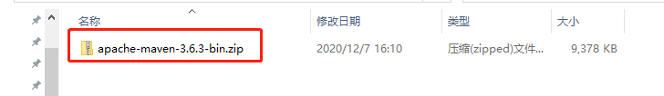

### 2、右击解压缩，注意解压缩过程就是安装过程，注意自己解压后文件的目录

记住自己解压后的文件目录，我是专门有个文件夹存放安装文件的。这个目录以后要经常用到的，可以集中放在某一路径下。

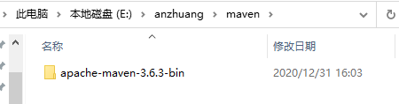

解压好就是安装完成了，下面进行maven的配置

## 四、maven的环境变量配置

### 1、打开高级系统设置界面

右击桌面的“此电脑”图标，点击“属性”，弹出系统窗口，然后点击“高级系统设置”

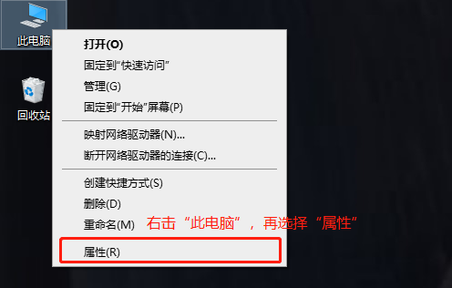

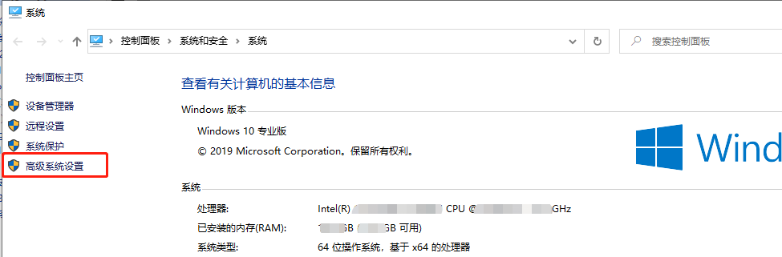

**注意：有时候你桌面上的“此电脑”图标是快捷方式，这样可能就没有“属性”这个选项了，这里提供另一种方法：**

双击桌面“此电脑”图标，打开文件资源管理器，输入：控制面板\\系统和安全\\系统，然后回车就可进入上图界面。

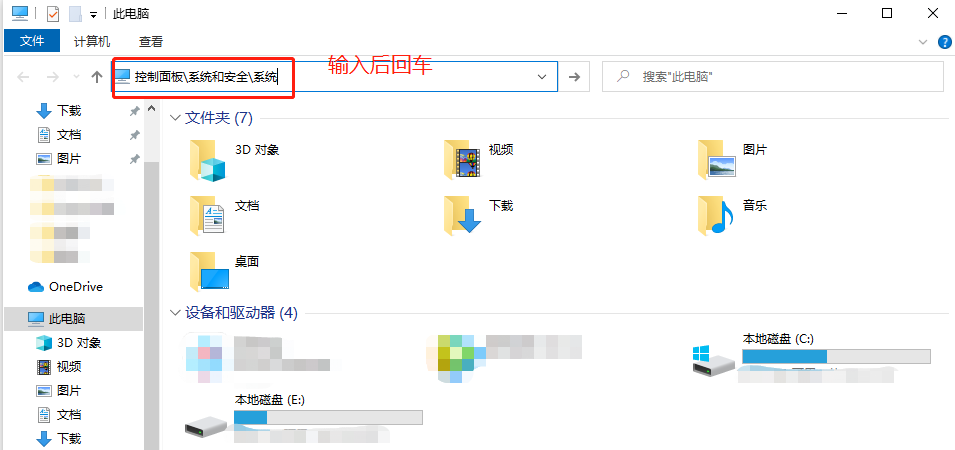

### 2、打开环境变量配置界面

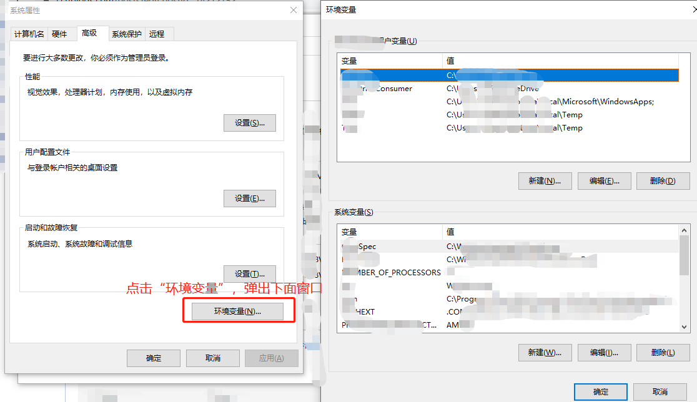

### 3、配置环境变量

在“环境变量”界面中，分为上下两部分，上面部分是“某某某的用户变量”的设置，针对的是当前你登录电脑的账户；下面部分是系统变量的设置，针对的是这台电脑，相当于是所有账户。对于自己使用的电脑来说，建议直接在下面部分的“系统变量”中来配置。下面来以系统变量为例讲解：

#### a、在系统变量中新建一个MAVEN\_HOME变量，设置变量名跟变量值

MAVEN\_HOME这个变量里面可以只存放maven相关的路径配置，方便日后管理。


这个时候在系统变量里面便会多了MAVEN\_HOME这个变量


### b、将MAVEN\_HOME配置到系统环境变量path中

双击path变量，新建一参数，输入%MAVEN\_HOME%\\bin后点击确定即可。


环境变量path的作用：提供windows命令行中指令的可执行文件路径，当我们在命令行中键入指令时，根据环境变量中的path值，找到对应的指令可执行文件进行执行。简单的说就是配置在path中的目录参数，在命令行中的任何目录下都可以使用。

完成以上操作后点击确定保存并关闭配置界面

### 4、检测是否安装配置成功

注意在此步骤前需要保存并关闭上面步骤窗口

#### a、键盘同时按住Windows + r，弹出运行界面。也可以右击“开始”，点击“运行”，弹出界面

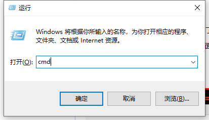

#### b、输入cmd，点击确定打开cmd窗口

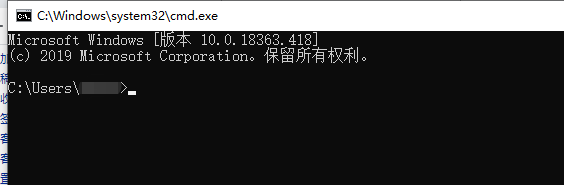

#### c、在cmd窗口中键入mvn -version后回车，如果出现下面的版本号，及说明maven安装成功

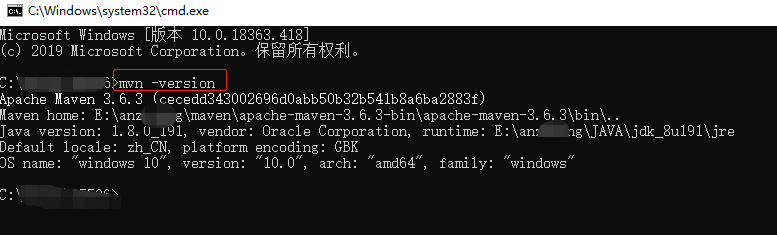

## 五、setting文件配置

这步骤配置主要是针对于maven的使用来配置的，主要包括本地仓库的配置、仓库服务器的配置。

### 1、本地仓库的配置

### a、在一个磁盘中创建一个文件夹，取名repository。（非C盘，且磁盘容量较大的）


### b、打开maven的安装目录，选择conf文件夹中的setting.xml文件

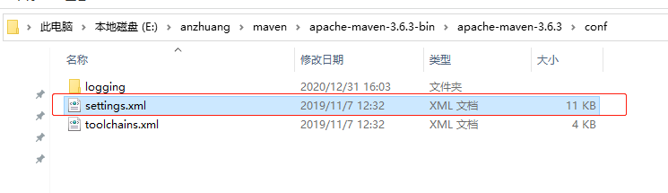

### c、修改文件settings.xml

### 找到settings.xml中的localRepository配置，修改成刚刚创建的文件夹的目录。注意将<localRepository>E:\\repository</localRepository>移出注释！

<localRepository>E:\\repository</localRepository>

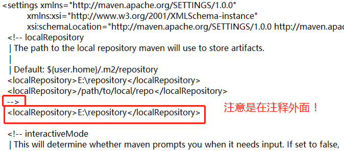

### d、检验下是否已经设置成功

### 保存后控制台输入 mvn help:system


再打开刚刚创建的文件夹，如果里面生成文件，即说明修改成功。

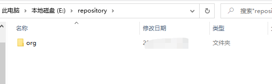

### 2、修改maven的原地址为阿里源

### a、同样打开conf文件夹中的setting.xml文件，找到</mirrors>，在</>上一行中加入下面这段代码即可

```
<mirror>
<id>alimaven</id>
<name>aliyun maven</name>
<url>http://maven.aliyun.com/nexus/content/groups/public/</url>
<mirrorOf>central</mirrorOf>
</mirror>
<mirror>
<id>alimaven</id>
<mirrorOf>central</mirrorOf>
<name>aliyun maven</name>
<url>http://maven.aliyun.com/nexus/content/repositories/central/</url>
</mirror>
```

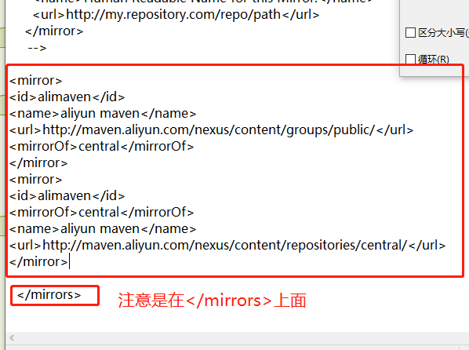

> 当前文档由 [markdown文档下载插件](https://github.com/kscript/markdown-download) 下载, 原文链接: [maven的下载安装配置教程（详细图文）](https://www.cnblogs.com/pengpengdeyuan/p/14217772.html)  