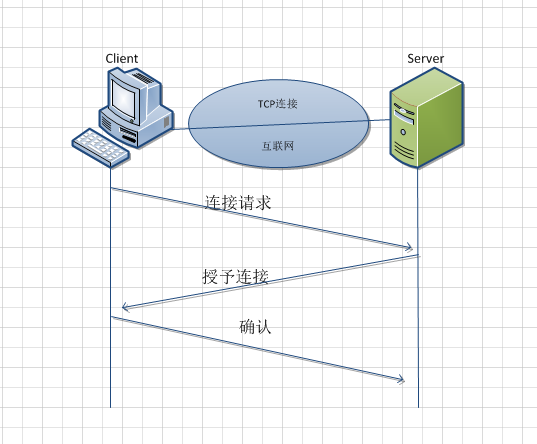
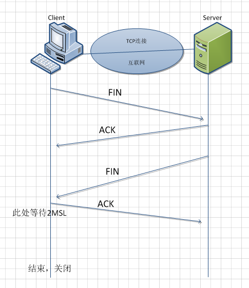

> TCP 是一个面向连接的协议。无论哪一方向另一方发送数据之前，都必须先在双方之间建立一条连接
> IP 是TCP/IP协议族中最为核心的协议。所有的 TCP、UDP、ICMP及IGMP数据都以IP数据报格式传输
> TCP/IP 是供 **已连接因特网** 的计算机进行通信的 **通信协议** 。
> TCP/IP 指 **传输控制协议/网际协议** (Transmission Control Protocol / Internet Protocol)。
> TCP/IP 定义了电子设备（比如计算机）**如何连入因特网** ，以及 **数据如何在它们之间传输的标准** 。

### 特性

TCP: [可靠的, 流控的](https://blog.csdn.net/ifpelset/article/details/15378005)
[超时重传/快速重传/慢启动/滑动窗口](https://blog.csdn.net/shengzhu1/article/details/72598311)
IP:  [不可靠的, 无连接的](https://blog.csdn.net/tennysonsky/article/details/44455189)

### TCP/IP协议栈

*   TCP (传输控制协议) - 应用程序之间通信
*   UDP (用户数据包协议) - 应用程序之间的简单通信
*   IP (网际协议) - 计算机之间的通信
*   ICMP (因特网消息控制协议) - 针对错误和状态
*   DHCP (动态主机配置协议) - 针对动态寻址

TCP/IP 协议采用4层结构，分别是应用层、传输层、网络层和链路层。  
当通过http发起一个请求时，应用层、传输层、网络层和链路层的相关协议，依次对该请求进行包装并携带对应的首部，最终在链路层生成以太网数据包。  
以太网数据包通过物理介质传输给对方主机，对方接收到数据包以后，然后再一层一层采用对应的协议进行拆包，最后把应用层数据交给应用程序处理。  
  

### TCP连接与断开

连接: 三次握手  
  

断开: 四次握手  
  
图片来源 [TCP建立连接和断开连接](https://www.cnblogs.com/GetAlert/p/4807042.html)  

### 参考资料

[TCP的工作机制详解](https://blog.csdn.net/shengzhu1/article/details/72598311)
[TCP/IP协议（二）tcp/ip基础知识](https://www.cnblogs.com/imyalost/p/6139191.html)
[TCP/IP 教程](http://www.w3school.com.cn/tcpip/index.asp)
[深入浅出 TCP/IP 协议栈](http://www.cnblogs.com/onepixel/p/7092302.html)  
