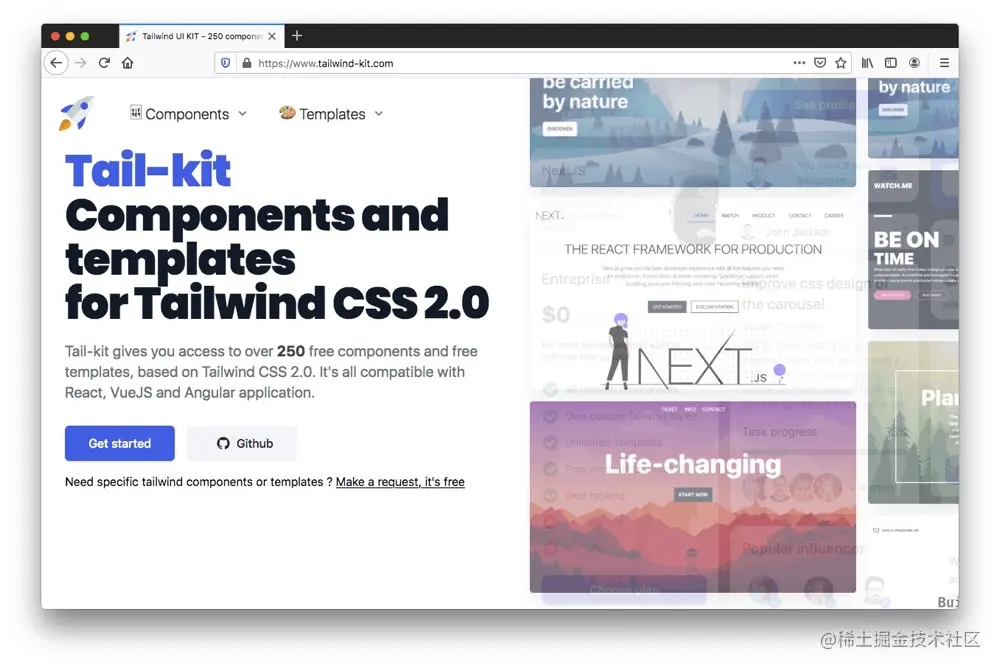
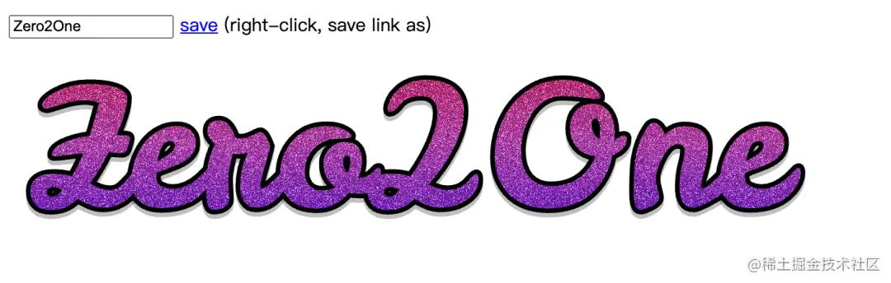

## 一、CSS布局生成器

> Layout：[layout.bradwoods.io/customize](https://layout.bradwoods.io/customize)

它是一个全功能的 CSS 和 JSX 生成器，用于使用 CSS Grid 布局语法生成不同种类的布局，任意修改 Grid 的属性，并且实时展示画面，生成对应代码。当然还有 Flex布局（不过现在还不是很完善）

## 二、Riju

> Riju：[riju.codes/](https://riju.codes/)

Riju是一个继承了224种语言的在线代码运行平台，十分简洁，无广告，非常推荐

## 三、Whirl

> Whirl：[whirl.netlify.app/](https://whirl.netlify.app/)

Whirl是一个CSS动画库，与其它的动画库不一样，它集合了108种加载动画，简洁且独特，值得学习，所有的源代码也都能获取到！

## 四、Pikaday

> Pikaday：[pikaday.com/](https://pikaday.com/)

Pikaday是一个日期选择器，无依赖、轻量（5k）、CSS模块化，样式也很简约，我特别喜欢，令人意外的是，它在Github上竟然斩获了7k+ Star

## 五、Tailwind Components

> Tailwind Components：[tailwindcomponents.com/](https://tailwindcomponents.com/)

Tailwind Components是一个 Tailwind UI 套件，这个网站是一个由社区贡献的各种 Tailwind 组件

## 六、Tail-Kit

> Tail-Kit：[www.tailwind-kit.com/](https://www.tailwind-kit.com/)

Tail-Kit是第一个非常棒的 Tailwind UI组件库，它有超过250个开源组件，同时兼容 React、 Vue 和 Angular

## 七、tidy.js

> tidy.js：[pbeshai.github.io/tidy/](https://pbeshai.github.io/tidy/)

tidy.js是一个用于处理数据相关的 JavaScript 库，它包括70多个不同类别的函数(整理、分组、数学、排序等等)

## 八、party.js

> party.js：[party.js.org/](https://party.js.org/)

party.js还蛮有意思的，你们应该见过很多博客网站，鼠标点击或拖动时会有很多炫酷的动效，这个库就是做这个的，你可以轻松地实现那些效果

## 九、AI去背景

> baseline：[baseline.is/tools/backg…](https://baseline.is/tools/background-remover/)

baseline是一款免费的通过AI来去除图片背景的工具网站，支持JPEG、PNG，最终会返回一个透明背景的PNG图片给你

## 十、Layout patterns

> Layout patterns：[web.dev/patterns/la…](https://web.dev/patterns/layout/)

Layout patterns是 Google Developers 旗下开发者资源中新增的版块，里面列举了使用CSS构建布局UI，现在列举了11种布局~ 后续应该还会持续增加，探索更多可能，建议收藏

## 十一、Lowdefy

> Lowdefy：[lowdefy.com/](https://lowdefy.com/)

Lowdefy是一个开源的低代码框架，通过 YAML 来轻松构建 web 应用、管理面板、 BI 仪表板、工作流和 CRUD 应用

## 十二、uncut

> uncut：[uncut.wtf/](https://uncut.wtf/)

uncut是一个现代字体目录网站，重点是开源，可免费用于个人和商用，看了一下总共收录了90种字体，任君挑选~

## 十三、fetoolkit

> fetoolkit：[www.fetoolkit.io/](https://www.fetoolkit.io/)

fetoolkit是一个前端开发工具箱，收录了20多种编码、图片相关的工具，包括 CSS、 JSON、图标、 SVG、图像压缩、 npm、 regex 等工具

## 十四、Unicode Arrows

> Unicode Arrows：[unicodearrows.com/](https://unicodearrows.com/)

Unicode Arrows是一个收录了各式各样的箭头相关的十六进制代码

## 十五、components AI

> components AI：[components.ai/](https://components.ai/)

components AI是一个主题构建器，包括语法高亮生成器、渐变、阴影工具、SVG 图案生成器、动画背景等等，全部都可以在线调试，非常好用

## 十六、Glitter

> Glitter：[wh0.github.io/glitter/](https://wh0.github.io/glitter/)

Glitter是一个荧光字体生成器，项目不复杂，但很好看，我们可以随意修改文本，最后导出SVG

## 十七、Iconduck

> Iconduck：[iconduck.com/](https://iconduck.com/)

Iconduck是一个开源icon网站，拥有超过100,000个图标，可以通过关键字搜索，并且都可以在商业项目中使用

## 十八、pattern-generator

> pattern-generator：[doodad.dev/pattern-gen…](https://doodad.dev/pattern-generator/)

pattern-generator是一个帮助你生成背景图片的网站，就几十种图案可选，而且每种图案里的元素都可以通过交互按钮任意修改，最后可以导出 JPEG、 PNG、SVG 、CSS背景代码，也支持退出后恢复上一次操作的内容

## 十九、buttons-generator

> buttons-generator：[markodenic.com/tools/butto…](https://markodenic.com/tools/buttons-generator/)

buttons-generator是一个包含了很多种交互形式以及样式的按钮的网站，大概有\*\*120+\*\*种，对于有自定义按钮需求的小伙伴可以作参考

## 二十、Coding Fonts

> Coding Fonts：[coding-fonts.css-tricks.com/fonts/hack/…](https://coding-fonts.css-tricks.com/fonts/hack/?language=html&theme=dark)

Coding Fonts是收集了45种代码字体的网站，大部分都是免费的，当然也有收费的，可以选个心仪的放到自己的编辑器里去（小声bb一句，我还是最喜欢`JetBrains Mono`，免费又好看）

## 二十一、svgrepo

> svgrepo：[www.svgrepo.com/](https://www.svgrepo.com/)

svgrepo是一个 SVG 图标库，坐拥300,000 +免费使用的SVG图标，大部分也都是可以商用的。网站支持搜索，无需登录即可收藏（可能是存的localstorage）~

## 二十一、maplibre

> maplibre：[maplibre.org/](https://maplibre.org/)

maplibre是一个JavaScript世界地图库，开箱即用，同时也支持了IOS和Android的SDK

## 二十二、Dopefolio

> Dopefolio：[github.com/rammcodes/D…](https://github.com/rammcodes/Dopefolio)

Dopefolio是一个开箱即用的官网页面生成器，没有依赖一堆的三方开源库，全部是纯HTML、CSS，所以SEO做的非常好，Lighthouse分数也很高，同时支持页面响应式。有官网页面需求的小伙伴可以尝试使用

## 二十三、animista

> animista：[animista.net/](https://animista.net/)

CSS 动画集，可自由调节动画参数，生成代码片段,用法简单

## 二十四、 CSS Inspiration

> [CSS Inspiration -- CSS灵感](https://csscoco.com/inspiration/)

每次老板都要给你安排各种花里胡哨的样式的时候这里就可以做参考呢

## end

> 当前文档由 [markdown文档下载插件](https://github.com/kscript/markdown-download) 下载, 原文链接: [分享24个前端实用工具给大家](https://juejin.cn/post/7091206280013938718)  