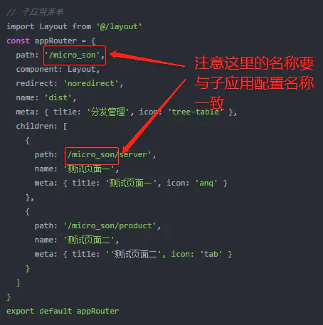

## 什么是微前端

微前端是一种多个团队通过独立发布功能的方式来共同构建现代化 web 应用的技术手段及方法策略。

## 微前端项目搭建流程

本文主要记录[qiankun](https://links.jianshu.com/go?to=https%3A%2F%2Fqiankun.umijs.org%2Fzh%2Fcookbook)与[vue-template](https://links.jianshu.com/go?to=https%3A%2F%2Fe.coding.net%2FJaneHan%2Fvue_template%2Fvue_template.git)相结合实现微服务框架过程。参考文档涉及 [qiankun-TMVC](https://links.jianshu.com/go?to=https%3A%2F%2Fgitee.com%2Ftmvc%2Ftmvc.git)、[qiankun](https://links.jianshu.com/go?to=https%3A%2F%2Fqiankun.umijs.org%2Fzh%2Fguide)、[element-ui](https://links.jianshu.com/go?to=https%3A%2F%2Felement.eleme.io%2F%23%2Fzh-CN%2Fcomponent%2Finstallation)、[vue-element-admin](https://links.jianshu.com/go?to=https%3A%2F%2Fpanjiachen.gitee.io%2Fvue-element-admin-site%2Fzh%2Fguide)

**1、乾坤**  
qiankun 是一个基于 [single-spa](https://links.jianshu.com/go?to=https%3A%2F%2Fgithub.com%2FCanopyTax%2Fsingle-spa) 的[微前端](https://links.jianshu.com/go?to=https%3A%2F%2Fmicro-frontends.org%2F)实现库，旨在帮助大家能更简单、无痛的构建一个生产可用微前端架构系统。

**2、vue-template**  
是用于后台前端解决的方案。它基于vue并使用[element-ui](https://links.jianshu.com/go?to=https%3A%2F%2Felement.eleme.io%2F%23%2Fzh-CN%2Fcomponent%2Finstallation)，借鉴[vue-element-admin](https://links.jianshu.com/go?to=https%3A%2F%2Fpanjiachen.gitee.io%2Fvue-element-admin-site%2Fzh%2Fguide%2F)前端解决方案。

## 项目结构

|项目文件|技术栈|框架|备注|
|---|---|---|---|
|micro-mian|vue.js、qiankun|vue-template|主应用|
|micro-son|vue.js|vue-template|子应用|

`注意:`需要本地安装有node与npm/yarn环境

## 微前端基座-主应用

基座是微前端项目的主应用，主要用于左侧导航栏和右侧内容展示、隐藏，具体配置流程如下：

#### 1、注入依赖

主应用使用`vue-template`作为基础框架， 注入qiankun、 tmvc-base 依赖，这里需要注意qiankun版本，采用2.x以上版本。  
使用命令行安装qiankun依赖：

> npm install qiankun

安装tmvc-base依赖：

> npm install tmvc-base

或是在package.json配置文件按照对应依赖：

> "qiankun": "^2.4.4",  
> "tmvc-base": "^1.0.6",


package.json配置文件

#### 2、配置子应用路由文件

导入子应用路由配置文件至src目录下，复制microRouter文件夹到src目录下，需要根据自己的项目做些更改。  
下载地址：基座路由文件[microRouter](https://links.jianshu.com/go?to=https%3A%2F%2Fgitee.com%2Faigoubuluo_admin%2Fmicro-router.git)


microRouter配置

microRouter->config.json代码如下：

```
{
  "development": {
    "VUE_ELEMENTUI_ADMIN": "//localhost:8098",
    "VUE_SON_APP":"//localhost:8098,
    "TAMIL_APP":"//localhost:8098"
  },
  "production": {
    "VUE_ELEMENTUI_ADMIN": "//localhost:8098",
    "VUE_SON_APP":"//localhost:8098",
    "TAMIL_APP":"//localhost:8098"
  }
}
```

microRouter->index.js文件内容的name与activeRule的名称必须一致，代码如下：

```
// 配置子应用访问地址
import envConfig from './config.json'
// 使用 NODE_ENV 区分不同环境，默认值为 
const ENV = process.env.NODE_ENV || 'development'development
const config = envConfig[ENV]
const {
  VUE_SON_APP
} = config
export default [
  /**
   * name: 微应用名称 - 具有唯一性，为了方便区分，采取和子应用名称
   * entry: 微应用入口 - 通过该地址加载微应用
   * container: 微应用挂载节点 - 微应用加载完成后将挂载在该节点上
   * activeRule: 微应用触发的路由规则 - 触发路由规则后将加载该微应用
   */
  {
    name: 'micro_son',
    entry: VUE_SON_APP,
    container: '#Appmicro',
    activeRule: '#/micro_son'
  }
]
```

#### 3、页面节点挂载

在主内容区域（AppMain.vue）挂载子应用


添加子应用挂载节点

#### 4、路由配置文件

在主应用修改路由配置文件，注入基座配置、子应用路由配置。  
子应用路由配置文件下载地址：[子应用路由文件](https://links.jianshu.com/go?to=https%3A%2F%2Fgitee.com%2Faigoubuluo_admin%2Fmicro-router.git)。


路由配置文件

子应用路由(src\\router\\modules\\dist-menu.js)设置具体借鉴[apps-menu.js](https://links.jianshu.com/go?to=https%3A%2F%2Fgitee.com%2Faigoubuluo_admin%2Fmicro-router.git)。

对应的基座当中设置的子应用名称，子应用路由配置必须与配置的microRouter.js当中的“name“对应起来。



子应用路由配置

## 子应用配置

子应用是以vue-elment框架为主，基于qiankun底层的微前端框架，进行了生命周期、通讯、依赖等一系列封装，方便维护及快速注入到子应用。

#### 1、注入依赖

命令行注入tmvc依赖

> npm install tmvc

或是直接在package.json添加"tmvc": "1.0.16"

#### 2、main.js 配置

在main.js文件中引入tmvc, 并且导出微应用生命周期，具体代码如下：


main.js 配置

```
// 微前端配置文件注入
import tmvc from 'tmvc'
// name 导出微应用生命周期
const { bootstrap, mount, unmount } = tmvc.microMain()
export { bootstrap, mount, unmount }

```

#### 3、vue.config.js 配置文件

需要在vue.config.js设置跨域处理，具体代码如下：


vue.config.js 配置

```java
// 微前端子项目配置注入
const { microConfig } = require('./src/microApp/micro-config.js')
module.exports.devServer.headers = { 
   // 配置跨域 必须
   // 由于qiankun内部请求都是fetch来请求资源，因此子应用必须容许跨域
  'Access-Control-Allow-Origin': '*'
}
// umd格式注入 必须module.exports.publicPath = `//localhost:${port}`
// 端口号配置 不是必须设置
module.exports.configureWebpack.output = microConfig
```

#### 4、子应用配置

下载地址：[micro-config.js](https://links.jianshu.com/go?to=https%3A%2F%2Fgitee.com%2Ftmvc%2Ftmvc-utils.git)


micro-config.js配置

#### 5、隐藏导航菜单

每个独立的子应用都有属于自己的导航菜单，那么就需要我们注入子应用到主应用里时需要将导航菜单隐藏处理，根据public-path里取到的window.**POWERED\_BY\_QIANKUN**值判断当前是否在微应用还是独立运行，这里需做以下操作：


image.png

`注意事项：`  
1、子应用中需要展示在主应用中的路由需要src\\router和src\\router\\modules\\dist-menu.js配置路径一致。  
2、测试\\发版时需要注意src\\microRouter\\config.json下访问路径。  
3、发版后涉及跨域问题，根据发版方式做不同的设置

#### Nginx配置

要求在服务器端的Nginx配置两个不同的server，才能实现微前端作用。例如一个主应用为8089与其中一个微应用微应用绑定在9999服务端口下。  
nginx配置供参考如下：  
（1）主项目配置

```
 server {
  listen       8089;
  server_name  localhost;
  location / {
      root   /usr/local/index;
      index  index.html index.htm;
  }
  #error_page  404              /404.html;
  # redirect server error pages to the static page /50x.html
  #
  error_page   500 502 503 504  /50x.html;
  location = /50x.html {
      root   html;
  }
 }
```

#### Jenkins 云发版配置

在app.js文件加入跨域配置

```
'use strict'

const express = require('express')
const path = require('path')

// Constants
const PORT = 8090
const HOST = '0.0.0.0'

// App
const app = express()
app.all('*', function(req, res, next) {
  res.header('Access-Control-Allow-Origin', '*')
  res.header('Access-Control-Allow-Methods', 'OPTIONS,GET,POST,PUT,DELETE')
  res.header('Access-Control-Allow-Headers', 'Content-Type, Authorization, X-Requested-With')
  if (req.method === 'OPTIONS') {
    return res.send(200)
  }
  next()
})
app.use(express.static(path.join(__dirname, 'dist')))

app.listen(PORT, HOST)
console.log(`Listening at port: ${PORT}`)
```

> 当前文档由 [markdown文档下载插件](https://github.com/kscript/markdown-download) 下载, 原文链接: [微前端：qiankun项目搭建](https://www.jianshu.com/p/5d3ddc5c89b6)  